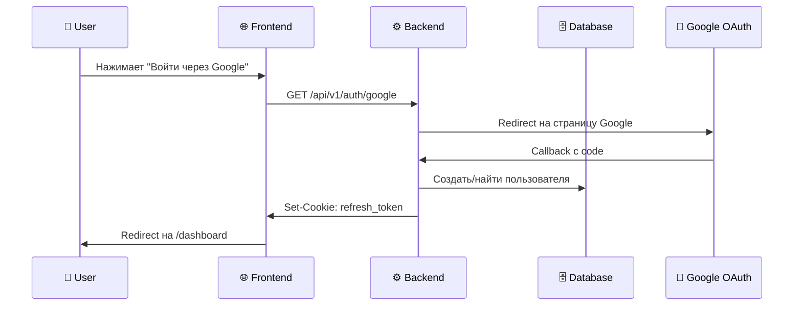
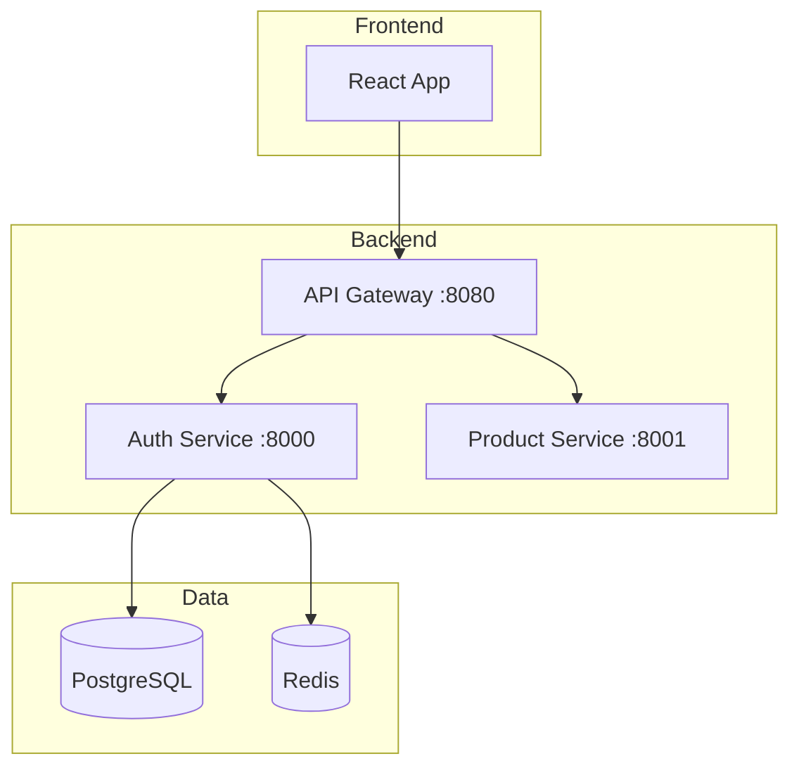
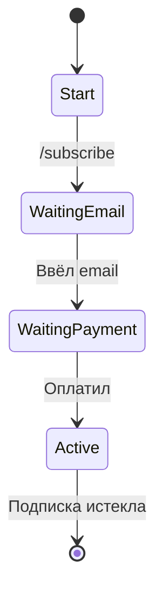

# Создание README.md

Workflow для генерации профессионального README.md с Mermaid-диаграммами.

> [!IMPORTANT]
> **Главный принцип: ЗАДАВАЙ ВОПРОСЫ И ЖДИ ОТВЕТЫ, чтобы сделать качественный результат.**
> Нельзя генерировать README до получения ответов от пользователя!

---

## Step 1: Анализ проекта

Изучи проект **полностью и детально**:

### Обязательно проверить:
- Структура каталогов и файлов (полное дерево)
- `notes/about_project.md` (если есть)
- `pyproject.toml`, `requirements.txt`, `package.json`
- `docker-compose.yml`, `Dockerfile`
- `.env.example` или конфигурационные файлы
- Основные модули, роутеры, сервисы
- Внешние интеграции (OAuth, платёжные системы, API)
- Существующий `README.md` (если есть — запомни содержимое)

### Определить тип проекта:
- **Веб-приложение** (монолит или микросервис)
- **Telegram-бот** (aiogram, python-telegram-bot)
- **CLI-инструмент**
- **Библиотека/пакет**
- **Другое**

### Для каждого типа — свои особенности:

#### Telegram-боты:
- Найди хендлеры, команды (`/start`, `/help`)
- Изучи FSM (конечные автоматы состояний)
- Проверь интеграции (платежи, внешние API)
- Найди middleware, фильтры

#### Микросервисы:
- Найди эндпоинты API
- Изучи взаимодействие с другими сервисами
- Проверь очереди сообщений (RabbitMQ, Kafka)

#### Веб-приложения:
- Изучи роутеры и контроллеры
- Найди модели данных
- Проверь авторизацию/аутентификацию

---

## Step 2: Опрос пользователя

> [!CAUTION]
> **ОБЯЗАТЕЛЬНО задай ВСЕ релевантные вопросы и ДОЖДИСЬ ОТВЕТОВ!**
> НЕ НАЧИНАЙ генерацию README до получения ответов!

### 2.1 Базовые вопросы (задать ВСЕГДА)

**1. Тип проекта:**
- Это самостоятельный проект (монолит/библиотека)?
- Или это микросервис, часть большого приложения?
- Или это Telegram-бот?
- Если микросервис — есть ли ссылка на главный репозиторий? (если нет — оставим TODO)

**2. Краткое описание проекта:**
- Что делает проект? (1-2 предложения)
- Какую проблему решает?
- Для кого предназначен?

**3. Ключевые фичи:**
- Перечисли 3-7 главных возможностей проекта
- Или подтверди/скорректируй список, который я предложу на основе анализа

### 2.2 Вопросы про диаграммы

**4. Sequence Diagram (диаграмма последовательности):**

> [!TIP]
> На основе анализа кода **ПРЕДЛОЖИ пользователю 2-5 вариантов** flow для диаграмм.
> Пользователь может: выбрать из списка, отказаться, или предложить свои.

Спроси:
- Какие основные flow/процессы нужно изобразить?
- Примеры: авторизация, оформление заказа, обработка платежа, FSM-сценарий бота
- Показывать ли в диаграмме: Frontend, Backend, Database, External APIs, Telegram?

**5. Архитектурная диаграмма:**
- Нужна ли общая диаграмма архитектуры (компоненты системы)?
- Для микросервисов: показать взаимодействие с другими сервисами?

### 2.3 Вопросы про оформление

**6. Стиль Tech Stack:**

Покажи пользователю оба варианта прямо в чате и спроси какой выбрать:

---

**Вариант A: Devicon (цветные иконки + подписи)**

<table>
  <tr>
    <td align="center" width="96">
      
      <br>Python
    </td>
    <td align="center" width="96">
      
      <br>FastAPI
    </td>
    <td align="center" width="96">
      
      <br>PostgreSQL
    </td>
  </tr>
</table>

**Вариант B: Shields.io (стандарт индустрии, монохромные)**


**Вариант C: Простая таблица (минималистично)**

| Категория | Технологии |
|-----------|------------|
| Backend | Python 3.12, FastAPI, SQLAlchemy |
| Database | PostgreSQL, Redis |
| DevOps | Docker, Docker Compose |

---

Спроси: **"Какой стиль Tech Stack предпочитаешь: A (Devicon), B (Shields.io) или C (простая таблица)?"**

**7. Table of Contents (оглавление):**
- Нужно ли оглавление? (для маленьких проектов обычно не нужно)

**7. Дополнительные секции (для микросервисов):**
- Нужна ли секция "Зависимости от других сервисов"?

### 2.4 Вопрос про существующий README

**8. Если README.md уже существует:**
- Перезаписать полностью?
- Смержить с существующим контентом (сохранить полезное)?
- Показать что есть сейчас и спросить?

---

## Step 3: Генерация README

После получения ВСЕХ ответов, сгенерируй README.md.

### Общие правила форматирования:

| Правило | Описание |
|---------|----------|
| **Язык** | Русский |
| **Эмодзи** | В меру, только в заголовках секций |
| **Бейджи CI/CD** | НЕ добавлять |
| **Стиль** | Для опытных разработчиков, без разжёвывания |
| **Диаграммы** | Только Mermaid (рендерится в GitHub) |

### Структура README по порядку:

```markdown
# 📦 Название проекта
```

#### Для микросервисов — сразу после заголовка:
```markdown
> 🔗 Микросервис для [название приложения]. 
> Главный репозиторий: [ссылка](url) или `TODO: добавить ссылку`
```

#### Для Telegram-ботов — сразу после заголовка:
```markdown
> 🤖 Telegram-бот для [описание назначения]
```

---

### Секции README (в этом порядке):

#### 1. Оглавление (если пользователь попросил)
```markdown
## 📋 Оглавление

- [Tech Stack](#-tech-stack)
- [Описание](#-описание)
- ...
```

#### 2. Tech Stack

**Если выбран Devicon (Вариант A):**
```html
## 🛠️ Tech Stack

<table>
  <tr>
    <td align="center" width="96">
      
      <br>Python
    </td>
    <td align="center" width="96">
      
      <br>FastAPI
    </td>
    <td align="center" width="96">
      
      <br>PostgreSQL
    </td>
    <td align="center" width="96">
      
      <br>Redis
    </td>
    <td align="center" width="96">
      
      <br>Docker
    </td>
  </tr>
</table>
```

> [!TIP]
> Список всех иконок Devicon: https://devicon.dev/

**Если выбран Shields.io (Вариант B):**
```markdown
## 🛠️ Tech Stack


```

> [!TIP]
> Генератор Shields.io: https://shields.io/badges
> Названия иконок: https://simpleicons.org/

**Если выбрана простая таблица (Вариант C):**
```markdown
## 🛠️ Tech Stack

| Категория | Технологии |
|-----------|------------|
| Backend | Python 3.12, FastAPI, SQLAlchemy |
| Database | PostgreSQL, Redis |
| Bot | aiogram 3.x, FSM |
| Auth | JWT, OAuth 2.0 |
| DevOps | Docker, Docker Compose |
```

#### 3. Описание
```markdown
## 🎯 Описание

[Краткое описание — 1-2 предложения]

[Расширенное описание — что делает, какую проблему решает]
```

**Если пользователь попросил диаграмму для описания — добавить Sequence Diagram:**
```markdown
### Как это работает


```

#### 4. Возможности
```markdown
## ✨ Возможности

- **OAuth 2.0 авторизация** — вход через Google
- **JWT токены** — безопасная аутентификация
- **Ротация токенов** — автоматическое обновление
```

**Если пользователь попросил диаграмму — добавить её здесь**

#### 5. Архитектура
```markdown
## 🏗️ Архитектура


```

**Для микросервисов — добавить таблицу зависимостей:**
```markdown
### Зависимости от других сервисов

| Сервис | Порт | Назначение |
|--------|------|------------|
| API Gateway | 8080 | Маршрутизация запросов |
| Product Service | 8001 | Каталог товаров |
```

**Для Telegram-ботов — показать FSM:**
```markdown
### FSM состояния


```

#### 6. Структура проекта
```markdown
## 📁 Структура проекта

```
project-name/
├── src/
│   ├── api/
│   │   └── v1/
│   │       ├── routes/
│   │       └── dependencies.py
│   ├── core/
│   │   ├── config.py
│   │   └── security.py
│   ├── models/
│   ├── services/
│   └── main.py
├── tests/
├── docker-compose.yml
├── Dockerfile
├── pyproject.toml
└── .env.example
```
```

> [!WARNING]
> **В структуре проекта НЕ использовать эмодзи!**
> Только чистое дерево каталогов.

#### 7. Конфигурация
```markdown
## 🔧 Конфигурация

Скопируй `.env.example` в `.env` и заполни переменные:

| Переменная | Описание | Где получить |
|------------|----------|--------------|
| `GOOGLE_CLIENT_ID` | OAuth Client ID | [Google Cloud Console](https://console.cloud.google.com/apis/credentials) |
| `GOOGLE_CLIENT_SECRET` | OAuth Client Secret | [Google Cloud Console](https://console.cloud.google.com/apis/credentials) |
| `BOT_TOKEN` | Токен Telegram-бота | [@BotFather](https://t.me/BotFather) |
| `DATABASE_URL` | Строка подключения | — |
| `JWT_SECRET` | Секретный ключ | Сгенерировать: `openssl rand -hex 32` |
```

> [!IMPORTANT]
> **Кратко, без разжёвывания!**
> - НЕ объяснять что такое переменная окружения
> - НЕ описывать как создать аккаунт в Google Cloud
> - Только таблица с названием, описанием и ссылкой где взять

#### 8. Установка и запуск
```markdown
## 📦 Установка и запуск

### Разработка

```bash
git clone <repo-url>
cd project-name
cp .env.example .env
# Заполнить .env
docker-compose up -d
```

### Production

```bash
docker-compose -f docker-compose.prod.yml up -d
```
```

> [!IMPORTANT]
> **Для опытных разработчиков!**
> - НЕ писать "Создайте виртуальное окружение"
> - НЕ объяснять что такое Docker
> - НЕ расписывать каждую команду
> - Только необходимые команды

---

## Step 4: Финализация

1. **Покажи** сгенерированный README пользователю в чате
2. **Спроси**, нужны ли правки или дополнения
3. **Внеси** корректировки если нужно
4. **Сохрани** файл `README.md` только после подтверждения

---