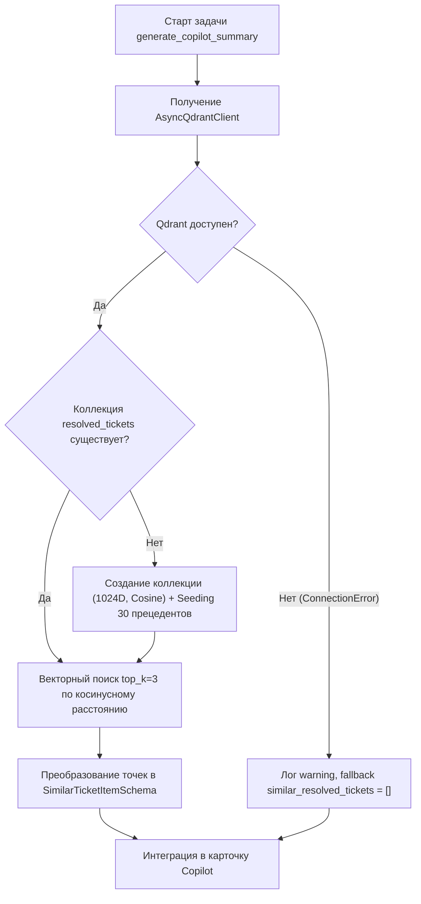
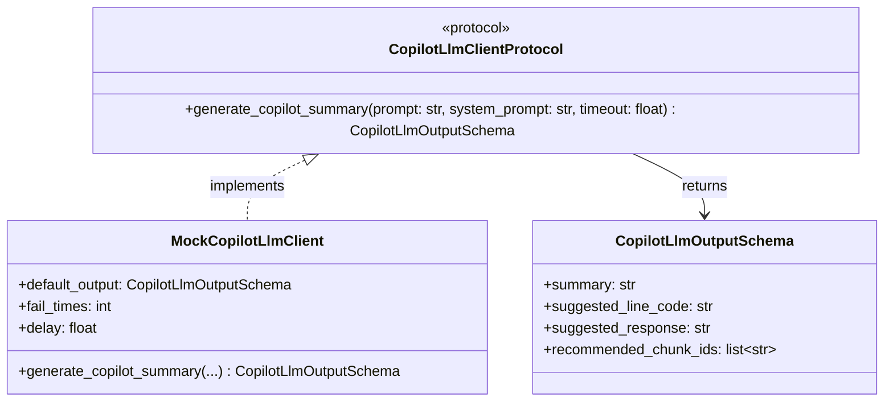

# Архитектурная прожарка (Grill Me): Аналитическая подсказка оператора AI Copilot (HIGH-04)

Документ содержит разбор 5 ключевых архитектурных и инженерных развилок при реализации задачи HIGH-04 («Подготовка аналитической подсказки и контекста для оператора») согласно `BACKEND_ARCHITECTURE.md` (§8.3), `API_SPECIFICATION.md` (§4.3), `QUEUES_SPECIFICATION.md` (§2.2, §5), `DATABASE_SPECIFICATION.md` (§1.1, §3.5) и `RAG_AND_PARSING_SPECIFICATION.md` (§8.3).

---

## 1. Размещение модели `TicketCopilotSummaryModel` и границы зон ответственности

### Контекст коллизии:
В дорожной карте `HACKATHON_ROADMAP.md` за задачу HIGH-04 отвечает Разработчик 1 (RAG, ядро поиска и генерации). При этом за домен `src/operators/` и ведение миграций Alembic отвечает Разработчик 4. В описании HIGH-04 явно зафиксировано:
> *Зона в коде: `backend/src/rag/` (`copilot.py`, `tasks.py`), таблица `ticket_copilot_summaries`.*

Возникает вопрос: где объявлять декларативную модель SQLAlchemy `TicketCopilotSummaryModel` — в `src/operators/models.py` или в `src/rag/models.py`? И как обеспечить прогон тестов без конфликта миграций Alembic?

### Сравнительный анализ:

| Критерий | Вариант А: `src/rag/models.py` | Вариант Б: `src/operators/models.py` (Рекомендуемый) |
|---|---|---|
| **Соответствие спецификации БД** | ❌ Нарушает `DATABASE_SPECIFICATION.md` (§1.1, стр. 37: таблица `ticket_copilot_summaries` закреплена за `src/operators/` и `OperatorRepository`). | ✅ Строго следует утвержденному контракту `DATABASE_SPECIFICATION.md`. |
| **Доменный контекст модуля** | ❌ Модуль `rag` по `CONTEXT-MAP.md` и `rag/CONTEXT.md` является in-process сервисом вычислений без собственных реляционных сущностей. | ✅ В `operators/CONTEXT.md` (строка 16) сущность `TicketCopilotSummaryModel` уже объявлена частью домена operators. |
| **Потребитель данных** | ❌ Данные подсказки отображаются в АРМ оператора через `OperatorService.open_ticket()`. Модуль `chat` и `rag` их повторно не читают. | ✅ Данные читаются репозиторием `OperatorRepository` при открытии тикета оператором. |
| **Связность кода** | ❌ Размазывает операторские сущности по поисковому ядру. | ✅ Высокая сплоченность (high cohesion): все таблицы АРМ находятся в одном домене. |

### Инженерное решение:
1. **Размещение модели:** Модель `TicketCopilotSummaryModel` объявляется строго в [backend/src/operators/models.py](file:///c:/Users/Дмитрий/Desktop/git/test-RAG/backend/src/operators/models.py) в полном соответствии со спецификацией:
   ```python
   class TicketCopilotSummaryModel(Base):
       __tablename__ = "ticket_copilot_summaries"
       
       id: Mapped[uuid.UUID] = mapped_column(Uuid, primary_key=True, default=uuid6.uuid7)
       ticket_id: Mapped[uuid.UUID] = mapped_column(
           Uuid,
           ForeignKey("tickets.id", ondelete="CASCADE"),
           unique=True,
           nullable=False,
           index=True,
       )
       summary: Mapped[str] = mapped_column(Text, nullable=False)
       suggested_line_code: Mapped[str | None] = mapped_column(String(32), nullable=True)
       suggested_response: Mapped[str | None] = mapped_column(Text, nullable=True)
       recommended_chunk_ids: Mapped[list[str]] = mapped_column(
           ARRAY(String(64)), nullable=False, default=list, server_default="{}"
       )
       similar_resolved_tickets: Mapped[list[dict[str, Any]]] = mapped_column(
           JSONB, nullable=False, default=list, server_default="[]"
       )
       created_at: Mapped[datetime] = mapped_column(
           DateTime(timezone=True),
           server_default=func.clock_timestamp(),
           nullable=False,
       )
       
       ticket: Mapped["TicketModel"] = relationship(back_populates="copilot_summary")
   ```
   В [backend/src/chat/models.py](file:///c:/Users/Дмитрий/Desktop/git/test-RAG/backend/src/chat/models.py) к `TicketModel` добавляется отношение:
   ```python
   copilot_summary: Mapped["TicketCopilotSummaryModel | None"] = relationship(
       back_populates="ticket", uselist=False, cascade="all, delete-orphan"
   )
   ```
2. **Прогон тестов без миграций Alembic:**
   В тестовом окружении проекта ([backend/tests/conftest.py](file:///c:/Users/Дмитрий/Desktop/git/test-RAG/backend/tests/conftest.py#L65-L67)) схема БД создается через вызов:
   ```python
   async with engine.begin() as conn:
       await conn.run_sync(Base.metadata.create_all)
   ```
   Все модели, наследующие `Base` и импортированные в runtime, регистрируются в `Base.metadata`. Поэтому для прогона тестов создавать отдельный файл миграции Alembic не требуется — таблица `ticket_copilot_summaries` автоматически создастся в Testcontainers PostgreSQL. Официальный файл миграции оформит Разработчик 4 в рамках сквозного релиза модуля operators.
3. **Границы импортов:**
   Воркер `src/rag/tasks.py` и модуль `src/rag/copilot.py` импортируют `TicketCopilotSummaryModel` только для выполнения операции сохранения (UPSERT).

---

## 2. Инициализация и холодный старт коллекции `resolved_tickets` в Qdrant

### Контекст проблемы:
По спецификации RAG (§8.3) Copilot должен подбирать 3 похожих закрытых обращения из векторной коллекции Qdrant `resolved_tickets`.
Если коллекция в Qdrant не создана заранее:
1. Вызов метода векторного поиска (`client.search` / `client.query_points`) падает с ошибкой `404 Not Found` (`UnexpectedResponseStatus`).
2. Без сидирования база прецедентов будет пустой, и оператор не получит подсказок по типовым сбоям (ЭЦП, КриптоПро).

### Инженерное решение:



1. **Идемпотентная инициализация коллекции (`init_resolved_tickets_collection`):**
   По аналогии с `src/kb/qdrant.py` создается функция инициализации:
   ```python
   RESOLVED_TICKETS_COLLECTION = "resolved_tickets"

   async def ensure_resolved_tickets_collection(
       client: AsyncQdrantClient,
       embedding_dim: int = 1024,
   ) -> None:
       """Проверяет существование коллекции и создает ее при отсутствии с первичным сидированием."""
       try:
           collections = await client.get_collections()
           existing_names = {c.name for c in collections.collections}
           if RESOLVED_TICKETS_COLLECTION not in existing_names:
               await client.create_collection(
                   collection_name=RESOLVED_TICKETS_COLLECTION,
                   vectors_config={
                       "dense": VectorParams(size=embedding_dim, distance=Distance.COSINE),
                   },
               )
               await seed_resolved_tickets(client)
       except Exception as exc:
           logger.warning("Не удалось инициализировать коллекцию resolved_tickets: %s", exc)
   ```

2. **Корпус сидирования прецедентов (`seed_resolved_tickets`):**
   Формируется эталонный датасет из 30+ прецедентов (включая сценарии из демо и спецификации):
   - Сбои КриптоПро CSP и плагина ЭЦП (`0x80090016`, `0x80090008`, `cadesplugin_api.js`);
   - Разногласия к контрактам по 44-ФЗ и 223-ФЗ на Портале поставщиков Москвы;
   - Блокировка личного кабинета при смене реквизитов;
   - Срыв сроков подписания котировочной сессии (< 24 ч).
   
   Точки загружаются через `PointStruct` с детерминированными UUIDv5, вектором от `EmbeddingStub` (1024D) и payload:
   ```json
   {
     "ticket_id": "018e0000-0000-7000-8000-000000000001",
     "support_line": "L2",
     "user_query": "Ошибка 0x80090016 при подписании протокола разногласий",
     "solution_text": "Переустановите плагин КриптоПро ЭЦП Browser plug-in версии 2.0 и добавьте https://zakupki.mos.ru в список доверенных узлов.",
     "category": "digital_signature_plugin"
   }
   ```

3. **Защита от отказа (Graceful Degradation):**
   Поиск оборачивается в блок `try/except`. При падении или таймауте Qdrant возвращается пустой список `similar_resolved_tickets = []`. Падение Qdrant не должно блокировать генерацию текстовой выжимки и черновика ответа.

---

## 3. Синхронизация фонового Copilot и АРМ оператора (Two-Way Race Condition)

### Контекст проблемы:
Между назначением тикета оператору, запуском фоновой задачи в Taskiq и открытием карточки тикета в браузере возникает состояние гонки во времени:

```text
Сценарий А (быстрый оператор):
t0: Эскалация тикета -> Taskiq dispatch + Taskiq copilot
t1: Оператор кликает тикет в АРМ -> POST /api/v1/operators/tickets/{id}/open
t2: Воркер Copilot закончил LLM -> запись в БД -> Redis publish copilot_ready

Сценарий Б (медленный оператор):
t0: Эскалация тикета -> Taskiq copilot
t1: Воркер Copilot закончил LLM -> запись в БД
t2: Оператор открывает тикет -> POST /api/v1/operators/tickets/{id}/open
```

### Решение по сценариям:

#### Сценарий А: Оператор открыл тикет ДО готовности Copilot
1. `POST /api/v1/operators/tickets/{ticket_id}/open` проверяет наличие записи в таблице `ticket_copilot_summaries`.
2. Записи в БД еще нет: эндпоинт возвращает `OperatorTicketWorkspaceSchema` с полем `copilot_summary = None`.
3. Фронтенд оператора отображает интерфейс карточки с индикатором «Идет генерация подсказки...».
4. Когда воркер Taskiq завершает генерацию:
   - Сохраняет подсказку в БД;
   - Проверяет `ticket.assigned_operator_id`;
   - Если оператор назначен, вызывает:
     ```python
     await redis_events.publish_copilot_ready(
         operator_id=ticket.assigned_operator_id,
         data=CopilotSummaryResponseSchema.model_validate(summary_model),
     )
     ```
5. Браузер оператора по открытому постоянному каналу `GET /api/v1/operators/events` получает SSE-событие:
   ```text
   event: copilot_ready
   data: {"summary": "...", "suggested_response": "...", ...}
   ```
6. Интерфейс АРМ подставляет подсказку и черновик в форму ответа без перезагрузки страницы.

#### Сценарий Б: Taskiq закончил генерацию ДО открытия тикета оператором
1. Подсказка уже лежит в таблице `ticket_copilot_summaries`.
2. Оператор вызывает `POST /api/v1/operators/tickets/{ticket_id}/open`.
3. В текущем коде `OperatorService.open_ticket()` захардкожено:
   ```python
   # БЫЛО:
   copilot_summary=None,
   ```
4. **Необходимая доработка:**
   В [backend/src/operators/repository.py](file:///c:/Users/Дмитрий/Desktop/git/test-RAG/backend/src/operators/repository.py#L138-L157) метод `get_ticket_workspace_data` обновляется загрузкой отношения:
   ```python
   stmt = (
       select(TicketModel)
       .where(TicketModel.id == ticket_id)
       .options(
           selectinload(TicketModel.chat)
           .selectinload(ChatModel.client)
           .selectinload(UserModel.client_profile),
           selectinload(TicketModel.line),
           selectinload(TicketModel.copilot_summary), # <--- ПОДГРУЗКА ПОДСКАЗКИ
           selectinload(TicketModel.messages).selectinload(MessageModel.sources),
       )
   )
   ```
   В [backend/src/operators/service.py](file:///c:/Users/Дмитрий/Desktop/git/test-RAG/backend/src/operators/service.py#L394-L404):
   ```python
   # СТАЛО:
   copilot_dto = (
       CopilotSummaryResponseSchema.model_validate(ticket.copilot_summary)
       if ticket.copilot_summary is not None
       else None
   )
   return OperatorTicketWorkspaceSchema(
       ...
       copilot_summary=copilot_dto,
       ...
   )
   ```
   Оператор получает полную готовую подсказку сразу в первом ответе `200 OK` без ожидания SSE.

#### Идемпотентность и защита от повторного запуска (Duplicate Runs):
Если тикет повторно переводится между линиями (ручной трансфер):
- Задача `generate_copilot_summary` выполняет **UPSERT** в `ticket_copilot_summaries` по уникальному `ticket_id` (`INSERT ... ON CONFLICT (ticket_id) DO UPDATE ...`).
- Старая подсказка обновляется с учетом новых сообщений диалога, исключая дубликаты строк.

---

## 4. Интерфейс LLM и Structured Output без внешних API

### Контекст проблемы:
Файл [backend/src/core/llm_client.py](file:///c:/Users/Дмитрий/Desktop/git/test-RAG/backend/src/core/llm_client.py) пуст. Во время тестов и локального запуска ключи GigaChat/YandexGPT отсутствуют. При этом генерация должна возвращать строго типизированную структуру.

### Архитектурное решение:



1. **Pydantic-схема структурированного вывода модели:**
   В `src/rag/schemas.py`:
   ```python
   class CopilotPayloadSchema(BaseModel):
       """Схема полезной нагрузки очереди copilot_queue."""
       ticket_id: UUID = Field(..., description="Идентификатор обращения")


   class CopilotLlmOutputSchema(BaseModel):
       """Структурированный результат генерации LLM для подсказки оператору."""
       summary: str = Field(..., description="Краткая суть проблемы клиента")
       suggested_line_code: Literal["L1", "L2", "L3"] = Field(
           default="L1", description="Рекомендованная линия поддержки"
       )
       suggested_response: str = Field(
           ..., description="Черновик ответа для оператора"
       )
       recommended_chunk_ids: list[str] = Field(
           default_factory=list, description="Идентификаторы нормативных статей"
       )
   ```

2. **Протокол и детерминированный мок-клиент:**
   В `src/rag/copilot.py`:
   ```python
   @runtime_checkable
   class CopilotLlmClientProtocol(Protocol):
       async def generate_copilot_summary(
           self,
           prompt: str,
           system_prompt: str,
           timeout: float = 30.0,
       ) -> CopilotLlmOutputSchema: ...
   ```
   Класс `MockCopilotLlmClient` генерирует контекстно-зависимый черновик:
   - Если в истории есть маркеры ошибок ЭЦП / плагина (`0x...`, «криптопро», «сертификат») -> `suggested_line_code = "L2"`, черновик с инструкцией по переустановке плагина.
   - Если вопрос по срокам / котировочным сессиям -> `suggested_line_code = "L1"`, черновик со статьей регламента Портала поставщиков.
   - Поддерживает параметры `fail_times` и `delay` для тестирования сбоев и таймаутов.

3. **Системный промпт (Few-Shot):**
   Формирует требования: сжать суть до 1–2 предложений, выбрать линию (L1/L2/L3), предложить вежливый черновик ответа и сослаться на `chunk_id` из переданного контекста нормативной базы.

---

## 5. Отказоустойчивость очереди `copilot_queue` (Failure Isolation)

### Контекст проблемы:
Согласно `QUEUES_SPECIFICATION.md` (§5):
- Очередь `copilot_queue` имеет 2 попытки исполнения, фиксированную задержку 3 секунды и общий таймаут 30 секунд.
- Поведение при фатальном сбое:
  > *Запись ошибки в `ticket_copilot_summaries`, оператор работает без подсказки. Сбои генерации подсказки не прерывают обслуживание клиента.*

При этом в `DATABASE_SPECIFICATION.md` колонка `summary` объявлена как `TEXT NOT NULL`, а колонки `status` или `error_message` в таблице отсутствуют.

### Анализ вариантов фиксации сбоя:

| Вариант | Плюсы | Минусы | Вердикт |
|---|---|---|---|
| **1. Изменение схемы БД (добавление `status`, `error_message`)** | Явный статус ошибки в строке. | Требует миграции Alembic и согласования нового ADR. | ❌ Избыточно для хакатона. |
| **2. Падение воркера без сохранения записи в БД** | Простота реализации. | АРМ не узнает, упала ли генерация или еще выполняется; индикатор загрузки может зависнуть. | ❌ Плохой UX оператора. |
| **3. Сохранение деградированной записи (Graceful Fallback)** | 100% совместимость со схемой `DATABASE_SPECIFICATION.md`, идемпотентность, мгновенное снятие ожидания у оператора. | Текст ошибки пишется в поле `summary`. | ✅ Рекомендуемое решение. |

### Инженерное решение при сбое генерации:

1. **Изоляция сбоя в воркере Taskiq:**
   Задача `generate_copilot_summary` оборачивается в блок перехвата исключений:
   ```python
   try:
       # Основной пайплайн: чтение истории -> Qdrant поиск -> LLM генерация
       result = await copilot_service.build_summary(ticket_id)
   except Exception as exc:
       logger.error("Сбой генерации Copilot для тикета %s: %s", ticket_id, exc)
       # Деградированный результат
       result = CopilotSummaryData(
           summary="Не удалось автоматически сформировать сводку обращения.",
           suggested_line_code=None,
           suggested_response=None,
           recommended_chunk_ids=[],
           similar_resolved_tickets=cached_similar_tickets or [],
       )
   ```

2. **Сохранение в БД:**
   В таблицу `ticket_copilot_summaries` сохраняется деградированная запись:
   - `summary`: информационное сообщение о недоступности подсказки;
   - `suggested_response`: `None`;
   - `recommended_chunk_ids`: пустой список `{}`;
   - `similar_resolved_tickets`: если Qdrant успел отработать до падения LLM, похожие закрытые тикеты сохраняются; если Qdrant тоже упал — `[]`.

3. **Событие в канал оператора:**
   Воркер отправляет событие `copilot_ready` в `channel:operator:{operator_id}` с деградированным payload.
   Фронтенд АРМ:
   - Снимает индикатор загрузки («Генерация...»);
   - Не показывает пустой черновик ответа;
   - Отображает найденные прецеденты (если есть);
   - Позволяет оператору вести диалог в обычном режиме без блокировки рабочего места.
