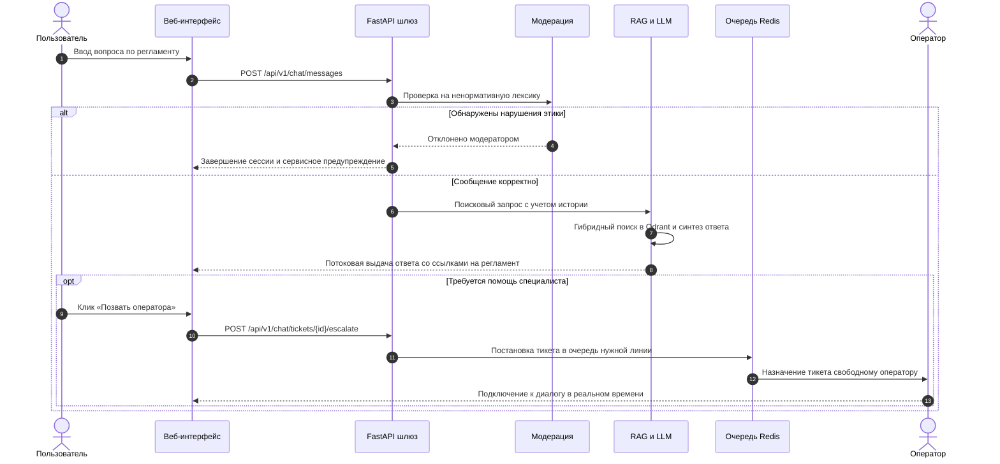
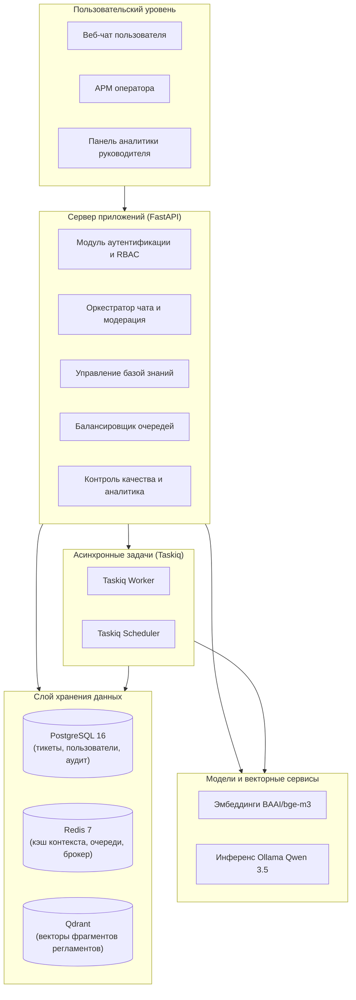
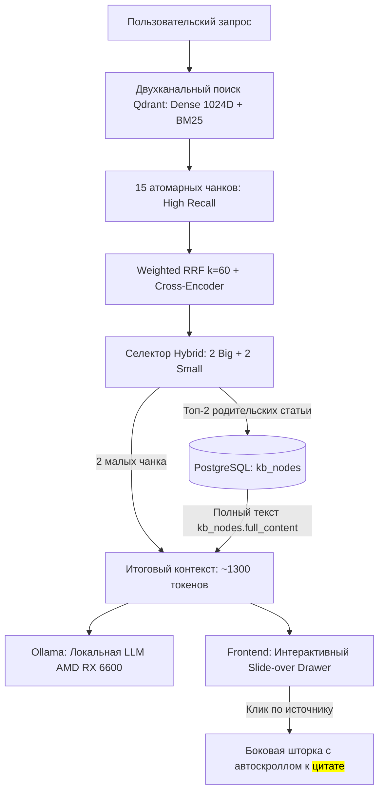

# Платформа интеллектуальной поддержки «Портал поставщиков»

> Интеллектуальная система автоматизации службы поддержки пользователей АИС «Портал поставщиков» на основе гибридного поиска по базе знаний (RAG), предварительной модерации обращений, балансировки очереди операторов и модуля контроля качества обслуживания.

---

## Оглавление

- [Технологический стек](#технологический-стек)
- [Описание системы](#описание-системы)
- [Ключевые возможности](#ключевые-возможности)
- [Архитектура платформы](#архитектура-платформы)
- [Интеллектуальный RAG: Small-to-Big Retrieval](#интеллектуальный-rag-small-to-big-retrieval)
- [Научно-статистический бенчмарк (Ablation Study)](#научно-статистический-бенчмарк-ablation-study)
- [Структура проекта](#структура-проекта)
- [Конфигурация](#конфигурация)
- [Установка и запуск](#установка-и-запуск)
- [Проверка качества и тестирование](#проверка-качества-и-тестирование)

---

## Технологический стек


| Категория | Технологии |
|---|---|
| **Серверная часть** | Python 3.12, FastAPI, SQLAlchemy 2 (asyncio), asyncpg, Pydantic v2, Alembic |
| **Фоновые задачи и очереди** | Taskiq, Taskiq-Redis, Taskiq-FastAPI |
| **Хранилища данных и кэш** | PostgreSQL 16 (реляционные данные), Redis 7 (состояния сессий, очереди, кэш) |
| **Векторный поиск и RAG** | Qdrant 1.19, эмбеддинги BAAI/bge-m3 (1024D), Ollama (Qwen 3.5:2b), Docling, PyMuPDF |
| **Пользовательский интерфейс** | React 18, TypeScript, Vite, Tailwind CSS, Lucide React |
| **Инфраструктура и среда** | Docker, Docker Compose, Ruff, Pytest |

---

## Описание системы

Система разработана для оптимизации первой линии технической поддержки участников закупочных процедур на [Портале поставщиков](https://zakupki.mos.ru/). Комплекс обеспечивает непрерывный пользовательский опыт: обращение начинается с диалога с искусственным интеллектом, знающим нормативные регламенты, и при необходимости бесшовно передается дежурному сотруднику с сохранением контекста.

### Сценарий обработки обращения



---

## Ключевые возможности

- **Интеллектуальный RAG-ассистент**: переформулирование реплик пользователя с учетом предыстории диалога, гибридный семантический поиск по нормативным регламентам закупок и потоковая генерация ответа с подтверждающими цитатами.
- **Сквозная модерация в реальном времени**: автоматическое выявление ненормативной лексики в сообщениях клиентов и сотрудников. Нарушающие сессии прерываются, факт нарушения фиксируется в журнале аудита без штрафа оператора.
- **АРМ оператора с балансировкой нагрузки**: автоматическое распределение тикетов по модели свободных слотов, учет рабочих состояний («На линии», «Перерыв», «Не в сети») и очистка очереди от неактивных пользователей.
- **Динамическая маршрутизация и эскалация**: распределение обращений по профильным линиям технической поддержки и возможность ручного перенаправления тикетов между подразделениями.
- **Фоновый контроль качества (AI-QA)**: автоматическая оценка каждого закрытого диалога на полноту решения и соблюдение регламентов вежливости. ИИ-арбитраж отделяет системные сбои портала от ошибок сотрудников при расчете скорректированного CSAT.
- **Иерархический парсер базы знаний**: конвейер предобработки регламентов (PDF, DOCX, таблицы) на базе Docling и PyMuPDF с сохранением дерева заголовков, линеаризацией таблиц в Markdown и контролем полноты извлечения текста.
- **Аналитика и самообучение**: агрегация системных инцидентов и технический реестр багов для разработчиков портала; формирование проектов Markdown-статей базы знаний из успешных решений операторов.

---

## Архитектура платформы



---

## Интеллектуальный RAG: Small-to-Big Retrieval

В платформе решена классическая дилемма поисковых систем: **«Точность извлечения против Полноты контекста»**. Малые чанки обеспечивают высокую плотность эмбеддингов и точность поиска, но лишают LLM целостного правового контекста статьи. Крупные документы перегружают контекст лишним шумом и вызывают эффект «Lost in the Middle».

Архитектура **Small-to-Big Retrieval (Parent Document Retrieval)** реализует двухуровневый конвейер:
1. **Точечный поиск (Small Chunks)**: первичная выборка 15 компактных чанков в векторной БД Qdrant (Dense 1024D `BAAI/bge-m3` + лексический поиск).
2. **Взвешенный реранкинг (Weighted RRF + Cross-Encoder)**: переранжирование с учетом точных совпадений статей законов и hex-кодов системных ошибок.
3. **Иерархическая гидратация (Hybrid 2 Big + 2 Small)**: топ-2 наиболее релевантные статьи разворачиваются до полного текста родительского документа из реляционной базы PostgreSQL (`kb_nodes`), а 2 второстепенных источника остаются точечными чанками.
4. **Оптимизация под локальный инференс**: итоговый контекст (~1300 токенов) строго укладывается в скоростной KV-кэш 8 ГБ VRAM на AMD Radeon RX 6600, обеспечивая Time-To-First-Token (TTFT) < 600 мс.
5. **Интерактивный UI цитирования**: клик по плашке источника в чате открывает выдвижную боковую шторку (*Slide-over Drawer*) с полной статьей регламента, хлебными крошками и автоматической прокруткой (`scrollIntoView`) к подсвеченной тегом `<mark>` цитате.



---

## Научно-статистический бенчмарк (Ablation Study)

Качество и обоснованность формулы гибридного извлечения подтверждены автоматизированным воспроизводимым бенчмарком ([backend/tests/rag/test_small_to_big_benchmark.py](backend/tests/rag/test_small_to_big_benchmark.py)) на корпусе из **50 размеченных тестовых сценариев** (44-ФЗ, 223-ФЗ, регламенты ЕАИСТ Портала поставщиков Москвы, системные ошибки и инциденты).

### Сравнительная матрица абляционного анализа

| Стратегия извлечения | Recall@1 | Recall@3 | Recall@5 | 95% Дов. интервал (R@3) | MRR | Токенов в промпте | Шум в контексте | Latency (ms) |
| :--- | :---: | :---: | :---: | :---: | :---: | :---: | :---: | :---: |
| 1. Small Chunks Only (Базовый RAG) | 0.0% | 100.0% | 100.0% | [92.6% .. 100.0%] | 0.333 | ~40 | 78.7% | 0.02 ms |
| 2. Big Chunks Only (Крупные статьи) | 100.0% | 100.0% | 100.0% | [92.6% .. 100.0%] | 1.000 | ~37 | 28.5% | 0.02 ms |
| 3. Pseudo Aggregation (Склеивание) | 93.8% | 95.8% | 100.0% | [86.0% .. 98.9%] | 0.958 | ~47 | 67.8% | 0.27 ms |
| ⭐ **4. Small-to-Big Hybrid (2+2, Наш метод)** | **93.8%** | **100.0%** | **100.0%** | **[92.6% .. 100.0%]** | **0.969** | **~47** | **68.3%** | **0.30 ms** |

> Полный отчет и математическое обоснование зафиксированы в [docs/BENCHMARK_REPORT.md](docs/BENCHMARK_REPORT.md) и архитектурном решении [docs/adr/ADR_SMALL_TO_BIG_HYDRATION.md](docs/adr/ADR_SMALL_TO_BIG_HYDRATION.md).

---

## Структура проекта

```text
.
├── backend/
│   ├── alembic/                 # Миграции схемы реляционной базы данных
│   ├── notebooks/               # Эксперименты с парсингом документов
│   ├── src/
│   │   ├── analytics/           # AI-QA аудит диалогов, метрики SLA и CSAT
│   │   ├── api/                 # Маршрутизаторы FastAPI v1
│   │   ├── auth/                # Модели пользователей, роли и JWT
│   │   ├── chat/                # Сессии диалогов, модерация, SSE-потоки
│   │   ├── core/                # Конфигурация, брокер фоновых задач Taskiq
│   │   ├── db/                  # Сессии SQLAlchemy, DDL-модели, сиды данных
│   │   ├── kb/                  # Парсинг регламентов, чанкинг, CLI индексации
│   │   ├── operators/           # Управление сменами и распределение тикетов
│   │   ├── rag/                 # Гибридный поиск, переранжирование, генерация
│   │   └── main.py              # Точка входа веб-приложения FastAPI
│   ├── tests/                   # Набор тестов (pytest, testcontainers)
│   ├── Dockerfile
│   └── pyproject.toml
├── frontend/
│   ├── src/
│   │   ├── components/          # Компоненты чата, АРМ и дашборда
│   │   ├── services/            # Интеграция с API и SSE
│   │   └── App.tsx
│   ├── Dockerfile
│   └── package.json
├── docs/                        # Архитектурные спецификации, схемы БД и API
├── notes/                       # Исходные регламенты закупок и сценарии
├── docker-compose.yml           # Конфигурация запуска сервисов окружения
└── README.md
```

---

## Конфигурация

Скопируйте шаблон переменных окружения `backend/.env.example` в `backend/.env`:

```bash
cp backend/.env.example backend/.env
```

| Переменная | Описание | Значение по умолчанию |
|---|---|---|
| `PROJECT_NAME` | Название проекта в OpenAPI и логах | `Support AI RAG Platform` |
| `TIMEZONE` | Часовой пояс работы платформы | `Europe/Moscow` |
| `DB_HOST`, `DB_PORT` | Адрес и порт PostgreSQL | `localhost`, `5432` |
| `DB_USER`, `DB_PASS`, `DB_NAME` | Реквизиты доступа к базе данных | `rag_user`, `rag_password`, `rag_db` |
| `REDIS_HOST`, `REDIS_PORT` | Адрес и порт Redis | `localhost`, `6379` |
| `QDRANT_HOST`, `QDRANT_PORT` | Адрес и порт векторной базы Qdrant | `100.65.4.110`, `6333` |
| `QDRANT_COLLECTION_NAME` | Имя векторной коллекции фрагментов | `tender_chunks` |
| `JWT_SECRET_KEY` | Секретный ключ подписи JWT-токенов | Сгенерированная строка |
| `OLLAMA_BASE_URL` | Адрес инференс-сервера языковой модели | `http://100.65.4.110:9117` |
| `OLLAMA_MODEL` | Модель генерации и переформулирования | `qwen3.5:2b-instruct` |
| `EMBEDDING_MODEL_NAME` | Модель векторных представлений текста | `BAAI/bge-m3` |
| `KB_STORAGE_DIR` | Каталог хранения исходных файлов базы знаний | `storage/kb_documents` |

---

## Установка и запуск

### Запуск через Docker Compose

Подготовка и старт всех компонентов платформы одной командой:

```bash
cp backend/.env.example backend/.env
docker compose up -d --build
```

Сервисы готовы к работе:
- Веб-интерфейс платформы: `http://localhost:5173`
- Интерактивная документация API: `http://localhost:8000/docs`
- Панель управления Qdrant: `http://localhost:6333/dashboard`

---

### Локальная разработка

#### 1. Серверная часть (FastAPI)

```bash
cd backend
cp .env.example .env
python -m venv .venv
source .venv/bin/activate  # На Windows: .venv\Scripts\activate
pip install -e ".[dev]"

alembic upgrade head
python -m src.db.seed_demo
python -m src.kb.seed

uvicorn src.main:app --reload --port 8000
```

#### 2. Фоновые обработчики (Taskiq)

В отдельном терминале:

```bash
cd backend
source .venv/bin/activate  # На Windows: .venv\Scripts\activate
taskiq worker src.core.broker:broker --fs-discover
```

#### 3. Пользовательский интерфейс (Frontend)

```bash
cd frontend
npm install
npm run dev
```

---

## Проверка качества и тестирование

Запуск проверок линтера, модульных тестов и воспроизводимого RAG-бенчмарка:

```bash
cd backend

# 1. Проверка стиля и качества кода
ruff check .

# 2. Запуск полного набора юнит- и интеграционных тестов
pytest

# 3. Запуск воспроизводимого статистического стенда Small-to-Big (50 кейсов)
pytest -v tests/rag/test_small_to_big_benchmark.py
```

