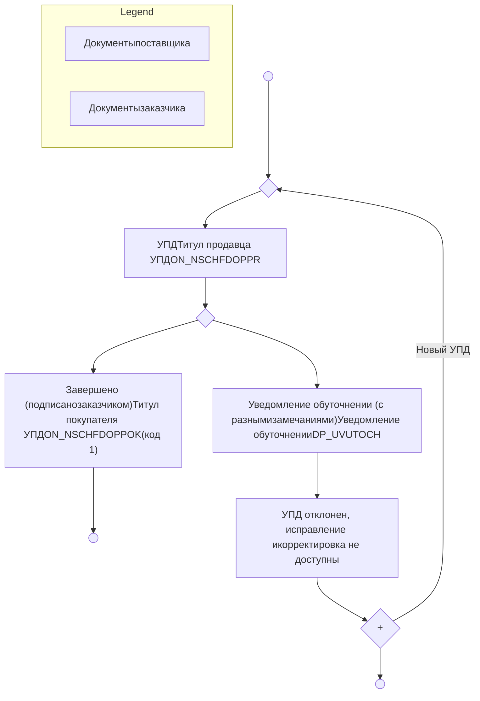
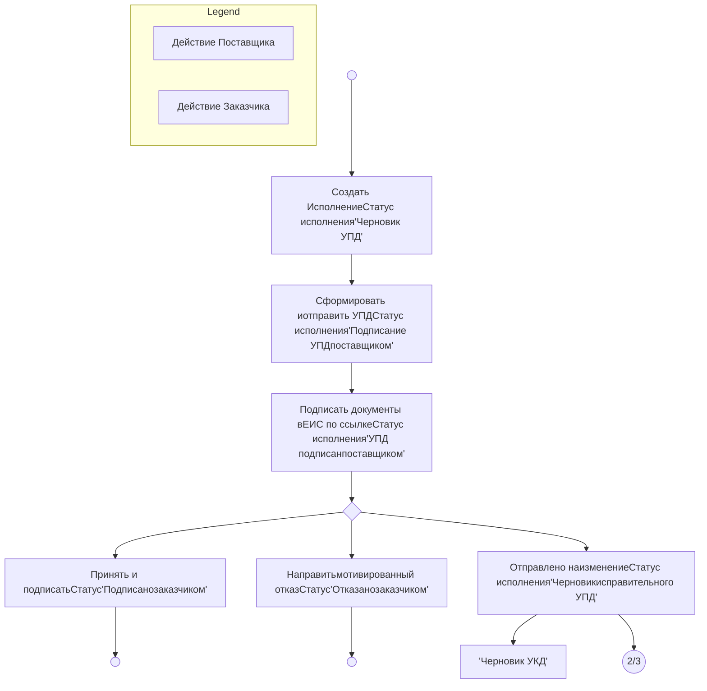
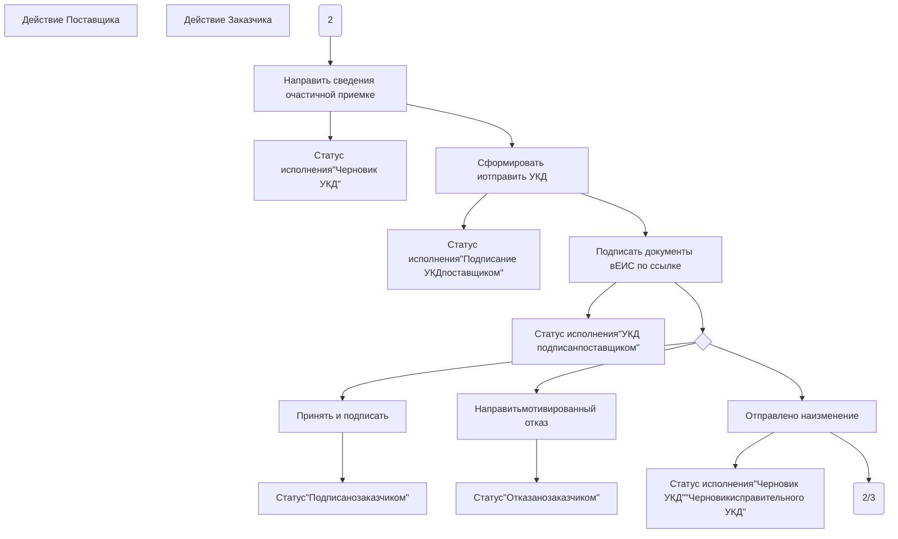
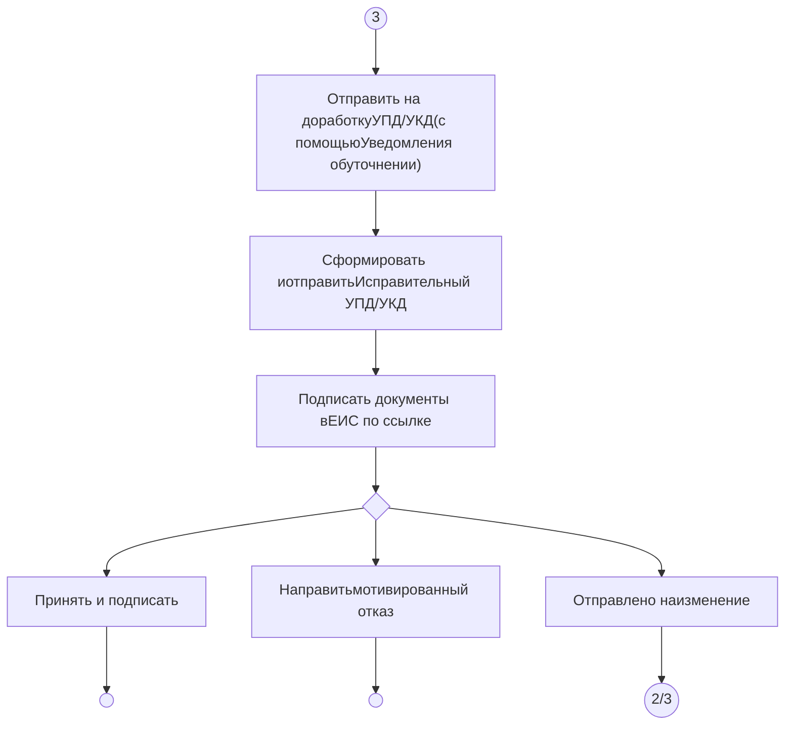

11.08.2026v11

# ПОРТАЛ ПОСТАВЩИКОВ МОСКВЫ

## ИНСТРУКЦИЯ ПОСТАВЩИКА ПО РАБОТЕ С ЭЛЕКТРОННЫМ ИСПОЛНЕНИЕМ КОНТРАКТОВ НА ПОРТАЛЕ ПОСТАВЩИКОВ

Москва

2026

---

2

**СОДЕРЖАНИЕ**

1 Термины и сокращения ................................................................................................................................... 4
2 Аннотация......................................................................................................................................................... 5
3 Видеоролики и материалы вебинаров......................................................................................................... 6
4 Документы об Электронном исполнении .................................................................................................... 7
5 Перед началом работы.................................................................................................................................... 9
    5.1 Каждому поставщику необходимо....................................................................................................... 9
    5.2 Для исполнения через ЕИС необходимо ............................................................................................ 9
    5.3 Для исполнений через Диадок необходимо ..................................................................................... 14
    5.4 Для исполнений через Калуга Астрал необходимо ......................................................................... 15
6 Создание и отправка Исполнения Поставщиком на ПП .......................................................................... 16
    6.1 Создание нового Исполнения ............................................................................................................. 16
    6.2 Заполнение данными Исполнения для ЕИС...................................................................................... 19
    6.3 Завершение редактирования и отправка документа ........................................................................ 32
    6.4 Заполнение данными Исполнения для Калуга Астрал..................................................................... 32
    6.5 Подписание документа......................................................................................................................... 45
    6.6 Ошибка при отправке документа ........................................................................................................ 46
    6.7 Действия Поставщика по результатам действий Заказчика ........................................................... 46
7 Доступные действия Поставщика и схемы процессов ............................................................................. 48
    7.1 Схема отправки документов между Поставщиком и Заказчиком ................................................... 48
    7.2 Схемы процессов работы Поставщика с Исполнением .................................................................. 52
    7.3 Список доступных Поставщику действий в зависимости от статуса Исполнения ....................... 55
8 Отдельные сценарии работы:...................................................................................................................... 57
    8.1 Крупный налогоплательщик. Организация имеет 2 и более КПП ................................................ 57
    8.2 Создание СТЕ для УПД по конкурентным процедурам ................................................................. 60
    8.3 Превышено допустимое количество и/или стоимость при отправке исполнения из ПП в ЕИС... 62
    8.4 Уполномоченные подписанты не зарегистрированы на Портале поставщиков ........................... 66
    8.5 Заполнение сведений о лекарственном препарате............................................................................ 67
    8.6 СТП ЕИС запрашивает 2 xml или ИдТрПакет .................................................................................. 68
    8.7 Электронное исполнение для поставщиков, являющихся филиалами ........................................... 69
    8.8 Исправление и корректировка после подписания заказчиком ........................................................ 70
    8.9 Как работать со сметой, если 2000 позиций, и что с СТЕ................................................................ 71
    8.10 Удаление неиспользуемого Исполнения ......................................................................................... 79
    8.11 Внесение изменение в отправленное, но ещё не подписанное исполнение ................................ 79
    8.12 Заполнение страны происхождения товара ..................................................................................... 80
    8.13 Заполнение сведений о транспортировке ........................................................................................ 80
    8.14 Заполнение сведений о таможенной декларации и о прослеживаемых товарах ......................... 81
    8.15 Заполнение сведений о маркировке товара ..................................................................................... 82
    8.16 Заполнение СТЕ с помощью загрузки файла .................................................................................. 86
    8.17 Заполнение RFID-метки и гарантийного срока для товаров МАФ ............................................... 87
    8.18 Исполнение с множеством мест поставки и грузополучателей .................................................... 87

---

3

---

4

## 1 Термины и сокращения

В настоящем документе приняты термины и сокращения, представленные в таблице ниже.

**Таблица 1 – Перечень терминов и сокращений**

| №п/п | Термин                                                  | Определение                                                                                                                                                                                                                                                                             |
| ---- | ------------------------------------------------------- | --------------------------------------------------------------------------------------------------------------------------------------------------------------------------------------------------------------------------------------------------------------------------------------- |
| 1    | ЕИС                                                     | Официальный сайт Единой информационной системы в сфере закупок (www\.zakupki.gov.ru)                                                                                                                                                                                                    |
| 2    | Калуга Астрал                                           | Оператор электронного документа оборота (www\.astral.ru)                                                                                                                                                                                                                                |
| 3    | ИНН                                                     | Идентификационный номер налогоплательщика                                                                                                                                                                                                                                               |
| 4    | Исполнение                                              | Документ электронного исполнения, имеющий один из типов в зависимости от контекста: УПД, Исправительный УПД, УКД, Исправительный УКД.                                                                                                                                                   |
| 5    | КПП                                                     | Код причины постановки на учет                                                                                                                                                                                                                                                          |
| 6    | ЛК                                                      | Личный кабинет                                                                                                                                                                                                                                                                          |
| 7    | ЛКП                                                     | Личный кабинет Поставщика                                                                                                                                                                                                                                                               |
| 8    | МАФ                                                     | Малая архитектурная форма                                                                                                                                                                                                                                                               |
| 9    | НДС                                                     | Налог на добавленную стоимость                                                                                                                                                                                                                                                          |
| 10   | Подсистема «Портал поставщиков», Портал, Подсистема, ПП | Подсистема «Портал поставщиков»                                                                                                                                                                                                                                                         |
| 11   | СТЕ, Стандартная товарная единица, Товар                | Позиция каталога товаров, работ и услуг Портала, которые могут закупаться для нужд Заказчиков, обозначающая единичный товар, работу или услугу, содержащая описание позиции, ее характеристики, изображение, а также наличие связи с предложением Поставщика (офертой) при его наличии. |
| 12   | СТП                                                     | Служба технической поддержки                                                                                                                                                                                                                                                            |
| 13   | УКД                                                     | Универсальный корректировочный документ                                                                                                                                                                                                                                                 |
| 14   | Исправительный УКД, УКДи                                | Частная форма УКД, вносит исправления после перехода на работу с УКД                                                                                                                                                                                                                    |
| 15   | УПД                                                     | Универсальный передаточный документ                                                                                                                                                                                                                                                     |
| 16   | Исправительный УПД, УПДи                                | Частная форма УКД, вносит исправления при работе с УПД                                                                                                                                                                                                                                  |
| 17   | ЭДО                                                     | Электронный документооборот                                                                                                                                                                                                                                                             |
| 18   | ЭИ                                                      | Электронное исполнение                                                                                                                                                                                                                                                                  |


---

5

## 2 Аннотация

Документ предназначен для описания действий пользователя Поставщика на Портале поставщиков при работе с электронным исполнением контрактов через ЕИС и Калуга Астрал в качестве оператора ЭДО.

Документ содержит:

* Обучающие видеоролики и материалы вебинаров по ЭИ через ПП;
* Нормативные акты по ЭИ;
* Обязательные шаги, которые необходимо выполнить поставщику перед началом выставления документов электронного актирования на Портале поставщиков;
* Инструкцию по созданию исполнений и заполнению полей;
* Схемы сценариев работы и перечень доступных действий поставщика;
* Разбор нестандартных случаев и часто повторяющихся вопросов.

---

6

## 3 Видеоролики и материалы вебинаров

Доступны ознакомительные видеоролики, записи вебинаров и материалы вебинаров (Таблица 2):

**Таблица 2 – Ознакомительные видеоролики**

| №  | Описание                                                                               | Ссылка                                                                  |
| -- | -------------------------------------------------------------------------------------- | ----------------------------------------------------------------------- |
| 1) | Видео о работе в интерфейсе с текстовыми комментариями и озвучкой                      | \[видео]\(https\://disk.yandex.ru/i/RMlnCHMjDaj1\_w)                    |
| 2) | Вебинар 19.04.2022 процесс документооборота УПД и УКД от начала до конца - видео       | \[запись видео 19.04.2022]\(https\://disk.yandex.ru/i/-gO\_QTy68ye-\_g) |
| 3) | Вебинар 19.04.2022 процесс документооборота УПД и УКД от начала до конца - презентация | \[презентация 19.04.2022]\(https\://disk.yandex.ru/i/1MNM6Sp4AIagUg)    |


---

7

## 4 Документы об Электронном исполнении

Работа электронного документооборота по электронному исполнению контрактов основана на следующих документах (Таблица 3):

**Таблица 3 – Документация Электронного документооборота**

| №  | Наименование документа                                                                                                                                                                                                                                                                                                                                                                                              | Суть документа                                                                                 | Ссылка                                                                                                                                                                                                       |
| -- | ------------------------------------------------------------------------------------------------------------------------------------------------------------------------------------------------------------------------------------------------------------------------------------------------------------------------------------------------------------------------------------------------------------------- | ---------------------------------------------------------------------------------------------- | ------------------------------------------------------------------------------------------------------------------------------------------------------------------------------------------------------------ |
| 1. | Приказ Минфина России от 05.02.2021 N 14н "Об утверждении Порядка выставления и получения счетов-фактур в электронной форме по телекоммуникационным каналам связи с применением усиленной квалифицированной электронной подписи"                                                                                                                                                                                    | Об обмене данными между поставщиком и заказчиком через оператора ЭДО (порядок действий, сроки) | https\://www\.garant.ru/products/ipo/prime/doc/400340257                                                                                                                                                     |
| 2. | Постановление Правительства РФ от 26.12.2011 N 1137 (ред. от 02.04.2021) "О формах и правилах заполнения (ведения) документов, применяемых при расчетах по налогу на добавленную стоимость" (раздел «II. Правила заполнения счета-фактуры, применяемого при расчетах по налогу на добавленную стоимость»)                                                                                                           | Правила заполнения полей печатной формы УПД                                                    | \[http\://www\.consultant.ru/document/cons\_doc\_LAW\_124837/e9cfa13ee36b49d1d609bf78f5ae1e39726518af]\(http\://www\.consultant.ru/document/cons\_doc\_LAW\_124837/e9cfa13ee36b49d1d609bf78f5ae1e39726518af) |
| 3. | Приказ ФНС России от 19.12.2018 № ММВ-7-15/820@ «Об утверждении формата счета-фактуры, формата представления документа об отгрузке товаров (выполнении работ), передаче имущественных прав (документа об оказании услуг), включающего в себя счет-фактуру, и формата представления документа об отгрузке товаров (выполнении работ), передаче имущественных прав (документа об оказании услуг) в электронной форме» | Правила заполнения xml формы УПД                                                               | https\://normativ.kontur.ru/document?moduleId=1\&documentId=328588                                                                                                                                           |
| 4. | Файл XSD для Приказа ФНС России от 19.12.2018 № ММВ-7-15/820@                                                                                                                                                                                                                                                                                                                                                       | XSD схема, которой должен соответствовать xml файл УПД                                         | \[https\://data.nalog.ru/html/sites/www\.new\.nalog.ru/xsd/ON\_NSCHFDOPPR\_1\_997\_01\_05\_01\_02.xsd]\(https\://data.nalog.ru/html/sites/www\.new\.nalog.ru/xsd/ON\_NSCHFDOPPR\_1\_997\_01\_05\_01\_02.xsd) |
| 5. | Приказ ФНС России от 12.10.2020 № ЕД-7-26/736@ «Об утверждении формата корректировочного счета-фактуры, формата представления документа, подтверждающего согласие (факт уведомления) покупателя на изменение стоимости                                                                                                                                                                                              | Правила заполнения xml формы УПД                                                               | \[https\://www\.nalog.gov.ru/rn77/about\_fts/docs/10223010/]\(https\://www\.nalog.gov.ru/rn77/about\_fts/docs/10223010/)                                                                                     |


---

8

| \*\*№ Наименование документа\*\* | \*\*Суть документа\*\*                                                                                                                                                                                                                                                                                                                                                    | \*\*Ссылка\*\*                                                                                              | \*\*Ссылка\*\*                                                                                                |
| -------------------------------- | ------------------------------------------------------------------------------------------------------------------------------------------------------------------------------------------------------------------------------------------------------------------------------------------------------------------------------------------------------------------------- | ----------------------------------------------------------------------------------------------------------- | ------------------------------------------------------------------------------------------------------------- |
|                                  | отгруженных товаров (выполненных работ, оказанных услуг), переданных имущественных прав, включающего в себя корректировочный счет-фактуру, и формата представления документа, подтверждающего согласие (факт уведомления) покупателя на изменение стоимости отгруженных товаров (выполненных работ, оказанных услуг), переданных имущественных прав, в электронной форме» |                                                                                                             |                                                                                                               |
| 6.                               | Файл XSD для Приказа ФНС России от 12.10.2020 № ЕД-7-26/736@                                                                                                                                                                                                                                                                                                              | XSD схема, которой должен соответствовать xml файл УКД                                                      | https\://www\.nalog.gov.ru/html/sites/ww\.new\.nalog.ru/xsd/ON\_NKORSCHFDOPPR\_1\_996\_03\_05\_01\_03.xsd.xml |
| 7.                               | Формат обмена между ПП и ЕИС                                                                                                                                                                                                                                                                                                                                              | 1) Формат xml файлов, которым должны соответствовать файлы УПД для ЕИС<br/>2) Порядок обмена между ЕИС и ПП | Альбом ТФФ                                                                                                    |
| 8.                               | Форматно-логический контроль ЕИС 1                                                                                                                                                                                                                                                                                                                                        | Правила ЕИС при приеме УПД из ПП – часть 1                                                                  | Интеграционные контроли и алгоритмы Эл Акт                                                                    |
| 9.                               | Форматно-логический контроль ЕИС 2                                                                                                                                                                                                                                                                                                                                        | Правила ЕИС при приеме УПД из ПП – часть 2                                                                  | Бизнес-контроли Эл Акт                                                                                        |
| 10.                              | Приказ ФНС России от 28.07.2022 № ЕД-7-26/691@ «Об утверждении формата представления акта о приемке выполненных работ в электронной форме»                                                                                                                                                                                                                                | Правила заполнения и xsd-схема, которой должен соответствовать акт о приемке выполненных работ              | https\://www\.nalog.gov.ru                                                                                    |


---

9

# 5 Перед началом работы

Заключив контракт, исполнение по которому будет происходить в электронном виде через Портал поставщиков, поставщик сразу может подготовиться к успешному исполнению, не дожидаясь дня отгрузки.

**Примечание:** для удобства перехода к исправительным УПД/УКД и отображения дополнительной информации на ПП, пользователю необходимо в настройках браузера включить отображение всплывающих окон для zakupki.mos.ru.

## 5.1 Каждому поставщику необходимо

1. Проверить актуальность реквизитов в профиле компании:
    * Полное **наименование** – должно **полностью совпадать с полным** **наименованием** в выписке из ЕГРЮЛ;
    * Краткое **наименование** – должно **полностью совпадать с одним из** **сокращённых наименований** в выписке из ЕГРЮЛ;
    * ИНН;
    * КПП;

    Выписку из ЕГРЮЛ можно найти на [сайте ФНС России](https://egrul.nalog.ru/index.html).

2. Проверить ФИО и должность пользователя, который будет оформлять документы исполнения. Обратите внимание, что буквы «е» и «ё» - разные буквы.

## 5.2 Для исполнения через ЕИС необходимо

### 5.2.1 Добавить код ЕРУЗ

1. Открыть ЛКП ЕИС, раздел «Администрирование» - «Профиль участника»;

2. Скопировать первые 8 символов в строке «Номер реестровой записи в ЕРУЗ»;

3. Открыть ЛКП ПП, раздел «Управление профилем» - «Профиль компании» (Рисунок 1–1, 2, 3);

---

10

Рисунок 1 – Переход в Профиль компании Поставщика

**Рисунок 1 – Переход в Профиль компании Поставщика**

4. В блоке «Основные сведения». Найти внизу блока поле «код ЕРУЗ» (Рисунок 2–1,2). При отсутствии значения в этом поле необходимо сделать заявку на изменение данных о компании (Рисунок 2–3), указать скопированный ранее код ЕРУЗ и отправить заявку (описано в инструкции Поставщика).

---

11

Рисунок 2 – Код ЕРУЗ в Профиле компании Поставщика, заявка на изменение данных

**Рисунок 2 – Код ЕРУЗ в Профиле компании Поставщика, заявка на изменение данных**

### 5.2.2 Добавить уникальный токен ключ (идентификатор GUID)

1. Открыть ЛКП ЕИС, раздел «Администрирование» - «Профиль участника»;
2. Следовать пронумерованным действиям на рисунке (Рисунок 1):
    - 1 – открыть скрытую панель управления;
    - 2 – нажать для перехода в раздел ЛК;
    - 3 – прокрутить страницу, токен расположен внизу;
    - 4 – нажать «Скопировать значение токен ключа» (если токена нет, то нажать кнопку генерации токена).

---

12

Рисунок 3 – Токен в ЛК Поставщика на ЕИС

**Рисунок 3 – Токен в ЛК Поставщика на ЕИС**

3. Убедиться, что срок действия токена не истек. При необходимости – продлить;
4. Открыть ЛКП ПП, раздел «Управление профилем» - «Профиль пользователя» (Рисунок 1 - 1, 2, 3);

Рисунок 4 – Переход в ЛК пользователя Поставщика

**Рисунок 4 – Переход в ЛК пользователя Поставщика**

5. В блоке «Связь с внешними системами» в строке «Оператор ЭДО ЕИС. Уникальный токен ключ (идентификатор GUID)» нажать кнопку «Добавить связь» или «Редактировать связь» (Рисунок 6-4);

---

13

6. Ввести скопированный ранее токен в появившемся модальном окне «Добавление уникального токен ключа ЕИС (идентификатор GUID)» и нажать «Сохранить» (Рисунок 6–5, 6). При необходимости можно изменить токен той же последовательностью действий (1–6);

Рисунок 5 – Добавление токена

**Рисунок 5 – Добавление токена**

7. При необходимости можно удалить токен (Рисунок 7–7, 8)

Рисунок 6 – Удаление токена

**Рисунок 6 – Удаление токена**

---

14

## 5.3 Для исполнений через Диадок необходимо

### 5.3.1 Добавить связь с внешней системой

1. Открыть ЛКП ПП, раздел «Управление пользователем» - «Связь с внешними системами и соглашения» (Рисунок 7- 1, 2, 3):

Рисунок 7 – Профиль пользователя – внешние системы

**Рисунок 7 – Профиль пользователя – внешние системы**

2. В блоке «Связь с внешними системами» в строке «Оператор ЭДО Диадок» нажать кнопку «Добавить связь» (Рисунок 8):

Рисунок 8 – Связь «Оператор ЭДО Диадок»

**Рисунок 8 – Связь «Оператор ЭДО Диадок»**

---

15

3. В появившемся модальном окне нажмите «Перейти в Диадок для авторизации или регистрации»;

4. Введите свои данные для входа в Диадок, если такие имеются. Если с Диадок работа ведётся впервые, то зарегистрируйте нового пользователя;

5. После авторизации в Диадок произойдёт автоматическая переадресация обратно в интерфейс Портала поставщиков. Статус связи должен измениться на «Установлено».

## 5.4 Для исполнений через Калуга Астрал необходимо

### 5.4.1 Добавить связь с внешней системой

Чтобы добавить связь с внешней системой, необходимо на странице Исполнения контракта нажать на кнопку «Зарегистрироваться в ЭДО» (Рисунок 9).

Регистрация в ЭДО

**Рисунок 9 – Регистрация в ЭДО**

При нажатии на кнопку «Зарегистрироваться в ЭДО» появиться статус регистрации пользователя «Идёт отправка».

Оператор ЭДО регистрирует поставщиков с корректными сведениями о компании и сертификатами пользователей.

Пользователям, которые будут, работать с ЭП физического лица от имени ИП или ЮЛ необходимо будет выбрать МЧД для регистрации сертификата у оператора ЭДО Калуга-Астрал. МЧД должна содержать полномочие DIT_PP0004.

В случае успешной отправки и обработки заявки Оператором ЭДО у пользователя больше не будет отображаться кнопка «Зарегистрироваться в ЭДО» на странице Исполнения контракта. Повторно проходить регистрацию у Оператора ЭДО не требуется.

---

16

Если заявка на регистрацию была некорректной, у пользователя будет возможность повторной отправки заявки.

## 6 Создание и отправка Исполнения Поставщиком на ПП

### 6.1 Создание нового Исполнения

Перейти на страницу Исполнения контракта, находящегося в статус «Заключен», и требующего Электронное исполнение, например из реестра «Мои контракты» (Рисунок 10).

Реестр контрактов

**Рисунок 10 – Реестр контрактов**

Данные параметры доступны в фильтрах реестра. (Рисунок 11)

---

17

Реестр контрактов – блок с фильтрами

**Рисунок 11 – Реестр контрактов – блок с фильтрами**

На странице контракта в блоке «Сведения о поставке» выбрать необходимые даты поставки и совершить действие «Добавить исполнение» (Рисунок 12). Для каждого этапа поставки Поставщик может добавить такое количество документов исполнения, которое считает нужным.

Блок «Сведения о поставке»

**Рисунок 12 – Блок «Сведения о поставке»

---

18

При нажатии на кнопку «Добавить исполнение» отобразится окно с выбором этапа контракта и типа документа (Рисунок 13). Доступно к созданию три типа документа: счет-фактура, счет-фактура и документ о приёмке (УПД статус 1), документ о приёмке (УПД статус 2).

Рисунок 13 – Выбор этапа и типа документа исполнения

**Рисунок 13 – Выбор этапа и типа документа исполнения**

Для сохранения выбранного типа исполнения в качестве значения по умолчанию нажмите «Запомнить выбор типа документа» в правом нижнем углу модального окна.

Изменение типа исполнения в созданном исполнении невозможно. В случае ошибочного выбора типа создайте новое исполнение.

В результате добавления сведений об исполнении в контракте появится блок с наименованием «Исполнение» (Рисунок 14).

---

19

| Номер УПД  | Дата УПД   | Сумма        | Наименование                                                           | Наименование |
| ---------- | ---------- | ------------ | ---------------------------------------------------------------------- | ------------ |
| 15         | 27.09.2022 | 2 658 828,27 | Исполнение по этапу "1",<br/>#2504800, дата<br/>завершения: 16.10.2022 | Перейти      |
| 1-1 строка |            |              |                                                                        |              |


**Рисунок 14 – Блок «Исполнение»**

В блоке «Исполнение» совершить действие «Перейти» для перехода на страницу исполнения контракта.

При первой попытке добавить исполнение для электронного исполнения отобразится модальное окно с соглашением по работе с ЭДО. Только после подтверждения согласия станет доступна работа с ЭДО на Портале поставщиков.

Исполнения по контрактам, имеющим отраслевую специализацию "Строительство", сведения о которых впервые размещены в ЕИС 01.07.2023 и позднее, формируются согласно приказу ФНС России от 28.07.2022 № ЕД-7-26/691@. В остальных случаях исполнения формируются согласно приказам ФНС России от 19.12.2018 № ММВ-7-15/820@ и ФНС России от 12.10.2020 № ЕД-7-26/736@.

## 6.2 Заполнение данными Исполнения для ЕИС

При переходе на страницу Исполнения по контракту, исполняемому через ЕИС, пользователю становится доступен интерфейс в 2 видах:

* страница Исполнения в режиме просмотра;
* страница Исполнения в режиме редактирования.

На страницу Исполнения в режиме редактирования пользователь переходит по кнопке действия на странице просмотра.

По действиям, которые требуют/предполагают заполнение полей, Исполнение открывается в режиме редактирования.

По действиям, которые не требуют/предполагают заполнение полей, Исполнение не переходит в режим редактирования и действия выполняются сразу.

Страница Исполнения в режиме просмотра состоит из:

* Статусная модель страницы (1 - Рисунок 15);
* Основная рабочая область страницы в режиме просмотра (3 - Рисунок 15);

---

20

* Блок с кнопками действия (4 - Рисунок 15).

Рисунок 15 – Страница Исполнения в режиме просмотра

**Рисунок 15 – Страница Исполнения в режиме просмотра**

Статусная модель страницы отображает на каком этапе просмотра/заполнения находится пользователь, пункты статусной модели кликабельны и при нажатии переносят экран пользователя на выбранный участок страницы.

Основная рабочая область в режиме просмотра предназначена для просмотра информации об исполнении.

В блоке с кнопками действий расположены следующие элементы:

* Кнопка «Дополнительно» (1 - Рисунок 16) - при нажатии открывает пользователю меню дополнительных доступных действий;
* Кнопка «Инструкция» (2 - Рисунок 16) - при нажатии открывает пользователю «Инструкцию по электронному актированию поставщика»;
* Кнопка «Доступные действия» (3 - Рисунок 16) - при нажатии открывает меню доступных действий пользователя, подробнее о доступных действиях описано в разделе (7.3);
* Кнопка «Редактировать УПД» (4 - Рисунок 16)- при нажатии осуществляется переход к режиму редактирования;

---

21

Рисунок 16 – Блок кнопок действий в режиме редактирования

**Рисунок 16 – Блок кнопок действий в режиме редактирования**

При нажатии на кнопку «Дополнительно» пользователю будут доступны следующие кнопки действия:

*   «Контракт на Портале поставщиков» (1 - Рисунок 17) - для перехода к странице контракта на ПП, а так же перейти к контракту можно и из основной рабочей области страницы (4 - Рисунок 17);

*   «Контракт в публичной части ЕИС» (2 - Рисунок 17) - для перехода к публичной части контракта в ЕИС, а так же перейти к контракту можно и из основной рабочей области страницы (5 - Рисунок 17);

*   «История изменений» (3 - Рисунок 17) – при нажатии открывается модальное окно с историей изменений Исполнения (Рисунок 18).

Рисунок 17 – Действия при нажатии на кнопку «Дополнительно»

**Рисунок 17 – Действия при нажатии на кнопку «Дополнительно»**

Рисунок 18 – История изменений Исполнения

**Рисунок 18 – История изменений Исполнения**

---

22

Страница Исполнения в режиме редактирования состоит из:

*   Статусная модель страницы (1 - Рисунок 19);
*   Основная рабочая область страницы в режиме редактирования (2 - Рисунок 19);
*   Блок с кнопками действий (3 - Рисунок 19).

Рисунок 19 – Страница Исполнения в режиме редактирования

**Рисунок 19 – Страница Исполнения в режиме редактирования**

Статусная модель страницы отображает на каком этапе просмотра/заполнения находится пользователь, пункты статусной модели кликабельны и при нажатии переносят экран пользователя на выбранный участок страницы.

Основная рабочая область в режиме редактирования предназначена для редактирования информации об Исполнении, форма состоит из следующих блоков:

*   Блок «Общая информация» (6.2.1);
*   Блок «Спецификация» (6.2.2);
*   Блок «Информация о документе исполнения» (6.2.1);
*   Блок «Приложенные документы» (6.2.1);
*   Блок «Связанные документы» (6.2.3).

В блоке с кнопками пользователю доступны следующие действия:

---

23

*   Кнопка «Отменить операцию» (1 - Рисунок 20) - для выхода из режима редактирования без сохранения введенных данных и приложенных документов на странице Исполнения;
*   Кнопка «Сохранить» (2 - Рисунок 20) - для сохранения введенных данных и приложенных документов на странице Исполнения в режиме редактирования;
*   Кнопка завершения действия (3 - Рисунок 20), выбранного на странице просмотра, и перевода контракта на следующий статус.

Рисунок 20 – Кнопки действия в режиме редактирования

**Рисунок 20 – Кнопки действия в режиме редактирования**

## 6.2.1 Данные о документе

Во время заполнения полей на странице редактирования можно сохранить введенные данные по кнопке «Сохранить» (2 - Рисунок 20) и закрыть страницу редактирования. Далее, если открыть страницу просмотра Исполнения – будут отображены данные с учетом изменений на странице редактирования. Для возврата на страницу редактирования необходимо нажать кнопку «Продолжить выполнение операции» в области кнопок действия (Рисунок 21)

---

24

Перейти к контракту Статус исполнения: Черновик УПД

# Общая информация

**Номер исправления**
Нет данных

**Дата исправления**
-

**Идентификатор государственного контракта, договора (соглашения) - ИКЗ**
211961015211399990100100090010000241

**Период поставки**
с 17.11.2021 по -

**Наименование объекта строительства**
Нет данных

**Грузоотправитель**
ТО Куприянов (ИНН: 9184616717, КПП: 592201377)

**Грузополучатель**
ГКУ ДОМ (ИНН: 9610152113, КПП: 999901001)

**Адрес грузоотправителя**
Нет данных

**Адрес грузополучателя**
Нет данных

Расположение кнопки возврата на страницу редактирования из страницы просмотра

Рисунок 21 – Расположение кнопки возврата на страницу редактирования из страницы просмотра

---

25

Необходимо заполнить обязательные поля (Таблица 4):

**Таблица 4 – Перечень полей спецификация**

| Наименование поля                                                    | Условие обязательности                                                                                                   |
| -------------------------------------------------------------------- | ------------------------------------------------------------------------------------------------------------------------ |
| Поставщик                                                            | всегда                                                                                                                   |
| Адрес поставщика                                                     | всегда                                                                                                                   |
| Расчетный счет поставщика                                            | всегда                                                                                                                   |
| УИП или УИН                                                          | в зависимости от выбранных<br/>поставщиком платежных реквизитов                                                          |
| КБК                                                                  | в зависимости от выбранных<br/>поставщиком платежных реквизитов                                                          |
| Заказчик                                                             | всегда                                                                                                                   |
| Адрес заказчика                                                      | всегда                                                                                                                   |
| Грузоотправитель                                                     | если требуется                                                                                                           |
| Адрес грузоотправителя                                               | при заполненном грузоотправителе                                                                                         |
| Грузополучатель                                                      | если ИНН и КПП грузополучателя не<br/>совпадает с ИНН и КПП заказчика                                                    |
| Адрес грузополучателя                                                | при заполненном грузополучателе                                                                                          |
| Место поставки товаров (выполнения работ,<br/>оказания услуг)        | всегда                                                                                                                   |
| Период оказания услуг (выполнения работ,<br/>поставки товаров) с, по | для строительных контрактов                                                                                              |
| Дата отгрузки, передачи (сдачи)                                      | всегда                                                                                                                   |
| Номер документа (УПД)                                                | всегда                                                                                                                   |
| Дата документа (УПД)                                                 | Всегда, заполняется автоматически<br/>датой подписания.<br/>При отправке УПД\Акта в ЕИС -<br/>заполняется текущей датой. |
| Номер исправления                                                    | для Исправительных документов                                                                                            |
| Дата исправления                                                     | для Исправительных документов                                                                                            |
| Номер документа (УКД)                                                | для УКД                                                                                                                  |
| Дата документа (УКД)                                                 | для УКД                                                                                                                  |
| Реквизиты документов, подтверждающих<br/>отгрузку товаров            | если требуется                                                                                                           |
| Реквизиты документов, к которым относится<br/>корректировка          | для УКД                                                                                                                  |
| Основание корректировки                                              | для УКД                                                                                                                  |
| Файлы, прикрепленные пользователем                                   | для контрактов по лекарственным<br/>препаратам                                                                           |


## 6.2.2 Данные о товарах, работах, услугах

Для заполнения спецификации Исполнения необходимо перейти на страницу «Спецификация исполнения контракта». При редактировании Исполнения страница

---

26

откроется в режиме редактирования, из режима просмотра Исполнения страница откроется в режиме просмотра.

Переход на страницу «Спецификация исполнения контракта» происходит по кнопке:

*   «Просмотр» в режиме просмотра (Рисунок 22)
*   «Редактировать» в режиме редактирования (Рисунок 23)

Спецификация этапа контракта в режиме просмотра

**Рисунок 22 – Расположение кнопки перехода на страницу просмотра спецификации**

Спецификация этапа контракта в режиме редактирования

**Рисунок 23 – Расположение кнопки перехода на страницу редактированияспецификации**

В режиме редактирования необходимо заполнить данные о спецификации (Рисунок 24):

*   Выбрать позицию (1)
*   Или выбрать сразу все позиции (2)
*   Заполнить данные о количестве и суммах (3)
*   Раскрыть дополнительные поля для заполнения (4)

Заполнять необходимо обязательные поля (отмечены звездочками, а также уведомление об обязательность присылает ЕИС после отправки УПД).

---

27

Если в контракте в сведениях о поставке указан признак «Улучшенные характеристики», то поле «Признак поставки объекта закупки с улучшенными характеристиками» будет заполнено автоматически значением «Да» и будет недоступно для редактирования.

Рисунок 24 – Страница редактирования Спецификация исполнения контракта

**Рисунок 24 – Страница редактирования Спецификация исполнения контракта**

Перечень обязательных полей представлен ниже (Таблица 5):

**Таблица 5 – Перечень обязательных полей спецификация**

| \*\*Наименование поля\*\*                                                        | \*\*Условиеобязательности\*\*         |
| -------------------------------------------------------------------------------- | ------------------------------------- |
| Кол-во                                                                           | всегда                                |
| Цена за ед. без НДС                                                              | всегда                                |
| Стоимость без НДС                                                                | всегда                                |
| Стоимость с НДС                                                                  | всегда                                |
| Сумма налога                                                                     | всегда                                |
| СТЕ                                                                              | всегда кроме оператора<br/>ЭДО Диадок |
| Признак поставки объекта закупки с улучшенными<br/>характеристиками              | всегда кроме оператора<br/>ЭДО Диадок |
| Страна происхождения                                                             | для товаров                           |
| Серия товара                                                                     | для лекарств                          |
| Срок годности                                                                    | для лекарств                          |
| Международное непатентованное или химическое или<br/>группировочное наименование | для лекарств                          |


---

28

| \*\*Наименование поля\*\*                                               | \*\*Условие\*\*\*\*обязательности\*\* |
| ----------------------------------------------------------------------- | ------------------------------------- |
| Торговое наименование                                                   | для лекарств                          |
| Лекарственная форма                                                     | для лекарств                          |
| Вид первичной упаковки                                                  | для лекарств                          |
| Наименование потребительской единицы измерения                          | для лекарств                          |
| Количество лекарственных форм в первичной упаковке                      | для лекарств                          |
| Количество первичных упаковок в потребительской упаковке                | для лекарств                          |
| Количество потребительских единиц в потребительской упаковке            | для лекарств                          |
| Значение дозировки                                                      | для лекарств                          |
| Наименование единицы измерения дозировки                                | для лекарств                          |
| Фактическая отпускная цена ЛП, руб.                                     | для лекарства из перечня ЖНВЛП        |
| Зарегистрированная предельная отпускная цена ЛП, руб.                   | для лекарства из перечня ЖНВЛП        |
| Суммарный размер фактических оптовых надбавок ЛП, руб.                  | для лекарства из перечня ЖНВЛП        |
| Суммарный размер фактических оптовых надбавок (процент) ЛП, %           | для лекарства из перечня ЖНВЛП        |
| *Суммы по этапу поставки:*                                              |                                       |
| Стоимость товаров (работ, услуг), имущественных прав с налогом - всего  | всегда                                |
| Сумма налога, предъявляемая покупателю                                  | всегда                                |
| Стоимость товаров (работ, услуг), имущественных прав без налога - всего | всегда                                |


Продолжить заполнять поля (Рисунок 25):

* Заполнить поля (5)
* При необходимости свернуть блок с дополнительными полями (6)
* При необходимости заполнить данные по другим позициям спецификации
* Заполнить итоговые суммы (Рисунок 26)
* Сохранить заполненные данные (7) (по нажатию происходит проверка корректности и полноты заполнения - Рисунок 27)
* Вернуться на страницу Исполнения (8)

---

29

| № п/п | Наименование закупочной продукции | Кол-во        | Цена за ед. без НДС | Цена за ед. с НДС | Стоимость без НДС | Стоимость с НДС |
| ----- | --------------------------------- | ------------- | ------------------- | ----------------- | ----------------- | --------------- |
| 1     | Ганиреликс 0.25 мг/0.5 мл         | 1.00000000000 |                     |                   |                   | 0               |
| 1.1   | Атропина сульфат                  | 0.00000000000 | 2272.72727272727    | 2500.00000000000  | 0                 | 0               |


**Свернуть** 6 осталось: 200

### ПОСТАВОЧНАЯ СПЕЦИФИКАЦИЯ (СТЕ)

**Сте**:      **Признак поставки объекта закупки с улучшенными характеристиками**: Нет

**Наименование объекта закупки**: АТРОПИН

### НАЛОГИ

**Сумма акциза**:      **Ставка НДС в сведениях о контракте в ЕИС**: 10% **Сумма налога**: 0

### ИНФОРМАЦИЯ О ПРОСЛЕЖИВАЕМОСТИ И ПРОИСХОЖДЕНИИ

**Страна происхождения**: Российская Федерация **Страна регистрации производителя**: Российская Федерация

**Информация о таможенной декларации**:     

     Добавить сведения о прослеживаемости товара

### ИНФОРМАЦИЯ О ПОСТАВКЕ ЛЕКАРСТВЕННЫХ ПРЕПАРАТОВ

**Серия товара**:      **Срок годности**:     

**Международное непатентованное или группировочное или химическое наименование**: АТРОПИН **Торговое наименование**: Атропина сульфат

**Лекарственная форма**: РАСТВОР ДЛЯ ИНЪЕКЦИЙ **Вид первичной упаковки**: АМПУЛЫ **Наименование потребительской единицы измерения**: мл

**Количество лекарственных форм в первичной упаковке**: 1,000000 **Количество первичных упаковок в потребительской упаковке**: 10 **Количество потребительских единиц в потребительской упаковке**: 10.00000000000

Вернуться 8 7 Сохранить

Рисунок 25 – Страница редактирования Спецификация исполнения контракта в части дополнительных полей и кнопки завершения работы со страницей

---

30

| Стоимость товаров (работ, услуг). имущественных прав с налогом -всего | Суммы по этапу поставки<br/>Сумма налога, предъявляемая покупателю | Суммы по этапу поставки<br/>Стоимость товаров (работ, услуг), имущественных прав без налога-всего | Суммы по этапу поставки | Суммы по этапу поставки | Суммы по этапу поставки |
| --------------------------------------------------------------------- | ------------------------------------------------------------------ | ------------------------------------------------------------------------------------------------- | ----------------------- | ----------------------- | ----------------------- |
| 44                                                                    | 4                                                                  | 40                                                                                                |                         |                         |                         |


**Рисунок 26 – Страница редактирования Спецификация исполнения контракта в части заполнения итоговых сумм**

| Продукция<br/>№ п/п | Продукция<br/>Наименование закупочной продукции | Продукция<br/>Кол-во | Продукция<br/>Цена за ед. без НДС | Продукция<br/>Цена за ед с НДС | Продукция<br/>Стоимость без НДС | Продукция<br/>Стоимость с НДС | Продукция<br/>Стоимость с НДС |
| ------------------- | ----------------------------------------------- | -------------------- | --------------------------------- | ------------------------------ | ------------------------------- | ----------------------------- | ----------------------------- |
| 7                   | Ганиреликс 0.25 мг/0.5 мл                       | 1.00000000000        |                                   |                                |                                 | 0                             |                               |
| 1.1                 | Атропина сульфат                                | 0.00000000000        | упак                              | 2272,72727272727               | 2500.00000000000                | 440                           | 44                            |


**Рисунок 27 – Ошибка при валидации по кнопке «Сохранить»**

При работе со спецификацией Исполнения по контрактам по лекарственным средствам доступно множественное указание одной позиции спецификации контракта с помощью кнопок:

* добавить новую незаполненную позицию ( icon: plus ),
* скопировать позицию вместе со всеми заполненными для неё значениями ( icon: copy ),
* удалить позицию спецификации ( icon: trash ).

### 6.2.3 Связанные документы

В блоке «Связанные документы» у пользователя есть возможность просмотра истории изменения каждого УПД/УКД и их исправлений в цепочке документа исполнения.

Перейти в документ исполнения пользователь может со страницы исполнения в блоке «Связанные документы» или из карточки исполнения, нажав на кнопку «Перейти к связанным документам» (Рисунок 28).

---

31

Скриншот интерфейса с информацией о документе и кнопкой «Перейти к связанным документам»

**Рисунок 28 – Кнопка перехода к связанным документам**

При нажатии на кнопку «Перейти к связанным документам» откроется модальное окно, в котором отображена цепочка изменений документа сверху вниз, где верхний это последний статус документа (Рисунок 29).

Скриншот модального окна «Связанные документы»

**Рисунок 29 – Модальное окно «Связанные документы»**

Каждая строка документа кликабельна, выбрав документ из цепочки, пользователь перейдет на страницу исполнения в статусе выбранного документа.

Если пользователь выбрал не последний документ в цепочке, то страница исполнения откроется без кнопок доступных действий.

Для того что бы появились доступные действия по выбранному исполнению, пользователю необходимо в блоке «Связанные документы» выбрать документ последний в цепочке (Рисунок 30), подробнее о доступных действиях и статусах описано в разделе (7.3).

---

32

| Наименование документа | Номер | Дата       | Сумма  | Статус                                            |
| ---------------------- | ----- | ---------- | ------ | ------------------------------------------------- |
| Исправительный УПД     | 13.2  | 29.06.2023 | 0,32 ₽ | Получены замечания<br/>(Уведомление об уточнении) |
| Исправительный УПД     | 13.2  | 29.06.2023 | 0,32 ₽ | Получены замечания<br/>(Уведомление об уточнении) |
| Исправительный УПД     | 13.2  | 29.06.2023 | 0,32 ₽ | Подписано заказчиком                              |
| УПД                    | 13.2  | 29.06.2023 | 0,32 ₽ | Получены замечания<br/>(Уведомление об уточнении) |


**Рисунок 30 – Документ последний в цепочке**

**Примечание:** для удобства и отображения дополнительной информации на ПП, пользователю необходимо в настройках браузера включить отображение всплывающих окон для zakupki.mos.ru.

## 6.3 Завершение редактирования и отправка документа

По нажатию на кнопку «Вернуться» (Рисунок 25 - 8) Откроется страница Исполнения в режиме просмотра. Далее необходимо:

* нажать кнопку «Продолжить выполнение операции» в области кнопок действия (Рисунок 21),
* При необходимости дополнить данными поля,
* При необходимости прикрепить документы,
* Нажать кнопку завершения операции – в случае с УПД «Сформировать и отправить УПД»

## 6.4 Заполнение данными Исполнения для Калуга Астрал

При переходе на страницу Исполнения по контракту, исполняемому через Калуга Астрал, пользователю становится доступен интерфейс в 2 видах:

* страница Исполнения в режиме просмотра;
* страница Исполнения в режиме редактирования.

На страницу Исполнения в режиме редактирования пользователь переходит по кнопке действия на странице просмотра.

По действиям, которые требуют/предполагают заполнение полей, Исполнение открывается в режиме редактирования.

---

33

По действиям, которые не требуют/предполагают заполнение полей, Исполнение не переходит в режим редактирования и действия выполняются сразу.

Страница Исполнения в режиме просмотра состоит из:

*   Статусная модель страницы (1 -Рисунок 31);
*   Основная рабочая область страницы в режиме просмотра (2 - Рисунок 31);
*   Блок с кнопками действия (3 - Рисунок 31).

Исполнение контракта КМН.1 прямой от 21-03-2024. Реестровый номер контракта 24-000199945553. Окончание этапа 26-07-2024. Счет-фактура и документ о приемке (статус 1). УПД/Счет-фактура. Оператор ЭДО: Калуга Астрал. ЧЕРНОВИК. ВВОД СВЕДЕНИЙ. Общая информация. Спецификация. Информация о документе исполнения. Приложенные документы. Связанные документы. ПОДПИСАНИЕ ПОСТАВЩИКОМ. ОТПРАВКА. РЕШЕНИЕ ЗАКАЗЧИКА. Общая информация. Идентификационный код закупки (ИКЗ) 101010101010104300404040404020202002. Контракт на Портале поставщиков. Отраслевая специализация исполнения Отсутствует. Поставщик. Наименование полное ООО Отправитель_тест_. Тип организации Юридическое лицо. ИНН 9678906399. КПП 967801001. Адрес поставщика Калужская обл, Калуга, ул Циолковского д 10, 1. 098765. Расчетный счет поставщика "Азиатско-Тихоокеанский Банк" (АО); Р/С: 40125674589652147895; БИК: 041012765. Заказчик. Наименование полное ООО Получатель_тест. Тип организации Юридическое лицо. ИНН 966611249. КПП 966601001. Адрес заказчика Калужская обл, Калуга, ул Циолковского д 10, 10, 22, 222222. Дополнительно. Инструкция. Продолжить выполнение операции.

**Рисунок 31 – Страница Исполнения в режиме просмотра**

Статусная модель страницы отображает на каком этапе просмотра/заполнения находится пользователь, пункты статусной модели кликабельны и при нажатии переносят экран пользователя на выбранный участок страницы.

Основная рабочая область в режиме просмотра предназначена для просмотра информации об исполнении.

В блоке с кнопками действий расположены следующие элементы:

*   Кнопка «Дополнительно» (1 - Рисунок 32) - при нажатии открывает пользователю меню дополнительных доступных действий;
*   Кнопка «Инструкция» (2 - Рисунок 32) - при нажатии открывает пользователю «Инструкцию по электронному актированию поставщика»;

---

34

*   Кнопка «Доступные действия» (3 - Рисунок 32) - при нажатии открывает меню доступных действий пользователя, подробнее о доступных действиях описано в разделе (7.3);
*   Кнопка «Приступить к созданию УПД» (4 - Рисунок 16) - при нажатии осуществляется переход к режиму редактирования;

Рисунок 32 – Блок кнопок действий в режиме редактирования

**Рисунок 32 – Блок кнопок действий в режиме редактирования**

При нажатии на кнопку «Дополнительно» пользователю будут доступны следующие кнопки действия:

*   «Контракт на Портале поставщиков» (1 - Рисунок 33) - для перехода к странице контракта на ПП, а так же перейти к контракту можно и из основной рабочей области страницы (4 - Рисунок 17);
*   «Переотправить приглашение» (2 - Рисунок 33) - при нажатии открывается модальное окно с отправлением приглашения заказчику для участия в документообороте;
*   «История изменений» (3 - Рисунок 33) – при нажатии открывается модальное окно с историей изменений Исполнения (Рисунок 34).

Рисунок 33 – Действия при нажатии на кнопку «Дополнительно»

**Рисунок 33 – Действия при нажатии на кнопку «Дополнительно»

---

35

### История изменений

| Наименование действия                                                                                                                                                                                           | Дата действия           | Пользователь, организация/система                                              |
| --------------------------------------------------------------------------------------------------------------------------------------------------------------------------------------------------------------- | ----------------------- | ------------------------------------------------------------------------------ |
| Создано исполнение be034fe-d263-4606-a0aa-2d761b5dcfd5 по контракту 199945553 (Исполнение контракта (ЭДО): Создание исполнения)                                                                                 | 19 июля 2024 14:58:15   | Игнатов Игнат Игнатович (kaluga\_new\@example.com)<br/>ООО Отправитель\_тест\_ |
| ПРИНЯТО приглашение 18378788 к заказчику ИНН: 9666611249, КПП:966601001, из ЭДО: C1E35583-C0EA-41A0-A384-5E428476A8A6                                                                                           | 02 апреля 2024 14:48:11 | Автоматически                                                                  |
| Отправка приглашения, ИД компании заказчика: 31912044                                                                                                                                                           | 28 марта 2024 17:32:23  | Автоматически                                                                  |
| Заказчик ИНН: 9666611249, КПП: 966601001 не найден в ЭДО, обратитесь в поддержку Портала поставщиков для регистрации Заказчика. После успешной регистрации Заказчика необходимо повторить отправку приглашения. | 28 марта 2024 13:52:03  | Автоматически                                                                  |
| Получен ответ на запрос, обнаружены ошибки: \[negativeAnswer, Ошибка тестового заявления. Присутствует неподдерживаемое направление ФНС ЭДО '9678'. (Код: 103)]                                                 | 25 марта 2024 19:14:06  | Автоматически                                                                  |
| Пользователем инициирован запрос на регистрацию в ЭДО                                                                                                                                                           | 25 марта 2024 19:12:53  | Автоматически                                                                  |


Закрыть

**Рисунок 34 – История изменений Исполнения**

Страница Исполнения в режиме редактирования состоит из:

*   Статусная модель страницы (1 - Рисунок 35);
*   Основная рабочая область страницы в режиме редактирования (2 - Рисунок 35);
*   Блок с кнопками действий (3 - Рисунок 35).

Страница Исполнения в режиме редактирования

**Рисунок 35 – Страница Исполнения в режиме редактирования**

Статусная модель страницы отображает на каком этапе просмотра/заполнения находится пользователь, пункты статусной модели кликабельны и при нажатии переносят экран пользователя на выбранный участок страницы.

Основная рабочая область в режиме редактирования предназначена для редактирования информации об Исполнении, форма состоит из следующих блоков:

*   Блок «Общая информация» (6.2.1);

---

36

*   Блок «Спецификация» (6.2.2);
*   Блок «Информация о документе исполнения» (6.2.1);
*   Блок «Приложенные документы» (6.2.1);
*   Блок «Связанные документы» (6.2.3).

В блоке с кнопками пользователю доступны следующие действия:

*   Кнопка «Отменить операцию» (1 - Рисунок 36) - для выхода из режима редактирования без сохранения введенных данных и приложенных документов на странице Исполнения;
*   Кнопка «Сохранить» (2 - Рисунок 36) - для сохранения введенных данных и приложенных документов на странице Исполнения в режиме редактирования;
*   Кнопка «Сгенерировать УПД» завершения действия (3 - Рисунок 36), выбранного на странице просмотра, и перевода контракта на следующий статус.

Кнопки действия в режиме редактирования: 1 - Отменить операцию, 2 - Сохранить, 3 - Сгенерировать УПД

**Рисунок 36 – Кнопки действия в режиме редактирования**

## 6.4.1 Данные о документе

Во время заполнения полей на странице редактирования можно сохранить введенные данные по кнопке «Сохранить» (2 - Рисунок 36) и закрыть страницу редактирования. Далее, если открыть страницу просмотра Исполнения – будут отображены данные c учетом изменений на странице редактирования. Для возврата на страницу редактирования необходимо нажать кнопку «Продолжить выполнение операции» в области кнопок действия (Рисунок 37)

---

37

Расположение кнопки возврата на страницу редактирования из страницы просмотра

**Рисунок 37 – Расположение кнопки возврата на страницу редактирования изстраницы просмотра**

Необходимо заполнить обязательные поля (Таблица 4):

**Таблица 6 – Перечень полей спецификация**

| \*\*Наименование поля\*\*                                            | \*\*Условие обязательности\*\*                                        |
| -------------------------------------------------------------------- | --------------------------------------------------------------------- |
| Поставщик                                                            | всегда                                                                |
| Адрес поставщика                                                     | всегда                                                                |
| Расчетный счет поставщика                                            | всегда                                                                |
| УИП или УИН                                                          | в зависимости от выбранных<br/>поставщиком платежных реквизитов       |
| КБК                                                                  | в зависимости от выбранных<br/>поставщиком платежных реквизитов       |
| Заказчик                                                             | всегда                                                                |
| Адрес заказчика                                                      | всегда                                                                |
| Грузоотправитель                                                     | если требуется                                                        |
| Адрес грузоотправителя                                               | при заполненном грузоотправителе                                      |
| Грузополучатель                                                      | если ИНН и КПП грузополучателя не<br/>совпадает с ИНН и КПП заказчика |
| Адрес грузополучателя                                                | при заполненном грузополучателе                                       |
| Место поставки товаров (выполнения работ,<br/>оказания услуг)        | всегда                                                                |
| Период оказания услуг (выполнения работ,<br/>поставки товаров) с, по | для строительных контрактов                                           |
| Дата отгрузки, передачи (сдачи)                                      | всегда                                                                |


---

38

| Наименование поля                                       | Условие обязательности                     |
| ------------------------------------------------------- | ------------------------------------------ |
| Номер документа (УПД)                                   | всегда                                     |
| Дата документа (УПД)                                    | всегда                                     |
| Номер исправления                                       | для Исправительных документов              |
| Дата исправления                                        | для Исправительных документов              |
| Номер документа (УКД)                                   | для УКД                                    |
| Дата документа (УКД)                                    | для УКД                                    |
| Реквизиты документов, подтверждающих отгрузку товаров   | если требуется                             |
| Реквизиты документов, к которым относится корректировка | для УКД                                    |
| Основание корректировки                                 | для УКД                                    |
| Файлы, прикрепленные пользователем                      | для контрактов по лекарственным препаратам |


## 6.4.2 Данные о товарах, работах, услугах

Для заполнения спецификации Исполнения необходимо перейти на страницу «Спецификация исполнения контракта». При редактировании Исполнения страница откроется в режиме редактирования, из режима просмотра Исполнения страница откроется в режиме просмотра.

Переход на страницу «Спецификация исполнения контракта» происходит по кнопке:

* «Просмотр» в режиме просмотра (Рисунок 38)
* «Редактировать» в режиме редактирования (Рисунок 39)

Расположение кнопки перехода на страницу просмотра спецификации

**Рисунок 38 – Расположение кнопки перехода на страницу просмотра спецификации**

---

39

Спецификация этапа контракта

**Рисунок 39 – Расположение кнопки перехода на страницу редактирования спецификации**

В режиме редактирования необходимо заполнить данные о спецификации (Рисунок 40):

* Выбрать позицию (1)
* Или выбрать сразу все позиции (2)
* Заполнить данные о количестве и суммах (3)
* Раскрыть дополнительные поля для заполнения (4)

Заполнять необходимо обязательные поля (отмечены звездочками).

Страница редактирования Спецификация исполнения контракта

**Рисунок 40 – Страница редактирования Спецификация исполнения контракта**

При наличии в спецификации товаров МАФ у пользователя появляется возможность добавить RFID-метку и гарантийный срок в месяцах по каждой позиции товара МАФ. Для этого необходимо нажать кнопку «Выгрузить xlsx», в полученном файле заполнить столбцы «Идентификатор метки» и «Гарантийный срок, мес», сохранить файл и нажатием кнопки «Загрузить xls с данными о МАФ» выбрать на устройстве пользователя заполненный файл и загрузить его на Портал поставщиков. Файл после загрузки обрабатывается Порталом автоматически и при отсутствии ошибок в заполнении данные загружаются на форму УПД (Рисунок 41).

---

40

# Спецификация

Кнопки «Загрузить xls с данными о МАФ», «Выгрузить в xlsx» и «Редактировать»

| №      | Наименование закупочной продукции              | Количество       | Стоимость с учетом НДС | НДС | Страна | СТЕ                                                              |
| ------ | ---------------------------------------------- | ---------------- | ---------------------- | --- | ------ | ---------------------------------------------------------------- |
| 1      | Игровой элемент для благоустройства территории | 1,00000000000 шт | 588 492.21             | 20% | 643    | 1190576 - Игровой набор "Доска комбинированная №о1"              |
| 2      | Игровой элемент для благоустройства территории | 1,00000000000 шт | 4 101 293.05           | 20% | 643    | 1177582 - Dinosaur Игровой набор Мини ЗипБин Динозавр 3 предмета |
| Итого: |                                                |                  | 4 689 785,26           |     |        |                                                                  |


**Рисунок 41 - кнопки «Загрузить xls с данными о МАФ» и «Выгрузить xlsx» в блоке**

Перечень обязательных полей представлен ниже (Таблица 7):

**Таблица 7 – Перечень обязательных полей спецификация**

| \*\*Наименование поля\*\*                                                    | \*\*Условиеобязательности\*\* |
| ---------------------------------------------------------------------------- | ----------------------------- |
| Кол-во                                                                       | всегда                        |
| Цена за ед. без НДС                                                          | всегда                        |
| Стоимость без НДС                                                            | всегда                        |
| Стоимость с НДС                                                              | всегда                        |
| Сумма налога                                                                 | всегда                        |
| СТЕ                                                                          | всегда                        |
| Признак поставки объекта закупки с улучшенными характеристиками              | всегда                        |
| Страна происхождения                                                         | для товаров                   |
| Серия товара                                                                 | для лекарств                  |
| Срок годности                                                                | для лекарств                  |
| Международное непатентованное или химическое или группировочное наименование | для лекарств                  |
| Торговое наименование                                                        | для лекарств                  |
| Лекарственная форма                                                          | для лекарств                  |
| Вид первичной упаковки                                                       | для лекарств                  |
| Наименование потребительской единицы измерения                               | для лекарств                  |
| Количество лекарственных форм в первичной упаковке                           | для лекарств                  |
| Количество первичных упаковок в потребительской упаковке                     | для лекарств                  |
| Количество потребительских единиц в потребительской упаковке                 | для лекарств                  |
| Значение дозировки                                                           | для лекарств                  |
| Наименование единицы измерения дозировки                                     | для лекарств                  |


---

41

| \*\*Наименование поля\*\*                                                   | \*\*Условиеобязательности\*\*      |
| --------------------------------------------------------------------------- | ---------------------------------- |
| Фактическая отпускная цена ЛП, руб.                                         | для лекарства из<br/>перечня ЖНВЛП |
| Зарегистрированная предельная отпускная цена ЛП, руб.                       | для лекарства из<br/>перечня ЖНВЛП |
| Суммарный размер фактических оптовых надбавок ЛП, руб.                      | для лекарства из<br/>перечня ЖНВЛП |
| Суммарный размер фактических оптовых надбавок (процент)<br/>ЛП, %           | для лекарства из<br/>перечня ЖНВЛП |
| *Суммы по этапу поставки:*                                                  |                                    |
| Стоимость товаров (работ, услуг), имущественных прав с<br/>налогом - всего  | всегда                             |
| Сумма налога, предъявляемая покупателю                                      | всегда                             |
| Стоимость товаров (работ, услуг), имущественных прав без<br/>налога - всего | всегда                             |


Продолжить заполнять поля (Рисунок 42):

* Заполнить поля (5)
* При необходимости свернуть блок с дополнительными полями (6)
* Автоматически заполнить поле СТЕ из сведений контракта. Если по контракту была создана заявка на СТЕ к позиции, и они были подтверждены модератором, то происходит автоматическое заполнение СТЕ к позиции. Если заявка на СТЕ все еще в работе у модератора или по контракту заявки нет, то ничего не происходит (7)
* При необходимости заполнить данные по другим позициям спецификации
* Автоматически заполнить поля СТЕ из сведений контракта по всем позициям спецификации. Если по контракту были созданы заявки на СТЕ и они были подтверждены модератором, то эта кнопка автоматически заполнит СТЕ к позиции. Если заявки на СТЕ все еще в работе у модератора или по контракту заявок нет, то ничего не происходит (8)
* Заполнить итоговые суммы (Рисунок 43)
* Сохранить заполненные данные (9) (по нажатию происходит проверка корректности и полноты заполнения -Рисунок 42)
* Вернуться на страницу Исполнения (10)

---

42

| № п/п | Наименование закупочной продукции                                                                                                                        | Кол-во | Цена за ед. без НДС | Цена за ед. с НДС | Стоимость без НДС | Стоимость с НДС |
| ----- | -------------------------------------------------------------------------------------------------------------------------------------------------------- | ------ | ------------------- | ----------------- | ----------------- | --------------- |
| 1     | Оказание услуг по очистке снега с крыш без вывоза снега (наледи, сосулек) после очисткой крыш (отливов водосточных труб) за пределы территории Заказчика | 1      | 46,44               | 46,44             | 46,44             | 46,44           |


**Свернуть** 7120

### ПОСТАВОЧНАЯ СПЕЦИФИКАЦИЯ (СТЕ)

**СТЕ** Признак поставки объекта закупки с улучшенными характеристиками: Нет
**Наименование объекта закупки**: Оказание услуг по очистке снега с крыш без вывоза снега (наледи, сосулек) после очистки крыш (отливов водосточных труб)

#### НАЛОГИ

| Сумма акциза | Ставка НДС | Сумма налога |
| ------------ | ---------- | ------------ |
|              | Без НДС    | 0            |


#### ИНФОРМАЦИЯ О ПРОСЛЕЖИВАЕМОСТИ И ПРОИСХОЖДЕНИИ

**Страна происхождения**:

| № п/п | Наименование закупочной продукции                                                                                                                       | Кол-во        | Цена за ед. без НДС | Цена за ед. с НДС | Стоимость без НДС | Стоимость с НДС |
| ----- | ------------------------------------------------------------------------------------------------------------------------------------------------------- | ------------- | ------------------- | ----------------- | ----------------- | --------------- |
| 2     | Оказание услуг по очистке снега с крыш без вывоза снега (наледи, сосулек) после очистки крыш (отливов водосточных труб) за пределы территории Заказчика | 1,00000000000 | 29,38               | 29,38             | 29,38             | 29,38           |


**Вернуться** **Заполнение всех СТЕ из контракта** **Сохранить**

Рисунок 42 – Страница редактирования Спецификация исполнения контракта в части дополнительных полей и кнопки завершения работы со страницей

| № п/п | Наименование закупочной продукции | Кол-во | Ед. изм. | Цена за ед. | Стоимость без НДС | Стоимость с НДС |
| ----- | --------------------------------- | ------ | -------- | ----------- | ----------------- | --------------- |
| 8     | Фуразидин 50 мг                   | 0      | шт       | 0           | 0                 | 0               |


**Суммы по этапу поставки**

| Стоимость товаров (работ, услуг), имущественных прав с налогом - всего | Сумма налога, предъявляемая покупателю | Стоимость товаров (работ, услуг), имущественных прав без налога - всего |
| ---------------------------------------------------------------------- | -------------------------------------- | ----------------------------------------------------------------------- |
| 44                                                                     | 4                                      | 40                                                                      |


**Вернуться** **Сохранить**

Рисунок 43 – Страница редактирования Спецификация исполнения контракта в части заполнения итоговых сумм

| № п/п | Наименование закупочной продукции | Кол-во        | Цена за ед. без НДС | Цена за ед. с НДС | Стоимость без НДС | Стоимость с НДС | Стоимость с НДС |
| ----- | --------------------------------- | ------------- | ------------------- | ----------------- | ----------------- | --------------- | --------------- |
| 1     | Ганиреликс 0.25 мг/0.5 мл         | 1.00000000000 |                     |                   |                   | 0               |                 |
| 1.1   | Атропина сульфат                  | 0.00000000000 | упак                | 2272,72727272727  | 2500.00000000000  | 440             | 44              |


**Свернуть** 200

Рисунок 44 – Ошибка при валидации по кнопке «Сохранить»

---

43

При работе со спецификацией Исполнения по контрактам по лекарственным средствам доступно множественное указание одной позиции спецификации контракта с помощью кнопок:

* добавить новую незаполненную позицию ( icon: plus ),
* скопировать позицию вместе со всеми заполненными для неё значениями ( icon: copy ),
* удалить позицию спецификации ( icon: trash ).

## 6.4.3 Связанные документы

В блоке «Связанные документы» у пользователя есть возможность просмотра истории изменения каждого УПД/УКД и их исправлений в цепочке документа исполнения.

Перейти в документ исполнения пользователь может со страницы исполнения в блоке «Связанные документы» или из карточки исполнения, нажав на кнопку «Перейти к связанным документам» (Рисунок 45).

Рисунок 45 – Кнопка перехода к связанным документам

**Рисунок 45 – Кнопка перехода к связанным документам**

При нажатии на кнопку «Перейти к связанным документам» откроется модальное окно, в котором отображена цепочка изменений документа сверху вниз, где верхний это последний статус документа (Рисунок 46).

---

44

Модальное окно «Связанные документы»

**Рисунок 46 – Модальное окно «Связанные документы»**

Каждая строка документа кликабельна, выбрав документ из цепочки, пользователь перейдет на страницу исполнения в статусе выбранного документа.

Если пользователь выбрал не последний документ в цепочке, то страница исполнения откроется без кнопок доступных действий.

Для того что бы появились доступные действия по выбранному исполнению, пользователю необходимо в блоке «Связанные документы» выбрать документ последний в цепочке (Рисунок 47), подробнее о доступных действиях и статусах описано в разделе (7.3).

Документ последний в цепочке

**Рисунок 47 – Документ последний в цепочке**

**Примечание:** для удобства и отображения дополнительной информации на ПП, пользователю необходимо в настройках браузера включить отображение всплывающих окон для zakupki.mos.ru.

---

45

## 6.5 Подписание документа

### 6.5.1 Подписание документа после отправки в ЕИС

В результате успешной отправки исполнения в ЕИС документ перейдет на статус подписания (например, «Подписание поставщиком УПД»). На данном шаге процесса доступна кнопка «Перейти к подписанию».

По нажатию на кнопку откроется новая вкладка браузера, в которой отобразится печатная форма УПД – это страница предназначена для подписания УПД с помощью электронной подписи. О возможностях пользователя на данной странице и условиях успешного открытия страницы УПД на ЕИС описано в инструкциях к ЕИС.

При создании нового документа исполнения в контракте АИС ПП запустит автоматическое обновление исполнений данного контракта.

В результате обновления исполнений из ЕИС может быть произведена смена статуса исполнения, а также может быть создано на портале исполнение, которое изначально сформировано в ЛКП ЕИС. Такие исполнения помечаются пометкой "Создано в ЕИС". Работа с документами, первоначально созданными в ЛКП ЕИС, недоступна.

Пользователю будет направлено уведомление о начале обновления статусов документов исполнений по контракту, а также уведомление будет направлено при изменении статуса исполнения или создании исполнения, сформированного в ЛКП ЕИС.

При желании пользователь может отключить получение уведомлений об обновлении, перейдя в раздел «Настройка получения уведомлений» меню ЛК пользователя АИС ПП.

> Если пользователь получил уведомление о начале обновления исполнений из ЕИС, рекомендуем дождаться уведомления об окончании и только после этого продолжать работу с исполнениями данного контракта, так как могут быть обновлены сведения об остатках.

### 6.5.2 Подписание документа и отправка в Диадок

После нажатия кнопки «Сгенерировать УПД» необходимо обновить страницу. В результате успешной генерации в блоке «Электронные документы, сформированные системой» появится документ с типом «Xml файл УПД по формату ФНС» и префиксом «ON_NSCHFDOPPR_».

После появления Xml-документа нажмите «Подписать и отправить», ознакомьтесь со сформированным Xml-документом, выберите ЭЦП, нажмите «Подписать и отправить». Статус исполнения изменится на «Отправка УПД оператору ЭДО».

---

46

В результате успешной отправки статус документа после обновления страницы изменится на «УПД подписан поставщиком». Теперь следует ожидать подписания документа заказчиком.

## 6.5.3 Подписание документа и отправка в Калуга Астрал

После нажатия кнопки «Сгенерировать УПД» необходимо обновить страницу. В результате успешной генерации в блоке «Электронные документы, сформированные системой» появится документ с типом «Xml файл УПД по формату ФНС» и префиксом «ON_NSCHFDOPPR_».

После появления Xml-документа нажмите «Подписать и отправить», ознакомьтесь со сформированным Xml-документом, выберите ЭЦП, нажмите «Подписать и отправить». Статус исполнения изменится на «Отправка УПД».

В результате успешной отправки статус документа после обновления страницы изменится на «Подписан поставщиком (на рассмотрении заказчика)». Теперь следует ожидать подписания документа заказчиком.

## 6.6 Ошибка при отправке документа

В результате не успешной отправки исполнения оператору ЭДО документ вернётся в статус «Черновик». На данном шаге процесса доступна кнопка редактирования документа. Ошибки заполнения, выявленные оператором ЭДО, отображаются на странице Исполнения. Если ошибки разделены на блокирующие и неблокирующие, то исправлять необходимо только блокирующие ошибки. Если разделения ошибок нет, то исправлять необходимо все ошибки. После внесения исправлений необходимо повторно отправить исполнение.

## 6.7 Действия Поставщика по результатам действий Заказчика

После получения УПД Заказчик может:

* Направить полное согласие с версией документа – статус исполнения изменить на «Подписано заказчиком»;
* Направить Уведомление об уточнении – статус исполнения измениться на «Получены замечания к УПД». Поставщик формирует Исправительный документ;
* Направить документ о частичной приемке – на что поставщик формирует УКД

---

47

* Направить полный отказ — статус исполнения измениться на «Отказано заказчиком». Работа с данным Исполнением завершена и более невозможна.

Доступные действия Поставщика на статусах Исполнения приведены в разделе 7.3.

Документы (УПД, Исправительный УПД, УКД, Исправительный УКД) отличаются перечнем полей для заполнения в интерфейсе: часть полей недоступна для редактирования, часть полей добавляется для заполнения. Схема процесса о последовательности документов изображена на схеме в разделе 7.

---

48

# 7 Доступные действия Поставщика и схемы процессов

## 7.1 Схема отправки документов между Поставщиком и Заказчиком

### 7.1.1 Документооборот через ЕИС (конкурентные процедуры 44-ФЗ)

```mermaid
graph TD
    Start(( )) --> UPD["УПДТитул продавца УПДON_NSCHFDOPPR"]
    UPD --> Gateway1{ }
    Gateway1 --> Status1["Завершено (подписанозаказчиком)Титул покупателя УПДON_NSCHFDOPPOK(код 1)"]
    Gateway1 --> Status2["Уведомление очастичном принятии(замечания поколичеству)Титул покупателя УПДON_NSCHFDOPPOK(код 2)"]
    Gateway1 --> Status3["Уведомление обуточнении (с разнымизамечаниями)Уведомление обуточненииDP_UVUTOCH"]
    Gateway1 --> Status4["Отказано заказчиком(Отказано приприемке)Титул покупателя УПДON_NSCHFDOPPOK(код 3)"]
    Status1 --> End1(( ))
    Status2 --> Gateway2{ }
    Gateway2 --> UKD["УКДТитул продавца УКДON_NKORSCHFDOPPR"]
    Gateway2 --> Status2_End(( ))
    Status3 --> Gateway3{ }
    Gateway3 --> Status3_End(( ))
    Status4 --> Status4_End(( ))
    UKD --> Gateway4{ }
    Gateway4 --> Status5["Завершено (подписанозаказчиком)Титул покупателя УПДON_NSCHFDOPPOK(код 1)"]
    Gateway4 --> Status6["Уведомление обуточнении (с разнымизамечаниями)Уведомление обуточненииDP_UVUTOCH"]
    Status5 --> End2(( ))
    Status6 --> Gateway5{ }
    Gateway5 --> CorrUKD["Исправительныйдокумент УКДТитул продавца УКДON_NKORSCHFDOPPR"]
    Gateway5 --> Status6_End(( ))
    CorrUKD --> Gateway6{ }
    Gateway6 --> Status7["Завершено (подписанозаказчиком)Титул покупателя УТДON_NSCHFDOPPOK(код 1)"]
    Gateway6 --> Status8["Уведомление обуточнении (с разнымизамечаниями)Уведомление обуточненииDP_UVUTOCH"]
    Status7 --> End3(( ))
    Status8 --> CorrUKD2["Исправительныйдокумент УКДТитул продавца УКДON_NKORSCHFDOPPR"]
    CorrUKD2 --> Status8_End(( ))
    Gateway1 --> CorrUPD["УПД исправительныйТитул продавца УПДON_NSCHFDOPPR"]
    CorrUPD --> Gateway7{ }
    Gateway7 --> Status9["Уведомление очастичном принятии(замечания поколичеству)Титул покупателя УПДON_NSCHFDOPPOK(код 2)"]
    Gateway7 --> Status10["Завершено (подписанозаказчиком)Титул покупателя УПДON_NSCHFDOPPOK(код 1)"]
    Gateway7 --> Status11["Уведомление обуточнении (с разнымизамечаниями)Уведомление обуточненииDP_UVUTOCHНовыйисправительныйУПД"]
    Status9 --> End4(( ))
    Status10 --> End5(( ))
    Status11 --> End6(( ))
```



**Легенда**
* Документы поставщика
* Документы заказчика

---

49

Рисунок 48 – Схема с последовательностью отправки документов между Поставщиком и Заказчиком в обе стороны при обмене через ЕИС

---

50

### 7.1.2 Документооборот через Калугу-Астрал (неконкурентные процедуры и 223-ФЗ)



Рисунок 49 – Схема с последовательностью отправки документов между Поставщиком и Заказчиком в обе стороны при обмене через Калугу-Астрал

---

51

### 7.1.3 Документооборот через Диадок (Заказчики из ЯНАО)

Схема документооборота через Диадок

Рисунок 50 – Схема с последовательностью отправки документов между Поставщиком и Заказчиком в обе стороны при обмене через Диадок

---

52

## 7.2 Схемы процессов работы Поставщика с Исполнением

Работа с Исполнением на ПП осуществляется в рамках одного документа.

Конец процесса работы с УПД и документами, связанными с ним по процессу, может быть одним из 2 вариантов:

*   Заказчик принял и подписал;
*   Заказчик направил мотивированный отказ (приёмка с кодом 3).



**Рисунок 51 – Схема 1: Приемка Заказчиком, Отказ с помощью мотивированного отказа**

Исправления осуществляются с помощью Исправительных УПД, УКД и Исправительных УКД:

*   Корректировочный документ создается к документу о приемке в случае, если заказчик частично принял товар, результат оказанной услуги, выполненный работы.

---

53

* Исправление к документу создается для документов, в случае наличия замечаний к сформированному документу со стороны заказчика, не влияющих на изменение стоимости документа.
* реквизиты исходного Исполнения (номер и дата) не редактируются;
* Поставщик может самостоятельно направить Исправительный и Корректировочный документ к документу, подписанному Заказчиком — если обмен Исправительными и Корректировочными документами доступен в рамках процесса для используемого оператора ЭДО (Калуга-Астрал, ЕИС, Диадок).



**Рисунок 52 – Схема 2: Работа Поставщика при корректировках от Заказчика с помощью УКД**

---

54



**Рисунок 53 – Схема 3: Работа Поставщика при замечаниях от Заказчика (уведомление об уточнении) с помощью Исправительного УПД и Исправительного УКД**

```description
Легенда схемы:
- Прямоугольник с красной рамкой: Действие Поставщика
- Прямоугольник с голубой рамкой: Действие Заказчика
- Таблицы справа от блоков: Статус исполнения
```

---

55

## 7.3 **Список доступных Поставщику действий в зависимости от статуса Исполнения**

**Таблица 8 – Список доступных Поставщику действий в зависимости от статуса Исполнения**

| №  | Статус документа                                                                                                                                            | Наименование кнопкиначала операции   | Наименование кнопкизавершения операции            | Описание                                                                                                                                                                       |
| -- | ----------------------------------------------------------------------------------------------------------------------------------------------------------- | ------------------------------------ | ------------------------------------------------- | ------------------------------------------------------------------------------------------------------------------------------------------------------------------------------ |
| 1. | Черновик УПД                                                                                                                                                | Редактировать УПД                    | Сформировать и отправить УПД                      | Позволяет начать заполнение формы исполнения и сгенерировать xml-документы.                                                                                                    |
| 2. | Черновик УПД                                                                                                                                                | Удалить исполнение                   | —                                                 | Позволяет удалить исполнение, если оно ни разу не было успешно отправлено в ЕИС                                                                                                |
| 3. | •Отправка УПД оператору ЭДО<br/>•Отправка исправительного УПД оператору ЭДО<br/>•Отправка УКД оператору ЭДО<br/>•Отправка исправительного УКД оператору ЭДО | —                                    | —                                                 | Доступных действий нет. Ожидайте подтверждения ЕИС о получении исполнения. Если статус не обновляется более часа – обратитесь в СТП ПП                                         |
| 4. | Подписание УПД поставщиком                                                                                                                                  | Перейти к подписанию                 | —                                                 | Обязательно подписывайте исполнение по этой кнопке. Для корректного перехода в ЕИС необходимо нажимать кнопку в браузере, поддерживаемом ЕИС: Яндекс браузер или Chromium GOST |
| 5. | Подписание УПД поставщиком                                                                                                                                  | Отредактировать уже отправленный УПД | Завершить редактирование и повторно отправить УПД | Позволяет внести любые изменения в отправленное в ЕИС, но ещё не подписанное исполнение                                                                                        |
| 6. | УПД подписан поставщиком                                                                                                                                    | —                                    | —                                                 | Доступных действий нет. Ожидайте получения ответа заказчика                                                                                                                    |


---

56

| 7.  | Отказано заказчиком                                                                    | —                                | Доступных действий нет. Работа с данным документом завершена |                                                                                                                                                                                                                          |
| --- | -------------------------------------------------------------------------------------- | -------------------------------- | ------------------------------------------------------------ | ------------------------------------------------------------------------------------------------------------------------------------------------------------------------------------------------------------------------ |
| 8.  | Подписано заказчиком                                                                   | Редактировать УПД Исправительный | Сформировать и отправить УПД Исправительный                  | Позволяет создать исправительный УПД по инициативе поставщика.                                                                                                                                                           |
| 9.  | Подписано заказчиком                                                                   | Редактировать УКД                | Сформировать и отправить УКД                                 | Позволяет создать УКД по инициативе поставщика                                                                                                                                                                           |
| 10. | Получены замечания к УПД (Уведомление об уточнении)                                    | Перейти к исправительному УПД    | —                                                            | Позволяет создать исправительный УПД на основании полученных от заказчика замечаний                                                                                                                                      |
| 11. | •Черновик исправительного УПД<br/>•Получены замечания к УПД (Уведомление об уточнении) | Редактировать УПД Исправительный | Сформировать и отправить УПД Исправительный                  | Позволяет создать и отправить исправительный УПД на основании полученных от заказчика замечаний                                                                                                                          |
| 12. | •Получены корректировки к УПД (Заказчик принял частично)<br/>•Черновик УКД             | Редактировать УКД                | Сформировать и отправить УКД                                 | Позволяет создать и отправить УКД на основании полученных от заказчика сведений о принятых позициях.<br/>Нельзя выбирать те позиции, которых не было в исходном УПД. Также нельзя, чтобы все строки УКД были равны нулю. |
| 13. | Отменено                                                                               | Восстановить                     | —                                                            | Позволяет восстановить ошибочно удаленный черновик исполнения при переходе по прямой ссылке                                                                                                                              |


---

57

## 8 Отдельные сценарии работы:

### 8.1 Крупный налогоплательщик. Организация имеет 2 и более КПП

На Портале поставщиков организации имеют карточку организации отдельно на каждую связку ИНН+КПП - в одной карточке организации может быть только 1 КПП. Одна учетная запись пользователя привязана к одной карточке организации – одной связке ИНН+КПП.

Контракт заключен между Поставщиком и Заказчиком в виде карточек организаций. Сторона контракта «Поставщик» — это связка ИНН+КПП. Сторона контракта «Заказчик» — это связка ИНН+КПП.

**Примечание:** допустимо отсутствие КПП у организации / ИП / физического лица.

Учетная запись пользователя на Портале поставщиков должна быть создана с соблюдением обязательных условий:

* для учетной записи указаны ФИО сотрудника организации, который будет подписывать исполнения на ЕИС;
* учетная запись привязана к связке ИНН+КПП организации Поставщика, являющейся стороной контракта.

Для организаций, связанных с КПП крупнейшего налогоплательщика, необходимо в качестве Поставщика (Рисунок 54) выбрать организацию с ИНН и КПП крупнейшего налогоплательщика, при этом наименование должно быть полным наименованием организации Поставщика контракта. Допускается создание карточки организации с корректными сведениями в Личном справочнике, доступном только для организации Поставщика (Рисунок 54 - Рисунок 57). После создания организации в Личном справочнике сведения можно редактировать, организация доступна для выбора в других Исполнениях по контрактам Поставщика.

---

58

## Общая информация

**Идентификационный код закупки (ИКЗ)**
173190103485719010100100150107112245

**Период поставки**
С 01.12.2021 по 31.12.2021

**Поставщик**

* **Наименование**: Тестовая организация Куприянов
* **Тип организации**: Юридическое лицо
* **ИНН**: 9184616717
* **КПП**: 592201377
* **Адрес поставщика**: Москва, ул. Большая Дмитровка, 15А, стр. 1
* **Расчетный счет поставщика**: Банк №1 (1/10) - филиал северный; Р/С: 88800012334778511123

**Заказчик**

* **Наименование**: ГКУ Дирекция по обеспечению деятельности государственных учреждений
* **Тип организации**: Юридическое лицо
* **ИНН**: 9610152113
* **КПП**: 999901001
* **Адрес заказчика**: МОСКВА, ПЕРЕУЛОК НОВОКУЗНЕЦКИЙ 1-Й, ДОМ 12/СТРОЕНИЕ 2

Рисунок 54 – Выбор Поставщика для УПД – шаг 1

**Рисунок 54 – Выбор Поставщика для УПД – шаг 1**

**Поставщик**

* [x] Зарегистрированые на портале организации
* [ ] Личный справочник
* [ ] ЕГРЮЛ

ТО Куприянов (ИНН: 9184616717, КПП: 592201377)

* **Наименование**: Тестовая организация Куприянов
* **Тип организации**: Юридическое лицо
* **ИНН**: 9184616717
* **КПП**: 592201377
* **Адрес**: Москва, ул. Большая Дмитровка, 15А, стр. 1

Рисунок 55 – Выбор Поставщика для УПД – шаг 2

**Рисунок 55 – Выбор Поставщика для УПД – шаг 2**

---

59

Рисунок 56 – Выбор Поставщика для УПД – шаг 3

**Рисунок 56 – Выбор Поставщика для УПД – шаг 3**

Рисунок 57 – Выбор Поставщика для УПД – шаг 4

**Рисунок 57 – Выбор Поставщика для УПД – шаг 4**

---

60

## 8.2 Создание СТЕ для УПД по конкурентным процедурам

1) Перейти к заполнению спецификации Исполнения
2) Для любой позиции спецификации нажать «дополнительно»
3) Ввести любые символы — не менее 5
4) Нажать кнопку «Создать СТЕ»
5) Выбрать одно из: товар, работа, услуга
6) Заполнить карточку СТЕ
7) Нажать кнопку отправки СТЕ на рассмотрение

Спецификация

**Рисунок 58 – Создание СТЕ для УПД по конкурентным процедурам– шаг 1**

| № | Наименование закупочной продукции | Количество             | Стоимость с учетом НДС    | НДС     | Страна | СТЕ                         |
| - | --------------------------------- | ---------------------- | ------------------------- | ------- | ------ | --------------------------- |
| 1 | Услуги по уборке                  | 809,0958900000 м\[2\*] | 113 129,65                | Без НДС | 643    | 35857364 - Услуги по уборке |
| 2 | Услуги по уборке                  | 406,5863000000 м\[2\*] | 57 969,33                 | Без НДС | 643    | 35857364 - Услуги по уборке |
|   |                                   |                        | \*\*Итого: 171 098,98\*\* |         |        |                             |


Продукция

**Рисунок 59 – Создание СТЕ для УПД по конкурентным процедурам– шаг 2**

---

61

Интерфейс создания поставочной спецификации (СТЕ) с выделенными шагами 3 и 4

**Рисунок 60 – Создание СТЕ для УПД по конкурентным процедурам– шаги 3 и 4**

---

62

Рисунок 61 – Создание СТЕ для УПД по конкурентным процедурам– шаги 5, 6 и 7

**Рисунок 61 – Создание СТЕ для УПД по конкурентным процедурам– шаги 5, 6 и 7**

**8.3 Превышено допустимое количество и/или стоимость при отправке**
**исполнения из ПП в ЕИС**

В случае, если:
* Заказчик сформировал контракт не верно (ошибка Заказчика или системы, формирующей контракт. Например: при перемножении количества товара на цену за единицу с НДС, полученный результат не равен сумме по позиции);
* нарушен технический процесс обмена данными между ЕИС и Порталом поставщиков (например: при работе на Портале Поставщиков не было произведено успешного подписания предыдущего УПД / УКД / Исправительного УПД по ссылке, вследствие чего был нарушен интеграционный обмен между АИС ПП и ЕИС);

---

63

*   действительно превышено допустимое количество и/или стоимость по позиции или этапу контракта;

На исполнение, отправленное из ПП, может вернуться из ЕИС одна из ошибок таблицы (Таблица 9).

**Таблица 9 – Набор ошибок при нарушении процесса или ошибки в контракте**

| Код           | Пример текста ошибки                                                                                                                                                                                                                                                                                                                                                                                                                                                                                                                                                                                                                                                                                                                                                                                                                                                                                                                                                                                                                                                                                                   |
| ------------- | ---------------------------------------------------------------------------------------------------------------------------------------------------------------------------------------------------------------------------------------------------------------------------------------------------------------------------------------------------------------------------------------------------------------------------------------------------------------------------------------------------------------------------------------------------------------------------------------------------------------------------------------------------------------------------------------------------------------------------------------------------------------------------------------------------------------------------------------------------------------------------------------------------------------------------------------------------------------------------------------------------------------------------------------------------------------------------------------------------------------------- |
| РДИК\_0060    | РДИК\_0060. Вы пытаетесь сформировать документ о приемке/корректировочный документ с указанием суммы по позиции товара (работы, услуги) 33.12.18.000 «Комплексное техническое обслуживание мульти-сплит системы с мощностью охлаждения от 11 до 23 кВт» превышающей сумму по этому товару (работе, услуге), указанную в сведениях о контракте. (Сумма позиции из сведений контракта: 136418.88 RUB. Текущая сумма по позиции с учетом текущего документа: 153440.57).<br/>Пожалуйста, укажите корректные сведения о цене или количестве товара (работы, услуги). \[https\://zakupki.gov.ru/epz/main/public/qa/question.html?questionId=2338]<br/>\*\*Возможное решение:\*\*<br/>Вы превысили сумму по строке, на которую ссылается ошибка.<br/>Чаще всего такое происходит, если есть документы в статусе "Отказано при рассмотрении". В таком случае на эти документы следует создать исправительный УПД.<br/>Иногда такое бывает, если в одном из предыдущих документов уже была отгружена эта строка. Тогда выберите другую строку, либо укажите такое количество, чтоб сумма по позиции уменьшилась до допустимой. |
| РДИК\_8169\_3 | РДИК\_8169\_3. Общее количество (объем) товара/работы/услуги 01.22.12.000 «Бананы» превышает количество (объем) данного товара/работы/услуги, указанное в сведениях контракта.<br/>Пожалуйста, укажите корректные сведения о количестве товара/работы/услуги.<br/>\*\*Возможное решение:\*\*<br/>Вы превысили количество по строке, на которую ссылается ошибка.<br/>Чаще всего такое происходит, если есть документы в статусе "Отказано при рассмотрении". В таком случае на эти документы следует создать исправительный УПД.<br/>Иногда такое бывает, если в одном из предыдущих документов уже была отгружена эта строка. Тогда выберите другую строку, либо укажите количество, не превышающее допустимое значение. Например, если всего по контракту нужно поставить 100 тетрадей, а суммарно по предыдущим исполнениям отгружено 99 тетрадей, то больше 1 тетради в текущем исполнении отгрузить не получится.                                                                                                                                                                                                 |
| РДИК\_0059    | РДИК\_0059. Вы пытаетесь сформировать документ о приемке/корректировочный документ на сумму, превышающую сумму этапа контракта. Общая сумма по всем документам о приемке (с учетом корректировочных документов) , сформированных в рамках этапа 1 до 31.01.2023 контракта № К-22 от 06.07.2022, больше суммы по этапу, указанной в сведениях контракта (Сумма этапа из сведений контракта: 392204.3 RUB. Сумма с учетом текущего документа: 426309.02). \[https\://zakupki.gov.ru/epz/main/public/qa/question.html?questionId=2338]<br/>Пожалуйста, выберите другой этап контракта для создания документа или внесите изменения (исправления) в существующие документы<br/>\*\*Возможное решение:\*\*<br/>Вы превысили сумму по выбранному этапу.                                                                                                                                                                                                                                                                                                                                                                      |


---

64

| Код            | Пример текста ошибки                                                                                                                                                                                                                                                                                                                                                                                                                                                                                                                                                                                                                                                                                                           |
| -------------- | ------------------------------------------------------------------------------------------------------------------------------------------------------------------------------------------------------------------------------------------------------------------------------------------------------------------------------------------------------------------------------------------------------------------------------------------------------------------------------------------------------------------------------------------------------------------------------------------------------------------------------------------------------------------------------------------------------------------------------ |
|                | Выберите другой этап. Но если нужен именно этот, то проверьте, что нет документов в статусе "Отказано при рассмотрении". Если есть - создайте на эти документы исправительный УПД.<br/>Если документов в статусе "Отказано при рассмотрении" по выбранному этапу нет, то проверьте сумму по этапу, вычтите ранее выставленные по этапу документы. Получившийся остаток должен быть больше или равен сумме выставляемого документа.                                                                                                                                                                                                                                                                                             |
| РДИК\_ИК\_1004 | РДИК\_ИК\_1004. В реестре документов об исполнении контракта уже существует исправление 4 к первичному учетному документу 144<br/>\*\*Возможное решение:\*\*<br/>Исправительный УПД был ранее подписан не через Портал поставщиков. В таком случае продолжить работу с документом можно только через ЛКП ЕИС.                                                                                                                                                                                                                                                                                                                                                                                                                  |
| РДИК\_ИК\_1043 | РДИК\_ИК\_1043. Для документа с идентификатором ON\_NSCHFDOPPR\_2ZK-CUS-03732001389\_2ZK-SUP-00019032655\_20230112\_581E73B8-30B0-4E4A-8BF0-36ADF46CA374, заданным в атрибуте «Идентификатор файла с исходным УПД, для которого сформировано текущее Исправление» (ФайлУПДПрод/@ИдФайлИсх), в подсистеме существует исправление УПД (титул продавца)<br/>\*\*Возможное решение:\*\*<br/>Ошибка РДИК\_ИК\_1043 может вернуться в двух случаях:<br/>1. Черновик исправительного УПД уже есть в ЕИС. Необходимо удалить его в ЛКП ЕИС и переотправить из Портала поставщиков.<br/>2. Исправительный УПД был ранее подписан не через Портал поставщиков. В таком случае продолжить работу с документом можно только через ЛКП ЕИС. |


Если данные ошибки появились несправедливо, то есть документами, отправленными с Портала и напрямую из ЕИС, не был превышен лимит отгрузки по сумме/количеству позиции и по этапу контракта, то обратитесь в СТП ЕИС за разъяснениями.

Если данные ошибки появились справедливо, то для возможности продолжения работы с электронным актированием необходимо сделать следующее.

**Шаг 1. Если есть незавершенные исполнения в ЕИС, то**

1) удалить черновики/проекты (имеют пиктограмму серого круга icon: grey circle)
2) документы, которые уже не находятся в статусе черновика/проекта, и созданы в ЕИС не с помощью ПП:

Довести до конца процесса с помощью интерфейса ЕИС, т.е. без использования ПП - один из двух вариантов:

* принято Заказчиком (имеют пиктограмму зеленого круга icon: green circle без белого восклицательного знака в центре)
* направлен мотивированный отказ заказчиком (имеют пиктограмму красного круга с белым восклицательным знаком в центре icon: red circle with exclamation mark)

---

65

3) документы, которые уже не находятся в статусе черновика/проекта (не icon: blue circle) и созданы с помощью ПП, но по ним продолжена работа на ЕИС не с помощью ПП, из-за чего работа с ними на ПП более невозможна:

Довести до конца процесса с помощью интерфейса ЕИС, т.е. без использования ПП - один из двух вариантов:

* принято Заказчиком (имеют пиктограмму зеленого круга icon: green circle без белого восклицательного знака в центре)
* направлен мотивированный отказ заказчиком (имеют пиктограмму красного круга с белым восклицательным знаком в центре icon: red circle with exclamation mark)

4) документы, которые уже не находятся в статусе черновика/проекта (не icon: blue circle) и созданы с помощью ПП, и по ним продолжена работа на ЕИС с помощью ПП, из-за чего работа с ними на ПП остается возможной:

Довести до конца процесса с помощью интерфейса ПП:

* принято Заказчиком (в интерфейсе ЛК ЕИС имеют пиктограмму зеленого круга icon: green circle без белого восклицательного знака в центре)
* направлен мотивированный отказ заказчиком (в интерфейсе ЛК ЕИС имеют пиктограмму красного круга с белым восклицательным знаком в центре icon: red circle with exclamation mark)

**Шаг 2. Убедиться, что в ЛК ЕИС нет незавершенных исполнений. Если таких нет, то пункт 1, 2, 3.**

1) Заказчику внести изменения в контракт путем округления сумм спецификаций в меньшую сторону, вплоть до копеек, т.е. брать стоимость за единицу, умножать на кол-во и получать стоимость строчки, это уменьшит стоимость договора, но в пределах погрешности.
2) После этого поставщику дождаться получения на ПП контракта с новыми значениями
3) Сформировать и отправить УПД.

На рисунке ниже (Рисунок 62) дано пояснение к пиктограммам в ЛК ЕИС в реестре исполнений контракта: описание статуса, доступные действия в выпадающем меню, необходимые действия со стороны Поставщика по данному документу. Актуальный интерфейс ЛКП ЕИС и инструкции к нему расположены в инструкциях на сайте ЕИС.

---

66

Рисунок 62 – Подсказки к интерфейсу ЛК ЕИС

**Рисунок 62 – Подсказки к интерфейсу ЛК ЕИС**

## 8.4 **Уполномоченные подписанты не зарегистрированы на Портале**
**поставщиков**

При получении сообщения вида «Уполномоченные подписанты не зарегистрированы на Портале поставщиков» (Рисунок 63) и при получении ошибки РДИК_ИК_0013 от ЕИС, необходимо выполнить следующие шаги в точности, как описаны.

Рисунок 63 – Отображение сообщения «Уполномоченные подписанты не зарегистрированы на Портале поставщиков» на странице Исполнения на АИС ПП

**Рисунок 63 – Отображение сообщения «Уполномоченные подписанты не**
**зарегистрированы на Портале поставщиков» на странице Исполнения на АИС ПП**

1) Настроить полномочия подписанта в ЛК ЕИС - по инструкции ЕИС, расположенной в личном кабинете ЕИС.
   * если ЕИС не позволяет следовать инструкции – необходимо сделать обращение в СТП ЕИС.
2) Зарегистрировать на Портале поставщиков пользователя с ФИО и должностью сотрудника, для которого настроены полномочия в ЛКП ЕИС.

---

67

* У всех пользователей в организации с ФИО подписанта должна быть указана должность. Внимание! Буквы «е» и «ё» - разные!

3) Создать новое Исполнение на Портале поставщиков либо обновить данные по кнопке «обновить сведения о подписантах из ЕИС» (Рисунок 64).

По нажатию на кнопку «Сохранить» в Исполнении или завершению операции по кнопке «Сохранить и отправить» сохраняются значения полей (отображаемых и скрытых), которые:

* введены пользователем;
* получены из версии контракта, актуальной на момент создания Исполнения;
* получены из ЕИС, актуальные на момент создания Исполнения.

При необходимости обновить значения полей в Исполнении на актуальные из контракта и ЕИС требуется нажать на кнопку «Обновить данные из контракта ЕИС» (Рисунок 64).

Рисунок 64 – Кнопка обновления значений

**Рисунок 64 – Кнопка обновления значений**

## 8.5 Заполнение сведений о лекарственном препарате

1) Необходимо заполнить сведения о лекарственном препарате на странице «Спецификация исполнения контракта» в блоке «Информация о поставке лекарственных препаратах» если:

* лекарственный препарат является жизненно необходимым и важнейшим лекарственным препаратом.

В таблице ниже (Таблица 10) описаны специфические требования к заполнению полей.

**Таблица 10 – Дополнительные пояснения к правилам заполнения полей**

| Наименование поля в интерфейсе АИСПП | Дополнительное пояснение                                     |
| ------------------------------------ | ------------------------------------------------------------ |
| Фактическая отпускная цена ЛП, руб.  | Указывается самостоятельно, значение в контракте отсутствует |


---

68

| Наименование поля в интерфейсе АИС ПП                  | Дополнительное пояснение                                     |
| ------------------------------------------------------ | ------------------------------------------------------------ |
| Зарегистрированная предельная отпускная цена ЛП, руб.  | Указывается самостоятельно, значение в контракте отсутствует |
| Суммарный размер фактических оптовых надбавок ЛП, руб. | Рассчитывается автоматически                                 |
| Суммарный размер фактических оптовых надбавок ЛП, %    | Рассчитывается автоматически                                 |


2) При возникновении ошибки:
* РДИК_ИК_0008,
– требуется нажать на кнопку «Обновить данные из контракта ЕИС» (Рисунок 65).

Если указанные ошибки остались - создайте обращение в СТП ПП.

3) При возникновении ошибок:
* РДИК_0212,
* РДИК_0213,
* РДИК_0214,
* РДИК_0215,
* РДИК_0216,
* РДИК_0217,
* РДИК_0264,
– требуется нажать на кнопку «Обновить данные из контракта ЕИС» (Рисунок 65).

Рисунок 65 – Кнопка обновления значений

**Рисунок 65 – Кнопка обновления значений**

## 8.6 СТП ЕИС запрашивает 2 xml или ИдТрПакет

Если СТП ЕИС в ответ на обращение запросили 2 xml или ИдТрПакет, то предоставьте им ИдТрПакет. Так же его можно указать сразу в обращении в СТП ЕИС.

На странице Исполнения нажмите на кнопку «История изменений» (Рисунок 66), найдите последнее событие отправки (Рисунок 67 - 1) и скопируйте ИдТрПакет с его значением (Рисунок 67 - 2).

---

69

Кнопка просмотра истории изменений

**Рисунок 66 – Кнопка просмотра истории изменений**

История изменений

**Рисунок 67 – История изменений**

## 8.7 **Электронное исполнение для поставщиков, являющихся филиалами**

Для электронного исполнения контрактов, заключенных с поставщиками, являющимися филиалами организаций, поставщикам таких организаций необходимо следующее:

1. Убедиться, что в профиле компании в графах «Полное наименование» и «КПП» указано полное наименование и КПП **филиала**. В противном случае исправить сведения и дождаться принятия изменений. Как исправить сведения – подробно описано в <u>п. 4.2.1 Инструкции по работе с Порталом для поставщика</u>.

   Эти данные попадут в «Наименование экономического субъекта - составителя документа»

2. На форме редактирования исполнения в графе «**Поставщик**» добавить в личный справочник (процесс добавления подробно описан в п. 8.1) организацию со следующими реквизитами:

| \*\*Полное\*\* наименование | \*\*Полное\*\* наименование \*\*головной\*\* организации |
| --------------------------- | -------------------------------------------------------- |


---

70

| ИНН | ИНН поставщика      |
| --- | ------------------- |
| КПП | \*\*КПП филиала\*\* |


Эти данные попадут в строку (2) счета-фактуры.

3. Во всех последующих исполнениях выбирать в поле «Поставщик» добавленную в предыдущем пункте организацию (Рисунок 68).

Рисунок 68 – Выбор организации из личного справочника

**Рисунок 68 – Выбор организации из личного справочника**

## 8.8 Исправление и корректировка после подписания заказчиком

После подписания Заказчиком доступно внесение изменений.

Изменение возможно двух видов:

* Исправительный УПД – для исправления всего, кроме спецификации и реквизитов УПД (номер и дата);

---

71

*   Корректировочный документ (УКД) – для исправления всего, кроме реквизитов УПД (номер и дата), но с обязательным изменением спецификации и указанием обоснования корректировки.

Рисунок 69 – Внесение изменений в подписанный документ

**Рисунок 69 – Внесение изменений в подписанный документ**

## 8.9 Как работать со сметой, если 2000 позиций, и что с СТЕ

### 8.9.1 Введение

По строительным контрактам существует 2 варианты исполнения: необходимость исполняться с указанием накопительным итогом и без.

По строительным контрактам формируются 2 документа:

*   УПД (статус 1)

*   Акт о приемке выполненных работ

---

72

### 8.9.1.1 Как выбрать способ исполнения с накопительным итогом и без

Для исполнения без указания накопительного итога – действия аналогичны действиям по обычным контрактам.

Для включения возможности электронного исполнения с указанием накопительного итога - требуется завести смету в ЕИС в Личном кабинете Поставщика в нужном контракте.

Исполнение на ПП создаётся на основании сметы при наличии в ЕИС сметы, корректно заведенной (например, если ЕИС сообщил о возможности создания документов на основании сметы). УПД формируется на основании сведений в Исполнении.

**Важно:** если подписать хотя бы одно УПД, созданное на основании сметы, то смету уже не удалить и до конца контракта надо будет исполняться по смете.

### 8.9.1.2 В какой момент появляется смета для контракта

Смета появляется в момент заключения контракта (составляется заказчиком) и является обязательным приложением к контракту (сейчас крепится в виде прикреплённого файла). Вся методика описана в приказе Минстроя 841/пр.

Для систем смета в ЕИС появляется в ЛКП и формируется Поставщиком до момента начала электронного исполнения с накопительным итогом.

### 8.9.1.3 Когда меняется и когда удаляется смета

Смета может меняться в процессе исполнения работ, путем заключения дополнительного соглашения и внесения изменений в контракт.

Для систем смета может редактироваться, если Поставщик ошибся при вводе сметы, или смета изменилась по дополнительному соглашению. При этом изменить можно только те позиции и на тот объем, по которому еще не было произведено электронное исполнение.

Удалять смету, если уже есть хотя бы один акт по смете, нельзя. То есть удалить можно только, если нет актов.

### 8.9.1.4 Кто создаёт, меняет, удаляет смету и когда

Вне систем смету делает и меняет Заказчик.

Для систем действия со сметой производит Поставщик (переносит то, что есть уже в приложении к контракту).

---

73

## 8.9.2 Как работать с накопительным итогом (сметой)

### 8.9.2.1 Верхнеуровневые шаги:

**Таблица 11 – Верхнеуровневые шаги работы с накопительным итогом (сметой)**

| № | Что сделать                                                                                                        | Как понять, что получилось                                                                                                                                                                                                                                                                                                                                                       | Подробнее      |
| - | ------------------------------------------------------------------------------------------------------------------ | -------------------------------------------------------------------------------------------------------------------------------------------------------------------------------------------------------------------------------------------------------------------------------------------------------------------------------------------------------------------------------- | -------------- |
| 1 | Убедиться, что нужны документы с накопительным итогом                                                              | Нормативные документы позволяют, контрактом предусмотрено, с Заказчиком согласовано, есть потребность                                                                                                                                                                                                                                                                            |                |
| 2 | В ЕИС в ЛК Поставщика для контракта завести смету                                                                  | 1) в ЕИС при завершении формирования сметы в модальном окне написано, что на основании этой сметы можно формировать документы<br/>2) у каждой позиции спецификации есть хотя бы одно из:<br/>• минимум 2 строки<br/>• один раздел с одной строкой в нём<br/>Рекомендуется сразу предусмотреть разделы, если они понадобятся в будущем – так как строку перенести в раздел нельзя | Раздел 8.9.2.2 |
| 3 | На Портале поставщиков на странице контракта добавить исполнение                                                   | На Портале поставщиков в добавленном Исполнении на странице «Спецификация исполнения контракта» присутствуют строки и или разделы из сметы, а не только из спецификации контракта.                                                                                                                                                                                               | Раздел 8.9.2.3 |
| 4 | На Портале поставщиков на странице «Спецификация исполнения контракта» заполнить количество, сохранить и отправить | Перейдя по кнопке подписания из ПП в ЕИС на странице ЕИС видны есть УПД и Акт. В УПД все позиции спецификации контракта, в Акте все позиции и разделы сметы                                                                                                                                                                                                                      | Раздел 8.9.2.4 |
| 5 | Сделать следующий документ электронного исполнения                                                                 | Заполнен и отправлен Заказчику                                                                                                                                                                                                                                                                                                                                                   | Раздел 8.9.2.5 |


### 8.9.2.2 В ЕИС в ЛК Поставщика для контракта завести смету

В Личном кабинете Поставщика (участника закупок) в контракте, по которому требуется делать электронное исполнение с указанием накопительного итога, завести смету:

1) начать создавать смету

---

74

Интерфейс ЛКП ЕИС с открытым меню действий для контракта

**Рисунок 70 – Создание черновика сметы в ЛКП ЕИС**

2) добавьте разделы при необходимости

3) Укажите в смете 3 типа позиций:

* поставляются в рамках этого электронного документа,

* выполнены в предыдущие периоды (то есть если по контракту уже есть подписанные УПД/Акты до заведения сметы),

* одну строку с запасом на оставшийся объем.

3.1) В ЕИС при заполнении сметы указываются значения без НДС для цены, а в случае текстового объема, то и для стоимости.

3.2) Убедитесь, что сумма объемов все строк в смете для позиции контракта равна объему, указанному в контракте для этой позиции.

Ниже пример для контракта с 3 позициями – для каждой позиции указана строка с текстовым значением и указанием оставшейся стоимости.

---

75

|                                              | Код товара | Наименование конструктивных решений(элементов), комплексов(видов) работ, затрат, оборудования,мебели, инвентаря | Единица измерения       | Количество (объем работ) | Цена на единицу измерения,без HDC | Стоимость | Страна происхождения | Страна происхождения | Страна происхождения | Страна происхождения | Страна происхождения | Страна происхождения |
| -------------------------------------------- | ---------- | --------------------------------------------------------------------------------------------------------------- | ----------------------- | ------------------------ | --------------------------------- | --------- | -------------------- | -------------------- | -------------------- | -------------------- | -------------------- | -------------------- |
| \[yes]                                       | 1          | Демонтаж дорожных ям (без НДС)                                                                                  |                         |                          |                                   | 3206940   |                      |                      |                      |                      |                      |                      |
|                                              | 1.1        | запасная строка                                                                                                 | 323<br/>Беккерель       | оставшееся               | 140                               | 1603470   |                      |                      |                      |                      |                      |                      |
| \[yes]                                       | Раздел 1   |                                                                                                                 |                         |                          |                                   | 1603470   |                      |                      |                      |                      |                      |                      |
|                                              | 1.2        | Строка 1 - Первые полевые работы                                                                                | 8004<br/>1 ед. (объект) | 3206940                  | 0.5                               | 1603470   |                      |                      |                      |                      |                      |                      |
| \[yes]                                       | 2          | Предоставление проектной документации на работы                                                                 |                         |                          |                                   | 2672450   |                      |                      |                      |                      |                      |                      |
| \[yes]                                       | Раздел 1   |                                                                                                                 |                         |                          |                                   | 2672450   |                      |                      |                      |                      |                      |                      |
|                                              | 2.1        | Постака инструментов                                                                                            | 8005<br/>1 камера       | 0.5                      | 2672450                           | 1336225   |                      |                      |                      |                      |                      |                      |
|                                              | 2.2        | запасная строка                                                                                                 | 260<br/>Ампер           | прочее                   | 200                               | 1336225   |                      |                      |                      |                      |                      |                      |
| \[yes]                                       | 3          | Ремонт дороги автомобильной                                                                                     |                         |                          |                                   | 2672450   |                      |                      |                      |                      |                      |                      |
| \[yes]                                       | Раздел 1   |                                                                                                                 |                         |                          |                                   | 2672450   |                      |                      |                      |                      |                      |                      |
|                                              | 3.1        | Подготовительные экспертные оценочные работы                                                                    | 302<br/>Гигабеккерель   | 0.5                      | 2672450                           | 1336225   |                      |                      |                      |                      |                      |                      |
|                                              | 3.2        | запас                                                                                                           | 923<br/>Слово           | другое                   | 160                               | 1336225   |                      |                      |                      |                      |                      |                      |
| Итого по смете без НДС                       |            |                                                                                                                 |                         |                          |                                   |           |                      |                      |                      |                      | 8551840              |                      |
| в т.ч. сумма, не облагаемая НДС 3206940 руб. |            |                                                                                                                 |                         |                          |                                   |           |                      |                      |                      |                      |                      |                      |
| Сумма НДС 20%                                |            |                                                                                                                 |                         |                          |                                   |           |                      |                      |                      |                      | 1068980              |                      |
| Итого по смете с НДС                         |            |                                                                                                                 |                         |                          |                                   |           |                      |                      |                      |                      | 9620820              |                      |


**Рисунок 71 – Пример начального заполнения сметы для контракта с 3 позициями**

**8.9.2.3  На Портале поставщиков на странице контракта добавить исполнение**

1)     Открыть карточку контракта в личном кабинете поставщика

2)     Нажать «Добавить исполнение»

3)     Выбрать этап

---

76

Сведения о поставке

| Дней на поставку | Период поставки         | Место поставки      |   |
| ---------------- | ----------------------- | ------------------- | - |
| —                | 19.12.2022 - 31.12.2022 | Добавить исполнение |   |


1-1 строка

« < 1 > »

Выбор этапа контракт

| Наименование этапа | Дата окончания этапа | Сумма      | Размер аванса, руб | Размер аванса,% |
| ------------------ | -------------------- | ---------- | ------------------ | --------------- |
| Основной этап      | 29.12.2023 00:00:00  | 9620820.00 | 0.00               | 0               |


1-1 строка

« < 1 > »

Отмена Выбрать

Рисунок 72 – Добавление нового Исполнения на странице контракта

### 8.9.2.4 На Портале поставщиков на странице «Спецификация исполнения контракта» заполнить количество, сохранить и отправить

В общем случае необходимо:

1) Заполнить количество у позиций, исполняемых в рамках данного документы

2) Отметить все позиции

Выполнено с начала выполнения работ (без учета отчетного периода)

Продукция

| № п/п | Наименование закупочной продукции | Кол-во \* | Цена за ед. без НДС | Цена за ед. с НДС | Стоимость без НДС | Стоимость с НДС |
| ----- | --------------------------------- | --------- | ------------------- | ----------------- | ----------------- | --------------- |
| 1     | Демонтаж дорожных ям (без НДС)    |           |                     |                   | 641.39            | 641.39          |
|       | Раздел 1                          |           |                     |                   |                   |                 |
| 1.2   | Строка 1 - Первые полевые работы  | 20        | 32,06940000000      | 32.06940000000    | 641,39            | 641,39          |
|       | Дополнительно                     |           |                     |                   |                   |                 |
| 1.1   | запасная строка                   | 4         | 140.00000000000     | 140.00000000000   | 0                 | 0               |


Вернуться Сохранить

Рисунок 73 – Заполнение количества

---

77

СТЕ для исполнения по смете:

* СТЕ для УПД по смете не заводится и не указывается;
* СТЕ не требуется для УПД по смете;
* Возможность указания СТЕ отключена для УПД по смете.

Если по контракту до появления сметы уже были подписанные УПД, то необходимо указать сведения по предыдущим периодам, то есть накопительный итог по уже подписанным УПД.

Сведения о предыдущих периодах указываются 1 раз. После одного и единственного раза подписания УПД Заказчиком указывать сведения о предыдущих периодах не требуется и невозможно.

Сведения указываются следующим образом:

1) Нажать пиктограмму «Выполнено с начала выполнения работ (без учета отчетного периода)»

2) Ввести значение количества в появившихся полях

Заполнение количества за прошедший период

**Рисунок 74 – Заполнение количества за прошедший период**

---

78

Если в смете есть строки с количеством, значение которого задано текстом, то в Исполнении на Портале поставщиков так же доступно указание текстом, но при это обязательно указание Стоимости без НДС.

Рисунок 75 – Текстовое количество

**Рисунок 75 – Текстовое количество**

Далее необходимо сохранить и отправить документ.

После отправки в ЕИС будут отображены две печатные формы:

* УПД (статус 1)
* Акт о приемке выполненных работ

В УПД отображается перечень позиций из контракта.

В Акте отображается перечень позиций сметы с указанием накопительного итога.

## 8.9.2.5 **Сделать следующий документ электронного исполнения**

При необходимости сформировать и отправить следующий документ на основании сметы рекомендуется сделать следующее:

1) добавить строки, по которым нужно указать исполнение в этом УПД, если их нет;

2) сократить объем у строки с запасом, если добавляются новые строки или необходимо добавить объем по ранее добавленным строкам (сокращается на добавленный объем, а не произвольно).

---

79

### 8.9.3 Дополнительные сведения для документов исполнения с накопительным итогом (по смете)

При заполнении сведений о документе исполнения с накопительным итогом (по смете) доступны для заполнения дополнительные поля в блоке «Сведения для специализации "Строительство"»:

**Таблица 12 – Дополнительные поля для документов с накопительным итогом (сметой)**

| № | Наименование                                                                | Примечание                                                                   |
| - | --------------------------------------------------------------------------- | ---------------------------------------------------------------------------- |
| 1 | Последний документ по контракту                                             | Чек-бокс рекомендуется нажать при отправке последнего документа по контракту |
| 2 | Сумма зачета аванса по документу о приемке                                  |                                                                              |
| 3 | Информация о начисленной неустойке (штрафе, пени) и уменьшении суммы оплаты | Выбирается пени либо штраф                                                   |
| 4 | Информация об инвесторе                                                     |                                                                              |


### 8.10 Удаление неиспользуемого Исполнения

При необходимости удалить Исполнение необходимо на странице Исполнения на Портале поставщиков нажать «Доступные действия», затем «Удалить исполнение». Данная возможность доступна только для тех исполнений, по которым не было ни одной отправки в ЕИС, либо все отправки в ЕИС завершались получением ошибок вида «РДИК_*».

Удалённое исполнение перестанет отображаться в реестре исполнений на странице контракта.

Находясь на странице удалённого исполнения, пользователь имеет возможность восстановить удалённое исполнение и вернуть его в реестр, нажав на «Восстановить».

### 8.11 Внесение изменение в отправленное, но ещё не подписанное исполнение

Если на этапе подписания при проверке печатной формы и xml-файлов в интерфейсе ЕИС была найдена ошибка, при этом документ ещё не был подписан поставщиком, пользователь может отменить подписание в ЕИС и вернуться к редактированию документа исполнения. Для этого поставщику необходимо на странице исполнения на Портале поставщиков нажать «Доступные действия», затем «Внести изменения в отправленный

---

80

УПД». Предварительно удалять черновик УПД в ЕИС не требуется. Однако, если черновик в ЕИС уже удалён, возможность воспользоваться данным функционалом остаётся.

Аналогичный функционал доступен для исправительных УПД, УКД и исправительных УКД, находящихся в статусе подписания. Для редактирования этих документов **необходимо сначала удалить черновик в ЕИС**.

## 8.12 Заполнение страны происхождения товара

Страна происхождения товара в исполнении должна содержаться в перечне допустимых стран согласно контракту. Для этого на портале поставщиков предусмотрено автоматическое заполнение соответствующего поля одной из стран из перечня допустимых. При необходимости изменить стран происхождения выберите требуемую страну из выпадающего списка.

При выборе СТЕ будет произведена автоматическая проверка соответствия страны происхождения, указанной в СТЕ, стране происхождения, выбранной в позиции спецификации исполнения. При несоответствии значений будет предложено выбрать требуемую страну, а также автоматически будет выбрано аналогичное СТЕ с требуемой страной происхождения. Если аналогичного СТЕ с требуемой страной происхождения нет в каталоге, то такое СТЕ будет создано.

**Обратите внимание на наименование СТЕ!** Если в наименовании СТЕ указана страна происхождения, то перейдите на страницу СТЕ и воспользуйтесь функцией «Сообщить об ошибке», чтоб СТЕ была передана на доработку модераторам.

## 8.13 Заполнение сведений о транспортировке

В поле «Данные о транспортировке и грузе» отражаются реквизиты транспортных документов, так же могут содержаться сведения о грузе.

Пример заполнения (Рисунок 76): 2 коробки (информация о комплектации поставки), перечислены номера транспортных накладных и дополнительная информация.

---

81

Скриншот интерфейса с информацией о транспортировке

**Рисунок 76 - Пример заполнения информации о транспортировке**

## 8.14 **Заполнение сведений о таможенной декларации и о прослеживаемых**
**товарах**

Заполнение не обязательно - пользователь заполняет на своё усмотрение.
Заполняется одно из, но не одновременно:
* Сведения о таможенной декларации (Рисунок 77 – 1)
* Сведения о прослеживаемых товарах (Рисунок 77 – 2)

Скриншот интерфейса с информацией о прослеживаемости и происхождении

**Рисунок 77 – Сведения о таможенной декларации и о прослеживаемых товарах**

Номер документ заполняется в соответствии с заданным форматом.

---

82

**1) Правила для номера документ таможенной декларации:**
Значение должно быть в формате «8 цифр/6 цифр/7 цифр».
Требование соответствует документу "ПИСЬМО ФНС РОССИИ от 27.01.2016 № ЕД-4-15/1065"

**2) Правила для номера документа РНПТ о прослеживаемых товарах:**
Значение должно быть в формате «8 цифр или букв/6 цифр/7 цифр или букв/З цифры».

Номер присваивают в налоговой службе, если товар ввезли из стран ЕАЭС. Для товаров не из стран ЕАЭС номер формируется самостоятельно.
Регистрационный номер партии товара формируется на основании регистрационного номера декларации на товары и порядкового номера декларации на товары. Между ними стоит знак "/".

Например:
(1)XXXXXXXX/(2)XXXXXX/(3)XXXXXXX/(4)XXX,
где
1 — код таможенного органа, зарегистрировавшего декларацию на товары,
2 — дата регистрации декларации (день, месяц, две последние цифры года),
3 — порядковый номер декларации, присваиваемый по журналу регистрации,
4 — порядковый номер декларируемого товара.

## 8.15 Заполнение сведений о маркировке товара

### 8.15.1 Общие пояснения

#### 8.15.1.1 Как проверяется корректность заполнения

Сведения о маркировке заполняются по необходимости и не обязательны для заполнения.

Указанные сведения не проходят проверку:

---

83

* при отправке из ПП в оператора ЭДО,
* при обработке документа на стороне оператора ЭДО

При выявлении ошибок в сведениях о маркировке в подписанном УПД необходимо:

* при ГИС ЕИС, выступающим в роли оператора ЭДО - Поставщику сделать исправление для УПД;
* при операторе ЭДО Калуга-Астрал - Заказчику направить УПД на аннулирование и Поставщику сформировать новый УПД;
* при операторе ЭДО Диадок - Заказчику направить УПД на доработку с помощью Уведомления об уточнении и Поставщику сформировать новый УПД.

## 8.15.1.2 Как и чем заполнять

Заполнение доступно 2 способами:

* в пользовательском интерфейсе по каждой позиции спецификации для данного УПД
* загрузка файла xlsx со с указанием маркировок по каждой нужно позиции

## 8.15.1.2.1 Заполнение в пользовательском интерфейсе

На странице «Спецификация исполнения контракта» для позиции спецификации нажать на кнопку «Дополнительно», в блоке «Сведения о маркировке» нажать кнопку «Добавить» (Рисунок 78), ввести значения в поля (Рисунок 79 – 1, 2, 3), нажать кнопку «Сохранить»(Рисунок 79 – 4).

Рисунок 78 – Сведения о маркировке - добавление

**Рисунок 78 – Сведения о маркировке - добавление**

---

84

### ИНФОРМАЦИЯ О МАРКИРОВКЕ

Сведения о маркировке - заполнение

**Рисунок 79 – Сведения о маркировке - заполнение**

**Таблица 13 – Поля для ввода сведений о маркировке**

| Наименование в интерфейсе                             | Вид кода                    | Что входит                                                                                       | Где получить             |
| ----------------------------------------------------- | --------------------------- | ------------------------------------------------------------------------------------------------ | ------------------------ |
| Уникальный идентификатор транспортной упаковки        | Транспортная упаковка       | Идентификатор транспортной упаковки (КИТУ), он же SSCC код (серийный код транспортной упаковки). | В системе «Честный знак» |
| Контрольный идентификационный знак                    | Отдельная единица продукции | Код маркировки отдельной единицы (КМ), он же КИЗ.                                                | В системе «Честный знак» |
| Уникальный идентификатор вторичной/третичной упаковки | Групповая упаковка          | Коды групповых упаковок (КИН или КИГУ), он же sGTIN                                              | В системе «Честный знак» |


Должно быть заполнено хотя бы одно поле, при этом одновременно не могут быть заполнены поля «Контрольный идентификационный знак» и «Уникальный идентификатор вторичной/третичной упаковки».

---

85

Сведения о маркировке по одной позиции спецификации можно указать более одной по кнопке «Добавить» (Рисунок 80 - 1).

Заполненные и сохраненные Сведения о маркировке можно удалить по кнопке в виде пиктограммы урны (Рисунок 80 - 2).

Сведения о маркировке: таблица с полями «Уникальный идентификатор транспортной упаковки», «Контрольный идентификационный знак», «Уникальный идентификатор вторичной/третичной упаковки» и кнопкой «Добавить +»

**Рисунок 80 – Сведения о маркировке -добавление новых строк и удаление заполненных строк**

## 8.15.1.2.2 Заполнение с помощью загрузки файла xlsx

На странице исполнения с общей информацией о документе в блоке «Спецификация» скачать файл для заполнения (Рисунок 81 - 1), заполнить поля по строкам (Рисунок 82), сохранить файл к себе на ПК или иное устройство, загрузить получившийся файл на ПП (Рисунок 81 - 2)

Блок «Спецификация» с кнопками «Загрузить xlsx с данными о маркировке», «Выгрузить в xlsx для данных о маркировке», «Редактировать» и заголовками таблицы «№», «Наименование закупочной продукции», «Количество», «Стоимость с учетом НДС», «НДС», «Страна», «СТС»

**Рисунок 81 – Сведения о маркировке - загрузка с помощью xlsx**

---

86

| Уникальный идентификатор транспортной упаковки | Контрольный идентификационный зна | Уникальный идентификатор вторичной/третичной упаковИд |
| ---------------------------------------------- | --------------------------------- | ----------------------------------------------------- |
| NMC-09910023                                   |                                   | 89009123                                              |
| NMC-09914509                                   |                                   | JKL9090-0199                                          |


**Рисунок 82 – Сведения о маркировке - заполнение xlsx**

Заполнять 3 поля маркировки (столбцы A, B, C) необходимо по правилам заполнения в пользовательском интерфейсе.

Если по одной позиции спецификации нужно заполнить несколько блоков сведений о маркировке (аналог добавления нескольких строк в пользовательском интерфейсе), то необходимо вручную самостоятельно дублировать строку в файле xlsx нужное количество раз, и в каждой строке заполнять нужные сведения о маркировке.

Если загружены сведения о маркировке, но позиции спецификации не отмечены галочками (слева от наименования) на странице «Спецификация исполнения контракта», то сведения и позиции и о маркировке не будет добавлены в xml файл УПД.

**8.16 Заполнение СТЕ с помощью загрузки файла**

На странице исполнения с общей информацией о документе в блоке «Спецификация» скачать файл для заполнения (Рисунок 83Рисунок 81 - 1), заполнить поля по строкам (Рисунок 84), сохранить файл к себе на ПК или иное устройство, загрузить получившийся файл на ПП (Рисунок 83Рисунок 81 - 2)

Заполнение СТЕ - загрузка с помощью xlsx

**Рисунок 83 – Заполнение СТЕ - загрузка с помощью xlsx**

---

87

| Наименование закупочной продукции | Цена за ед. без НДС | Цена за ед. с НДС | Поставляемая продукция (Идентификатор СТЕ) |
| --------------------------------- | ------------------- | ----------------- | ------------------------------------------ |
| Холодильник бытовой               | 15 339,58           | 18 407,50         | 36 749 503                                 |
| Печь микроволновая                | 5 538,83            | 6 646,60          | —                                          |
| Электрочайник бытовой             | 1 583,38            | 1 900,05          | 37 300 852                                 |


**Рисунок 84 – Заполнение СТЕ - заполнение xlsx**

## 8.17 Заполнение RFID-метки и гарантийного срока для товаров МАФ

При наличии в спецификации товаров МАФ у пользователя появляется возможность добавить RFID-метку и гарантийный срок в месяцах по каждой позиции товара МАФ.

Для этого необходимо нажать кнопку «Выгрузить xlsx», в полученном файле заполнить столбцы «Идентификатор метки» и «Гарантийный срок, мес», сохранить файл и нажатием кнопки «Загрузить xls с данными о МАФ» выбрать на устройстве пользователя заполненный файл и загрузить его на Портал поставщиков.

Файл после загрузки обрабатывается Порталом автоматически и при отсутствии ошибок в заполнении данные загружаются на форму УПД.

### Спецификация

Загрузить xlsx с данными о МАФ ↑ Выгрузить в xlsx для МАФ ↓ Редактировать ✎

| № | Наименование закупочной продукции            | Количество       | Стоимость с учетом НДС | НДС     | Страна | СТЕ                        | Сведения о МАФ |
| - | -------------------------------------------- | ---------------- | ---------------------- | ------- | ------ | -------------------------- | -------------- |
| 1 | Свеча зажигания для бензопилы                | 1,00000000000 шт | 57,99                  | Без НДС | 643    | 34139718 - Свеча зажигания | ✎              |
| 2 | Свеча зажигания для газонокосилки Caiman, шт | 1,00000000000 шт | 69,93                  | Без НДС | 643    | 34139718 - Свеча зажигания | ✎              |
|   |                                              |                  | \*\*Итого: 127,92\*\*  |         |        |                            |                |


**Рисунок 85 – кнопки «Загрузить xls с данными о МАФ» и «Выгрузить xlsx» в блоке «Спецификации этапа контракта»**

## 8.18 Исполнение с множеством мест поставки и грузополучателей

В рамках электронного исполнения контракта доступна возможность применения процесса согласования с Множественными грузополучателями.

---

88

Процесс применим для поставки товаров\работ\услуг на несколько адресов, не являющихся юридическим адресов Заказчика, или грузополучателям, не являющимися Заказчиком по контракту.

Сначала согласуется ДПП (УПД с изменением для возможности применения данной схемы) с Грузополучателем, далее по этому ДПП согласуется Счет-фактура с Заказчиком, после этого направляется Итоговый УПД (Акт, статус 2) Заказчику.

Несколько ДПП можно объединить для одного Итогового УПД.

Итоговый УПД направляется через Оператора ЭДО, указанного в контракте.

ДПП и Счет-фактура направляются через Оператора ЭДО Калуга-Астрал.

У каждого ДПП должна быть Счет-фактура – исключение для Поставщиков ИП на УСН.

Возможность применения процесса с множеством грузополучателей зависит от условий контракта. Условия контракта устанавливает Заказчик – при создании проекта контракта и проекта дополнительного соглашения.

```mermaid
graph LR
    A["Требуется поставкане на юридическийадрес Заказчика"] --> B["Создать итоговоеИсполнение"]
    B --> C["В итоговомИсполнении создатьвложенноеИсполнение ДПП"]
    C --> D["Указатьгрузополучателядля ДПП"]
    D --> E["Заполнить прочиеданные вИсполнении ДПП"]
    E --> F["Установить связьс организациейГрузополучателядля ЭДО"]
    F --> G["Подписать иотправить ДППГрузополучателю"]
    G --> H["Грузополучательподписал ДПП"]
    H --> I["В Исполнении ДППсоздать вложенноеИсполнениеСчет-фактуры"]
    I --> J["Установить связь сорганизациейЗаказчика для ЭДО"]
    J --> K["Подписать иотправить УПД(Счет-фактуру безАкта) Заказчику"]
    K --> L["Заказчик принялУПД (Счет-фактурубез Акта)"]
    L --> M["ЗаполнитьИтоговоеИсполнениесведениями извложенныхИсполнений ДПП"]
    M --> N["Подписать иотправить ИтоговыйУПД Заказчику (Акт- Статус 2)"]
    N --> O["Заказчик подписалИтоговый УПД (Акт- Статус 2)"]
    O --> P["Принят УПДо поставкена выбранный адрес"]
```



**Рисунок 86 – Процесс формирования исполнения с множественными**
**грузополучателями**

---

89

## 8.18.1 Заполнение сведений о грузополучателях

Заполнение сведений о грузополучателях доступно в исполнениях со множественными грузополучателями.

Для создания исполнения, в котором заказчик не является грузополучателем необходимо активировать соответствующий признак «Заказчик не является грузополучателем» в контракте в модальном окне «Выбор этапа контракта» при создании нового исполнения.

> icon: warning Создание, изменение и отправка исполнений для Грузополучателей возможны только, если итоговое Исполнение доступно к редактированию.

Для перехода к заполнению сведений о грузополучателях необходимо нажать в блоке «Спецификация этапа контракта» кнопку «Редактировать» (Рисунок 87).

Спецификация этапа контракта

**Рисунок 87 – Спецификация этапа контракта**

В окне «Сведения об этапе» в блоке «Грузополучатель» нажать на кнопку «Изменить» (Рисунок 88).

Сведения об этапе, блок Грузополучатель

**Рисунок 88 – «Сведения об этапе» блок «Грузополучатель»**

В открывшейся форме (Рисунок 89), возможны следующие варианты выбора источников сведений об организации для добавления грузополучателя:

* «Зарегистрированные на портале организации»;
* «Личный справочник»;
* «ЕГРЮЛ».

---

90

Так же доступна возможность добавления новой организации: при нажатии на кнопку «Добавить новую организацию» откроется форма ввода сведений об организации (Рисунок 90).

Форма выбора организации

**Рисунок 89 – «Сведения об этапе» блок «Грузополучатель» в режиме редактирования**

Форма добавления новой организации

**Рисунок 90 – «Сведения об этапе» блок «Грузополучатель», добавление новой**
**организации**

## 8.18.2 Добавление или перенос исполнений для грузополучателей

Для заполнения сведений о двух и более грузополучателях по этапу контракта необходимо перейти в созданный ранее этап контракта и в блоке «Исполнения для грузополучателей» (Рисунок 91) нажать на одну из кнопок, в соответствии с необходимым вариантом создания исполнения или переноса ранее созданных исполнений в существующее:

---

91

* «Добавить» – при нажатии на кнопку «Добавить» появиться окно подтверждения создания нового исполнения для грузополучателя (Рисунок 92), в котором необходимо нажать на кнопку «Создать», после чего будет создано исполнение для грузополучателя;
* «Перенести из» – при нажатии на кнопку откроется модальное окно с выбором сведений из существующего исполнения (Рисунок 93), в котором доступен множественный выбор из созданных ранее исполнений, при нажатии на кнопку «Перенести исполнения», исполнения будут перенесены из созданных ранее исполнений в текущее.

| Номер | Дата создания исполнения | Дата окончания периода исполнения | Стоимость с НДС - всего | Стоимость без НДС - всего | Грузополучатель                                                      | Статус УПД |           |
| ----- | ------------------------ | --------------------------------- | ----------------------- | ------------------------- | -------------------------------------------------------------------- | ---------- | --------- |
| 1     | 20.11.2023               | —                                 | —                       | —                         | —                                                                    | ЧЕРНОВИК   | \[delete] |
| 2     | 21.11.2023               | 31.12.2025                        | 0,32 ₽                  | 0,27 ₽                    | Общество с ограниченной ответственностью "Дирекция спортмероприятий" | ЧЕРНОВИК   | \[delete] |


**Рисунок 91 – Этап контракта, блок «Исполнения для грузополучателей»**

Создание исполнения для грузополучателя: Добавить новое исполнение для грузополучателя? Создать Отменить

**Рисунок 92 – Окно подтверждения создания исполнения для грузополучателя**

---

92

Перенос исполнений документов приёма-передачи из других исполнений контракта

| Номер Итогового УПД | Дата Итогового УПД  | Статус Итогового УПД |         |
| ------------------- | ------------------- | -------------------- | ------- |
| Новое исполнение    | 20.11.2023 16:54:11 | Черновик             | Перейти |
| Новое исполнение    | 17.11.2023 18:23:28 | Черновик             | Перейти |
| Итоговое УПД 14.11  | 14.11.2023 16:08:00 | Черновик             | Перейти |


| Номер ДПП          | Дата ДПП            | Статус ДПП                | Номер СЧФ        | Дата СЧФ            | Статус СЧФ | Статус СЧФ |
| ------------------ | ------------------- | ------------------------- | ---------------- | ------------------- | ---------- | ---------- |
| УОУ ДПП 10.11.2023 | 10.11.2023 15:01:28 | Отказано грузополучателем | Новое исполнение | 14.11.2023 16:51:14 | Черновик   | Перейти    |
| ДПП УОУ            | 14.11.2023 16:12:24 | Отказано грузополучателем | СЧФ Отказ 14.11  | 14.11.2023 18:03:40 | Отправлено | Перейти    |
| 1 Итоговое         | 10.11.2023 14:47:52 |                           |                  | Черновик            | Перейти    |            |


| Номер ДПП        | Дата ДПП            | Статус ДПП | Номер СЧФ   | Дата СЧФ    | Статус СЧФ  | Статус СЧФ |
| ---------------- | ------------------- | ---------- | ----------- | ----------- | ----------- | ---------- |
| Новое исполнение | 14.11.2023 16:51:34 | Черновик   | Отсутствует | Отсутствует | Отсутствует | Перейти    |
| Новое исполнение | 31.10.2023 13:29:54 | Черновик   |             |             |             | Перейти    |
| Новое исполнение | 26.10.2023 16:32:46 | Черновик   |             |             |             | Перейти    |
| Пример12         | 25.10.2023 16:43:33 | Черновик   |             |             |             | Перейти    |


Перенести исполнения Отменить

**Рисунок 93 – Модальное окно с выбором сведений из существующего исполнения**

Перенос исполнения доступен на странице исполнения для грузополучателя (Рисунок 94). Для переноса исполнения необходимо нажать на кнопку «Перенести в другое Итоговое Исполнение» и в появившемся модальном окне выбрать Итоговое исполнение, в которое требуется перенести исполнение для грузополучателя и нажать на кнопку «Перенести исполнение».

---

93

Страница исполнения для грузополучателя

**Рисунок 94 – Страница исполнения для грузополучателя**