11.08.2026v87

# ПОРТАЛ ПОСТАВЩИКОВ МОСКВЫ

## ИНСТРУКЦИЯ ДЛЯ ПОСТАВЩИКА ПО РАБОТЕ С ПОРТАЛОМ

Москва

2026

---

2

# СОДЕРЖАНИЕ

1 Термины и сокращения ................................................................................................................................... 4
2 Общие сведения о портале поставщиков ..................................................................................................... 5
    2.1 Назначение подсистемы и краткое описание возможностей ............................................................... 5
    2.2 Описание общего процесса функционирования портала ..................................................................... 6
    2.3 Уровень подготовки пользователя .......................................................................................................... 6
    2.4 Требования к программному и техническому обеспечению ................................................................ 6
    2.5 Условные обозначения, принятые в настоящем документе, и элементы интерфейса ..................... 7
    2.6 Категории и права пользователей .......................................................................................................... 16
3 Начало работы с порталом поставщиков ..................................................................................................... 18
    3.1 Вход на главную страницу портала ........................................................................................................ 18
    3.2 Подключение электронной подписи ....................................................................................................... 28
    3.3 Регистрация поставщика .......................................................................................................................... 29
    3.4 Авторизация пользователя ....................................................................................................................... 68
    3.5 Поиск по порталу ....................................................................................................................................... 72
    3.6 Версия портала для слабовидящих ........................................................................................................ 73
4 Бизнес-ассистент ............................................................................................................................................. 75
    4.1 Основные возможности Бизнес-ассистента ........................................................................................... 76
5 Личный кабинет пользователя ....................................................................................................................... 79
6 События ............................................................................................................................................................ 81
    6.1 Календарь .................................................................................................................................................. 81
    6.2 Статистика .................................................................................................................................................. 82
    6.3 Оповещения ............................................................................................................................................... 85
    6.4 Уведомления .............................................................................................................................................. 85
7 Школа поставщика ........................................................................................................................................... 91
    7.1 Теоретический курс по котировочным сессиям .................................................................................... 91
    7.2 Симулятор по котировочным сессиям .................................................................................................... 92
    7.3 Тренажер – симулятор по котировочным сессиям ................................................................................ 93
    7.4 Тренажер – симулятор по электронному актированию ........................................................................ 93
    7.5 Симулятор по электронному актированию ............................................................................................ 94
    7.6 Достижения ................................................................................................................................................ 94
8 Сервисы ............................................................................................................................................................ 95
    8.1 Банковские гарантии ................................................................................................................................ 95
    8.2 Дополнительные услуги ........................................................................................................................... 115
9 Электронный магазин ..................................................................................................................................... 124
    9.1 Каталог продукции .................................................................................................................................... 124
    9.2 Мои списки сравнения ............................................................................................................................. 136
    9.3 Создать предложение и СТЕ ................................................................................................................... 138
    9.4 Обновление прайс-листов ....................................................................................................................... 139
    9.5 Запросы на получение коммерческих предложений ............................................................................ 140
10 Избранное ...................................................................................................................................................... 146
    10.1 Избранные закупки ................................................................................................................................. 146
    10.2 Избранные ТРУ ....................................................................................................................................... 150
11 Мои контракты ............................................................................................................................................... 153
    11.1 Работа с контрактом в интерфейсе 1 ................................................................................................... 157
    11.2 Работа с контрактом в интерфейсе 2 ................................................................................................... 163
    11.3 Исполнения .............................................................................................................................................. 179
    11.4 Бумажное исполнение контракта .......................................................................................................... 182
    11.5 Электронное исполнение контракта ..................................................................................................... 184
12 Управление профилем .................................................................................................................................. 217
    12.1 Профиль компании .................................................................................................................................. 217
    12.2 Филиалы и подразделения ..................................................................................................................... 228
    12.3 Публичный профиль компании .............................................................................................................. 238
13 Управление пользователем .......................................................................................................................... 241
    13.1 Профиль пользователя ............................................................................................................................ 241
    13.2 Связь с внешними системами и соглашения ...................................................................................... 260
14 Обращения ..................................................................................................................................................... 263
    14.1 Обращения в службу поддержки .......................................................................................................... 263
    14.2 Жалобы на блокировку ........................................................................................................................... 264
15 Мои документы .............................................................................................................................................. 269
    15.1 Просмотр и поиск документов в электронной библиотеке ............................................................... 269
    15.2 Добавление нового документа поставщика ......................................................................................... 270
    15.3 Редактирование документа поставщика в электронной библиотеке документов .......................... 271

---

3

15.4 Удаление документа поставщика из электронной библиотеки документов 271
16 Чат пользователей 272
16.1 Чат по прямой закупке 272
16.2 Чат по контрактам 273
17 Открытая часть портала 281
18 Каталог товаров, работ, услуг и оферты 283
18.1 Товары, работы и услуги (СТЕ) 283
19 Единый реестр закупок 296
19.1 Фильтры единого реестра закупок 296
19.2 Сохранение фильтров в едином реестре закупок 302
19.3 Создание подписок с помощью фильтра 304
19.4 Карточки закупок 304
20 Участие в закупках 307
20.1 Котировочные сессии 308
20.2 Закупки по потребностям 324
20.3 Прямые закупки 331
21 Закупки из системы ЕИС 334
22 Контракты 335
22.1 Реестр контрактов 335
23 Организации 343
23.1 Реестр поставщиков 343
23.2 Реестр заказчиков 348
23.3 Реестр производителей 352
24 Интерактивная карта регионов 356
25 Автоматическая блокировка поставщиков 357
25.1 Сроки и основания для автоматической блокировки 357
25.2 Проверка записи в реестре недобросовестных поставщиков (подрядчиков, исполнителей) 358
26 Служба технической поддержки 359
26.1 Создание обращения в службу технической поддержки 359
26.2 Создание обращения в службу контроля качества 360
26.3 Дополнительные сервисы 361
26.4 Аварийные ситуации 361
27 База знаний портала поставщиков 363
27.1 Центр поддержки пользователей 363
28 Геолокация пользователя 367
29 Информация о Портале 367
30 Карта сайта 368
31 Главная страница Портала Поставщиков на других языках 369
32 Публикация информации о Портале в выбранной социальной сети 370

---

4

## 1 Термины и сокращения

В настоящем документе приняты термины и сокращения, представленные в таблице ниже.

**Таблица 1 – Перечень терминов и сокращений**

| \*\*Термин\*\*                           | \*\*Определение\*\*                                                                                                                                                                                                                                                                     |
| ---------------------------------------- | --------------------------------------------------------------------------------------------------------------------------------------------------------------------------------------------------------------------------------------------------------------------------------------- |
| 223-ФЗ                                   | Федеральный закон от 18 июля 2011 г. № 223-ФЗ «О закупках товаров, работ, услуг отдельными видами юридических лиц»                                                                                                                                                                      |
| 44-ФЗ                                    | Федеральный закон от 5 апреля 2013 года № 44-ФЗ «О контрактной системе в сфере закупок товаров, работ, услуг для обеспечения государственных и муниципальных нужд»                                                                                                                      |
| 46-ФЗ                                    | Федеральный закон от 08.03.2022 № 46-ФЗ «О внесении изменений в отдельные законодательные акты Российской Федерации»                                                                                                                                                                    |
| 94-ФЗ                                    | Федеральный закон от 21 июля 2005 года № 94-ФЗ «О размещении заказов на поставки товаров, выполнение работ, оказание услуг для государственных и муниципальных нужд»                                                                                                                    |
| АРМ                                      | Автоматизированное рабочее место                                                                                                                                                                                                                                                        |
| Виджет                                   | Небольшой информационный блок, размещенный на странице сайта. Обычно содержит данные или сервис другого сайта.                                                                                                                                                                          |
| ДО                                       | Денежные обязательства                                                                                                                                                                                                                                                                  |
| ЕАИСТ                                    | *Единая автоматизированная информационная система торгов города Москвы*                                                                                                                                                                                                                 |
| ЕИС                                      | Официальный сайт Единой информационной системы в сфере закупок (www\.zakupki.gov.ru)                                                                                                                                                                                                    |
| ЕСНСИ                                    | Единая система нормативно справочной информации                                                                                                                                                                                                                                         |
| ЗПП                                      | Закупка по потребности                                                                                                                                                                                                                                                                  |
| ИНН                                      | Идентификационный номер налогоплательщика                                                                                                                                                                                                                                               |
| ИСиР                                     | Информационные системы и ресурсы                                                                                                                                                                                                                                                        |
| Котировочная сессия                      | Проведение мини-аукционов или мини-конкурсов в рамках комплекса задач проведения закупок товаров, работ и услуг                                                                                                                                                                         |
| КПГЗ                                     | Классификатор предметов государственного заказа города Москвы                                                                                                                                                                                                                           |
| КПП                                      | Код причины постановки на учет                                                                                                                                                                                                                                                          |
| КТС                                      | Комплекс технических средств                                                                                                                                                                                                                                                            |
| КС                                       | Котировочная сессия                                                                                                                                                                                                                                                                     |
| ЛК                                       | Личный кабинет                                                                                                                                                                                                                                                                          |
| МАФ                                      | Малая архитектурная форма                                                                                                                                                                                                                                                               |
| Минцифры                                 | Министерство цифрового развития, связи и массовых коммуникаций Российской Федерации                                                                                                                                                                                                     |
| МЧД                                      | Машиночитаемая доверенность                                                                                                                                                                                                                                                             |
| НДС                                      | Налог на добавленную стоимость                                                                                                                                                                                                                                                          |
| НМЦК                                     | Начальная (максимальная) цена контракта (при осуществлении государственных и муниципальных закупок)                                                                                                                                                                                     |
| ОГРН                                     | Основной государственный регистрационный номер                                                                                                                                                                                                                                          |
| ОКПД2                                    | Общероссийский классификатор продукции по видам экономической деятельности                                                                                                                                                                                                              |
| ОКТМО                                    | Общероссийский классификатор территорий муниципальных образований                                                                                                                                                                                                                       |
| ОПО                                      | Общее программное обеспечение                                                                                                                                                                                                                                                           |
| Система «Портал поставщиков», Портал     | Портал поставщиков                                                                                                                                                                                                                                                                      |
| РНП ЕИС                                  | Реестр недобросовестных поставщиков Единой информационной системы                                                                                                                                                                                                                       |
| СТЕ, Стандартная товарная единица, Товар | Позиция каталога товаров, работ и услуг Портала, которые могут закупаться для нужд Заказчиков, обозначающая единичный товар, работу или услугу, содержащая описание позиции, ее характеристики, изображение, а также наличие связи с предложением Поставщика (офертой) при его наличии. |
| СК                                       | Страховая компания                                                                                                                                                                                                                                                                      |


---

5

| \*\*Термин\*\* | \*\*Определение\*\*                                                                                                      |
| -------------- | ------------------------------------------------------------------------------------------------------------------------ |
| СУДИР          | Система управления доступом к информационным системам и ресурсам города Москвы                                           |
| ТРУ            | Товары, Работы, Услуги                                                                                                   |
| УАИС БУ        | Универсальная автоматизированная система Бюджетного учета                                                                |
| УКД            | Универсальный корректировочный документ                                                                                  |
| УПД            | Универсальный передаточный документ                                                                                      |
| Фактор         | Факторинговая компания или банк — участник факторинга, продающий услуги факторинга                                       |
| Факторинг      | Комплекс финансовых услуг, при которых продавец и/или покупатель получают решение проблем, связанных с отсрочкой платежа |
| ЭМ МО ЕАСУЗ    | Электронный магазин Единой автоматизированной системы управления закупками Московской области                            |
| GUID           | (Globally Unique Identifier) — статистически уникальный 128-битный идентификатор.                                        |


## 2 Общие сведения о портале поставщиков

### 2.1 Назначение подсистемы и краткое описание возможностей

Портал поставщиков предназначен для автоматизации деятельности участников размещения государственного заказа и отдельных категорий юридических лиц при заключении сделок, обеспечивающей повышение конкурентоспособности потенциальных поставщиков, а также возможность объективной оценки существующего рынка предложений и анализа сведений о выполнении обязательств поставщиками со стороны государственных и коммерческих заказчиков.

Возможности Подсистемы:
− Формирование оферт;
− Публикация сведений о закупках, контрактах и договорах, проводимых/заключаемых в соответствии с требованиями Федерального закона от 5 апреля 2013 года № 44-ФЗ «О контрактной системе в сфере закупок товаров, работ, услуг для обеспечения государственных и муниципальных нужд» (далее – 44-ФЗ) и Федерального закона от 18 июля 2011 года № 223-ФЗ «О закупках товаров, работ, услуг отдельными видами юридических лиц» (далее – 223-ФЗ);
− Обеспечение заключения контрактов между юридическими лицами в электронном виде;
− Обеспечение сделок между отдельными категориями юридических и физических лиц на основе сформированной корзины потребностей;
− Формирование и ведение справочника продукции с обеспечением связи с Классификатором предметов государственного заказа (КПГЗ);
− Формирование и обработка запроса на изменение справочника продукции, администрирование справочника продукции администратором Портала;
− Обеспечение общественного обсуждения крупных закупок;
− Визуализация информации об отборе претендентов на получение субсидий, о торгах на нестационарные объекты;
− Обеспечение размещения виджетов внешних информационных систем и ресурсов (ИСиР);
− Предоставление информационных сервисов (баннеров) для размещения на Портале;
− Обеспечение поисковых возможностей и визуальное представление информации;
− Использование личного кабинета поставщика;
− Ведение электронной библиотеки документов поставщика;
− Использование личного кабинета администратора.

---

6

## 2.2 **Описание общего процесса функционирования портала**

Портал является информационным ресурсом в информационно-телекоммуникационной сети Интернет, обеспечивающим **следующие возможности**:
* Сбор, структурированное хранение и обработку сведений о товарах/работах/услугах на основе предложений (оферт) поставщиков;
* Предоставление поставщикам товаров/работ/услуг сведений обо всех этапах размещения государственного заказа и заключения сделок.

**Возможности открытой части Портала**, использование которых не требует авторизации:
* Получение информации об офертах по интересующему виду продукции;
* Получение информации о жизненном цикле государственных закупок;
* Получение информации о контрактах и договорах, заключенных в соответствии с требованиями 44-ФЗ и 223-ФЗ;
* Поиск поставщиков и получение информации о поставщике;
* Поиск заказчиков и получение детализированной информации о заказчике.
* Поиск производителей и получение информации о производителе.

**Возможности закрытой части Портала**, для использования которых требуется авторизация:
* Взаимодействие с покупателем<sup>1</sup> на этапах согласования потребностей и заключения электронного контракта;
* Обеспечение поисковых возможностей и визуальное представление информации;
* Личный кабинет пользователя (поставщика, заказчика и производителя) Портала (подача оферт, формирование заявок; заключение контрактов; просмотр сведений о заключенных контрактах, ведение электронной библиотеки документов пользователя);
* Личный кабинет администратора (ведение справочника продукции, модерация комментариев, размещение виджетов внешних ИСиР);
* Личный кабинет администратора мини-аукциона (создание и публикация мини-аукционов).

## 2.3 **Уровень подготовки пользователя**

Пользователи системы должны иметь опыт работы с персональным компьютером на уровне начинающего пользователя и уметь осуществлять базовые операции в сети Интернет. Перед началом работы необходимо ознакомиться с настоящим Руководством.

## 2.4 **Требования к программному и техническому обеспечению**

Состав минимальных характеристик установленного программного обеспечения (ПО), необходимого для корректного функционирования Системы на автоматизированных рабочих местах (АРМ), приведен в (Таблица 2):

**Таблица 2 – ПО АРМ пользователей Системы**

| №\*\*п/п\*\* | \*\*Операционная\*\*\*\*система\*\*                                | \*\*Офисный\*\*\*\*пакет\*\* | \*\*Web-браузер\*\*                                                                                         | \*\*Средства криптографической\*\*\*\*защиты\*\*²                                         |
| ------------ | ------------------------------------------------------------------ | ---------------------------- | ----------------------------------------------------------------------------------------------------------- | ----------------------------------------------------------------------------------------- |
| 1            | Минимальные характеристики установленного программного обеспечения |                              |                                                                                                             |                                                                                           |
| 1.1          | MS Windows 8.1 или аналог.                                         | «MS Office 2003 или аналог»  | − Спутник (с поддержкой криптографии);<br/>− Google Chrome (версии 40+);<br/>− Microsoft Edge (версии 44+); | − КриптоПро CSP версии 4.0 и выше.<br/>− КриптоПро ЭЦП Browser plug-in версия 2.0 и выше. |


<sup>1</sup> Здесь и далее – Покупатель – юридическое лицо, имеющее потребность в закупке товаров/работ/услуг и намеревающееся заключить сделку по приобретению товаров/работ/услуг.
<sup>2</sup> Для юридически значимых действий

---

7

| \*\*№\*\*\*\*п/п\*\* | \*\*Операционная\*\*\*\*система\*\* | \*\*Офисный\*\*\*\*пакет\*\* | \*\*Web-браузер\*\*                                 | \*\*Средства криптографической\*\*\*\*защиты\*\*² |
| -------------------- | ----------------------------------- | ---------------------------- | --------------------------------------------------- | ------------------------------------------------- |
|                      |                                     |                              | − Opera (версии 27+);<br/>− YaBrowser (версии 17+). |                                                   |


Необходимые минимальные характеристики комплекса технических средств (КТС) для корректного функционирования системы приведен в (Таблица 3):

**Таблица 3 – Состав КТС АРМ пользователей Подсистемы**

| \*\*№\*\*\*\*п/п\*\* | \*\*Процессор\*\*                                      | \*\*Оперативная\*\*\*\*память\*\*             | \*\*Объем\*\*\*\*дискового\*\*\*\*пространства\*\* | \*\*Разрешение\*\*\*\*экрана\*\*\*\*монитора\*\* | \*\*Устройства\*\*\*\*ввода\*\*\*\*Доступ к\*\*\*\*сети\*\*\*\*Интернет\*\* | \*\*Устройства\*\*\*\*ввода\*\*\*\*Доступ к\*\*\*\*сети\*\*\*\*Интернет\*\* |
| -------------------- | ------------------------------------------------------ | --------------------------------------------- | -------------------------------------------------- | ------------------------------------------------ | --------------------------------------------------------------------------- | --------------------------------------------------------------------------- |
| 1                    | \*\*Минимальные характеристики технических средств\*\* |                                               |                                                    |                                                  |                                                                             |                                                                             |
| 1.1                  | Тактовая частота процессора – не менее 2,4 ГГц;        | Объем оперативной памяти – не менее 4 Гб RAM; | 60 Gb                                              | не менее 1280 x 720 пикселей                     | клавиатура, мышь из России                                                  |                                                                             |


Система разработана в клиент-серверной архитектуре с использованием «тонкого клиента», таким образом, использование дистрибутивного носителя данных специального программного обеспечения на АРМ пользователя не требуется.

Для начала работы с Порталом необходимо и достаточно наличие установленного ОПО (Таблица 2). Описание установки КриптоПро CSP 4.0 приведено в п.3.2.2, установка остальных компонентов осуществляется в соответствии с инструкцией производителя<sup>3</sup>.

## 2.5 **Условные обозначения, принятые в настоящем документе, и элементы****интерфейса**

В данном документе используется терминология, связанная с действиями, выполняемыми с помощью мыши: щелчок (одиночное нажатие левой кнопки мыши), двойной щелчок (быстрое нажатие этой кнопки два раза подряд) и щелчок правой кнопкой (одиночное нажатие правой кнопки мыши). Далее выполнение одиночного нажатия левой кнопкой мыши будет описываться следующим образом: **«нажать на кнопку/значок»** или **«щелчком****выбрать наименование/название»**.

Экранные формы содержат объекты, с помощью которых можно выполнять операции, допустимые в данном окне.

К объектам окон относятся:
* поля ввода;
* поля, у которых выбор значения осуществляется из модального окна, содержащего справочник;
* выпадающие списки;
* командные кнопки;
* гиперссылки;
* радиокнопки;
* поля отметки для выбора опций;
* таблицы;
* встроенный календарь;
* доступность объектов;
* вспомогательные окна.

<sup>3</sup> http://www.microsoft.com/ru-ru/default.aspx

---

8

## 2.5.1 **Поля ввода: текстовое и числовое**

Поле ввода (Рисунок 1) используется для ввода текстовой и числовой информации:
Текстовое поле может содержать как буквенные, цифровые, так и символьные значения.
Числовое поле может содержать только цифровые значения и запятую для десятичных чисел.

Рисунок 1 – Поля ввода

**Рисунок 1 – Поля ввода**

## 2.5.2 **Поля с контекстным поиском и множественным вводом с клавиатуры**

Поле с контекстным поиском и множественным вводом имеет возможность выбора значений только из справочника или выбора из справочника и ввода значений с клавиатуры (Рисунок 2).

Рисунок 2 – Поля с множественным вводом

**Рисунок 2 – Поля с множественным вводом**

## 2.5.3 **Поля с выбором значений с помощью справочника**

Справочник предназначен для быстрого заполнения поля и представляет собой список данных, сгруппированных по характерным признакам (вид и категория продукции, заказчики, регион поставки и т.д.). Некоторые справочники являются иерархическими, т.е. поддерживают некоторый уровень вложенности элементов. В исходном состоянии справочник закрыт.

Для выбора значения из справочника следует нажать на кнопку в виде стрелки возле категории. Откроется модальное окно, содержащее справочник «Вид продукции» (Рисунок 3).

---

9

Рисунок 3 – Модальное окно, содержащее справочник

**Рисунок 3 – Модальное окно, содержащее справочник**

В модальном окне можно искать элемент справочника, для это необходимо ввести в поле поиска наименование и нажать кнопку «Найти». После нажатия кнопки «Найти» система выделит элементы справочника, найденные в соответствии с введенным в поиске текстом.

Найти необходимые элементы справочника можно самостоятельно (Рисунок 4). Для выбора нужного значения требуется развернуть справочник до необходимого уровня, нажимая на значок рядом с категорией, затем щелчком мыши установить галочку напротив требуемого значения и нажать на кнопку «Подтвердить».

Рисунок 4 – Выбор элемента справочника

**Рисунок 4 – Выбор элемента справочника**

**2.5.4  Выпадающие списки**

Выпадающий список ввода (Рисунок 5) предназначен для активизации одного из перечня значений (элементов).

---

10

В исходном состоянии список закрыт. Активным является предопределенный элемент (элемент по умолчанию). Для активизации какого-либо другого элемента следует раскрыть список, нажав на само поле или кнопку. После чего появится перечень элементов, один из которых необходимо выбрать, поле чего список закроется.

Рисунок 5 – Выпадающий список

**Рисунок 5 – Выпадающий список**

**2.5.5 Командные кнопки**

Командные кнопки (Рисунок 6) предназначены для выполнения операций (например, сохранение, редактирование, копирование данных, отправка данных в архив и т.д.). На командных кнопках нанесены надписи и/или пиктограммы, поясняющие действие данной кнопки. При нажатии на кнопку выполняется соответствующая операция.

Рисунок 6 – Командные кнопки

**Рисунок 6 – Командные кнопки**

**2.5.6 Гиперссылки**

Гиперссылка (Рисунок 7) предназначена для перехода к другому объекту подсистемы. При перемещении указателя мыши на выбранную гиперссылку он принимает форму указательного пальца. По нажатию на гиперссылку открывается новое окно, содержащее требуемый объект.

Рисунок 7 – Гиперссылка

**Рисунок 7 – Гиперссылка**

**2.5.7 Радиокнопка**

Радиокнопка или переключатель позволяет пользователю выбрать одну опцию (пункт) из предопределенного набора (группы) (Рисунок 8).

Рисунок 8 – Радиокнопка

**Рисунок 8 – Радиокнопка**

**2.5.8 Поля отметки для выбора опций**

Поле отметки (Рисунок 9 и Рисунок 10) используется для выбора возможных опций или записей в таблице. При щелчке в поле отметки устанавливается флажок. При повторном щелчке в этом поле отметки флажок снимается.

---

11

Поле отметки со снятым флажком

**Рисунок 9 – Поле отметки со снятым флажком**

Поле отметки с установленным флажком

**Рисунок 10 – Поле отметки с установленным флажком**

**2.5.9 Реестры (карточки или блоки)**

Списки однородных объектов (записи об офертах, о закупках, объектах закупки, контрактах, заявках и т.д.) выводятся в виде карточек или блоков в зависимости от варианты выбора. Карточка или блок содержат наименования элемента данного реестра и основную по нему информацию.

Варианты отображения, которые можно выбрать:
− Отображение реестра в виде карточек (Рисунок 11);
− Отображение реестра в виде блоков (Рисунок 12).

Записи об офертах в виде карточек

**Рисунок 11 – Записи об офертах в виде карточек**

---

12

Рисунок 12 – Отображение записей оферт в виде блоков

**Рисунок 12 – Отображение записей оферт в виде блоков**

Реестр может быть разбит на несколько страниц, если содержит большое количество записей. Под каждым реестром выводится вспомогательная строка, содержащая общее количество элементов в данном реестре и средства для навигации по страницам (Рисунок 13). Для того чтобы перейти непосредственно на требуемую страницу, нужно в списке номеров выбрать номер этой страницы.

Рисунок 13 – Вспомогательная строка и средства навигации по страницам

**Рисунок 13 – Вспомогательная строка и средства навигации по страницам**

– переход на следующую страницу;
– переход на предыдущую страницу;
Количество объектов, выводимых на каждой странице таблицы, можно настроить с помощью выпадающего списка в поле «Показывать:» (Рисунок 14).

Рисунок 14 – Выпадающий список с количеством страниц

**Рисунок 14 – Выпадающий список с количеством страниц**

Для того, чтобы отсортировать список, требуется в поле «Сортировать:» из выпадающего списка выбрать необходимое значение (Рисунок 15). С помощью кнопки можно выбрать продок сортировки – по возрастанию или убыванию.

Рисунок 15 – Выпадающий список со значениями для сортировки

**Рисунок 15 – Выпадающий список со значениями для сортировки**

---

13

### 2.5.10 Встроенный календарь

Встроенный календарь используется при заполнении значений реквизитов, имеющих строго определенный формат даты. Для того, чтобы выбрать значение с помощью календаря, необходимо нажать на кнопку в виде календаря. По умолчанию встроенный календарь открывается на текущей дате (Рисунок 16).

Рисунок 16 – Встроенный календарь

**Рисунок 16 – Встроенный календарь**

*Выбор конкретного числа* – щелкнуть по ячейке с нужным числом (Рисунок 16).
*Выбор месяца во встроенном календаре*:
– < – выбор предыдущего месяца;
– > – выбор следующего месяца;
– нажать на название месяца, при этом в календаре отобразится весь список месяцев (Рисунок 17);

*Выбор года (если требуется ввести год, отличный от текущего)*:
– нажать на название месяца, при этом в календаре отобразится весь список месяцев (Рисунок 17);

Рисунок 17 – Выбора месяца

**Рисунок 17 – Выбора месяца**

– нажать на значение года, при этом в календаре отобразится список годов (Рисунок 18);

Рисунок 18 – Выбор года

**Рисунок 18 – Выбор года**

---

14

При использовании встроенного календаря рекомендуется выбирать сначала год, затем месяц, затем число.

### 2.5.11 Доступность объектов

Конкретные объекты могут быть доступными или недоступными, в зависимости от того, разрешено ли в данный момент действие, связанное с этим объектом, или запрещено. Недоступные объекты окрашены в более бледный цвет (см. Рисунок 19 – кнопка «Удалить»), по сравнению с доступными (см. Рисунок 19 – кнопка «Создать»). Нажатие на недоступный объект не приводит ни к какому действию.

Рисунок 19 – Доступность объектов

**Рисунок 19 – Доступность объектов**

### 2.5.12 Дополнительная информация

При выполнении некоторых операций на экране появляется дополнительная информация, сообщающая о каких-либо неверно введенных данных на форме (при этом поля, заполненные не верно выделяются красным цветом), или предупреждающая о выполнении нежелательных операций (Рисунок 20).

Рисунок 20 – Дополнительная информация

**Рисунок 20 – Дополнительная информация**

### 2.5.13 Поле добавления файлов

Поле для добавления файлов предназначено для загрузки файлов на портал поставщиков.
Для того что бы добавить файл, необходимо воспользоваться одним из вариантов:
* перетащить файл в поле для добавления файлов;
* выбрать файл на устройстве пользователя, нажав на надпись «Выберете файл» (Рисунок 21) и указав путь к файлу.

Рисунок 21 – Поле добавления файлов

**Рисунок 21 – Поле добавления файлов**

### 2.5.14 Таблица с возможностью настройки

В настраиваемых таблицах доступны возможности:
* Перенос столбцов. Чтобы переместить столбец на другое место, необходимо навести курсор мыши на его заголовок, зажать левую кнопку мыши и, не отпуская, перетащить столбец влево или вправо — туда, где он должен находиться;
* Изменение ширины столбцов. Чтобы сделать столбец шире или уже, необходимо навести курсор на вертикальную границу между заголовками соседних столбцов. Когда курсор изменится на двунаправленную стрелку, нужно зажать левую кнопку мыши и потянуть границу в нужную сторону;

---

15

* Установить параметр Автоширина(Рисунок 22). Чтобы установить параметр «Автоширина», необходимо в правом верхнем углу нажать на иконку шестерёнки, нажать на «Настройка таблицы», включить параметр «Автоширина» и нажать на «Применить»;
* Скрытие столбцов(Рисунок 23). Чтобы временно убрать из вида лишние столбцы, необходимо нажать на шестерёнку в правом верхнем углу и нажать на «Настройка таблицы». В появившемся списке необходимо снять галочки напротив тех столбцов, которые нужно скрыть, и нажать «Применить»;
* Фильтрация столбцов(Рисунок 24). Чтобы отфильтровать столбцы, необходимо в правом верхнем углу нажать на иконку шестерёнки, потом нажать на «Фильтр»;
* Сортировка столбцов(Рисунок 25). Чтобы отсортировать столбцы, необходимо справа от Наименования столбца нажать на иконку в виде двойных стрелок;
* Скачивание таблицы/выделенных строк в Excel или в PDF. Чтобы скачать таблицу в Excel или в PDF, необходимо нажать на кнопку «Выгрузить в PDF» или «Выгрузить в XLS». Если нужно скачать только определённые строки, необходимо предварительно отметить их галочками в левом столбце таблицы — при выгрузке сохранятся только выбранные записи;
* Закрепление столбца таблицы. Чтобы закрепить столбец таблицы, необходимо в правом верхнем углу нажать на иконку шестерёнки, потом нажать на «Настройка таблицы», в поле «Закрепить колонки» выставить номер столбца, который нужно закрепить, нажать на «Применить»;
* Сохранение визуальных настроек при повторном открытии страницы(Рисунок 26). Чтобы сохранить настройки таблицы, необходимо в правом верхнем углу нажать на иконку шестерёнки, нажать на «Сохранить настройки»;
* Сброс визуальных настроек(Рисунок 27). Чтобы сбросить настройки таблицы, необходимо в правом верхнем углу нажать на иконку шестерёнки, нажать на «Сбросить настройки».

Рисунок 22 – Установка параметра Автоширина

**Рисунок 22 – Установка параметра Автоширина**

Скриншот интерфейса настройки таблицы

---

16

**Рисунок 23 – Скрытие столбцов**

Скриншот интерфейса с меню настройки таблицы и выделенным пунктом «Фильтр»

**Рисунок 24 – Фильтрация столбцов**

Скриншот таблицы с выделенными элементами фильтрации в заголовках столбцов

**Рисунок 25 – Сортировка столбцов**

Скриншот интерфейса с меню настройки таблицы и выделенным пунктом «Сохранить настройки»

**Рисунок 26 – Сохранить настройки**

Скриншот интерфейса с меню настройки таблицы и выделенным пунктом «Сбросить настройки»

**Рисунок 27 – Сбросить настройки**

## 2.6 Категории и права пользователей

**Категории пользователей** на портале поставщиков:
* *Пользователи поставщика* – это сотрудники организации (поставщика), которые подразделяются на пользователей с электронной подписью (ЭП) и пользователей без ЭП (далее – пользователи поставщика);
* *Пользователи сети Интернет* – пользователи, не зарегистрированные в системе.

Роли пользователей поставщика:
* Администратор компании;
* Поставщик;
* Уполномоченный специалист поставщика;
* Специалист по работе с офертами на основе СТЕ;
* Заблокированная компания;

---

17

− Новый пользователь без выбранных ролей.

Права администратора компании<sup>4</sup>:
− Изменение сведений о работе с физ. Лицами;
− Блокирование пользователя;
− Сохранение комментариев к общественным обсуждениям;
− Создание пользователей компании;
− Создание и изменение заявки на регистрацию в качестве поставщика;
− Сохранение документов в библиотеке документов;
− Редактирование ролей пользователей компании;
− Управление подписками.

Права уполномоченного специалиста поставщика:
− Создание, изменение и публикация оферты;
− Изменение сведений компании о работе с физ. лицами;
− Сохранение комментариев к общественным обсуждениям;
− Создание и изменение заявки на регистрацию себя в качестве поставщика;
− Сохранение своих документов в библиотеке документов.

Права поставщика:
− Создание, изменение и публикация оферты;
− Перевод в архив оферты;
− Просмотр списка новых заявок на прямую закупку;
− Изменение сведений о работе с физ. лицами;
− Сохранение комментариев к общественным обсуждениям;
− Изменение настроек автоматической массовой загрузки оферт;
− Создание и изменение заявки на регистрацию в качестве поставщика;
− Возможность подписываться на изменения торгов, контрактов и т.д.;
− Сохранение своих документов в библиотеке документов;
− Создание ставки в котировочной сессии;
− Просмотр выгрузки по своим контрактам;
− Просмотр выгрузки по своим офертам,
− Создание предложения на закупку по потребности;
− Удаление предложения на закупку по потребности;
− Работа с офертами на основе СТЕ;
− Создание отчета по КС.

Права заблокированной компании:
− Просмотр жалоб на блокировку;
− Редактирование жалобы на блокировку.

Права нового пользователя без выбранных ролей:
− Просмотр реестров поставщиков и заказчиков;
− Просмотр планов закупок и контрактов;
− Просмотр реестров товаров и оферт;
− Просмотр Котировочных сессий, закупок по потребностям и закупок из системы ЕАИСТ.

**Внешний пользователь** может выполнять в открытой части Портала следующие действия:
− Просматривать информацию об офертах по интересующему виду продукции;
− Просматривать информацию о закупках, контрактах и договорах, размещенных/заключенных в соответствии с требованиями 44-ФЗ и 223-ФЗ.

<sup>4</sup> Права администратора компании присваиваются только первому зарегистрированному пользователю компании.

---

18

## 3 Начало работы с порталом поставщиков

### 3.1 Вход на главную страницу портала

Для начала работы с Порталом поставщиков необходимо в адресной строке браузера набрать адрес: <u>www.zakupki.mos.ru</u>

В результате будет осуществлен переход на главную страницу открытой части Портала (Рисунок 28). Описание входа в личный кабинет поставщика приведено в п.3.4.

Рисунок 28 –страница Портала поставщиков

**Рисунок 28 –страница Портала поставщиков**

Главная страница Портала состоит из следующих блоков информации:
* **Основные сведения о Портале поставщиков**, а также кнопки со ссылками на страницы Портала;
* **Блок с картой**, где находится карта и информация о подключённых регионов;
* **Блок «Популярная продукция»,** где отображаются популярные категории и товары по данным категориям;
* **Блок «Единый реестр закупок»,** с помощью которого можно перейти в разделы, «Котировочные сессии» и «Закупки по потребностям» и по три последних закупки в каждом разделе;
* **Блок «Сервисы»** содержит ссылки на статьи о различных сервисах партнеров Портала поставщиков;
* **Блок «Новости»,** где отображаются последние новости портала поставщиков. В данном блоке можно отдельно просмотреть задачи по теме «Закупки» и «Инвестиции». Чтобы перейти в список всех новостей необходимо нажать кнопку «Смотреть все»;

---

19

*   **Блок «Наши партнеры»** содержит перечень партнеров Портала поставщиков.

В верхней части страницы доступны кнопки:
− **Оставить обращение** – открытие окна для работы с обращением (раздел 26);
− **Центр поддержки** (раздел 27)
− **Элемент определения геолокации пользователя** (раздел 28)
− **Поиск** (раздел 3.5)
− **Смена языка**

В подвале страницы доступны следующие кнопки и функции:
− **О портале**
− **Контакты**
− **Новости**
− **Центр поддержки**
− **Служба качества**
− **Техническая поддержка**
− **Переход на версию для слабовидящих**
− **Наш телеграм-канал**

Портал содержит разделы, которые можно выбрать во всплывающем меню (Рисунок 29), нажав на кнопку «Меню». Эти разделы являются сквозными, т.е. будут отображаться при открытии любой страницы, как в открытой части Портала, так и в закрытой.

Рисунок 29 – Отображение всплывающего меню

**Рисунок 29 – Отображение всплывающего меню**

В левой части всплывающего меню содержатся разделы, в правой части – подразделы:
− **Раздел «Каталог»** предназначен для перехода на страницу выбора категорий товаров, работ или услуг при нажатии на конкретный подраздел откроется страница поиска наименований в соответствующем подразделе каталога:
    o Подраздел «Предложения» предназначен для перехода на страницу поиска предложений товаров, работ, услуг;
    o Подраздел «Товары» предназначен для перехода на страницу поиска товаров
    o Подраздел «Работы» предназначен для перехода на страницу поиска работ;
    o Подраздел «Услуги» предназначен для перехода на страницу поиска услуг;
    o Подраздел «Публичный доступ к справочникам Москвы» предназначен для перехода на страницу получения доступа к сервисам Портала поставщиков и ЕАИСТ
− **Раздел «Единый реестр закупок»** (см. раздел 19):

---

20

* Подраздел «Все закупки» предназначен для перехода на страницу поиска закупок на вкладку всех закупок;
* Подраздел «Котировочные сессии» предназначен для перехода на страницу поиска на вкладку котировочных сессий;
* Подраздел «Закупки по потребностям» предназначен для перехода на страницу поиска на вкладку закупок по потребностям.
* Подраздел «Конкурентные процедуры» предназначен для перехода на страницу поиска на вкладку закупок по конкурентным процедурам;
* Подраздел «B2B-закупки» предназначен для перехода на страницу поиска на вкладку закупок B2B;
- **Раздел «Контракты»** предназначен для перехода на страницу поиска контрактов:
    * Подраздел «Все контракты» предназначен для перехода на страницу поиска контрактов на вкладку всех контрактов»;
    * Подраздел «По итогам котировочных сессий» предназначен для перехода на страницу поиска на вкладку контрактов по итогам котировочных сессий;
    * Подраздел «По итогам закупок по потребностям» предназначен для перехода на страницу поиска на вкладку контрактов по итогам закупок по потребностям;
    * Подраздел «По итогам прямых закупок» предназначен для перехода на страницу поиска на вкладку контрактов по итогам прямых закупок;
    * Подраздел «По конкурентным процедурам» предназначен для перехода на страницу поиска на вкладку контрактов по итогам закупок по конкурентным процедурам.
- **Раздел «Организации»:**
    * Подраздел «Поставщики» предназначен для перехода на страницу поиска поставщиков;
    * Подраздел «Заказчики» предназначен для перехода на страницу поиска заказчиков.
    * Подраздел «Производители» предназначен для перехода на страницу поиска производителей.
- **Раздел «Дополнительная информация»:**
    * Подраздел «Регионы» предназначен для перехода на страницу с интерактивной картой, отображающей торги в режиме онлайн, со сводной информацией и последними событиям по субъектам и городам РФ, участвующим в закупках (см. раздел 24);
    * Подраздел «Мероприятия» предназначен для перехода на страницу [http://mos-tender.com/](http://mos-tender.com/);
    * Подраздел «Общественное обсуждение» предназначен для перехода на страницу форума общественных обсуждений с возможностью комментирования крупных закупок;
    * Подраздел «Центр поддержки» предназначен для перехода на страницу с инструкциями по работе с Порталом (см. раздел 27);
    * Подраздел «Регламент и нормативные документы» предназначен для перехода на страницу регламента ведения и соглашения об использовании Портала поставщиков;
    * Подраздел «Конструктор типовой документации» предназначен для перехода авторизированного пользователя на соответствующий раздел, в котором пользователь может сформировать проект конкурсной (аукционной) документации (проект контракта (договора) и технического задания) для ознакомления с условиями закупки по выбранному предмету;
    * Подраздел «Карта сайта» предназначен для перехода на соответствующий раздел со списком всех страниц портала поставщиков.

В правой части всплывающего меню содержатся общие сведения о Портале поставщиков и его предназначении.

---

21

### 3.1.1 Новости

При нажатии на кнопку «Смотреть все» в блоке «Новости» на главной странице Портала Поставщиков откроется страница «Все новости» (Рисунок 30).

На странице отображаются все опубликованные новости с возможностью их фильтрации по таким значениям:

* Поиск по каталогу или тексту новости;
* Регион;
* Рубрика;
* Дата публикации;
* По сегодняшнему дню;
* За 7 дней;
* За 30 дней;
* Только важные.

Рисунок 30 – Страница «Все новости»

**Рисунок 30 – Страница «Все новости»**

Чтобы открыть новость, необходимо нажать на её наименование. После нажатия откроется страница со статьёй (Рисунок 31). Также на странице будет отображаться блок «Похожие статьи» с новостями, которые схожи с открытой публикацией (Рисунок 32).

---

22

**Городское хозяйство**

# Владимир Ефимов: В Москве подвели итоги первых аукционов за право размещения плоскостных парковок

Регион: г. Москва, Респ. Адыгея

Фотография промышленного оборудования для охлаждения

Первая серия аукционов за право установки девяти плоскостных парковок завершилась.

«Первые девять аукционы за право заключения договоров на размещение некапитальных объектов «Плоскостная парковка» без оформления земельного участка вызвали большой интерес со стороны столичного предпринимательского сообщества. В среднем, на лот претендовали 4 участника», – отметил заместитель Мэра Москвы по экономической политике и имущественно-земельным отношениям Владимир Ефимов.

Самое высокое превышение стартовой цены зарегистрировано на торгах за участок под создание парковки на 40 машиномест в районе Перово по Электродной улице. Участие в аукционе прияли 6 участников, по итогам торгов стартовая цена лота увеличилась в семь раз и составила 1,8 миллион рублей.

Самый дорогостоящий лот – с итоговой стоимостью 5,8 миллионов рублей – на Юго-Западе по улице Вавилова выиграло публичное акционерное общество «Совкомбанк». Устроить парковку на 12 машино-мест планируется для сотрудников, уточнили в компании.

Также высококонкурентные торги состоялись за лот под строительство парковки на 40 машино-мест, расположенный в Кузьминках на Волжском бульваре. В торгах приняли участие четыре предпринимателя, стартовая цена выросла в четыре раза и составила 861 тысячу рублей. По словам представителя победителя – ООО «БИЗНЕС-ГРУПП» – компания имеет опыт строительства парковок и настроена на участие в будущих городских торгах.

Территории под будущие коммерческие парковки расположены в районах Алтуфьево (300 машино-мест), Войковский (12 машино-мест), Котловка (31 машино-место), Гагаринский (44 машино-места), Кузьминки (40 машино-мест), Перово (40 машино-мест), Забликово (35 машино-мест), Тверской (32 машино-места), Троицк (26 машино-мест). Срок установки плоскостной парковки – не более 5 месяцев с момента заключения договора.

Срок договора на размещение некапитального объекта составляет 5 лет.

**Рисунок 31 – Страница статьи**

## Похожие статьи

Фотография промышленного оборудования для охлаждения
4 июня 2026 г.
**Владимир Ефимов: В Москве подвели итоги первых аукционов з...**

Иконка с серым квадратом
16 марта 2020 г.
**В Дмитровском районе Москвы построят новый спортивный центр**

Иконка с серым квадратом
13 марта 2020 г.
**Новые операторы питания 17 кафе на ВДНХ станут известны в апреле**

**Рисунок 32 – Блок «Похожие новости»**

---

23

### 3.1.2 Просмотр Сервисов партнёров

При нажатии на кнопку «Смотреть все» в блоке «Сервисы» на главной странице Портала Поставщиков откроется страница «Сервисы партнёров» (Рисунок 33).

На странице представлены виджеты с краткой информацией о сервисах партнёров и сервисах Портала. При нажатии на кнопку «Перейти» в заинтересовавшим виджете, откроется страница с подробным описанием сервиса.

---

24

Скриншот страницы «Сервисы партнёров»

**Рисунок 33 – Страница «Сервисы партнёров»**

Сервисы партнёров, которые представлены на Портале:

---

25

– Как стать предпринимателем – при нажатии на кнопку «Перейти» откроется страница с пошаговым сценарием, как стать предпринимателем (Рисунок 34);
– Обучение в сфере закупок – при нажатии на кнопку «Перейти» откроется страница с программами обучения (Рисунок 35);
– Банковские гарантии – при нажатии на кнопку «Перейти» откроется страница с предложениями банков для поставщиков (Рисунок 36);
– Электронная подпись – при нажатии на кнопку «Перейти» откроется страница для выбора сервиса, через который можно получить электронную подпись (Рисунок 37).

Страница «Как стать предпринимателем»

**Рисунок 34 – Страница «Как стать предпринимателем»**

---

26

Обучение в сфере закупок

## Программы обучения

### ГБУ «Мосзакупки»

Обучение современным способам ведения закупок Москвы в ЕАИСТ

* Обучение контрактной системе
* Повышение квалификации и аттестация для работы в ЕАИСТ
* Уникальный эмулятор ЕАИСТ для отработки рабочих ситуаций при осуществлении закупок

Отработка практических навыков по работе на Портале поставщиков

* Очные и дистанционные курсы
* Обучение в группе и индивидуально
* Получение сертификата о прохождении обучения

Подробнее

### Росэлторг

Подготовка новичков и профессионалов по Закону № 44-ФЗ и Закону № 223-ФЗ

* Онлайн курсы по участию в закупках
* Практика работы на электронных площадках
* Обучение для начинающих и опытных поставщиков

Подробнее

### Школа поставщика

Теоретические и практические курсы по работе на Портале поставщиков

* Обучающий курс по котировочным сессиям
* Электронное актирование на практике
* Заполнение карточки СТЕ

Подробнее

Рисунок 35 – Страница «Обучение в сфере закупок»

---

27

Банковские гарантии: Оформите банковские гарантии для закупок по Закону № 44-ФЗ и Закону № 223-ФЗ

## Предложения банков для поставщиков

| АО «Единая электронная торговая площадка»                             | \*\*АО «Единая электронная торговая площадка»\*\*<br/>Условия будут доступны после обработки заявки банками | Скрыть                                                                                                                                                                                                                                                                                                                                                                                                                                                                                        | Заполнить заявку     |                                |
| --------------------------------------------------------------------- | ----------------------------------------------------------------------------------------------------------- | --------------------------------------------------------------------------------------------------------------------------------------------------------------------------------------------------------------------------------------------------------------------------------------------------------------------------------------------------------------------------------------------------------------------------------------------------------------------------------------------- | -------------------- | ------------------------------ |
|                                                                       |                                                                                                             |                                                                                                                                                                                                                                                                                                                                                                                                                                                                                               |                      |                                |
| ЮЛ/ИП<br/>Принципал                                                   | 62 месяца<br/>Макс. срок гарантии                                                                           | Виды гарантий:<br/>• Тендерная гарантия<br/>• Гарантия возврата аванса<br/>• Гарантия исполнения обязательств по контракту<br/>• Гарантия на гарантийные обязательства (сервисная гарантия)<br/><br/>Наши преимущества:<br/>• Работаем со всеми регионами России<br/>• Более 20 банков партнеров<br/>• Беззалоговое кредитование исполнения контракта от 11% годовых<br/>• Полностью дистанционное оформление<br/>• Бесплатное сопровождение от заведения заявки до выдачи гарантии / кредита |                      |                                |
| 450 млн. руб.<br/>Макс. лимит на принципала/<br/>макс. сумма гарантии | от 1,5% до 4,5%<br/>Комиссия за предоставление<br/>гарантии                                                 |                                                                                                                                                                                                                                                                                                                                                                                                                                                                                               |                      |                                |
| 44-ФЗ/223-ФЗ/615-ПП/коммерческие гарантии<br/>Законы                  |                                                                                                             |                                                                                                                                                                                                                                                                                                                                                                                                                                                                                               |                      |                                |
|                                                                       |                                                                                                             |                                                                                                                                                                                                                                                                                                                                                                                                                                                                                               |                      |                                |
| ВТБ                                                                   | \*\*ОБПП «ВТБ 24»\*\*<br/>Мин. % ставка банка<br/>3.4%                                                      | Срок банковской гарантии<br/>365 дней                                                                                                                                                                                                                                                                                                                                                                                                                                                         | Комиссия<br/>2 000 ₽ | Подробнее<br/>Заполнить заявку |
| Сбербанк-АСТ                                                          | \*\*Сбербанк-АСТ (БГ)\*\*<br/>Мин. % ставка банка<br/>2,9%                                                  | Срок банковской гарантии<br/>1 124 дня                                                                                                                                                                                                                                                                                                                                                                                                                                                        | Комиссия<br/>1 499 ₽ | Подробнее<br/>Заполнить заявку |
| МТС БАНК                                                              | \*\*ПАО «МТС-БАНК»\*\*<br/>Мин. % ставка банка<br/>3.4%                                                     | Срок банковской гарантии<br/>1 080 дней                                                                                                                                                                                                                                                                                                                                                                                                                                                       | Комиссия<br/>1 000 ₽ | Подробнее<br/>Заполнить заявку |


**Рисунок 36 – Страница «Банковские гарантии»**

---

28

Рисунок 37 – Страница «Электронная подпись»

**Рисунок 37 – Страница «Электронная подпись»**

## 3.2 Подключение электронной подписи

### 3.2.1 Получение сертификатов электронной подписи

Регистрация на Портале возможна при наличии у пользователя сертификата ключа квалифицированной электронной подписи (ЭП), изготовленного аккредитованными удостоверяющими центрами, перечень которых представлен на Портале уполномоченного федерального органа в области использования электронной подписи [https://e-trust.gosuslugi.ru/CA](https://e-trust.gosuslugi.ru/CA).

Проверить подлинность сертификата электронной подписи, изданного удостоверяющим центром, входящим в список аккредитованных удостоверяющих центров Министерства связи и массовых коммуникаций можно на Портале государственных услуг [https://www.gosuslugi.ru/pgu/eds/](https://www.gosuslugi.ru/pgu/eds/).

Изменение ключа электронной подписи подробно рассматривается в разделе «Личный кабинет пользователя поставщика» инструкции по работе с порталом.

### 3.2.2 Установка КриптоПро CSP

Перед началом работы в системе необходимо:

1. Убедиться, что у вас установлена система криптографической защиты информации (например, КриптоПро CSP версии 4 и выше, Signal-COM CSP).
2. Убедиться, что вы работаете с актуальной версией популярного клиентского приложения (один из браузеров: Google Chrome, Opera, Mozilla Firefox, Яндекс. Браузер, Safari с поддержкой сценариев JavaScript).
3. Убедиться, что у вас установлен КриптоПро ЭЦП Browser plug-in версия 2.0.12245 и выше, необходимый для работы с порталом (для установки необходимо скачать и запустить исполняемый файл).
4. Дополнительно для удобства работы с Порталом Поставщиков в настройках КриптоПро ЭЦП Browser plug-in рекомендуем в разделе «Настройка доверенных сайтов» внести адрес портала *.zakupki.mos.ru в список доверенных сайтов.

Подробная информация о программном обеспечении КриптоПро CSP 4 и выше приведена на сайте [https://www.cryptopro.ru/](https://www.cryptopro.ru/).

---

29

## 3.3 **Регистрация поставщика**

На Портале поставщиков возможны следующие способы регистрации (Рисунок 38):
* − с помощью **электронной подписи** (ЭП) (раздел 3.3.1 и 3.3.2);
* − **регистрация без ЭП** (раздел 3.3.3);
* − **без регистрации** с помощью входа через другие сервисы (раздел 3.4).

Рисунок 38 – Способы регистрации на Портале поставщиков

**Рисунок 38 – Способы регистрации на Портале поставщиков**

При регистрации на Портале поставщиков необходимо сначала зарегистрировать организацию, используя сертификат, выданный на организацию, а потом добавить пользователей. Для работы на Портале поставщиков пользователи должны использовать сертификат, выданный на физическое лицо.

## 3.3.1 **Регистрация ЮЛ и ИП по электронной подписи**

Для регистрации юридического лица (ЮЛ) или индивидуального предпринимателя (ИП) по электронной подписи (ЭП) на Портале поставщиков необходимо перейти на главную страницу Портала поставщиков и выполнить следующие шаги (Рисунок 39):

---

30

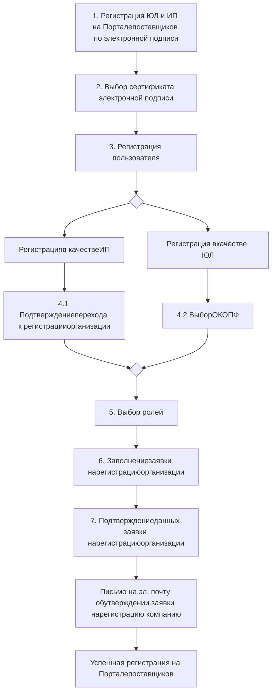

**Рисунок 39 – Порядок регистрации на Портале поставщиков по электронной подписи**

1 Нажать на кнопку «**Зарегистрироваться**» (Рисунок 28), после чего откроется страница регистрации. По умолчанию открывается страница регистрации по электронной подписи (Рисунок 40).
2 На странице «**Выбор сертификата электронной подписи**» необходимо выбрать сертификат для регистрации и нажать на кнопку «Выбрать электронную подпись» (Рисунок 40 (2)).

---

31

Форма выбора сертификата электронной подписи для регистрации

**Рисунок 40 – Форма выбора сертификата электронной подписи для регистрации**

3 В открывшейся форме «**Регистрация пользователя**» (Рисунок 41) необходимо:
− Проверить и при необходимости отредактировать обязательные поля (Рисунок 27) (1));
− Задать и повторить пароль (Рисунок 41) (2));
− Принять условия пользовательского соглашения и Регламента (Рисунок 41) (3));
− Нажать на кнопку «Продолжить» (Рисунок 41) (4));

---

32

Рисунок 41 – Форма «Регистрация пользователя»

**Рисунок 41 – Форма «Регистрация пользователя»**

После завершения регистрации на электронную почту придет соответствующей информационное письмо (Рисунок 42).

Рисунок 42 – Информационное письмо о завершении регистрации пользователя на Портале поставщиков

**Рисунок 42 – Информационное письмо о завершении регистрации пользователя на Портале поставщиков**

---

33

4 В зависимости от типа организации пользователя, указанной в ЭП, будет открыт один из следующих интерфейсов:
* Форма «**Подтверждение перехода к регистрации организации**» для ИП (Рисунок 43);
* Форма «**Выбор ОКОПФ**» для ЮЛ (Рисунок 44).

4.1 На форме «**Подтверждение перехода к регистрации организации**» для ИП необходимо нажать на кнопку «Продолжить» (Рисунок 43).

**Рисунок 43 – Подтверждение перехода к регистрации организации для ИП**

**Рисунок 43 – Подтверждение перехода к регистрации организации для ИП**

4.2 На форме «**Выбор ОКОПФ**» для ЮЛ необходимо выбрать значение из справочника ОКОПФ (Рисунок 44) и нажать на кнопку «Продолжить» (Рисунок 45).

**Рисунок 44 – Выбор значения из справочника ОКОПФ**

**Рисунок 44 – Выбор значения из справочника ОКОПФ**

---

34

Кнопка «Продолжить» на форме «Выбор ОКОПФ»

**Рисунок 45 – Кнопка «Продолжить» на форме «Выбор ОКОПФ»**

5 Необходимо выбрать роль (Рисунок 46 (1)) и нажать на кнопку «Подтвердить» (Рисунок 46 (2)):

Выбор ролей пользователем

**Рисунок 46 – Выбор ролей пользователем**

6 На открывшейся странице «**Заявка на регистрацию организации**» необходимо заполнить обязательные поля следующих блоков:
− Общие сведения о компании (Рисунок 47 (1));
− Банковские реквизиты (Рисунок 47 (2));
− Контактная информация (Рисунок 47 (3)).

---

35

Рисунок 47 – страница «Заявка на регистрацию организации»

**Рисунок 47 – страница «Заявка на регистрацию организации»**

Для промежуточного сохранения данных заявки на регистрацию необходимо нажать на кнопку «Сохранить» (Рисунок 47 (5)).
Для выхода без сохранения данных необходимо нажать кнопку «Отменить» (Рисунок 47 (6)).
После заполнения всех обязательных полей формы необходимо нажать на кнопку «Завершить» (Рисунок 47 (4)).

6.1 **Блок «Общие сведения о компании»** состоит из полей, указанных в таблице ниже (Таблица 4; Рисунок 48):

**Таблица 4 – Поля блока «Общие сведения о компании» формы «Заявка на регистрацию организации»**

| Наименование поля        | Обяз-сть | Пояснение к заполнению поля                                                                                                      |
| ------------------------ | -------- | -------------------------------------------------------------------------------------------------------------------------------- |
| Наименование организации | Да       | Полное наименование организации (автоматически загружается из сертификата)                                                       |
| ИНН                      | Да       | Идентификационный номер налогоплательщика (автоматически загружается из сертификата)                                             |
| ОГРН                     | Да       | Основной государственный регистрационный номер (автоматически загружается из сертификата)                                        |
| КПП                      | Да       | Код причины постановки на учет (может быть автоматически загружен из сертификата, при необходимости следует внести изменение)    |
| Юридический адрес        | Да       | Юридический адрес организации (автоматически загружается из сертификата, при необходимости следует внести изменение)             |
| Краткое наименование     | Нет      | Краткое наименование организации (может быть автоматически загружено из сертификата, при необходимости следует внести изменение) |
| ОКТМО                    | Да       | Код ОКТМО (значение из 8 или 11 знаков)                                                                                          |
| ОКАТО                    | Да       | Код ОКАТО (значение из 8 или 11 знаков; если в коде 11 знаков и на конце 000, то их указывать не нужно)                          |
| ОКПО                     | Да       | Код ОКПО (значение из 8 или 10 знаков)                                                                                           |
| ОКВЭД                    | Да       | Код ОКВЭД (значение из 4, 5 или 6 знаков)                                                                                        |


---

36

| Наименование поля                          | Обяз- сть | Пояснение к заполнению поля                                                         |
| ------------------------------------------ | --------- | ----------------------------------------------------------------------------------- |
| ОКОПФ                                      | Да        | Значение из справочника «Общероссийский классификатор организационно-правовых форм» |
| Дата постановки на учет в налоговом органе | Да        | Установка даты постановки на учет с помощью встроенного календаря                   |
| Код налогового органа                      | Нет       | Код налогового органа из 4 цифр                                                     |
| Страна                                     | Да        | Страна регистрации. (выбор значения из выпадающего списка с подсказками)            |
| Регион регистрации организации             | Да        | Регион регистрации организации (выбор значения из выпадающего списка с подсказками) |


Рисунок 48 – Блок «Общие сведения о компании»

**Рисунок 48 – Блок «Общие сведения о компании»**

6.2 **Блок «Банковские реквизиты»** состоит из полей, указанных в таблице ниже (Таблица 5; Рисунок 49):

---

37

**Таблица 5 – Поля блока «Банковские реквизиты» формы «Заявка на регистрацию организации»**

| Наименование поля                | Обяз-сть | Пояснение к заполнению поля                     |
| -------------------------------- | -------- | ----------------------------------------------- |
| Банковский идентификационный код | Да       | Поле должно содержать 9 символов                |
| Название банка                   | Да       | Наименование банка                              |
| Адрес банка                      | Нет      | Адрес банка (выбор значения из справочника ГАР) |
| Расчетный счет                   | Да       | Поле должно содержать 20 символов               |
| Корреспондентский счет           | Да       | Поле должно содержать 20 символов               |
| Лицевой счет                     | Нет      | Поле должно содержать 20 символов               |


Для ввода данных в блок «Банковские реквизиты» необходимо нажать на кнопку «Добавить». Далее, заполнить все поля блока и нажать на кнопку «Сохранить» (Рисунок 49).

Редактирование блока «Банковские реквизиты»

**Рисунок 49 – Редактирование блока «Банковские реквизиты»**

Для редактирования данных (Рисунок 50 (1)) в блоке «Банковские реквизиты», удаления данных (Рисунок 50 (1)) в блоке банковские реквизиты или добавления еще одного блока (Рисунок 50 (3)) «Банковские реквизиты» необходимо воспользоваться соответствующими кнопками в блоке.

---

38

Кнопки действия блока «Банковские реквизиты»

**Рисунок 50 – Кнопки действия блока «Банковские реквизиты»**

6.3 **Блок «Контактная информация»** состоит из полей, указанных в таблице ниже (Таблица 6; Рисунок 51):

**Таблица 6 – Поля блока «Контактная информация» формы «Заявка на регистрацию организации»**

| \*\*Наименованиеполя\*\*          | \*\*Обяз-сть\*\* | \*\*Пояснение к заполнению поля\*\*                                                             |
| --------------------------------- | ---------------- | ----------------------------------------------------------------------------------------------- |
| Фактический адрес местонахождения | Да               | Адрес местонахождения организации (выбирается значения из справочника ГАР или вводится вручную) |
| Фамилия                           | Да               | Фамилия контактного лица                                                                        |
| Имя                               | Да               | Имя контактного лица                                                                            |
| Отчество                          | Нет              | Отчество контактного лица                                                                       |
| Без отчества                      | Нет              | Заполняется при необходимости                                                                   |
| Телефон                           | Да               | Телефон контактного лица организации                                                            |
| Email                             | Да               | Адрес электронной почты организации                                                             |


---

39

Рисунок 51 – Блок «Контактная информация»

**Рисунок 51 – Блок «Контактная информация»**

После заполнения всех обязательных полей формы «Заявка на регистрацию организации» пользователю необходимо нажать на кнопку «Завершить» (Рисунок 51).
7 После подтверждения данных пользователем, откроется форма «Поздравление с регистрацией профиля», из которой пользователь может перейти в другие разделы (Рисунок 52).

Рисунок 52 – Форма «Поздравление с регистрацией профиля»

**Рисунок 52 – Форма «Поздравление с регистрацией профиля»**

После успешной регистрации на Портале поставщиков пользователю придет соответствующее уведомление на электронную почту (Рисунок 53).

---

40

Уведомление об успешной регистрации организации на Портале поставщиков

**Рисунок 53 – Уведомление об успешной регистрации организации на Портале поставщиков**

Если процесс регистрации профиля был прерван, пользователь может возобновить его. Для этого необходимо перейти в меню личного кабинета в раздел «Управление профилем» и нажать на кнопку «Заявка на регистрацию профиля» (Рисунок 54).

Возобновление процесса регистрации

**Рисунок 54 – Возобновление процесса регистрации**

## 3.3.2 Регистрация в качестве физического лица по электронной подписи

Для регистрации учетной записи физического лица на Портале поставщиков необходимо выполнить следующие шаги (Рисунок 55):

---

41

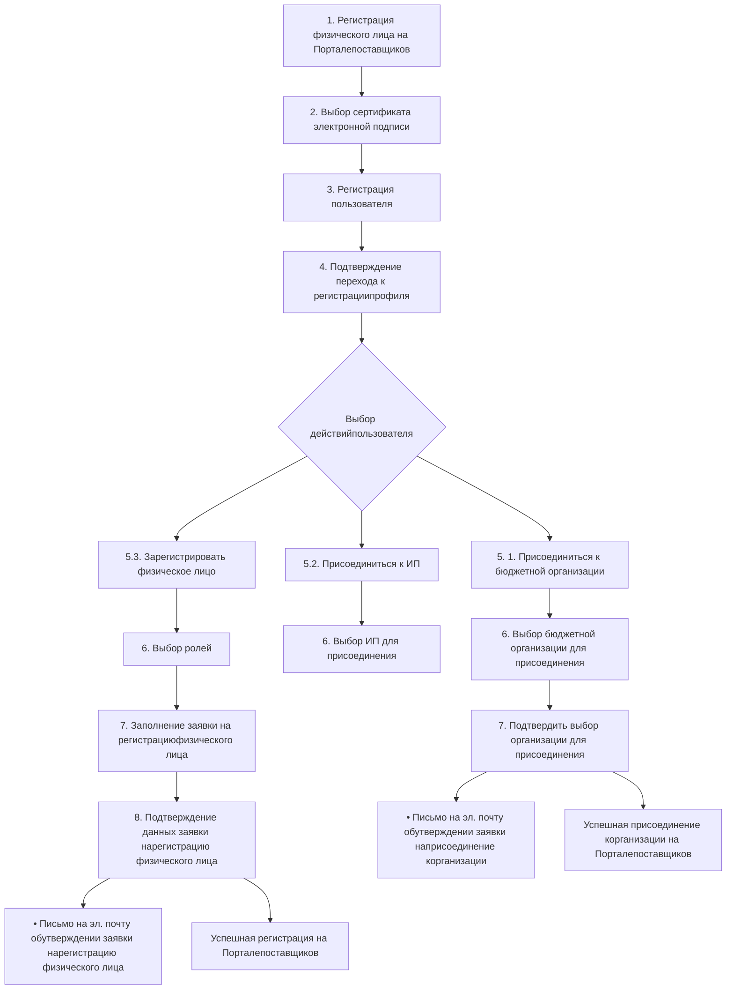

**Рисунок 55 – Шаги регистрации физического лица на Портале поставщиков**

1 Нажать на кнопку «**Зарегистрироваться**» (Рисунок 28) после чего откроется страница «**Выбор сертификата электронной подписи**».
2 На странице «**Выбор сертификата электронной подписи**» необходимо выбрать сертификат физического лица для регистрации и нажать на кнопку «Выбрать электронную подпись» (Рисунок 56).

Рисунок 56 – Форма выбора сертификата электронной подписи для регистрации

**Рисунок 56 – Форма выбора сертификата электронной подписи для регистрации**

3 На форме «**Регистрация пользователя**» необходимо заполнить обязательные поля, задать и повторить пароль, а также принять условия соглашения и регламента, после чего нажать на кнопку «Продолжить» (Рисунок 57).

---

42

Форма «Регистрация пользователя»

**Рисунок 57 – Форма «Регистрация пользователя»**

4 На форме «Поздравления с регистрацией пользователя» необходимо нажать на кнопку «Продолжить» для подтверждения перехода к регистрации профиля (Рисунок 58).

Подтверждение перехода к выбору действий физического лица

**Рисунок 58 – Подтверждение перехода к выбору действий физического лица**

5 На форме «Выбор действий пользователя физического лица» выбрать один из вариантов ниже и нажать кнопку «Продолжить» (Рисунок 59):

---

43

− «Зарегистрировать физическое лицо»;
− «**Присоединится к ИП**».

5.1 При выборе опции «**Присоединится к ИП**» (Рисунок 59) и нажать на кнопку «Продолжить». В модальном окне необходимо подтвердить свой выбор (Рисунок 60).

**Рисунок 59 – Выбор опции «Присоединится к ИП»**

**Рисунок 59 – Выбор опции «Присоединится к ИП»**

**Рисунок 60 – Модальное окно «Подтверждение присоединения к ИП»**

**Рисунок 60 – Модальное окно «Подтверждение присоединения к ИП»**

6 Перейти к выбору ИП для присоединения нажав на кнопку «Выбрать организацию» (Рисунок 61).

**Рисунок 61 – Переход к форме «Выбор организации»**

**Рисунок 61 – Переход к форме «Выбор организации»**

7 Выбрать ИП для присоединения из справочника и нажать на кнопку «Подтвердить» (Рисунок 63). Далее, в модальном окне необходимо подтвердить свой выбор (Рисунок 64).

---

44

Скриншот формы выбора ИП с выпадающим списком организаций

**Рисунок 62 – Выбор ИП**

Скриншот формы выбора ИП с выбранной организацией

**Рисунок 63 – Форма «Выбор ИП»**

Скриншот модального окна подтверждения отправки заявки

**Рисунок 64 – Модальное окно «Подтверждение отправки заявки администраторукомпании»**

8 После подтверждения данных пользователем, откроется форма «Поздравление присоединения к организации», из которой пользователь может перейти в другие разделы (Рисунок 65).

---

45

Форма «Поздравление присоединения к организации»

**Рисунок 65 – Форма «Поздравление присоединения к организации»**

5.2 При выборе опции «Зарегистрировать физическое лицо» (Рисунок 66) и нажать на кнопку «Продолжить». В модальном окне необходимо подтвердить свой выбор (Рисунок 67).

Форма «Выбор действий пользователя физического лица»

**Рисунок 66 – Форма «Выбор действий пользователя физического лица»**

Модальное окно «Подтверждение регистрации физического лица»

**Рисунок 67 – Модальное окно «Подтверждение регистрации физического лица»**

---

46

6 В открывшейся форме **«Выбор типа организации»** необходимо выбрать роль/роли и нажать на кнопку «Подтвердить» (Рисунок 68):

Рисунок 68 – Форма «Выбор типа организации» для физического лица

**Рисунок 68 – Форма «Выбор типа организации» для физического лица**

7 В открывшейся форме **«Заявка на регистрацию физического лица»** необходимо заполнить следующие блоки (Рисунок 69):
− Сведения о физическом лице (Рисунок 69 (1));
− Банковские реквизиты (Рисунок 69 (2));
− Контактная информация (Рисунок 69 (3)).

Рисунок 69 – Форма «Заявка на регистрацию физического лица»

**Рисунок 69 – Форма «Заявка на регистрацию физического лица»**

Для промежуточного сохранения данных заявки на регистрацию необходимо нажать на кнопку «Сохранить» (Рисунок 69 (4)). Для выхода без сохранения данных необходимо нажать кнопку «Отменить» (Рисунок 69 (6)).
После заполнения всех обязательных полей формы необходимо нажать на кнопку «Завершить» (Рисунок 69 (5)).

7.1 **Блок «Сведения о физическом лице»** состоит из полей, указанных в таблице ниже (Таблица 7; Рисунок 70):

---

47

**Таблица 7 – Поля блока «Сведения о физическом лице» формы «Заявка на регистрацию физического лица»**

| Наименование поля   | Обяз-сть | Пояснение к заполнению поля                                                                     |
| ------------------- | -------- | ----------------------------------------------------------------------------------------------- |
| ИНН                 | Да       | Идентификационный номер налогоплательщика (автоматически загружается из сертификата)            |
| Имя                 | Да       | Имя (автоматически загружается из сертификата)                                                  |
| Фамилия             | Да       | Фамилия (автоматически загружается из сертификата)                                              |
| Отчество            | Нет      | Отчество (автоматически загружается из сертификата, при необходимости следует внести изменение) |
| СНИЛС               | Да       | Страховой номер индивидуального лицевого счета (автоматически загружается из сертификата)       |
| Являюсь самозанятым | Нет      | Возможность установить признак, информирующий о наличии статуса самозанятого                    |


Рисунок 70 – Блок «Сведение о физическом лице» формы «Заявка на регистрацию физического лица»

**Рисунок 70 – Блок «Сведение о физическом лице» формы «Заявка на регистрацию физического лица»**

7.2 **Блок «Банковские реквизиты»** состоит из полей, указанных в таблице ниже (Таблица 8; Рисунок 71):

**Таблица 8 – Поля блока «Банковские реквизиты» формы «Заявка на регистрацию физического лица»**

| Наименование поля                | Обяз-сть | Пояснение к заполнению поля                     |
| -------------------------------- | -------- | ----------------------------------------------- |
| Банковский идентификационный код | Да       | Поле должно содержать 9 символов                |
| Название банка                   | Да       | Наименование банка                              |
| Адрес банка                      | Нет      | Адрес банка (выбор значения из справочника ГАР) |
| Расчетный счет                   | Да       | Поле должно содержать 20 символов               |
| Корреспондентский счет           | Да       | Поле должно содержать 20 символов               |
| Лицевой счет                     | Нет      | Поле должно содержать 20 символов               |


Для ввода данных в блок «Банковские реквизиты» необходимо нажать на кнопку «Добавить». Далее, заполнить все поля блока и нажать на кнопку «Сохранить» (Рисунок 71).

---

48

Рисунок 71 – Блок «Банковские реквизиты» формы «Заявка на регистрацию физического лица»

**Рисунок 71 – Блок «Банковские реквизиты» формы «Заявка на регистрацию физического лица»**

Для редактирования данных (Рисунок 72 (1)) в блоке «Банковские реквизиты», удаления данных (Рисунок 72 (1)) в блоке банковские реквизиты или добавления еще одного блока (Рисунок 72 (3)) «Банковские реквизиты» необходимо воспользоваться соответствующими кнопками в блоке.

Рисунок 72 – Кнопки действия блока «Банковские реквизиты»

**Рисунок 72 – Кнопки действия блока «Банковские реквизиты»**

7.3 **Блок «Контактная информация»** состоит из полей, указанных в таблице ниже (Таблица 9; Рисунок 73):

**Таблица 9 – Поля блока «Контактная информация» формы «Заявка на регистрацию физического лица»**

| Наименование поля                 | Обяз-сть | Пояснение к заполнению поля                                                                     |
| --------------------------------- | -------- | ----------------------------------------------------------------------------------------------- |
| Фактический адрес местонахождения | Да       | Адрес местонахождения организации (выбирается значения из справочника ГАР или вводится вручную) |


---

49

| Фамилия      | Да  | Фамилия контактного лица             |
| ------------ | --- | ------------------------------------ |
| Имя          | Да  | Имя контактного лица                 |
| Отчество     | Нет | Отчество контактного лица            |
| Без отчества | Нет | Заполняется при необходимости        |
| Телефон      | Да  | Телефон контактного лица организации |
| Email        | Да  | Адрес электронной почты организации  |


Контактная информация

**Рисунок 73 – Блок «Контактная информация» формы «Заявка на регистрацию физического лица»**

После заполнения всех обязательных полей формы «Заявка на регистрацию физического лица» пользователю необходимо нажать на кнопку «Завершить» (Рисунок 69 (5)).
8 После подтверждения данных пользователем, откроется форма «Поздравление с регистрацией профиля», из которой пользователь может перейти в другие разделы (Рисунок 74).

---

50

Поздравляем! Вы завершили регистрацию. Модераторы проверят заявку и пришлют уведомление о результате на электронную почту. Вы уже можете: Настроить уведомления о закупках, чтобы не пропустить самое важное. Настроить профиль пользователя. Загрузить шаблоны документов. Перейти в каталог для поиска подходящей закупки. Изучить инструкции по работе с Порталом поставщиков

**Рисунок 74 – Форма «Поздравления с регистрацией профиля»**

После успешной регистрации на Портале поставщиков пользователю придет соответствующее уведомление на электронную почту (Рисунок 75).

ПОРТАЛ ПОСТАВЩИКОВ. Уважаемый(ая) Трубный Владимир Дмитриев! Ранее отправленная заявка на изменение данных поставщика в ЕАПСТ из Портала поставщиков https://old.dev.pp24.dev от 14.03.2023 11:21:06 была принята. В течение получаса Вам будут предоставлены необходимые полномочия на Портале. По истечении этого времени, пожалуйста, авторизуйтесь заново. С уважением, Администрация портала. С уважением, Администрация Портала

**Рисунок 75 – Уведомление об успешной регистрации физического лица на Портале**
**поставщиков**

<mark>! Если процесс регистрации профиля был прерван, пользователь может возобновить его. Для этого необходимо перейти в меню личного кабинета в раздел «Управление профилем» и нажать на кнопку «Заявка на регистрацию профиля» (Рисунок 76).</mark>

---

51

Скриншот интерфейса личного кабинета с выделенными элементами «Заявка на регистрацию профиля» и «Управление профилем»

Рисунок 76 – Возобновление процесса регистрации

---

52

### 3.3.3 **Регистрация без электронной подписи**

Для регистрации **без электронной подписи** на Портале поставщиков необходимо перейти на главную страницу Портала поставщиков и выполнить следующие шаги (Рисунок 77):

Рисунок 77 – Шаги регистрации без электронной подписи

**Рисунок 77 – Шаги регистрации без электронной подписи**

1 Нажать на кнопку «**Зарегистрироваться**» (Рисунок 28), после чего откроется страница «Выбора ЭП» – подробнее раздел 3.3.1;
2 Чтобы перейти к регистрации **без электронной подписи** необходимо нажать кнопку «**Регистрация без ЭП**» (Рисунок 78);

---

53

Расположение кнопки «Регистрация без ЭП»

**Рисунок 78 – Расположение кнопки «Регистрация без ЭП»**

3 На форме «**Регистрация пользователя**» необходимо заполнить обязательные поля, задать и повторить пароль, а также принять условия соглашения и регламента, после чего нажать на кнопку «Продолжить» (Рисунок 79);

Форма «Регистрация пользователя» при регистрации без ЭП

**Рисунок 79 – Форма «Регистрация пользователя» при регистрации без ЭП**

При успешной регистрации пользователя отобразиться страница с системным сообщением (Рисунок 80). На указанную электронную почту от Портала поставщиков отправится ссылка-подтверждение адреса электронной почты.

---

54

Страница с системным сообщением об отправке ссылки-подтверждения на адрес электронной почты

**Рисунок 80 – Страница с системным сообщение об отправке ссылки-подтверждения на адрес электронной почты**

4 После получения письма со ссылкой-подтверждением необходимо перейти по ссылке<sup>5</sup>, указанной в письме (Рисунок 81) для **подтверждения адреса электронной почты**.

Уведомление со ссылкой-подтверждением адреса электронной почты

**Рисунок 81 – Уведомление со ссылкой-подтверждением адреса электронной почты**

5 На форме «**Выбор типа учетной записи**» выбрать один из вариантов ниже и нажать на кнопку «Продолжить» (Рисунок 82):
− зарегистрировать юридическое лицо;
− зарегистрировать индивидуального предпринимателя;
− зарегистрировать физическое лицо.

<hr/>
<sup>5</sup> В случае, если письмо со ссылкой подтверждения не пришло, то можно запросить его повторно по кнопке «Нажмите сюда»

---

55

Рисунок 82 – Форма «Выбор типа учетной записи»

**Рисунок 82 – Форма «Выбор типа учетной записи»**

6.1 При выборе опции «**Зарегистрировать юридическое лицо**» и нажатии на кнопку «Продолжить» (Рисунок 83) открывается форма, на которой пользователю необходимо:
− ввести ИНН;
− ввести ОГРН;
− выбрать ОКОПФ из справочника (Рисунок 84).

Рисунок 83 – Выбор опции «Зарегистрировать юридическое лицо»

**Рисунок 83 – Выбор опции «Зарегистрировать юридическое лицо»**

---

56

Форма ввода ИНН, ОГРНИП, ОКОПФ для регистрации ЮЛ без ЭП

**Рисунок 84 – Форма ввода ИНН, ОГРНИП, ОКОПФ для регистрации ЮЛ без ЭП**

6.2 При выборе опции «**Зарегистрировать индивидуального предпринимателя**» и нажатии на кнопку «Продолжить» (Рисунок 85) открывается форма, на которой пользователю необходимо:
− Ввести ИНН;
− Ввести ОГРНИП (Рисунок 86).

Выбор опции «Зарегистрировать индивидуального предпринимателя»

**Рисунок 85 – Выбор опции «Зарегистрировать индивидуального предпринимателя»**

---

57

Форма ввода ИНН и ОГРНИП для регистрации ИП без ЭП

**Рисунок 86 – Форма ввода ИНН и ОГРНИП для регистрации ИП без ЭП**

6.3 При выборе опции «**Зарегистрировать физическое лицо**» и нажатии на кнопку «Продолжить» (Рисунок 87) открывается форма, на которой пользователю необходимо ввести ИНН (Рисунок 88).

Выбор опции «Зарегистрировать физическое лицо»

**Рисунок 87 – Выбор опции «Зарегистрировать физическое лицо»**

---

58

Рисунок 88 – Форма ввода ИНН для регистрации физического лица без ЭП

**Рисунок 88 – Форма ввода ИНН для регистрации физического лица без ЭП**

7. В зависимости от выбранного типа учетной записи, пользователю откроется форма «Выбор ролей» для ЮЛ и ИП (подробнее раздел 3.3.1) или для физического лица (подробнее раздел 3.3.2), на которой пользователю необходимо выбрать роль/роли и нажать на кнопку «Продолжить».
8. Далее, пользователю необходимо заполнить данные на форме «Заявка на регистрацию организации» (подробнее раздел 3.3.1) или «Заявка на регистрацию физического лица» (подробнее раздел 3.3.2) в зависимости от выбранного типа учетной записи и нажать на кнопку «Продолжить».
9. Следующим шагом пользователю открывается форма «Подтверждения данных заявки на регистрацию организации» (подробнее раздел 3.3.1) или «Подтверждение данных заявки на регистрации физического лица» (подробнее раздел 3.3.2).

> **Внимание**, для отправки заявки на регистрацию на утверждения необходимо сначала прикрепить электронную подпись к профилю пользователя.

Для прикрепления электронной подписи к профилю пользователя необходимо перейти в личный кабинет, в разделе «Управление пользователем» выбрать подраздел «Профиль пользователя» (Рисунок 89).

Рисунок 89 – Переход к подразделу «Профиль пользователя»

**Рисунок 89 – Переход к подразделу «Профиль пользователя»**

В Профиле пользователя необходимо нажать на кнопку «Операции с ЭП» (Рисунок 90).
В открывшейся странице «Добавление сертификата» выбрать сертификат и нажать на кнопку «Выбрать электронную подпись» (Рисунок 91).

---

59

Расположение кнопки «Операция с ЭП» в профиле пользователя

**Рисунок 90 – Расположение кнопки «Операция с ЭП» в профиле пользователя**

Страница «Добавление сертификата»

**Рисунок 91 – Страница «Добавление сертификата»**

10 После прикрепления электронной подписи необходимо вернуться к заявке на регистрацию и выполнить отправку заявки на утверждение.
Для этого необходимо в меню личного кабинета пользователя в разделе «Управление профилем» выбрать подраздел «Заявка на регистрацию организации» (Рисунок 92).

Переход к странице «Заявка на регистрацию компании»

**Рисунок 92 – Переход к странице «Заявка на регистрацию компании»**

---

60

В открывшейся форме «Подтверждения данных заявки на регистрацию организации» (подробнее раздел 3.3.1) или «Подтверждение данных заявки на регистрации физического лица» (подробнее раздел 3.3.2) нажать на кнопку «Продолжить».

## 3.3.4 **Рассмотрение заявки на регистрацию и создание пользователей**

Общий порядок рассмотрения заявки на регистрацию представлен ниже (Рисунок 93).

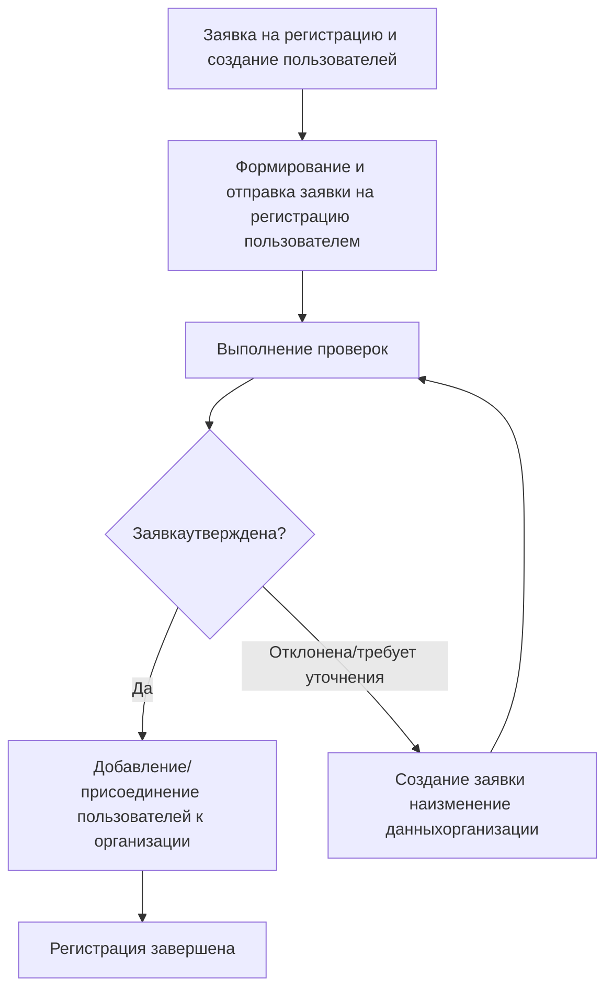

**Рисунок 93 – Схема рассмотрения заявки на регистрацию и создания пользователей**

После отправки пользователем заявки на регистрацию на утверждение ей присваивается статус «**Отправлена**». После того, как заявка будет рассмотрена модератором, ей присвоится статус «**Изменения приняты**» или «**Отклонена**» в соответствии с решением модератора.

Заявка на регистрацию может быть направлена на доработку пользователю, в таком случае ей присваивается статус «**Требуется уточнение**». Чтобы посмотреть комментарии модератора, необходимо в списке отправленных заявок нажать на наименование статуса, после чего откроется соответствующее модальное окно (Рисунок 94).

Окно с комментариями модератора по заявке на изменение данных компании

**Рисунок 94 – Окно с комментариями модератора по заявке на изменение данныхкомпании**

Для внесения исправлений по замечаниям модератора пользователю необходимо создать заявку на изменения данных (подробнее в разделе 12.1.1).

После обработки заявки и ее утверждения на почту придет сообщение о том, что заявка принята и в течение получаса будут предоставлены необходимые полномочия на портале (Рисунок 95). По истечении этого времени необходимо заново авторизоваться.

---

61

Информационное сообщение о принятии заявки на изменение данных

**Рисунок 95 – Информационное сообщение о принятии заявки на изменение данных**

## 3.3.5 Добавление и присоединение пользователей

Добавить пользователей в компанию можно двумя способами:
− через заявку на присоединение пользователя к организации;
− вручную в профиле компании;
− через заявку, созданную на странице «Заявки на присоединение к организациям», описано в разделе 13.1.6.3.

## 3.3.5.1 Заявка на присоединение к организации

Для **создания заявки на присоединение к организации** пользователю необходимо выполнить следующие шаги:

1. Зарегистрировать пользователя (Рисунок 97) на портале поставщиков используя ЭП (Рисунок 96), выпущенную на организацию (подробнее раздел 3.3.1)

Выбор сертификата для присоединения к организации

**Рисунок 96 – Выбор сертификата для присоединения к организации**

---

62

Регистрация пользователя для присоединения к организации

**Рисунок 97 – Регистрация пользователя для присоединения к организации**

2 Перейти к выбору организации для присоединения (Рисунок 98).

Переход к форме «Выбор организации для присодинения»

**Рисунок 98 – Переход к форме «Выбор организации для присодинения»**

3 Выбрать организацию для присоединения и нажать на кнопку «Подтвердить» (Рисунок 99).

---

63

Рисунок 99 – Форма «Выбор организации для присодинения»

**Рисунок 99 – Форма «Выбор организации для присодинения»**

4 Пользователю отобразиться информационное сообщение о том, что заявка на присоединение к организации отправлена на утверждение администратору компании (Рисунок 100).

Рисунок 100 – Информационное сообщение об отправке заявки администратору компании

**Рисунок 100 – Информационное сообщение об отправке заявки администратору компании**

Администратору компании придет уведомление на электронную почту со ссылкой на заявку на присоединения пользователя к организации (Рисунок 101) и в профиле компании в блоке «Сведения о пользователях» отобразится пользователь, отправивший заявку на присоединение (Рисунок 102).

Рисунок 101 – Уведомление о присоединении пользователя к организации

**Рисунок 101 – Уведомление о присоединении пользователя к организации**

---

64

Отображение заявки на присоединение в профиле компании

**Рисунок 102 – Отображение заявки на присоединение в профиле компании**

Администратору компании необходимо перейти по ссылке из письма или нажать на кнопку «Перейти к заявке» в профиле компании, на открывшейся форме нажать на кнопку «Доступные действия» и выполнить одно из действий (Рисунок 103):
− утвердить пользователя;
− отклонить пользователя.

Форма присоединения пользователя к организации с доступными действиями

**Рисунок 103 – Форма присоединения пользователя к организации с доступными действиями**

Для утверждения заявки на присоединения пользователя необходимо нажать на кнопку «Утвердить пользователя» и подтвердить действие в модальном окне (Рисунок 104).

Модальное окно утверждения пользователя

**Рисунок 104 – Модальное окно утверждения пользователя**

---

65

Для отклонения заявки на присоединения пользователя необходимо нажать на кнопку «Отклонить пользователя» и подтвердить действие в модальном окне (Рисунок 105).

Рисунок 105 – Модальное окно отклонения пользователя

**Рисунок 105 – Модальное окно отклонения пользователя**

После утверждения пользователя администратором он будет присоединен к организации.

## 3.3.5.2 Добавление пользователей к организации вручную

Для добавления пользователей к организации вручную необходимо перейти в личный кабинет, нажав кнопку **«Управление профилем»** во всплывающем пользовательском меню (Рисунок 106) и в открывшемся личном кабинете нажать кнопку **«Профиль компании»**.

Рисунок 106 – Переход в профиль компании во всплывающем пользовательском меню

**Рисунок 106 – Переход в профиль компании во всплывающем пользовательском меню**

В профиле компании необходимо перейти в блок **«Сведения о пользователях»** и нажать кнопку **«Создать»** (Рисунок 107). Профиль компании доступен только после регистрации копании на Портале поставщиков

Рисунок 107 – Вкладка "Сведения о пользователях" в профиле компании

**Рисунок 107 – Вкладка "Сведения о пользователях" в профиле компании**

---

66

После чего откроется блок с полями для заполнения данными пользователя (Рисунок 108), где нужно ввести:
— E-mail нового пользователя;
— ФИО нового пользователя;
— Должность пользователя в компании;
— Подразделение, в котором работает пользователь.
После ввода данных необходимо нажать кнопку **«Сохранить»**.

Рисунок 108 – Поля для создания нового пользователя

**Рисунок 108 – Поля для создания нового пользователя**

После того, как пользователь будет добавлен, на указанную электронную почту поступит письмо с временным паролем и ссылкой для завершения регистрации, после чего необходимо:
1. Перейти по ссылке из электронного письма;
2. Заменить временный пароль на новый (Рисунок 411);
3. Перейти в управление пользователем $\rightarrow$ Профиль пользователя (Рисунок 109), (п. 13.1);
4. Прикрепить электронную подпись.

Рисунок 109 – Личный кабинет поставщика

**Рисунок 109 – Личный кабинет поставщика**

Подробнее по работе с профилем пользователя можно ознакомиться в разделе 13.1 <u>Профиль пользователя.</u>

---

67

### 3.3.5.3 **Добавление прав пользователям**

По умолчанию у только что созданного пользователя отсутствуют права, позволяющие вести полноценную деятельность на портале. В связи с этим администратору компании необходимо назначить необходимые пользователю роли.

Чтобы назначить права пользователю нужно перейти в блок **«Сведения о пользователях»** в профиле компании и напротив пользователя в столбце **«Полномочия»** нажать ссылку **«Изменить»** (Рисунок 110).

Рисунок 110 – Ссылка для изменения полномочий пользователя

**Рисунок 110 – Ссылка для изменения полномочий пользователя**

После чего откроется окно изменения ролей пользователя (Рисунок 111), где необходимо указать роли пользователя (раздел 2.6), нажав на поле выбора.

Рисунок 111 – Окно изменения ролей пользователей

**Рисунок 111 – Окно изменения ролей пользователей**

После выбора ролей необходимо нажать кнопку «Сохранить».

---

68

## 3.4 Авторизация пользователя

Для входа на Портал необходимо нажать на кнопку «Войти», расположенную в верхней части главной страницы Портала (Рисунок 28):

Если до авторизации был открыт один из разделов портала, то после прохождения авторизации открывается ранее открытая страница.

Если пользователь зарегистрирован на Портале, то войти в личный кабинет он может следующими способами:

* авторизация с помощью логина и пароля;
* авторизация с помощью электронной подписи;
* сквозная авторизация через интегрированные сервисы (Инвестпортал (АИС УИД), МО ЕАСУЗ, Росэлторг, mos.ru (СУДИР), ВТБ Коннект, Тэк-торг).

1 **Авторизация с помощью логина и пароля.** В окне авторизации ввести **Логин** и **Пароль** и нажать кнопку «Войти» (Рисунок 112).

Рисунок 112 – Окно авторизации на Портале поставщиков

**Рисунок 112 – Окно авторизации на Портале поставщиков**

Если к пользователю прикреплены дополнительные организации, то после ввода логина и пароля откроется форма «Выберите профиль» (Рисунок 113), в которой нужно выбрать необходимый профиль и нажать кнопку «Войти».

---

69

Рисунок 113 – Форма «Выберите профиль»

**Рисунок 113 – Форма «Выберите профиль»**

2 **С помощью электронной подписи**. Для этого в окне авторизации необходимо нажать на вкладку «Электронная подпись». В отобразившемся окне выбора сертификата выбрать требуемый сертификат ЭП и нажать кнопку **«Войти»** (Рисунок 114).

Рисунок 114 – Окно входа по ЭП

**Рисунок 114 – Окно входа по ЭП**

---

70

3 **Через mos.ru или другие внешние системы.** Для этого в окне авторизации необходимо нажать на вкладку «mos.ru и внешние системы». В отобразившемся окне выбора внешней системы нажать на кнопку выбранной системы (Рисунок 115), далее необходимо пройти стандартную процедуру аутентификации выбранной внешней системы.

Рисунок 115 – Окно входа через mos.ru и внешние системы

**Рисунок 115 – Окно входа через mos.ru и внешние системы**

### 3.4.1 Забыли пароль

В случае если пользователь забыл пароль, ему необходимо воспользоваться кнопкой «Забыли пароль?», расположенную в окне авторизации (Рисунок 116).

Рисунок 116 – Кнопка «Забыли пароль?»

**Рисунок 116 – Кнопка «Забыли пароль?»**

На открывшейся странице пользователю необходимо ввести E-mail, который был указан в профиле пользователя, и нажать на кнопку «Продолжить» (Рисунок 117).

---

71

Страница перехода к восстановлению пароля

**Рисунок 117 – Страница перехода к восстановлению пароля**

После подтверждения на указанный адрес электронной почты придет письмо с инструкциями для восстановления пароля, в котором необходимо перейти по ссылке или нажать на кнопку «Сбросить пароль» (Рисунок 118).

Переход к сбросу пароля

**Рисунок 118 – Переход к сбросу пароля**

При переходе к сбросу пароля откроется страница, на которой пользователю необходимо задать и подтвердить новый пароль, затем подтвердить свои действия, нажав на кнопку «Подтвердить» (Рисунок 119).

Смена пароля

**Рисунок 119 – Смена пароля**

После подтверждения смены пароля пользователь авторизуется на Портале.

---

72

## 3.5 Поиск по порталу

При нажатии на пиктограмму лупы в шапке Портала открывается форма поиска.

Форма поиска по порталу

**Рисунок 120 – Форма поиска по порталу**

Доступна возможность закрепить и открепить поисковую строку, при нажатии на пиктограмму в виде канцелярской кнопки.
Доступные варианты поиска:
- По всем категориям;
- Каталог продукции;
- Закупки;
- Контракты;
- Организации.

При вводе поискового запроса можно выбрать вариант «Строгое соответствие», в таком случае поиск будет осуществлен строго в соответствии с введенным значением.
Так же при вводе отображается предпросмотр найденных значений.

Форма предпросмотра найденных значений

**Рисунок 121 – Форма предпросмотра найденных значений**

При переходе ко всем найденным отображаются все найденные значения.

---

73

Форма просмотра всех найденных значений

**Рисунок 122 – Форма просмотра всех найденных значений**

## 3.6 Версия портала для слабовидящих

При нажатии на кнопку «Версия для слабовидящих» в нижней части портала происходит переключение на отображение страниц Портала для слабовидящих.

Версия для слабовидящих

**Рисунок 123 – Версия для слабовидящих**

В верхней части страницы располагаются варианты быстрой настройки отображения страниц. При нажатии на кнопку «Настройки» отображается форма с расширенными настройками.

---

74

Настройки: Выбор шрифта: Arial, Open Sans, Courier New. Интервал между буквами: Стандартный, Средний, Большой. Выбор цветовой схемы: Черным по белому, Белым по черному, Темно-синим по голубому, Коричневым по бежевому, Зеленым по темно-коричневому. Кнопки: Закрыть, Сохранить

Рисунок 124 – Расширенные настройки версии для слабовидящих

---

75

## 4 Бизнес-ассистент

Для того чтобы начать работать с Бизнес-ассистентом, необходимо авторизоваться на Портале поставщиков. После авторизации на главной странице Портала отобразится иконка Бизнес-ассистента (Рисунок 125).

Рисунок 125 – Иконка Бизнес-ассистента

**Рисунок 125 – Иконка Бизнес-ассистента**

Необходимо нажать на иконку Бизнес-ассистента. После нажатия откроется форма для работы с Бизнес-ассистентом (Рисунок 126). На форме представлены кнопки для быстрых действий, оформленные в виде плиток, не требующие самостоятельного ввода запроса:

− Персональные показатели – при нажатии на данную кнопку отобразятся все показатели пользователя за год;

− Проверка ЭЦП и МЧД – при нажатии на данную кнопку Бизнес-ассистент проверит наличие у пользователя действующей электронной подписи (ЭЦП) для подписания оферт и контрактов, а также машиночитаемой доверенности (МЧД) для проведения закупок, и сообщит их актуальные сроки действия;

− Участие в закупке – при нажатии на данную кнопку Бизнес-ассистент отправит информацию о том, как можно поучаствовать в закупках;

− Актуальные задачи – при нажатии на данную кнопку Бизнес-ассистент отправит все задачи, которые есть в календаре у пользователя;

− Что ты умеешь – при нажатии на данную кнопку Бизнес-ассистент отправит список задач, которые он может выполнить.

---

76

Рисунок 126 – Форма для работы с Бизнес-ассистентом

**Рисунок 126 – Форма для работы с Бизнес-ассистентом**

С помощью кнопки «Личный кабинет» на форме Бизнес-ассистента можно перейти в личный кабинет пользователя, а также выйти из своей учетной записи при нажатии на иконку выхода. Чтобы ввести запрос, необходимо воспользоваться полем ввода. Если нужно прикрепить фотографию, то необходимо нажать на иконку в виде скрепки. Чтобы отправить сообщение, необходимо нажать на иконку в виде бумажного самолётика или клавишу Enter.

## 4.1 Основные возможности Бизнес-ассистента

Бизнес-ассистент может выполнять ряд действий от ответа на вопрос до выполнения конкретных задач. Основные возможности Бизнес-ассистента:

− Может ответить на вопросы по Порталу Поставщиков;

− Может найти задачи и уведомления, а также статистику (для поставщика и для заказчика);

− Может отследить закупки по выбранным параметрам;

− Может найти контракты и закупки пользователя;

− Может отправить диалог в личный кабинет пользователя;

− Может отследить статусы обращений в СТП;

---

77

− Может отправить ссылку на необходимую поддерживаемую страницу;

− Может открыть необходимую поддерживаемую страницу;

− Может отслеживать автоставки;

− Может отправить срок действия ЭЦП и МЧД;

− Может найти открытую информацию об организациях.

### 4.1.1 Поиск информации по Порталу с помощью Бизнес-ассистента

Чтобы получить справочную информацию по работе с сервисами Портала поставщиков, введите в поле чата текстовый запрос, используя для точного распознавания устоявшиеся термины и аббревиатуры. После этого Бизнес-ассистент отправит ответ на вопрос и предоставит ссылки на инструкцию по работе с Порталом поставщиков и на базу знаний, где можно самостоятельно найти ответы на возникшие вопросы.

### 4.1.2 Поиск задач, уведомлений и статистики с помощью Бизнес-ассистента

Для получения задач и уведомлений необходимо написать в чат просьбу показать задачи пользователя. Бизнес-ассистент выведет список всех задач, требующих внимания, с указанием приоритета и дедлайнов. Если пользователю нужны не все задачи, а только определенные, необходимо добавить в запрос уточнения.

Для получения статистики необходимо отправить запрос на получение данных статистики пользователя, также можно указать период, за который нужна статистика. Если не указать период, то Бизнес-ассистент отправит статистику за год.

### 4.1.3 Отслеживание закупок по выбранным параметрам с помощью Бизнес-ассистента

Для создания подписки на закупки необходимо написать в чат просьбу создать подписку и указать интересующие параметры (например, регион, заказчик, тип закупки или диапазон цен).

Бизнес-ассистент распознает запрос, сформирует интерактивную карточку с параметрами и после вашего подтверждения сохранит подписку. Для просмотра уже созданных подписок необходимо отправить запрос на их показ, при необходимости добавив уточнения для фильтрации списка.

Для управления подписками (включения, отключения или удаления) необходимо отправить соответствующий запрос в чат, и Бизнес-ассистент изменит статус или удалит выбранную подписку. Если при создании подписки указано недостаточно данных, Бизнес-ассистент задаст уточняющие вопросы и предложит варианты параметров для быстрого выбора.

### 4.1.4 Поиск контрактов или закупок с помощью Бизнес-ассистента

Чтобы просмотреть список контрактов или закупок, необходимо ввести в чат текстовый запрос с просьбой показать контракты или закупки пользователя. Если система найдёт более пяти записей, они будут выведены частями: для просмотра остальных необходимо нажать на кнопку «Показать следующие» и дождаться загрузки очередной порции данных. Также есть возможность перейти в реестр контрактов или закупок с помощью кнопок «Открыть реестр контрактов» или «Открыть реестр закупок». Если необходимо найти конкретную закупку или контракт, то нужно написать запрос с просьбой найти контракт/закупку с конкретным номером.

### 4.1.5 Отправка диалога в личный кабинет пользователя

Чтобы сохранить историю общения с Бизнес-ассистентом в личном кабинете, необходимо написать в чат запрос, что нужно отправить диалог. Бизнес-ассистент в течение 10 минут отправит диалог. Диалог можно будет найти на странице «Уведомления».

---

78

**4.1.6 Отслеживание статусов обращений в СТП с помощью Бизнес-ассистента**

Чтобы посмотреть список всех статусов обращений в СТП, нужно написать в чат и запросить список обращений. Если необходимо узнать статус определённого обращения, нужно указать его конкретный номер и попросить проверить статус данного обращения.

**4.1.7 Отправка ссылки на необходимую поддерживаемую страницу**

Чтобы Бизнес-ассистент отправил ссылку на страницу Портала поставщиков, нужно написать в чат, что необходимо отправить ссылку на нужную пользователю страницу, например, на страницу каталога продукции, на страницу контрактов и т.д. После этого Бизнес-ассистент отправит ссылку на нужную страницу, по которой можно будет перейти.

**4.1.8 Открытие поддерживаемой страницы с помощью Бизнес-ассистента**

Чтобы открыть определённую страницу, необходимо написать запрос в чат с просьбой открыть страницу Портала поставщиков, например страницу реестра котировочных сессий. После этого система автоматически перенесёт пользователя на нужную страницу.

**4.1.9 Отслеживание автоставок с помощью Бизнес-ассистента**

Бизнес-ассистент может показать автоставки и отменить конкретную автоставку. Чтобы отобразились автоставки, необходимо отправить в чат запрос на получение списка автоставок пользователя. Чтобы отменить конкретную автоставку, необходимо написать в чат Бизнес-ассистента номер закупки с просьбой об отмене автоставки.

**4.1.10 Отслеживание сроков действий ЭЦП и МЧД с помощью Бизнес-ассистента**

Чтобы проконтролировать актуальность электронной подписи и машиночитаемых доверенностей, введите в поле чата запрос с использованием ключевых слов «МЧД», «ЭЦП», «электронная подпись» или «машиночитаемая доверенность» с просьбой проверить срок действия. Бизнес-ассистент отправит ответ со ссылкой для перехода в профиль пользователя.

**4.1.11 Поиск открытой и публичной информации об организациях с помощью Бизнес-ассистента**

Чтобы получить реквизиты контрагента, укажите в чате его ИНН, наименование или регион.

При поиске по ИНН Бизнес-ассистент сразу выведет полную карточку организации (название, роль, ИНН/КПП, статус, дату регистрации, адреса и регион). Если поиск идет по наименованию или региону и найдено несколько совпадений, система покажет интерактивный список – для выбора компании введите её порядковый номер. Карточку можно выгрузить в файл XLSX: документ можно будет загрузить по ссылке в чате. Если организация не найдена, Бизнес-ассистент предложит уточнить запрос.

---

79

## 5 Личный кабинет пользователя

При авторизации поставщика на Портале отображается страница, состоящая из разделов открытой части Портала и меню личного кабинета пользователя (перейти по кнопке с наименованием пользователя и компании) (Рисунок 127).

Меню личного кабинета пользователя поставщика

**Рисунок 127 – Меню личного кабинета пользователя поставщика**

Меню личного кабинета пользователя включает в себя следующие разделы:
− События:
    • Календарь;
    • Статистика;
    • Оповещения.
    • Уведомления:
    • Настройка получения уведомлений;
    • Настройка подписок на закупки.
− Школа поставщика;
− Сервисы:
    • Банковские гарантии;
    • Журнал интеграционного обмена;
    • Логистика.
− Электронный магазин:
    • Каталог продукции;
    • Мои списки сравнения;
    • Экспорт оферт на площадку;
    • Предварительные предложения;
    • Создать предложение и СТЕ;
    • Импорт прайс-листов;
    • Мои заявки на СТЕ;
    • Полученные заявки.
− Избранное:
    • Избранные закупки;
    • Избранные ТРУ.

---

80

- Мои контракты:
    - Контракты;
    - Исполнения.
- Управление профилем:
    - Профиль компании;
    - Филиалы и подразделения;
    - Публичный профиль компании.
- Управление пользователем:
    - Профиль пользователя;
    - Связь с внешними системами и соглашения;
- Обращения:
    - Отправленные запросы;
    - Обращения в службу поддержки;
    - Жалобы на блокировку.
- Документы;
- Чаты;
- Сменить личный кабинет (если есть прикреплённые профили);
- Выход.

---

81

# 6 События

## 6.1 Календарь

Для перехода к разделу «Календарь» необходимо в меню личного кабинета пользователя в разделе «События» выбрать подраздел «Календарь» (Рисунок 128).

Рисунок 128 – Переход к подразделу «Календарь событий»

**Рисунок 128 – Переход к подразделу «Календарь событий»**

При клике на подраздел открывается страница «Календарь», которая содержит вкладки «Календарь событий» (Рисунок 129) и «Список событий».

Рисунок 129 – Страница «Календарь событий»

**Рисунок 129 – Страница «Календарь событий»**

«Календарь событий» отображает календарь в графическом виде, доступно переключение по следующим видам отображения:
− месяц;
− неделя;
− день;
− повестка – отображение перечня событий на выбранный период.

При выборе видов отображения «Месяц» и «Неделя» события группируются за день и при нажатии на группу событий происходит переход в повестку. При выборе вида отображения «День» события отображаются в виде диаграммы Ганта.

Цвет и рамка события подсвечены различными цветами в зависимости от состояния и вида события:
− виды событий:
    o закупки;
    o контракты;
    o исполнения.
− Состояния событий:

---

82

o актуальное;
o просроченное;
o завершенное.

При клике на событие происходит переход в интерфейс, в котором требуется совершить действие: в закупку, контракт или исполнение.

«Список событий» содержит три блока с заданиями:
− закупки;
− контракты;
− исполнения.

В каждом блоке отображаются задания пользователя в порядке обратном хронологическому.

Для выполнения задания необходимо нажать на наименование задания (Рисунок 130 (1)) – в результате откроется соответствующая страница в отдельном окне.

Рисунок 130 – Блок «Закупки» календаря событий пользователя

**Рисунок 130 – Блок «Закупки» календаря событий пользователя**

После выполнения задания, (например: подписание оферты или контракта) – задание исчезнет из календаря событий пользователя.

Если пользователь не выполнил задание в регламентный срок, задание будет отображаться в блоке «Просроченные события» (Рисунок 130 (2)).

## 6.2 Статистика

Для перехода к разделу «Статистика» необходимо в меню личного кабинета пользователя в разделе «События» выбрать подраздел «Статистика» (Рисунок 131).

---

83

Переход к подразделу «Статистика»

**Рисунок 131 – Переход к подразделу «Статистика»**

При нажатии на кнопку «Статистика» осуществляется переход на одноименную страницу, содержащую статистические показатели организации (компании) пользователя за указанный год (Рисунок 132), по умолчанию отображается статистика за текущий год.

Раздел «Статистика»

**Рисунок 132 – Раздел «Статистика»**

В разделе представлены различные статистические показатели в виде диаграмм.
Виды диаграмм:
− круговая (Рисунок 133);
− столбчатая (Рисунок 134);
− линейчатая (Рисунок 135);
− с нарастающим итогом (Рисунок 136).

Круговая диаграмма

**Рисунок 133 – Круговая диаграмма**

---

84

Столбчатая диаграмма

**Рисунок 134 – Столбчатая диаграмма**

Линейчатая диаграмма

**Рисунок 135 – Линейчатая диаграмма**

При нажатии на показатель пользователь переходит на страницу с более детальным представлением статистических показателей (Рисунок 136).

Детальное представление «Статистического показателя»

**Рисунок 136 – Детальное представление «Статистического показателя»**

---

85

Пользователь может изменить детальное представление показателя выбрав в выпадающем списке «Вид графика» значение «Нарастающим итогом» (Рисунок 137).

Диаграмма с нарастающим итогом

**Рисунок 137 – Диаграмма с нарастающим итогом**

## 6.3 Оповещения

На главной странице Портала поставщиков отображаются глобальные уведомления, предназначенные для информирования всех пользователей (Рисунок 138).

Оповещение, глобальное уведомление

**Рисунок 138 – Оповещение, глобальное уведомление**

Для перехода к полному тексту уведомления необходимо нажать на область уведомления, после чего откроется раздел «Оповещения» (Рисунок 139).

Полный текст оповещения

**Рисунок 139 – Полный текст оповещения**

## 6.4 **Уведомления**

Раздел «**Уведомления**» содержит перечень уведомлений, которые направляются поставщику в личный кабинет пользователя в случае получения проекта контракта, протокола

---

86

разногласий, подтвержденной поставщиком заявки, в случае отказа от заключения контракта и т.д.

! Уведомления направляются всем пользователям поставщика, за исключением случаев регистрации, блокирования, восстановления и изменения данных конкретного пользователя.

Перейти в раздел **«Уведомления»** можно во всплывающем пользовательском меню (Рисунок 140).

Рисунок 140 – Переход к разделу «Уведомления»

**Рисунок 140 – Переход к разделу «Уведомления»**

Рисунок 141 – Страница раздела «Уведомления»

**Рисунок 141 – Страница раздела «Уведомления»**

Список разбит на страницы, пролистывание которых можно осуществлять с помощью кнопок вперёд или назад, которые находятся возле счётчика страниц.

При нажатии на уведомление в правой части экрана отобразится полный текст. Открытое уведомление помечается в списке синим цветом.

Уведомления можно помечать признаками «В архив», нажав на иконку в виде коробки и «Важно», нажав на иконку в виде флага.

На странице раздела «Уведомления» есть возможность настроить ширину блока уведомлений и окна просмотра уведомлений, для этого требуется зажать разделитель и сдвинуть его вправо или влево для изменения ширин отображения перечня уведомлений и области отображения текста выбранного уведомления.

Во вкладке «Новые» отображаются уведомления со статусом «Новое». После клика по карточке уведомления будет присвоен статус «Прочитано» – отображение уведомления с измененным признаком пропадет из вкладки при следующем открытии вкладки.

Во вкладке «В архиве» отображаются уведомления, отмеченные признаком «в архив». При снятии признака «В архиве» отображение уведомления с измененным признаком пропадет из вкладки при следующем открытии вкладки.

Уведомлениям могут быть присвоены статусы «Новое» и «Прочитано». На карточке уведомления указана давность его создания.

Раздел также содержит перечень сгруппированных уведомлений.

Для того, чтобы раскрыть сгруппированный список уведомлений, необходимо нажать кнопку **«Показать»** в нижней части карточки сгруппированного уведомления.

---

87

Развернутые уведомления по котировочной сессии

**Рисунок 142 – Развернутые уведомления по котировочной сессии**

**6.4.1 Критерии фильтрации уведомлений**

Для фильтрации уведомлений необходимо нажать на кнопку «Фильтры» в верхней части раздела и в открывшемся окне указать один из следующих критериев:
− даты получения;
− обязательства;
− даты исполнения;
− статус;
− предмет уведомления;
− номер предмета уведомления.

Результаты поиска, будут показаны в реестре, после нажатия кнопки «Применить».

**6.4.2 Настройка получения уведомлений**

Для пользователей Портала доступна настройка получения уведомлений, которая позволяет:
− выбрать параметры получения для различных типов уведомлений (уведомления на Портале поставщиков либо email);
− выполнить подписку на получение уведомлений определенного типа (установить флажок);
− отменить подписку на получение уведомлений определенного типа.

Для настройки параметров получения уведомлений необходимо нажать на кнопку шестерёнки в верхней панели управления (Рисунок 141), затем выбрать пункт **«Настройка получения уведомлений»**. Далее в открывшейся странице требуется установить или снять флажки напротив выбранных типов уведомлений и способов их получения (в личном кабинете, по электронной почте, в личном кабинете Mos.ru или в telegram-боте) (Рисунок 143). Затем нажать на кнопку «Сохранить» для сохранения выбранных параметров либо «Отменить» для возврата к ранее сохраненным настройкам. При изменении настроек, но без нажатия кнопки «Сохранить» изменения не сохраняться.

Настройка получения уведомлений

**Рисунок 143 – Настройка получения уведомлений**

---

88

### 6.4.3 Подписки на закупки

В разделе «Настройка подписок на закупки» авторизованный поставщик может подписаться на получение приглашений в будущих котировочных сессиях и закупках по потребностям по категориям товаров/работ/услуг, которые его интересует. Для этого необходимо выбрать пункт «События» в «Меню личного кабинета», затем выбрать пункт «Настройка подписок на закупки».

В открывшемся окне отображен реестр настроенных подписок (Рисунок 144).

Реестр настроенных подписок

**Рисунок 144 – Реестр настроенных подписок**

Доступные действия:
1. Отключить подписку – перевести переключатель из включённого состояния в выключенное состояние;
2. Включить подписку перевести переключатель из выключенного состояния во включённое состояние;
3. Удалить подписку, нажав на иконку ведра;
4. Создать новую подписку – кнопка «Создать»;
5. Включить/отключить получение ежедневной подборки;
6. Перейти на карточку подписки;
7. Отфильтровать подписки в реестре (по наименование и по включенным).

На странице подписки можно заполнить необходимые поля для работы подписки (Рисунок 145).

---

89

Настройка подписок

**Рисунок 145 – Настройка подписок**

При создании подписки по завершению настройки нажать кнопку «Подписаться».
При редактировании подписки по завершению настройки нажать кнопку «Сохранить».

**Таблица 10 – Доступные к заполнению поля**

| \*\*Наименование поля илифильтра\*\* | \*\*Значения поля или фильтра\*\*                                                                                                                                                                                                                                                       |
| ------------------------------------ | --------------------------------------------------------------------------------------------------------------------------------------------------------------------------------------------------------------------------------------------------------------------------------------- |
| Наименование подписки                | Вводиться наименование подписки                                                                                                                                                                                                                                                         |
| *Начальная цена «с» – «по»*          | Цифровые значения, допустимы 2 знака после запятой                                                                                                                                                                                                                                      |
| Регион                               | Выбор из списка (поиск по названию и в структурированном списке)                                                                                                                                                                                                                        |
| Заказчик                             | Выбор из списка (поиск по ИНН или наименованию)                                                                                                                                                                                                                                         |
| Котировочная сессия                  | Переключатель, при активации которого отображается форма настройки параметров подписки на котировочные сессии. На форме доступны следующие параметры:<br/>• Закупка с неизвестным объемом;<br/>• Электронное исполнение;<br/>• Обеспечение контракта;<br/>• Способ организации закупки. |
| Закупки по потребностям              | Переключатель, при активации которого отображается форма настройки параметров подписки на закупки по потребностям. На форме доступны следующие параметры:<br/>• Закупка с неизвестным объемом<br/>• Заказчик - коммерческая организация<br/>• Заказчик - физическое лицо                |
| ОКПД2                                | Выбор и поиск по названию в структурированном списке                                                                                                                                                                                                                                    |
| Вид продукции (для КС)               | Выбор и поиск по названию в структурированном списке                                                                                                                                                                                                                                    |


---

90

### 6.4.4 Дополнительный канал коммуникации посредством Телеграм-бота

У пользователей портала есть возможность получать уведомления в Телеграм (Telegram).

Для настройки связи с Телеграм пользователю необходимо перейти в «Управление пользователем» и «Связь с внешними системами и соглашениями».

Далее нажать на кнопку «Добавить связь» напротив Telegram, далее, следуя подсказкам Телеграм-бота, авторизоваться и подтвердить получение уведомлений через Телеграм (подробнее про связи с внешними системами описано в разделе 13.2).

---

91

# 7 Школа поставщика

Раздел «Школа поставщика» предназначен для обучения Поставщика работе с Порталом. Перейти в раздел можно из пользовательского меню (Рисунок 146).

Рисунок 146 – Школа поставщика

**Рисунок 146 – Школа поставщика**

Поставщику доступны следующие курсы обучения:
− Котировочные сессии;
− Электронное актирование.

На странице обучения пользователь может выбрать курс и вид обучения, нажав на кнопки:
− теоретический курс (Рисунок 147 (1)) – доступен для курса по котировочным сессиям;
− симулятор раздела (Рисунок 147 (2)) – доступен для курсов по котировочной сессии и электронному актированию;
− тренажер – симулятор (Рисунок 147 (3)) – доступен для курсов по котировочной сессии и электронному актированию.

Рисунок 147 – Страница школы обучения Поставщика

**Рисунок 147 – Страница школы обучения Поставщика**

## 7.1 Теоретический курс по котировочным сессиям

Для прохождения теоретического курса необходимо заполнить поля заявки на обучение (Рисунок 148 (1)):
− ожидаемый срок начала обучения;
− сопроводительный комментарий.

---

92

Заявка на обучение

**Рисунок 148 – Заявка на обучение**

Для того что бы направить заявку, пользователю необходимо нажать на кнопку «Отправить» (Рисунок 148(2)).

## 7.2 Симулятор по котировочным сессиям

Симулятор (Рисунок 149) предназначен для изучения функциональности раздела по котировочным сессиям. На странице можно изучать функции элементов раздела на тренировочном примере.

Симулятор котировочной сессии

**Рисунок 149 – Симулятор котировочной сессии**

---

93

## 7.3 Тренажер – симулятор по котировочным сессиям

В режиме тренажера-симулятора по котировочным сессиям Пользователь проходит сценарий торгов с подсказками на всех этапах котировочной сессии (Рисунок 150).

Рисунок 150 – Тренажер-симулятор котировочной сессии

**Рисунок 150 – Тренажер-симулятор котировочной сессии**

## 7.4 Тренажер – симулятор по электронному актированию

В режиме тренажера-симулятора по электронному актированию Пользователь проходит сценарий исполнения контракта с подсказками на всех этапах по электронному актированию исполнения (Рисунок 151).

Рисунок 151 – тренажера-симулятора по электронному актированию

**Рисунок 151 – тренажера-симулятора по электронному актированию**

---

94

## 7.5 Симулятор по электронному актированию

Симулятор (Рисунок 152) предназначен для изучения функциональности раздела по электронному актированию. На странице можно изучать функции элементов раздела на тренировочном примере.

Рисунок 152 – Симулятор по электронному актированию

**Рисунок 152 – Симулятор по электронному актированию**

## 7.6 Достижения

После прохождения курсов школы поставщика в профиле пользователя (Рисунок 153) и публичном профиле компании Поставщика (Рисунок 154) будут отображаться соответствующие отметки достижения.

Рисунок 153 – Отображение отметки достижения в профиле пользователя

**Рисунок 153 – Отображение отметки достижения в профиле пользователя**

Рисунок 154 – Отображение отметки достижения в публичном профиле компании Поставщика

**Рисунок 154 – Отображение отметки достижения в публичном профиле компании Поставщика**

---

95

## 8 Сервисы

Раздел «Сервисы» предназначен для предоставления пользователю различных сервисов, в данном разделе отображены следующие подразделы (Рисунок 155):
− Банковские гарантии;
− Журнал интеграционного обмена;
− Логистика;
− Дополнительные услуги.

Рисунок 155 – Раздел «Сервисы»

**Рисунок 155 – Раздел «Сервисы»**

## 8.1 Банковские гарантии

В разделе «Банковские гарантии» пользователь может ознакомиться с действующими предложениями банков и посмотреть информацию о ранее созданных заявках (Рисунок 156).

Рисунок 156 – Раздел «Банковские гарантии», вкладка Предложения банков

**Рисунок 156 – Раздел «Банковские гарантии», вкладка Предложения банков**

---

96

На вкладке «Предложения банков» представлен список действующих предложений. Пользователь может посмотреть детали предложения, нажав на кнопку «Подробнее о продукте» (Рисунок 157 (1)) или перейти к подаче заявки, нажав кнопку «Заполнить заявку» (Рисунок 157 (2)).

Кнопки действий на карточке с предложением банка

**Рисунок 157 – Кнопки действий на карточке с предложением банка**

На вкладке «Мои заявки» (Рисунок 158) пользователь может фильтровать и просматривать ранее созданные заявки на банковскую гарантию.

Раздел «Банковские гарантии», вкладка «Мои заявки»

**Рисунок 158 – Раздел «Банковские гарантии», вкладка «Мои заявки»**

## 8.1.1 Работа с предложениями на банковскую гарантию

### 8.1.1.1 Ознакомление с предложениями банков

На вкладке «Предложения банков» пользователь может подробно ознакомиться с предложениями банков. Для этого необходимо нажать на кнопку «Подробнее о продукте» при нажатии откроется подробная информация о предложении банка (Рисунок 159).

---

97

Рисунок 159 – Раздел «Банковские гарантии», подробное описание предложения банка

**Рисунок 159 – Раздел «Банковские гарантии», подробное описание предложения банка**

**8.1.1.2  Заполнение заявки**

Для перехода к заполнению заявки на банковскую гарантию пользователю необходимо нажать на кнопку «Заполнить заявку» (Рисунок 157 (2)) на карточке с предложение от банка.

Далее откроется страница с формой «Заявка на регистрацию банковской гарантии» (Рисунок 160) на которой отображена следующая информация:

− статусная модель формы (Рисунок 160 (1)) – отображает, на каком этапе заполнения находится пользователь, при нажатии на пункт статусной модели осуществляется переход к выбранному пункту;
− блоки формы для заполнения (Рисунок 160 (2)):
    • Данные по заявке;
    • Общие сведения о компании;
    • Дополнительные сведения о компании;
    • Учредители организации клиента;
    • Документы;
    • Комментарии.
− кнопка «Внести данные в заявку» (Рисунок 160 (3)) – для перехода к режиму редактирования.

---

98

Страница с формой «Заявка на регистрацию банковской гарантии»

**Рисунок 160 – Страница с формой «Заявка на регистрацию банковской гарантии»**

В блоках формы «Заявка на регистрацию банковской гарантии» часть полей заполнена данными автоматически из профиля пользователя.
Для перехода к редактированию данных заявки необходимо нажать кнопку «Внести данные в заявку» (Рисунок 160 (3)).
Перед отправкой заявки необходимо заполнить все обязательные поля.
В зависимости от выбранного банка набор обязательных полей может отличаться.

**8.1.1.2.1 Блок «Данные по заявке»**

В блоке «Данные по заявке» (Рисунок 161) отображается информация по заявке на банковскую гарантию. Часть полей предзаполнены из профиля пользователя.
Пользователь может отредактировать и внести данные в обязательные поля блока. Также при необходимости внести данные по закупке или контракту вручную (Рисунок 161 (1)).

---

99

Заявка на регистрацию банковской гарантии, блок «Данные по заявке»

**Рисунок 161 – Заявка на регистрацию банковской гарантии, блок «Данные по заявке»**

При выборе чек-бокса «Ввести данные по закупке/контракту вручную» на форме «Заявка на регистрацию банковской гарантии» отобразятся следующие дополнительные блоки:
 − Сведения о предмете заявки;
 − Сведения о заказчике.

**8.1.1.2.1.1 Блок «Сведения о предмете заявки»**

В блоке «Сведения о предмете заявки» пользователю необходимо вручную ввести данные о закупке или контракте (Рисунок 162).

Заявка на банковскую гарантию, блок «Сведения о предмете заявки»

**Рисунок 162 – Заявка на банковскую гарантию, блок «Сведения о предмете заявки»**

**8.1.1.2.1.2 Блок «Сведения о заказчике»**

В блоке «Сведения о заказчике» пользователю необходимо выбрать заказчика из справочника в поле «Заказчик» (Рисунок 163 (1)) или ввести данные по заказчику вручную, выбрав чек-бокс «Ввести данные по заказчику вручную» (Рисунок 163 (2)).

---

100

Рисунок 163 – Заявка на банковскую гарантию, блок «Сведения о заказчике»

**Рисунок 163 – Заявка на банковскую гарантию, блок «Сведения о заказчике»**

### 8.1.1.2.2 Блок «Общие сведения о компании»

В блоке «Общие сведения о компании» отображена информация об организации пользователя:
− вкладка «Общие сведения» (Рисунок 164);
− вкладка «Банковские реквизиты» (Рисунок 165);
− вкладка «Контактные данные» (Рисунок 166).

Рисунок 164 – Заявка на банковскую гарантию, блок «Общие сведения о компании», вкладка «Общие сведения»

**Рисунок 164 – Заявка на банковскую гарантию, блок «Общие сведения о компании»,вкладка «Общие сведения»**

---

101

Рисунок 165 – Заявка на банковскую гарантию, блок «Общие сведения о компании», вкладка «Банковские реквизиты»

**Рисунок 165 – Заявка на банковскую гарантию, блок «Общие сведения о компании», вкладка «Банковские реквизиты»**

Рисунок 166 – Заявка на банковскую гарантию, блок «Общие сведения о компании», вкладка «Контактные данные»

**Рисунок 166 – Заявка на банковскую гарантию, блок «Общие сведения о компании», вкладка «Контактные данные»**

### 8.1.1.2.3 Блок «Дополнительные сведения о компании»

В блоке «Дополнительные сведения о компании» пользователю необходимо заполнить обязательные поля, указав дату присвоения ОГРН, и выбрать тип системы налогообложения (Рисунок 167).

Рисунок 167 – Заявка на банковскую гарантию, блок «Дополнительные сведения о компании»

**Рисунок 167 – Заявка на банковскую гарантию, блок «Дополнительные сведения о компании»**

### 8.1.1.2.4 Блок «Участники принципала»

! В заявках некоторых банков требуется добавить информацию о сотрудниках или организациях учредителях.

В блоке «Участники принципала» пользователь может по запросу банка добавить в заявку информацию о сотрудниках (Рисунок 168) или организациях учредителях (Рисунок 169).

Для заполнения данными необходимо нажать кнопку «Добавить» и выбрать сотрудника или организацию из списка или создать нового.

---

102

Заявка на банковскую гарантию, блок «Участники принципала», вкладка «Сотрудники»

**Рисунок 168 – Заявка на банковскую гарантию, блок «Участники принципала», вкладка «Сотрудники»**

Заявка на банковскую гарантию, блок «Участники принципала», вкладка «Организации учредители»

**Рисунок 169 – Заявка на банковскую гарантию, блок « Участники принципала», вкладка «Организации учредители»**

### 8.1.1.2.5 Блок «Документы»

В блоке «Документы» пользователю необходимо добавить обязательные документы и те документы, которые может запросить банк (Рисунок 170).

Заявка на банковскую гарантию, блок «Документы»

**Рисунок 170 – Заявка на банковскую гарантию, блок «Документы»**

### 8.1.1.2.6 Блок «Анкета организации»

В заявках некоторых банков требуется заполнение анкеты.

В блоке «Анкета организации» пользователь может заполнить анкету. Анкета содержит чек-боксы и поля для ввода, расположенные под обобщающими заголовками (Рисунок 171).

---

103

Рисунок 171 – Заявка на банковскую гарантию, блок «Анкета организации»

**Рисунок 171 – Заявка на банковскую гарантию, блок «Анкета организации»**

## 8.1.1.2.7 Блок «Комментарии»

В блоке «Комментарии» расположено текстовое поле, в котором при необходимости пользователь можно ввести комментарий заявителя (Рисунок 172).

Рисунок 172 – Заявка на банковскую гарантию, блок «Комментарии»

**Рисунок 172 – Заявка на банковскую гарантию, блок «Комментарии»**

## 8.1.1.3 Направление заявки на рассмотрение

После заполнения всех обязательных поле формы «Заявка на регистрацию банковской гарантии» пользователь может выполнить следующие действия, нажав на соответствующие кнопки:

− «Сохранить и направить» (Рисунок 173 (1));
− «Сохранить» (Рисунок 173 (2));
− «Удалить заполненные данные» (Рисунок 173 (3)).

Рисунок 173 – Заявка на банковскую гарантию, кнопки действия

**Рисунок 173 – Заявка на банковскую гарантию, кнопки действия**

---

104

Действия актуальны и для повторного направления заявки после возврата на доработку.

## 8.1.2 Работа с ответами банков

В разделе «Банковские гарантии» у пользователя есть возможность направить заявку на рассмотрение следующими вариантами:
− заполнить и направить заявку в определенный банк;
− заполнить и направить заявку через агрегатор предложений банков ЕЭТП.

## 8.1.2.1 Работа с заявками по предложениям банков

После направления заявки на рассмотрение в банк заявка может быть переведена в статусы: «Утверждена», «Требуется доработка», «Отклонена».
Заявки пользователя могут находиться в следующих статусах:
− «Черновик» – не отправленная заявка;
− «На рассмотрении» – направлена в банк, ожидание ответа;
− «Требуется доработка» – необходимо внести изменения в заявку в соответствии с комментариями оператора банка;
− «Утверждена» – заявка утверждена оператором банка в блоке «Условия выдачи банковской гарантии» отображаются условия выдачи;
− «Подписана поставщиком» – поставщик подписал условия выдачи банковской гарантии;
− «Подписана банком» – банк подтвердил подписание банковской гарантии;
− «Банковская гарантия выдана» – банк подтвердил выдачу банковской гарантии;
− «Отклонена» – заявка отклонена банком.

## 1 Утвержденная заявка

В заявке со статусом «Утверждена» отображается блок «Условия выдачи банковской гарантии» в котором пользователь может ознакомиться с условиями, которые банк утвердил к выбранной заявке.
Если пользователь согласен с условиями выдачи банковской гарантии, то ему необходимо перейти к подписанию контракта, нажав на кнопку «Перейти к подписанию контракта» (Рисунок 174).

Рисунок 174 – Заявка на банковскую гарантию, кнопка «Перейти к подписанию контракта»

**Рисунок 174 – Заявка на банковскую гарантию, кнопка «Перейти к подписанию контракта»**

Далее в форме «Заявка на регистрацию банковской гарантии» нажать на кнопку «Подписать» (Рисунок 175).

---

105

Рисунок 175 – Заявка на банковскую гарантию, кнопка «Подписать»

**Рисунок 175 – Заявка на банковскую гарантию, кнопка «Подписать»**

## 2 Доработка заявки, повторная подача
В заявке в статусе «Требуется доработка» в верхней части заявки отображается сообщение от оператора (Рисунок 176 (1)). В нижней части заявки отображается кнопка «Доработать заявку» (Рисунок 176 (2)), которую необходимо нажать для перехода к доработке заявки.

> Заявку в статусе «Отклонена» также можно доработать и направить повторно.

Рисунок 176 – Заявка на банковскую гарантию, кнопка «Доработать заявку»

**Рисунок 176 – Заявка на банковскую гарантию, кнопка «Доработать заявку»**

---

106

## 8.1.2.2 Работа с заявками от агрегатора предложений банков ЕЭТП

После направления заявки на банковскую гарантию в агрегатор предложений банков ЕЭТП статус заявки изменится.

Виды статусов заявки:
* «Черновик» – неотправленная заявка;
* «Заявка ожидает подписания» – заявка проверена ЕЭТП, необходимо загрузить требуемые документы и подписать заявку;
* «На рассмотрении» – работа с ответами банков;
* «Подписана поставщиком» – поставщик подписал условия выдачи банковской гарантии;
* «Подписана банком» – банк подтвердил подписание банковской гарантии;
* «Банковская гарантия выдана» – банк подтвердил выдачу банковской гарантии.

## 1. Заявка ожидает подписания

После проверки отправленной заявки ЕЭТП статус заявки поменяется на «Заявка ожидает подписания» пользователю необходимо перейти в заявку и добавить необходимые документы (Рисунок 177 (1)).

Далее подписать прикрепленные документы ЭП и направить на рассмотрение, нажав на кнопку «Подписать и направить на рассмотрение» (Рисунок 177 (2)).

Рисунок 177 – Заявка на банковскую гарантию, в статусе «Заявка ожидает подписания»

**Рисунок 177 – Заявка на банковскую гарантию, в статусе «Заявка ожидает подписания»**

Нажав на кнопку «Подписать и отправить на рассмотрение» откроется модальное окно, в котором пользователь может:
* ознакомится со списком документов, приложенном к заявке (Рисунок 178 (1));
* детально ознакомится с каждым документом, используя постраничную навигацию, или нажать на кнопку «Скачать документ» (Рисунок 178 (2));
* нажать на кнопку «Подписать и отправить» чтобы направить заявку в ЕЭТП (Рисунок 178 (3));
* отменить действие, нажав на кнопку «Отменить» (Рисунок 178 (4)).

---

107

Рисунок 178 – Заявка на банковскую гарантию, модальное окно «Подписание документа»

**Рисунок 178 – Заявка на банковскую гарантию, модальное окно «Подписание документа»**

## 2. Заявка на рассмотрении
После подписания и отправки документов в ЕЭТП статус заявки изменится на «На рассмотрении», и пользователь сможет ознакомиться с ответами банков:
− на карточке заявки, в реестре заявок на банковскую гарантию (Рисунок 179);
− в блоке «Ответы от банков» на странице с формой «Заявка на регистрацию банковской гарантии» (Рисунок 180).

---

108

Карточка заявки на банковскую гарантию с ответами банков

**Рисунок 179 – Карточка заявки на банковскую гарантию с ответами банков**

Заявка на банковскую гарантию, блок «Ответы от банков»

**Рисунок 180 – Заявка на банковскую гарантию, блок «Ответы от банков»**

Пользователь может перейти на страницу с ответом банка в режиме просмотра в любом статусе ответа, нажав на наименование банка на карточке заявки или на кнопку «Просмотр» в блоке «Ответы от банков».
Ответы от банков могут быть в следующих статусах:
− «Отклонено» – банк отказал в предоставлении банковской гарантии;
− «Запрос информации» – банк запрашивает внести в заявку дополнительную информацию или документы;
− «Одобрено» – банк одобрил заявку и выставил предложение по ней;
− «На рассмотрении» – банк еще не дал ответ по заявке;
− «Повторно на рассмотрении» – заявка отправлена на повторное рассмотрение;
− «Выдано» – банковская гарантия выдана.

## 3. Доступные действия с ответами от банков

В зависимости от ответа банка будут доступны следующие действия, которыми пользователь может воспользоваться, нажав на кнопки:
− Нажав на кнопку «Доступные действия» (Рисунок 181 (1)), будут доступны следующие действия, которыми пользователь может воспользоваться, нажав на кнопки:
• **«Изменить заявку»** (Рисунок 181 (2)) – если требуется внести изменения в данные по инициативе заявителя;
• **«Выбрать ответ с одобрением и внести правки в оферту»** (Рисунок 181 (3)) – внесение изменений в ответ от банка в статусе «Одобрено».

---

109

− **«Выбрать ответ с замечаниями и отправить на повторное рассмотрение»** (Рисунок 181 (4)) – внести изменения в ответ от банка в статусе «Запрос информации»;
− **«Выбрать ответ с одобрением и подписать оферту»** (Рисунок 181 (5)) – перейти к подписанию ответа от банка в статусе «Одобрено».

Рисунок 181 – Заявка на банковскую гарантию, блок «Ответы от банков», кнопки действия

**Рисунок 181 – Заявка на банковскую гарантию, блок «Ответы от банков», кнопки действия**

**3.1. Изменить заявку**
При выборе действия «Изменить заявку» (Рисунок 181 (2)) пользователь перейдет на страницу с формой «Заявка на регистрацию банковской гарантии» в режим редактирования, где ему необходимо будет внести требуемые изменения в заявку и повторить действия из пункта 8.1.1.

**4. Работа с ответами банков**
При выборе остальных действий (Рисунок 181 (3, 4 или 5)) появится модальное окно с информацией о том, что необходимо выбрать соответствующий ответ от банка и нажать на кнопку «Продолжить» (Рисунок 182).

Рисунок 182 – Переход к выбору ответа от банка

**Рисунок 182 – Переход к выбору ответа от банка**

```description
Предупреждение: Может быть несколько ответов от банков с одинаковым статусом.
```
Далее пользователю необходимо выбрать интересующий ответ от банка, нажав на кнопку «Выбрать» (Рисунок 183 или Рисунок 184).

Рисунок 183 – Выбор ответа от банка «Запрос информации»

**Рисунок 183 – Выбор ответа от банка «Запрос информации»**

---

110

Выбор ответа от банка «Одобрено»

**Рисунок 184 – Выбор ответа от банка «Одобрено»**

После выбора интересующего ответа от банка пользователь перейдет на страницу «Ответ от банка» которая состоит из следующих блоков:
 −     Данные по заявке;
 −     Пакет документов на рассмотрении;
 −     История рассмотрения.

В блоке «Данные по заявке» отображается информация о рассмотрении заявки, одобренные условия или комментарии для доработки заявки (Рисунок 185).

Страница ответа от банка, блок «Данные по заявке»

**Рисунок 185 – Страница ответа от банка, блок «Данные по заявке»**

В блоке «Пакет документов на рассмотрении» отображен список документов, которые пользователь загрузил ранее и отправил на рассмотрение (Рисунок 186).

Страница ответа от банка, блок «Пакет документов на рассмотрении»

**Рисунок 186 – Страница ответа от банка, блок «Пакет документов на рассмотрении»**

В блоке «История рассмотрения» отображена история поданной заявки (Рисунок 187).

---

111

Рисунок 187 – Страница ответа от банка, блок «История рассмотрения»

**Рисунок 187 – Страница ответа от банка, блок «История рассмотрения»**

**4.1. Выбрать ответ с одобрением и внести правки в оферту**
При выборе действия «Выбрать ответ с одобрением и внести правки в оферту» (Рисунок 181 (3)) на странице «Ответ от банка» отобразится дополнительный блок «Оферта».
В блоке «Оферта» пользователь может загрузить свой проект банковской гарантии и отправить на повторное рассмотрение, нажав на кнопку «Сохранить и отправить» (Рисунок 188).

Рисунок 188 – Страница ответа от банка, блок «Оферта»

**Рисунок 188 – Страница ответа от банка, блок «Оферта»**

---

112

**4.2. Выбрать ответ с замечаниями и отправить на повторное рассмотрение**

При выборе действия «Выбрать ответ с замечаниями и отправить на повторное рассмотрение» (Рисунок 181 (4)) на странице «Ответ от банка» отобразятся следующие дополнительные блоки (Рисунок 189):

- Заявление на Банковскую гарантию;
- Документы, запрошенные Банком.

Страница ответа от банка в статусе «Запрос информации»

**Рисунок 189 – Страница ответа от банка в статусе «Запрос информации»**

В блоке «Заявление на Банковскую гарантию» отображены заявления, сформированные ЕЭТП и подписанные заявителем (Рисунок 190).

Страница ответа от банка, блок «Заявление на Банковскую гарантию»

**Рисунок 190 – Страница ответа от банка, блок «Заявление на Банковскую гарантию»**

В блоке «Документы, запрошенные Банком» отображен список документов, которые необходимы банку для одобрения заявки.

Пользователю необходимо ознакомится со списком документов и загрузить их, нажав на кнопку «Добавить» (Рисунок 191).

Страница ответа от банка, блок «Документы, запрошенные Банком»

**Рисунок 191 – Страница ответа от банка, блок «Документы, запрошенные Банком»**

---

113

После ознакомления и внесения изменений по комментариям от банка пользователь может воспользоваться следующими действиями (Рисунок 192):
− Подписать и отправить на повторное рассмотрение;
− Сохранить;
− Удалить заполненные данные.

Рисунок 192 – Страница ответа от банка, действия пользователя

**Рисунок 192 – Страница ответа от банка, действия пользователя**

Нажав на кнопку «Подписать и отправить на повторное рассмотрение» откроется модальное окно, в котором пользователю необходимо повторить действия, описанные на (Рисунок 178):
− ознакомится со списком документов, приложенном к заявке (Рисунок 178 (1));
− детально ознакомится с каждым документом, используя постраничную навигацию, или нажать на кнопку «Скачать документ» (Рисунок 178 (2));
− нажать на кнопку «Подписать и отправить» чтобы направить заявку в ЕЭТП (Рисунок 178 (3));
− отменить действие, нажав на кнопку «Отменить» (Рисунок 178 (4)).

После подписания и отправки документов в банк, пользователю придет уведомление о смене статуса заявки.

## 4.3. Выбрать ответ с одобрением и подписать оферту

При выборе действия «Подписать оферту» откроется страница «Ответ от банка» где пользователю необходимо ознакомится с условиями оферты и нажать на кнопку «Подписать и отправить» (Рисунок 193).

---

114

Страница ответа от банка, подписать оферту

**Рисунок 193 – Страница ответа от банка, подписать оферту**

Нажав на кнопку «Подписать и отправить» откроется модальное окно, в котором пользователю необходимо повторить действия, описанные на (Рисунок 178):
− ознакомится со списком документов, приложенном к заявке (Рисунок 178 (1));
− детально ознакомится с каждым документом, используя постраничную навигацию, или нажать на кнопку «Скачать документ» (Рисунок 178 (2));
− нажать на кнопку «Подписать и отправить» чтобы направить заявку в ЕЭТП (Рисунок 178 (3));
− отменить действие, нажав на кнопку «Отменить» (Рисунок 178 (4)).

После подписания оферты пользователю придет уведомление от банка об успешном предоставлении банковской гарантии.

## 8.1.3 Просмотр заявок на банковскую гарантию

Для просмотра или редактирования заявок на банковскую гарантию, которые пользователь создал ранее, необходимо на странице сервиса «Банковские гарантии» перейти во вкладку «Мои заявки» (Рисунок 194).

В верхней части страницы «Мои заявки» расположен блок фильтров, в котором пользователь может отфильтровать заявки по выбранным параметрам, используя следующие поля и кнопки действия (Рисунок 194 (1)):
− поле «Банк» – выбрать банк из справочника;
− поле «Статус» – выбрать статус заявки из справочника;
− поле «Номер заявки» – ввести номер заявки.
− кнопка «Сбросить» – очисть блок фильтров от введенных параметров;
− кнопка «Применить» – применить фильтрацию по введенным параметрам.

В основной рабочей области расположены карточки заявок на банковскую гарантию, для перехода к просмотру или редактированию заявки пользователю необходимо нажать на наименование банка на карточке заявки (Рисунок 194 (2)).

---

115

Реестр заявок на банковскую гарантию

**Рисунок 194 – Реестр заявок на банковскую гарантию**

## 8.2 Дополнительные услуги

Авторизованные и неавторизованные пользователи могут воспользоваться сервисом «Дополнительные услуги». Переход в сервис доступен через баннер «Дополнительные услуги» для авторизованных и неавторизованных пользователей на главной странице при нажатии на кнопку «Перейти» (Рисунок 195), а также из меню личного кабинета (только для авторизованных пользователей), необходимо открыть раздел «Сервисы» и нажать на «Дополнительные услуги» (Рисунок 196).

Переход в сервис из баннера на главной странице Портала

**Рисунок 195 – Переход в сервис из баннера на главной странице Портала**

---

116

Переход в сервис из меню личного кабинета

**Рисунок 196 – Переход в сервис из меню личного кабинета**

После перехода в сервис пользователь попадает в раздел «Дополнительные услуги» во вкладку «Предложения» (Рисунок 197) пользователь может ознакомиться с актуальными предложениями по обучению работе с порталом, а также получить экспресс реагирование на запросы в техническую поддержку.
В разделе «Дополнительные услуги» отображаются два блока:
* Консультационная и методологическая поддержка
* Служба заботы

Страница «Дополнительные услуги» вкладка «Предложения»

**Рисунок 197 – Страница «Дополнительные услуги» вкладка «Предложения»**

При переходе в блок «Консультационная и методологическая поддержка» пользователю отображается информация о доступных тарифах для данного типа услуги (Рисунок 198).

---

117

Информация о доступных тарифах

**Рисунок 198 – Информация о доступных тарифах**

При нажатии на кнопку «Подробнее» пользователь может изучить дополнительную информацию, относящуюся к тарифу «Консультационная и методологическая поддержка» (Рисунок 199).

Подробная информация о тарифах

**Рисунок 199 – Подробная информация о тарифах**

Пользователь может добавить все доступные варианты в корзину. Для пользователя с полномочиями «Поставщик» в корзине будет доступна только вкладка «Дополнительные услуги» (Рисунок 200). Если пользователь не зарегистрирован на Портале, то вместо кнопки «Добавить в корзину» будет доступна кнопка «Перейти к заявке». При нажатии на эту кнопку откроется форма для заполнения заявки (Рисунок 207).

Корзина пользователя

**Рисунок 200 – Корзина пользователя**

При переходе в блок «Служба заботы» пользователю отображается информация о доступных тарифах для данного типа услуги (Рисунок 201).

---

118

Информация о доступных тарифах типа услуги «Служба заботы»

**Рисунок 201 – Информация о доступных тарифах типа услуги «Служба заботы»**

При нажатии на кнопку «Подробнее» пользователь может изучить дополнительную информацию, относящуюся к данному тарифу для типа услуги «Служба заботы» (Рисунок 202).

Подробная информация о тарифах для типа услуги «Служба заботы»

**Рисунок 202 – Подробная информация о тарифах для типа услуги «Служба заботы»**

Пользователь может добавить все доступные тарифы для типа услуги «Служба заботы» в корзину, но не более одного срока оказания услуги (Рисунок 203).

---

119

Добавленный тариф в корзину для типа услуги «Служба заботы»

**Рисунок 203 – Добавленный тариф в корзину для типа услуги «Служба заботы»**

Пользователь может перейти в раздел «Моя корзина» нажав на кнопку «Перейти в корзину», в разделе отображаются все ранее добавленные тарифы по всем типам услуг с указанием дополнительной информации во вкладке «Описание» (Рисунок 204).

Раздел «Моя корзина» для сервиса «Дополнительные услуги»

**Рисунок 204 – Раздел «Моя корзина» для сервиса «Дополнительные услуги»**

Пользователь может переключиться на построчное отображение добавленных тарифов (Рисунок 205).

---

120

Построчное отображение корзины

**Рисунок 205 – Построчное отображение корзины**

Пользователь может перейти в форму создания заявки нажав на кнопку «Перейти к заявке», в форме заявки отображается информация о добавленных тарифах в разрезе типов услуг, а также персональная информация пользователя:
 • ФИО;
 • Электронная почта;
 • Телефон;
 • Комментарий;
 • Чекбокс с соглашением о политике конфиденциальности.
При активации чекбокса «Я согласен с политикой конфиденциальности» становятся доступны функциональные кнопки «Сохранить» и «Сохранить и отправить» (Рисунок 206).

Форма заявки на дополнительные услуги для авторизованного пользователя

**Рисунок 206 – Форма заявки на дополнительные услуги для авторизованногопользователя**

---

121

Рисунок 207 – Форма заявки на дополнительные услуги для неавторизованного пользователя

**Рисунок 207 – Форма заявки на дополнительные услуги для неавторизованного пользователя**

При сохранении и закрытии страницы пользователь может вернуться к заполнению черновика заявки, ему необходимо вернуться на страницу с выбором тарифа и нажать на кнопку «Продолжить» в блоке «Черновик заявки» (Рисунок 208). Для неавторизованного пользователя черновик заявки хранится 7 дней после сохранения.

Рисунок 208 – Форма заявки на дополнительные услуги

**Рисунок 208 – Форма заявки на дополнительные услуги**

---

122

В случае, если пользователь, у которого есть черновик, добавит тарифы в корзину и перейдет в новую заявку, то у него отобразится всплывающее окно с предупреждением о том, что у него есть незавершенная заявка (Рисунок 209).

Предупреждение о незавершенной заявке: всплывающее окно с заголовком «Незавершённая заявка», текстом «У вас есть сохранённый черновик заявки. Завершите заполнение, чтобы отправить на рассмотрение. Хотите продолжить заполнение?» и кнопками «Создать новую заявку» и «Продолжить»

**Рисунок 209 – Предупреждение о незавершенной заявке**

В форме создании заявки, если пользователь нажмет на кнопку «Сохранить», то статус заявки изменится на статус «Новая», если нажмет на кнопку «Сохранить и отправить», то заявка отправится администратору сервиса и статус изменится на статус «На рассмотрении» (Рисунок 210).

Статус заявки «На рассмотрении»: интерфейс заявки с отображением статуса «НА РАССМОТРЕНИИ» и списком выбранных услуг

**Рисунок 210 – Статус заявки «На рассмотрении»**

Пользователь может ознакомиться с информацией о ранее отправленных заявках во вкладке «Мои заявки» в разделе «Дополнительные услуги» (**Рисунок 211**)

---

123

Страница «Дополнительные услуги» вкладка «Мои заявки»

**Рисунок 211 – Страница «Дополнительные услуги» вкладка «Мои заявки»**

При изменении статуса заявки со стороны администратора сервиса пользователю отправляется уведомления в соответствующий раздел с возможностью перехода в заявку (Рисунок 212).

Уведомление о смене статуса в сервисе «Дополнительные услуги»

**Рисунок 212 – Уведомление о смене статуса в сервисе «Дополнительные услуги»**

---

124

# 9 Электронный магазин

Раздел «**Электронный магазин**» предназначен для сбора, структурированного хранения и обработки сведений о ценовых предложениях, поданных поставщиками.

Раздел состоит из следующих блоков:
− Каталог продукции;
− Мои списки сравнений;
− Экспорт оферт на площадку;
− Предварительные предложения;
− Создать предложение и СТЕ;
− Импорт прайс-листов;
− Мои заявки на СТЕ;
− Полученные заявки.

## 9.1 Каталог продукции

Перейти на страницу «**Каталог продукции**» (Рисунок 213) можно из меню личного кабинета пользователя, нажав на раздел «**Электронный магазин**» и выбрав соответствующий пункт меню.

**Рисунок 213 – Переход на страницу «Мой каталог»**

**Рисунок 213 – Переход на страницу «Мой каталог»**

Страница раздела «**Каталог продукции**» состоит из:
− кнопок доступных действий;
    • История загрузок;
    • Разобрать категории;
    • Добавить.
− блока с фильтрами;
− реестра оферт.

---

125

Страница раздела «Каталог продукции»

**Рисунок 214 – Страница раздела «Каталог продукции»**

При нажатии на кнопку «История загрузок» (Рисунок 214 (1)) пользователю откроется модальное окно, в котором будет отображена информация о загруженных файлах. Также пользователь может перейти на страницу «Загруженные оферты» нажав на кнопку «Перейти ко всем загруженным офертам» (Рисунок 215).

Модальное окно «История загрузок»

**Рисунок 215 – Модальное окно «История загрузок»**

При нажатии на кнопку «Разобрать категории» (Рисунок 214 (2)) осуществляется переход на страницу «Загруженные оферты» где пользователь может управлять загруженными офертами (Рисунок 216).

---

126

Подробнее с процессом управления загруженными офертами можно ознакомиться в инструкции, которая доступна в разделе «Центр поддержки» подраздел «Для поставщика» [https://zakupki.mos.ru/knowledgebase/main](https://zakupki.mos.ru/knowledgebase/main).

Страница сопоставления оферт

**Рисунок 216 – Страница сопоставления оферт**

При нажатии на кнопку «Добавить» (Рисунок 214 (3)) осуществляется переход на страницу раздела 9.3 Создать предложение и СТЕ.

Поиск оферт осуществляется по одному (или нескольким) параметрам, которые представлены на странице раздела «Каталог продукции» в блоке фильтров (Таблица 11; Рисунок 217).

**Таблица 11 – Фильтры на странице «Каталог продукции»**

| Фильтр                  | Значение фильтра                                                                                                                    |
| ----------------------- | ----------------------------------------------------------------------------------------------------------------------------------- |
| Вид продукции           | Выбор значения или значений из справочника видов продукции                                                                          |
| Категория               | Выбор значения или значений из справочника категорий продукции                                                                      |
| Статус                  | Выбор значения из справочника:<br/>− «Ввод сведений»;<br/>− «Зарегистрирована»;<br/>− «В архиве»;<br/>− «Период действия завершен». |
| Способ загрузки         | Выбор одно или нескольких параметров:<br/>− «Ручное создание»;<br/>− «Массово».                                                     |
| Статус предложений      | Выбор одного из значений:<br/>− «Все»;<br/>− «Для государственных заказчиков»;<br/>− «Для физических лиц.                           |
| Дата начала действия    | Выбор периода начала действия оферты с помощью встроенного календаря                                                                |
| Наименование СТЕ или ID | Ввод наименования или ID СТЕ                                                                                                        |
| Дата окончания действия | Выбор периода окончания действия оферты с помощью встроенного календаря                                                             |
| Артикул                 | Ввод артикула или его часть                                                                                                         |


---

127

| \*\*Фильтр\*\*          | \*\*Значение фильтра\*\*       |
| ----------------------- | ------------------------------ |
| Реестровый номер оферты | Ввод реестрового номера оферты |


Рисунок 217 – Страница раздела «Каталог продукции», блок фильтров

**Рисунок 217 – Страница раздела «Каталог продукции», блок фильтров**

Также поиск оферт можно осуществлять по дополнительным параметрам в блоке с расширенными фильтрами (Таблица 12; Рисунок 218).

**Таблица 12 – Расширенные фильтры на странице «Каталог продукции»**

| \*\*Фильтр\*\*                   | \*\*Значение фильтра\*\*                                                                                                                                                                          |
| -------------------------------- | ------------------------------------------------------------------------------------------------------------------------------------------------------------------------------------------------- |
| Вид изменения                    | Выбор одно или нескольких параметров:<br/>− «Добавление СТЕ»;<br/>− «Добавление характеристик».                                                                                                   |
| Регион                           | Выбор значения или нескольких значений из справочника регионов                                                                                                                                    |
| Признак оферты                   | Выбор признака:<br/>«По итогам котировочной сессии».                                                                                                                                              |
| Дата подачи заявки               | Выбор периода подачи заявки с помощью встроенного календаря                                                                                                                                       |
| Справочник продукции Портала     | Ввод значений справочника продукции Портала                                                                                                                                                       |
| Номер заявки на СТЕ              | Ввод номера заявки на СТЕ                                                                                                                                                                         |
| Код классификатора               | Выбор одного из значений:<br/>− «ОКПД2»;<br/>− «КПГЗ»;<br/>− «Каталог товаров, работ, услуг»;<br/>− поле для ввода кода или наименования.                                                         |
| Ключевое слово (тег)             | Ввод значения. Система отобразит все оферты, в которых имеется введенное пользователем слово хотя бы в одном из параметров *оферты/товара (наименование, характеристики, описание товара и т.д.)* |
| Дата публикации оферты           | Выбор периода публикации оферты с помощью встроенного календаря                                                                                                                                   |
| *Стоимость единицы (руб.)*       | Ввод значений в диапазоне С…и \*\*По\*\*…                                                                                                                                                         |
| Поставщик (наименование или ИНН) | Ввод наименования или ИНН поставщика                                                                                                                                                              |


---

128

Рисунок 218 – Страница раздела «Каталог продукции», блок с расширенными фильтрами

**Рисунок 218 – Страница раздела «Каталог продукции», блок с расширенными**
**фильтрами**

После ввода необходимых параметров поиска пользователю необходимо нажать на кнопку «Применить» в нижней части блока фильтров. При нажатии на кнопку «Сбросить» поля формы очищаются от введенных параметров, и страница поиска перезагружается.
В реестре оферт отображается список оферт поставщика и доступны следующие возможность для управления офертами (Рисунок 219):
 − Выгрузить;
 − Отправить на ЕЭТП;
 − Перейти к подписанию;
 − В архив;
 − Удалить.

Рисунок 219 – Страница раздела «Каталог продукции», управление офертами

**Рисунок 219 – Страница раздела «Каталог продукции», управление офертами**

## 9.1.1 Выгрузка оферт

На странице раздела «Каталог продукции» пользователю доступна выгрузка оферт в файлы в формате *.xlsx или *.yml. Для этого необходимо отфильтровать интересующие оферты и, нажав на кнопку «Выгрузить» (Рисунок 219 (1)) выбрать одно из следующих действий:
 − Выгрузить в XLSX (Рисунок 220 (1));
 − Выгрузить в YML (Рисунок 220 (2)).

Рисунок 220 – Страница раздела «Каталог продукции», выбор формата выгрузки

**Рисунок 220 – Страница раздела «Каталог продукции», выбор формата выгрузки**

---

129

### 9.1.2 Отправка оферт на ЕЭТП
На странице раздела «Каталог продукции» пользователю доступна отправка оферт на ЕЭТП. Для отправки оферта должна удовлетворять критериям:
* Иметь статус «Зарегистрирована»;
* Иметь связь с СТЕ и КТРУ.

Подробнее с процессом отправки оферты на площадку можно ознакомиться в инструкции, которая доступна в разделе «Центр поддержки» подраздел «Для поставщика» [https://zakupki.mos.ru/knowledgebase/main](https://zakupki.mos.ru/knowledgebase/main).

### 9.1.3 Массовое подписание оферт
На странице раздела «Каталог продукции» пользователю доступно массовое подписание оферт. Для подписания оферт необходимо выделить оферты и нажать кнопку «Перейти к подписанию» (Рисунок 219(3)). Для подписания оферта должна удовлетворять критериям:
* Иметь статус «Ввод сведений»
* Иметь связь с СТЕ.

Если в перечне выделенных оферт есть та, что не удовлетворяет требованиям для подписания, кнопка массового действия будет неактивна (Рисунок 221).

Рисунок 221 – Страница раздела «Каталог продукции», неактивная кнопка массового подписания оферт

**Рисунок 221 – Страница раздела «Каталог продукции», неактивная кнопка массового подписания оферт**

Подробнее о процессе массового подписания оферт можно ознакомиться в инструкции, которая доступна в разделе «Центр поддержки» подраздел «Для поставщика» [https://zakupki.mos.ru/knowledgebase/main](https://zakupki.mos.ru/knowledgebase/main).

### 9.1.4 Подписание оферт с использованием МП «Госключ»

```description
Иконка восклицательного знака в красном круге
```
Возможность подписания оферт, созданных в АИС «Портал поставщиков», через МП «Госключ» реализована для Поставщиков с типом организации «Физическое лицо».

```description
Иконка восклицательного знака в красном круге
```
Для подписания оферты через МП «Госключ» у Вас должно быть установлено это приложение. В приложении обязательно должна быть выпущена УКЭП. Иначе Вы получите уведомление о том, что документ направлен на подписание, но документ в МП «Госключ» не отобразится до момента получения УКЭП.

```description
Иконка восклицательного знака в красном круге
```
Срок на подписание оферты через МП «Госключ» не более 24 часов, после истечения этого срока оферта автоматически вернется в статус «Ввод сведений».

```description
Иконка восклицательного знака в красном круге
```
Документ, направленный на подписание в МП «Госключ», отозвать нельзя, соответственно, для подписания другим способом необходимо выждать срок в 24 часа или отказаться от подписания в самом приложении.

В форме подписания документа необходимо внимательно ознакомиться с документом.

Для отправки документа на подписание в МП «Госключ» необходимо нажать на кнопку «Подписать в МП «Госключ»», для получения дополнительной информации требуется навести курсор на пиктограммы подсказки, затем перейти по ссылке в сообщении.

---

130

Форма подписания документа

**Рисунок 222 – Форма подписания документа**

После нажатия на кнопку оферта будет переведена в статус «Ожидание подписания» (Рисунок 224) и направлена на подписание в мобильное приложение «Госключ», о чем отобразится информационное сообщение.

Информирование об отправке документа на подписание

**Рисунок 223 – Информирование об отправке документа на подписание**

На подписание оферты в МП «Госключ» отведено 24 часа, срок подписания оферты отображается во всплывающем уведомлении (для просмотра уведомления пользователю необходимо навести курсор мыши на статус оферты в каталоге продукции). Если оферта не будет подписана в отведенный срок, она будет переведена в статус «Не подписана».

Оферта в статусе «Ожидание подписания»

**Рисунок 224 – Оферта в статусе «Ожидание подписания»**

Далее следует подписать документ в приложении «Госключ» (Рисунок 225, Рисунок 226) или в приложении отказаться от подписания.

---

131

Ожидание подписания документа в МП «Госключ»

**Рисунок 225 – Ожидание подписания документа в МП «Госключ»**

Интерфейс подписания документа в МП «Госключ»

**Рисунок 226 – Интерфейс подписания документа в МП «Госключ»**

Инструкция по установке приложения и по работе в нем приведена по ссылке: [https://www.gosuslugi.ru/goskey](https://www.gosuslugi.ru/goskey)

## 9.1.5 Отправка оферт в архив

Для отправки оферт в архив пользователю необходимо на странице раздела «Каталог продукции» выбрать одну или несколько оферт, которые необходимо поместить в архив и нажать на кнопку «В архив» (Рисунок 227).

Также пользователь может выбрать все оферты, нажав на кнопку «Выбрать все» (Рисунок 219 (4)).

```description
Значок восклицательного знака в красном круге, обозначающий примечание.
```
В архив можно отправить оферты во всех статусах, кроме статуса «Зарегистрирована».

---

132

Страница раздела «Каталог продукции», отправка оферт в архив

**Рисунок 227 – Страница раздела «Каталог продукции», отправка оферт в архив**

Нажав на кнопку «В архив», откроется окно подтверждения, где пользователю необходимо отменить или подтвердить свой выбор (Рисунок 228).

Окно подтверждение отправки оферты в архив

**Рисунок 228 – Окно подтверждение отправки оферты в архив**

## 9.1.6 Удаление оферт

Для удаления оферт пользователю необходимо на странице раздела «Каталог продукции» выбрать одну или несколько оферт, которые необходимо удалить, и нажать на кнопку «Удалить» (Рисунок 229).

Также пользователь может выбрать все оферты, нажав на кнопку «Выбрать все» (Рисунок 219 (4)).

Удалить оферты невозможно в следующих случаях:
− если у оферты есть связь с СТЕ;
− если оферта была создана по результатам котировочной сессии;
− если оферта в статусе «Зарегистрирована».

Страница раздела «Каталог продукции», удаление оферт

**Рисунок 229 – Страница раздела «Каталог продукции», удаление оферт**

Нажав на кнопку «Удалить», откроется окно подтверждения, где пользователю необходимо отменить или подтвердить свой выбор (Рисунок 228).

---

133

Окно подтверждение удаления оферт

**Рисунок 230 – Окно подтверждение удаления оферт**

## 9.1.7 Действия на карточке оферты

На карточке оферты отображена следующая информация и доступные опции для пользователя (Рисунок 231):

*   наличие данной пиктограммы в виде молотка на карточке оферты говорит о том, что оферта была создана по результатам котировочной сессии;
*   номер оферты;
*   артикул оферты;
*   наименование предложения – при нажатии на наименование осуществляется переход на страницу ценового предложения или заявки на СТЕ (для статуса «Ввод сведений»);
*   цена за единицу;
*   срок действия;
*   статус оферты:
    *   Ввод сведений;
    *   Зарегистрирована;
    *   В архиве;
    *   Период действия завершен.
*   связь с СТЕ – при нажатии на номер СТЕ в карточке оферты осуществляется переход на страницу СТЕ;
*   кнопка доступные опции – при нажатии открывается меню с доступными действиями:
    *   кнопка копировать оферту в виде двух листов;
    *   кнопка просмотра сведений об оферте;
    *   кнопка изменить оферту;
    *   кнопка отправить в архив;
    *   кнопка продлить оферту;
    *   кнопка удалить оферту;
    *   кнопка подписать оферту.

Страница раздела «Каталог продукции», карточка оферты

**Рисунок 231 – Страница раздела «Каталог продукции», карточка оферты**

## 9.1.8 Просмотр оферт

Для перехода к просмотру детальных сведений об оферте необходимо нажать на наименование оферты (Рисунок 219 (6)) на странице «Каталог продукции».

---

134

На странице просмотра оферты доступны следующие вкладки:
− «Общие сведения»;
− «Ценовое предложение»;
− «Расчет стоимости доставки».
(при открытии страницы осуществляется переход на вкладку «Ценовое предложение»).

**Вкладка «Общие сведения»** (Рисунок 232) содержит:
− Ссылку на СТЕ, к которой привязана данная оферта;
− Статус оферты;
− Изображение продукции;
− ID СТЕ;
− Страну происхождения и производителя;
− Модель;
− Единицу измерения;
− Характеристики продукции (сорт, цвет, размер и т.д.);
− Нормативно-справочную информацию по данной позиции.

Рисунок 232 – Просмотр сведений об оферте вкладка «Общие сведения»

**Рисунок 232 – Просмотр сведений об оферте вкладка «Общие сведения»**

**Вкладка «Ценовое предложение»** (Рисунок 233) содержит:
− Ссылку на СТЕ, к которой привязана данная оферта;
− Изображение продукции;
− Статус оферты;
− Артикул;
− Цену и единицу измерения;
− Ставку НДС (налог на добавленную стоимость);
− Период действия оферты;
− Сведения о поставке (единица упаковки, количество единиц в упаковке, срок поставки, регион поставки);
− Кнопки с доступными действиями.

---

135

Просмотр сведений об оферте вкладка «Ценовое предложение»

**Рисунок 233 – Просмотр сведений об оферте вкладка «Ценовое предложение»**

Вкладка «Расчет стоимости доставки» содержит калькуляторы для расчета предварительной стоимости доставки (Рисунок 234).

Просмотр сведений об оферте вкладка «Расчет стоимости доставки»

**Рисунок 234 – Просмотр сведений об оферте вкладка «Расчет стоимости доставки»**

---

136

## 9.2 **Мои списки сравнения**

Перейти к странице раздела «Мои списки сравнения» можно тремя способами:
− из меню пользователя;
− через страницу «Каталог товаров/работ/услуг;
− через страницу СТЕ.

В меню личного кабинета перейти в раздел «Электронный магазин» и выбрать «Мои списки сравнения» (Рисунок 235).

Переход в «Мои списки сравнения» через меню личного кабинета

**Рисунок 235 – Переход в «Мои списки сравнения» через меню личного кабинета**

Через страницу «Каталог товаров/работ/услуг» после добавления в список сравнения нажав на иконку весов(Рисунок 236).

Переход в «Мои списки сравнения» через каталог товаров, работ, услуг

**Рисунок 236 – Переход в «Мои списки сравнения» через каталог товаров, работ, услуг**

---

137

Через страницу СТЕ нажав на пиктограмму в виде весов, далее на кнопку «Списки сравнения» и выбрав «Перейти к списку сравнения» (Рисунок 237).

Переход в «Мои списки сравнения» через страницу СТЕ

**Рисунок 237 – Переход в «Мои списки сравнения» через страницу СТЕ**

На странице раздела «Мои списки сравнения» пользователю доступны следующие действия и информация:
− радиокнопки в блоке «Показывать» (Рисунок 238 (1)) для выбора отображения, всех характеристик или различающихся;
− кнопка «Выгрузить в XLS» (Рисунок 238 (2)) для выгрузки данных по выбранным СТЕ в файл формата *.xlsx;
− область отображения характеристик (Рисунок 238 (3)) для сравнения по выбранным СТЕ;
− кнопка очистки списка сравнения (Рисунок 238 (4)) для полной очистки списка сравнения, а также удалять выбранные СТЕ из списка сравнения, нажав на крестик над изображением СТЕ (Рисунок 238 (5);
− кнопка «Списки сравнения» (Рисунок 238 (6)) для управления списками сравнений.

Страница раздела «Мои списки сравнения»

**Рисунок 238 – Страница раздела «Мои списки сравнения»**

---

138

При нажатии на кнопку «Списки сравнения» откроется модальное окно «Управление списками сравнения» (Рисунок 239) в котором пользователь может выбрать СТЕ, которые не нужны в списке сравнений и нажать на кнопку «Удалить выбранное» или нажать на кнопку «Отменить» для выхода из модального окна;

Модальное окно «Управление списками сравнения»

**Рисунок 239 – Модальное окно «Управление списками сравнения**

При нажатии на кнопку «Очистить список сравнения» откроется модальное окно с предупреждением (Рисунок 240) где пользователь может подтвердить свой выбор, нажав на кнопку «Подтвердить» или отменить, нажав на кнопку «Отменить».

Модальное окно «Предупреждение»

**Рисунок 240 – Модальное окно «Предупреждение»**

## 9.3 Создать предложение и СТЕ

Подробнее с процессами создания оферт и загрузки файлов yml-формата можно ознакомиться в инструкциях, которые доступны в разделе «Центр поддержки», подраздел «Для поставщика» <u>(https://zakupki.mos.ru/knowledgebase/main)</u>:
− Инструкция по созданию оферты и СТЕ;
− Инструкция по созданию yml прайс-листа.

Создавать оферту необходимо на основании товара (СТЕ).

Создать ценовое предложение (оферту) можно двумя способами: с помощью специальной формы или через страницу товара (СТЕ).

С помощью специальной формы «Создание оферты и СТЕ», которую можно открыть через меню личного кабинета пользователя (Рисунок 241).

---

139

Рисунок 241 – Переход на страницу создания оферты

**Рисунок 241 – Переход на страницу создания оферты**

Через страницу товара (Рисунок 242), по которому необходимо создать ценовое предложение, с помощью кнопки **«Опубликовать предложение».**

Рисунок 242 – Страница товара

**Рисунок 242 – Страница товара**

## 9.4 Обновление прайс-листов

Обновление прайс-листов обеспечивает возможность автоматизированного обновления данных о товарах/работах/услугах поставщика.

Обновление прайс-листов аналогично процессу импорта YML-прайс листов (подробное описание находится в Инструкции по созданию yml прайс-листа в разделе «Центр поддержки», подраздел «Для поставщика» [https://zakupki.mos.ru/knowledgebase/main](https://zakupki.mos.ru/knowledgebase/main)).

Если у поставщика существуют опубликованные оферты с указанным в файле артикулом, то после валидации и загрузки данных автоматически выполняются следующие действия:

1) На основе данных опубликованных оферт **формируются новые оферты со статусом «Ввод сведений»**, готовые для публикации. Срок действия оферт соответствует сроку действия, указанному в файле загрузки, но не более 3 месяцев.

2) **Выдается сообщение с указанием перечня сформированных оферт и артикулов продукции.** Работа со сформированными офертами происходит так же, как и с результатами массовой загрузки оферт.

3) Пользователю предлагается **отправить в архив ранее опубликованные оферты** с артикулами, совпадающими с артикулами из файла загрузки. При подтверждении отправки в архив вызывается функция массовой архивации оферт (раздел 9.1.5).

---

140

## 9.5 Запросы на получение коммерческих предложений

В разделе «Запросы коммерческих предложений» отражаются запросы заказчиков города Москвы на поставку товаров. Поиск запросов реализован с помощью фильтров (Рисунок 243).

Раздел «Запросы на получение коммерческих предложений»

**Рисунок 243 – Раздел «Запросы на получение коммерческих предложений»**

Пользователь может настроить уведомления «Запрос на получение коммерческих предложений» по отдельным категориям в личном кабинете (описание работы с уведомлениями приведено в разделе 6.4).

```description
Предупреждение: Уведомления пользователю приходят в формате дайджеста: один раз в день по всем релевантным запросам коммерческих предложений.
```

Коммерческое предложение можно подать в структурированном или неструктурированном виде. При этом структурированное КП заказчик сможет использовать для автоматического расчета цены закупки, вероятность использования неструктурированного предложения гораздо ниже.

## 9.5.1 Структурированное коммерческое предложение

При формировании структурированного предложения необходимо заполнить поле «Дата окончания срока действия» (Рисунок 244 (1)).

К запросу приложен файл технического задания, который можно загрузить на компьютер пользователя и ознакомиться с полным описанием требований заказчика (Рисунок 244 (2)).

При необходимости можно добавить файл (например, схему, чертеж или другие дополнительные материалы к ценовому предложению). Допустимые форматы прилагаемого файла: *.docx, *.pdf, *.doc. Размер вложения не должен превышать 10 мегабайт (Рисунок 244 (3)).

---

141

Структурированное коммерческое предложение

**Рисунок 244 – Структурированное коммерческое предложение**

Блок «Спецификации» содержит информацию о товарах необходимых заказчику, так же заказчику доступен просмотр их характеристик и графика поставки товара (Рисунок 245).

Блок «Спецификации»

**Рисунок 245 – Блок «Спецификации»**

При нажатии на кнопку «Посмотреть характеристики», откроется модальное окно с информацией о характеристиках товара (Рисунок 246).

Модальное окно «Характеристики»

**Рисунок 246 – Модальное окно «Характеристики»**

---

142

При нажатии на кнопку «Посмотреть график поставки», откроется модальное окно с информацией о графике поставки товара (Рисунок 247).

Модальное окно «График поставки»

**Рисунок 247 – Модальное окно «График поставки»**

Для того что бы сформировать ценовое предложение, пользователю необходимо заполнить все обязательные поля формы (Рисунок 248 (1)):
− Наименование позиции;
− Цена за единицу;
− Ставка НДС;
− СТЕ (при наличии);
− Артикул (при наличии).

Если в рамках одной позиции спецификации предусмотрена поставка нескольких видов товаров (комплект), пользователь может его расшифровать по нажатию на кнопку «Декомпозировать комплект» (Рисунок 248 (2)).

Форма формирования ценового предложения

**Рисунок 248 – Форма формирования ценового предложения**

При добавлении позиций комплекта пользователю доступны следующие действия:
− Добавить позицию в комплект (Рисунок 249 (1));
− Удалить позицию из комплекта (Рисунок 249 (2));
− Удалить все позиции комплекта (Рисунок 249 (3)).

---

143

Кнопки управления комплектом

**Рисунок 249 – Кнопки управления комплектом**

Для того что бы направить сформированное коммерческое предложение, пользователю необходимо нажать на кнопку «Подписать и отправить» (Рисунок 250 (1)) или «Сохранить черновик» (Рисунок 250 (2)).

Подпись структурированного КП

**Рисунок 250 – Подпись структурированного КП**

---

144

## 9.5.2 Неструктурированное коммерческое предложение

При формировании неструктурированного коммерческого предложения необходимо заполнить поле «Дата окончания срока действия» (Рисунок 251 (1)) и приложить файл допустимого формата (*.docx, *.pdf, *.doc) с ценовым предложением (Рисунок 251 (2)).

```description
Предупреждение: Допустимо только одно вложение, размер файла не должен превышать 10 мегабайт.
```

Рисунок 251 – Неструктурированное коммерческое предложение

**Рисунок 251 – Неструктурированное коммерческое предложение**

Чтобы направить сформированное коммерческое предложение заказчику, следует нажать кнопку «Подписать документ и отправить» (Рисунок 252 (1)) или «Сохранить черновик» (Рисунок 252 (2)).

Рисунок 252 – Подпись неструктурированного КП

**Рисунок 252 – Подпись неструктурированного КП**

## 9.5.3 Просмотр статусов направленных коммерческих предложений

Для того что бы посмотреть статус коммерческих предложений на странице раздела «Запросы на получение коммерческих предложений», пользователю необходимо в блоке

---

145

«Фильтры» выбрать из раскрывающегося списка необходимые статусы и нажать на кнопку «Поиск» (Рисунок 253).

Виды статусов:
− Черновик;
− Прием предложений;
− Прием предложений завершен;
− Запрос КП отменен.

Выбор статуса

**Рисунок 253 – Выбор статуса**

Также статус отображается внутри карточки коммерческого предложения в правом верхнем углу экрана (Рисунок 254).

Отображение статуса в карточке КП

**Рисунок 254 – Отображение статуса в карточке КП**

---

146

# 10 Избранное

Раздел «Избранное» предназначен для хранения сведений о закупках и СТЕ, которые интересны пользователю.

Раздел «Избранное» располагается в меню ЛК пользователя и состоит из следующих подразделов (Рисунок 255):

− Избранные закупки;
− Избранные ТРУ.

Рисунок 255 – Личный кабинет пользователя, раздел «Избранное»

**Рисунок 255 – Личный кабинет пользователя, раздел «Избранное»**

## 10.1 Избранные закупки

В разделе «Избранное закупки» отображаются котировочные сессии и закупки по потребностям, сохраненные в избранное сотрудником или администратором компании. Добавление закупок в избранное доступно авторизованным пользователям.

Для добавления закупки по потребностям или котировочной сессии в избранное следует нажать на пиктограмму в виде звездочки на карточке закупки в Едином реестре закупок (Рисунок 256 (1)) или на странице закупки (Рисунок 257).

Рисунок 256 – Добавление в избранное и переход на страницу «Избранные закупки» из реестра закупок

**Рисунок 256 – Добавление в избранное и переход на страницу «Избранные закупки» из реестра закупок**

---

147

Рисунок 257 – Страница закупки

**Рисунок 257 – Страница закупки**

Для перехода в раздел «Избранные закупки» пользователь может воспользоваться одним из следующих способов:
− из меню ЛК пользователя;
− из Единого реестра закупок.

В меню ЛК пользователя требуется выбрать раздел «Избранное» затем подраздел «Избранные закупки» (Рисунок 255).

В Едином реестре закупок нажать на кнопку «Избранное» (Рисунок 256 (2)).

Страница раздела «Избранные закупки» (Рисунок 258) состоит из:
− блока фильтров;
− кнопок выгрузок отчета или закупок в файлы формата *.xlsx;
− карточек закупок.

---

148

Рисунок 258 – Страница раздела «Избранные закупки»

**Рисунок 258 – Страница раздела «Избранные закупки»**

На карточке избранной закупки пользователю доступны следующие действия:

– убрать закупку из избранного – при нажатии на пиктограмму отобразится подтверждающее окно (Рисунок 259), при нажатии кнопки «Подтвердить» закупка будет убрана из избранного. Убрать из избранного может только сотрудник, добавивший в избранное. Назначенный сотрудник может убирать из избранного только свои закупки и не может убирать назначенные администратором компании избранные закупки.

– назначить ответственного сотрудника или просмотреть информацию о назначении:
 o назначение ответственного сотрудника доступно администратору компании: необходимо нажать на пиктограмму и в открывшемся окне (Рисунок 260) требуется выбрать сотрудника из списка и нажать «Назначить». Для изменения ответственного сотрудника необходимо снова нажать на пиктограмму и в открывшемся модальном окне удалить назначенного ранее сотрудника (для этого нажать пиктограмму возле ФИО) и выбрать из списка другого ответственного.
 o просмотр информации о назначении доступен назначенному сотруднику. При наведении курсора на пиктограмму отображается дата назначения и ФИО назначившего администратора.

– добавление или просмотр персональной заметки по закупке (Рисунок 261);

– переход к обсуждению избранной закупки с назначенным сотрудником (Рисунок 262, подробнее в разделе 16), в случае если сотрудник ещё не назначен, при нажатии на

---

149

пиктограмму перехода к чату отобразится предупреждение о необходимости назначения сотрудника (Рисунок 263);

Обсуждение избранной закупки возможно только между сотрудником, который назначил закупку, и сотрудником, на которого была назначена закупка. На закупку можно назначить несколько сотрудников.

Окно подтверждения удаления закупки из избранного

**Рисунок 259 – Окно подтверждения удаления закупки из избранного**

Выбор и назначение ответственного сотрудника

**Рисунок 260 – Выбор и назначение ответственного сотрудника**

Ввод и просмотр персональной заметки о закупке

**Рисунок 261 – Ввод и просмотр персональной заметки о закупке**

---

150

Переход к обсуждению закупки, Котировочная сессия 8918807, ПРОДУКТЫ ПИЩЕВЫЕ, Выберите сотрудника для перехода к обсуждению назначенной закупки, 1. Петров Петр Олегович, Директор, Закрыть

**Рисунок 262 – Переход к обсуждению назначенной закупки**

Переход к обсуждению закупки, Для перехода к обсуждению необходимо назначить сотрудника на закупку, Закрыть

**Рисунок 263 – Предупреждение о необходимости назначения ответственного**
**сотрудника**

## 10.2 Избранные ТРУ

В разделе «Избранное ТРУ» отображаются товары, работы, услуги, сохраненные в избранное пользователем. Добавление СТЕ в избранное доступно авторизованным пользователям.

Для добавления СТЕ в избранное следует нажать на пиктограмму в виде звездочки на карточке СТЕ в Каталоге ТРУ (Рисунок 264 (1)) или на странице СТЕ (Рисунок 265 (1)).

---

151

Добавление в избранное и переход на страницу «Избранные ТРУ» из каталога ТРУ

**Рисунок 264 – Добавление в избранное и переход на страницу «Избранные ТРУ» из**
**каталога ТРУ**

Страница СТЕ

**Рисунок 265 – Страница СТЕ**

Для перехода в раздел «Избранные ТРУ» пользователь может воспользоваться одним из следующих способов:
− из меню ЛК пользователя;
− из Каталога ТРУ;
− со страницы СТЕ.

В меню ЛК пользователя требуется выбрать раздел «Избранное» затем подраздел «Избранные закупки» (Рисунок 255).

В Каталоге ТРУ нажать на кнопку «Избранное» (Рисунок 264 (2)).

На странице СТЕ нажать на пиктограмму избранного и выбрать действие «Перейти в избранное» (Рисунок 265 (2)).

Страница раздела «Избранные ТРУ» (Рисунок 266) состоит из:
− блока с вкладками (товары, работы, услуги);
− блока фильтров;
− кнопка выгрузки СТЕ в файл формата *.xlsx;

---

152

− реестра карточек СТЕ.

Страница раздела «Избранные ТРУ»

**Рисунок 266 – Страница раздела «Избранные ТРУ»**

Для того чтобы убрать СТЕ из избранного, пользователю необходимо нажать на пиктограмму избранного на карточке или странице СТЕ (Рисунок 264 (1), Рисунок 265 (1)), при нажатии отобразится подтверждающее окно, в котором пользователь может подтвердить свой выбор, нажав на кнопку «Подтвердить» или отменить, нажав на кнопку «Отменить» (Рисунок 267).

Окно подтверждения удаления закупки из избранного

**Рисунок 267 – Окно подтверждения удаления закупки из избранного**

---

153

## 11 Мои контракты

Раздел «**Мои контракты**» предназначен для предоставления сведений о контрактах, заключенных поставщиком.

Перейти в раздел «**Мои контракты**» (**Рисунок 268** – Переход в раздел «Мои контракты» из пользовательского меню) можно из меню личного кабинета пользователя, выбрав пункт «**Контракты**»:

Переход в раздел «Мои контракты» из пользовательского меню

**Рисунок 268 – Переход в раздел «Мои контракты» из пользовательского меню**

На странице раздела «**Мои контракты**» (**Рисунок 269** – Страница раздела «Мои контракты») поставщик может отслеживать контракты, которые поступают от заказчиков по результатам одобрения заявок на прямые закупки, победы в котировочных сессиях и закупках по потребностям.

Страница раздела «Мои контракты»

**Рисунок 269 – Страница раздела «Мои контракты»**

По умолчанию все контракты поставщика в разделе «**Мои контракты**» отсортированы по дате последнего изменения. Чтобы просмотреть новые контракты, полученные от заказчиков, рекомендуется выбрать в поле настройки фильтров статусы «**Заключение**», «**Направлен поставщику**» и «**Направлен протокол разногласий**».

---

154

Фильтр по статусу «**Направлен поставщику**» покажет контракты, по которым от Поставщика требуется действие на этапе Заключения контракта, Расторжения контракта, Заключения дополнительного соглашения.

Страница контракта содержит следующие сведения (Рисунок 270):

* Реестровый номер контракта;
* Статус;
* Наименование закупки;
* Заказчик/Покупатель;
* ИНН Заказчика;
* **Дата заключения**. Данное поле становится заполненным после подписания контракта/договора последней стороной (заказчиком);
* **Период действия контракта**. Дата предполагаемые и поля доступны для редактирования;
* Предмет контракта;
* Место заключения контракта;
* Идентификационный код закупки (ИКЗ);
* Источник финансирования;
* **Закон**, в соответствии с которым размещена закупка;
* **Тип заключения**: На бумажном носителе. Отображается, если регион организации пользователя, которого регистрирует контракт/самого контракта не г Москва.
* Способ размещения закупки (заказа)/определение поставщика;
* Основание заключения контракта;
* **Условия исполнения контракта** (указывается «Обязательное электронное исполнение с использованием УПД» при электронном исполнении контракта);
* Поставщик;
* Сумма контракта;
* Авансовый платеж;
* **Требуется обеспечение контракта** (указан флажок, если по контракту требуется финансовое обеспечение);
* **Размер обеспечения** (указана сумма обеспечения, если по контракту требуется финансовое обеспечение);
* **Сведения о спецификациях**. Таблица содержит перечень оферт поставщика, с которым заключается контракт:
    * Наименование оферты и страна происхождения;
    * Кол-во товаров из оферты;
    * Единица измерения;
    * Сумма оферты;
    * Сумма НДС;
    * Сумма с НДС;
    * ОКПД2.
* **Сведения о поставке.** Таблица содержит сведения о поставке товара – период поставки и место поставки;
* **Спецификация этапа поставки.** Таблица содержит сведения о поставке товара – количество и единица измерения товара.
* **История изменений контракта/договора.** Таблица содержит историю операций по контракту.

---

155

СВЕДЕНИЯ О КОНТРАКТЕ Номер контракта: 87485151515 Статус: Направлен поставщику 0 0 0 4 3 7 5 7 дней часа минут секунд Осуществления закупка КС ОКМ прогон 1 страна Китай Заказчик/Покупатель ПАО «Часть» ИНН Заказчика 1359232068 Дата заключения Контракт начинает действовать с момента подписания Период действия контракта 17.12.2020 31.12.2020 Предмет контракта КС ОКМ прогон 1 страна Китай Место заключения контракта москва Идентификационный код закупки (ИКЗ) 182270602479027060100100110018690244 Источник финансирования москва НДС включая НДС НДС не облагается Должность Директор Заключение происходит в соответствии с законом 44-ФЗ Способ размещения закупки (заказа)/определение поставщика Единственный поставщик Основание заключения контракта п. 4 ч. 1 ст. 93 Закупка объемом до 600 тысяч рублей Поставщик ООО «Сущность» Сумма контракта 310,44 руб. Авансовый платеж 5 % Просмотр документов Сведения о спецификациях Выгрузить в Выгрузить в Оферта Количество Единица измерения Сумма Сумма НДС Сумма с НДС ОКПД 2 Наименование: Вишня (КИТАЙ) 2486119-20 4 Килограмм 282,22 28,22 310,44 Вишня 1-1 строка Сведения о поставке Дней на поставку Период поставки Место поставки 1-3 москва 1-1 строка Спецификация этапа поставки Количество Единица измерения Оферта Наименование: Вишня

Рисунок 270 – Страница договора/контракта поставщика

---

156

В зависимости от вида контракта используется один из двух видов интерфейсов пользователя, которые отличаются по url адресу и по внешнему виду:

1) https://old.zakupki.mos.ru/#/contracts/my/[id контракта] (Рисунок 271):
    * контракты, данные по которым ПП получает из Региональной информационной системы Заказчика;
    * контракты от московских Заказчиков с признаком Электронного исполнения;
    * контракты от московских Заказчиков без признака Электронного исполнения;
    * контракты, которые зарегистрированы по кнопке "Зарегистрировать контракт" после заключения не электронным способом;

2) https://zakupki.mos.ru/profile/contract/[id контракта] (Рисунок 272):
    * контракты, работа по которым ведется только на ПП, и при этом не принимаются данные из внешней системы то есть: контракты, по которым весь жизненный цикл и все действия происходят только на ПП от создания до исполнения/расторжения, в том числе контракты, данные по которым передаются в Региональную информационную систему Заказчика из ПП, но не принимаются из неё.

Сведения о контракте

**Рисунок 271 – Внешний вид интерфейса 1**

Основная информация о контракте

**Рисунок 272 – Внешний вид интерфейса 2**

---

157

## 11.1 Работа с контрактом в интерфейсе 1

Процедура заключения контракта в интерфейсе 1 между заказчиком и поставщиком представлена на схеме ниже (Рисунок 273).

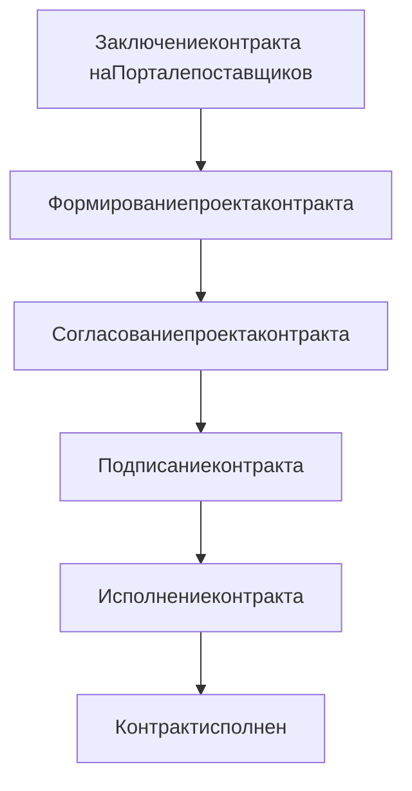

**Рисунок 273 – Общий процесс этапов заключения контракта**

### 11.1.1 Согласование проекта контракта Поставщиком

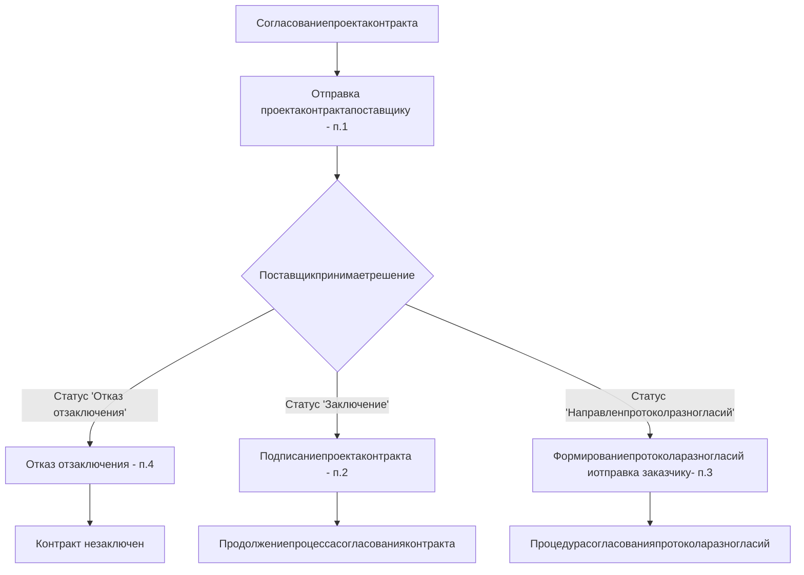

**Рисунок 274 – Процесс согласования проекта контракта Поставщиком**

---

158

1. Заказчик формирует проект контракта и направляет поставщику.
   После отправки контракта поставщику запускается процесс согласования контракта (Рисунок 274). До момента принятия решения поставщиком по проекту контракта, заказчику доступна возможность заменить файла контракта и отправить на согласование скорректированную версию.

   Для поставщика установлены регламентные сроки работы с контрактом из ЕАИСТ после победы в котировочной сессии. Поставщик должен рассмотреть проект контракта/договора и выполнить одно из действий (отправить протокол разногласий; отказаться от контракта; подписать проект контракта/договора) в течение 48 часов. При нарушении сроков происходит автоматический отказ поставщика от контракта.

   У поставщика есть возможность в течение времени, указанного на счетчике:
   - Подписать контракт;
   - Отправить протокол разногласий;
   - Отказаться от контракта.

2. **Подписать контракт**. Чтобы подписать контракт, поставщику необходимо нажать кнопку «Подписать». После чего пользователю станет доступен блок с полями (Рисунок 275):
   - для просмотра файла договора;
   - для указания даты, до которой заказчику необходимо подписать контракт;
   - для указания комментария к договору.

Рисунок 275 – Блок с полями ввода информации при подписании контракта

**Рисунок 275 – Блок с полями ввода информации при подписании контракта**

Для контрактов с признаком «Требуется обеспечение контракта» перед подписанием необходимо добавить информацию о финансовом обеспечении.
Нажать на кнопку «Подписать» – отобразятся поля для заполнения.

**Таблица 13 – Поля с информацией для финансового обеспечения**

| \*\*Наименование поля\*\*         | \*\*Описание\*\*                                                                                                                                                                                                                                              |
| --------------------------------- | ------------------------------------------------------------------------------------------------------------------------------------------------------------------------------------------------------------------------------------------------------------- |
| Вид обеспечения                   | Указать одно из:<br/>- Банковская гарантия<br/>- Залог денежных средств                                                                                                                                                                                       |
| Вид залога                        | Для вида обеспечения «Залог денежных средств» указать одно из:<br/>- В форме денежных средств<br/>- В форме депозита                                                                                                                                          |
| Номер в реестре                   | Заполняется для вида обеспечения «Банковская гарантия»                                                                                                                                                                                                        |
| Период действия                   | Заполняется датами начала и окончания. Для вида финансового обеспечения «Банковская гарантия» дата окончания должна быть позже даты окончания контракта на 1 месяц: срок действия контракта плюс один месяц с учетом рабочих дней и должна быть рабочим днем. |
| Финансовый документ               | Прикладывается файл                                                                                                                                                                                                                                           |
| Номер документа                   | Заполняется номер документы                                                                                                                                                                                                                                   |
| Дата документа                    | Заполняется дата документа                                                                                                                                                                                                                                    |
| Организация, выдавшая заключение: |                                                                                                                                                                                                                                                               |


---

159

| Наименование поля | Описание                                                        |
| ----------------- | --------------------------------------------------------------- |
| БИК               | Заполняется БИК организации, выдавшей заключение:               |
| Организация       | Заполняется организации, выдавшей заключение:                   |
| ИНН               | Заполняется ИНН организации, выдавшей заключение:               |
| Юридический адрес | Заполняется юридический адрес организации, выдавшей заключение: |


Пример заполнения информации для финансового обеспечения вида «Банковская гарантия»

**Рисунок 276 – Пример заполнения информации для финансового обеспечения вида**
**«Банковская гарантия»**

3. **Отправить протокол разногласий**. Для того, чтобы отправить протокол разногласий, поставщику необходимо нажать «Отправить протокол разногласий» на странице контракта. После нажатия поставщику доступны следующие кнопки прикрепления файла протокола, поля для указания срока ответа и комментария (Рисунок 277).

---

160

Блок с полями для заполнения информации по протоколу разногласий

**Рисунок 277 – Блок с полями для заполнения информации по протоколу разногласий**

! Установлено ограничение на количество Протоколов разногласий в рамках заключения контракта – один Протокол разногласий.

4. **Отказаться от контракта.** Для того, чтобы отказаться от заключения контракта необходимо нажать на кнопку «Полный отказ от заключения» (Рисунок 278), при этом понимать последствия (три и более раз в течение тридцати дней, исчисляемых со дня первого уклонения от подписания).

Кнопка отказа от заключения контракта

**Рисунок 278 – Кнопка отказа от заключения контракта**

Автоматический отказ от заключения при нарушении срока рассмотрения. При отсутствии действий в течение установленного срока происходит автоматическое совершение отказа от контракта с соответствующими последствиями (три и более раз в течение тридцати дней, исчисляемых со дня первого уклонения от подписания).

! Сроки на совершение действий Поставщиком – 48 часов.

Для контрактов по Котировочной сессии из ЕАИСТ, по которым установлено 2 победителя, в случае если Поставщик, являющийся первым победителем, отказался от заключения контракта, то работа по контракту переходит к Поставщику, являющемуся вторым победителем. Срок подписания оферт для второго Поставщика – 24 часа.

---

161

### 11.1.2 **Согласование проекта контракта Заказчиком**

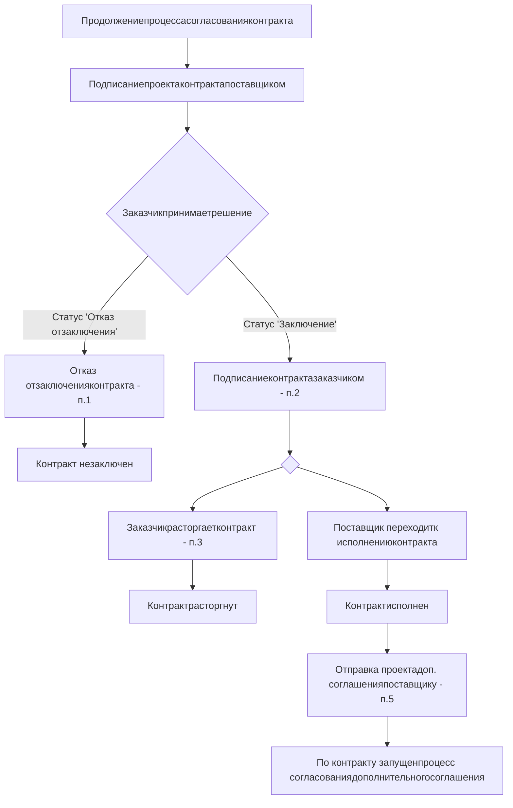

**Рисунок 279 – Процесс согласования проекта контракта Заказчиком**

После того, как поставщик подпишет проект контракта**, заказчик** имеет возможность:
1. **Отказаться от заключения контракта.** В этом случае контракт заключен не будет.
2. **Подписать контракт.** После подписания контракта заказчиком, пользователям будут доступны следующие действия по контракту:
3. **Расторжение контракта заказчиком**
4. **Исполнение контракта поставщиком**
5. **Формирование и отправка дополнительного соглашения** (процесс согласования дополнительного соглашения аналогичен согласованию контракта).

Для заказчика установлены регламентные сроки работы с контрактом: срок рассмотрения протокола разногласий – 48 часов, срок рассмотрения проекта контракта/договора – 48 часов.

---

162

### 11.1.3 Согласование протокола разногласий

Схема процесса согласования протокола разногласий

**Рисунок 280 – Согласование протокола разногласий**

Для контрактов из ЕАИСТ и РИС реализовано ограничение на количество Протоколов разногласий в рамках заключения одного контракта между заказчиком и поставщиком. Протокол разногласий может быть только один.

Формирование протокола разногласий доступно Поставщику на этапе проекта контракта (статус «Заключение»). После получения протокола разногласий от Поставщика Заказчик может:

− отказаться от протокола разногласий и отправить поставщику новый проект контракта. Процесс согласования проекта контракта будет продолжен;
− принять протокол разногласий и отправить поставщику новый проект контракта с учетом протокола разногласий. Процесс согласования проекта контракта будет продолжен;
− полностью отказаться от заключения контракта. В этом случае контракт заключен не будет.

---

163

## 11.2 Работа с контрактом в интерфейсе 2

Процедура заключения контракта в интерфейсе 2 между заказчиком и поставщиком представлена на схеме ниже (Рисунок 281).

Общий процесс этапов заключения контракта

**Рисунок 281 – Общий процесс этапов заключения контракта**

## 11.2.1 Области работы в интерфейсе 2

Пользователю в интерфейсе 2 доступны:
* страница просмотра текущей версии контракта;
* страница редактирования текущей версии контракта.

На страницу редактирования пользователь переходит по кнопке «**Действия**» на странице просмотра.

По действиям, которые требуют/предполагают заполнение полей, создается страница редактирования и заполнение осуществляется на странице редактирования.

По действиям, которые не требуют/предполагают заполнение полей, страница редактирования не создается и действия выполняются сразу.

Страница просмотра текущей версии контракта состоит из:
* области отображения статусной модели контракта (Рисунок 282 (1)). На текущем активном статусе дополнительно отображается перечень блоков текущей формы. При клике на один из элементов страница будет перемещена к этому элементу (Рисунок 282 (2));
* области отображения данных о контракте (Рисунок 282 (3)) – не редактируется;
* области расположения кнопок действия (Рисунок 282 (4), Рисунок 283 (1,2)) – если доступно одно действие, то на кнопке будет надпись с этим действием, если доступно несколько действий, то надпись на кнопке будет «Доступные действия» (Рисунок 283 (1)), и по клику на неё отобразиться перечень кнопок с доступными действиями (Рисунок 283 (2)).

---

164

Области интерфейса на странице просмотра контракта

**Рисунок 282 – Области интерфейса на странице просмотра контракта**

Отображение доступных действий на странице просмотра контракта

**Рисунок 283 – Отображение доступных действий на странице просмотра контракта**

Страница редактирования текущей версии контракта состоит из:
− области отображения статусной модели контракта (Рисунок 283 (1)). На текущем активном статусе дополнительно отображается перечень блоков текущей формы. При клике на один из элементов страница будет перемещена к этому элементу (Рисунок 283 (2));
− области отображения данных о контракте (Рисунок 284 (3)) – часть полей редактируется;
− области для расположения кнопок действия (Рисунок 284 (4)) – стандартно отображаются 3 кнопки:
− «Сохранить» (Рисунок 285(1)) – сохраняет введенные данные и приложенные файлы на странице редактирования;
− «Отменить внесенные изменения» (Рисунок 285 Рисунок 284(2)) – удаляет введенные данные и приложенные файлы на странице редактирования, удаляет страницу редактирования, возвращает возможность использовать кнопки по доступным действиям на странице просмотра в области «Доступные действия» (Рисунок 283 (1));

---

165

− кнопка завершения действия (Рисунок 285 (3)), выбранного на странице просмотра, и перевода контракта на следующий статус.

Области интерфейса на странице редактирования контракта

**Рисунок 284 – Области интерфейса на странице редактирования контракта**

Расположение кнопок при редактировании контракта

**Рисунок 285 – Расположение кнопок при редактировании контракта**

Во время заполнения полей на странице редактирования можно сохранить введенные данные по кнопке «Сохранить» (Рисунок 285 (1)) и закрыть страницу редактирования. Далее, если открыть страницу просмотра контракта – будут отображены данные без учета изменений на странице редактирования. Для возврата на страницу редактирования необходимо нажать кнопку «Продолжить выполнение операции» в области кнопок действия (Рисунок 286).

---

166

Расположение кнопки возврата на страницу редактирования из страницы просмотра

**Рисунок 286 – Расположение кнопки возврата на страницу редактирования из страницы просмотра**

### 11.2.2 Подписание контрактов с использованием МП «Госключ»

Возможность подписания контрактов, через МП «Госключ» реализована для Поставщиков с типом организации «Физическое лицо» и «Юридическое лицо».

Для подписания контракта через МП «Госключ» у Вас должно быть установлено это мобильное приложение. В приложении обязательно должна быть выпущена УКЭП. Иначе Вы получите уведомление о том, что документ направлен на подписание, но документ в МП «Госключ» не отобразится до момента получения УКЭП.

Срок на подписание контракта через МП «Госключ» не более 24 часов, после истечения этого срока контракт автоматически отменится ожидание подписания и станут доступны действия над контрактом. Отменить ожидание подписания также можно вручную.

Чтобы открыть форму подписания контракта, необходимо нажать на «Подписать и отправить заказчику». В форме подписания документа необходимо внимательно ознакомиться с документом.

Для отправки документа на подписание в МП «Госключ» необходимо нажать на кнопку «Подписать в МП «Госключ»», для получения дополнительной информации требуется навести курсор на пиктограммы подсказки, затем перейти по ссылке в сообщении (Рисунок 287).

Форма подписания документа

**Рисунок 287 – Форма подписания документа**

После нажатия на кнопку «Подписать в МП «Госключ»» контракт будет направлен на подписание в мобильное приложение «Госключ», о чем отобразится информационное

---

167

сообщение (Рисунок 288). Если вы захотите отменить подписание контракта через «Госключ», то необходимо нажать на кнопку «Отменить подписание в МП «Госключ»».

Пакет документов направлен в МП «Госключ». Для физических и юридических лиц на Портале поставщиков реализована возможность подписания документов с использованием мобильного приложения «Госключ». С подробной информацией об использовании приложения Вы можете ознакомиться по ссылке. Если при отправке пакета документов возникнут технические сложности - возможность подписания будет возвращена в течение нескольких минут и Вы сможете направить документы в МП «Госключ» повторно или подписать другим способом.

**Рисунок 288 – Информирование об отправке документа на подписание**

На подписание контракта в МП «Госключ» отведено 24 часа. Статус контракта «Контракт отправлен на подпись поставщику» не меняется (Рисунок 289).

Основная информация о контракте в статусе «Контракт отправлен на подпись поставщику»

**Рисунок 289 – Контракт в статусе «Контракт отправлен на подпись поставщику»**

Далее следует подписать документ в приложении «Госключ» (Рисунок 290, Рисунок 291) или в приложении отказаться от подписания.

Интерфейс приложения «Госключ» с информацией о пользователе Иванова Галина Андреевна и кнопкой «Подписание документов» со статусом «Ожидание подписания документов»

**Рисунок 290 – Ожидание подписания документа в МП «Госключ»**

---

168

Интерфейс подписания документа в МП «Госключ»

**Рисунок 291 – Интерфейс подписания документа в МП «Госключ»**

Инструкция по установке приложения и по работе в нем приведена по ссылке: [https://www.gosuslugi.ru/goskey](https://www.gosuslugi.ru/goskey).

## 11.2.3 Согласование проекта контракта Поставщиком

Процесс согласования проекта контракта Поставщиком

**Рисунок 292 – Процесс согласования проекта контракта Поставщиком**

1. Заказчик формирует проект контракта и направляет поставщику.
После отправки контракта поставщику запускается процесс согласования контракта (Рисунок 292). До момента принятия решения поставщиком по проекту контракта, заказчику доступна возможность заменить файла контракта и отправить на согласование скорректированную версию.

<mark>Для поставщика установлены регламентные сроки работы с контрактом из ЕАИСТ после победы в котировочной сессии. Поставщик должен рассмотреть проект контракта/договора и выполнить одно из действий (отправить протокол разногласий; отказаться от контракта; подписать проект контракта/договора) в течение 48 часов. При нарушении сроков происходит автоматический отказ поставщика от контракта.</mark>

---

169

У поставщика есть возможность в течение времени, указанного на счетчике:
− Подписать контракт;
− Отправить протокол разногласий;
− Отказаться от контракта.

2. **Подписать контракт**. Чтобы подписать контракт, поставщику необходимо нажать кнопку «Подписать проект контракта». После чего пользователю откроется страница редактирования. По нажатию на кнопку «Подписать и отправить заказчику» откроется модальное окно для подписания электронной подписью. В модальном окне по кнопке «Подписать и отправить» контракт будет подписан и сменит статус на «Контракт заключен».

Для контрактов с признаком «Требуется обеспечение контракта» перед подписанием необходимо добавить информацию о финансовом обеспечении. В блоке страницы «Обеспечение исполнения» необходимо заполнить следующие поля (Таблица 14).

**Таблица 14 – Поля с информацией для финансового обеспечения**

| Наименование поля                 | Описание                                                                                                                                               |
| --------------------------------- | ------------------------------------------------------------------------------------------------------------------------------------------------------ |
| Вид обеспечения                   | Указать одно из:<br/>• Банковская гарантия<br/>• Залог денежных средств                                                                                |
| Вид залога                        | Для вида обеспечения «Залог денежных средств» указать одно из:<br/>• В форме денежных средств<br/>• В форме депозита                                   |
| Номер в реестре                   | Заполняется для вида обеспечения «Банковская гарантия»                                                                                                 |
| Период действия                   | Заполняется датами начала и окончания. Для вида обеспечения «Банковская гарантия» дата окончания должна быть позже даты окончания контракта на 1 месяц |
| Финансовый документ               | Прикладывается файл                                                                                                                                    |
| Номер документа                   | Заполняется номер документы                                                                                                                            |
| Дата документа                    | Заполняется дата документа                                                                                                                             |
| Организация, выдавшая заключение: |                                                                                                                                                        |
| БИК                               | Заполняется БИК организации, выдавшей заключение:                                                                                                      |
| Организация                       | Заполняется организации, выдавшей заключение:                                                                                                          |
| ИНН                               | Заполняется ИНН организации, выдавшей заключение:                                                                                                      |
| Юридический адрес                 | Заполняется юридический адрес организации, выдавшей заключение:                                                                                        |


---

170

Пример заполнения информации для финансового обеспечения вида «Банковская гарантия»

**Рисунок 293 – Пример заполнения информации для финансового обеспечения вида «Банковская гарантия»**

3.     **Отправить протокол разногласий**. Для того, чтобы отправить протокол разногласий, поставщику необходимо нажать «Отправить протокол разногласий» на странице контракта. После нажатия откроется страница редактирования и поставщику станет доступно прикрепление файла протокола (Рисунок 294):

Блок с полями для прикрепления протокола разногласий

**Рисунок 294 – Блок с полями для прикрепления протокола разногласий**

Установлено ограничение на количество Протоколов разногласий в рамках заключения контракта – один Протокол разногласий.

По нажатию на кнопку «Отправить заказчику» откроется модальное окно для подписания электронной подписью. В модальном окне по кнопке «Подписать и отправить» контракт будет подписан и сменит статус на «Поставщиком отправлен протокол разногласий по контракту».

После создания Протокола разногласий – на странице контракта будет вкладка «Протокол разногласий» (Рисунок 295). Нажав на вкладку, отобразиться таблица с событиями контракта, связанными с документом протокола разногласий (Рисунок 296).

---

171

Вкладка «Протокол разногласий» на странице контракта

**Рисунок 295 – Вкладка «Протокол разногласий» на странице контракта**

Сведения на вкладке «Протокол разногласий» на странице контракта

**Рисунок 296 – Сведения на вкладке «Протокол разногласий» на странице контракта**

4. **Отказаться от контракта.** Для того, чтобы отказаться от заключения контракта необходимо нажать на кнопку «Отказаться от заключения», при этом понимать последствия (три и более раз в течение тридцати дней, исчисляемых со дня первого уклонения от подписания). Действие переведет контракт в статус «Отказ от заключения контракта поставщиком» и не создаст страницу редактирования.

**Автоматический отказ от заключения при нарушении срока рассмотрения.** При отсутствии действий в течение установленного срока происходит автоматическое совершение отказа от контракта с соответствующими последствиями (три и более раз в течение тридцати дней, исчисляемых со дня первого уклонения от подписания).

```description
Иконка восклицательного знака в красном круге
```

**Срок на совершение действий Поставщиком** – 48 часов.

Для контрактов по Котировочной сессии из ЕАИСТ, по которым установлено 2 победителя, в случае если Поставщик, являющийся первым победителем, отказался от заключения контракта, работа по контракту переходит к Поставщику, являющемуся вторым победителем. Срок подписания оферт для второго Поставщика – 1 день.

---

172

## 11.2.4 Согласование проекта контракта Заказчиком

Процесс согласования проекта контракта Заказчиком

**Рисунок 297 – Процесс согласования проекта контракта Заказчиком**

После того как поставщик подпишет проект контракта, **заказчик** имеет возможность:
1. **Отказаться от заключения контракта.** В этом случае контракт заключен не будет.
2. Подписать контракт
3. **Отозвать проект контракта** – возможность доступна для контрактов от региональных заказчиков.

После заключения контракта заказчиком будут доступны следующие действия по контракту:
4. **Формирование и отправка соглашения о расторжении Заказчиком** (процесс согласования соглашения о расторжении аналогичен согласованию контракта) (раздел 11.2.7).
5. Подтверждение факта исполнение контракта поставщиком.

---

173

6. **Формирование и отправка дополнительного соглашения Заказчиком** (процесс согласования дополнительного соглашения аналогичен согласованию контракта) (раздел 11.2.6).

После заключения контракта поставщику будут доступны следующие действия по контракту:

7. **Формирование и отправка дополнительного соглашения Поставщиком** (раздел 11.2.5).

Для заказчика установлены регламентные сроки работы с контрактом: срок рассмотрения протокола разногласий – 48 часов, срок рассмотрения проекта контракта/договора – 48 часов.

## 11.2.5 Формирование дополнительного соглашения Поставщиком

Формирование дополнительного соглашения доступно поставщику в контрактах со статусом:

− Отказ от заключения доп. соглашения заказчиком;
− Отказ от заключения доп. соглашения поставщиком;
− Доп. соглашение подписано заказчиком;
− Отказ от заключения соглашения о расторжении поставщиком;
− Отказ от заключения соглашения о расторжении заказчиком;
− Контракт заключен.

Для того, чтобы сформировать и отправить заказчику проект дополнительного соглашения поставщику необходимо нажать на кнопку «Сформировать проект доп. Соглашения» на странице просмотра. После нажатия создастся страница редактирования, на которой поставщику станет доступно прикрепить файлы дополнительного соглашения и приложения (Рисунок 298):

Рисунок 298 – Прикрепление файла доп. соглашения

**Рисунок 298 – Прикрепление файла доп. соглашения**

По нажатию на кнопку «Отправить заказчику» откроется модальное окно для подписания электронной подписью. В модальном окне по кнопке «Подписать и отправить» дополнительное соглашение будет подписано и сменит статус на «Доп. соглашение отправлено на подпись заказчику».

После отправки проекта дополнительного соглашения поставщиком заказчику доступны два действия аналогично последнему этапу при заключении контракта:

− Отказаться от заключения доп. Соглашения;
− Подписать доп. соглашение.

После создания Дополнительного соглашения – на странице контракта будет вкладка «Дополнительное соглашение» (Рисунок 300). Нажав на вкладку, отобразиться таблица с событиями контракта, связанными с документом дополнительного соглашения (Рисунок 300).

---

174

Вкладка «Дополнительное соглашение» на странице контракта

**Рисунок 299 – Вкладка «Дополнительное соглашение» на странице контракта**

Сведения на вкладке «Дополнительное соглашение» на странице контракта

**Рисунок 300 – Сведения на вкладке «Дополнительное соглашение» на странице**
**контракта**

## 11.2.6 Формирование дополнительного соглашения Заказчиком

Формирование дополнительного соглашения доступно заказчику в контрактах со статусом:
− Проект доп. соглашения отозван заказчиком;
− Отказ от заключения соглашения о расторжении заказчиком;
− Отказ от заключения соглашения о расторжении поставщиком;
− Поставщиком отправлен протокол разногласий по доп. Соглашению;
− Отказ от заключения доп. соглашения заказчиком;
− Доп. соглашение подписано заказчиком;
− Отказ от заключения доп. соглашения поставщиком;
− Контракт заключен.

Процесс согласования дополнительного соглашения между заказчиком и поставщиком аналогичен процессу согласования контракта (подробнее в разделах 11.2.3 и 11.2.4)

## 11.2.7 Формирование соглашения о расторжении Заказчиком

Формирование соглашения о расторжении доступно заказчику в контрактах со статусом:
− Поставщиком отправлен протокол разногласий по соглашению о расторжении;
− Контракт заключен;
− Проект соглашения о расторжении отозван заказчиком;

---

175

− Отказ от заключения соглашения о расторжении заказчиком;
− Отказ от заключения доп. соглашения заказчиком;
− Отказ от заключения соглашения о расторжении поставщиком;
− Отказ от заключения доп. соглашения поставщиком;
− Доп. соглашение подписано заказчиком.

Процесс согласования соглашения о расторжении между заказчиком и поставщиком аналогичен процессу согласования контракта (подробнее в разделах 11.2.3 и 11.2.4)

## 11.2.8 **Согласование протокола разногласий**

Процесс согласования протокола разногласий в интерфейсе 2 аналогичен процессу согласования в интерфейсе 1 (подробнее раздел 11.1.3).

## 11.2.9 **Формирование претензионной работы**

Формирование претензионной работы для контракта доступно заказчику в контрактах со статусом:
− Поставщиком отправлен протокол разногласий по соглашению о расторжении;
− Контракт заключен;
− Контракт расторгнут;
− Проект соглашения о расторжении отозван заказчиком;
− Отказ от заключения соглашения о расторжении заказчиком;
− Отказ от заключения доп. соглашения заказчиком;
− Отказ от заключения соглашения о расторжении поставщиком;
− Отказ от заключения доп. соглашения поставщиком;
− Доп. соглашение подписано заказчиком.

Заказчик имеет возможность:
• **Сформировать и отправить претензию.** Необходимо заполнение обязательных полей и подписание претензионной работы Заказчиком.

После получения претензионной работы поставщику будут доступны следующие действия по контракту:
• **Перейти в чат претензионной работы.**

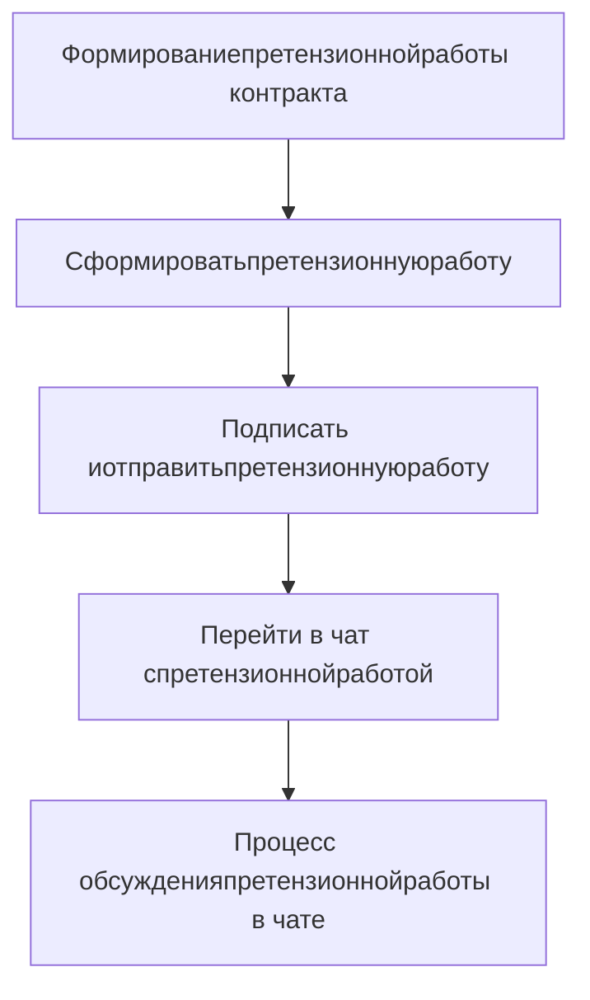

**Рисунок 301 – Процесс формирования претензионной работы по контракту Заказчиком**

---

176

**11.2.10Приглашение для незарегистрированных поставщиков: присоединение к проекту контракта через QR-код или прямую ссылку**

Поставщик переходит по ссылке, переданной Заказчиком. Поставщику отображается контракт (Рисунок 302) со следующей информацией.

| Наименование поля                              |
| ---------------------------------------------- |
| \*\*Блок «Основная информация»\*\*             |
| Статус                                         |
| Номер контракта                                |
| Реестровый номер                               |
| Срок исполнения контракта                      |
| Предмет контракта                              |
| Заключение происходит в соответствии с законом |
| Способ размещения закупки                      |
| Основание заключения                           |
| Требуется обеспечение исполнения контракта     |
| Место заключения                               |
| Идентификационный код закупки (ИКЗ)            |
| Источник финансирования                        |
| Сумма                                          |
| Аванс                                          |
| \*\*Сведения о заказчике\*\*                   |
| Наименование копании Заказчика                 |
| ФИО подписанта                                 |
| Должность подписанта                           |
| Общие сведения                                 |
| Банковские реквизиты                           |
| Контактные данные                              |
| \*\*Сведения о поставщике\*\*                  |
| Наименование копании Поставщика                |
| Общие сведения                                 |
| Банковские реквизиты                           |


---

177

| \*\*Наименование поля\*\*      |
| ------------------------------ |
| Контактные данные              |
| \*\*Остальные поля и блоки\*\* |
| Сведения о спецификациях       |
| Сведения о поставке            |
| Файл документа контракта       |


Отображение контракта с доступом без авторизации

**Рисунок 302 – Отображение контракта с доступом без авторизации**

При нажатии на кнопку «Принять приглашение» появляется модальное окно предупреждения (Рисунок 303).

Модальное окно «Предупреждение»

**Рисунок 303 – Модальное окно «Предупреждение»**

---

178

Поставщику перед подписанием контракта необходимо пройти регистрацию на Портале поставщиков. Поставщик может пройти регистрацию сейчас или вернуться к ней позже.

При нажатии на кнопку «Вернуться позже» модальное окно предупреждения закрывается. Ссылка на проект контракта остается активной.

При нажатии на кнопку «Продолжить» Система перенаправляет на страницу регистрации (раздел 3.3). Вернуться к проекту контракта без завершения регистрации будет невозможно. Ссылка станет недоступной и ее потребуется запросить у заказчика повторно.

После регистрации Поставщик открывает «Меню личного кабинета», проходит в раздел «Мои контракты» и переходит в «Контракты». Отображается контракт, созданный ранее Заказчиком.

После перехода в контракт Поставщик имеет возможность нажать на кнопку «Доступные действия» которая в свою очередь отображает следующие действия:

* Подписать проект контракта;
* Отказаться от заключения;
* Отправить протокол разногласий.

При нажатии на кнопку «Подписать проект контракта» страница контракта перезагружается и становится доступна кнопка «Подписать и отправить Заказчику».

На данном этапе Поставщик имеет возможность:

1. Вносить необходимые изменения в контракт.
2. Сохранить внесенные изменения нажатием кнопки «Сохранить».
3. Отменить внесенные изменения нажатием соответствующей кнопки.
4. Подписать и отправить контракт Заказчику нажатием соответствующей кнопки.
   При нажатии кнопки отображается модальное окно подтверждения c текстовым полем для комментарий (Рисунок 304). Поставщик имеет возможность: отменить действие нажатием на кнопку «Отменить»; подтвердить действие нажатием на кнопку «Подтвердить».

Завершить операцию? Комментарий [Комментарий] Отменить Подтвердить

**Рисунок 304 – Модальное окно «Подтверждение завершения операции»**

При нажатии на кнопку «Подтвердить» модальное окно подтверждения закрывается и отображается модальное окно «Подписание документа».

---

179

На данном этапе Поставщик имеет возможность:

1. Просмотреть документ;
2. Скачать документ нажатием соответствующей кнопки;
3. Отменить действие нажатием на кнопку «Отменить»;
4. Подтвердить действие нажатием на кнопку «Подписать и отправить». При нажатии на кнопку модальное окно «Подписание документа» закрывается. Отображается страница контракта с измененным статусом «Контракт подписан поставщиком» (Рисунок 305).

Рисунок 305 – Страница контракта с измененным статусом

**Рисунок 305 – Страница контракта с измененным статусом**

## 11.3 Исполнения

«**Реестр исполнений**» предназначен для навигации по электронным исполнениям организации.

Перейти в раздел «**Реестр исполнений**» можно из меню личного кабинета пользователя, выбрав пункт «Мои контракты», затем «Исполнения» (Рисунок 306).

По умолчанию в реестре отображаются все исполнения, принадлежащие организации-поставщику текущего пользователя. Исполнения по умолчанию отсортированы по дате создания.

Следует учитывать, что в реестре исполнений отображаются Исполнения в их конечном статусе. Например, было оформлено Исполнение на сумму 1 000,00 рублей, затем на него было выставлено УКД на сумму 999,00 рублей. В таком случае на карточке исполнения в реестре будет отображаться сумма 999,00 рублей.

Рисунок 306 – Переход в раздел «Реестр исполнений» из пользовательского меню

**Рисунок 306 – Переход в раздел «Реестр исполнений» из пользовательского меню**

## 11.3.1 Карточка исполнения

Карточка найденного исполнения содержит следующую информацию (Рисунок 307):

- Номер и дата исполнения;
- Статус исполнения;
- Сумма документа;
- Заказчик;
- Поставщик;

---

180

− Номер и дата контракта;
− Сумма контракта;
− Остаток суммы по контракту;
− Индикатор «Требуется действие» (при наличии);
− Функция документы;
− Оператор ЭДО;
− Ссылка для перехода к связанным документам.

Макет карточки исполнения в реестре исполнений

**Рисунок 307 – Макет карточки исполнения в реестре исполнений**

## 11.3.2 Фильтры в реестре исполнений

Предусмотрен ряд фильтров (Рисунок 308), которыми можно ограничить список отображаемых исполнений:
− Фильтры, отображаемые по умолчанию:
* Номер документа исполнения;
* Дата документа исполнения;
* Статус документа исполнения, ₽;
* Сумма документа исполнения;
* Заказчик;
* Требуется действие.

Пользователю доступны дополнительные фильтры. Отобразить дополнительные фильтры можно нажатием «Показать расширенные фильтры», скрыть нажатием «Скрыть расширенные фильтры».
− Расширенные фильтры:
* Номер контракта;
* Дата контракта;
* Реестровый номер контракта;
* Сумма контракта, ₽;
* Поставщик;
* Оператор ЭДО;
* Специализация контракта;
* Признак контракта.

---

181

Фильтры в реестре исполнений

**Рисунок 308 – Фильтры в реестре исполнений**

### 11.3.3 Фильтр при нажатии комбинации Alt+ЛКМ

При наведении на элемент карточки исполнения и нажатии комбинации клавиш Alt+ЛКМ автоматически заполнится и применится фильтр по выбранному элементу. Например, при наведении на статус «Черновик УПД» и нажатии Alt+ЛКМ, будет заполнен фильтр «Статус документа исполнения» значением «Черновик УПД», и будут показаны только те исполнения, которые имеют данный статус.

### 11.3.4 Выгрузка в XLSX

Поставщик может воспользоваться функцией «Выгрузить в XLSX». При нажатии на «Выгрузить в XLSX» (Рисунок 309) Портал предложит сохранить файл в формате *.xlsx, содержащий сведения об исполнениях с учетом установленных в реестре фильтров.

Кнопка «Выгрузить в XLSX»

**Рисунок 309 – Кнопка «Выгрузить в XLSX»**

### 11.3.5 Сортировка в реестре исполнений

Сортировкой по умолчанию в реестре исполнений является сортировка по дате создания исполнения. В начале списка отображаются новые исполнения, в конце списка – старые. Дополнительно пользователю доступны сортировки по следующим критериям (Рисунок 310):

* Дата исполнения;
* Номер исполнения;

---

182

−     Дата заключения контракта;
−     Сумма контракта;
−     Сумма исполнения;
−     Заказчик;
−     Поставщик;
−     Статус исполнения;
−     Оператор ЭДО.
Доступны сортировки по возрастанию и по убыванию.

Сортировки в реестре исполнений

**Рисунок 310 – Сортировки в реестре исполнений**

## 11.4 Бумажное исполнение контракта

Бумажное исполнение требуется для контрактов от московских заказчиков, по которым признак «Обязательное электронное исполнение с использованием УПД» отсутствует.

Для контрактов с бумажным исполнением доступна возможность отправки сканов документов.

По кнопке «Добавить исполнение» (1) или «Редактировать» добавленное (2) (Рисунок 311) откроется модальное окно (Рисунок 312).

---

183

Рисунок 311 – Открытие модального окна бумажного исполнения на странице контракта

**Рисунок 311 – Открытие модального окна бумажного исполнения на странице контракта**

Рисунок 312 – Заполнение данных в модальном окне бумажного исполнения

**Рисунок 312 – Заполнение данных в модальном окне бумажного исполнения**

Необходимо заполнить все поля (1-6), добавить документ (7 и 12) и данные о нём (8-11) (Рисунок 313).

---

184

Рисунок 313 – Заполнение данных о документе бумажного исполнения

**Рисунок 313 – Заполнение данных о документе бумажного исполнения**

Далее нажать «Отправить».

## 11.5 Электронное исполнение контракта

### 11.5.1 Общая информация

На Портале поставщиков реализована возможность по формированию универсального передаточного документа (УПД) по этапам исполнения контракта с последующей отправкой документов Оператору ЭДО.

Доступна возможность работы с двумя системам Электронного исполнения:
* оператор ЭДО Калуга-Астрал;
* ЕИС в качестве оператора ЭДО.

Инструкция по работе через ЕИС предоставлена отдельно – ознакомиться можно в разделе инструкций Поставщика и по ссылке [https://clck.ru/bmnhW](https://clck.ru/bmnhW)

При обновлении данных из ЕИС по контракту администратором портала у пользователя могут обновиться документы по исполнению.

Контракты разделены между системами Электронного исполнения по следующим правилам:

1) 223 ФЗ и установлен признак электронного исполнения «Обязательное электронное исполнение с использованием УПД» – всегда «оператор ЭДО Калуга-Астрал»
2) 44 ФЗ и установлен признак электронного исполнения «Обязательное электронное исполнение с использованием УПД» – в соответствие с таблицами ниже (ЕИС – Таблица 15, Калуга-Астрал – Таблица 16):

**Таблица 15 – Признаки контрактов по 44 ФЗ, подлежащих электронному исполнению через ЕИС**

| Тип                                                       | Способ размещения закупки (заказа)/определение поставщика                          | Способ размещения закупки (заказа)/определение поставщика                          |
| --------------------------------------------------------- | ---------------------------------------------------------------------------------- | ---------------------------------------------------------------------------------- |
| Конкурентные способы определения поставщика (обязанность) | Электронный аукцион                                                                |                                                                                    |
|                                                           |                                                                                    | Электронный конкурс                                                                |
|                                                           |                                                                                    | Электронный запрос котировок                                                       |
| Закупка у единственного поставщика (обязанность)          | Закупка товара на сумму, предусмотренную частью 12 статьи 93 (по п. 4 ч. 1 ст. 93) |                                                                                    |
|                                                           |                                                                                    | Закупка товара на сумму, предусмотренную частью 12 статьи 93 (по п. 5 ч. 1 ст. 93) |


**Таблица 16 – Признаки контрактов по 44 ФЗ, подлежащих электронному исполнению через Калуга-Астрал**

| Способ размещения закупки (заказа)/определение поставщика |
| --------------------------------------------------------- |
| Закупка у единственного поставщика – п.4 ч.1 ст.93        |


---

185

| \*\*Способ размещения закупки (заказа)/определение поставщика\*\*                          | \*\*Способ размещения закупки (заказа)/определение поставщика\*\*                                                                                                         | \*\*Способ размещения закупки (заказа)/определение поставщика\*\*                                            | \*\*Способ размещения закупки (заказа)/определение поставщика\*\* | \*\*Способ размещения закупки (заказа)/определение поставщика\*\* | \*\*Способ размещения закупки (заказа)/определение поставщика\*\* | \*\*Способ размещения закупки (заказа)/определение поставщика\*\*                                                                     | \*\*Способ размещения закупки (заказа)/определение поставщика\*\* | \*\*Способ размещения закупки (заказа)/определение поставщика\*\* | \*\*Способ размещения закупки (заказа)/определение поставщика\*\*                        | \*\*Способ размещения закупки (заказа)/определение поставщика\*\* | \*\*Способ размещения закупки (заказа)/определение поставщика\*\* | \*\*Способ размещения закупки (заказа)/определение поставщика\*\* |
| ------------------------------------------------------------------------------------------ | ------------------------------------------------------------------------------------------------------------------------------------------------------------------------- | ------------------------------------------------------------------------------------------------------------ | ----------------------------------------------------------------- | ----------------------------------------------------------------- | ----------------------------------------------------------------- | ------------------------------------------------------------------------------------------------------------------------------------- | ----------------------------------------------------------------- | ----------------------------------------------------------------- | ---------------------------------------------------------------------------------------- | ----------------------------------------------------------------- | ----------------------------------------------------------------- | ----------------------------------------------------------------- |
| Закупка у единственного поставщика – п. 5 ч.1 ст.93                                        |                                                                                                                                                                           |                                                                                                              |                                                                   |                                                                   |                                                                   |                                                                                                                                       |                                                                   |                                                                   |                                                                                          |                                                                   |                                                                   |                                                                   |
| 1. Закупка у субъектов естественных монополий                                              |                                                                                                                                                                           |                                                                                                              |                                                                   |                                                                   |                                                                   |                                                                                                                                       |                                                                   |                                                                   |                                                                                          |                                                                   |                                                                   |                                                                   |
| 2. Закупка у поставщика                                                                    | определенного Президентом РФ                                                                                                                                              | либо Правительством РФ                                                                                       |                                                                   |                                                                   |                                                                   |                                                                                                                                       |                                                                   |                                                                   |                                                                                          |                                                                   |                                                                   |                                                                   |
| 3. Выполнение работы по мобилизационной подготовке в РФ                                    |                                                                                                                                                                           |                                                                                                              |                                                                   |                                                                   |                                                                   |                                                                                                                                       |                                                                   |                                                                   |                                                                                          |                                                                   |                                                                   |                                                                   |
| 6. Закупка работы или услуги                                                               | выполнение или оказание которых может осуществляться только органом исполнительной власти                                                                                 | либо подведомственными ему государственным учреждением                                                       | государственным унитарным предприятием                            |                                                                   |                                                                   |                                                                                                                                       |                                                                   |                                                                   |                                                                                          |                                                                   |                                                                   |                                                                   |
| 7. Поставка российских вооружения и военной техники                                        | не имеющей российских аналогов                                                                                                                                            |                                                                                                              |                                                                   |                                                                   |                                                                   |                                                                                                                                       |                                                                   |                                                                   |                                                                                          |                                                                   |                                                                   |                                                                   |
| 8. Услуги по водоснабжению                                                                 | водоотведению                                                                                                                                                             | теплоснабжению                                                                                               | обращению с твердыми коммунальными отходами                       | газоснабжению                                                     | по подключению к сетям инженерно-технического обеспечения         | по хранению и ввозу/вывозу наркотических средств                                                                                      |                                                                   |                                                                   |                                                                                          |                                                                   |                                                                   |                                                                   |
| 9. Закупка товаров                                                                         | работ                                                                                                                                                                     | услуг при необходимости оказания медицинской помощи в неотложной или экстренной форме либо вследствие аварии | обстоятельств непреодолимой силы                                  | для предупреждения или ликвидации ЧС                              | для оказания гуманитарной помощи                                  |                                                                                                                                       |                                                                   |                                                                   |                                                                                          |                                                                   |                                                                   |                                                                   |
| 10. Поставка культурных ценностей для пополнения фондов                                    |                                                                                                                                                                           |                                                                                                              |                                                                   |                                                                   |                                                                   |                                                                                                                                       |                                                                   |                                                                   |                                                                                          |                                                                   |                                                                   |                                                                   |
| 11. Закупка товара                                                                         | работы                                                                                                                                                                    | услуги у предприятий УИС                                                                                     | в том числе для нужд исключительно организаций                    | предприятий                                                       | учреждений и органов уголовно-исполнительной системы              |                                                                                                                                       |                                                                   |                                                                   |                                                                                          |                                                                   |                                                                   |                                                                   |
| 12. Заключение учреждением                                                                 | исполняющим наказания                                                                                                                                                     | контракта на поставку товара для государственных нужд                                                        |                                                                   |                                                                   |                                                                   |                                                                                                                                       |                                                                   |                                                                   |                                                                                          |                                                                   |                                                                   |                                                                   |
| 13. Закупка произведений литературы и искусства определенных авторов                       |                                                                                                                                                                           |                                                                                                              |                                                                   |                                                                   |                                                                   |                                                                                                                                       |                                                                   |                                                                   |                                                                                          |                                                                   |                                                                   |                                                                   |
| 14. Закупка изданий определенных авторов                                                   | предоставление доступа к электронным изданиям                                                                                                                             |                                                                                                              |                                                                   |                                                                   |                                                                   |                                                                                                                                       |                                                                   |                                                                   |                                                                                          |                                                                   |                                                                   |                                                                   |
| 15. Посещение зоопарка                                                                     | театра                                                                                                                                                                    | кинотеатра                                                                                                   | концерта                                                          | цирка                                                             | музея                                                             | выставки или спортивного мероприятия                                                                                                  |                                                                   |                                                                   |                                                                                          |                                                                   |                                                                   |                                                                   |
| 16. Заключение контракта на оказание услуг по участию в мероприятии                        | проводимом для нужд нескольких заказчиков                                                                                                                                 | с поставщиком определенным организатором такого мероприятия                                                  |                                                                   |                                                                   |                                                                   |                                                                                                                                       |                                                                   |                                                                   |                                                                                          |                                                                   |                                                                   |                                                                   |
| 17. Заключение контракта учреждением                                                       | осуществляющим концертную или театральную деятельность                                                                                                                    | телерадиовещательным учреждением                                                                             | цирком                                                            | музеем                                                            | образовательной организацией                                      | зоопарком                                                                                                                             | планетарием                                                       | заповедником                                                      | парком на создание произведения литературы или искусства и (или) исполнения произведений | либо на изготовление и (или) поставку декораций                   | театрального (концертного) реквизита                              | музыкальных инструментов                                          |
| 18. Реализация входных билетов и абонементов                                               |                                                                                                                                                                           |                                                                                                              |                                                                   |                                                                   |                                                                   |                                                                                                                                       |                                                                   |                                                                   |                                                                                          |                                                                   |                                                                   |                                                                   |
| 19. Осуществление авторского контроля                                                      | авторского надзора за строительством соответствующими авторами; проведение технического и авторского надзора по сохранению объекта культурного наследия авторами проектов |                                                                                                              |                                                                   |                                                                   |                                                                   |                                                                                                                                       |                                                                   |                                                                   |                                                                                          |                                                                   |                                                                   |                                                                   |
| 20. Обеспечение визитов глав иностранных государств и делегаций                            |                                                                                                                                                                           |                                                                                                              |                                                                   |                                                                   |                                                                   |                                                                                                                                       |                                                                   |                                                                   |                                                                                          |                                                                   |                                                                   |                                                                   |
| 21. Обеспечение деятельности объектов государственной охраны                               |                                                                                                                                                                           |                                                                                                              |                                                                   |                                                                   |                                                                   |                                                                                                                                       |                                                                   |                                                                   |                                                                                          |                                                                   |                                                                   |                                                                   |
| 22. Управление многоквартирным домом                                                       |                                                                                                                                                                           |                                                                                                              |                                                                   |                                                                   |                                                                   |                                                                                                                                       |                                                                   |                                                                   |                                                                                          |                                                                   |                                                                   |                                                                   |
| 23. *Содержание и ремонт нежилых помещений*                                                | переданных в безвозмездное пользование заказчику                                                                                                                          |                                                                                                              |                                                                   |                                                                   |                                                                   |                                                                                                                                       |                                                                   |                                                                   |                                                                                          |                                                                   |                                                                   |                                                                   |
| 26. Направление в служебную командировку                                                   |                                                                                                                                                                           |                                                                                                              |                                                                   |                                                                   |                                                                   |                                                                                                                                       |                                                                   |                                                                   |                                                                                          |                                                                   |                                                                   |                                                                   |
| 28. Закупка лекарственных препаратов для назначения пациенту по решению врачебной комиссии |                                                                                                                                                                           |                                                                                                              |                                                                   |                                                                   |                                                                   |                                                                                                                                       |                                                                   |                                                                   |                                                                                          |                                                                   |                                                                   |                                                                   |
| 29. Энергоснабжение или купля-продажа электрической энергии                                |                                                                                                                                                                           |                                                                                                              |                                                                   |                                                                   |                                                                   |                                                                                                                                       |                                                                   |                                                                   |                                                                                          |                                                                   |                                                                   |                                                                   |
| 30. Закупка для подготовки и проведения выборов                                            | референдума                                                                                                                                                               | осуществления деятельности избирательной комиссии                                                            | комиссии референдума                                              |                                                                   |                                                                   |                                                                                                                                       |                                                                   |                                                                   |                                                                                          |                                                                   |                                                                   |                                                                   |
| 31. Приобретение для обеспечения федеральных нужд                                          | нужд субъекта РФ                                                                                                                                                          | муниципальных нужд нежилого здания                                                                           | строения                                                          | сооружения                                                        | помещения                                                         | определенных в соответствии с решением о реализации бюджетных инвестиций или о предоставлении субсидий на осуществление кап. вложений |                                                                   |                                                                   |                                                                                          |                                                                   |                                                                   |                                                                   |


---

186

|     | \*\*Способ размещения закупки (заказа)/определение поставщика\*\*                                                                                                                                                                                                                                                                                                                                                    |
| --- | -------------------------------------------------------------------------------------------------------------------------------------------------------------------------------------------------------------------------------------------------------------------------------------------------------------------------------------------------------------------------------------------------------------------- |
| 32. | Аренда нежилого здания, нежилого помещения, земельного участка                                                                                                                                                                                                                                                                                                                                                       |
| 33. | Оказание преподавательских услуг физическими лицами                                                                                                                                                                                                                                                                                                                                                                  |
| 34. | Заключение федеральным органом исполнительной власти контракта с иностранной организацией на лечение гражданина РФ за пределами территории РФ                                                                                                                                                                                                                                                                        |
| 35. | Заключение организациями, осуществляющими образовательную деятельность и признанными федеральными или региональными инновационными площадками, контрактов на поставку оборудования и программного обеспечения                                                                                                                                                                                                        |
| 36. | Заключение бюджетным учреждением, государственным, муниципальными унитарными предприятиями контракта, предметом которого является выдача независимой гарантии                                                                                                                                                                                                                                                        |
| 37. | Осуществление закупок изделий народных художественных промыслов                                                                                                                                                                                                                                                                                                                                                      |
| 38. | Заключение органами исполнительной власти, органами местного самоуправления контрактов на приобретение жилых помещений с юридическим лицом, заключившим в соответствии с Градостроительным кодексом РФ договор о комплексном развитии территории                                                                                                                                                                     |
| 39. | Заключение органами исполнительной власти, органами местного самоуправления контрактов на приобретение жилых помещений с лицом, заключившим на условиях 161-ФЗ договор аренды или безвозмездного пользования земельным участком для строительства                                                                                                                                                                    |
| 40. | Осуществление закупки в целях обеспечения органов внешней разведки РФ средствами разведывательной деятельности                                                                                                                                                                                                                                                                                                       |
| 41. | Осуществление закупки в целях обеспечения органов ФСБ средствами контрразведывательной деятельности и борьбы с терроризмом                                                                                                                                                                                                                                                                                           |
| 42. | Заключение федеральным органом исполнительной власти и его территориальными органами контрактов с физическими лицами на выполнение работ, связанных со сбором и с обработкой первичных статистических данных                                                                                                                                                                                                         |
| 44. | Закупка библиотеками, организациями, осуществляющими образовательную деятельность, государственными и муниципальными научными организациями услуг по предоставлению права на доступ к информации, содержащейся в документальных, реферативных, полнотекстовых зарубежных базах данных и специализированных базах данных международных индексов научного цитирования у операторов указанных баз данных                |
| 45. | Закупка библиотеками, организациями, осуществляющими образовательную деятельность, государственными и муниципальными научными организациями услуг по предоставлению права на доступ к информации, содержащейся в документальных, реферативных, полнотекстовых зарубежных базах данных и специализированных базах данных международных индексов научного цитирования у национальных библиотек и федеральных библиотек |
| 46. | Осуществление закупок товаров, работ, услуг за счет финансовых средств, выделенных на оперативно-разыскную деятельность                                                                                                                                                                                                                                                                                              |
| 47. | Осуществление закупки товара, производство которого создано или модернизировано и (или) освоено на территории РФ в соответствии со специальным инвестиционным контрактом, по регулируемым ценам и с учетом особенностей, предусмотренных ст. 111.3 44-ФЗ                                                                                                                                                             |
| 48. | Осуществление закупки товара или услуги, оказываемой с использованием имущества, производство которого создано или модернизировано и (или) освоено на территории субъекта РФ, в соответствии с государственным контрактом по регулируемым ценам и с учетом особенностей, предусмотренных ст. 111.4 44-ФЗ                                                                                                             |
| 49. | Осуществление федеральным органом исполнительной власти закупок работ по изготовлению акцизных марок для маркировки табачной продукции                                                                                                                                                                                                                                                                               |
| 50. | Осуществление закупки транспортных услуг и связанных с их обеспечением дополнительных услуг в случае необходимости выполнения воинских перевозок при возникновении угрозы военной безопасности РФ и (или) для обеспечения участия Вооруженных Сил РФ, других войск в операциях по поддержанию или восстановлению международного мира и безопасности за пределами РФ                                                  |


---

187

| \*\*Способ размещения закупки (заказа)/определение поставщика\*\*                                                                                                                                                                                                                                                                                                   |   |
| ------------------------------------------------------------------------------------------------------------------------------------------------------------------------------------------------------------------------------------------------------------------------------------------------------------------------------------------------------------------- | - |
| 51. Осуществление закупок юридических услуг в целях обеспечения защиты интересов РФ в иностранных и международных судах и арбитражах, а также в органах иностранных государств                                                                                                                                                                                      |   |
| 52. Осуществление закупок товаров, работ, услуг в целях реализации мер по осуществлению государственной охраны                                                                                                                                                                                                                                                      |   |
| 53. Заключение контрактов на оказание услуг по осуществлению рейтинговых действий ЮЛ, признаваемыми в соответствии с законодательством РФ кредитными рейтинговыми агентствами, а также иностранными ЮЛ, осуществляющими рейтинговые действия за пределами территории РФ                                                                                             |   |
| 54. Осуществление закупки работ по модернизации информационных систем для информационно-правового обеспечения деятельности палат Федерального Собрания РФ и услуг по сопровождению таких систем                                                                                                                                                                     |   |
| 55. Заключение контракта на оказание услуг по изготовлению бланков документов (в том числе временных), удостоверяющих личность гражданина РФ, личность иностранного гражданина или лица без гражданства, бланков свидетельств о государственной регистрации актов гражданского состояния, а также бланков документов для въезда в РФ (и выезда) иностранных граждан |   |
| 56. Закупка товаров, работ, услуг федеральным органом исполнительной власти, осуществляющим функции по выработке и реализации государственной политики в области обороны                                                                                                                                                                                            |   |
| 57. Закупка здания, нежилого помещения, земельного участка по результатам торгов, которые проводятся в соответствии с земельным законодательством, законодательством РФ об исполнительном производстве, 127-ФЗ                                                                                                                                                      |   |
| 58. Закупка материальных ценностей, выпускаемых из государственного материального резерва                                                                                                                                                                                                                                                                           |   |
| 59. Закупка товаров, работ, услуг дипломатическим представительством, консульским учреждением РФ, торговым представительством РФ                                                                                                                                                                                                                                    |   |
| 60. Закупка спортивной экипировки, оборудования, инвентаря, снаряжения, необходимых для подготовки, участия олимпийской, паралимпийской, спортивных сборных команд РФ в международных спортивных соревнованиях                                                                                                                                                      |   |


Работа электронного документооборота по электронному исполнению контрактов основана на следующих документах (**Таблица 17**):

**Таблица 17 – Документация Электронного документооборота**

| \*\*Наименование документа\*\*                                                                                                                                                                                                                                                                            | \*\*Суть документа\*\*                                                                         | \*\*Ссылка\*\*                                                                                      |
| --------------------------------------------------------------------------------------------------------------------------------------------------------------------------------------------------------------------------------------------------------------------------------------------------------- | ---------------------------------------------------------------------------------------------- | --------------------------------------------------------------------------------------------------- |
| Приказ Минфина России от 05.02.2021 N 14н "Об утверждении Порядка выставления и получения счетов-фактур в электронной форме по телекоммуникационным каналам связи с применением усиленной квалифицированной электронной подписи"                                                                          | Об обмене данными между поставщиком и заказчиком через оператора ЭДО (порядок действий, сроки) | https\://www\.garant.ru/products/ipo/prime/doc/400340257                                            |
| Постановление Правительства РФ от 26.12.2011 N 1137 (ред. от 02.04.2021) "О формах и правилах заполнения (ведения) документов, применяемых при расчетах по налогу на добавленную стоимость" (раздел «II. Правила заполнения счета-фактуры, применяемого при расчетах по налогу на добавленную стоимость») | Правила заполнения полей печатной формы УПД                                                    | http\://www\.consultant.ru/document/cons\_doc\_LAW\_124837/e9cfa13ee36b49d1d609bf78f5ae1e39726518af |
| Приказ ФНС России от 19.12.2018 № ММВ-7-15/820@ «Об утверждении формата счета-фактуры, формата представления документа об отгрузке товаров (выполнении работ), передаче имущественных прав (документа об оказании услуг), включающего в себя                                                              | правилах заполнения xml формы УПД                                                              | https\://normativ.kontur.ru/document?moduleId=1\&documentId=328588                                  |


---

188

| \*\*Наименование документа\*\*                                                                                                                                         | \*\*Суть документа\*\*                                 | \*\*Ссылка\*\*                                                                                      |
| ---------------------------------------------------------------------------------------------------------------------------------------------------------------------- | ------------------------------------------------------ | --------------------------------------------------------------------------------------------------- |
| счет-фактуру, и формата представления документа об отгрузке товаров (выполнении работ), передаче имущественных прав (документа об оказании услуг) в электронной форме» |                                                        |                                                                                                     |
| Файл XSD для Приказа ФНС России от 19.12.2018 № ММВ-7-15/820@                                                                                                          | XSD схема, которой должен соответствовать xml файл УПД | https\://data.nalog.ru/html/sites/www\.new\.nalog.ru/xsd/ON\_NSCHFDOPPR\_1\_997\_01\_05\_01\_02.xsd |


Для формирования структурированного документа пользователю необходимо пройти процедуру регистрации у Оператора ЭДО при первом для Поставщика контракте, который должен быть исполнен в рамках ЭДО. Регистрация осуществляется разово для каждого пользователя и не требует повторной отправки заявки на регистрацию Оператору ЭДО (кроме случая из раздела 11.5.5.1).

Перед тем, как отправить заявку на регистрацию Оператору ЭДО, необходимо проверить/заполнить сведения в профиле компании, а именно на вкладке «Основные сведения» должно быть заполнено поле «Код налогового органа» (Рисунок 314).

Рисунок 314 – Профиль компании

**Рисунок 314 – Профиль компании**

Для Индивидуальных предпринимателей необходимо заполнить поле «Реквизиты свидетельства о государственной регистрации ИП» или поле «Реквизиты листа записи Единого государственного реестра индивидуальных предпринимателей » в зависимости от даты регистрации в налоговом органе (правила заполнения описаны в разделе 12.1.1).

После заполнения профиля необходимо отправить заявку на изменение профиля компании и дождаться ее обработки.

## 11.5.2 Рекомендуемый порядок действий

Для работы с ЭДО можно следовать порядку действий, указанному ниже, либо видеоролику (порядок действий отличается, оба порядка допустимы [https://youtu.be/7pVFcrMSuSU](https://youtu.be/7pVFcrMSuSU)):

1. Открыть страницу Исполнения контракта (раздел 11.5.3).
2. Зарегистрироваться в ЭДО (раздел 11.5.5).

---

189

3. Установить связь с заказчиком в ЭДО (раздел 11.5.6).
4. Заполнить спецификацию (раздел 11.5.7).
5. Сформировать УПД (раздел 11.5.7.12).
6. Отправить УПД Оператору ЭДО и Заказчику (раздел 11.5.7.12).
7. Подтвердить факт отправки УПД Оператору ЭДО (раздел 11.5.11).
Процесс работы с ЭДО для Поставщика ниже (Рисунок 315 и Рисунок 316):

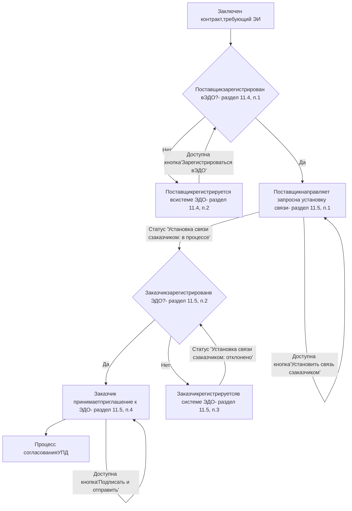

**Рисунок 315 – Работа с ЭДО – часть 1 – регистрация и установка связи**

---

190

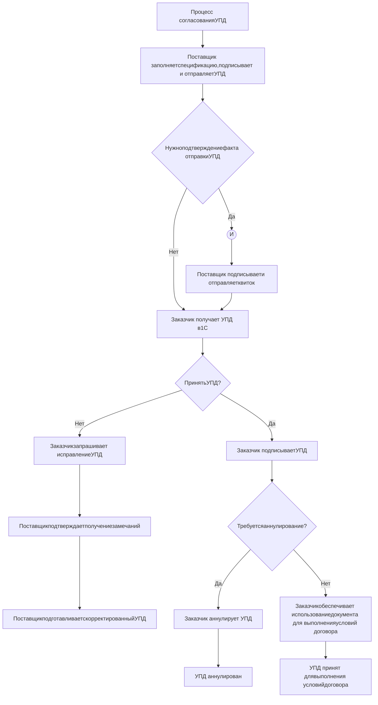

Рисунок 316 – Работа с ЭДО – часть 2 – отправка УПД и подтверждение квитка

---

191

### 11.5.3 Переход на страницу исполнения контракта

Перейти на страницу Исполнения контракта, находящегося в статусе «Заключен», и требующего Электронное исполнение можно, например, из реестра «Мои контракты» (Рисунок 317).

Рисунок 317 – Реестр контрактов

**Рисунок 317 – Реестр контрактов**

---

192

Данные параметры доступны в фильтрах реестра:

Реестр контрактов – фильтры «Заключен» и «Электронное исполнение»

**Рисунок 318 – Реестр контрактов – фильтры «Заключен» и «Электронное исполнение»**

На странице контракта в блоке «Сведения о поставке» выбрать необходимые даты поставки и совершить действие «Добавить исполнение» (Рисунок 319). Для каждого этапа поставки Поставщик может добавить такое количество этапов исполнений, которое считает нужным.

Блок «Сведения о поставке»

**Рисунок 319 – Блок «Сведения о поставке»**

При нажатии на кнопку «Добавить исполнение» отобразится окно с выбором этапа контракта и типа документа (Рисунок 320). Доступно к созданию три типа документа: счет-фактура, счет-фактура и документ о приёмке (УПД статус 1), документ о приёмке (УПД статус 2).

---

193

Выбор этапа и типа документа исполнения

**Рисунок 320 – Выбор этапа и типа документа исполнения**

Для сохранения выбранного типа исполнения в качестве значения по умолчанию нажмите «Запомнить выбор типа документа» в правом нижнем углу модального окна.
Изменение типа исполнения в созданном исполнении невозможно. В случае ошибочного выбора типа создайте новое исполнение или измените тип на странице исполнения.
В результате добавления сведений об исполнении в контракте появится блок с наименованием «Исполнение» (Рисунок 321).

Блок «Исполнение»

**Рисунок 321 – Блок «Исполнение»**

В блоке «Исполнение» можно нажать на кнопку «Перейти» для перехода на страницу исполнения контракта (Рисунок 321).
При первой попытке добавить исполнение для электронного исполнения отобразится модальное окно с соглашением по работе с ЭДО. Только после подтверждения согласия станет доступна работа с ЭДО на Портале поставщиков.
Страница исполнения этапа со сведениями об этапе поставки содержит следующую информацию:
− Блок основной информации по этапу исполнения с суммой этапа, суммой контракта и сведениями о контракте;
− Блок спецификации этапа контракта с возможностью редактирования информации по спецификации этапа поставки;
− Блок «Документы этапа контракта» с возможностью формирования структурированного документа УПД и с возможностью прикрепить файлы в дополнение к УПД в разделе «Приложения».

---

194

### 11.5.3.1 Журнал событий для Исполнения

На странице исполнения по кнопке «История изменения» (Рисунок 322) отобразится модальное окно (Рисунок 323) с действиями поставщика в рамках ЭДО с 12.02.2021:

- регистрация в ЭДО;
- установка связи с Заказчиком контракта. по данному исполнению;
- подписание и отправка УПД Заказчику;
- получение ответа на УПД от Заказчика;
- получение, подписание, отправка квитка.

Сумма исполнения этапа: 27 206,43 ₽ Сумма этапа контракта: 0 ₽ На исполнении История изменений

**Рисунок 322 – Кнопка «История изменений»**

Таблица истории изменений с колонками: Наименование действия, Дата действия, Пользователь, организация/внешняя система

**Рисунок 323 – Модальное окно «История изменений»**

### 11.5.4 Создание нового исполнения

На странице контракта в блоке «Сведения о поставке» выбрать необходимые даты поставки и совершить действие «Добавить исполнение» (Рисунок 319). Для каждого этапа поставки Поставщик может добавить такое количество этапов исполнений, которое считает нужным.

Таблица сведений о поставке с колонками: Дней на поставку, Период поставки, Место поставки

**Рисунок 324 – Блок «Сведения о поставке»**

При нажатии на кнопку «Добавить исполнение» отобразится окно «Выбор этапа контракта», с выбором этапа контракта и типа документа (Рисунок 320) соответственно. Доступно к созданию три типа документа: счет-фактура, счет-фактура и документ о приёмке (УПД статус 1), документ о приёмке (УПД статус 2).

---

195

Выбор этапа и типа документа исполнения

**Рисунок 325 – Выбор этапа и типа документа исполнения**

Для создания исполнения, в котором заказчик не является грузополучателем необходимо активировать соответствующий признак «Заказчик не является грузополучателем» под выбором этапа контракта.

Для сохранения выбранного типа исполнения в качестве значения по умолчанию нажмите «Запомнить выбор типа документа» в правом нижнем углу модального окна.

Изменение типа исполнения в созданном исполнении невозможно. В случае ошибочного выбора типа создайте новое исполнение.

В результате добавления сведений об исполнении в контракте появится блок с наименованием «Исполнение» (Рисунок 321).

Блок «Исполнение»

**Рисунок 326 – Блок «Исполнение»**

В блоке «Исполнение» можно нажать на кнопку «Перейти» для перехода на страницу исполнения контракта (Рисунок 321).

При первой попытке добавить исполнение для электронного исполнения отобразится модальное окно с соглашением по работе с ЭДО. Только после подтверждения согласия станет доступна работа с ЭДО на Портале поставщиков.

---

196

Страница исполнения этапа со сведениями об этапе поставки содержит следующую информацию (Рисунок 327):
− Блок основной информации по этапу исполнения с суммой этапа, суммой контракта и сведениями о контракте;
− Блок спецификации этапа контракта с возможностью редактирования информации по спецификации этапа поставки;
− Блок «Документы этапа контракта» с возможностью формирования структурированного документа УПД и с возможностью прикрепить файлы в дополнение к УПД в разделе «Приложения».

Рисунок 327 – Страница исполнения

**Рисунок 327 – Страница исполнения**

## 11.5.5 Регистрация в системе оператора ЭДО

Пользователю необходимо зарегистрироваться в системе оператора ЭДО, если от него требуется работа с ЭДО и регистрация еще не пройдена.
Чтобы зарегистрироваться, необходимо на странице Исполнения контракта нажать на кнопку «Зарегистрироваться в ЭДО» (Рисунок 328).

Рисунок 328 – Регистрация в ЭДО

**Рисунок 328 – Регистрация в ЭДО**

---

197

При нажатии на кнопку «Зарегистрироваться в ЭДО» появится статус регистрации пользователя «Идёт отправка».

Оператор ЭДО регистрирует поставщиков с корректными сведениями о компании и сертификатами пользователей.

Пользователям, которые будут работать с ЭП физического лица от имени ИП или ЮЛ необходимо будет выбрать МЧД для регистрации сертификата у оператора ЭДО Калуга-Астрал. МЧД должна содержать полномочие DIT_PP0004.

В случае успешной отправки и обработки заявки Оператором ЭДО у пользователя больше не будет отображаться кнопка «Зарегистрироваться в ЭДО» на странице Исполнения контракта. Повторно проходить регистрацию у Оператора ЭДО не требуется.

Если заявка на регистрацию была некорректной, у пользователя будет возможность повторно отправить заявку.

## 11.5.5.1 Изменение ЭП

При замене ЭП в ЛК пользователя, у которого есть связь с Оператором ЭДО (то есть доступна кнопка «Удалить связь», в блоке «Связь с внешними системами», в строке «Оператор ЭДО», на странице Профиля пользователя (Рисунок 441)), сертификат автоматически заменяется в системе Оператора ЭДО на актуальный.

## 11.5.6 Установка связи с Заказчиком

```description
Предупреждение: Во избежание ошибок при установлении связи просим направлять приглашение заказчику не ранее, чем через 24 часа после регистрации поставщика у оператора ЭДО АО «Калуга Астрал».
```

При первом контракте с Заказчиком в рамках ЭДО необходимо установить с ним связь (обменяться идентификаторами ЭДО).

Чтобы установить связь, необходимо на странице Исполнения контракта нажать на кнопку «Установить связь с заказчиком в ЭДО» (Рисунок 329).

Рисунок 329 – Отправка Заказчику приглашения к ЭДО

**Рисунок 329 – Отправка Заказчику приглашения к ЭДО**

1. Если Заказчик не зарегистрирован в системе ЭДО, то необходимо связаться с ними напомнить о данной потребности при работе в рамках ЭДО.

---

198

2. После регистрации Заказчика в системе ЭДО необходимо повторно отправить запрос на установку связи.
3. Заказчик может принять приглашение вручную, а также автоматически (если выполнена соответствующая настройка в системе УАИС БУ).

## 11.5.7 Заполнение Спецификации

В блоке «Спецификация» необходимо открыть вкладку «Детали» и нажать на кнопку «Редактировать» (Рисунок 330).

Блок «Спецификации этапа контракта»

**Рисунок 330 – Блок «Спецификации этапа контракта»**

В появившемся модальном окне редактирования сведений спецификации выбрать только необходимые для данного УПД товары/услуги/работы и заполнить информацию о них.

Редактирование спецификации

**Рисунок 331 – Редактирование спецификации**

---

199

Для редактирования уже выбранной спецификации необходимо так же нажать кнопку «Редактировать».

### 11.5.7.1 Указание СТЕ

СТЕ и артикулы заполняются автоматически. Для товаров поле СТЕ заполняется автоматически, изменить невозможно. Для услуг и работ при необходимости следует указать СТЕ, требующиеся по договору.

Для поиска СТЕ реализована поисковая строка по наименованию или ID СТЕ и расширенный поиск. Для вызова расширенного поиска СТЕ необходимо нажать на кнопку «Расширенный поиск» (Рисунок 332) или пиктограмму лупы (Рисунок 333):

Рисунок 332 – Вызов расширенного поиска из формы поиска

**Рисунок 332 – Вызов расширенного поиска из формы поиска**

Рисунок 333 – Вызов расширенного поиска через строку ввода СТЕ

**Рисунок 333 – Вызов расширенного поиска через строку ввода СТЕ**

На форме расширенного поиска предустановлены фильтры по КПГЗ и виду продукции согласно предмету контракта. Предустановленные фильтры можно сбросить и установить необходимые.

---

200

Расширенный поиск СТЕ

**Рисунок 334 – Расширенный поиск СТЕ**

Поиск СТЕ осуществляется по одному (или нескольким) параметрам, которые представлены в блоке фильтров (Рисунок 334; Таблица 18).

**Таблица 18 – Фильтры на форме расширенного поиска СТЕ**

| Фильтр                               | Значение фильтра                                           |
| ------------------------------------ | ---------------------------------------------------------- |
| Наименование СТЕ                     | Ввод наименования СТЕ                                      |
| Модель                               | Ввод модели СТЕ                                            |
| ID СТЕ                               | Ввод ID СТЕ                                                |
| Наименование производителя (ИНН/КПП) | Ввод наименования, ИНН или КПК производителя               |
| КПГЗ                                 | Выбор значения или значений из справочника видов продукции |
| Вид продукции                        | Выбор значения или значений из справочника видов продукции |
| *Наименование характеристики*        | Ввод наименования характеристики                           |
| Значение характеристики              | Ввод значения характеристики                               |


Для перехода к странице создания своей СТЕ необходимо нажать на кнопку «Создать СТЕ» в блоке спецификации (Рисунок 335):

---

201

Редактирование позиции спецификации в части СТЕ

**Рисунок 335 – Редактирование позиции спецификации в части СТЕ**

В карточках СТЕ, созданных из формы УПД отображается отличительный признак создания СТЕ из УПД ЭДО ЕИС или ЭДО КА (Рисунок 336).

Отличительный признак создания СТЕ из УПД

**Рисунок 336 – отличительный признак создания СТЕ из УПД**

### 11.5.7.2 Указание КТРУ

Поле «КТРУ» заполняется автоматически, и его нельзя будет отредактировать, если в сведениях о контракте есть информация о КТРУ. Если в сведениях о контракте информации о КТРУ нет, то поле «КТРУ» можно будет заполнить самостоятельно. Поле «КТРУ» не является обязательным для заполнения.

Чтобы выбрать КТРУ, необходимо нажать на поле ввода КТРУ (Рисунок 337). При нажатии на поле ввода КТРУ откроется форма выбора КТРУ (Рисунок 338). На данной форме будут отображены все КТРУ, чтобы найти конкретную КТРУ, необходимо ввести наименование или код КТРУ в поле «Наименование или код КТРУ» и нажать на «Применить». Чтобы выбрать КТРУ, необходимо установить галочку в чекбоксе рядом с нужной позицией и нажать на кнопку «Сохранить». Выбранное КТРУ отобразится в поле «КТРУ».

Поле ввода КТРУ

**Рисунок 337 – Поле ввода КТРУ**

---

202

Рисунок 338 – Форма выбора КТРУ

**Рисунок 338 – Форма выбора КТРУ**

**11.5.7.3 Ограничения по редактированию значений сумм**
− "Стоимость товара с НДС" не может быть больше указанной в контракте, поэтому невозможно указать большее значение;
− "Стоимость товара без НДС" расчетное и не может быть больше, чем "Стоимость товара с НДС" / 1,2 (на примере НДС=20%), поэтому невозможно указать большее значение;
− "Сумма НДС" расчетное и считается как разница между "Стоимость товара с НДС" и "Стоимость товара без НДС";
− Системы бухгалтерии заказчика учитывают 2 знака после запятой, поэтому в УАИС БУ передается то, что видно в интерфейсе на ПП (2 знака после запятой);
− Суммирующее поле "Стоимость товаров (работ, услуг), имущественных прав с налогом – всего" не может быть больше стоимости контракта;
− Суммирующее поле "Стоимость товаров (работ, услуг), имущественных прав без налога – всего" не может быть больше стоимости контракта;
− "Сумма налога, предъявляемая покупателю – всего" – не имеет ограничений на редактирование;

**11.5.7.4 Заполнение поля «Количество» для услуг и работ**
Если по контракту количество единиц позиции равно 1, но необходимо сделать более одной УПД, то необходимо в поле «Количество» на странице исполнения контракта указывать

---

203

количество меньше «1» пропорционально отгруженному объему, например 0.05 или 0.001.
Доступно указание 11 знаков после запятой.

### 11.5.7.5 Заполнение полей по пени и штрафам

Суммы штрафов и пени заполняются единоразово – штрафы и пени, уже указанные в одном УПД, не дублируются в других УПД.

### 11.5.7.6 Выбор расчетного счета Поставщика

Поле «Расчетный счет» по умолчанию заполняется банковскими реквизитами поставщика из контракта.

В случае если в контракте указано несколько расчетных счетов поставщика, то поле «Расчетный счет» будет предзаполнено первым из списка.

В случае если в контракте не указаны банковские реквизиты поставщика, то пользователь может выбрать расчетный счет из списка, указанного в профиле компании поставщика.

### 11.5.7.7 Заполнение RFID-метки и гарантийного срока для товаров МАФ

При наличии в спецификации товаров МАФ у пользователя появляется возможность добавить RFID-метку и гарантийный срок в месяцах по каждой позиции товара МАФ. Для этого необходимо нажать кнопку «Выгрузить xlsx», в полученном файле заполнить столбцы «Идентификатор метки» и «Гарантийный срок, мес», сохранить файл и нажатием кнопки «Загрузить xls с данными о МАФ» выбрать на устройстве пользователя заполненный файл и загрузить его на Портал поставщиков. Файл после загрузки обрабатывается Порталом автоматически и при отсутствии ошибок в заполнении данные загружаются на форму УПД.

Спецификации этапа контракта с кнопками загрузки и выгрузки данных

**Рисунок 339 – кнопки «Загрузить xls с данными о МАФ» и «Выгрузить xlsx» в блоке «Спецификации этапа контракта»**

### 11.5.7.8 Копирование позиций спецификации

Доступно копирование позиции спецификации со всеми ее сведениями с помощью элемента интерфейса для копирования (Рисунок 340). Все сведения (количество, СТЕ, сумма и т. д.) копии позиции совпадают с позицией, которая была скопирована.

---

204

Рисунок 340 – Копирование позиций спецификации

**Рисунок 340 – Копирование позиций спецификации**

**11.5.7.9 Заполнение сведений о текстовом объеме**

Для позиций с признаком текстового значения, который получен из контракта ЕИС, предусмотрен элемент интерфейса для обозначения текстового объема позиции. (Рисунок 341)

Параметр заполнения в текстовом формате должен быть выбран при следующих условиях:
* Автоматический выбор - если пользователь ввел символ в текстовом формате
* Ручной выбор - пользователь нажал на элемент интерфейса

При активации параметра заполнения в текстовом формате система должна предоставлять возможность ручного ввода значений в поля «Стоимость без НДС» и «Стоимость с НДС».

Рисунок 341 – Параметр заполнения объема в текстовом формате

**Рисунок 341 – Параметр заполнения объема в текстовом формате**

**11.5.7.10 Заполнение сведений о прослеживаемых товарах**

Ниже описаны правила заполнения сведений товарах, подлежащих прослеживаемости и ответы на сопутствующие вопросы.

Товар не из России – сведения о прослеживаемости не указываются.

Оператор ЭДО отправляет в систему камеральной проверки документы со сведениями о прослеживаемости.

Как узнать, что есть необходимость указания сведений о прослеживаемости:

1) Нормативный документ с требованиями к прослеживаемости: [https://www.garant.ru/products/ipo/prime/doc/401353382/](https://www.garant.ru/products/ipo/prime/doc/401353382/)
Постановление Правительства РФ от 1 июля 2021 г. N 1108 “Об утверждении Положения о национальной системе прослеживаемости товаров”

2) Сервис проверки товаров на необходимость указания сведений о прослеживаемости: [https://www.nalog.gov.ru/rn77/service/traceability/#tab2](https://www.nalog.gov.ru/rn77/service/traceability/#tab2)

Ниже описано заполнение полей на Портале поставщиков подробнее.

---

205

Рисунок 342 – Поля для заполнения сведений о товара с и без прослеживаемости

**Рисунок 342 – Поля для заполнения сведений о товара с и без прослеживаемости**

1) Обычный товар из России.
Не заполняются 3 последних поля:
− «Таможенная декларация»;
− «Ед.изм.» прослеживаемого товара;
− «Кол-во» прослеживаемого товара.
2) Обычный товар не из России.
Не заполняются 2 последних поля:
− «Ед.изм.» прослеживаемого товара;
− «Кол-во» прослеживаемого товара.
Заполняется поле:
− «Таможенная декларация».
3) Прослеживаемый товар.
Заполняются все поля + страна не может быть Россия.
То есть в отличии от вариант 1 и 2 заполняются:
− «Таможенная декларация» (в данном случае РПНТ);
− «Ед.изм.» прослеживаемого товара;
− «Кол-во» прослеживаемого товара.

## 11.5.7.11 Заполнение сведений о Периоде поставки

Текст «Время поставки истекло» (Рисунок 343 – Текст «Время поставки истекло») отображается, если для данного исполнения в поле окончания периода поставки указана прошедшая дата, или поле не заполнено. Необходимо указать актуальные даты (Рисунок 344).

Рисунок 343 – Текст «Время поставки истекло»

**Рисунок 343 – Текст «Время поставки истекло»**

---

206

Рисунок 344 – Поля для заполнения Периода поставки

**Рисунок 344 – Поля для заполнения Периода поставки**

**11.5.7.12  Заполнение сведений о транспортировке**
В поле «Данные о транспортировке и грузе» отражаются реквизиты транспортных документов, так же могут содержаться сведения о грузе.
Пример заполнения (Рисунок 345): 2 коробки (информация о комплектации поставки), перечислены номера транспортных накладных и дополнительная информация.

Рисунок 345 – Пример заполнения информации о транспортировке

**Рисунок 345 – Пример заполнения информации о транспортировке**

**11.5.7.13      Заполнение сведений о подписантах**
При заполнении спецификации пользователю необходимо заполнить обязательные поля (Рисунок 346; **Таблица 19 – Поля для заполнения сведения о подписанте**).

**Таблица 19 – Поля для заполнения сведения о подписанте**

| Наименование поля                | Обяз-сть | Пояснение к заполнению поля                                               |
| -------------------------------- | -------- | ------------------------------------------------------------------------- |
| Имя                              | Да       | Имя подписанта                                                            |
| Фамилия                          | Да       | Фамилия подписанта                                                        |
| Отчество                         | Да       | Отчество подписанта                                                       |
| Должность                        | Да       | Должность подписанта                                                      |
| Номер документа-основания        | Да       | Указывается номер документа-основания                                     |
| Наименование документа-основания | Да       | Указывается документ, наделяющий полномочием подписывать контракт/договор |
| Дата документа-основания         | Да       | Указывается дата документа-основания                                      |


---

207

Сведения о подписанте контракта

**Рисунок 346 – Сведения о подписанте контракта**

**Сведения о подписанте контракта**

* **Имя**:     
* **Фамилия**:     
* **Отчество**:     
* [ ] Нет отчества
* **Должность**:     
* **Наименование документа-основания**:     
* **Номер документа-основания**:     
* **Дата документа-основания**:

---

208

### 11.5.7.14 Исполнение с множественными грузополучателями

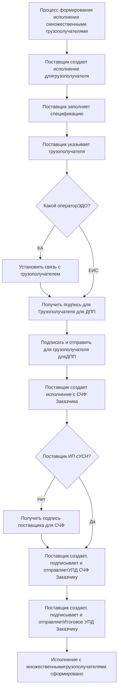

**Рисунок 347 – Процесс формирования исполнения с множественными грузополучателями**

---

209

### 11.5.7.14.1 Заполнение сведений о грузополучателях

Заполнение сведений о грузополучателях доступно в исполнениях со множественными грузополучателями.

Для создания исполнения, в котором заказчик не является грузополучателем необходимо активировать соответствующий признак «Заказчик не является грузополучателем» в контракте в модальном окне «Выбор этапа контракта» (Рисунок 320).

> Создание, изменение и отправка исполнений для Грузополучателей возможны только, если итоговое Исполнение доступно к редактированию.

Для перехода к заполнению сведений о грузополучателях необходимо нажать в блоке «Спецификация этапа контракта» кнопку «Редактировать» (Рисунок 348).

Спецификация этапа контракта

**Рисунок 348 – Спецификация этапа контракта**

В окне «Сведения об этапе» в блоке «Грузополучатель» нажать на кнопку «Изменить» (Рисунок 349).

«Сведения об этапе» блок «Грузополучатель»

**Рисунок 349 – «Сведения об этапе» блок «Грузополучатель»**

В открывшейся форме (Рисунок 350), возможны следующие варианты выбора источников сведений об организации для добавления грузополучателя:
* «Зарегистрированные на портале организации»;
* «Личный справочник»;
* «ЕГРЮЛ».

Так же доступна возможность добавления новой организации: при нажатии на кнопку «Добавить новую организацию» откроется форма ввода сведений об организации (Рисунок 351).

---

210

«Сведения об этапе» блок «Грузополучатель» в режиме редактирования

**Рисунок 350 – «Сведения об этапе» блок «Грузополучатель» в режиме редактирования**

«Сведения об этапе» блок «Грузополучатель», добавление новой организации

**Рисунок 351 – «Сведения об этапе» блок «Грузополучатель», добавление новой**
**организации**

### 11.5.7.14.2 Добавление или перенос исполнений для грузополучателей

Для заполнения сведений о двух и более грузополучателях по этапу контракта необходимо перейти в созданный ранее этап контракта и в блоке «Исполнения для грузополучателей» (Рисунок 352) нажать на одну из кнопок, в соответствии с необходимым вариантом создания исполнения или переноса ранее созданных исполнений в существующее:

* «Добавить» – при нажатии на кнопку «Добавить» появиться окно подтверждения создания нового исполнения для грузополучателя (Рисунок 353), в котором необходимо нажать на кнопку «Создать», после чего будет создано исполнение для грузополучателя;
* «Перенести из» – при нажатии на кнопку откроется модальное окно с выбором сведений из существующего исполнения (Рисунок 354), в котором доступен множественный выбор из созданных ранее исполнений, при нажатии на кнопку «Перенести исполнения», исполнения будут перенесены из созданных ранее исполнений в текущее.

---

211

Исполнения для грузополучателей

**Рисунок 352 – Этап контракта, блок «Исполнения для грузополучателей»**

Создание исполнения для грузополучателя

**Рисунок 353 – Окно подтверждения создания исполнения для грузополучателя**

Перенос исполнений документов приёма-передачи из других исполнений контракта

**Рисунок 354 – Модальное окно с выбором сведений из существующего исполнения**

Перенос исполнения доступен на странице исполнения для грузополучателя (Рисунок 355). Для переноса исполнения необходимо нажать на кнопку «Перенести в другое Итоговое Исполнение» и в появившемся модальном окне выбрать Итоговое исполнение, в которое требуется перенести исполнение для грузополучателя и нажать на кнопку «Перенести исполнение».

---

212

Страница исполнения для грузополучателя

**Рисунок 355 – Страница исполнения для грузополучателя**

## 11.5.8 Формирование УПД

На странице документа УПД доступны элементы интерфейса для предварительного скачивания файлов УПД (**Рисунок 356 – Предварительное скачивание файлов УПД**). Эти же элементы отображаются на странице исправительного УПД (**Рисунок 357 – Предварительное скачивание файлов исправительного УПД**).

Предварительное скачивание файлов УПД

**Рисунок 356 – Предварительное скачивание файлов УПД**

Предварительное скачивание файлов исправительного УПД

**Рисунок 357 – Предварительное скачивание файлов исправительного УПД**

После заполнения спецификации Исполнения необходимо сформировать структурированный документ, который будет отправлен Оператору ЭДО, и в последующем по данному документу будет произведена приемка этапа поставки Заказчиком (**Рисунок 358**).

Документы этапа контракта

**Рисунок 358 – Документы этапа контракта**

Для формирования документа УПД необходимо заполнить реквизиты документа, выбрать «Тип документа» и нажать «Сформировать УПД» – в результате будет сформирована печатная форма документа и структурированный файл. Структурированный файл будет отправлен Оператору ЭДО.

Оператору ЭДО отправляется файл XML.

## 11.5.9 Подписание УПД

После формирования УПД его необходимо подписать и отправить с помощью соответствующей кнопки (**Рисунок 359**).

---

213

Рисунок 359 – Файл УПД

**Рисунок 359 – Файл УПД**

Поставщик и Заказчик подписывают xml файл УПД. Печатная форма УПД является визуализацией данных в человеко-читаемой форме для пользователя и не подписывается.

## 11.5.10Доработка УПД после отправки по замечаниям и ошибкам

При наличии технических ошибок, выявленных системой оператора ЭДО, статус УПД изменится на «Отказано заказчиком (комментарий оператора ЭДО)». Необходимо нажать кнопку «Сформировать УПД повторно» (Рисунок 360), учесть замечания, нажать «Обновить УПД» (Рисунок 362), подписать и отправить УПД.

При получении сообщения по УПД от Заказчика с указанием на необходимость доработки документа статус УПД изменится на "Отказано заказчиком (комментарий заказчика)". Необходимо нажать кнопку «Сформировать УПД повторно» (Рисунок 360), учесть замечания, нажать «Обновить УПД» (Рисунок 362), подписать и отправить УПД.

Обращения в Службу технической поддержки для статусов вида «Отказано заказчиком»:
* о корректности заполнения сведений для УПД на Портале поставщиков,
* о передаче сведений из Портала поставщиков в систему Заказчика,
* и об отображении сведений в xml файле УПД и на Печатной форме.

Принимаются на рассмотрение только при соблюдении пользователем условий, обеспеченных предварительно перед отправкой обращения:
* Поставщик нажал кнопку «Сформировать УПД повторно»,
* Поставщик произвёл действия по самостоятельному устранению проблемы,
* Поставщик оставил страницу исполнения, указанного в обращении, в режиме возможности редактирования.

---

214

Пример УПД с отказом Заказчика

**Рисунок 360 – Пример УПД с отказом Заказчика**

При получении сообщения по УПД от Заказчика о направлении УПД на аннулирование статус УПД изменится на «Аннулировано заказчиком (комментарий заказчика)». Необходимо нажать кнопку «Сформировать УПД повторно» (Рисунок 361), учесть замечания, нажать «Обновить УПД» (Рисунок 362), подписать и отправить УПД.

Пример УПД с аннулированием от Заказчика

**Рисунок 361 – Пример УПД с аннулированием от Заказчика**

---

215

Рисунок 362 – Кнопка «Обновить УПД»

**Рисунок 362 – Кнопка «Обновить УПД»**

По нажатию кнопки «Сформировать УПД повторно» Поставщик прекращает работу с текущим УПД и начинает работу с новым УПД на текущей странице Исполнения Контракта. Далее Поставщик заполняет данные и отправляет новый УПД. Таким образом, вносимые изменения не являются корректировкой ранее отправленного УПД с помощью Исправительного УПД или УКД (т.е. корректировочного документа к УПД) (где УКД – это Универсальный корректировочный документ).

### 11.5.11Подтверждение уведомления о регистрации исполнения в ЭДО

По нажатию на кнопку «Подписать и отправить» документ считается подписанным и отправленным Заказчику через оператора ЭДО. Далее пользователь получает уведомление о том, что Оператор ЭДО получил документы, и необходимо подтвердить получение данного уведомление. В блоке «Документы этапа контракта» будет доступно действие «Подтвердить уведомление о регистрации исполнения в ЭДО (Рисунок 363). Это служебная транзакция, Поставщик подтверждает её с помощью ЭП, а Оператор ЭДО при необходимости предоставляет данные о служебных транзакциях при разбирательствах в суде.

Рисунок 363 – Подтверждение уведомления

**Рисунок 363 – Подтверждение уведомления**

После этого считается, что Поставщик выполнил свою часть работы по формированию и отправке УПД. Далее необходимо ожидать от Заказчика выполнения им своих обязательства по работе с УПД и ДО.

Заказчик отправит изменение статуса УПД:
− Завершено – Заказчик подписал;
− Требуется уточнение – Заказчик отправил УПД на доработку;

---

216

Статус не изменился – Заказчик не обработал УПД, в таком случае необходимо связаться с ними напомнить о данной потребности при работе в рамках ЭДО (Заказчик не ограничен сроками на ответы).

Заказчик может указать, что Исполнение перешло в статус «Исполнено», это не влияет на работу Поставщика (то есть поставщик может формировать и отправлять УПД).

По завершению выполнения контракта Заказчик указывает в системе, что контракт закрыт. Контракт при этом получает статус «Исполнен». Заказчик может изменить статус контракта на «Исполнен», не указав при этом, что этапы исполнения выполнены – в таком случае по контракту всё еще необходимо работать в рамках условий договора.

Подтверждать получение уведомления о том, что Заказчик перевел контракт в «Исполнен» не требуется. Требование к использованию УПД указано в договоре. По итогам работы по контракту, исполняемому в рамках ЭДО, должны быть принятые УПД, суммарно удовлетворяющие требования контракта. В подписанном контракте указывается:
− способ фиксации выполнения условий и требований контракта;
− возможность перехода на бумажное исполнение.

**11.5.12Уведомления**

Ознакомиться с уведомлениями о сроках исполнения этапа и статусах документа ЭДО пользователь может в личном кабинете в разделе «Уведомления» (описание приведено в разделе 6.4).

---

217

## 12 Управление профилем

В разделе управление профилем размещен функционал по редактированию данных организации. Перейти в раздел «**Управление профилем**» можно из меню личного кабинета поставщика (Рисунок 364).

Раздел содержит следующие подразделы:
− Профиль компании (раздел 12.1);
− Филиалы и подразделения (раздел 12.2);
− Публичный профиль компании (раздел 0).

Рисунок 364 – Раздел «Управление профилем»

**Рисунок 364 – Раздел «Управление профилем»**

## 12.1 Профиль компании

В профиле компании содержатся сведения о регистрационных данных компании.
Для того, чтобы перейти в профиль компании, необходимо в меню личного кабинета пользователя выбрать раздел «**Управление профилем**» и осуществить переход в подраздел «**Профиль компании**» (Рисунок 364).

Страница «**Профиль компании**» состоит из:
− Навигационной панели в левой части экрана (Рисунок 365 (1));
− Блоков со сведениями об организации в правой части экрана (Рисунок 365 (2));
− Панели с возможными действиями пользователя внизу экрана (Рисунок 365 (3)).

1 Навигационная панель отражает содержание блоков страницы «**Профиль компании**». Панель можно использовать для автоматической прокрутки до необходимого блока страницы. Переход осуществляется нажатием на нужный подраздел.

2 Профиль поставщика состоит из следующих блоков:
− Тип организации;
− Основные сведения;
− Банковские реквизиты;
− Контактная информация;
− Статистические коды;
− Дополнительная информация;
− Сведения о пользователях (Рисунок 366): блок доступен администратору компании. В блоке отражен перечень пользователей компании и доступны следующие возможности:
    • создавать новых пользователей компании;
    • настройка полномочий пользователям компании;
    • добавлять МЧД пользователям компании, подробнее в разделе 13.1.5.2;
    • управлять пользователями компании.
− Отправленные запросы.

---

218

Профиль компании

**Рисунок 365 – Профиль компании**

Раздел профиля компании «Сведения о пользователях»

**Рисунок 366 – Раздел профиля компании «Сведения о пользователях»**

3 На панели доступных действий пользователю отображается кнопка перехода к форме редактирования сведений об организации «Заявка на изменение данных». При нажатии на кнопку поля становятся доступными для редактирования, по завершению редактирования сведений пользователем отправляется заявка на модерацию сведений об организации (подробнее в разделе 12.1.1).
Также на странице профиля компании отображаются кнопки перехода в **карточку** **поставщика** и **отображения истории блокировок** (Рисунок 367).

Кнопки перехода к карточке поставщика и истории блокировок

**Рисунок 367 – Кнопки перехода к карточке поставщика и истории блокировок**

---

219

При нажатии на **«История блокировок»** поставщику откроется модальное окно с информацией об истории операций (Рисунок 368).

Рисунок 368 – Раздел профиля компании «История блокировок»

**Рисунок 368 – Раздел профиля компании «История блокировок»**

Есть возможность отправить жалобу в АСКД или получить информацию из ЕИС, в случае снятия блокировки РНП – подробнее в разделе (25).
При нажатии на кнопку **«Карточка поставщика»** откроется страница с основной информацией о компании, её контрактах и достижениях (Рисунок 369).

Рисунок 369 – Карточка поставщика (публичный профиль компании)

**Рисунок 369 – Карточка поставщика (публичный профиль компании)**

## 12.1.1 Заявка на изменение сведений о компании

Для изменения сведений о компании необходимо в разделе «Управление профилем» всплывающего пользовательского меню нажать на кнопку «Профиль компании».

---

220

На странице «Профиль компании» на панели доступных действий нажать кнопку «Заявка на изменение данных» (Рисунок 370), после чего поля формы станут доступны для редактирования.

Рисунок 370 – Кнопка «Заявка на изменение данных»

**Рисунок 370 – Кнопка «Заявка на изменение данных»**

Функционал изменения сведений компании доступен для пользователей со следующими ролями:
− Администратор компании;
− Поставщик;
− Уполномоченный специалист поставщика;
− Специалист по работе с офертами на основе СТЕ.

При отправке заявки на изменение данных и до утверждения заявки пользователю будут недоступны действия с котировочными сессиями, контрактами и офертами.

Описание полей, отображаемых в заявке на изменение данных профиля приведено ниже.

**Блок «Тип организации»** состоит из следующих полей (Рисунок 370):
• «Поставщик»;
• «Заказчик»;
• «Производитель».

**Блок «Общие сведения о компании»** состоит из полей, указанных в таблице ниже (Таблица 20; Рисунок 371):

**Таблица 20 – Поля блока «Основные сведения» страницы «Заявка на изменение данных»**

| Наименование поля | Обяз-сть | Пояснение к заполнению поля                                                                                    |
| ----------------- | -------- | -------------------------------------------------------------------------------------------------------------- |
| Тип компании      | Да       | Возможные значения:<br/>• «Индивидуальный предприниматель»;<br/>• «Юридическое лицо»;<br/>• «Физическое лицо». |


---

221

| Наименование поля                                                                     | Обяз- сть | Пояснение к заполнению поля                                                                                                                                                                                                                                                                                                                                               |
| ------------------------------------------------------------------------------------- | --------- | ------------------------------------------------------------------------------------------------------------------------------------------------------------------------------------------------------------------------------------------------------------------------------------------------------------------------------------------------------------------------- |
|                                                                                       |           | (тип присваивается при регистрации и недоступен для редактирования)                                                                                                                                                                                                                                                                                                       |
| Полное наименование организации                                                       | Да        | Полное наименование организации                                                                                                                                                                                                                                                                                                                                           |
| Краткое наименование                                                                  | Нет       | Краткое наименование организации                                                                                                                                                                                                                                                                                                                                          |
| ИНН                                                                                   | Да        | Идентификационный номер налогоплательщика<br/>(автоматически загружается из сертификата, не доступно для изменения)                                                                                                                                                                                                                                                       |
| КПП                                                                                   | Да        | Код причины постановки на учет                                                                                                                                                                                                                                                                                                                                            |
| ОГРН                                                                                  | Да        | Основной государственный регистрационный номер<br/>(автоматически загружается из сертификата, не доступно для изменения)                                                                                                                                                                                                                                                  |
| Организационно-правовая форма                                                         | Да        | Выбор значения из справочника ОКОПФ                                                                                                                                                                                                                                                                                                                                       |
| Страна                                                                                | Да        | Страна регистрации.<br/>(выбор значения из выпадающего списка с подсказками)                                                                                                                                                                                                                                                                                              |
| Дата постановки на учет в налоговом органе                                            | Да        | Установка даты постановки на учет с помощью встроенного календаря                                                                                                                                                                                                                                                                                                         |
| Регион регистрации организации                                                        | Да        | Регион регистрации организации<br/>(выбор значения из выпадающего списка с подсказками)                                                                                                                                                                                                                                                                                   |
| Код налогового органа                                                                 | Нет       | Код налогового органа из 4 цифр                                                                                                                                                                                                                                                                                                                                           |
| Юридический адрес                                                                     | Да        | Юридический адрес организации по регистрационным документам                                                                                                                                                                                                                                                                                                               |
| Ставка НДС по умолчанию                                                               | Нет       | автоматически сохраняется при выборе любого значения из списка                                                                                                                                                                                                                                                                                                            |
| Код ЕРУЗ                                                                              | Нет       | необходим для работы с Электронным исполнение контрактов через ЕИС                                                                                                                                                                                                                                                                                                        |
| СМП                                                                                   | Нет       | Признак: «Субъект малого предпринимательства»                                                                                                                                                                                                                                                                                                                             |
| Реквизиты свидетельства о государственной регистрации индивидуального предпринимателя | Нет       | Правила заполнения зависят от документа регистрации ИП:<br/>1) Для документов регистрации с 1 января 2017 года:<br/>ОГРНИП и датой листа для ИП;<br/>2) Для документов регистрации до 2017 года:<br/>дата выдачи Свидетельства, налоговый орган, выдавший Свидетельство, о дате внесения записи об индивидуальном предпринимателе в ЕГРИП и ОГРНИП, серия и номер бланка) |


---

222

Блок «Основные сведения» на странице «Заявка на изменение данных»

**Рисунок 371 – Блок «Основные сведения» на странице «Заявка на изменение данных»**

Блок **«Банковские реквизиты»** состоит из полей, указанных в таблице ниже (Таблица 21; Рисунок 372):

**Таблица 21 – Поля блока «Банковские реквизиты» страницы «Заявка на**
**изменение данных»**

| Наименование поля                | Обяз-сть | Пояснение к заполнению поля                     |
| -------------------------------- | -------- | ----------------------------------------------- |
| Банковский идентификационный код | Да       | Поле должно содержать 9 символов                |
| Название банка                   | Да       | Наименование банка                              |
| Адрес банка                      | Нет      | Адрес банка (выбор значения из справочника ГАР) |
| Расчетный счет                   | Да       | Поле должно содержать 20 символов               |
| Корреспондентский счет           | Нет      | Поле должно содержать 20 символов               |
| Лицевой счет                     | Нет      | Поле должно содержать 20 символов               |


---

223

Форма добавления банковских реквизитов с полями: Лицевой счет, Название банка, Адрес, Город, чекбоксом «Счет используется в контрактной системе» и кнопками «Сохранить», «Отмена»

**Рисунок 372 – Блок «Банковские реквизиты» на странице «Заявка на изменение данных»**

Допустимо добавлять новые счета с банковскими реквизитами и редактировать счета, ранее не указанные в Банковских гарантиях или Исполнениях контракта.
Для добавления нового счета необходимо нажать на кнопку «Добавить» и заполнить поля формы согласно таблице (Рисунок 373).

Таблица с данными банковских реквизитов и кнопкой «Добавить +» внизу

**Рисунок 373 – Кнопка «Добавить» в блоке «Банковские реквизиты»**

Не допускается удаление и изменение банковских реквизитов, которые указаны в Банковских гарантиях или Исполнениях контракта.
Допускается перенос счетов в архив. Для этого необходимо нажать на пиктограмму (Рисунок 374) и отправить заявку на изменение данных.

Блок «Банковские реквизиты» с записью счета и пиктограммой архива, на которую указывает красная стрелка

**Рисунок 374 – Пиктограмма «Архив» в блоке «Банковские реквизиты»**

**Блок «Контактная информация»** состоит из полей, указанных в таблице ниже (Таблица 22; Рисунок 375):

---

224

**Таблица 22 – Поля блока «Контактная информация» страницы «Заявка на изменение данных»**

| Наименование поля                 | Обяз-сть | Пояснение к заполнению поля             |
| --------------------------------- | -------- | --------------------------------------- |
| Фактический адрес местонахождения | Да       | Адрес местонахождения организации       |
| Часовая зона                      | Да       | Часовая зона расположения организации   |
| Сайт                              | Нет      | Web адрес сайта организации при наличии |
| Факс                              | Нет      | ФАКС                                    |
| Фамилия                           | Да       | Фамилия контактного лица                |
| Имя                               | Да       | Имя контактного лица                    |
| Отчество                          | Нет      | Отчество контактного лица               |
| Без отчества                      | Нет      | Заполняется при необходимости           |
| Телефон                           | Да       | Телефон контактного лица организации    |
| Email                             | Да       | Адрес электронной почты организации     |


Для редактирования данных о контактном лице необходимо нажать на пиктограмму «Редактирование» в блоке «Контактные лица» (Рисунок 375).

Пиктограмма редактирование в блоке «Контактная информация» на странице «Заявка на изменение данных»

**Рисунок 375 – Пиктограмма редактирование в блоке «Контактная информация» на странице «Заявка на изменение данных»**

В открывшейся форме необходимо отредактировать данные и нажать на кнопку «Сохранить» (Рисунок 376).

---

225

Рисунок 376 – Форма редактирования блока «Контактные лица» на странице «Заявка на изменение данных»

**Рисунок 376 – Форма редактирования блока «Контактные лица» на странице «Заявка на изменение данных»**

Блок **«Статистические коды»** состоит из полей, указанных в таблице ниже (Таблица 23; Рисунок 377):

**Таблица 23 – Поля блока «Статистические коды» страницы «Заявка на изменение данных»**

| Наименование поля | Обяз- сть | Пояснение к заполнению поля                                                                             |
| ----------------- | --------- | ------------------------------------------------------------------------------------------------------- |
| ОКТМО             | Да        | Код ОКТМО (значение из 8 или 11 знаков)                                                                 |
| ОКАТО             | Да        | Код ОКАТО (значение из 8 или 11 знаков; если в коде 11 знаков и на конце 000, то их указывать не нужно) |
| ОКПО              | Да        | Код ОКПО (значение из 8 или 10 знаков)                                                                  |
| ОКВЭД             | Да        | Код ОКВЭД (значение из 4, 5 или 6 знаков)                                                               |
| ОКОПФ             | Да        | Значение из справочника «Общероссийский классификатор организационно-правовых форм»                     |
| ОКФС              | Нет       | Код ОКФС (значение из 2 знаков)                                                                         |


---

226

Рисунок 377 – Блок «Статистические коды» на странице «Профиль компании»

**Рисунок 377 – Блок «Статистические коды» на странице «Профиль компании»**

**Блок «Дополнительная информация»** состоит из следующих полей (Рисунок 378):
− Учреждение/предприятие Уголовно-исполнительной системы;
− Социально ориентированная некоммерческая организация;
− Организация инвалидов.

Рисунок 378 – Блок «Дополнительные реквизиты» на странице «Заявка на изменение данных»

**Рисунок 378 – Блок «Дополнительные реквизиты» на странице «Заявка на изменение данных»**

После внесения изменений в сведения об организации необходимо отправить заявку на модерацию, нажав кнопку «Отправить заявку» (Рисунок 379).

Рисунок 379 – Кнопка «Отправить заявку»

**Рисунок 379 – Кнопка «Отправить заявку»**

После подтверждения заявки модераторами внесенные сведения о компании будут изменены.
Данные по заявке можно посмотреть в блоке **«Отправленные заявки»**, для этого на странице **«Профиль компании»** необходимо перейти к блоку **«Отправленные запросы»** (Рисунок 380).

---

227

Отображение отправленных заявок на изменение профиля компании

**Рисунок 380 – Отображение отправленных заявок на изменение профиля компании**

Пока заявка не будет одобрена, у пользователей компании в шапке Портала рядом с изображением профиля будет отображен признак «Права ограничены», при наведении на который покажется причина ограничений.

## 12.1.2 Дополнения для самозанятых

В профиле компании самозанятого Поставщика дополнительно есть поле «Лимит в год на специальный налоговый режим в соответствии с 422-ФЗ» (Рисунок 381)

Лимит в год на специальный налоговый режим в соответствии с 422-ФЗ

**Рисунок 381 – Лимит в год на специальный налоговый режим в соответствии с 422-ФЗ**

Данное поле позволяет отслеживать остаток из лимита, заполняется пользователем самостоятельно вручную.

При превышении наименование поля меняется на «Превышен лимит на специальный налоговый режим в соответствии с 422-ФЗ» (Рисунок 382).

Превышен лимит на специальный налоговый режим в соответствии с 422-ФЗ

**Рисунок 382 – Превышен лимит на специальный налоговый режим в соответствии с 422-ФЗ**

1. Сумма по умолчанию – 2,4 млн.руб., можно редактировать в любое время, но более 2,4 млн ввести невозможно.
2. При заключении контракта (после подписания двумя сторонами) сумма уменьшается.
3. При расторжении контракта сумма "Ограничение на сумму контракта" увеличивается на сумму расторгнутого контракта.
4. При превышении суммы контрактов над лимитами название поля меняется на "Перерасход средств". В поле выводится разница между заключенными контрактами и заданным.
5. В уведомлении о подписании контракта есть информация об остатке лимита.
6. При создании и редактировании СТЕ по умолчанию указана страна "Россия", страну изменить нельзя.

---

228

## 12.2 Филиалы и подразделения

В личном кабинете поставщика в разделе **«Управление профилем»** реализован подраздел **«Филиалы и подразделения»** (Рисунок 364).

При нажатии на подраздел осуществится переход на страницу **«Филиалы и подразделения»** (Рисунок 383).

Рисунок 383 – Страница «Филиалы и подразделения»

**Рисунок 383 – Страница «Филиалы и подразделения»**

## 12.2.1 Реестр «Филиалы и подразделения»

Реестр «Филиалы и подразделения» реализован для создания связи между головной организацией и филиалом, управления утвержденными связями, а также для выполнения действий над филиалами администратором головной организации.

Реестр «Филиалы и подразделения» состоит из:
− Блока с фильтрами для поиска филиалов;
− Карточек с данными об организации (заявки);
− Кнопок:
    o «Действия над филиалом»;
    o «Добавить связь».

1 В блоке с фильтрами доступна возможность фильтрации по критериям, указанным в таблице ниже (Таблица 24).

**Таблица 24 – Фильтры реестра «Филиалы и подразделения»**

| \*\*Фильтр\*\* | \*\*Значение фильтра\*\*                                                                                                                                                                                               |
| -------------- | ---------------------------------------------------------------------------------------------------------------------------------------------------------------------------------------------------------------------- |
| Статус заявки  | Выбор одного из следующих значений:<br/>⎯ Отправлено на утверждение;<br/>⎯ Отправлено на утверждение головной организацией;<br/>⎯ Утверждено головной филиалом/подразделением;<br/>⎯ Утверждено головной организацией; |


---

229

| — Отклонено головной организацией;<br/>— Отклонено филиалом/подразделением;<br/>— Черновик. |                                                                                                |
| ------------------------------------------------------------------------------------------- | ---------------------------------------------------------------------------------------------- |
| Наименование организации                                                                    | Ввод полного наименования организации                                                          |
| КПП                                                                                         | Ввод КПП организации                                                                           |
| Регион регистрации                                                                          | Выбор значения из справочника                                                                  |
| Статус поставщика                                                                           | Выбор одного из следующих значений:<br/>— Все;<br/>— Незаблокированные;<br/>— Заблокированные. |


2 Карточка с данными об организации (**Рисунок 384**). В реестре отображаются карточки заявок на установку связи с отображением статуса связи.

Для администратора головной организации появляются дополнительные возможности работы с филиалом, когда заявка переходит в статус «Утверждено филиалом/подразделением» или «Утверждено головной организацией».

Рисунок 384 – Карточка реестра «Филиалы и подразделения»

**Рисунок 384 – Карточка реестра «Филиалы и подразделения»**

3 По кнопке «Добавить связь» открывается форма создания заявки на установку связи с зарегистрированной организацией (**Рисунок 385**, подробнее в разделах 12.2.2, 12.2.3).

Рисунок 385 – Форма создания заявки на установку связи

**Рисунок 385 – Форма создания заявки на установку связи**

Заявка на установку связи может быть двух видов:
* Заявка на установку связи от головной организации филиалу;
* Заявка на установку связи от филиала/подразделения головной организации.

Организация может быть головной организацией или филиалом/подразделением.
Организация, которая не является головной организацией, не может иметь филиалы/подразделения.

4 По кнопке «Действия над филиалом» открывается действие «Создать филиал или подразделение» – при нажатии на кнопку открывается форма «Создание филиала или подразделения», подробнее описание приведено в разделе 12.2.5.

**12.2.2 Заявка на установку связи от головной организации филиалу**

Для создания заявки от головной организации филиалу необходимо выбрать тип связи «Филиал и подразделение» в блоке «Выбор типа связи» (Рисунок 386).

---

230

Форма создания заявки на установку связи с типом связи «Филиал или подразделение»

**Рисунок 386 – Форма создания заявки на установку связи с типом связи «Филиал или подразделение»**

Далее выбрать одну или несколько организаций для установки связи в блоке «Выбор организаций» (Рисунок 387 (2)). В блоке доступна фильтрация по наименованию организации и по КПП (Рисунок 387 (1)).

Выбор организации при создании заявки головной организацией

**Рисунок 387 – Выбор организации при создании заявки головной организацией**

После выбора организаций необходимо нажать на кнопку «Отправить» для создания заявки или заявок (при множественном выборе) на установку связи с филиалом или подразделением (Рисунок 387 (3)).

Созданные заявки будут отображаться в реестре «Филиалы и подразделения» в статусе «Отправлено на утверждение головной организацией» (Рисунок 388).

Заявки на установку связи головной организацией филиалу

**Рисунок 388 – Заявки на установку связи головной организацией филиалу**

---

231

После утверждения заявки филиалом или подразделением статус заявки изменится на «Утверждено филиалом/подразделением» (Рисунок 389 (1)).

Рисунок 389 – Заявка на установку связи с головной организацией в статусе «Утверждено филиалом/подразделением»

**Рисунок 389 – Заявка на установку связи с головной организацией в статусе «Утверждено филиалом/подразделением»**

У администратора головной организации появится возможность перехода к просмотру статистики филиала по кнопке «Посмотреть статистику организации» (Рисунок 389 (2)).

## 12.2.3 Заявка на установку связи от филиала/подразделения головной организации

Для создания заявки от филиала подразделения к головной организации необходимо выбрать тип связи «Головная организация» в блоке «Выбор типа связи» (Рисунок 390).

Рисунок 390 – Форма создания заявки на установку связи с типом связи «Головная организация»

**Рисунок 390 – Форма создания заявки на установку связи с типом связи «Головная организация»**

Далее необходимо выбрать одну организацию для установки связи в блоке «Выбор организаций» (Рисунок 391 (2)). В блоке доступна фильтрация по наименованию организации и по КПП (Рисунок 391 (1)).

Рисунок 391 – Выбор организации при создании заявки филиалом/подразделением

**Рисунок 391 – Выбор организации при создании заявки филиалом/подразделением**

После выбора организации необходимо нажать на кнопку «Отправить» для создания заявки на установку связи с головной организацией (Рисунок 391 (3)).

---

232

Созданная заявка будет отображаться в реестре «Филиалы и подразделения» в статусе «Отправлено на утверждение головной организацией» (Рисунок 392).

Заявка на установку связи с головной организацией в статусе «Отправлено на утверждение»

**Рисунок 392 – Заявка на установку связи с головной организацией в статусе «Отправлено на утверждение»**

После утверждения заявки головной организацией статус заявки изменится на «Утверждено головной организацией» (Рисунок 393).

Заявка на установку связи с головной организацией в статусе «Утверждено головной организацией»

**Рисунок 393 – Заявка на установку связи с головной организацией в статусе «Утверждено головной организацией»**

## 12.2.4 Управление заявкой на установку связи

При получении заявки на установку связи пользователю приходит уведомление о создании новой заявки на установку связи с его организацией со ссылкой на заявку (Рисунок 394, Рисунок 395).

Уведомление для головной организации о запросе на установку связи с филиалом/подразделением

**Рисунок 394 – Уведомление для головной организации о запросе на установку связи с филиалом/подразделением**

Уведомление для филиала/подразделения о запросе на установку связи с головной организацией

**Рисунок 395 – Уведомление для филиала/подразделения о запросе на установку связи с головной организацией**

---

233

При переходе по ссылке для организации отображается заявка с возможностями:
1) Утвердить связь (Рисунок 396);
2) Отклонить связь (Рисунок 397).

Кнопка «Утвердить связь»

**Рисунок 396 – Кнопка «Утвердить связь»**

Кнопка «Отклонить связь»

**Рисунок 397 – Кнопка «Отклонить связь»**

После утверждения заявки на установку связи у организации отображается возможность удалить связь с организацией (Рисунок 398).

Кнопка «Удалить связь»

**Рисунок 398 – Кнопка «Удалить связь»**

## 12.2.5 Создание филиала или подразделения

Если филиал или подразделение ещё не зарегистрирован на Портале поставщиков у администратора компании головной организации есть возможность направить приглашение на регистрацию представителю филиала. Для этого необходимо в реестре «Филиалы и подразделения» (раздел 12.2.1) нажать на кнопку «Действия над филиалом», затем выбрать действие «Создать филиал или подразделение».

---

234

Интерфейс раздела «Филиалы и подразделения» с открытым выпадающим меню «Действия над филиалами»

**Рисунок 399 – Действие «Создать филиал или подразделение»**

В открывшейся форме «Создание филиала или подразделения» (Рисунок 400) необходимо заполнить все обязательные поля (поля ИНН и ОГРН заполнены автоматически сведениями из профиля компании головной организации) и нажать на кнопку «Отправить приглашение на регистрацию».

Приглашение на регистрацию будет направлено пользователю на указанную электронную почту, приглашение отобразится в реестре «Приглашения на регистрацию» (раздел 12.2.7).

Пользователю, получившему приглашение потребуется авторизоваться на Портале поставщиков с реквизитами, полученными в письме, задать новый пароль и зарегистрировать профиль компании по стандартному сценарию регистрации без ЭП (раздел 3.3.3).

---

235

Форма «Создание филиала или подразделения»

**Рисунок 400 – Форма «Создание филиала или подразделения»**

## 12.2.6 Создание филиала или подразделения с полным набором сведений

Чтобы заполнить полный набор сведений об организации филиала сотрудником головной организации и использовать МЧД сотрудника филиала для самостоятельной регистрации организации филиала необходимо в реестре «Филиалы и подразделения» (раздел 12.2.1) нажать на кнопку «Действия над филиалом», затем выбрать действие «Создать филиал или подразделение с полным набором сведений» (Рисунок 401).

---

236

Рисунок 401 – Действие «Создать филиал или подразделение с полным набором сведений»

**Рисунок 401 – Действие «Создать филиал или подразделение с полным набором сведений»**

В открывшейся форме «Создание филиала/подразделения с полным набором сведений» (Рисунок 402Рисунок 400) необходимо заполнить все обязательные поля (поля ИНН и ОГРН заполнены автоматически сведениями из профиля компании головной организации) и нажать на кнопку «Направить приглашение на регистрацию филиала/подразделения».

Рисунок 402 – Форма «Создание филиала/подразделения с полным набором сведений»

**Рисунок 402 – Форма «Создание филиала/подразделения с полным набором сведений»**

---

237

Приглашение на регистрацию будет направлено пользователю на указанную электронную почту, приглашение отобразится в реестре «Приглашения на регистрацию» (раздел 12.2.7).

Пользователю, получившему приглашение потребуется перейти по ссылке в письме, после этого отроется форма регистрации пользователя с ЭП ФЗ. Необходимо будет выбрать ЭП, а также прикрепить файл МЧД в формате xml и подпись к ней (Рисунок 403).

Форма регистрации

**Рисунок 403 – Форма регистрации**

Далее будет пропущен второй шаг с выбором типа организации, так как тип будет браться из головной организации. На третьем этапе «Регистрация организации» будут предзаполнены все поля, кроме информации в блоке «Для регистрации филиала и подразделения» (Рисунок 404). Нужно будет нажать на галочку под полем «Регистрация филиала или подразделения», далее прикрепить файл МЧД и подпись к ней. Чтобы завершить регистрацию, необходимо нажать «Завершить операцию».

Блок «Для регистрации филиала или подразделения»

**Рисунок 404 – Блок «Для регистрации филиала или подразделения»**

---

238

### 12.2.7 Реестр «Приглашения на регистрацию»

В реестре «Приглашения на регистрацию» отображаются все направленные головной организацией приглашения на регистрацию (процесс направления приглашения описан в разделе 12.2.5).

Рисунок 405 – Реестр «Приглашения на регистрацию»

**Рисунок 405 – Реестр «Приглашения на регистрацию»**

### 12.3 Публичный профиль компании

В меню личного кабинета пользователя в разделе «**Управление профилем**» реализован подраздел «**Публичный профиль компании**» (Рисунок 364).

При нажатии на кнопку осуществится переход на страницу заявок на изменение публичного профиля компании (Рисунок 406).

---

239

Страница «Заявки на изменение публичного профиля компании»

**Рисунок 406 – Страница «Заявки на изменение публичного профиля компании»**

По кнопке «Создать» откроется страница создания заявки на изменение публичного профиля компании (Рисунок 407).

Карточка заявки на изменение публичного профиля компании

**Рисунок 407 – Карточка заявки на изменение публичного профиля компании**

На карточке заявки необходимо заполнить следующие данные:
− Блок «Общая информация»:
    • Логотип организации;
    • Общая информация о компании.
− Блок «Файлы»:
    • Документы – здесь можете приложить сертификаты, награды и т.д. (размер одного загружаемого файла не должен превышать 10 Мб);
    • Портфолио – здесь можете приложить изображения и ссылки на You-tube каналы.
− Блок «Справочник»:
    • Категории товаров – информация об организации Поставщика;
    • Категории работ и услуг – информация об организации Поставщика.
− Блок «Контактная информация»:
    • Телефон;

---

240

*   Адрес электронной почта – используется для обратной связи в блоке «Связаться с нами» на опубликованной странице публичного профиля;
*   Ссылка на сайт;

После заполнения всех данных есть возможность посмотреть, как будет выглядеть публичный компании после утверждения. Для этого необходимо нажать на кнопку «Сохранить» и далее на кнопку «Просмотр» – в соседней вкладке откроется предзаполненный профиль компании.

После заполнения заявки и предварительного просмотра профиля необходимо отправить ее на согласование по кнопке «Сохранить и направить на утверждение».

При проверке заявки модератор может:
− вернуть заявку на доработку;
− утвердить заявку.

В ЛК придет уведомление с информацией о смене статуса заявки.

После утверждения заявки публичный профиль компании отобразится в реестре поставщиков и будет доступен для просмотра другими пользователями.

---

241

## 13 Управление пользователем

Перейти на раздел «**Управление пользователем**» (Рисунок 408) можно из меню личного кабинета.

В разделе можно выбрать один из следующих подразделов:
− «**Профиль пользователя**» (раздел 13.1);
− «Связь с внешними системами и соглашения» (раздел 13.2);
− «Операции с ЭП» (раздел 13.1.4);
− «Операции с МЧД» (раздел 13.1.5);
− «Мои организации» (раздел 13.1.6.2);
− «Заявки на присоединение к организации» (раздел 13.1.6.3).

Рисунок 408 – Меню личного кабинета пользователя – Подразделы управления пользователем

**Рисунок 408 – Меню личного кабинета пользователя – Подразделы управления пользователем**

## 13.1 Профиль пользователя

При нажатии на кнопку «**Профиль пользователя**» осуществляется переход на одноименную страницу, содержащую основные данные о пользователе (Рисунок 409):
− Ф.И.О. пользователя;
− Должность пользователя;
− Подразделение;
− E-mail (логин);
− GUID сертификата;
− МЧД;
− Полномочия;
− Состояние;
− Дата обновления профиля;
− Дата регистрации;
− Срок действия сертификата.

---

242

Рисунок 409 – Профиль пользователя

**Рисунок 409 – Профиль пользователя**

### 13.1.1 Изменение изображения

Для добавления файла с изображением (фото пользователя) необходимо нажать на кнопку «Изменить изображение» (Рисунок 409(1)). В открывшемся модальном окне выбрать или перетащить изображение. После загрузки изображения выбрать область отображения изображения (Рисунок 410).

Рисунок 410 – Модальное окно выбора области отображения изображения

**Рисунок 410 – Модальное окно выбора области отображения изображения**

---

243

### 13.1.2 Изменение пароля

Для изменения пароля пользователю необходимо нажать на кнопку «**Изменить пароль**» (Рисунок 409(2)). В открывшейся форме необходимо ввести новый пароль, повторить новый пароль и нажать на кнопку «Продолжить» (Рисунок 411).

Рисунок 411 – Страницы смены пароля пользователя

**Рисунок 411 – Страницы смены пароля пользователя**

> ❗ **Обратите внимание!** В целях обеспечения безопасности система может потребовать повторной авторизации перед перед сменой пароля.

### 13.1.3 Изменение общих сведений

Для изменения общих сведений пользователя необходимо нажать кнопку «Редактировать профиль» (Рисунок 409 (3)). В открывшейся форме пользователь может внести изменения в следующие данные и нажать на кнопку «Продолжить» (Рисунок 412):

* Email;
* Подразделение;
* Должность.

> ❗ При смене пользователем электронной почты, будет изменен и логин пользователя, необходимый для входа на портал поставщиков.

---

244

Окно редактирования данных пользователя

**Рисунок 412 – Окно редактирования данных пользователя**

> Если пользователь сменил ключ электронной подписи, то следует выполнить привязку нового ключа для доступа и работы на Портале поставщиков.

### 13.1.4 Операции с ЭП

Для смены электронной подписи пользователю необходимо нажать на кнопку «Операции с ЭП» (Рисунок 409 (4)), после чего откроется страница «Выбор сертификата» (Рисунок 413).

Страница «Выбор сертификата»

**Рисунок 413 – Страница «Выбор сертификата»**

---

245

На странице «Выбор сертификата» необходимо выбрать необходимую ЭП и нажать на кнопку «Выбрать электронную подпись» (Рисунок 413 (2)). Далее, необходимо подтвердить смену электронной подписи и запуск автоматической синхронизации Ф.И.О пользователя с новой ЭП. На открывшейся странице обновления информации учетной записи пользователя необходимо подтвердить данные (нажать на кнопку «Подтвердить» (Рисунок 414).

Модальное окно подтверждения смены ЭП

**Рисунок 414 – Модальное окно подтверждения смены ЭП**

Страница обновления информации учетной записи

**Рисунок 415 – Страница обновления информации учетной записи**

> Вновь привязываемая ЭП должна принадлежать человеку, которому принадлежит данный профиль пользователя (ФИО пользователя портала поставщиков должны совпадать с ФИО держателя ЭП).

Если ЭП принадлежит другому человеку, то необходимо создать нового пользователя, для этого необходимо обратиться к пользователю организации, имеющему права

---

246

администратора компании на Портале поставщиков, с просьбой о добавлелении нового пользователя или зарегистрировать пользователя самостоятельно и отправить заявку на присоединение к компании.

Если пользователь с ЭП ФЛ работает в нескольких организациях, он может оперативно менять ЭП между ними. Для этого при выборе ЭП необходимо подтвердить прикрепление ЭП к текущему личному кабинету (нажать на кнопку «Да») (Рисунок 416).

Рисунок 416 – Модальное окно с подтверждением прикрепления ЭП

**Рисунок 416 – Модальное окно с подтверждением прикрепления ЭП**

> Обратите внимание, что ЭП будет отвязана от другого личного кабинета.

Для удаления электронной подписи, пользователю необходимо нажать на кнопку «Операции с ЭП» (Рисунок 409 (4)) и затем нажать на кнопку «Удалить электронную подпись» (Рисунок 413 (3)).

Если пользователь прикреплён к более чем одной организации, то на форме «Операции с ЭП» при прикреплении электронной подписи к одной организации пользователя, данные ЭП будут прикреплены к остальным организациям пользователя. Независимо от ЛК организации, в котором находится пользователь и прикрепляет ЭП для физического лица, она будет доступна во всех ЛК, к которым прикреплен пользователь для совершения юридически значимых действий.

Если электронная подпись уже прикреплена к одной из организаций пользователя, то она не будет заменена новой, а останется без изменений. Новая ЭП будет прикреплена только к тем организациям, у которых отсутствуют данные о прикрепленной электронной подписи.

## 13.1.5 Операции с МЧД

Машиночитаемая доверенность (далее МЧД) – цифровой аналог бумажной доверенности на подписание документов в электронном виде. МЧД необходима сотруднику ЮЛ или ИП, подписывающего документ ЭП физического лица. Лицо, имеющее право без доверенности действовать от имени юридического лица, должно иметь ЭП юридического лица.

На Портале поставщиков существует два способа добавления доверенности в профиль пользователя:

* Профиль пользователя: «Операции с МЧД» – пользователь сам добавляет xml-файл доверенности к профилю пользователя, полученный и подписанный ЭП руководителя организации;
* Профиль компании: «Операции с МЧД» – у администратора есть возможность добавлять xml-файл доверенности к профилю пользователя сотрудников своей организации.

## 13.1.5.1 Профиль пользователя «Операции с МЧД»

Для добавления МЧД пользователю необходимо нажать на кнопку «Операции с МЧД» (Рисунок 409 (5)) после чего откроется страница «Машиночитаемые доверенности пользователя» (Рисунок 417).

---

247

На открывшейся странице пользователю необходимо загрузить доверенность, добавив xml-файл в поле «Загрузить МЧД из файла» (Рисунок 417).

Добавление МЧД

**Рисунок 417 – Добавление МЧД**

---

248

МЧД автоматически добавится в таблицу, если в загруженном xml-файле есть подпись лица, имеющего право подписи без доверенности.

Если в загруженном xml-файле нет подписи, то пользователю отобразится поле для добавления файла подписи к МЧД, в которое необходимо добавить файл в формате *.p7s, *.sign, *.sig, *.sgn и нажать на кнопку «Сохранить» (Рисунок 418).

Рисунок 418 – Добавление файла подписи к МЧД

**Рисунок 418 – Добавление файла подписи к МЧД**

Добавленная доверенность отобразится в таблице, и пользователю станут доступны следующие действия:
− кнопка «Удалить» (Рисунок 419 (1)) – при нажатии удаляет выбранную доверенность;
− кнопка «Скачать xml МЧД» (Рисунок 419 (2)) – при нажатии скачивает файл доверенности в формате *. xml;
− кнопка «Обновить» (Рисунок 419 (3)) – при нажатии обновляет статус выбранной доверенности, если доверенность была отозвана, то статус поменяется;
− номер доверенности (Рисунок 419 (4)) – при нажатии открывает модальное окно «Полномочия» (Рисунок 420) со списком полномочий выбранной доверенности.

Удалить можно только ту доверенность, которая ни разу не использовалась.

Рисунок 419 – «Операции с МЧД» кнопки действия, пользователь

**Рисунок 419 – «Операции с МЧД» кнопки действия, пользователь**

---

249

Модальное окно «Полномочия»

**Рисунок 420 – Модальное окно «Полномочия»**

```description
Предупреждение: Для работы на Портале пользователю необходимо выпустить МЧД по формату Минцифры России 003, содержащую полномочия с префиксом «DIT_PP». МЧД можно получить на любом ресурсе, поддерживающем этот формат и полномочия.
```

Обратите внимание, что МЧД из ФНС должна быть загружена в реестр ФНС по адресу [https://m4d.nalog.gov.ru/EMCHD/upload](https://m4d.nalog.gov.ru/EMCHD/upload) , иначе такая МЧД не пройдёт форматно-логический контроль АИС ПП.

Ознакомиться с перечнем полномочий можно на сайте ЕСНСИ, перейдя по ссылке – [https://esnsi.gosuslugi.ru/classifiers](https://esnsi.gosuslugi.ru/classifiers/6714/data?pg=1&qg=dit_pp&p=1).

## 13.1.5.2 Профиль компании «Операции с МЧД»

Для добавления МЧД сотрудникам организации администратору необходимо перейти в раздел «Профиль компании» (раздел 12.1) и в блоке «Сведения о пользователях» нажать кнопку «Операции с МЧД» (Рисунок 421).

Кнопка «Операции с МЧД»

**Рисунок 421 – Кнопка «Операции с МЧД»**

При нажатии на кнопку «Операции с МЧД» откроется страница «Машиночитаемые доверенности пользователя» (Рисунок 422), в котором администратору необходимо загрузить доверенность, добавив xml-файл в поле «Загрузить МЧД из файла» (Рисунок 422)

---

250

Страница «Машиночитаемые доверенности пользователя»

**Рисунок 422 – Страница «Машиночитаемые доверенности пользователя»**

Добавленная доверенность отобразится в таблице, и администратору станут доступны следующие действия, которые описаны в разделе 13.1.5.1.

«Операции с МЧД» кнопки действия, администратор

**Рисунок 423 – «Операции с МЧД» кнопки действия, администратор**

## 13.1.6 Мультипрофиль пользователя

В данном разделе описаны действия, доступные пользователю при работе с несколькими профилями организации (мультипрофилем). Информация будет полезна пользователям, прикреплённым более чем к одной организации.

### 13.1.6.1 Авторизация при мультипрофиле

При авторизации откроется классическая форма для ввода логина и пароля (Рисунок 424).

---

251

Рисунок 424 – Форма авторизации

**Рисунок 424 – Форма авторизации**

После ввода логина и пароля откроется форма «Выберите профиль». На этой форме отображается список всех профилей, к которым имеет доступ пользователь. Необходимо выбрать нужный профиль из списка и нажать кнопку «Войти» (Рисунок 425).

Если пользователь работает преимущественно с одной организацией и не хочет каждый раз выбирать профиль при входе в систему, можно установить флажок возле поля «Всегда заходить под этой организацией». В этом случае при последующих входах в систему форма выбора профиля будет пропущена, и пользователь автоматически попадёт в Личный кабинет выбранной организации.

---

252

Форма «Выберите профиль»

**Рисунок 425 – Форма «Выберите профиль»**

Чтобы изменить организацию для постоянного входа на Портал поставщиков необходимо открыть меню личного кабинета, далее навести курсор на «Управление пользователем» и нажать на «Мои организации» (Рисунок 426). На этой странице в колонке «Организация для входа» необходимо установить флажок напротив нужной компании.

Страница для смены организации для входа

**Рисунок 426 – Страница для смены организации для входа**

---

253

При следующей авторизации система отобразит форму выбора профиля. Чтобы подтвердить автоматический вход в эту организацию, установите флажок «Всегда заходить под этой организацией». Если вы предпочитаете выбирать профиль вручную при каждом входе, просто оставьте этот флажок пустым.

## 13.1.6.2 Список организаций пользователя «Мои организации»

Страница «Мои организации» отображает полный перечень компаний, к которым прикреплён пользователь (Рисунок 433).

Для удобного поиска нужной компании в общем списке предусмотрены фильтры, позволяющие быстро найти организацию по следующим параметрам ( Рисунок 427(1)):
* Наименование;
* ИНН;
* КПП.

Рисунок 427 – Страница «Мои организации»

**Рисунок 427 – Страница «Мои организации»**

Для создания новой организации нажмите кнопку «Создать» (Рисунок 427 (2)), расположенную на этой же странице. В результате откроется форма «Создание организации для присоединения» (Рисунок 428), на которой необходимо заполнить следующие обязательные поля:
* Роль организации;
* Тип компании;
* Наименование;
* ИНН;
* КПП;
* ОГРН.

После заполнения всех полей нажмите кнопку «Создать».

Обратите внимание, если организация с указанными реквизитами уже зарегистрирована на Портале, система не позволит создать дубликат. В этом случае для получения доступа к ней необходимо подать стандартную заявку на присоединение (Подробное описание процесса присоединения к организации описано в 3.3.5 и в 13.1.6.4).

---

254

Форма «Создание организации для присоединения»

**Рисунок 428 – Форма «Создание организации для присоединения»**

## 13.1.6.3 Заявки на присоединение к организациям

Для просмотра всех поданных заявок (как новых, так и уже рассмотренных) необходимо перейти в раздел «Заявки на присоединение к организациям» (Рисунок 429).

В верхней части экрана отображается заголовок «Заявки на присоединение к организациям». Основной элемент раздела - таблица, в которой по каждой заявке отображаются следующие данные:

* Организация - наименование компании;
* Должность - должность, указанная при подаче заявки на присоединение к организации;
* Филиал - признак, отображающий, является ли компания филиалом;
* Статус прикрепления - текущее состояние заявки на присоединение к организации;
* Дата отправки - дата направления заявки на присоединение к организации в систему;
* Дата одобрения - дата положительного решения администратора по заявке на присоединение к организации.

Страница «Заявки на присоединение к организациям»

**Рисунок 429 – Страница «Заявки на присоединение к организациям»**

## 13.1.6.4 Создание новой заявки на присоединение к организации

Подать заявку на присоединение к выбранной организации можно в разделе «Заявка на присоединение к организации», через кнопку «Новая заявка».

---

255

Откроется форма «Выберите организацию для присоединения» (Рисунок 430). В поле «Организация для присоединения» необходимо ввести наименование, ИНН или КПП, и далее выбрать нужную организацию из выпадающего списка. После выбора организации система автоматически заполнит поля с ИНН и КПП. Для управления формой предусмотрены следующие кнопки:
* «Отправить заявку» - нажмите эту кнопку, чтобы отправить заявку на рассмотрение;
* «Закрыть» - завершает работу с формой без сохранения изменений.

Если вы уже отправляли заявку в эту организацию, повторная отправка заявки будет заблокирована. На экране появится сообщение: «Для выбранной организации ранее уже была направлена заявка на присоединение». Повторная отправка заявки возможна в случае, если предыдущая заявка в эту организацию была отклонена.

Форма «Выберите организацию для присоединения»

**Рисунок 430 – Форма «Выберите организацию для присоединения»**

После успешной отправки заявка направляется администратору выбранной организации. До момента принятия решения заявка ожидает одобрения или отказа.

Отследить текущий статус можно в столбце «Статус» в общем списке заявок. Заявка может находиться в одном из следующих состояний:
* «На рассмотрении» - заявка успешно отправлена и ожидает решения администратора организации;
* «Одобрен» - администратор организации подтвердил ваше присоединение;
* «Отклонен» - администратор организации принял решение отказать в присоединении.

### 13.1.6.5 Смена личного кабинета

Если пользователь прикреплён к нескольким организациям, в Личном кабинете ему станет доступна кнопка «Сменить личный кабинет» (Рисунок 431). Эта функция позволяет переключаться между организациями без повторной авторизации.

Меню личного кабинета с кнопкой «Сменить личный кабинет»

---

256

**Рисунок 431 – Кнопка «Сменить личный кабинет»**

При нажатии на кнопку «Сменить личный кабинет» открывается одноимённая форма (Рисунок 432). На форме расположено поле с наименованием текущей организации - той, в которой пользователь работает в данный момент. При нажатии на это поле раскрывается выпадающий список со всеми организациями, к которым прикреплён пользователь. Каждая строка списка содержит наименование организации.

Скриншот формы «Сменить личный кабинет»

**Рисунок 432 – Форма «Сменить личный кабинет»**

В списке необходимо выбрать требуемую организацию, а затем нажать кнопку «Войти», расположенную в нижней части формы. После этого система производит вход в Личный кабинет выбранной организации, прикрепленной к пользователю.

В шапке Портала автоматически обновятся сведения, вместо данных предыдущей организации появится наименование выбранной организации (Рисунок 433).

Скриншот шапки Портала с наименованием выбранной организации

**Рисунок 433 – Отображение наименования выбранной организации**

## 13.1.6.6 Смена ЭП для мультипрофиля

Для смены электронной подписи пользователю необходимо нажать на кнопку «Операции с ЭП» (Рисунок 409 (4)), после чего откроется страница «Выбор сертификата» (Рисунок 434).

Скриншот страницы «Выбор сертификата»

**Рисунок 434 – Страница «Выбор сертификата»**

Для смены электронной подписи (ЭП) выберите нужный сертификат на странице «Выбор сертификата» и нажмите «Выбрать электронную подпись» (Рисунок 434 (2)).

---

257

В открывшейся форме подтверждения (Рисунок 435) отметьте организации, к которым должна быть привязана новая ЭП, и завершите действие кнопкой «Продолжить».

Рисунок 435 – Форма смены электронной подписи

**Рисунок 435 – Форма смены электронной подписи**

## 13.1.6.7 Особенности прикрепления электронной подписи

Электронная подпись физического лица может быть прикреплена одновременно к нескольким организациям, к которым пользователь имеет доступ. При выборе сертификата физического лица пользователю открывается экранная форма со списком доступных организаций. Для прикрепления подписи необходимо:

1. Отметить флажками организации, к которым требуется прикрепить электронную подпись;
2. Нажать кнопку «Продолжить».

```description
Предупреждение: Для совершения юридически значимых действий при использовании электронной подписи физического лица необходимо дополнительно прикрепить машиночитаемую доверенность (МЧД).
```

Электронная подпись юридического лица может быть прикреплена только к той организации, на которую она выдана. Использование такой электронной подписи в других организациях, к которым пользователь имеет доступ, не допускается.

При замене электронной подписи юридического лица на электронную подпись физического лица пользователю отображается предупреждающее сообщение. В предупреждении сообщается, что текущая электронная подпись юридического лица будет заменена на электронную подпись физического лица. Для продолжения пользователю необходимо подтвердить свое действие, нажав кнопку «Продолжить» (Рисунок 436).

---

258

Форма подтверждения замены сертификата юридического лица

**Рисунок 436 – Форма подтверждения замены сертификата юридического лица**

## 13.1.6.8 Операция с МЧД для мультипрофиля

МЧД прикрепляется исключительно к той организации, в личном кабинете которой выполнялось действие по её добавлению. При этом полный перечень всех МЧД пользователя отображается на страницах «Операции с МЧД» (Рисунок 437) и «Профиль пользователя» (Рисунок 438), независимо от организации привязки.

Отображение всех МЧД пользователя на странице «Операции с МЧД»

**Рисунок 437 – Отображение всех МЧД пользователя на странице «Операции с МЧД»**

---

259

Рисунок 438 – Отображение всех МЧД пользователя на странице «Профиль пользователя»

**Рисунок 438 – Отображение всех МЧД пользователя на странице «Профиль пользователя»**

Процедура добавления МЧД для пользователя, работающего с несколькими профилями (мультипрофилем), идентична действиям пользователя, прикрепленного к одной организации. Чтобы добавить МЧД, необходимо нажать кнопку «Операции с МЧД» (Рисунок 409 (5)), после чего откроется страница «Машиночитаемые доверенности пользователя» (Рисунок 439).

На открывшейся странице пользователю необходимо загрузить доверенность, добавив xml-файл в поле «Загрузить МЧД из файла» (Рисунок 440).

Рисунок 439 – Добавление МЧД

**Рисунок 439 – Добавление МЧД**

---

260

МЧД автоматически добавится в таблицу, если в загруженном xml-файле есть подпись лица, имеющего право подписи без доверенности.

Если в загруженном xml-файле нет подписи, то пользователю отобразится поле для добавления файла подписи к МЧД, в которое необходимо добавить файл в формате *.p7s, *.sign, *.sig, *.sgn и нажать на кнопку «Сохранить» (Рисунок 440).

Рисунок 440 – Добавление файла подписи к МЧД

**Рисунок 440 – Добавление файла подписи к МЧД**

## 13.2 Связь с внешними системами и соглашения

Для перехода к разделу «Связь с внешними системами и соглашения» необходимо из меню личного кабинета пользователя, нажать на раздел «Управление пользователем» и выбрать раздел «Связь с внешними системами и соглашения» (Рисунок 441).

Раздел состоит из блоков:
1) Публичный доступ к справочникам и классификаторам Москвы;
2) Связь с внешними системами;
3) Соглашения, принятые пользователем.

---

261

Рисунок 441 – Раздел «Связь с внешними системами и соглашения»

**Рисунок 441 – Раздел «Связь с внешними системами и соглашения»**

1 **Блок «Публичный доступ к справочникам и классификаторам Москвы»** (Рисунок 441 (1)). В данном блоке можно запросить токен для получения через API классификатора предметов городского заказа (КПГЗ), справочника предметов городского заказа (СПГЗ), позиций каталога стандартных товарных единиц (СТЕ). Полное описание функционала и интерактивная инструкция по подключению размещены по ссылке «Подробнее» на главной странице Портала поставщиков в блоке «Сервисы» (Рисунок 442).

Рисунок 442 – Блок «Сервисы» на главной странице Портала поставщиков

**Рисунок 442 – Блок «Сервисы» на главной странице Портала поставщиков**

2 **Блок «Связь с внешними системами»** (Рисунок 441 (2)). При работе на Портале поставщиков пользователи взаимодействуют с внешними системами для организации рабочих процессов. Перед началом взаимодействия между пользователем Портала поставщиков и внешней системой устанавливается связь, чаще всего в виде уникального идентификатора внешней системы. Данная связь позволяет внешней системе распознать, от кого были получены данные.

В блоке представлен список возможных связей с внешними системами.
Для того, чтобы установить связь с внешней системой, необходимо:
− зарегистрироваться на сайте внешней системы;
− регистрация в системе ЭДО происходит на Портале поставщиков (раздел 11.5.5);

---

262

− авторизоваться на Портале поставщиков с помощью СУДИР (mos.ru), ВТБ КОННЕКТ или МО ЕАСУЗ (раздел 3.4), после чего связь с внешней системой автоматически установится для пользователя Портала.

Напротив внешней системы указан статус наличия с ней связи ("Не установлено" / "Установлено"). Для систем, у которых статус связи "Установлено", доступна кнопка "Удалить связь", по нажатию на которую с Портала поставщиков будет удалена информация о вашем идентификаторе внешней системы.

3 **Соглашения, принятые пользователем** (Рисунок 441 (3)). В блоке отображается информацию о соглашениях, принятых пользователем на Портале поставщиков. В таблице хранится дата принятия соглашения. При необходимости пользователь может нажать на название соглашения и скачать его для повторного ознакомления с текстом.

---

263

# 14 Обращения

Раздел «**Обращения**» предназначен для хранения и управления обращениями пользователя на АИС ПП.

В разделе «**Обращения**» отображены следующие подразделы (Рисунок 443):
− Отправленные запросы (Рисунок 380);
− Обращения в службу поддержки;
− Жалобы на блокировку.

Рисунок 443 – Раздел «Обращения»

**Рисунок 443 – Раздел «Обращения»**

## 14.1 Обращения в службу поддержки

Для того чтобы посмотреть статус обработки обращений необходимо в меню личного кабинета пользователя перейти в раздел «Обращения в службу поддержки» (Рисунок 443).

Для того, чтобы просмотреть детальную информацию по обращению, необходимо выбрать обращение из списка ниже – для поиска обращения из списка доступны поля для применения фильтра (Рисунок 444).

Рисунок 444 – Список обращений в службу технической поддержки поставщика

**Рисунок 444 – Список обращений в службу технической поддержки поставщика**

---

264

## 14.2 Жалобы на блокировку

Если поставщик был заблокирован, он может подать жалобу за необоснованную блокировку на Портале.

Подать жалобу поставщик может в меню личного кабинета, для этого ему необходимо перейти в раздел «Жалобы на блокировку» (Рисунок 443).

В открывшемся окне реестра жалоб отображаются все жалобы, направленные поставщиком (Рисунок 445).

Реестр жалоб поставщика

**Рисунок 445 – Реестр жалоб поставщика**

В реестре отображается:
* Номер жалобы;
* Реестровый номер жалобы;
* Основание блокировки;
* Срок блокировки;
* Дата подачи жалобы;
* Статус рассмотрения жалобы арбитражной комиссией.

## 14.2.1 Заполнение формы жалобы о необоснованной блокировке

Для того, чтобы отправить жалобу поставщику необходимо в реестре жалоб (Рисунок 446) нажать кнопку «Создать жалобу» и в открывшемся окне заполнить специальную форму (Рисунок 447).

Если пользователь заблокирован Администратором ПП, то возможность подать жалобу отсутствует.

---

265

Рисунок 446 – Форма заполнения жалобы

**Рисунок 446 – Форма заполнения жалобы**

В окне заполнения жалобы пользователю необходимо выполнить следующие действия:
1. Выбрать основание блокировки из списка доступных (после выбора основания блокировки) автоматически указывается срок действия блокировки поставщика;
2. Указать ссылку на процедуру, по результатам которой поставщик был заблокирован;
3. Указать результаты автоматических проверок (при выборе основания блокировки данное поле заполняется автоматически);
4. В поле «Содержание жалобы» ввести текст самой жалобы;
5. В поле «Прикрепленные файлы» добавить файлы, являющиеся доказательствами необоснованной блокировки;
6. В блоке «Контактное лицо» указать ФИО, должность, телефон и e-mail контактного лица со стороны поставщика;
7. Нажать кнопку «Отправить».

## 14.2.2 Просмотр жалобы о необоснованной блокировке

После отправки жалобы в арбитражную комиссию обращению присваивается статус «**Жалоба отправлена**». Заполненную жалобу (Рисунок 447) можно найти в реестре жалоб (Рисунок 445).

---

266

Отправленная жалоба

**Рисунок 447 – Отправленная жалоба**

### 14.2.3 Регистрация жалобы Арбитражной комиссией
После того, как жалоба будет зарегистрирована арбитражной комиссией на странице обращения добавится блок **«Жалоба зарегистрирована»** с реестровым номером и датой регистрации обращения, а также срок рассмотрения жалобы Арбитражной комиссией (Рисунок 448).

Жалоба зарегистрирована арбитражной комиссией

**Рисунок 448 – Жалоба зарегистрирована арбитражной комиссией**

### 14.2.4 **Запрос дополнительной информации по жалобе о необоснованной блокировке**
**поставщика**

Если для принятия решения арбитражной комиссии требуется дополнительная информация, то обращение принимает статус **«Запрос дополнительной информации по жалобе о необоснованной блокировке»**, а также на странице добавляется одноименный блок (Рисунок 449) с сообщением от представителя арбитражной комиссии с полями для заполнения ответа на запрос:

− Текст ответа на запрос дополнительной информации;
− ФИО контактного лица;
− Должность контактного лица;
− Телефон контактного лица;
− Электронная почта.

---

267

Заполнение формы по запросу дополнительной информации по жалобе о необоснованной блокировке поставщика

Рисунок 449 – Заполнение формы по запросу дополнительной информации по жалобе о необоснованной блокировке поставщика

Отправленная дополнительная информация на запрос арбитражной комиссии

Рисунок 450 – Отправленная дополнительная информация на запрос арбитражной комиссии

---

268

### 14.2.5 Получение решения арбитражной комиссии по жалобе

После того, как арбитражная комиссия вынесет решение по жалобе о необоснованной блокировке поставщика, обращение примет статус «**Решение арбитражной комиссии**», а также на странице жалобы отобразится решение и заключение арбитражной комиссии (Рисунок 451).

По результатам заключения поставщик будет либо разблокирован, либо останется заблокированным на уставленный комиссией срок.

Решение и заключение арбитражной комиссии

**Рисунок 451 – Решение и заключение арбитражной комиссии**

---

269

# 15 Мои документы

Раздел «Мои документы» или электронная библиотека предназначен для систематизированного хранения однотипных файлов документов поставщика с целью минимизации и исключения дублирующих действий по учету документов поставщика.

Всем пользователям Поставщика доступны все документы, добавленные в раздел «Мои документы» любым пользователем данного Поставщика.

## 15.1 Просмотр и поиск документов в электронной библиотеке

Перейти в раздел «Мои документы» можно с помощью правого пользовательского меню, нажав раздел «Документы» (Рисунок 452).

Рисунок 452 – Меню подсистемы. Переход в раздел «Мои документы»

**Рисунок 452 – Меню подсистемы. Переход в раздел «Мои документы»**

Раздел «Мои документы» содержит все документы, загруженные поставщиком. Таблица результатов поиска содержит следующие сведения о документе:
− Поле отметки выбора документа;
− Наименование документа;
− Дата документа;
− Тип документа;
− Номер версии;
− Кнопка просмотра истории.

Если в столбце «По умолчанию» установлен флажок, то данный файл будет автоматически прикрепляться к создаваемым на Портале поставщиков документам.

Найти необходимый контракт/договор можно с помощью фильтров в правой части портала:
− «Тип документа» – выбор из выпадающего списка;
− «Наименование» – текстовое поле;
− «Номер» – текстовое поле;
− «Дата создания с:… по:» – выбор значения осуществляется из встроенного календаря.

Для осуществления поиска документов по введенным критериям требуется нажать на кнопку «Найти», после чего отобразятся результаты поиска документов.

---

270

## 15.2 Добавление нового документа поставщика

Для добавления документа в электронную библиотеку необходимо в разделе «Мои документы» нажать кнопку «Создать» (Рисунок 453).

Раздел «Мои документы»

**Рисунок 453 – Раздел «Мои документы»**

На открывшейся странице в карточке «Создать документ» (Рисунок 454) необходимо заполнить следующие поля (Таблица 25):

**Таблица 25 – Поля формы «Создать документ»**

| Наименование поля      | Пояснение к заполнению поля                                                                                                                                                 |
| ---------------------- | --------------------------------------------------------------------------------------------------------------------------------------------------------------------------- |
| Наименование документа | Текстовое поле, обязательное для заполнения                                                                                                                                 |
| Номер                  | Текстовое поле                                                                                                                                                              |
| Тип документа          | Выбор из выпадающего списка:<br/>− Изображение;<br/>− Лицензия;<br/>− Организационный;<br/>− Прайс-лист поставщика;<br/>− Проект контракта;<br/>− Прочие;<br/>− Сертификат. |
| Примечание             | Текстовое поле                                                                                                                                                              |


Далее следует обязательно добавить файл(ы) с документом. Для добавления файлов необходимо нажать на ссылку «Добавить файл» (Рисунок 454) и в открывшемся окне указать путь к файлу документа.

Создание документа электронной библиотеки документов

**Рисунок 454 – Создание документа электронной библиотеки документов**

В зависимости от вида документа возможно добавление файлов следующих форматов: *.doc, *.docx, *.gif, *.jpeg, *.jpg, *.pdf, *.png, *.ppt, *.pptx, *.rtf, *.tiff, *.txt, *.xls, *.xlsx, *.yml.

При добавлении файла осуществляется проверка соответствия формата файла виду документа. Если файл имеет недопустимый формат, то выдается соответствующее предупреждение.

---

271

После добавления файла необходимо сохранить созданный документ, нажав на кнопку «Сохранить» (Рисунок 454).

## 15.3 Редактирование документа поставщика в электронной библиотеке
**документов**

Для редактирования документа поставщика требуется открыть документ в разделе «Мои документы», нажав на его наименование. Затем в карточке «Редактировать документ» внести необходимые изменения, после чего нажать на кнопку «Сохранить» (Рисунок 454). При внесении изменений будет создана новая версия документа, номер которой будет отображаться в столбце «№ версии» (Рисунок 455).

Редактирование документа поставщика

**Рисунок 455 – Редактирование документа поставщика**

## 15.4 Удаление документа поставщика из электронной библиотеки
**документов**

Для удаления документа поставщика необходимо в таблице реестра документов отметить его флажком и нажать на кнопку «Удалить» (Рисунок 456).

Режим удаления документов поставщика в электронной библиотеке

**Рисунок 456 – Режим удаления документов поставщика в электронной библиотеке**

---

272

## 16 Чат пользователей

### 16.1 Чат по прямой закупке

Поставщику и Заказчику доступны чаты, в том числе в рамках прямой закупки. В чате одной закупки можно писать нескольким пользователям Поставщика. В чат можно перейти из заявки на прямую закупку. Кнопка «Начать обсуждение» (Рисунок 457) доступна как для Поставщика, так и для заказчика.

Рисунок 457 – Переход в чат из заявки на прямую закупку

**Рисунок 457 – Переход в чат из заявки на прямую закупку**

Рисунок 458 – Отображение у пользователя Поставщика

**Рисунок 458 – Отображение у пользователя Поставщика**

---

273

Рисунок 459 – Отображение у пользователя Заказчика

**Рисунок 459 – Отображение у пользователя Заказчика**

В интерфейсе чата отображаются дата и время сообщения, ФИО пользователя, компания пользователя.
Кликом по номеру в шапке чата будет осуществлен переход в заявку.
Сообщение содержит ограничение на количество символов – 500 символов. Отображается счетчик символов.
В профиле пользователя доступна настройка уведомлений в разделе «Управление учетной записью и общественные обсуждения» – «Чат: новое сообщение». При включении будут приходить уведомления о сообщениях собеседника, которые не были получены и прочитаны при открытом окне чата. В личном кабинете уведомления группируются по заявке.
Описание настройки получения уведомлений и отображения уведомлений приведено в разделе 6.4.

## 16.2 Чат по контрактам

Данный пункт описывает работу поставщика с чатами по контрактам с заказчиками в разделе «Взаимодействие с заказчиком» на Портале поставщиков.

### 16.2.1 Способы перехода в чат по контракту

Перейти в чат по контракту можно несколькими способами:
− Из карточки контракта по кнопке «Взаимодействие с заказчиком» (Рисунок 460);
− Через меню **«Мои контракты → Контракты → Взаимодействие с заказчиком»**, где открывается реестр чатов (Рисунок 461);
− По ссылке из уведомления о новом сообщении в чате (Рисунок 462);
− По событию в календаре (для сообщений, требующих действия) (Рисунок 463);
− Через пиктограмму взаимодействия с заказчиком в шапке Портала (Рисунок 464).

```description
Кнопка «Взаимодействие с заказчиком» и кнопка «Доступные действия»
```

**Рисунок 460 – Кнопка «Взаимодействие с заказчиком» в карточке контрактов**

---

274

Кнопка «Взаимодействие с заказчиком» в Меню личного кабинета

**Рисунок 461 – Кнопка «Взаимодействие с заказчиком» в Меню личного кабинета**

Переход по ссылке из уведомления

**Рисунок 462 – Переход по ссылке из уведомления**

Переход в чат через событие в календаре

**Рисунок 463 – Переход в чат через событие в календаре**

Переход в чат с помощью пиктограммы в шапке Портала

**Рисунок 464 – Переход в чат с помощью пиктограммы в шапке Портала**

## 16.2.2 Реестр чатов

Реестр чатов содержит список всех чатов по контрактам, доступным пользователю (Рисунок 465). Из реестра можно быстро перейти в конкретный чат, а также отфильтровать переписку по контракту, типу чата, статусу, дате и другим параметрам.

Доступ к реестру осуществляется через меню личного кабинета **«Мои контракты» → «Взаимодействие с заказчиком»** (Рисунок 461) или через пиктограмму взаимодействия с заказчиком в шапке Портала (Рисунок 464).

---

275

Реестр чатов по контракту

**Рисунок 465 – Реестр чатов по контракту**

### 16.2.3 Интерфейс чата по контракту

Интерфейс чата состоит из нескольких областей:

− В верхней части отображается реестровый номер контракта и ссылка на карточку контракта (Рисунок 466(1));
− В верхней части отображается кнопка выгрузки переписки (протокола) в PDF, при наведении отображается подсказка, что максимально выгружается до 100 сообщений (Рисунок 466(2));
− Слева отображаются данные сторон переписки с возможностью перехода в профиль компании (Рисунок 466(3));
− По центру — список сообщений, сгруппированных по времени и типу (Рисунок 466(4));
− Доступна фильтрация сообщений внутри чата (по дате, типу, статусу, наличию вложений и т.п.) (Рисунок 466(5)).

---

276

Интерфейс чата по контракту

**Рисунок 466 – Интерфейс чата по контракту**

## 16.2.4 Виды чатов и типов сообщений

Система поддерживает формализованные и неформализованные сообщения. Для контрактов из внешних систем (ЕАИСТ, Московские заказчики) используются формализованные типы, для контрактов, заключённых на Портале поставщиков, доступны неформализованные сообщения. Типы сообщений в формализованных чатах: «Письмо», «Заявка», «Запрос» (а также может применяться тип «Претензия», если предусмотрен регламентом). Типы сообщений в неформализованных чатах: «Неформализованные».

**Таблица 26 – Критерии поиска оферт**

| \*\*Тип\*\*                 | \*\*Кто может\*\*\*\*инициировать\*\* | \*\*Для каких\*\*\*\*контрактов\*\*                                     | \*\*Особенности\*\*\*\*использования\*\*                                                              |
| --------------------------- | ------------------------------------- | ----------------------------------------------------------------------- | ----------------------------------------------------------------------------------------------------- |
| Неформализованное сообщение | Заказчик и Поставщик                  | Контракты, заключённые на Портале поставщиков региональными заказчиками | Оперативный обмен сообщениями и файлами, чекбокс «Подписать» можно отключить, чтобы отправить без ЭП  |
| Письмо                      | Заказчик и Поставщик                  | Контракты из внешних систем (ЕАИСТ)                                     | Регламентированный обмен, всегда отправляется с электронной подписью, обязательны реквизиты документа |
| Заявка                      | Только Заказчик                       | Контракты из внешних систем (ЕАИСТ)                                     | Поставщик может только просматривать, ответ не формируется со стороны Поставщика                      |
| Запрос                      | Только Заказчик<br/>(инициирование)   | Контракты из внешних систем (ЕАИСТ)                                     | Поставщик может только отвечать, поле ввода недоступно до выбора действия «Ответить»                  |


---

277

Чтобы переключить тип формализованных сообщений, нажмите на соответствующую вкладку: «Заявки», «Запросы», «Письма» (Рисунок 467).

Отображение вкладок для переключения типов формализованных сообщений

**Рисунок 467 – Отображение вкладок для переключения типов формализованных сообщений**

Для типа неформализованных сообщений нет дополнительных вкладок, кроме «Неформализованные» (Рисунок 468).

Отображение вкладки для типа неформализованных сообщений

**Рисунок 468 – Отображение вкладки для типа неформализованных сообщений**

## 16.2.5 Создать неформализованное и формализованное сообщение

Чтобы создать неформализованное сообщение, необходимо:
1. Указать дату в поле «Требуется ответ до даты» (Рисунок 469(1));
2. Ввести текст сообщения в поле ввода (Рисунок 469(2));
3. При необходимости прикрепить файлы (Рисунок 469(3)):
    - C устройства пользователя;
    - Из раздела «Документы пользователя»;
    - Из списка файлов, прикреплённых к контракту (через форму «Документы контракта»).
4. При необходимости снять чекбокс «Подписать», если требуется отправить сообщение без электронной подписи (Рисунок 469(4));
5. Нажать кнопку «Отправить» (Рисунок 469(5)).

---

278

Создание неформализованного сообщения

**Рисунок 469 – Создание неформализованного сообщения**

Чтобы создать формализованное сообщение, необходимо:
1 Переключиться на вкладку «Письмо» (Рисунок 470(1));
2 Заполнить реквизиты формализованного документа (номер, дата и другие обязательные поля) (Рисунок 470(2));
3 Указать дату, до которой требуется получить ответ от заказчика (при необходимости) (Рисунок 470(3));
4 Ввести текст сообщения. Текст будет передан заказчику в виде файла (Рисунок 470(4));
5 При необходимости прикрепить дополнительные файлы (с устройства, из документов пользователя или документов контракта) (Рисунок 470(5));
6 Нажать кнопку «Отправить» (Рисунок 470(6));
7 В открывшемся модальном окне проверить формируемый JSON-сообщения (служебное представление сообщения);
8 Выбрать электронную подпись (ЭП) и при необходимости МЧД;
9 Нажать кнопку «Подписать» для завершения отправки.

---

279

Скриншот интерфейса создания формализованного сообщения с пронумерованными элементами управления

**Рисунок 470 – Создание формализованного сообщения**

### 16.2.6 Ответить на конкретное сообщение

Чтобы ответить на конкретное сообщение, нужно нажать на пиктограмму стрелки напротив него. Форма ввода переключится в режим ответа, и над полем ввода появится указание, на какое сообщение формируется ответ (Рисунок 471).

---

280

Ответ на конкретное сообщение

**Рисунок 471 – Ответ на конкретное сообщение**

### 16.2.7 Выгрузить переписку в PDF

В верхней части доступна кнопка «Выгрузить в PDF» (Рисунок 472) для выгрузки протокола переписки в формате PDF. При наведении на кнопку отображается подсказка о максимальном количестве сообщений для выгрузки (до 100 сообщений).

В сформированном PDF содержится текст переписки, а также данные об электронной подписи и номере машиночитаемого доверенности (МЧД) при наличии.

Кнопка для выгрузки переписки в PDF

**Рисунок 472 – Кнопка для выгрузки переписки в PDF**

---

281

## 17 Открытая часть портала

Открытая часть Портала поставщиков предназначена (Рисунок 473):
− для ознакомления и работы с каталогом (товаров, работ, услуг);
− для ознакомления и участия в закупках;
− для ознакомления работы с контрактами по итогам закупок;
− для ознакомления с информацией о поставщиках, заказчиках и производителях на Портале поставщиков.

Открытая часть Портала поставщиков, меню

**Рисунок 473 – Открытая часть Портала поставщиков, меню**

Меню открытой части портала располагается в левой части экрана главной страницы Портала поставщиков и состоит из следующих разделов:
− Каталог (товаров, работ, услуг и оферт):
    • Предложения;
    • Товары;
    • Работы;
    • Услуги;
    • Публичный доступ к справочникам Москвы.
− Единый реестр закупок:
    • Все закупки;
    • Котировочные сессии;
    • Закупки по потребностям;
    • Конкурентные процедуры;
    • В2В-закупки;
    • Потребности в товарах.
− Контракты:
    • Все контракты;
    • По итогам котировочных сессий;
    • По итогам закупок по потребностям;
    • По итогам прямых закупок;
    • По конкурентным процедурам.
− Организации:
    • Поставщики;
    • Заказчики;
    • Производители.

---

282

− Дополнительная информация:
* Регионы;
* Общественное обсуждение;
* Центр поддержки;
* Регламент и нормативные документы;
* Конструктор типовой документации;
* Карта сайта.

---

283

# 18 Каталог товаров, работ, услуг и оферты

Ознакомиться с товарами, работами и услугами на Портале поставщиков можно с помощью Каталога товаров, работ и услуг (СТЕ). В каталоге доступна возможность поиска продукции. В СТЕ указывается описание, характеристики и изображение товара, а также перечень ценовых предложений (оферт) поставщиков по данному СТЕ.
Поиск по предложениям доступен в карточке СТЕ.

## 18.1 Товары, работы и услуги (СТЕ)

Для того чтобы посмотреть существующие товары на Портале поставщиков, необходимо нажать на «Каталог» основного меню и выбрать каталог, в который необходимо перейти (Рисунок 474).

Рисунок 474 – Меню выбора каталога

**Рисунок 474 – Меню выбора каталога**

При выборе каталога осуществится переход на соответствующую витрину.

---

284

Витрина товаров

**Рисунок 475 – Витрина товаров**

Для перехода в реестр СТЕ необходимо выбрать категорию на витрине товаров, работ или услуг или воспользоваться меню каталога. Чтобы открыть меню каталога (Рисунок 476) необходимо нажать на кнопку «Каталог» в верхней части страницы (Рисунок 475). Также для быстрого перехода к полному перечню СТЕ по конкретному разделу (Товары, Работы или Услуги) доступны кнопки «Все товары» - для товаров, «Все работы» - для работ, «Все услуги» - для услуг. Данные кнопки расположены в блоке, где представлены категории, при нажатии отрывается реестр СТЕ, отфильтрованный по категории верхнего уровня (Рисунок 419).

---

285

Меню каталога

**Рисунок 476 – Меню каталога**

При нажатии на категорию из списка осуществляется переход в реестр СТЕ, отфильтрованный по данной категории (Рисунок 477) при нажатии на «Смотреть все» в группе категорий, отрывается реестр СТЕ отфильтрованный по категории верхнего уровня.

Реестр СТЕ, отфильтрованный по категории

**Рисунок 477 – Реестр СТЕ, отфильтрованный по категории**

Страница состоит из перечня товаров, работ и услуг (карточек или блоков) (Рисунок 477 (1)) и набора фильтров (Рисунок 477 (2)) по данному реестру, в зависимости от того в каком реестре находится пользователь.
Наиболее популярные фильтры: «Есть предложения», «Товар со скидкой», «Востребованный товар», которые отображаются слева под поисковой строкой в виде горячих

---

286

клавиш (Рисунок 477 (3)). При нажатии на них применяются одноименные фильтры, активные кнопки подсвечиваются, при повторном нажатии происходит сброс фильтра.

**Карточка товара, работы или услуги состоит** из изображения и наименования товара, работы или услуги (Рисунок 478), основных характеристик, средней цены (среднее по предложениям поставщиков) и количества предложений.

Пользователь может добавить интересующую СТЕ в список сравнения, нажав на пиктограмму добавления в список сравнения (Рисунок 478 (1)) (подробнее про списки сравнения описано в разделе 9.2).

Пользователь может добавить интересующую СТЕ в избранное, нажав на пиктограмму избранного на карточке СТЕ (Рисунок 478 (2)).

При нажатии на интересующий товар, работу или услугу осуществляется переход на страницу товара.

Рисунок 478 – Карточка товара, работы или услуги

**Рисунок 478 – Карточка товара, работы или услуги**

### 18.1.1 Страница товара (СТЕ)

**Страница товара, работы или услуги** (Рисунок 479) содержит основную информацию по товару, работе или услуге, элементы управления, вкладки и блоки:

*   вкладка «Общие сведения» – содержит сведения о контрактах, стране происхождения и прочую общую информацию;
*   вкладка «Предложения» – представлены предложения поставщиков (оферты) по региону пользователя и другим регионам. Также, если по СТЕ нет предложений, но у поставщика было когда-то предложение по данной СТЕ, то заказчик может пригласить поставщика с помощью управляющего элемента - поставщик получит уведомление об интересе в актуализации размещенного им ранее архивного ценового предложения;
*   вкладка «Характеристики» – все характеристики по данному товару или характеристики справочника госзаказа;
*   вкладка «Доп.сведения» – содержит сведения о дополнительной информации о СТЕ: ОКПД2, КПГЗ и т.д (Рисунок 482).

---

287

Страница товара (СТЕ)

Рисунок 479 – Страница товара (СТЕ)

Страница товара (СТЕ), вкладка «Предложения»

Рисунок 480 – Страница товара (СТЕ), вкладка «Предложения»

---

288

Страница товара (СТЕ), вкладка «Характеристики»

**Рисунок 481 – Страница товара (СТЕ), вкладка «Характеристики»**

Страница товара (СТЕ), вкладка «Доп.сведения»

**Рисунок 482 – Страница товара (СТЕ), вкладка «Доп.сведения»**

На странице СТЕ доступны возможности:
− Изменить регион – при нажатии на стрелку в левом верхнем углу (Рисунок 483) откроется модальное окно выбора региона (Рисунок 484), после выбора другого региона и нажатия на кнопку «Выбрать» на карточке СТЕ отобразятся сведения, соответствующие выбранному региону: предложения по региону, цены по региону (в блоке «Динамика изменения цены») и другие.
− Распечатать или выгрузить в формате PDF с QR-кодом. Для этого необходимо нажать на пиктограмму «Печать» (Рисунок 485).
− Добавить или перейти к списку сравнения. Для этого необходимо нажать на пиктограмму «Списки сравнения» (Рисунок 486).
− Добавить или перейти в избранное. Для этого необходимо нажать на пиктограмму «Избранное» (Рисунок 487).
− Скопировать ссылку на СТЕ и поделиться СТЕ. Для этого необходимо нажать на пиктограмму «Поделиться» (Рисунок 488).
− Кнопка «Действия с СТЕ и офертами» (Рисунок 489 (1)) при нажатии на которую откроется меню с доступными действиями:

---

289

* Опубликовать предложение нажатием на кнопку «Опубликовать предложение» (Рисунок 242). См. раздел 9.3.
* Сообщить о поступлении предложения нажатием на кнопку «Сообщить о поступлении» (Рисунок 489 (3)). Кнопка отображается только при отсутствии предложений по данному СТЕ. При появлении предложения по данному СТЕ пользователю придёт уведомление согласно выбранным каналам доставки в настройках уведомлений. См. раздел 6.4.2
* Сообщить об ошибке на карточке СТЕ нажатием на кнопку «Сообщить об ошибке» (Рисунок 489 (4)). В открывшемся модальном окне (Рисунок 490) заполнить обязательные поля и нажать кнопку «Направить обращение». При нажатии кнопки «Отменить» модальное окно закроется.
* Упрощенно создать копию СТЕ с другой странной происхождения нажатием по кнопке «Изменить страну происхождения» (Рисунок 489 (5)). В открывшемся модальном окне (Рисунок 491) выбрать из справочника страну (2), нажать кнопку «Создать копию СТЕ» (3).

Скриншот карточки товара «Стул деревянный» с элементами управления

**Рисунок 483 – Кнопка выбора региона**

---

290

Модальное окно выбора региона

Рисунок 484 – Модальное окно выбора региона

Кнопка для печати карточки товара, работы или услуги

Рисунок 485 – Кнопка для печати карточки товара, работы или услуги

Кнопка добавления и перехода к списку сравнения

Рисунок 486 – Кнопка добавления и перехода к списку сравнения

Кнопка добавления и перехода к избранному

Рисунок 487 – Кнопка добавления и перехода к избранному

Кнопка, чтобы поделиться СТЕ

Рисунок 488 – Кнопка, чтобы поделиться СТЕ

---

291

Кнопки действий на карточке СТЕ: 1. Действия с СТЕ и офертами, 2. Опубликовать предложение, 3. Сообщить о поступлении, 4. Сообщить об ошибке, 5. Изменить страну происхождения

**Рисунок 489 – Кнопки действий на карточке СТЕ**

Модальное окно «Сообщить об ошибке» на карточке СТЕ с полями: Тема, Подтема, Комментарий, кнопками Отменить и Направить обращение

**Рисунок 490 – Модальное окно «Сообщить об ошибке» на карточке СТЕ**

Модальное окно «Создание копии СТЕ с другой страной происхождения» на карточке СТЕ с полем Страна происхождения и кнопками Создать копию СТЕ и Отменить

**Рисунок 491 – Модальное окно «Создание копии СТЕ с другой страной происхождения»**
**на карточке СТЕ**

Если сведения СТЕ были отредактированы, пользователю, имеющему оферты, связанные с данной СТЕ, направляется информационное уведомление о необходимости проверки актуальности сведений по своим предложениям. (Рисунок 492)

---

292

Рисунок 492 – Уведомление об изменении сведений СТЕ

**Рисунок 492 – Уведомление об изменении сведений СТЕ**

## 18.1.2 Версионность СТЕ

При публикации у СТЕ появляется Публичная версия. Если СТЕ была отредактирована, то появляется новая Публичная версия, а прошлая версия переходит в Историческую версию.

Если пользователь использовал Публичную версию СТЕ в контрактах или в закупках, а она перешла в Историческую версию, то её можно будет продолжить использовать. При переходе на такую СТЕ отобразится версия «Историческая версия» (Рисунок 493).

Рисунок 493 – Историческая версия СТЕ

**Рисунок 493 – Историческая версия СТЕ**

Историческая версии СТЕ не отображаются в Каталоге СТЕ. На Историческую версию СТЕ можно перейти по прямой ссылке. Также, если указать ID СТЕ в поисковой строке, то данная СТЕ отобразится в списке предложенных СТЕ (Рисунок 494). Если нажать на лупу, то данная СТЕ не отобразится в Каталоге СТЕ, так как она является Исторической версией.

---

293

Скриншот интерфейса поиска СТЕ

**Рисунок 494 – Поиск Исторической версии СТЕ**

Если вам необходимо открыть Публичную версию СТЕ, находясь в её Исторической версии:
* Перейдите в карточку Исторической версии СТЕ;
* В блоке «ID актуальной версии СТЕ» нажмите на гиперссылку с номером (Рисунок 495);
* Откроется Публичная версия СТЕ (Рисунок 496).

Скриншот карточки СТЕ с выделенным блоком ID актуальной версии

**Рисунок 495 – Блок «ID актуальной версии СТЕ»

---

294

Рисунок 496 – Публичная версия СТЕ

**Рисунок 496 – Публичная версия СТЕ**

При переходе СТЕ с Публичной версии в Историческую версию активные оферты остаются у Исторической версии СТЕ. При смене версий СТЕ, если есть активные оферты, пользователю придёт уведомление о том, что версия СТЕ изменилась. При необходимости нужно будет создать новую оферту к новой Публичной версии СТЕ. Офертами можно будет пользоваться, если версия СТЕ изменилась на Историческую.

### 18.1.3 Поиск оферт по СТЕ

Поиск оферт по СТЕ можно сделать внутри карточки СТЕ (Рисунок 497).
Необходимо нажать на значок фильтра, на «Показать расширенные фильтры», заполнить поля расширенного фильтра и нажать «Применить».

Рисунок 497 – Поиск предложений по СТЕ

**Рисунок 497 – Поиск предложений по СТЕ**

Поиск оферт осуществляется по одному (или нескольким) из следующих критериев:

**Таблица 27 – Критерии поиска оферт**

| \*\*Наименование поля\*\* | \*\*Описание\*\*                                                                                                                             |
| ------------------------- | -------------------------------------------------------------------------------------------------------------------------------------------- |
| Поставщик                 | Необходимо ввести наименование поставщика или часть наименования (без «ООО», «ИП» и подобного как в виде сокращения, так и виде расшифровки) |
| Регион поставки           | Выбор значения или значений осуществляется из справочника регионов                                                                           |
| Стоимость единицы, ₽      | *Необходимо ввести значения «от» и «до» стоимости интересующих оферт*                                                                        |
| Период действия           | Необходимо ввести значения «с» и «по» для периода действия интересующих оферт                                                                |


---

295

| \*\*Наименование поля\*\* | \*\*Описание\*\*                                                                                                                  |
| ------------------------- | --------------------------------------------------------------------------------------------------------------------------------- |
| НДС                       | Выбор значения или значений осуществляется из справочника;                                                                        |
| Артикул                   | Необходимо ввести артикул или его часть в соответствующее поле;                                                                   |
| СМП                       | при необходимости проставить отметку для поиска поставщиков, имеющих организационный признак «Субъект малого предпринимательства» |
| УИС                       | при необходимости проставить отметку для поиска поставщиков, имеющих организационный признак «Уголовно-исполнительная система»;   |
| Организации инвалидов     | при необходимости проставить отметку для поиска поставщиков, имеющих организационный признак «Организации инвалидов».             |
| Для физических лиц        | при необходимости проставить отметку для поиска предложений, доступных для физических лиц                                         |


При нажатии на кнопку «Сбросить» поля формы очищаются от введенных критериев.

## 18.1.4 Подбор СПГЗ

На карточке СТЕ во вкладке «Классификация» расположена кнопка «Подобрать СПГЗ», при нажатии на кнопку производится поиск по точному соответствию характеристик СТЕ, если точное соответствие не найдено, в результате поиска отображается соответствующая информация (Рисунок 498).

Вкладка «Классификация» в карточке СТЕ

**Рисунок 498 – Вкладка «Классификация» в карточке СТЕ**

Вкладка «Классификация» в карточке СТЕ, соответствий СПГЗ не найдено

**Рисунок 499 – Вкладка «Классификация» в карточке СТЕ, соответствий СПГЗ не найдено**

---

296

## 19 **Единый реестр закупок**

Просмотреть все закупки портала поставщиков можно с помощью **Единый реестр закупок** – в **меню Портала поставщиков** (Рисунок 29) нажать на «**Единый реестр закупок**».

**Единый реестр закупок** разделен на вкладки (Рисунок 500):

* **Все закупки.** На данной вкладке отображаются все закупки на портале поставщиков;
* **Я участвую.** На вкладке отображаются закупки всех типов, в которых участвует авторизованный поставщик;
* **Котировочные сессии.** На вкладке отображаются все закупки типа «Котировочные сессии» на портале поставщиков;
* **Закупки по потребностям.** На вкладке отображаются все закупки по потребностям на портале поставщиков;
* **Конкурентные процедуры.** На вкладке отображаются все закупки по конкурентным процедурам;
* **В2В-закупки.** На вкладке отображаются все закупки по потребностям на портале поставщиков с предустановленным фильтром «В2В заказчики»;
* **Потребности в товарах.** На вкладке отображаются все потребности в товарах.

Рисунок 500 – Раздел «Единый реестр закупок»

**Рисунок 500 – Раздел «Единый реестр закупок»**

## 19.1 **Фильтры единого реестра закупок**

На каждой вкладке выводятся карточки закупок в соответствии с настроенными в системе фильтрами.

Для каждой вкладки есть общий набор фильтров, с помощью которого можно осуществлять поиск закупок в разрезе выбранной вкладки. С помощью кнопки «**Показать фильтры**» можно открыть перечень общих фильтров (Рисунок 501), который содержит следующие поля (Таблица 28):

**Таблица 28 – Критерии поиска закупок**

| \*\*Фильтр\*\* | \*\*Значение фильтра\*\*                                                        |
| -------------- | ------------------------------------------------------------------------------- |
| Регион         | Выбор интересующего региона деятельности/поставки. Возможен множественный выбор |


---

297

| *Наименование закупки* | Ввод наименования закупки или его части                                                                                                                                                                                                                                                                                                                                                                                                                                                                                                                                                  |
| ---------------------- | ---------------------------------------------------------------------------------------------------------------------------------------------------------------------------------------------------------------------------------------------------------------------------------------------------------------------------------------------------------------------------------------------------------------------------------------------------------------------------------------------------------------------------------------------------------------------------------------- |
| Начальная цена         | Ввод диапазона начальной цены (с …; по …)                                                                                                                                                                                                                                                                                                                                                                                                                                                                                                                                                |
| Статус                 | Выбор одного из следующих значений:<br/>− Все закупки.<br/>− \*\*Активные\*\*. При выборе данного параметра будут доступны закупки со статусами:<br/>o Для Закупок по 44-ФЗ и 223-ФЗ: «Подача заявок», «Работа комиссии»;<br/>o Для котировочных сессии: «Активная»;<br/>o Для закупок по потребностям: «Прием предложений».<br/>− \*\*Завершенные\*\*. При выборе данного параметра будут доступны закупки со статусами:<br/>o Для Закупок по 44-ФЗ и 223-ФЗ: «Завершено»;<br/>o Для котировочных сессии: «Проведена»;<br/>o Для закупок по потребностям: «Прием предложений завершен». |


Общие и расширенные фильтры единого реестра закупок

**Рисунок 501 – Общие и расширенные фильтры единого реестра закупок**

Для того, чтобы уточнить поиск необходимо нажать кнопку «Показать расширенные фильтры». Расширенные фильтры для всех типов закупок (Таблица 29; Рисунок 501):

---

298

**Таблица 29 – Расширенные критерии поиска закупок**

| \*\*Фильтр\*\*                 | \*\*Значение фильтра\*\*                                                                                                                                                 |
| ------------------------------ | ------------------------------------------------------------------------------------------------------------------------------------------------------------------------ |
| Заказчик                       | Ввод наименования заказчика, ИНН или его части                                                                                                                           |
| Номер закупки                  | Ввод номера закупки или его части                                                                                                                                        |
| Дата публикации                | Выбор периода публикации с помощью встроенного календаря                                                                                                                 |
| Окончание подачи заявок        | Выбор периода окончания подачи заявок с помощью встроенного календаря                                                                                                    |
| Настройка отображаемых закупок | Доступен для вкладки «Все закупки». Необходимо выбрать интересующие типы закупок:<br/>− Котировочные сессии;<br/>− Закупки по потребностям;<br/>− Конкурентные процедуры |


При выборе типа закупок пользователю станет доступен соответствующий блок фильтров, относящийся к выбранному типу.

Для котировочных сессий доступны следующие расширенные фильтры (Таблица 30; Рисунок 502):

**Таблица 30 – Критерии поиска котировочных сессий**

| \*\*Фильтр\*\*                | \*\*Значение фильтра\*\*                                                                                                                                                                                                                                                                                                                                        |
| ----------------------------- | --------------------------------------------------------------------------------------------------------------------------------------------------------------------------------------------------------------------------------------------------------------------------------------------------------------------------------------------------------------- |
| Статус                        | Выбор статуса:<br/>− Активная – можно участвовать;<br/>− Проведена – поставщики приняли участие, и котировочная сессия состоялась;<br/>− Снята с публикации – заказчик отказался от котировочной сессии до того, как был выявлен победитель;<br/>− Не состоялась – в котировочной сессии не принял участие ни один поставщик.<br/>Возможен множественный выбор. |
| Избранное                     | Выбор значений:<br/>− Моё;<br/>− Назначенное мне;<br/>− Назначенное мной (для администратора организации).<br/>Возможен множественный выбор.                                                                                                                                                                                                                    |
| Закупка с неизвестным объемом | Выбор одного из значений: «Да», «Нет» и «Все»                                                                                                                                                                                                                                                                                                                   |
| Мое участие                   | Выбор одного из значений:<br/>− Все;<br/>− Я участвую/участвовал – пользователь размещал предложение/делал ставку;<br/>− Я победил;<br/>− Я победил (оферты не подписаны).                                                                                                                                                                                      |
| Способ организации закупки    | Выбор одного из значений:<br/>− Все;<br/>− Один заказчик;<br/>− Совместная закупка;<br/>− Централизованная закупка.                                                                                                                                                                                                                                             |
| Наличие ставок                | Выбор одного из значений: «Есть», «Нет» и «Все»                                                                                                                                                                                                                                                                                                                 |
| Электронное исполнение        | Выбор одного из значений: «Да», «Нет» и «Все»                                                                                                                                                                                                                                                                                                                   |


---

299

| \*\*Фильтр\*\*                       | \*\*Значение фильтра\*\*                                                              |
| ------------------------------------ | ------------------------------------------------------------------------------------- |
| Обеспечение контракта                | Выбор одного из значений:<br/>− Все;<br/>− Требуется;<br/>− Не требуется.             |
| Тип подключения                      | Выбор одного из значений:<br/>− Все;<br/>− Интеграция с РИС;<br/>− Работа на портале. |
| Текущая цена                         | Выбор диапазона текущей цены котировочной сессии                                      |
| Начало подачи предложений            | Выбор периода подачи предложений для котировочных сессий                              |
| Вид продукции                        | Выбор вида продукции из справочника                                                   |
| Основание для заключения контракта   | Выбор одного или нескольких значений из справочника                                   |
| Способ организации закупки           | Выбор одного из значений: «Один заказчик», «Совместные закупки» и «Все»               |
| Обеспечение контракта                | Выбор одного из значений: «Требуется», «Не требуется» и «Все»                         |
| Время проведения котировочной сессии | Возможен множественный выбор:<br/>− 3 часа;<br/>− 6 часов;<br/>− 24 часа.             |


Расширенные фильтры для котировочных сессий

**Рисунок 502 – Расширенные фильтры для котировочных сессий**

Для закупок по потребностям и В2В закупок доступны следующие расширенные фильтры (Таблица 31, Рисунок 503).

---

300

**Таблица 31 – Критерии поиска закупок по потребностям и В2В закупок**

| \*\*Фильтр\*\*                      | \*\*Значение фильтра\*\*                                                                                                                        |
| ----------------------------------- | ----------------------------------------------------------------------------------------------------------------------------------------------- |
| Статус                              | Выбор статуса:<br/>− Активная – в закупке можно участвовать;<br/>− Проведена – поставщики приняли участие, и закупка по потребности состоялась. |
| Избранное                           | Выбор значений:<br/>− Моё;<br/>− Назначенное мне;<br/>− Назначенное мной (для администратора организации).<br/>Возможен множественный выбор.    |
| Закупка с неизвестным объемом       | Выбор одного из значений: «Да», «Нет» и «Все»                                                                                                   |
| Тип подключения                     | Выбор одного из значений:<br/>− Все;<br/>− Интеграция с РИС;<br/>Работа на портале.                                                             |
| Заказчик – физическое лицо          | Выбор одного из значений: «Да», «Нет» и «Все»                                                                                                   |
| Мое участие                         | Выбор одного из значений:<br/>− Все;<br/>− Я участвую/участвовал – пользователь размещал предложение/делал ставку;<br/>− Я победил.             |
| Наличие ставок                      | Выбор одного из значений: «Есть», «Нет» и «Все»                                                                                                 |
| Заказчик – коммерческая организация | Выбор одного из значений: «Да», «Нет» и «Все»                                                                                                   |
| Несколько лотов                     | Выбор одного из значений: «Да», «Нет» и «Все»                                                                                                   |
| Требования к обеспечению контракта  | Выбор одного из значений: «Да», «Нет» и «Все»                                                                                                   |
| Требования к обеспечению заявки     | Выбор одного из значений: «Да», «Нет» и «Все»                                                                                                   |
| ОКПД2                               | Выбор одного или нескольких значений из справочника                                                                                             |
| Основание для заключения контракта  | Выбор одного или нескольких значения из справочника                                                                                             |


---

301

Расширенные фильтры для закупок по потребностям и В2В закупок

**Рисунок 503 – Расширенные фильтры для закупок по потребностям и В2В закупок**

Для конкурентных процедур доступны следующие расширенные фильтры (Таблица 32, Рисунок 504).

**Таблица 32 – Критерии поиска конкурентных процедур**

| \*\*Фильтр\*\*            | \*\*Значение фильтра\*\*                                                                                                                                    |
| ------------------------- | ----------------------------------------------------------------------------------------------------------------------------------------------------------- |
| Статус                    | Выбор статуса:<br/>− Подача заявок<br/>− Работа комиссии;<br/>− Отменено;<br/>− Завершено;<br/>− Запланировано                                              |
| Организационные признаки  | Возможность установить один или несколько признаков:<br/>− СМП;<br/>− УИС;<br/>− Организация инвалидов.                                                     |
| Дата завершения торгов    | Выбор периода завершения торгов с помощью встроенного календаря                                                                                             |
| Тип закупок               | Возможность выбора одного или нескольких типов закупок:<br/>− 223-ФЗ;<br/>− 44-ФЗ;<br/>− Конкурентные процедуры (отбор претендентов на получение субсидий). |
| Способ размещения закупки | Выбор одного значения из справочника                                                                                                                        |


---

302

Расширенные фильтры для конкурентных процедур

**Рисунок 504 – Расширенные фильтры для конкурентных процедурам**

После того, как все необходимые поля фильтров будут заполнены, необходимо нажать кнопку **«Применить»**.
Для отображения реестра без фильтров необходимо нажать на кнопку **«Сбросить»**.
Для того, чтобы скрыть расширенные фильтры необходимо нажать кнопку **«Скрыть расширенные фильтры»**. Чтобы скрыть все фильтры необходимо нажать кнопку **«Скрыть фильтры»**.

## 19.2 Сохранение фильтров в едином реестре закупок

В едином реестре можно сохранить часто используемый набор фильтров, для этого необходимо (Рисунок 505):
1. Авторизоваться на Портале поставщиков;
2. На странице единого реестра закупок установить параметры поиска в основных и/или расширенных фильтров;
3. Нажать кнопку «Сохранить как шаблон»;

Интерфейс сохранения фильтров как шаблона

**Рисунок 505 – Сохранить как шаблон**

---

303

4. В открывшемся модальном окне ввести наименование сохраняемого шаблона;
5. Нажать кнопку «Сохранить» (Рисунок 506).

Сохранить набор фильтров как шаблон поиска

**Рисунок 506 – Модальное окно «Сохранить набор фильтров**

Чтобы применить ранее сохраненный шаблон, необходимо (Рисунок 507):
1. Авторизоваться на Портале поставщиков;
2. Перейти в единый реестр закупок;
3. Нажать кнопку «Мои шаблоны»;

Мои шаблоны, применение

**Рисунок 507 – Мои шаблоны, применение**

4. В открывшемся модальном окне нажать на наименование шаблона (Рисунок 508).

Мои шаблоны поиска

**Рисунок 508 – Применить шаблон**

После чего в ранее сохраненные фильтры автоматически применятся.
Чтобы удалить шаблон, необходимо:
1. Авторизоваться на Портале поставщиков;
2. Перейти в единый реестр закупок;
3. Нажать кнопку «Мои шаблоны» (Рисунок 507);
4. В открывшемся модальном окне нажать на кнопку «Удалить» напротив шаблона (Рисунок 509).

---

304

Удаление шаблона

**Рисунок 509 – Удалить шаблон**

## 19.3 Создание подписок с помощью фильтра

В едином реестре можно создать новую подписку на основании выбранных фильтров. В подписке будут учтены только те фильтры из реестра, которые используются в подписке.
Для этого необходимо (Рисунок 510):
1. Авторизоваться на Портале поставщиков;
2. На странице единого реестра закупок установить параметры поиска в основных и/или расширенных фильтров;
3. Нажать кнопку «Подписаться»;

Создание подписки

**Рисунок 510 – Создание подписки**

4. Продолжить работу с подпиской в соответствии с разделом (6.4.3).

## 19.4 Карточки закупок

Карточка котировочной сессии (Рисунок 511) содержит:
− Тип и номер закупки;
− Наименование закупки;
− Наименование заказчика;
− Даты проведения;
− Статус закупки;
− Начальная цена;
− Регион;
− Возможная ставка (доступно только авторизованному пользователю);
− Количество ставок (доступно только авторизованному пользователю);
− Наименование закона;
− Элементы управления избранным (подробнее в разделе 9.3).

Карточка котировочной сессии в едином реестре закупок

**Рисунок 511 – Карточка котировочной сессии в едином реестре закупок**

---

305

Карточка закупки по потребности (Рисунок 512) содержит:
− Тип закупки;
− Номер закупки;
− Наименование закупки;
− Наименование заказчика;
− Даты проведения;
− Статус закупки;
− Начальная цена;
− Регион;
− Количество предложений;
− Наименование закона;
− Элементы управления избранным (подробнее в разделе 9.3).

Карточка закупки по потребности в едином реестре закупок

**Рисунок 512 – Карточка закупки по потребности в едином реестре закупок**

Карточка закупок по Конкурентным процедурам (Рисунок 513) содержит:
− Тип закупки;
− Номер закупки;
− Наименование закупки;
− Наименование заказчика;
− Даты проведения;
− Статус закупки;
− Начальная цена;
− Регион;
− Наименование закона.

Карточка закупки по Конкурентным процедурам в едином реестре закупок

**Рисунок 513 – Карточка закупки по Конкурентным процедурам в едином реестре**
**закупок**

Карточка В2В закупки (Рисунок 514) содержит:
− Тип закупки;
− Номер закупки;
− Наименование закупки;
− Наименование заказчика;
− Даты проведения;
− Статус закупки;
− Начальная цена;

---

306

− Регион;
− Количество предложений;
− Наименование закона.

Карточка В2В закупки в едином реестре закупок

**Рисунок 514 – Карточка В2В закупки в едином реестре закупок**

---

307

## 20 Участие в закупках

Поставщику доступны 3 способа участия в закупках на Портале поставщиков (Рисунок 515):
− Ставки в Котировочных сессиях;
− Предложения в Закупках по потребностям;
− Получение заявок на Прямые закупки.

Способы участия в закупках на Портале поставщиков

**Рисунок 515 – Способы участия в закупках на Портале поставщиков**

---

308

## 20.1 Котировочные сессии

**Котировочная сессия** – процедура определения поставщика через электронный мини-аукцион, проводится путем последовательного снижения участниками НМЦК на величину шага котировочной сессии.

Котировочные сессии могут быть по следующим ФЗ:
* 44 ФЗ
* 223 ФЗ
* 44 ФЗ + 223 ФЗ (у совместных КС)

Общая схема процесса взаимодействия Поставщика и Заказчика на рисунке ниже (Рисунок 516).

Рисунок 516 – Котировочная сессия – общая схема

**Рисунок 516 – Котировочная сессия – общая схема**

Для перехода в раздел «Котировочные сессии», необходимо на главной странице Портала поставщиков в меню выбрать раздел «Единый реестр закупок» и нажать на подраздел «Котировочные сессии» (Рисунок 517).

---

309

Рисунок 517 – Переход в раздел «Котировочные сессии»

**Рисунок 517 – Переход в раздел «Котировочные сессии»**

Срок проведения: котировочная сессии может длиться 3, 6 или 24 часа (без учета переторжки<sup>6</sup>) с момента публикации (срок продлевается с учетом выходных/праздничных дней).

Первое предложение о цене формируется поставщиком с учетом начальной цены предложения. Шаг котировочной сессии устанавливается в размере 0,5% – 1% от начальной цены контракта (договора).

Поставщикам, зарегистрированным на Портале, обеспечена возможность делать ставки в котировочной сессии. Данная возможность доступна только авторизованным пользователям.

В случае если до конца котировочной сессии осталось менее 5 (пяти) минут, и участником подано предложение о цене, котировочная сессия переходит в режим переторжки. Время окончания котировочной сессии отображается в карточке котировочной сессии.

**Победителем признается** участник котировочной сессии, сделавший **последнее** **(наименьшее) предложение о цене** до момента окончания срока проведения котировочной сессии.

**Если поставщик не успел в указанные сроки опубликовать оферты**, статус победителя и возможность подписания и размещения оферты переходят к участнику, сделавшему предпоследнее предложение о цене, в случае если следующий участник не успел опубликовать оферты, статус победителя переходит к последующему участнику КС.

**Если ни один из поставщиков-участников котировочной сессии не опубликовал** **оферты** в отведенное для этого время, статус котировочной сессии «Проведена» изменяется на «Не состоялась».

## 20.1.1 Процесс проведения котировочной сессии

### 20.1.1.1 Запуск котировочной сессии заказчиком

Котировочная сессия создается и публикуется **Заказчиком** на Портале поставщиков или через внешнюю систему и может содержать несколько позиций в спецификации.

Приглашение к участию в котировочной сессии формируется и направляется автоматически всем поставщикам в зависимости от выбранных категорий в настройках уведомлений в разделе 5.3 Подписки на закупки.

***

<sup>6</sup> Переторжка – процедура продления времени проведения котировочной сессии в случае, если участником сделан ценовой шаг в последние пять минут проведения котировочной сессии, при которой участникам котировочной сессии предоставляется пять минут на объявление их ставок (в соответствии с документом «Регламент информационного взаимодействия с использованием автоматизированной информационной системы «Портал поставщиков»» от 10.01.22).

---

310

После публикации котировочная сессия получает статус **«Активная»** и становится доступной для поставщиков (в открытой части Портала) в Едином реестре закупок.

## 20.1.1.2 Страница котировочной сессии

Для котировочной сессии в статусе **«Активная»** отображаются следующие реквизиты (Рисунок 518):

− **Заказчик** – ссылка на карточку заказчика, проводящего котировочную сессию;
− Способ организации закупки:
    • Условия исполнения контрактов;
    • Требуется обеспечение исполнения контракта;
− **Статус** котировочной сессии;
− **Счетчик времени** до окончания котировочной сессии;
− Название котировочной сессии;
− Даты и время проведения котировочной сессии;
− **Документы** котировочной сессии (файл проекта контракта, ТЗ);
− **Начальная цена** котировочной сессии;
− **Текущая цена** котировочной сессии;
− **Снижение в ходе сессии** (общее изменение цены за сессию);
− Возможная ставка;
− Кнопка **«Сделать ставку»**. При нажатии на экране появится окно с подтверждением, где необходимо нажать кнопку «Сделать ставку»;
− Вкладка **«Спецификации»** (может содержать несколько товаров):
    • Наименование продукции;
    • Количество;
    • Цена за единицу;
    • Общая стоимость.
− **Подробная информация по спецификации** (открывается по кнопке «Показать подробную информацию»):
    • Код ОКПД2;
    • Наименование ОКПД2;
    • Страна происхождения;
    • Код КПГЗ;
    • Наименование КПГЗ;
    • Перечень характеристик продукции со значениями.
− Вкладка «График поставки».

Во вкладке «График поставки» отображен список заказчиков и стоимость этапов поставки.

Если в котировочной сессии указано несколько позиций спецификации (комплексная котировочная сессия), то начальная цена рассчитывается как сумма стоимостей по всем позициям спецификации.

---

311

Карточка котировочной сессии в статусе «Активная»

**Рисунок 518 – Карточка котировочной сессии в статусе «Активная»**

Для котировочной сессии в статусе «Проведена» отображается дополнительная вкладка «Ход сессии» (Рисунок 519), в данной вкладке представлены:
− **Таблица ставок** – по порядку отображаются время подачи предложения, ставки и наименование поставщика;
− **График изменения цены** – по горизонтали на графике отображается дата и время, во вертикали – цена;

---

312

Котировочная сессия 8929501

# Заблокированные участники КС

**Обеспечение исполнения контракта**
Не требуется

**Заказчик**
ООО «Звезда»

**Заключение происходит в соответствии с законом**
44-ФЗ

**Даты проведения (МСК)**
с 02.07.2026 11:31:28 по 02.07.2026 14:32:58

История котировочной сессии | Вернуть 2 победителя | Журнал интеграции

Продлить время публикации оферт (1 день)

Прием ставок закончен 02 июля 2026 14:32:58 Начальная цена 100,00 Р Снижение в ходе сессии 1,00 Р 1,00% Победитель определен Победителем стал Тестовая организация Куприянов Последняя цена сессии 99,00 Р

СПЕЦИФИКАЦИИ 1 | ГРАФИК ПОСТАВКИ 1 | **ХОД СЕССИИ 2**

### Таблица ставок

| Номер | Время               | Ставок: 2 | Поставщиков: 2                 | Тип ставки: | Статус поставщика: |
| ----- | ------------------- | --------- | ------------------------------ | ----------- | ------------------ |
| 2     | 02.07.2026 11:33:10 | 99,00 Р   | Тестовая организация Куприянов | Ручная      | Активен            |
| 1     | 02.07.2026 11:32:40 | 99,50 Р   | ООО «ГарантРесурс»             | Ручная      | Активен            |


### График изменения цены

| Время    | Цена    |
| -------- | ------- |
| 11:32:40 | 99,50 Р |
| 11:33:10 | 99,00 Р |


Рисунок 519 – Вкладка «Ход сессии»

---

313

**20.1.1.3 Участие в котировочной сессии**

Действия Поставщика при участии в котировочной сессии отображены ниже (Рисунок 520):

Рисунок 520 – Участие в котировочной сессии

**Рисунок 520 – Участие в котировочной сессии**

1. Перейти на страницу КС можно одним из способов:
    - Из раздела «Уведомления» в личном кабинете, для этого рекомендуется настроить фильтр получения уведомлений;
    - В едином реестре закупок (раздел 19) перейти в подраздел «Котировочные сессии», настроить фильтр и перейти на страницу закупки, нажав на наименование котировочной сессии;
    - По нажатию на ссылку из письма с приглашением. При авторизации поставщика на Портале, которому было направлено приглашение на участие в котировочной сессии, отображается уведомление «Приглашение к участию в котировочных сессиях» (Рисунок 521).

---

314

Модальное окно «Приглашение к участию в мини-аукционе»

**Рисунок 521 – Модальное окно «Приглашение к участию в котировочной сессии»**

2. При нажатии на название котировочной сессии открывается страница котировочной сессии (Рисунок 518).
3. Для того чтобы сделать ставку, требуется нажать на кнопку **«Сделать ставку»** (Рисунок 522).

Указание ставки

**Рисунок 522 – Указание ставки**

Затем в открывшемся диалоговом окне принять соглашение процедуре проведения КС с помощью кнопки **«Принять условия»** (Рисунок 523).

Диалоговое окно «Соглашение об участии»

**Рисунок 523 – Диалоговое окно «Соглашение об участии»**

4. Затем подтвердить значение ставки с помощью кнопки **«Сделать ставку»** (Рисунок 524).

Диалоговое окно «Подтверждение ставки»

**Рисунок 524 – Диалоговое окно «Подтверждение ставки»**

---

315

Также после сохранения ставки в карточке котировочной сессии компания поставщика отобразится в таблице ставок на вкладке **«Ход сессии»**, и поле с возможной ставкой заменится на **«Ваша ставка является лучшей»**.

Если во время проведения котировочной сессии будет сделана ставка, которая перебьет ставку пользователя, пользователю придет уведомление. Уведомление содержит прямую ссылку на соответствующую котировочную сессию и информирование о факте новой ставки.

### 20.1.1.3.1 Автоторг – автоматические ставки с помощью Портала поставщиков

Поставщику доступен «Автоторг» – его работа заключается в автоматических ставках за Поставщика до указанной цены КС. Подробнее о запуске, логике и правилах описано в инструкции к автоматическим ставкам (<u>ссылка на инструкцию</u>).

### 20.1.1.4 Завершение котировочной сессии

Завершение котировочной сессии

**Рисунок 525 – Завершение котировочной сессии**

При наступлении срока окончания котировочной сессии автоматически выполняются следующие действия:

− **Блокируется** возможность сделать ставку;
− Отключается счетчик времени;
− Котировочная сессия переходит в статус:
    • **«Проведена»** – если сделана хотя бы одна ставка;
    • **«Не состоялась»** – если не сделано ни одной ставки;
− В карточке котировочной сессии **отображаются сведения о победителе** в котировочной сессии;
− **Победителем** котировочной сессии в течение 24 часов (срок продлевается с учетом выходных/праздничных дней/технических работ) обязан сформировать и опубликовать оферты по результатам котировочной сессии.

> **Победителем** признается участник котировочной сессии, сделавший **последнее (наименьшее) предложение по цене** до момента окончания срока проведения котировочной сессии.

> **Если поставщик не успел в указанные сроки опубликовать оферты**, статус победителя и возможность подписания и размещения оферты переходят к участнику, сделавшему предпоследнее предложение о цене, в случае если следующий участник не успел опубликовать оферты, статус победителя переходит к последующему участнику КС.

---

316

**Если ни один из поставщиков-участников котировочной сессии не опубликовал оферты** в отведенное для этого время, статус котировочной сессии «Проведена» изменяется на «Не состоялась».

Вид карточки котировочной сессии после ее завершения

**Рисунок 526 – Вид карточки котировочной сессии после ее завершения**

## 20.1.2 Предложение эквивалентного товара

По части котировочных сессий у победителя есть возможность предложить эквивалентные товары. Условиями для предложения эквивалентных товаров являются:

* Котировочная сессия опубликована из внешней системы ЕАИСТ и не является совместной КС.
* Эквивалентный товар должен быть не дороже 20% от общей стоимости котировочной сессии.
* Количество позиций в спецификации котировочной сессии должно быть не менее пяти и эквивалентных товаров может быть предложено не более одной позиции от всей спецификации КС.
* Единица измерения эквивалентного и замененного товаров должна совпадать.

---

317

- Эквивалент можно подобрать только в той же категории товаров, что и заменяемый товар.
- Предложение эквивалентов доступно в статусе «Ввод сведений».

Для выбора эквивалентного товара требуется нажать на кнопку «Действия», затем пункт «Предложить эквивалент» в карточке в позициях, соответствующих приведенным выше требованиям (Рисунок 527).

Рисунок 527 – Доступные действия в окне создания оферт по итогам КС

**Рисунок 527 – Доступные действия в окне создания оферт по итогам КС**

Выбор эквивалентных товаров производится в модальном окне (Рисунок 528).

Рисунок 528 – Выбор эквивалента СТЕ

**Рисунок 528 – Выбор эквивалента СТЕ**

---

318

После выбора эквивалента позиция отмечается признаком «Предложен эквивалент» и становятся доступны следующие действия (Рисунок 529):
− «Изменить эквивалент» – при выборе действия открывается окно выбора эквивалента;
− «Удалить эквивалент» – при выборе действия предложенный эквивалент сбрасывается и восстанавливается изначальная позиция.

Рисунок 529 – Доступные действия для предложенного эквивалента

**Рисунок 529 – Доступные действия для предложенного эквивалента**

## 20.1.3 Создание и публикация оферты по результатам котировочной сессии

Победитель **обязан подписать ЭП и разместить его предложение (оферту),** сформированное по итогам котировочной сессии **в течение 24 часов** с момента окончания времени проведения котировочной сессии. Если окончание срока подписания оферты приходится на нерабочий день, днем окончания срока считается **следующий за ним рабочий** **день**.

Для новгородских поставщиков при указании страны происхождения – Россия, появится поле "Номер выписки или ссылка из каталога продукции ГИСП". В этом поле указывается реестровый номер выписки ГИСП или ссылка на продукцию в каталоге ГИСП, подтверждающая производство товара на территории Российской Федерации.

При победе в котировочной сессии необходимо выполнить следующие шаги (Рисунок 530):

Рисунок 530 – Действия поставщика с офертами по итогам КС

**Рисунок 530 – Действия поставщика с офертами по итогам КС**

1. Перейти к созданию оферты победитель может со страницы котировочной сессии, нажав кнопку **«Создать и подписать оферты»** (Рисунок 531). После чего откроется страница массового подписания оферт.

---

319

Кнопка создания оферты по окончании котировочной сессии

**Рисунок 531 – Кнопка создания оферты по окончании котировочной сессии**

2. Заполнить все карточки оферт, нажав на каждой кнопку «Действия», затем пункт **«Редактировать»** в каждой карточке (Рисунок 532). Данная кнопка отображается в офертах в статусе «Ввод сведений».

Окно массового редактирования оферт

**Рисунок 532 – Окно массового редактирования оферт**

3. В раскрывшейся карточке оферты (Рисунок 533) **заполнить** все обязательные поля (выделенные красной звездочкой *) и нажать кнопку **«Сохранить»** в карточке оферты:

---

320

Окно редактирования и ввода сведений по оферте

**Рисунок 533 – Окно редактирования и ввода сведений по оферте**

Срок действия и срок поставки заполняются системой автоматически:
− Срок поставки устанавливается автоматически из котировочной сессии;
− Срок действия оферты – 3 месяца с момента победы в котировочной сессии;
Прикрепить изображение можно двумя способами:
− Перетянув необходимый файл с рабочего компьютера;
− Нажав кнопку **«Добавьте файл»**, и выбрав файл на рабочем компьютере;

4. Распределить стоимость между офертами в контракте, если есть такая необходимость (например, если по итогам торгов общая стоимость некорректно суммируется по копейкам). Возможность доступна, если в контракте более одной оферты.
Как это сделать:
− нажать кнопку «Распределить стоимость»;
− в каждой оферте станет доступно поле ввода «Новая цена за единицу» (Рисунок 534 (1));
− указать цену по всем офертам и нажать «Сохранить» (Рисунок 534 (2));

Окно редактирования и ввода сведений по оферте

**Рисунок 534 – Окно редактирования и ввода сведений по оферте**

---

321

− Отобразится разница между начальной стоимостью контракта (сумма оферт, выявленная после победа на КС) и новой стоимостью контракта (сумма оферт, рассчитанная после того, как Поставщик распределил цены между офертами данного контракта);
− Важно соблюсти 2 условия, без которых невозможно подписать контракт и начать его исполнять:
− разница между начальной и новой стоимостью контракта не может быть более 10%;
− новая стоимость контракта не может быть больше начальной стоимости;
− новая цена за единицу не может быть больше результата в КС, т.е. значения в поле «Новая стоимость»;

5. После того, как все обязательные поля в офертах будут заполнены и сохранены, необходимо перейти к подписанию, нажав кнопку **«Подписать»** в верхней части страницы (Рисунок 535).

Кнопка подписания в окне массового редактирования оферт

**Рисунок 535 – Кнопка подписания в окне массового редактирования оферт**

В случае, если не все оферты были заполнены, система отобразит ошибку с указанием ID оферты и наименованием незаполненного поля (Рисунок 536).

Окно ошибки о некорректных данных в оферте

**Рисунок 536 – Окно ошибки о некорректных данных в оферте**

6. Если все оферты были заполнены корректно, откроется окно подписания со сгенерированным документом **«Подписание пакета оферт»** (Рисунок 537). Можно ознакомиться с документом из окна подписания. Для того, чтобы подписать документ необходимо нажать кнопку **«Подписать и отправить»**, предварительно выполнив все необходимые действия с внешним ПО по работе с ЭП.

---

322

Подписание документа

**Рисунок 537 – Подписание пакета оферт**

7. После успешного подписания все оферты перейдут в статус **«Зарегистрирована»** (Рисунок 538).

---

323

Рисунок 538 – Окно массового редактирования оферт с измененными статусами

**Рисунок 538 – Окно массового редактирования оферт с измененными статусами**

Попасть к списку подписанных оферт можно также со страницы котировочной сессии, нажав на кнопку **«Перейти к списку оферт»** (Рисунок 539).

Рисунок 539 – Страница котировочной сессии

**Рисунок 539 – Страница котировочной сессии**

---

324

## 20.2 Закупки по потребностям

**Закупка по потребностям** – процедура сбора коммерческих предложений в форме ставок участников с целью заключения контракта (договора) с любым из них. Закупка по потребностям проводится путем подачи ставок участником, ставки принимаются до истечения срока, установленного Заказчиком. До истечения срока действия закупки по потребности участник может редактировать ставку, или же отозвать её. Заказчик может отменить закупку по потребности, находящуюся в статусе «Прием предложений» до завершения срока подачи заявок.

Общая схема процесса взаимодействия Поставщика и Заказчика на рисунке ниже (Рисунок 540).

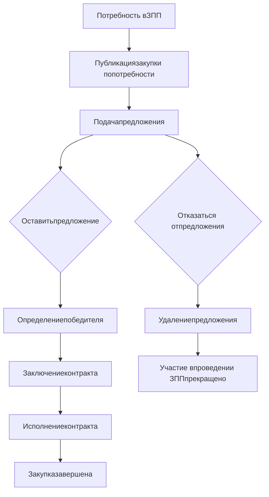

**Рисунок 540 – Общая схема процесса работы с Заявкой по потребности**

## 20.2.1 Страница закупки по потребностям

Действия Поставщика при поиске и ознакомлении с Закупками по потребностям (Рисунок 541).

---

325

Блок-схема действий Поставщика с Заявкой по потребности

**Рисунок 541 – Действия Поставщика с Заявкой по потребности – поиск и ознакомление**

1. Перейти на страницу закупки одним из способов:
   − из раздела «Уведомления», для этого рекомендуется настроить фильтр получения уведомлений;
   − в едином реестре закупок (раздел 19) перейти в подраздел «Закупки по потребностям», настроить фильтр и перейти на страницу закупки, нажав на наименование закупки по потребностям.
   Закупка должна быть в статусе **«Прием предложений»**.
2. На **странице закупки** (Рисунок 542) счетчик, показывающий отсчет времени до окончания приема заявок, и следующая информация:
   − **Общая информация** (Рисунок 542 (1)):
     • Номер закупки;
     • Статус закупки;
     • Признак «Закупка с неизвестным объемом»;
     • Наименование закупки;
     • Наименование заказчика,
     • Закон, в соответствии с которым происходит заключение;
     • Основание для заключения контракта;
     • ФИО контактного лица заказчика;
     • Номер телефона контактного лица;
     • Документы (файл с проектом контракта, ТЗ и т. д.);

---

326

* Начальная цена/Начальная цена за ед. продукции (для закупок с неизвестным объемом);
* Период проведения закупки;
* Дополнительные требования к составу и содержанию заявки (поле отображается, если есть данные);
* Дополнительные требования к участникам закупки (поле отображается, если есть данные);
* Запреты в рамках национального режима» (поле отображается, если есть данные).
− **Спецификация** (Рисунок 542 (2)):
    * Наименование закупаемого товара;
    * Вид продукции;
    * Цена на единицу товара;
    * Общая стоимость;
    * Количество;
    * Единица измерения;
− **Вкладка «Поставка»** (Рисунок 543):
    * Плановая дата заключения контракта;
− Регион поставки;
− Адрес поставки;
− Срок поставки;
− Условия оплаты;
− Дополнительная информация;
− **Кнопка «Участвовать»** (Рисунок 542 (3)).

---

327

Страница закупки по потребностям для АИС ПП

Рисунок 542 – Страница закупки по потребностям для АИС ПП

Страница закупки. Вкладка «Поставка»

Рисунок 543 – Страница закупки. Вкладка «Поставка»

## 20.2.2 Подача предложений для опубликованной закупки по потребности

Действия Поставщика при работе с Закупкой по потребности (Рисунок 544):

---

328

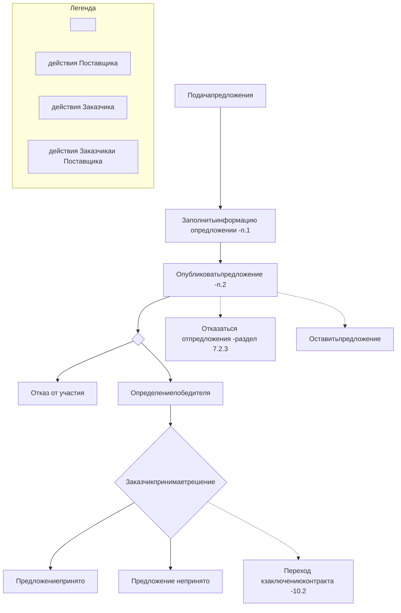

**Рисунок 544 – Действия Поставщика с Заявкой по потребности – работа с заявкой**

1. На странице закупки необходимо нажать кнопку **«Подать предложение»** (Рисунок 543).
   На открывшейся странице (Рисунок 545), в столбце **«Реестровый номер и наименование оферты»** необходимо выбрать оферту. При нажатии на пустое поле появится всплывающий список зарегистрированных и опубликованных оферт поставщика (для удобства поиска можно ввести номер или наименование оферты).
   Если у поставщика нет подходящей оферты на Портале, то он может нажать на «замок» (Рисунок 545 (1)) и внести предложение «без оферты», указав **цену** за единицу с НДС и размер **Ставки НДС**.
   Дата окончания действия предложения — это дата окончания готовности участвовать в закупке по потребности, указанная дата не может быть раньше плановой даты заключения контракта.

> ❗ Цены предложений должны быть меньше, чем цены в самой спецификации.

---

329

Рисунок 545 – Редактирование предложения для закупки по потребности

**Рисунок 545 – Редактирование предложения для закупки по потребности**

2. После того, как все данные по офертам будут введены, необходимо нажать кнопку **«Сохранить»** (Рисунок 545 (3)) и **«Отправить заказчику»** (Рисунок 545 (2)).
3. В появившемся модальном окне подтвердить отправку предложения (Рисунок 546). Сообщение об успешном выполнении операции появится в верхней части экрана.

Рисунок 546 – Модальное окно подтверждения отправки предложения

**Рисунок 546 – Модальное окно подтверждения отправки предложения**

### 20.2.3 Удаление поданного предложения

Для удаления Поставщиком поданного предложения необходимо перейти на страницу закупки по потребностям и нажать на кнопку **«Отозвать предложение»** (Рисунок 547) и кнопку «Подтвердить» в модальном окне (Рисунок 548).

---

330

Удаление поданного предложения на странице закупки по потребности

**Рисунок 547 – Удаление поданного предложения на странице закупки по потребности**

Удаление предложения, поданного Поставщиком возможно только для потребности в статусе **«Прием предложений»**. В статусе **«Прием предложений завершен»** удалить предложения нельзя.

Модальное окно подтверждения отзыва предложения

**Рисунок 548 – Модальное окно подтверждения отзыва предложения**

---

331

## 20.3 Прямые закупки

**Прямая закупка** – способ закупки, при котором контракт (договор) заключается с конкретным Поставщиком без проведения дополнительных процедур.

Общая схема процесса взаимодействия Поставщика и Заказчика ниже (Рисунок 549):

Рисунок 549 – Общая схема процесса взаимодействия Поставщика и Заказчика в рамках Прямой закупки

**Рисунок 549 – Общая схема процесса взаимодействия Поставщика и Заказчика в рамках Прямой закупки**

### 20.3.1 Получение и подтверждение заявки на прямую закупку

Действия поставщика при работе с прямой закупкой (Рисунок 550):

Рисунок 550 – Действия поставщика при работе с прямой закупкой

**Рисунок 550 – Действия поставщика при работе с прямой закупкой**

---

332

1) Заказчики могут создавать на основании оферт поставщика заявки на прямую закупку.
2) Заявка на прямую закупку (Рисунок 551) появится в разделе «Уведомления» Портала поставщиков, а также в разделе «Полученные заявки», в который можно перейти через меню системы «Электронный магазин» → «Полученные заявки» (Рисунок 552), где находится список всех полученных заявок на прямую закупку.

Раздел "Уведомления" с полученной заявкой на прямую закупку

**Рисунок 551 – Раздел "Уведомления" с полученной заявкой на прямую закупку**

Раздел «Полученные заявки»

**Рисунок 552 – Раздел «Полученные заявки»**

3) Чтобы ознакомиться с заявкой необходимо нажать на номер заявки.
Заявка на прямую закупку содержит следующие разделы:
− Номер, дата и статус заявки;
− **Наименование поставщика**, которому поступила заявка;
− **Состав заявки**. Данный раздел содержит таблицу с перечнем оферт, которые выбрал заказчик при создании заявки;
− **Форма расчетов**, которую выбрал заказчик при создании заявки;
− **Этапы поставки**. Данный раздел содержит таблицу с информацией о месте поставки, наименовании получателя товара, периоде поставки, наименовании и количестве поставляемой продукции.

4) Поставщик может как принять заявку Подтвердить, так и отклонить Отклонить, указав причину отказа в специальном модальном окне (Рисунок 553).

---

333

Окно с полем для указания поставщиком отказа в прямой закупке

**Рисунок 553 – Окно с полем для указания поставщиком отказа в прямой закупке**

После того, как поставщик нажал кнопку «Подтвердить», появится окно подтверждения действий (Рисунок 554), где необходимо нажать кнопку «Да»:

Окно подтверждения принятия заявки на прямую закупку

**Рисунок 554 – Окно подтверждения принятия заявки на прямую закупку**

## 20.3.2 Подписание контракта

После того, как заявка будет подтверждена поставщиком, заказчику необходимо создать проект договора и отправить его поставщику. При создании контракта заказчик укажет дату и время ответа.

Когда контракт будет отправлен заказчиком, поставщик получит уведомление в соответствующем разделе. Также новый контракт появится в разделе «Мои контракты» (подробнее о работе с контрактами на Портале поставщиков см. раздел 0). На странице «Сведения о контракте» Поставщик может посмотреть счетчик, показывающий оставшееся время до окончания срока подписания контракта, установленного заказчиком, сведения о спецификации договора и ознакомиться с файлом договора. Поставщик может направить заказчику протокол разногласий, отказаться от текущей версии контракта, подписать и запросить продление срока ответа.

---

334

## 21 Закупки из системы ЕИС

На портале поставщиков можно просматривать и отслеживать закупки, размещенные в ЕИС (<u>http://zakupki.gov.ru</u>).

При нажатии на наименование закупки в едином реестре закупок (раздел 19) откроется страница закупки, которая содержит следующую информацию (Рисунок 555):

* Счетчик, показывающий отсчет времени до окончания приема заявок (дней/часов/минут/секунд), отображается для закупок в статусе «Подача заявок»;
* Реестровый номер закупки;
* Статус закупки;
* Наименование заказчика (ссылка на карточку заказчика на Портале поставщиков);
* Дата публикации извещения;
* Дата окончания приёма заявок;
* Предмет закупки;
* Тип процедуры закупки;
* Сведения о лотах (номер, предмет, место поставки и начальная цена);
* Сведения о процедуре закупки на Единой информационной системе. Ссылка на страницу ЕИС, где отображаются подробные сведения о данной закупке;
* Документация в ЕИС. Ссылка на страницу ЕИС, где отображается документация по данной закупки;
* Протоколы в ЕИС. Ссылка на страницу ЕИС, где отображаются протоколы данной закупки.

Страница закупки из ЕИС

**Рисунок 555 – Страница закупки из ЕИС**

---

335

## 22 Контракты

### 22.1 Реестр контрактов

Для того, чтобы перейти в реестр контрактов необходимо нажать на кнопку «Контракты» в меню открытой части Портала поставщиков (Рисунок 556).

Рисунок 556 – Меню Портала. Переход в раздел «Контракты»

**Рисунок 556 – Меню Портала. Переход в раздел «Контракты»**

Данный раздел содержит перечень контрактов (Рисунок 557), которые были заключены в результате закупок, как на Портале поставщиков, так и на других торговых площадках (данные, полученные из ЕИС).

Рисунок 557 – Реестр контрактов

**Рисунок 557 – Реестр контрактов**

Все контракты в реестре сгруппированы по вкладкам в соответствии с типами контрактов:

− **Все контракты.** На вкладке содержатся контракты всех типов, в том числе, из полученные из внешней системы;
− **По итогам котировочных сессий.** На вкладке сгруппированы контракты, которые были заключены в результате проведения котировочных сессий;
− **По итогам закупок по потребностям.** На вкладке сгруппированы контракты, которые были заключены в результате проведения закупок по потребностям;
− **По итогам прямых закупок.** На вкладке сгруппированы контракты, которые были заключены по результатам прямых закупок;

---

336

− **По итогам конкурентных процедур.** На вкладке сгруппированы контракты, которые были заключены в результате закупок, проведенных на внешних торговых площадках.

### 22.1.1 Поиск контрактов

Для того, чтобы найти определенный контракт в реестре, необходимо воспользоваться **фильтрами**. Поля для заполнения критериев поиска скрыты в отдельной области, раскрыть которую можно с помощью кнопки «Показать фильтры» (Рисунок 558).

Фильтры разделены на основные и расширенные. С помощью основных фильтров можно найти контракты по следующим критериям (**Таблица 33**).

**Таблица 33 – Критерии поиска контрактов**

| Фильтр              | Значение фильтра                                                                                                                                                             |
| ------------------- | ---------------------------------------------------------------------------------------------------------------------------------------------------------------------------- |
| Регион              | Выбор региона из справочника. Возможен множественный выбор                                                                                                                   |
| Категория продукции | Выбор категории из справочника. Возможен множественный выбор                                                                                                                 |
| Сумма контракта     | Ввод диапазона сумм по контрактам                                                                                                                                            |
| Статус              | Возможность выбрать один или несколько статусов: «Заключен», «Исполнен» и «Расторгнут». (Просмотреть собственные контакты можно в личном кабинете в разделе «Мои контракты») |


С помощью расширенных фильтров можно уточнить свой поиск. Область расширенных фильтров открывается с помощью кнопки **«Показать расширенные фильтры»** (Рисунок 558).

Рисунок 558 – Реестр контрактов – кнопка «Показать расширенные фильтры»

**Рисунок 558 – Реестр контрактов – кнопка «Показать расширенные фильтры»**

Критерии расширенного поиска представлены ниже (**Таблица 34**).

**Таблица 34 – Расширенные критерии поиска контрактов**

| Фильтр                           | Значение фильтра                                                                                                                                                               |
| -------------------------------- | ------------------------------------------------------------------------------------------------------------------------------------------------------------------------------ |
| Предмет контракта                | Ввод наименования предмета контракта или его части                                                                                                                             |
| *Основания заключения контракта* | Выбор одного или нескольких значений из справочника                                                                                                                            |
| Способ размещения закупки        | Выбор одного или нескольких значений из справочника                                                                                                                            |
| ОКПД2                            | Выбор одного или нескольких значений из справочника                                                                                                                            |
| Размещение сведений              | Законы, в соответствии с которыми осуществляется размещения сведений. Возможна установка следующих признаков:<br/>− 44-ФЗ;<br/>− 223-ФЗ;<br/>− Положение о закупке организации |
| Организационные признаки         | Возможна установка следующих признаков:<br/>− СМП;<br/>− УИС;                                                                                                                  |


---

337

| \*\*Фильтр\*\*                    | \*\*Значение фильтра\*\*                                                                                       |
| --------------------------------- | -------------------------------------------------------------------------------------------------------------- |
|                                   | – Организация инвалидов;<br/>– Социально-ориентированные                                                       |
| Тип заключения                    | Возможна установка следующих признаков:<br/>– На бумажном носителе;<br/>– В электронном виде;<br/>– По QR-коду |
| Закупка с неизвестным объемом     | Возможен выбор следующего признака:<br/>– Все;<br/>– Да;<br/>– Нет.                                            |
| Электронное исполнение            | Возможен выбор следующего признака:<br/>– Все;<br/>– Да;<br/>– Нет.                                            |
| Дата заключения контракта, с:…по: | Выбор периода даты заключения контракта с помощью встроенного календаря                                        |
| Дата действия контракта, с:…по:   | Выбор периода даты действия контракта с помощью встроенного календаря                                          |
| Номер оферты                      | Ввод частичного или полного номера оферты                                                                      |
| СТЕ                               | Ввод id, частичного или полного наименования СТЕ                                                               |
| Номер контракта                   | Ввод частичного или полного номера контракта                                                                   |
| Реестровый номер контракта        | Ввод частичного или полного реестрового номера контракта                                                       |
| Номер закупки                     | Ввод частичного или полного номера закупки                                                                     |
| Поставщик                         | Ввод частичного или полного наименования поставщика или ИНН                                                    |
| Заказчик (название или ИНН)       | Ввод частичного или полного наименования заказчика или ИНН                                                     |
| В том числе подведомственные      | Возможна установка признака для поиска среди подведомственных организаций заказчика                            |
| Требуется обеспечение             | Возможен выбор следующего признака:<br/>– Все;<br/>– Да;<br/>– Нет.                                            |


После ввода данных критериев необходимо нажать на кнопку «Применить», в результате чего отображаются результаты поиска контрактов, соответствующие введенным критериям.

## 22.1.2 Сохранение фильтров в публичном реестре контрактов

В публичном реестре контрактов можно сохранить часто используемый набор фильтров, для этого необходимо (Рисунок 559):

1. Авторизоваться на Портале поставщиков;
2. На странице публичного реестра контрактов установить параметры поиска в основных и/или расширенных фильтров;

---

338

Набор фильтров

**Рисунок 559 – Набор фильтров**

3. Нажать кнопку «Применить» (Рисунок 560);

Кнопка «Применить»

**Рисунок 560 – Кнопка «Применить**

4. Нажать кнопку «Сохранить как шаблон» (Рисунок 561);

Кнопка «Сохранить как шаблон»

**Рисунок 561 – Кнопка «Сохранить как шаблон»**

5. В открывшемся модальном окне ввести наименование сохраняемого шаблона (Рисунок 562);

Модальное окно «Сохранить набор фильтров»

**Рисунок 562 – Модальное окно «Сохранить набор фильтров»**

6. Нажать кнопку «Сохранить» (Рисунок 563);

---

339

Кнопка «Сохранить»

**Рисунок 563 – Кнопка «Сохранить»**

Чтобы применить ранее сохраненный шаблон, необходимо (Рисунок 564):
1. Авторизоваться на Портале поставщиков;
2. Перейти в публичный реестр контрактов;
3. Нажать кнопку «Мои шаблоны»;

Мои шаблоны, применить

**Рисунок 564 – Мои шаблоны, применить**

4. В открывшемся модальном окне нажать на наименование шаблона (Рисунок 565).

Применить шаблон

**Рисунок 565 – Применить шаблон**

После чего в ранее сохраненные фильтры автоматически применятся.
Чтобы удалить шаблон, необходимо (Рисунок 566):
1. Авторизоваться на Портале поставщиков;
2. Перейти в публичный реестр контрактов;
3. Нажать кнопку «Мои шаблоны»;

---

340

Мои шаблоны, удаление

**Рисунок 566 – Мои шаблоны, удаление**

4. В открывшемся модальном окне нажать на кнопку «Удалить» напротив шаблона (Рисунок 567).

Удалить шаблон

**Рисунок 567 – Удалить шаблон**

## 22.1.3 Список контрактов

Контракты можно сортировать по дате заключения контракта, сумме контракта и релевантности, используя соответствующее значение из выпадающего списка (Рисунок 568) в поле «Сортировка»:

Выбор варианта сортировки контрактов

**Рисунок 568 – Выбор варианта сортировки контрактов**

В реестре выводятся карточки контрактов (Рисунок 569), которые содержат следующую информацию:

− Тип контракта. В реестре отображаются следующие типы контрактов: все контракты, по итогам котировочных сессий, контракты по итогам закупок по потребностям, контракты по итогам прямых закупок, контракты по итогам конкурентных процедур;
− Номер контракта/договора. Номер, который указывается заказчиком при создании контракта;
− Реестровый номер контракта/договора. Номер присваивается автоматически;
− Предмет контракта/договора. В данном поле отображается наименование закупаемой продукции;
− Статус контракта/договора. В публичном реестре контрактов отображаются контракты со статусами: заключен, исполнен, расторгнут;
− Сумма контракта/договора;
− Наименование заказчика;
− Наименование поставщика;
− Регион;
− Закон, в соответствии с которым была размещена закупка.

---

341

Карточка контракта в реестре

**Рисунок 569 – Карточка контракта в реестре**

**22.1.4 Страница контракта**

При нажатии на номер контракта откроется карточка «Сведения о контракте» (Рисунок 570).

Вид карточки «Сведения о контракте» для неавторизованного пользователя

**Рисунок 570 – Вид карточки «Сведения о контракте» для неавторизованного**
**пользователя**

На карточке пользователь может просмотреть следующие сведения:
− Номер контракта;
− Реестровый номер контракта;
− Статус контракта;
− Наименование заказчика (покупателя) в виде гиперссылки;
− ИНН заказчика;
− Дата заключения контракта;
− Основание для заключения контракта;

---

342

- Предмет контракта;
- Наименование поставщика в виде гиперссылки;
- Сумма и валюта контракта;
- Ссылка на сведения о контракте на ЕИС;
- Электронная карта, адрес поставки продукции обозначен на карте иконкой адреса (Рисунок 571).

Иконка адреса на карте

**Рисунок 571– Иконка адреса на карте**

---

343

## 23 Организации

На Портале поставщиков существует возможность просмотра информации о заказчиках, поставщиках и производителях в разделе «Организации» (Рисунок 572).
В разделе «Организации» отображены следующие подразделы:
− Поставщики;
− Заказчики;
− Производители.

Рисунок 572 – Раздел «Организации»

**Рисунок 572 – Раздел «Организации»**

## 23.1 Реестр поставщиков

Для просмотра информации о поставщиках пользователю необходимо перейти в реестр поставщиков. Для поиска поставщиков необходимо в **Главном меню Портала поставщиков** (Рисунок 21) нажать на **«Организации»** → **«Поставщики»** (Рисунок 572).
В результате отобразится реестр поставщиков (Рисунок 573):

---

344

Рисунок 573 – Страница реестра поставщиков

**Рисунок 573 – Страница реестра поставщиков**

## 23.1.1 Критерии поиска поставщиков

Поиск поставщиков осуществляется по одному (или нескольким) из следующих критериев (фильтров), указать которые можно в правой части раздела по кнопке «Показать фильтры» (Рисунок 574 (1)), затем можно нажать кнопку «Показать расширенные фильтры» (Рисунок 574 (2)) (Таблица 35):

**Таблица 35 – Критерии поиска поставщиков**

| \*\*Фильтр\*\*                    | \*\*Значение фильтра\*\*                                   |
| --------------------------------- | ---------------------------------------------------------- |
| Регион регистрации                | Выбор региона из справочника. Возможен множественный выбор |
| Наименование организации          | Ввод наименования организации поставщика                   |
| ИНН                               | Ввод ИНН или его части                                     |
| ОГРН                              | Ввод ОГРН или его части                                    |
| КПП                               | Ввод КПП или его части                                     |
| Наименование головной организации | Ввод наименования головной организации поставщика          |
| Тип деления                       | Выбор признака:<br/>− Все;                                 |


---

345

| \*\*Фильтр\*\*                | \*\*Значение фильтра\*\*                                                                                                                                |
| ----------------------------- | ------------------------------------------------------------------------------------------------------------------------------------------------------- |
|                               | — Головная организация;<br/>— Филиал/Подразделение.                                                                                                     |
| Категория продукции           | Выбор категории из справочника                                                                                                                          |
| Регион поставки               | Выбор региона из справочника. Возможен множественный выбор                                                                                              |
| Вид продукции                 | Выбор значения из справочника                                                                                                                           |
| Тип поставщика                | Выбор из следующих типов поставщиков:<br/>— Юридическое лицо;<br/>— Физическое лицо;<br/>— Индивидуальный предприниматель.                              |
| Статус поставщика             | Выбор признака:<br/>— Все;<br/>— Незаблокированные;<br/>— Заблокированные                                                                               |
| Организационные признаки      | Возможность установить один или несколько признаков:<br/>— СМП;<br/>— УИС;<br/>— Организации инвалидов;<br/>— Социально-ориентированные                 |
| Признаки поставщика           | Возможность установить один или несколько признаков:<br/>— Самозанятый;<br/>— Производитель продукции;<br/>— Зарегистрированный на Портале Поставщиков. |
| Статус ликвидации организации | Возможность установить один или несколько признаков:<br/>— Все;<br/>— Ликвидирован/банкрот.                                                             |
| Рейтинг поставщика            | Возможность установить один или несколько признаков:<br/>— 0;<br/>— 1;<br/>— 2;<br/>— 3.                                                                |


После выбора данных критериев необходимо нажать кнопку «Применить», в результате чего отображаются результаты поиска поставщиков, соответствующие введенным критериям.

---

346

Блок фильтров, поиск поставщика

**Рисунок 574 – Блок фильтров, поиск поставщика**

## 23.1.2 Отображение результатов поиска поставщиков

Поставщиков можно сортировать по дате регистрации и по количеству контрактов, по умолчанию, используя соответствующее значение из выпадающего списка в поле **«Сортировка»**.

Всплывающее поле для выбора варианта сортировки поставщиков

**Рисунок 575 – Всплывающее поле для выбора варианта сортировки поставщиков**

Реестр состоит из карточек поставщиков (Рисунок 576), которые содержат следующую информацию:
− Роль;
− Статус;
− Регион;
− Наименование поставщика;
− Тип организации;
− КПП поставщика;

---

347

−     Дата регистрации;
−     ОГРН поставщика;
−     ИНН поставщика.

Карточка Поставщика

**Рисунок 576 – Карточка Поставщика**

Иконка иконка рейтинга, отображающаяся на карточке организации, указывает на рейтинг поставщика на Портале.
Иконка иконка регистрации, отображающаяся в строке записей поставщиков, указывает, что поставщик зарегистрирован на Портале.

**23.1.3 Страница поставщика**

Для просмотра детальной информации о поставщике требуется нажать на наименование организации поставщика, которое является гиперссылкой на публичный профиль поставщика, содержащий сведения о нем (Рисунок 577).

Сведения о поставщике включают в себя следующую информацию:
−     Наименование поставщика;
−     Во вкладке «О компании». Отображается вся информация о компании;
−     Во вкладке «Предложения компании» отображаются предложения поставщика;
−     Во вкладке «Рейтинг» отображаются количество активных и исполненных контрактов, а также достижения поставщика.

---

348

Рисунок 577 – Просмотр сведений о поставщике

**Рисунок 577 – Просмотр сведений о поставщике**

## 23.2 Реестр заказчиков

Для поиска заказчиков пользователю необходимо в **Главном меню** **Портала** **поставщиков** (Рисунок 28) нажать на «**Организации**» → «**Заказчики**» (Рисунок 572).
В результате отобразится реестр заказчиков (Рисунок 578).

---

349

Рисунок 578 – Страница поиска заказчиков

**Рисунок 578 – Страница поиска заказчиков**

### 23.2.1 Критерии поиска заказчиков

Поиск заказчиков осуществляется по одному (или нескольким) из следующих критериев (фильтров) (Рисунок 579) (Таблица 36):

**Таблица 36 – Критерии поиска заказчиков**

| \*\*Фильтр\*\*           | \*\*Значение фильтра\*\*                                                                         |
| ------------------------ | ------------------------------------------------------------------------------------------------ |
| Регион регистрации       | Выбор региона из справочника. Возможен множественный выбор                                       |
| Наименование организации | Ввод наименования организации заказчика                                                          |
| ИНН                      | Ввод ИНН заказчика или его части                                                                 |
| ОГРН                     | Ввод ОГРН заказчика или его части                                                                |
| КПП                      | Ввод КПП заказчика или его части                                                                 |
| Основание для работы     | Возможность установить признаки:<br/>− По 223-ФЗ;<br/>− По 44-ФЗ;<br/>− По положению о закупках. |
| Статус                   | Возможность установить признак:<br/>− Показывать архивных заказчиков.                            |


---

350

| \*\*Фильтр\*\*                | \*\*Значение фильтра\*\*      |
| ----------------------------- | ----------------------------- |
| Организационно-правовая форма | Выбор значения из справочника |


После того, как все параметры фильтров будут введены, необходимо нажать кнопку «Применить».

Рисунок 579 – Блок фильтров, поиск заказчиков

**Рисунок 579 – Блок фильтров, поиск заказчиков**

## 23.2.2 Отображение результатов поиска заказчиков

Заказчиков можно сортировать по дате регистрации и по количеству контрактов, по умолчанию, используя соответствующее значение из выпадающего списка (Рисунок 580) в поле **«Сортировка»**.

Рисунок 580 – Всплывающее поле для выбора варианта сортировки заказчиков

**Рисунок 580 – Всплывающее поле для выбора варианта сортировки заказчиков**

Реестр состоит из карточек заказчиков, на которых отображается основная информация (Рисунок 581):
− Роль;
− Статус;
− Регион;
− Наименование организации заказчика;
− Тип организации;
− КПП заказчика;
− Дата регистрации;
− ОГРН заказчика;
− ИНН заказчика.

---

351

Карточка заказчика в реестре

**Рисунок 581 – Карточка заказчика в реестре**

Иконка Иконка «Зарегистрирован на ПП», отображающаяся в строке записей заказчиков, указывает, что заказчик зарегистрирован на Портале.

### 23.2.3 Страница заказчика

Для просмотра страницы заказчика требуется нажать на наименование организации, которое является гиперссылкой, после чего откроется публичный профиль заказчика (Рисунок 582).

- Наименование поставщика;
- Во вкладке «О компании». Отображается вся информация о компании;
- Во вкладке «Реестр закупок» отображаются созданные закупки;
- Во вкладке «Рейтинг» отображаются количество активных и исполненных контрактов, а также достижения заказчика.

Просмотр сведений о заказчике

**Рисунок 582 – Просмотр сведений о заказчике**

---

352

## 23.3 Реестр производителей

Для просмотра информации о производителях пользователю необходимо перейти в реестр производителей. Для поиска производителей необходимо в **Главном меню Портала** **поставщиков** (Рисунок 28) нажать на «**Организации**» → «**Производители**» (Рисунок 474). В результате отобразится реестр производителей (Рисунок 583).

Рисунок 583 – Страница поиска производителей

**Рисунок 583 – Страница поиска производителей**

## 23.3.1 Критерии поиска производителей

Поиск производителей осуществляется по одному (или нескольким) из следующих критериев (фильтров) (Рисунок 584) (Таблица 37):

**Таблица 37 – Критерии поиска производителей**

| \*\*Фильтр\*\*                   | \*\*Значение фильтра\*\*                                                                                                   |
| -------------------------------- | -------------------------------------------------------------------------------------------------------------------------- |
| Категория продукции              | *Выбор категории продукции из справочника Портала поставщиков*                                                             |
| Регион производственной площадки | Выбор региона из справочника. Возможен множественный выбор                                                                 |
| Наименование организации         | Ввод наименования организации производителя                                                                                |
| ОКПД2                            | Выбор одного или нескольких значений из справочника                                                                        |
| Регион регистрации               | Выбор региона из справочника. Возможен множественный выбор                                                                 |
| Тип организации                  | Выбор из следующих типов поставщиков:<br/>− Юридическое лицо;<br/>− Физическое лицо;<br/>− Индивидуальный предприниматель. |
| ИНН                              | Ввод ИНН производителя или его части                                                                                       |
| ОГРН                             | Ввод ОГРН производителя или его части                                                                                      |
| КПП                              | Ввод КПП производителя или его части                                                                                       |
| Производство подтверждено        | Возможность установить признаки:                                                                                           |


---

353

| \*\*Фильтр\*\*         | \*\*Значение фильтра\*\*                                                                     |
| ---------------------- | -------------------------------------------------------------------------------------------- |
| —                      | — Имеется выписка ГИСП.                                                                      |
| Статус организации     | Выбор признака:<br/>— Все;<br/>— Незаблокированные;<br/>— Заблокированные.                   |
| Регистрация на Портале | Возможность установить признаки:<br/>— Производитель зарегистрирован на Портале поставщиков. |


После того, как все параметры фильтров будут введены, необходимо нажать кнопку «Применить».

Блок фильтров, поиск производителей

**Рисунок 584 – Блок фильтров, поиск производителей**

## 23.3.2 Отображение результатов поиска производителей

Производителей можно сортировать по дате регистрации и по количеству контрактов, по умолчанию, используя соответствующее значение из выпадающего списка (Рисунок 585) в поле **«Сортировка»**.

---

354

Всплывающее поле для выбора варианта сортировки производителей

**Рисунок 585 – Всплывающее поле для выбора варианта сортировки производителей**

Реестр состоит из карточек производителей, на которых отображается основная информация (Рисунок 586):
− Роль;
− Статус;
− Регион регистрации;
− Наименование организации заказчика;
− Тип организации;
− КПП производителя;
− Дата регистрации;
− ОГРН производителя;
− ИНН производителя.

Карточка производителя в реестре

**Рисунок 586 – Карточка производителя в реестре**

Иконка Иконка «Зарегистрирован на ПП», отображающаяся в строке записей производителей, указывает, что производитель зарегистрирован на Портале.

**23.3.3 Страница производителя**

Для просмотра страницы производителя требуется нажать на наименование организации, которое является гиперссылкой, после чего откроется публичный профиль производителя (Рисунок 587).

Сведения о заказчике включают в себя следующую информацию:
− Наименование производителя;
− Регион регистрации, роль и Типа организации;
− Блок «О компании». Отображается информация о компании;
− Блок «Контракты». В блоке отображается информация об исполненных контрактах производителя;
− Блок «О производстве». В блоке содержится информация об адресе производства;
− Блок «Достижения». Отображаются все достижения заказчика. Для просмотра полного списка достижений, которые еще не получены заказчиком необходимо нажать на «Подробнее»;
− Блок «Контакты». В блоке отображается контактная информация компании.

---

355

Просмотр сведений о производителе

**Рисунок 587 – Просмотр сведений о производителе**

---

356

## 24 Интерактивная карта регионов

Карта и список регионов, подключенных к порталу поставщиков, расположена на главной странице портала.

Список подключенных регионов можно посмотреть в виде карты (Рисунок 588).

Рисунок 588 – Карта регионов

**Рисунок 588 – Карта регионов**

Чтобы найти регион, можно воспользоваться поиском в верхней части страницы. При выборе региона на карте или с помощью поиска, откроется окно просмотра показателей региона (Рисунок 589):

Рисунок 589 – карточка региона в разделе «Карта регионов»

**Рисунок 589 – карточка региона в разделе «Карта регионов»**

---

357

## 25 Автоматическая блокировка поставщиков

При блокировке пользователя в шапке портала поставщиков возле наименования организации отображается статус «**Заблокирован**», а также **дата окончания действия** **блокировки** (Рисунок 590):

Рисунок 590 – Поставщик заблокирован

**Рисунок 590 – Поставщик заблокирован**

## 25.1 Сроки и основания для автоматической блокировки

Блокировка поставщика на Портале поставщиков происходит в автоматическом режиме в соответствии с Приказом от 23.11.2018 № 105/70-01-185/18 «Об утверждении порядка блокировки поставщиков (подрядчиков, исполнителей) и внесения соответствующей информации в перечень заблокированных поставщиков Портала поставщиков».

Основанием для автоматической блокировки является:

*   **отказ от заключения контракта** по подписанной электронной подписью и опубликованной поставщиком (подрядчиком, исполнителем) в открытой части Портала поставщиков оферте или **уклонение от заключения контракта поставщика** (подрядчика, исполнителя), признанного победителем "котировочной сессии";
*   расторжение контракта по вине поставщика (подрядчика, исполнителя);
*   **возникновение у поставщика** (подрядчика, исполнителя) **недоимки по** **налогам, сборам, задолженности** по иным обязательным платежам в бюджеты бюджетной системы Российской Федерации (за исключением сумм, на которые предоставлены отсрочка, рассрочка, инвестиционный налоговый кредит в соответствии с законодательством Российской Федерации о налогах и сборах, которые реструктурированы в соответствии с законодательством Российской Федерации, по которым имеется вступившее в законную силу решение суда о признании обязанности заявителя по уплате этих сумм исполненной или которые признаны безнадежными к взысканию в соответствии с законодательством Российской Федерации о налогах и сборах) за прошедший календарный год, размер которых превышает двадцать пять процентов балансовой стоимости активов участника закупки, по данным бухгалтерской отчетности за последний отчетный период;
*   повторное возникновение оснований для блокировки в соответствии с подпунктом "а" или "б";
*   **начало процедуры ликвидации или банкротства в отношении поставщика** (подрядчика, исполнителя), подтвержденное наличием соответствующей записи в реестре Единого федерального реестра сведений о банкротстве или Единого федерального реестра сведений о фактах деятельности юридических лиц;
*   повторное возникновение оснований для блокировки в соответствии с подпунктом "д";
*   **наличие** у руководителя поставщика (подрядчика, исполнителя), членов коллегиального исполнительного органа, лица, исполняющего функции единоличного исполнительного органа поставщика (подрядчика, исполнителя), главного бухгалтера поставщика (подрядчика, исполнителя) **судимости за преступления в сфере экономики,** **преступления**, предусмотренные статьями 289-291 и 291.1 Уголовного кодекса Российской Федерации (за исключением лиц, у которых такая судимость погашена или снята), а также применение в отношении указанных физических лиц наказания в виде лишения права занимать определенные должности или заниматься определенной деятельностью, которые связаны с поставкой товара, выполнением работы, оказанием услуги, и административного наказания в виде дисквалификации;
*   Решение Арбитражной комиссии.

---

358

Блокировка поставщика осуществляется в том числе с использованием информации, полученной посредством информационного взаимодействия Портала с федеральными и иными информационными системами.

Сроки блокировок поставщика в соответствии с Приказом от 23.11.2018 № 105/70-01-185/18 «Об утверждении порядка блокировки поставщиков (подрядчиков, исполнителей) и внесения соответствующей информации в перечень заблокированных поставщиков Портала поставщиков»:

− на 3 месяца;
− на 6 месяцев;
− на 2 года.

## 25.2 Проверка записи в реестре недобросовестных поставщиков (подрядчиков, исполнителей)

Если поставщик заблокирован по основанию РНП ЕИС, то у него есть возможность проверить актуальность записи в реестре РНП ЕИС. Для этого в реестре жалоб необходимо нажать кнопку «Проверить блокировку в РНП». После чего откроется страница с результатом проверки (Рисунок 591).

Проверка блокировки в РНП

**Рисунок 591 – Результат проверки блокировки в РНП**

Историю и основания блокировки в РНП (Рисунок 592) можно посмотреть в профиле поставщика в истории блокировок (Рисунок 365).

История операций

**Рисунок 592 – История блокировок поставщика**

---

359

## 26 Служба технической поддержки

### 26.1 Создание обращения в службу технической поддержки

Для создания заявки в службу технической поддержки пользователю необходимо в шапке портала нажать кнопку **«Оставить обращение»** (Рисунок 593) или в подвале портала поставщиков нажать на кнопку **«Контакты»** (Рисунок 594).

Переход к окну обратной связи в шапке портала

**Рисунок 593 – Переход к окну обратной связи в шапке портала**

Раздел «Контакты»

**Рисунок 594 – Раздел «Контакты»**

По умолчанию открывается модальное окно с формой обращения в службу технической поддержки (Рисунок 595):

Форма обращения в техническую поддержку

**Рисунок 595 – Форма обращения в техническую поддержку**

---

360

На форме заявки пользователю необходимо заполнить все обязательные поля (поля отмечены «*»).
После заполнения всех полей необходимо нажать кнопку **«Направить обращение»**.
Необходимо запомнить/записать номер обращения (Рисунок 596), если перед созданием обращения пользователь не авторизовался. Новое обращение можно будет отправить не ранее, чем через 5 минут.

Ваше обращение успешно направлено. Номер обращения: 4947631. Новое обращение будет направить не ранее, чем через 5 минут

**Рисунок 596 – Номер обращения на экране формы заявки**

Ознакомится со статусом обращений можно в разделе «Обращения», который находится в меню личного кабинета пользователя, подробнее в разделе 14.

## 26.2 Создание обращения в службу контроля качества

Необходимо в шапке портала нажать кнопку **«Оставить обращение»** (Рисунок 593). По умолчанию открывается модальное окно с формой обращения в службу технической поддержки (Рисунок 595). Необходимо перейти на вкладку «Служба контроля качества» (Рисунок 597):

ОБРАЩЕНИЕ В СЛУЖБУ ТЕХНИЧЕСКОЙ ПОДДЕРЖКИ, СЛУЖБА КОНТРОЛЯ КАЧЕСТВА, ДОПОЛНИТЕЛЬНЫЕ СЕРВИСЫ. Служба Контроля Качества не занимается вопросами технической поддержки и решением проблем технического содержания. Тема обращения *, Подтема обращения *, Ссылка ?, Прикрепить скриншот экрана ошибки или файл, E-mail *, Организация *, Подробное описание обращения *, Отменить, Проверить статус обращения, Направить обращение

**Рисунок 597 – Форма обращения в службу контроля качества**

На форме заявки пользователю необходимо заполнить все обязательные поля (поля отмечены «*»).
После заполнения всех полей необходимо нажать кнопку **«Направить обращение»**.
Необходимо запомнить/записать номер обращения (Рисунок 596), если перед созданием обращения пользователь не авторизовался. Новое обращение можно будет отправить не ранее, чем через 5 минут.

---

361

## 26.3 Дополнительные сервисы

Необходимо в шапке портала нажать кнопку **«Оставить обращение»** (Рисунок 593). По умолчанию открывается модальное окно с формой обращения в службу технической поддержки (Рисунок 595). Необходимо перейти на вкладку «Дополнительные сервисы» (Рисунок 598):

Рисунок 598 – Форма дополнительных сервисов

**Рисунок 598 – Форма дополнительных сервисов**

При переходе на вкладку «Дополнительные сервисы» отображается информация о дополнительных сервисах с возможностью перехода на страницу сервисов при помощи кнопки «Перейти к сервисам». При нажатии на кнопку «Отменить» модальное окно закрывается.

## 26.4 Аварийные ситуации

В случае невозможности Портала поставщиков по каким-либо причинам продолжить выполнение операций появляются сообщения с описанием ошибки или сообщения отображаются во всплывающих подсказках при наведении курсора мыши на поля заполняемой формы.

### 26.4.1 Необходимые действия при сбое в работе Портала поставщиков

В случае сбоев в работе Портала поставщиков (невозможности открыть стартовую страницу Портала поставщиков, перейти на следующую страницу либо появления сообщения, информирующего о сбое) необходимо обратиться в Службу технической поддержки (далее – Служба) Портала поставщиков (E-mail: pp-tender@mos.ru), телефоны: 8(800)303-12-34 и 8(495)870-12-34). Если ошибка является результатом некорректной работы Портала поставщиков, то сотрудники Службы должны принять соответствующие меры по решению возникшей проблемы и проинформировать пользователя о перспективах ее устранения.

Если специалист Службы сообщил, что ошибка является результатом сбоев программно-аппаратного комплекса (отказа технических средств, некорректной работы операционной системы и прикладного программного обеспечения, сбоя в работе сети, неисправности компьютера), пользователю необходимо обратиться к специалистам соответствующих служб своей организации (системным администраторам, администраторам сети, специалистам по обслуживанию вычислительной техники и пр.).

---

362

### 26.4.2 Несанкционированное вмешательство в Портал поставщиков

При обнаружении несанкционированного вмешательства в данные Портала поставщиков пользователь в срочном порядке обязан проинформировать сотрудников Службы поддержки.

---

363

## 27 База знаний портала поставщиков

### 27.1 Центр поддержки пользователей

Интересующий вопрос по работе на Портале поставщиков можно найти в разделе **«Центр поддержки»** (Рисунок 600), ссылка на который находится в шапке портала (Рисунок 599).

**Рисунок 599 – Ссылка на Центр поддержки пользователей в шапке портала**

**Рисунок 600 – Основная страница раздела «Центр поддержки пользователей»**

Найти интересующую статью можно в списке статей, сгруппированных по темам или воспользоваться поиском по базе знаний портала.

Чтобы перейти в список статей (Рисунок 601), необходимо перейти на страницу **«Центр поддержки пользователей»** и в блоке **«База знаний»** нажать кнопку **«Общий раздел»**.

---

364

Рисунок 601 – Список статей в разделе «Центр поддержки пользователей»

**Рисунок 601 – Список статей в разделе «Центр поддержки пользователей»**

Чтобы воспользоваться умным поиском (Рисунок 602), необходимо в строке поиска ввести фразу и нажать на Enter. После чего начнётся диалог с искусственным интеллектом.

Рисунок 602 – Отображение умного поиска в разделе «Центр поддержки пользователей»

**Рисунок 602 – Отображение умного поиска в разделе «Центр поддержки пользователей»**

После отправки запроса блок поиска начнет отображаться в виде чата, с указанием развернутой информации с расширенными пояснениями (Рисунок 603).

Рисунок 603 – Отображение блока умного поиска

**Рисунок 603 – Отображение блока умного поиска**

Дополнительно из блока с ответом (Рисунок 604) можно перейти на страницу с полным содержанием информации по полученному ответу (Рисунок 605).

---

365

Центр поддержки пользователей

**Рисунок 604 – Переход из блока с ответом**

Обзор от ИИ

**Рисунок 605 – Отображение полного ответа**

Чтобы воспользоваться поиском, необходимо в строке поиска ввести фразу и нажать кнопку **«Найти»**. После чего откроется страница с результатами поиска (Рисунок 606).

Страница результатов поиска в разделе «Центр поддержки пользователей»

**Рисунок 606 – Страница результатов поиска в разделе «Центр поддержки пользователей»**

---

366

Чтобы перейти на страницу статьи (Рисунок 607) необходимо, либо на странице со списком, либо на странице с результатами поиска, нажать на наименование статьи.

Рисунок 607 – Страница статьи в разделе «Центр поддержки пользователей»

**Рисунок 607 – Страница статьи в разделе «Центр поддержки пользователей»**

На странице статьи отображается её наименование, дата последнего обновления и текст статьи.
Для быстрого поиска необходимой информации можно воспользоваться блоком **«Ответы на вопросы»**, который располагается на основной странице базы знаний. Посмотреть ответ можно нажав на интересующий вопрос в списке (Рисунок 608).

---

367

Рисунок 608 – Блок «Ответы на вопросы» в разделе «Центр поддержки пользователей»

**Рисунок 608 – Блок «Ответы на вопросы» в разделе «Центр поддержки пользователей»**

## 28 Геолокация пользователя

При первом открытии Портала поставщиков для пользователя (авторизованному и не авторизованному) определяется регион и предлагается подтвердить регион местонахождения – выбор запоминается.

Регион, отображаемый в шапке страницы применяется к полям указания региона при переходе на страницы:
− в фильтрах единого реестра закупок;
− в фильтрах реестра контрактов;
− в фильтрах каталога товаров, работ и услуг;
− в фильтрах СТЕ в части отображения предложений по региону;
− подаче ценового предложения к первой поставке.

На карточке СТЕ регион, указанный пользователем в шапке сайта, применяется для расчета минимальной, максимальной и средней стоимости.

## 29 Информация о Портале

Чтобы перейти на страницу с информацией о Портале, необходимо нажать на кнопку «О портале», которая находится в подвале сайта (Рисунок 609).

Рисунок 609 – Переход в раздел «О портале» через подвал системы

**Рисунок 609 – Переход в раздел «О портале» через подвал системы**

При переходе откроется страница с информацией (Рисунок 610):
• Что такое Портал поставщиков;
• Преимущества работы на Портале;
• Информация как работать на Портале;
• Партнёры;
• Ключевые возможности;
• Нормативные документы и регламенты.

---

368

Рисунок 610 – Страница раздела «О портале»

**Рисунок 610 – Страница раздела «О портале»**

## 30 Карта сайта

На карте сайта **«Портал поставщиков»** (Рисунок 511) отображены основные разделы портала. Перейти в данный раздел можно, нажав на **кнопку «Карта сайта»** (Рисунок 611) в **подвале** портала поставщиков.

Рисунок 611 – Переход в раздел «Карта сайта» через подвал системы

**Рисунок 611 – Переход в раздел «Карта сайта» через подвал системы**

При нажатии на интересующий раздел откроется страница соответствующего раздела.

---

369

Раздел «Карта портала поставщиков»

**Рисунок 612 – Раздел «Карта портала поставщиков»**

**31 Главная страница Портала Поставщиков на других языках**

Главная страница, «О портале», «Как стать поставщиком/заказчиком» на Портале поставщиков переведены на английский, немецкий, испанский и китайский языки.
Выбрать другой язык можно с помощью переключателя языков в верхней части страницы (Рисунок 613):

Переключение языка

**Рисунок 613 – Переключение языка**

---

370

Английская версия главной страницы Портала поставщиков

**Рисунок 614 – Английская версия главной страницы Портала поставщиков**

## 32 Публикация информации о Портале в выбранной социальной
**сети**

Пользователь портала поставщиков может изучать и комментировать информацию, публикуемую аккаунтами Портала в информационном канале.
Для этого требуется на главной странице Портала или на странице любого раздела Портала (Рисунок 615) перейти по ссылке.

Отображение кнопки присоединения к тематической группе на главной странице Портала

**Рисунок 615 – Отображение кнопки присоединения к тематической группе на главной**
**странице Портала**