11.08.2026v65

# ПОРТАЛ ПОСТАВЩИКОВ МОСКВЫ

## ИНСТРУКЦИЯ ДЛЯ ЗАКАЗЧИКА ПО РАБОТЕ С ПОРТАЛОМ

Москва
2026

---

2

# Содержание

1. Термины и сокращения 4
2. Общие сведения о портале поставщиков 5
   2.1. Описание общего процесса функционирования портала 5
   2.2. Уровень подготовки пользователя 5
   2.3. Требования к программному и техническому обеспечению 5
   2.4. Условные обозначения действий и элементов интерфейса 6
   2.5. Категории и права пользователей 14
3. Начало работы с порталом поставщиков 16
   3.1. Вход на главную страницу портала 16
   3.2. Подключение электронной подписи 19
   3.3. Регистрация заказчика 21
   3.4. Авторизация пользователя 62
   3.5. Панель управления пользователя 67
4. Управление пользователем 69
   4.1. Профиль пользователя 69
   4.2. Связь с внешними системами и соглашения 80
   4.3. Уведомления 81
   4.4. События 87
5. Сервисы 90
   5.1. Дополнительные услуги 90
6. Управление профилем 99
   6.1. Профиль компании 99
   6.2. Публичный профиль компании 104
   6.3. Плановый бюджет особых закупок 107
   6.4. Настройка получения уведомлений и Настройка подписок на закупки 108
7. Каталог товаров, работ, услуг и оферты 109
   7.1. Товары, работы и услуги (СТЕ) 109
   7.2. Оферты 114
   7.3. Моя корзина 116
8. Осуществление закупки 120
   8.1. Прямая закупка 121
   8.2. Котировочные сессии 126
   8.3. Закупки по потребностям 148
   8.4. Формирование закупки с неизвестным объемом (по цене за единицу продукции) 166
9. Раздел «Мои контракты» 170
   9.1. Страница контракта пользователя 173
   9.2. Работа с контрактом в интерфейсе 1 174
   9.3. Работа с контрактом в интерфейсе 2 188
10. Планы и планы-графики 208
    10.1. Реестр планов закупок и планов-графиков закупок 208
    10.2. Страница плана-графика закупок и плана закупок 209
11. Единый реестр закупок 212
    11.1. Фильтры единого реестра закупок 212
    11.2. Сохранение фильтров в едином реестре закупок 218
    11.3. Создание подписок с помощью фильтра 220
    11.4. Карточки закупок 221
12. Реестр контрактов 224
    10.1. Поиск контрактов 225
    10.2. Список контрактов 227

---

3

10.3. Страница контракта 228
13. Реестры поставщиков и заказчиков 230
13.1. Реестр поставщиков 230
13.2. Реестр заказчиков 233
14. Мои документы 236
14.1. Просмотр и поиск документов в электронной библиотеке 236
14.2. Добавление нового документа заказчика 237
14.3. Редактирование документа заказчика в электронной библиотеке документов 238
14.4. Удаление документа заказчика из электронной библиотеки документов 239
15. Служба технической поддержки 240
15.1. Создание обращения в службу технической поддержки 240
15.2. Создание обращения в службу контроля качества 242
15.3. Дополнительные сервисы 243
15.4. Аварийные ситуации 243
16. Интерактивная карта регионов 245
17. База знаний портала поставщиков 246
17.1. Центр поддержки пользователей 246
18. Геолокация пользователя 250
19. Публикация информации о Портале в выбранной социальной сети 251
20. Карта сайта 252
21. Главная страница Портала Поставщиков 253
21.1. Определение региона 253
21.2. Главная страница на других языках 254
Приложение А. Шаблоны уведомлений, направляемые пользователям 256

---

4

## 1. Термины и сокращения

В настоящем документе приняты термины и сокращения, представленные в таблице 1.

| №п/п | \*\*Термин\*\*                           | \*\*Определение\*\*                                                                                                                                                                                                                                                                     |
| ---- | ---------------------------------------- | --------------------------------------------------------------------------------------------------------------------------------------------------------------------------------------------------------------------------------------------------------------------------------------- |
| 1.   | 223-ФЗ                                   | Федеральный закон от 18 июля 2011 г. № 223-ФЗ «О закупках товаров, работ, услуг отдельными видами юридических лиц»                                                                                                                                                                      |
| 2.   | 44-ФЗ                                    | Федеральный закон от 5 апреля 2013 года № 44-ФЗ «О контрактной системе в сфере закупок товаров, работ, услуг для обеспечения государственных и муниципальных нужд»                                                                                                                      |
| 3.   | АРМ                                      | Автоматизированное рабочее место                                                                                                                                                                                                                                                        |
| 4.   | Виджет                                   | Компактный информационный блок, размещенный на странице сайта. Обычно содержит данные или сервис другого сайта.                                                                                                                                                                         |
| 5.   | ЕИС                                      | Официальный сайт Единой информационной системы в сфере закупок (www\.zakupki.gov.ru)                                                                                                                                                                                                    |
| 6.   | ИНН                                      | Идентификационный номер налогоплательщика                                                                                                                                                                                                                                               |
| 7.   | ИСиР                                     | Информационные системы и ресурсы                                                                                                                                                                                                                                                        |
| 8.   | Котировочная сессия                      | Проведение мини-аукционов или мини-конкурсов в рамках комплекса задач проведения закупок товаров, работ и услуг                                                                                                                                                                         |
| 9.   | КПГЗ                                     | Классификатор предметов государственного заказа города Москвы                                                                                                                                                                                                                           |
| 10.  | КПП                                      | Код причины постановки на учет                                                                                                                                                                                                                                                          |
| 11.  | КТС                                      | Комплекс технических средств                                                                                                                                                                                                                                                            |
| 12.  | КТРУ                                     | Каталог товаров, работ и услуг для обеспечения государственных и муниципальных нужд                                                                                                                                                                                                     |
| 13.  | НДС                                      | Налог на добавленную стоимость                                                                                                                                                                                                                                                          |
| 14.  | НМЦК                                     | Начальная (максимальная) цена контракта (при осуществлении государственных и муниципальных закупок)                                                                                                                                                                                     |
| 15.  | ОГРН                                     | Основной государственный регистрационный номер                                                                                                                                                                                                                                          |
| 16.  | ОКВЭД                                    | Общероссийский классификатор по видам экономической деятельности                                                                                                                                                                                                                        |
| 17.  | ОКОПФ                                    | Общероссийский классификатор организационно-правовых форм                                                                                                                                                                                                                               |
| 18.  | ОКПД2                                    | Общероссийский классификатор продукции по видам экономической деятельности                                                                                                                                                                                                              |
| 19.  | ОКТМО                                    | Общероссийский классификатор территорий муниципальных образований                                                                                                                                                                                                                       |
| 20.  | ОПО                                      | Общее программное обеспечение                                                                                                                                                                                                                                                           |
| 21.  | Подсистема «Портал поставщиков», Портал  | Портал поставщиков                                                                                                                                                                                                                                                                      |
| 22.  | СМП                                      | Субъекты малого и среднего предпринимательства                                                                                                                                                                                                                                          |
| 23.  | СПГЗ                                     | Справочник предметов государственного заказа                                                                                                                                                                                                                                            |
| 24.  | СТЕ, Стандартная товарная единица, Товар | Позиция каталога товаров, работ и услуг Портала, которые могут закупаться для нужд Заказчиков, обозначающая единичный товар, работу или услугу, содержащая описание позиции, ее характеристики, изображение, а также наличие связи с предложением Поставщика (офертой) при его наличии. |
| 25.  | СУДИР                                    | Система управления доступом к информационным системам и ресурсам города Москвы                                                                                                                                                                                                          |
| 26.  | УИС                                      | Уголовно-исполнительная система                                                                                                                                                                                                                                                         |


---

5

## 2. Общие сведения о портале поставщиков

### 2.1.Описание общего процесса функционирования портала

Портал является информационным ресурсом в информационно-телекоммуникационной сети Интернет, обеспечивающим **следующие возможности**:
* Сбор, структурированное хранение и обработку сведений о товарах/работах/услугах на основе предложений (оферт) поставщиков;
* Предоставление поставщикам товаров/работ/услуг сведений обо всех этапах размещения государственного заказа и заключения сделок.

**Возможности открытой части Портала**, использование которых не требует авторизации:
* Получение информации об офертах по интересующему виду продукции;
* Получение информации о жизненном цикле государственных закупок;
* Получение информации о контрактах и договорах, заключенных в соответствии с требованиями 44-ФЗ и 223-ФЗ;
* Поиск поставщиков и получение информации о поставщике;
* Поиск заказчиков и получение детализированной информации о заказчике;
* Поиск производителей и получение информации о производителе.

**Возможности закрытой части Портала**, для использования которых требуется авторизация:
* Взаимодействие с покупателем<sup>1</sup> на этапах согласования потребностей и заключения электронного контракта;
* Обеспечение поисковых возможностей и визуальное представление информации;
* Личный кабинет пользователя (поставщика, заказчика и производителя) Портала (подача оферт, формирование заявок; заключение контрактов; просмотр сведений о заключенных контрактах, ведение электронной библиотеки документов пользователя);

### 2.2.Уровень подготовки пользователя

Пользователи системы должны иметь опыт работы с персональным компьютером на уровне начинающего пользователя и уметь осуществлять базовые операции в сети Интернет. Перед началом работы необходимо ознакомиться с настоящим Руководством.

### 2.3.Требования к программному и техническому обеспечению

Состав общего программного обеспечения (ОПО), необходимого для корректного функционирования Подсистемы на автоматизированных рабочих местах (АРМ) пользователей, приведен в таблице 2:

**Таблица 2 – ОПО АРМ пользователей Подсистемы**

| № п/п     | Операционная система                                   | Офисный пакет  | Web-браузер   | Средства криптографической защиты | Средства криптографической защиты |
| --------- | ------------------------------------------------------ | -------------- | ------------- | --------------------------------- | --------------------------------- |
| \*\*1\*\* | \*\*Минимальные требования к ОПО АРМ Пользователей\*\* |                |               |                                   |                                   |
| 1.1       | MS Windows 8.1 и выше                                  | MS Office 2003 | Google Chrome | КриптоПро CSP версии 4.0          |                                   |


<sup>1</sup> Здесь и далее – Покупатель – юридическое лицо, имеющее потребность в закупке товаров/работ/услуг и намеревающееся заключить сделку по приобретению товаров/работ/услуг.

---

6

| 2   | \*\*Рекомендуемые требования к ОПО АРМ Пользователей\*\* |               |                                                                                                                                                       |                          |
| --- | -------------------------------------------------------- | ------------- | ----------------------------------------------------------------------------------------------------------------------------------------------------- | ------------------------ |
| 2.1 | MS Windows 10 и выше                                     | MS Office 365 | Google Chrome (со всеми установленными обновлениями, рекомендованными производителем браузера), КриптоПро ЭЦП Browser plug-in версия 2.0.12245 и выше | КриптоПро CSP версии 4.0 |


Необходимый для корректного функционирования Подсистемы состав комплекса технических средств (КТС) АРМ пользователей приведен в таблице 3:

| \*\*№ п/п\*\* | \*\*Процессор\*\*                                    | \*\*Оперативная память\*\* | \*\*Объем дисковогопространства\*\* |
| ------------- | ---------------------------------------------------- | -------------------------- | ----------------------------------- |
| 1             | \*\*Минимальные требования к АРМ пользователей\*\*   |                            |                                     |
| 1.1           | Celeron 1 ГГц                                        | 1024 Мб                    | 20 Gb                               |
| 2             | \*\*Рекомендуемые требования к АРМ пользователей\*\* |                            |                                     |
| 2.1           | Celeron 2.4 ГГц                                      | от 2048 Мб                 | от 80 Gb                            |


Подсистема разработана в клиент-серверной архитектуре с использованием «тонкого клиента», таким образом, использование дистрибутивного носителя данных специального программного обеспечения на АРМ пользователя не требуется.

Для начала работы с Порталом необходимо и достаточно наличие установленного ОПО (Таблица 2). Описание <u>установки КриптоПро CSP 4.0</u> приведено в п. 3.2.2, установка остальных компонентов осуществляется в соответствии с инструкцией производителя<sup>2</sup>.

## 2.4.**Условные обозначения действий и элементов интерфейса**

В данном документе используется терминология, связанная с действиями, выполняемыми с помощью мыши: щелчок (одиночное нажатие левой кнопки мыши), двойной щелчок и щелчок правой кнопкой (быстрое нажатие этой кнопки два раза подряд). Далее выполнение одиночного нажатия левой кнопкой мыши будет описываться следующим образом: **«нажать на кнопку/значок»** или **«щелчком выбрать наименование/название»**.

Экранные формы содержат объекты, с помощью которых можно выполнять операции, допустимые в данном окне.

К объектам окон относятся:
− поля ввода;
− поля, у которых выбор значения осуществляется из модального окна, содержащего справочник;
− выпадающие списки;
− командные кнопки;
− гиперссылки;
− радиокнопки;
− поля отметки для выбора опций;
− таблицы;
− встроенный календарь;
− доступность объектов;
− вспомогательные окна.

<sup>2</sup> http://www.microsoft.com/ru-ru/default.aspx

---

7

### 2.4.1. Поля ввода: текстовое и числовое
Поле ввода (Рисунок 1) используется для ввода текстовой и числовой информации:
Текстовое поле может содержать как буквенные, цифровые, так и символьные значения.

Рисунок 1 – Поля ввода

**Рисунок 1 – Поля ввода**
Числовое поле может содержать только цифровые значения и запятую для десятичных чисел.

### 2.4.2. Поля с выбором значений с помощью справочника
Справочник предназначен для быстрого заполнения поля и представляет собой список данных, сгруппированных по характерным признакам (вид и категория продукции, заказчики, регион поставки и т.д.). Некоторые справочники являются иерархическими, т.е. поддерживают некоторый уровень вложенности элементов. В исходном состоянии справочник закрыт.

Для выбора значения из справочника следует нажать соответствующею кнопку. Откроется модальное окно, содержащее справочник «Вид продукции» (Рисунок 2).

Рисунок 2 – Модальное окно, содержащее справочник «Вид продукции»

**Рисунок 2 – Модальное окно, содержащее справочник «Вид продукции»**

---

8

В модальном окне можно искать элемент справочника, для этого в поле ввода необходимо ввести искомый текст и нажать кнопку «Найти». После нажатия кнопки «Найти» система выделит элементы справочника, найденные в соответствии с введенным в поиске текстом.

Найти необходимые элементы справочника можно самостоятельно (Рисунок 3). Для выбора нужного значения требуется развернуть справочник до необходимого уровня, нажимая на значок, затем щелчком мыши установить галочку напротив требуемого значения и нажать на кнопку «Подтвердить».

Выбор элемента справочника

**Рисунок 3 – Выбор элемента справочника**

**2.4.3. Выпадающие списки**

Выпадающий список ввода (Рисунок 4) предназначен для выбора одного из перечня значений (элементов).

В исходном состоянии список закрыт. Активным является предопределенный элемент (элемент по умолчанию). Для выбора другого элемента следует раскрыть список, нажав на само поле или кнопку. После чего появится перечень элементов, один из которых необходимо выбрать, после чего список закроется.

Выпадающий список

Рисунок 4 – Выпадающий список

**2.4.4. Командные кнопки**

Командные кнопки (Рисунок 5) предназначены для выполнения операций (например, сохранение, редактирование, копирование данных, отправка данных в архив и т.д.). На командных кнопках нанесены надписи и/или пиктограммы, поясняющие действие данной кнопки. При нажатии на кнопку выполняется соответствующая операция.

Командные кнопки

**Рисунок 5 – Командные кнопки**

**2.4.5. Гиперссылки**

Гиперссылка (Рисунок 6) предназначена для перехода к другому объекту подсистемы. При перемещении указателя мыши на выбранную гиперссылку, он принимает форму указательного пальца. По нажатию на гиперссылку открывается новое окно, содержащее требуемый объект.

---

9

Информация о закупке в ЕИС: Сведения о процедуре закупки в Единой информационной системе, Документация в ЕИС, Протоколы в ЕИС

**Рисунок 6 – Гиперссылка**

### 2.4.6. Радиокнопка
*Радиокнопка или переключатель позволяет пользователю выбрать одну опцию (пункт) из предопределенного набора (группы) (Рисунок 7).*

Радиокнопка: Все, Для государственных заказчиков, Для физических лиц

**Рисунок 7 – Радиокнопка**

### 2.4.7. Поля отметки для выбора опций
*Поле отметки (Рисунок 8 и Рисунок 9) используется для выбора возможных опций или записей в таблице. При щелчке в поле отметки устанавливается флажок флажок. При повторном щелчке в поле отметки флажок снимается.*

С учетом скидок

**Рисунок 8 – Поле отметки со снятым флажком**

С учетом скидок

**Рисунок 9 – Поле отметки с установленным флажком**

### 2.4.8. Реестры (карточки или блоки)
Списки однородных объектов (записи об офертах, о закупках, объектах закупки, контрактах, заявках и т.д.) выводятся в виде *карточек* или *блоков* в зависимости от варианта выбора. *Карточка* или *блок* содержат наименования и основную информацию элемента данного реестра.

Выбрать вариант отображения можно с помощью кнопок:
* иконка карточек – отображение реестра в виде карточек (Рисунок 10),
* иконка блоков – отображение реестра в виде блоков (Рисунок 11).

---

10

Сортировка: По релевантности    Найдено: 5 142

Изображение товара Дурвалумаб

**ДУРВАЛУМАБ** 1000,00 ₽
Штука
Перейти к товару
ID CTE: 34315659
Категория: ПРОТИВООПУХОЛЕВЫЕ ПРЕПАРАТЫ, L01
Производитель: ООО «Волна»
Характеристики
Нет предложений

Изображение товара Топливо дизельное

**Топливо дизельное** 1000,00 ₽
Литр; кубический дециметр
Перейти к товару
ID CTE: 34315651
Категория: Топливо дизельное (оптовая реализация)
Производитель: ООО «Волна»
Характеристики
Нет предложений

**Рисунок 10 – Записи об офертах в виде карточек**

Сортировка: По релевантности    Найдено: 5 142

Блок товара Дурвалумаб
**ДУРВАЛУМАБ**
ID CTE: 34315659
Категория: ПРОТИВООПУХОЛЕВЫЕ ПРЕПАРАТЫ, L01
ООО «Волна»
Перейти к товару
Характеристики
1000,00 ₽
Штука

Блок товара Топливо дизельное
**Топливо дизельное**
ID CTE: 34315651
Категория: Топливо дизельное (оптовая реализация)
ООО «Волна»
Перейти к товару
Характеристики
1000,00 ₽
Литр; кубический дециметр

Блок товара Анальгетин
**Анальгетин**
ID CTE: 34315511
Категория: АНАЛЬГЕТИКИ, N02
ООО «Волна»
Перейти к товару
Характеристики
1 111,00 ₽
Штука

**Рисунок 11 – Отображение записей оферт в виде блоков**

Реестр может быть разбит на несколько страниц, если содержит большое количество записей. Под каждым реестром выводится вспомогательная строка, содержащая общее количество элементов в данном реестре и средства для навигации по страницам (Рисунок 12). Для того чтобы перейти непосредственно на требуемую страницу, нужно в списке номеров выбрать номер этой страницы.

---

11

Вспомогательная строка и средства навигации по страницам

**Рисунок 12 – Вспомогательная строка и средства навигации по страницам**

> – переход на следующую страницу;
< – переход на предыдущую страницу;

Количество объектов, выводимых на каждой странице таблицы, можно настроить с помощью выпадающего списка в поле «Показывать» (Рисунок 13).

Выпадающий список с количеством страниц

**Рисунок 13 – Выпадающий список с количеством страниц**

Для того, чтобы отсортировать список, требуется в поле «Сортировать» из выпадающего списка выбрать необходимое значение (Рисунок 14). С помощью кнопки кнопка сортировки можно выбрать продок сортировки – по возрастанию или убыванию.

Выпадающий список со значениями для сортировки

**Рисунок 14 – Выпадающий список со значениями для сортировки**

При нажатии на значок Выгрузить в значок выгрузки объекты таблицы можно экспортировать в файл формата Excel.

**2.4.9. Встроенный календарь**

*Встроенный календарь* используется при заполнении значений реквизитов, имеющих строго определенный формат даты. Для того, чтобы выбрать значение с помощью календаря, необходимо нажать на кнопку кнопка календаря. По умолчанию встроенный календарь открывается на текущей дате (Рисунок 15).

Встроенный календарь

**Рисунок 15 – Встроенный календарь**

*Выбор конкретного числа* – щелкнуть по ячейке с нужным числом месяца (Рисунок 16).
*Выбор месяца во встроенном календаре:*
* > – выбор предыдущего месяца;
* < – выбор следующего месяца;
* нажать на название месяца, при этом в календаре отобразится весь список месяцев;

*Выбор года (если требуется ввести год, отличный от текущего):*
а) нажать на название месяца, при этом в календаре отобразится весь список месяцев;

---

12

screenshot: календарь выбора месяца

**Рисунок 16 – Выбора месяца**

б) нажать на значение года, при этом в календаре отобразится список годов (Рисунок 17);

screenshot: календарь выбора года

**Рисунок 17 – Выбор года**

При использовании встроенного календаря рекомендуется выбирать сначала год, затем месяц, затем число.

**2.4.10. Доступность объектов**

Конкретные объекты могут быть доступными или недоступными, в зависимости от того, разрешено ли в данный момент действие, связанное с этим объектом, или запрещено.

Недоступные объекты окрашены в более бледный цвет (см. Рисунок 18 – кнопка «Удалить»), по сравнению с доступными (см. Рисунок 18 – кнопка «Создать»). Нажатие на недоступный объект не приводит ни к какому действию.

screenshot: кнопка Создать и кнопка Удалить

**Рисунок 18 – Доступность объектов**

**2.4.11. Дополнительная информация**

При выполнении некоторых операций на экране появляется дополнительная информация, сообщающая о каких-либо неверно введенных данных на форме (при этом поля, заполненные не верно выделяются красным цветом screenshot: поле выбора категории ), или предупреждающая о выполнении нежелательных операций (Рисунок 19).

screenshot: список предупреждений о заполнении полей

**Рисунок 19 – Дополнительная информация**

**2.4.12. Поле добавления файлов**

Поле для добавления файлов предназначено для загрузки файлов на портал поставщиков.

Для того что бы добавить файл, необходимо воспользоваться одним из вариантов:

---

13

- перетащить файл в поле для добавления файлов;
- выбрать файл на устройстве пользователя, нажав на надпись «Выберете файл» (Рисунок 20) и указав путь к файлу.

Рисунок 20 – Поле добавления файлов

**Рисунок 20 – Поле добавления файлов**

### 2.4.13. Таблица с возможностью настройки

В настраиваемых таблицах доступны возможности:

- Перенос столбцов;
- Изменение ширины столбцов;
- Установить параметр Автоширина(Ошибка! Источник ссылки не найден.);
- Скрытие столбцов(Рисунок 22);
- Фильтрация столбцов(Рисунок 23);
- Сортировка столбцов(Рисунок 24);
- Скачивание таблицы/выделенных строк в Excel и PDF;
- Закрепление шапки/первого столбца таблицы;
- Сохранение визуальных настроек при повторном открытии страницы(Рисунок 25);
- Сброс визуальных настроек(Рисунок 26).

Рисунок 21 – Установка параметра Автоширина

**Рисунок 21 – Установка параметра Автоширина**

| Номер | Формат   | Дата выдачи | Дата окончания | Дата загрузки | Статус  | Действия                        |
| ----- | -------- | ----------- | -------------- | ------------- | ------- | ------------------------------- |
| —     | Минцифры | 05.10.2023  | 21.09.2026     | 23.01.2024    | Активна | \[refresh] \[download] \[close] |
| —     | Минцифры | 26.09.2023  | 21.09.2026     | 23.01.2024    | Активна | \[refresh] \[download] \[close] |
| —     | Минцифры | 26.09.2023  | 21.09.2026     | 02.10.2023    | Активна | \[close]                        |


Рисунок 22 – Скрытие столбцов

**Рисунок 22 – Скрытие столбцов**

---

14

Рисунок 23 – Фильтрация столбцов

**Рисунок 23 – Фильтрация столбцов**

Рисунок 24 – Сортировка столбцов

**Рисунок 24 – Сортировка столбцов**

Рисунок 25 – Сохранить настройки

**Рисунок 25 – Сохранить настройки**

Рисунок 26 – Сбросить настройки

**Рисунок 26 – Сбросить настройки**

## 2.5.Категории и права пользователей

**Категории пользователей** на портале поставщиков:
− *Пользователи заказчика* – это сотрудники организации (заказчика), которые подразделяются на пользователей с электронной подписью (ЭП) и пользователей без ЭП (далее – пользователи заказчика);
− *Пользователи сети Интернет* – пользователи, не зарегистрированные в системе.

**Полномочия пользователей заказчика**:
− Добавление оферты в корзину;
− Удаление оферты из корзины;
− Создание заявки на прямую закупку;
− Отправка заявки на прямую закупку поставщику;
− Просмотр списка заявок на прямые закупки;
− Сохранение комментариев к общественным обсуждениям;
− Редактирование закупки по потребности;
− Публикация закупки по потребности;

---

15

* Удаление закупки по потребности;
* Отмена закупки по потребности;
* Создание КС по оферте;
* Просмотр корзины;
* Установка статуса контракта "Исполнен";
* Установка статуса контракта "Расторгнут";
* Создание котировочной сессии;
* Выгрузка протокол по КС;
* Создание отчета по КС;
* Просмотр закупок по потребностям;
* Просмотр выгрузки по своим контрактам;
* Создание КС по СТЕ;
* Создание КС по справочнику ПП;
* Создание КС по ОКПД;
* Создание КС по СПГЗ;
* Выполнение операции по контракту своей организации;
* Просмотр контракта своей организации.

---

16

## 3. Начало работы с порталом поставщиков

### 3.1. Вход на главную страницу портала

Для начала работы с Подсистемой необходимо в адресной строке браузера набрать адрес Подсистемы: <u>www.zakupki.mos.ru</u>

В результате будет осуществлен переход на главную страницу открытой части Портала (Рисунок 27). Описание входа в личный кабинет заказчика приведено в разделе 3.4.

Главная страница Портала поставщиков

**Рисунок 27 – Главная страница Портала поставщиков**

Главная страница Портала состоит из следующих блоков информации:

1. **Основные сведения о Портале поставщиков**, а также кнопки со ссылками на страницы Портала;
2. **Блок с картой**, где находится карта и информация о подключённых регионах;
3. **Блок «Популярная продукция»**, где отображаются популярные категории и товары по данным категориям;
4. **Блок «Единый реестр закупок»**, с помощью которого можно перейти в разделы, «Котировочные сессии», «Закупки по потребностям» и в три последние закупки в каждом разделе;
- **Блок «Сервисы»** содержит ссылки на статьи о различных сервисах партнеров Портала поставщиков;
5. **Блок «Новости»**, где отображаются последние новости портала поставщиков. В данном блоке можно отдельно просмотреть задачи по теме «Закупки» и

---

17

«Инвестиции». Чтобы перейти в список всех новостей необходимо нажать кнопку «Смотреть все»;
6. **Блок «Наши партнеры»** содержит перечень партнеров Портала поставщиков.
В верхней части страницы доступны кнопки:
− **Оставить обращение –** открытие окна для работы с обращением (раздел 14)
− **Центр поддержки** (раздел 16)
7. **Элемент определения геолокации пользователя** (раздел 17)
8. **Поиск**
9. **Смена языка**
Портал содержит разделы, которые можно выбрать во всплывающем меню (Рисунок 28), нажав на кнопку icon: menu . Эти разделы являются сквозными, т.е. будут отображаться при открытии любой страницы, как в открытой части Портала, так и в закрытой.

screenshot: всплывающее меню портала поставщиков

**Рисунок 28 – Отображение всплывающего меню**

В левой части всплывающего меню содержатся разделы, в правой части - подразделы:
− **Раздел «Каталог»** предназначен для перехода на страницу выбора категорий товаров, работ или услуг при нажатии на конкретный подраздел откроется страница поиска наименований в соответствующем подразделе каталога:
   − **Подраздел «Товары»** предназначен для перехода на страницу поиска товаров;
   − **Подраздел «Работы»** предназначен для перехода на страницу поиска работ;
   − **Подраздел «Услуги»** предназначен для перехода на страницу поиска услуг.
**Раздел «Планы и планы-графики»** предназначен для перехода на страницу поиска планов:
   10. **10. Подраздел «Все планы»** предназначен для перехода на страницу поиска планов;
   11. **11. Подраздел «Планы-графики»** предназначен для перехода на страницу поиска планов с фильтром по план-графикам;
   − **Подраздел «Планы закупок»** предназначен для перехода на страницу поиска планов с фильтром по планам закупок.
− **Раздел «Единый реестр закупок»** (см. раздел 9):
   12. **12. Подраздел «Все закупки»** предназначен для перехода на страницу поиска закупок на вкладку всех закупок;

---

18

* **13. Подраздел «Котировочные сессии»** предназначен для перехода на страницу поиска на вкладку котировочных сессий;
* **Подраздел «Закупки по потребностям»** предназначен для перехода на страницу поиска на вкладку закупок по потребностям;
* **Подраздел «Конкурентные процедуры»** предназначен для перехода на страницу поиска на вкладку закупок по конкурентным процедурам;
* **Подраздел «B2B-закупки»** предназначен для перехода на страницу поиска на вкладку закупок B2B.
* **Раздел «Контракты»** предназначен для перехода на страницу поиска контрактов:
    * **Подраздел «Все контракты»** предназначен для перехода на страницу поиска контрактов на вкладку всех контрактов»;
    * **Подраздел «По итогам котировочных сессий»** предназначен для перехода на страницу поиска на вкладку контрактов по итогам котировочных сессий;
    * **Подраздел «По итогам закупок по потребностям»** предназначен для перехода на страницу поиска на вкладку контрактов по итогам закупок по потребностям;
    * **Подраздел «По итогам прямых закупок»** предназначен для перехода на страницу поиска на вкладку контрактов по итогам прямых закупок;
    * **Подраздел «По конкурентным процедурам»** предназначен для перехода на страницу поиска на вкладку контрактов по итогам закупок по конкурентным процедурам.
* **Раздел «Организации»**:
    * **Подраздел «Поставщики»** предназначен для перехода на страницу поиска поставщиков;
    * **Подраздел «Заказчики»** предназначен для перехода на страницу поиска заказчиков.
    * **Подраздел «Производитель»** предназначен для перехода на страницу поиска производителей.
* **Раздел «Дополнительная информация»**:
    * **Подраздел «Регионы»** предназначен для перехода на страницу с интерактивной картой, отображающей торги в режиме онлайн, со сводной информацией и последними событиям по субъектам и городам РФ, участвующим в закупках (см. раздел 15);
    * **Подраздел «Мероприятия»** предназначен для перехода на страницу [http://mos-tender.com/](http://mos-tender.com/);
    * **Подраздел «Общественное обсуждение»** предназначен для перехода на страницу форума общественных обсуждений с возможностью комментирования крупных закупок;
    * **Подраздел «Центр поддержки»** предназначен для перехода на страницу с инструкциями по работе с Порталом (см. раздел 16);
    * **Подраздел «Регламент и нормативные документы»** предназначен для перехода на страницу регламента ведения и соглашения об использовании Портала поставщиков;
    * **Подраздел «Конструктор типовой документации»** предназначен для перехода авторизированного пользователя на соответствующий раздел, в котором пользователь может сформировать проект конкурсной (аукционной) документации (проект контракта (договора) и технического задания) для ознакомления с условиями закупки по выбранному предмету;

---

19

− **Подраздел «Карта сайта»** предназначен для перехода на соответствующий раздел со списком всех страниц портала поставщиков.

**3.1.1. Просмотр Сервисов партнёров**

При нажатии на кнопку «Смотреть все» в блоке «Сервисы» открывается страница «Сервисы партнёров».

На странице представлены виджеты с краткой информацией о сервисах партнёров, о сервисах Портала. При нажатии на кнопку «Перейти» в заинтересовавшем виджете, откроется страница с подробным описанием сервиса.

Рисунок 29 – Страница «Сервисы»

**Рисунок 29 – Страница «Сервисы»**

**3.2. Подключение электронной подписи**

**3.2.1. Получение сертификатов электронной подписи**

Регистрация на Портале возможна при наличии у пользователя сертификата ключа квалифицированной электронной подписи (ЭП), изготовленного аккредитованными удостоверяющими центрами, перечень которых представлен на Портале уполномоченного федерального органа в области использования электронной подписи [https://e-trust.gosuslugi.ru/CA](https://e-trust.gosuslugi.ru/CA).

Проверить подлинность сертификата электронной подписи, изданного удостоверяющим центром, входящим в список аккредитованных удостоверяющих центров Министерства связи и массовых коммуникаций можно на Портале государственных услуг [https://www.gosuslugi.ru/pgu/eds/](https://www.gosuslugi.ru/pgu/eds/).

---

20

Изменение ключа электронной подписи подробно рассматривается в разделе «Личный кабинет пользователя заказчика» инструкции по работе с порталом.

## 3.2.2. Установка КриптоПро CSP

Перед началом работы в системе необходимо:

1) Убедиться, что у вас установлена система криптографической защиты информации (например, КриптоПро CSP версии 4 и выше, Signal-COM CSP).
2) Убедиться, что вы работаете с актуальной версией популярного клиентского приложения (один из браузеров: Google Chrome, Opera, Mozilla Firefox, Яндекс.Браузер, Safari с поддержкой сценариев JavaScript).
3) Убедиться, что у вас установлен КриптоПро ЭЦП Browser plug-in версия 2.0.12245 и выше, необходимый для работы с порталом (для установки необходимо скачать и запустить исполняемый файл);
4) Дополнительно для удобства работы с Порталом Поставщиков в настройках КриптоПро ЭЦП Browser plug-in рекомендуем в разделе «Настройка доверенных сайтов» внести адрес портала *.zakupki.mos.ru в список доверенных сайтов.

Подробная информация о программном обеспечении КриптоПро CSP 4 и выше приведена на сайте [https://www.cryptopro.ru/](https://www.cryptopro.ru/).

---

21

## 3.3. **Регистрация заказчика**
На Портале поставщиков возможны следующие способы регистрации (**Рисунок 30**):
− с помощью **электронной подписи** (ЭП) (раздел 3.3.1 и 3.3.2);
− **регистрация без ЭП** (раздел 3.3.3);
− **без регистрации** с помощью входа через другие сервисы (раздел 3.4).

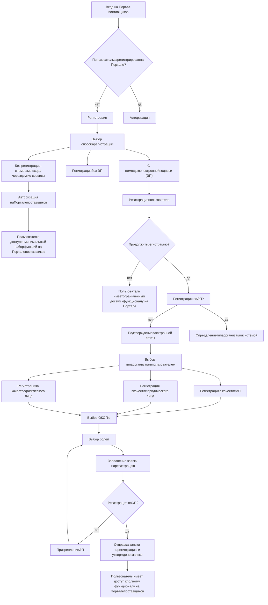
```mermaid
graph TD
    A["Вход на Портал поставщиков"] --> B{"Пользовательзарегистрированна Портале?"}
    B -- нет --> C["Регистрация"]
    B -- да --> D["Авторизация"]
    C --> E["Выбор способарегистрации"]
    E --> F["С помощьюэлектроннойподписи (ЭП)"]
    E --> G["Регистрациябез ЭП"]
    E --> H["Без регистрации, спомощью входа черездругие сервисы"]
    H --> I["Авторизация наПорталепоставщиков"]
    I --> J["Пользователю доступенминимальный наборфункций на Порталепоставщиков"]
    F --> K["Регистрацияпользователя"]
    K --> L{"Продолжитьрегистрацию?"}
    L -- нет --> M["Пользователь имеетограниченный доступ кфункционалу на Портале"]
    L -- да --> N["Регистрация поЭП?"]
    N -- нет --> O["Подтверждениеэлектронной почты"]
    N -- да --> P["Определениетипаорганизациисистемой"]
    O --> Q["Выбор типаорганизациипользователем"]
    Q --> R["Регистрацияв качествеИП"]
    Q --> S["Регистрация вкачествеюридического лица"]
    Q --> T["Регистрацияв качествефизического лица"]
    R & S & T --> U["Выбор ОКОПФ"]
    U --> V["Выбор ролей"]
    V --> W["Заполнение заявки нарегистрацию"]
    W --> X{"Регистрация поЭП?"}
    X -- нет --> Y["ПрикреплениеЭП"]
    Y --> V
    X -- да --> Z["Отправка заявки нарегистрацию и утверждениезаявки"]
    Z --> AA["Пользователь имеет доступ кполному функционалу на Порталепоставщиков"]
```

**Рисунок 30 – Способы регистрации на Портале поставщиков**

При регистрации на Портале поставщиков необходимо сначала зарегистрировать организацию, используя сертификат, выданный на организацию, а потом добавить пользователей. Для работы на Портале поставщиков пользователи должны использовать сертификат, выданный на физическое лицо.

### 3.3.1. **Регистрация ЮЛ и ИП по электронной подписи**
Для регистрации юридического лица (ЮЛ) или индивидуального предпринимателя (ИП) по электронной подписи (ЭП) на Портале поставщиков необходимо перейти на главную страницу Портала поставщиков и выполнить следующие шаги (**Рисунок 31**):

---

22

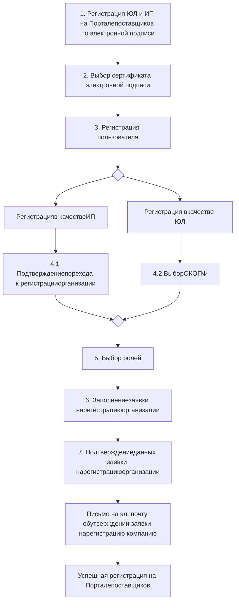
```mermaid
graph TD
    A["1. Регистрация ЮЛ и ИП на Порталепоставщиков по электронной подписи"] --> B["2. Выбор сертификата электронной подписи"]
    B --> C["3. Регистрация пользователя"]
    C --> D{" "}
    D --> E["Регистрацияв качествеИП"]
    D --> F["Регистрация вкачестве ЮЛ"]
    E --> G["4.1 Подтверждениеперехода к регистрацииорганизации"]
    F --> H["4.2 ВыборОКОПФ"]
    G --> I{" "}
    H --> I
    I --> J["5. Выбор ролей"]
    J --> K["6. Заполнениезаявки нарегистрациюорганизации"]
    K --> L["7. Подтверждениеданных заявки нарегистрациюорганизации"]
    L --> M["Письмо на эл. почту обутверждении заявки нарегистрацию компанию"]
    M --> N["Успешная регистрация на Порталепоставщиков"]
```

**Рисунок 31 – Порядок регистрации на Портале поставщиков по электронной подписи**

1 Нажать на кнопку «**Зарегистрироваться**» (Рисунок 27), после чего откроется страница регистрации. По умолчанию открывается страница регистрации по электронной подписи (**Рисунок 32**).
2 На странице «**Выбор сертификата электронной подписи**» необходимо выбрать сертификат для регистрации и нажать на кнопку «Выбрать электронную подпись» (**Рисунок 32** (2)).

---

23

Форма выбора сертификата электронной подписи для регистрации

**Рисунок 32 – Форма выбора сертификата электронной подписи для регистрации**

3 В открывшейся форме «**Регистрация пользователя**» (**Рисунок 33**) необходимо:
− Проверить и при необходимости отредактировать обязательные поля (Рисунок 27) (1));
− Задать и повторить пароль (**Рисунок 33**) (2));
− Принять условия пользовательского соглашения и Регламента (**Рисунок 33**) (3));
− Нажать на кнопку «Продолжить» (**Рисунок 33**) (4));

---

24

# Регистрация пользователя

**Владислав Владимирович Камодович**
ПАО КамОД
186016576B75CCA83ADF6152E1DE4E2ABBBC0264
Действует с 27.01.2023 г. по 27.04.2023 г.
Посмотреть сведения из ЭП

**Фамилия***
Камодович

**Имя***
Владислав

**Отчество***
Владимирович
Нет отчества

Укажите электронный адрес, который будет использоваться в качестве логина в личном кабинете
**Email***
kamodv@bk.ru

Задайте пароль для возможности входа по логину и паролю. Логином вашей учетной записи является email, указанный выше.
**Задайте пароль***
..........

**Введите пароль еще раз***
..........

Требования к паролю:
* не менее 8 символов;
* хотя бы одна цифра;
* хотя бы одна буква прописная;
* хотя бы одна буква строчная.

Я принимаю условия пользовательского соглашения
Я ознакомлен с положениями Регламента

Как зарегистрироваться? Перейти к авторизации Вернуться к выбору сертификата Продолжить

**Рисунок 33 – Форма «Регистрация пользователя»**

После завершения регистрации на электронную почту придет соответствующее информационное письмо (**Рисунок 34**).

Информационное письмо о завершении регистрации пользователя на Портале поставщиков

**Рисунок 34 – Информационное письмо о завершении регистрации пользователя на Портале поставщиков**

---

25

4 В зависимости от типа организации пользователя, указанной в ЭП, будет открыт один из следующих интерфейсов:
- Форма «Подтверждение перехода к регистрации организации» для ИП (Рисунок 35);
- Форма «Выбор ОКОПФ» для ЮЛ (Рисунок 36).

4.1 На форме «Подтверждение перехода к регистрации организации» для ИП необходимо нажать на кнопку «Продолжить» (Рисунок 35).

Рисунок 35 – Подтверждение перехода к регистрации организации для ИП

**Рисунок 35 – Подтверждение перехода к регистрации организации для ИП**

4.2 На форме «Выбор ОКОПФ» для ЮЛ необходимо выбрать значение из справочника ОКОПФ (Рисунок 36) и нажать на кнопку «Продолжить» (Рисунок 37).

Рисунок 36 – Выбор значения из справочника ОКОПФ

**Рисунок 36 – Выбор значения из справочника ОКОПФ**

---

26

Регистрация на Портале поставщиков. Заполните обязательные поля. Наименование организации: ПАО КаМод. ИНН: 2327063500. Организационно-правовая форма: Публичные акционерные общества. Кнопки: Как зарегистрироваться?, Вернуться позже, Продолжить.

**Рисунок 37 – Кнопка «Продолжить» на форме «Выбор ОКОПФ»**

5. На странице «Выбор типа организации» необходимо выбрать роль и нажать на кнопку «Подтвердить» (**Рисунок 38**):

Регистрация на Портале поставщиков. Выберите свои роли на Портале поставщиков. Три карточки: Стать поставщиком, Стать заказчиком/покупателем, Стать производителем. Кнопки: Отменить, Сохранить, Подтвердить.

**Рисунок 38 – Выбор ролей пользователем**

6. На открывшейся странице «Заявка на регистрацию организации» необходимо заполнить обязательные поля следующих блоков:
   - Общие сведения о компании (**Рисунок 39 (1)**);
   - Основание для проведения закупок, данный блок не отображается для Московских заказчиков. Для заказчиков, которые имеют ОКОПФ 71400, заполняется только поле «Положения о закупках» (**Рисунок 39 (2)**);
   - Банковские реквизиты (**Рисунок 39 (3)**);
   - Контактная информация (**Рисунок 39 (4)**).

---

27

Рисунок 39 – страница «Заявка на регистрацию организации»

**Рисунок 39 – страница «Заявка на регистрацию организации»**

Для промежуточного сохранения данных заявки на регистрацию необходимо нажать на кнопку «Сохранить» (**Рисунок 39** (6)).
Для выхода без сохранения данных необходимо нажать кнопку «Отменить» (**Рисунок 39** (7)).
После заполнения всех обязательных полей формы необходимо нажать на кнопку «Завершить» (**Рисунок 39** (5)).

6.1 **Блок «Общие сведения о компании»** состоит из полей, указанных в таблице ниже (**Таблица 4**; **Рисунок 40**):

− **Таблица 4 – Поля блока «Общие сведения о компании» формы «Заявка на регистрацию организации»**

| Наименование поля        | Обяз- сть | Пояснение к заполнению поля                                                                                                              |
| ------------------------ | --------- | ---------------------------------------------------------------------------------------------------------------------------------------- |
| Наименование организации | Да        | Полное наименование организации<br/>(автоматически загружается из сертификата)                                                           |
| ИНН                      | Да        | Идентификационный номер налогоплательщика<br/>(автоматически загружается из сертификата)                                                 |
| ОГРН                     | Да        | Основной государственный регистрационный номер<br/>(автоматически загружается из сертификата)                                            |
| КПП                      | Да        | Код причины постановки на учет (может быть автоматически<br/>загружен из сертификата, при необходимости следует внести<br/>изменение)    |
| Юридический адрес        | Да        | Юридический адрес организации (автоматически загружается из<br/>сертификата, при необходимости следует внести изменение)                 |
| Краткое наименование     | Нет       | Краткое наименование организации (может быть автоматически<br/>загружено из сертификата, при необходимости следует внести<br/>изменение) |
| ОКТМО                    | Да        | Код ОКТМО (значение из 8 или 11 знаков)                                                                                                  |
| ОКАТО                    | Да        | Код ОКАТО (значение из 8 или 11 знаков; если в коде 11 знаков<br/>и на конце 000, то их указывать не нужно)                              |
| ОКПО                     | Да        | Код ОКПО (значение из 8 или 10 знаков)                                                                                                   |


---

28

| Наименование поля                          | \*\*Обяз-сть\*\* | \*\*Пояснение к заполнению поля\*\*                                                 |
| ------------------------------------------ | ---------------- | ----------------------------------------------------------------------------------- |
| ОКВЭД                                      | Да               | Код ОКВЭД (значение из 4, 5 или 6 знаков)                                           |
| ОКОПФ                                      | Да               | Значение из справочника «Общероссийский классификатор организационно-правовых форм» |
| Дата постановки на учет в налоговом органе | Да               | Установка даты постановки на учет с помощью встроенного календаря                   |
| Код налогового органа                      | Нет              | Код налогового органа из 4 цифр                                                     |
| Страна                                     | Да               | Страна регистрации. (выбор значения из выпадающего списка с подсказками)            |
| Регион регистрации организации             | Да               | Регион регистрации организации (выбор значения из выпадающего списка с подсказками) |


Блок «Общие сведения о компании»

**Рисунок 40 – Блок «Общие сведения о компании»**

---

29

6.2     **Блок «Основание для проведения закупок»** состоит из полей, указанных в таблице
        ниже (**Таблица 5**; **Рисунок 41**):

        **Таблица 5 - Поля блока «Основание для проведения закупок» формы «Заявка на**
        **регистрацию организации»**

| Наименование поля                | Обяз-сть | Пояснение к заполнению поля                                                                       |
| -------------------------------- | -------- | ------------------------------------------------------------------------------------------------- |
| Основание для проведения закупок | Да       | Необходимо указать номер Федерального закона, регламентирующего закупочную деятельность заказчика |
| Файл положения о закупках        | Да       | При выборе 223-ФЗ необходимо прикрепить файл «Положение о закупках»                               |
| Основания заключения контракта   | Да       | Заполняется при выборе 44-ФЗ                                                                      |
| Дата положения о закупках        | Да       | Заполняется при выборе 223-ФЗ или для заказчиков, у которых ОКОПФ 71400                           |


Рисунок 41 – Блока «Основание для проведения закупок»

**Рисунок 41 – Блока «Основание для проведения закупок»**

6.3     **Блок «Банковские реквизиты»** состоит из полей, указанных в таблице ниже (**Таблица**
        6; **Рисунок 42**):

---

30

**Таблица 6 - Поля блока «Банковские реквизиты» формы «Заявка на регистрацию организации»**

| Наименование поля                | Обяз-сть | Пояснение к заполнению поля                     |
| -------------------------------- | -------- | ----------------------------------------------- |
| Банковский идентификационный код | Да       | Поле должно содержать 9 символов                |
| Название банка                   | Да       | Наименование банка                              |
| Адрес банка                      | Нет      | Адрес банка (выбор значения из справочника ГАР) |
| Расчетный счет                   | Да       | Поле должно содержать 20 символов               |
| Корреспондентский счет           | Да       | Поле должно содержать 20 символов               |
| Лицевой счет                     | Нет      | Поле должно содержать 20 символов               |


Для ввода данных в блок «Банковские реквизиты» необходимо нажать на кнопку «Добавить». Далее, заполнить все поля блока и нажать на кнопку «Сохранить» (**Рисунок 42**).

Редактирование блока «Банковские реквизиты»

**Рисунок 42 – Редактирование блока «Банковские реквизиты»**

Для редактирования данных (**Рисунок 43** (1)) в блоке «Банковские реквизиты», удаления данных (**Рисунок 43** (1)) в блоке банковские реквизиты или добавления еще одного блока (**Рисунок 43** (3)) «Банковские реквизиты» необходимо воспользоваться соответствующими кнопками в блоке.

---

31

Банковские реквизиты

**Рисунок 43 – Кнопки действия блока «Банковские реквизиты»**

6.4 **Блок «Контактная информация»** состоит из полей, указанных в таблице ниже (**Таблица 7**; **Рисунок 44**):

− **Таблица 7 - Поля блока «Контактная информация» формы «Заявка на регистрацию организации»**

| \*\*Наименованиеполя\*\*          | \*\*Обяз-сть\*\* | \*\*Пояснение к заполнению поля\*\*                                                             |
| --------------------------------- | ---------------- | ----------------------------------------------------------------------------------------------- |
| Фактический адрес местонахождения | Да               | Адрес местонахождения организации (выбирается значения из справочника ГАР или вводится вручную) |
| Фамилия                           | Да               | Фамилия контактного лица                                                                        |
| Имя                               | Да               | Имя контактного лица                                                                            |
| Отчество                          | Нет              | Отчество контактного лица                                                                       |
| Без отчества                      | Нет              | Заполняется при необходимости                                                                   |
| Телефон                           | Да               | Телефон контактного лица организации                                                            |
| Email                             | Да               | Адрес электронной почты организации                                                             |


---

32

Контактная информация

**Рисунок 44 – Блок «Контактная информация»**

После заполнения всех обязательных полей формы «Заявка на регистрацию организации» пользователю необходимо нажать на кнопку «Завершить» (**Рисунок 44**).

7 После подтверждения данных пользователем, откроется форма «Поздравление с регистрацией профиля», из которой пользователь может перейти в другие разделы (**Рисунок 45**).

Поздравление с регистрацией профиля

**Рисунок 45 – Форма «Поздравление с регистрацией профиля»**

После успешной регистрации на Портале поставщиков пользователю придет соответствующее уведомление на электронную почту (**Рисунок 46**).

---

33

Уведомление об успешной регистрации организации на Портале поставщиков

**Рисунок 46 – Уведомление об успешной регистрации организации на Портале поставщиков**

Если процесс регистрации профиля был прерван, пользователь может возобновить его. Для этого необходимо перейти в меню личного кабинета в раздел «Управление профилем» и нажать на кнопку «Заявка на регистрацию профиля» (**Рисунок 47**).

Возобновление процесса регистрации

**Рисунок 47 – Возобновление процесса регистрации**

### 3.3.2. Регистрация в качестве физического лица по электронной подписи
Для регистрации учетной записи физического лица на Портале поставщиков необходимо выполнить следующие шаги (**Рисунок 48**):

---

34

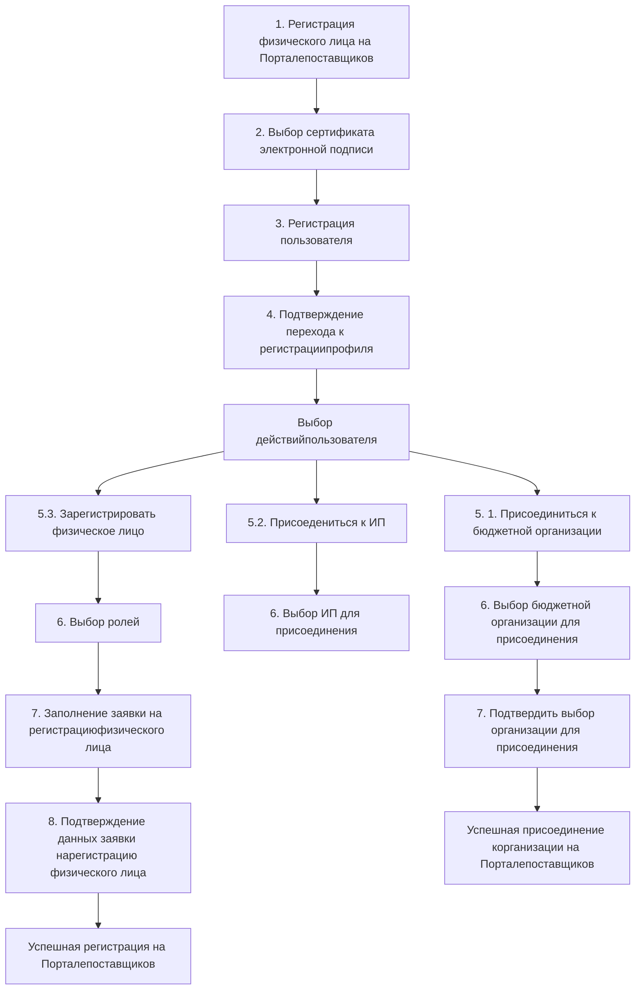
```mermaid
graph TD
    A["1. Регистрация физического лица на Порталепоставщиков"] --> B["2. Выбор сертификата электронной подписи"]
    B --> C["3. Регистрация пользователя"]
    C --> D["4. Подтверждение перехода к регистрациипрофиля"]
    D --> E["Выбор действийпользователя"]
    E --> F1["5. 1. Присоединиться к бюджетной организации"]
    E --> F2["5.2. Присоедениться к ИП"]
    E --> F3["5.3. Зарегистрировать физическое лицо"]
    F1 --> G1["6. Выбор бюджетной организации для присоединения"]
    F2 --> G2["6. Выбор ИП для присоединения"]
    F3 --> G3["6. Выбор ролей"]
    G1 --> H1["7. Подтвердить выбор организации для присоединения"]
    G3 --> H2["7. Заполнение заявки на регистрациюфизического лица"]
    H2 --> H3["8. Подтверждение данных заявки нарегистрацию физического лица"]
    H1 --> I1["Успешная присоединение корганизации на Порталепоставщиков"]
    H3 --> I2["Успешная регистрация на Порталепоставщиков"]
```

**Рисунок 48 – Шаги регистрации физического лица на Портале поставщиков**

1 Нажать на кнопку «**Зарегистрироваться**» (Рисунок 27) после чего откроется страница «**Выбор сертификата электронной подписи**».
2 На странице «**Выбор сертификата электронной подписи**» необходимо выбрать сертификат физического лица для регистрации и нажать на кнопку «Выбрать электронную подпись» (**Рисунок 49**).

Форма выбора сертификата электронной подписи для регистрации

**Рисунок 49 – Форма выбора сертификата электронной подписи для регистрации**

3 На форме «**Регистрация пользователя**» необходимо заполнить обязательные поля, задать и повторить пароль, а также принять условия соглашения и регламента, после чего нажать на кнопку «Продолжить» (**Рисунок 50**).

---

35

**Регистрация пользователя**

*   **Фамилия**: Владимир
*   **Имя**: Трубный
*   **Отчество**: Дмитриев
*   [ ] Нет отчества
*   **Email**: trubnyydmitriyev@bk.ru
*   **Задайте пароль**: [_________]
*   **Введите пароль еще раз**: [_________]

**Требования к паролю:**
*   не менее 8 символов;
*   хотя бы одна цифра;
*   хотя бы одна буква прописная;
*   хотя бы одна буква строчная.

*   [x] Я принимаю условия пользовательского соглашения
*   [x] Я ознакомлен с положениями Регламента

Рисунок 50 – Форма «Регистрация пользователя»

**Рисунок 50 – Форма «Регистрация пользователя»**

4 На форме «Поздравления с регистрацией пользователя» необходимо нажать на кнопку «Продолжить» для подтверждения перехода к регистрации профиля (**Рисунок 51**).

Рисунок 51 – Подтверждение перехода к выбору действий физического лица

**Рисунок 51 – Подтверждение перехода к выбору действий физического лица**

---

36

5 На форме «Выбор действий пользователя физического лица» выбрать один из вариантов ниже и нажать кнопку «Продолжить» (**Рисунок 52**):
    - «Зарегистрировать физическое лицо»;
    - «Присоединится к ИП».

5.1 При выборе опции «**Присоединится к ИП**» (**Рисунок 52**) и нажать на кнопку «Продолжить». В модальном окне необходимо подтвердить свой выбор (**Рисунок 53**).

Регистрация на Портале поставщиков: выбор опции «Присоединится к ИП»

**Рисунок 52 – Выбор опции «Присоединится к ИП»**

Модальное окно подтверждения выбора опции «Присоединится к ИП»

**Рисунок 53 – Модальное окно «Подтверждение присоединения к ИП»**

6 Перейти к выбору ИП для присоединения нажав на кнопку «Выбрать организацию» (**Рисунок 54**).

---

37

Регистрация на Портале поставщиков

**Рисунок 54 - Переход к форме «Выбор организации»**

7. Выбрать ИП для присоединения из справочника и нажать на кнопку «Подтвердить» (Рисунок 56). Далее, в модальном окне необходимо подтвердить свой выбор (Рисунок 57).

Сведения о пользователе

**Рисунок 55 – Выбор ИП**

---

38

**Сведения о пользователе**
Электронная подпись принадлежит физическому лицу. Эти данные нельзя изменить.

**ФИО**
Зарушанин Петро Валерьевич

**СНИЛС**
99133418538

**Email**
veratrans88@mail.ru

**Выбранная организация для присоединения**
ИП Дорофеев Дмитрий Викторович (ИНН: 771512374572)

Форма «Выбор ИП»

**Рисунок 56 – Форма «Выбор ИП»**

Модальное окно «Подтверждение отправки заявки администратору компании»

**Рисунок 57 - Модальное окно «Подтверждение отправки заявки администратору компании»**

8. После подтверждения данных пользователем, откроется форма «Поздравление присоединения к организации», из которой пользователь может перейти в другие разделы (Рисунок 58).

Форма «Поздравление присоединения к организации»

**Рисунок 58 – Форма «Поздравление присоединения к организации»**

5.2. При выборе опции «**Зарегистрировать физическое лицо**» (**Рисунок 59**) и нажать на кнопку «Продолжить». В модальном окне необходимо подтвердить свой выбор (**Рисунок 60**).

---

39

Регистрация на Портале поставщиков. Выбранная электронная подпись принадлежит физическому лицу. Выберите действие, которое вы хотите совершить. Зарегистрировать физическое лицо СНИЛС: 99133418538. Присоединиться к бюджетной организации. Присоединиться к ИП. Вернуться позже. Продолжить.

**Рисунок 59 – Форма «Выбор действий пользователя физического лица»**

Подтверждение. Вы выбрали опцию: "Зарегистрировать физическое лицо СНИЛС: 10998297316", вы уверены, что хотите продолжить? Продолжить. Отменить.

**Рисунок 60 - Модальное окно «Подтверждение регистрации физического лица»**

6 В открывшейся форме «Выбор типа организации» необходимо выбрать роль/роли и нажать на кнопку «Подтвердить» (Рисунок 61):

Регистрация на Портале поставщиков. 1 Регистрация пользователя. 2 Выбор типа организации. 3 Регистрация организации. Выберите свои роли на Портале поставщиков. Стать поставщиком. Получив эту роль, вы сможете: Создавать заявку на товар, работу или услугу (СТЕ) (разместите СТЕ в каталоге). Создавать прайс-лист (воспользуйтесь массовой загрузкой оферт). Размещать предложения на закупки и потребности (участвуйте в гос, B2B и B2C закупках). Выбрать. Стать заказчиком/покупателем. Получив эту роль, вы сможете: Создавать закупку по потребностям (укажите необходимые позиции и информацию по поставке). Создавать прямую закупку (добавьте продукцию в корзину и отправьте заявку на покупку Поставщику). Создавать потребность в товарах (обозначьте потребность в продукции и найдите производителей). Выбрано. Подробная информация о правилах регистрации размещена в разделе «Центр поддержки пользователей». Отменить. Сохранить. Подтвердить.

**Рисунок 61 - Форма «Выбор типа организации для физического лица»**

7 В открывшейся форме «Заявка на регистрацию физического лица» необходимо заполнить следующие блоки (Рисунок 62):
- Сведения о физическом лице (Рисунок 62 (1));

---

40

— Банковские реквизиты (**Рисунок 62 (2)**);
— Контактная информация (**Рисунок 62 (3)**).

Форма «Заявка на регистрацию физического лица»

**Рисунок 62 - Форма «Заявка на регистрацию физического лица»**

Для промежуточного сохранения данных заявки на регистрацию необходимо нажать на кнопку «Сохранить» (**Рисунок 62 (6)**). Для выхода без сохранения данных необходимо нажать на кнопку «Отменить» (**Рисунок 62 (7)**).

После заполнения всех обязательных полей формы необходимо нажать на кнопку «Завершить» (**Рисунок 62 (5)**).

7.1 Блок «Сведения о физическом лице» состоит из полей, указанных в таблице ниже (**Таблица 8**; **Рисунок 63**):

— **Таблица 8 – Поля блока «Сведения о физическом лице» формы «Заявка на регистрацию физического лица»**

| Наименование поля   | Обяз-сть | Пояснение к заполнению поля                                                                     |
| ------------------- | -------- | ----------------------------------------------------------------------------------------------- |
| ИНН                 | Да       | Идентификационный номер налогоплательщика (автоматически загружается из сертификата)            |
| Имя                 | Да       | Имя (автоматически загружается из сертификата)                                                  |
| Фамилия             | Да       | Фамилия (автоматически загружается из сертификата)                                              |
| Отчество            | Нет      | Отчество (автоматически загружается из сертификата, при необходимости следует внести изменение) |
| СНИЛС               | Да       | Страховой номер индивидуального лицевого счета (автоматически загружается из сертификата)       |
| Являюсь самозанятым | Нет      | Возможность установить признак, информирующий о наличии статуса самозанятого                    |


---

41

**Сведения о физическом лице**
* ИНН: 228241673326
* Имя: Трубный
* Фамилия: Владимир
* Отчество: Дмитриев
* СНИЛС: 10998297316
* Являюсь самозанятым: [x]

**Рисунок 63 - Блок «Сведение о физическом лице» формы «Заявка на регистрацию физического лица»**

7.2 **Блок «Банковские реквизиты»** состоит из полей, указанных в таблице ниже (**Таблица 9**; **Рисунок 64**):

* **Таблица 9 - Поля блока «Банковские реквизиты» формы «Заявка на регистрацию физического лица»**

| Наименование поля                | Обяз-сть | Пояснение к заполнению поля                     |
| -------------------------------- | -------- | ----------------------------------------------- |
| Банковский идентификационный код | Да       | Поле должно содержать 9 символов                |
| Название банка                   | Да       | Наименование банка                              |
| Адрес банка                      | Нет      | Адрес банка (выбор значения из справочника ГАР) |
| Расчетный счет                   | Да       | Поле должно содержать 20 символов               |
| Корреспондентский счет           | Да       | Поле должно содержать 20 символов               |
| Лицевой счет                     | Нет      | Поле должно содержать 20 символов               |


Для ввода данных в блок «Банковские реквизиты» необходимо нажать на кнопку «Добавить». Далее, заполнить все поля блока и нажать на кнопку «Сохранить» (**Рисунок 64**).

---

42

Банковские реквизиты

**Рисунок 64 - Блок «Банковские реквизиты» формы «Заявка на регистрацию физического лица»**

Для редактирования данных (**Рисунок 65** (1)) в блоке «Банковские реквизиты», удаления данных (**Рисунок 65** (1)) в блоке банковские реквизиты или добавления еще одного блока (**Рисунок 65** (3)) «Банковские реквизиты» необходимо воспользоваться соответствующими кнопками в блоке.

Банковские реквизиты

**Рисунок 65 – Кнопки действия блока «Банковские реквизиты»**

7.3 **Блок «Контактная информация»** состоит из полей, указанных в таблице ниже (**Таблица 10**; **Рисунок 66**):

− **Таблица 10 – Поля блока «Контактная информация» формы «Заявка на регистрацию физического лица»**

| Наименование поля | Обяз-сть | Пояснение к заполнению поля       |
| ----------------- | -------- | --------------------------------- |
| Фактический адрес | Да       | Адрес местонахождения организации |


---

43

| местонахождения |     | (выбирается значения из справочника ГАР или вводится вручную) |
| --------------- | --- | ------------------------------------------------------------- |
| Фамилия         | Да  | Фамилия контактного лица                                      |
| Имя             | Да  | Имя контактного лица                                          |
| Отчество        | Нет | Отчество контактного лица                                     |
| Без отчества    | Нет | Заполняется при необходимости                                 |
| Телефон         | Да  | Телефон контактного лица организации                          |
| Email           | Да  | Адрес электронной почты организации                           |


Контактная информация

**Рисунок 66 - Блок «Контактная информация» формы «Заявка на регистрацию физического лица»**

После заполнения всех обязательных полей формы «Заявка на регистрацию физического лица» пользователю необходимо нажать на кнопку «Завершить» (**Рисунок 62** (5)).
8 После подтверждения данных пользователем, откроется форма «Поздравление с регистрацией профиля», из которой пользователь может перейти в другие разделы (**Рисунок 67**).

---

44

Форма «Поздравления с регистрацией профиля»

**Рисунок 67 – Форма «Поздравления с регистрацией профиля»**

После успешной регистрации на Портале поставщиков пользователю придет соответствующее уведомление на электронную почту (**Рисунок 68**).

Уведомление об успешной регистрации физического лица на Портале поставщиков

**Рисунок 68 – Уведомление об успешной регистрации физического лица на Портале поставщиков**

Если процесс регистрации профиля был прерван, пользователь может возобновить его. Для этого необходимо перейти в меню личного кабинета в раздел «Управление профилем» и нажать на кнопку «Заявка на регистрацию профиля» (**Рисунок 69**).

---

45

Скриншот интерфейса личного кабинета с выделенными элементами «Заявка на регистрацию профиля» и «Управление профилем»

**Рисунок 69 – Возобновление процесса регистрации**

### 3.3.3. Регистрация **без электронной подписи**

Для регистрации **без электронной подписи** на Портале поставщиков необходимо перейти на главную страницу Портала поставщиков и выполнить следующие шаги (**Рисунок** **70**):

---

46

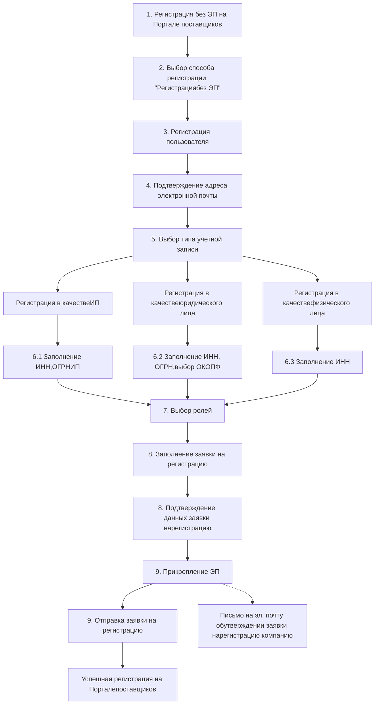
```mermaid
graph TD
    A["1. Регистрация без ЭП на Портале поставщиков"] --> B["2. Выбор способа регистрации &quot;Регистрациябез ЭП&quot;"]
    B --> C["3. Регистрация пользователя"]
    C --> D["4. Подтверждение адреса электронной почты"]
    D --> E["5. Выбор типа учетной записи"]
    E --> F["Регистрация в качествеИП"]
    E --> G["Регистрация в качествефизического лица"]
    E --> H["Регистрация в качествеюридического лица"]
    F --> I["6.1 Заполнение ИНН,ОГРНИП"]
    H --> J["6.2 Заполнение ИНН, ОГРН,выбор ОКОПФ"]
    G --> K["6.3 Заполнение ИНН"]
    I --> L["7. Выбор ролей"]
    J --> L
    K --> L
    L --> M["8. Заполнение заявки на регистрацию"]
    M --> N["8. Подтверждение данных заявки нарегистрацию"]
    N --> O["9. Прикрепление ЭП"]
    O --> P["9. Отправка заявки на регистрацию"]
    P --> Q["Успешная регистрация на Порталепоставщиков"]
    O -.-> R["Письмо на эл. почту обутверждении заявки нарегистрацию компанию"]
```

**Рисунок 70 – Шаги регистрации без электронной подписи**

1 Нажать на кнопку «**Зарегистрироваться**» (Рисунок 27), после чего откроется страница «**Выбора ЭП**» – подробнее раздел 3.3.1;
2 Чтобы перейти к регистрации без электронной подписи необходимо нажать кнопку «**Регистрация без ЭП**» (Рисунок 71);

---

47

Расположение кнопки «Регистрация без ЭП»

**Рисунок 71 – Расположение кнопки «Регистрация без ЭП»**

3 На форме «**Регистрация пользователя**» необходимо заполнить обязательные поля, задать и повторить пароль, а также принять условия соглашения и регламента, после чего нажать на кнопку «Продолжить» (**Рисунок 72**);

Форма «Регистрация пользователя» при регистрации без ЭП

**Рисунок 72 – Форма «Регистрация пользователя» при регистрации без ЭП**

При успешной регистрации пользователя отобразиться страница с системным сообщением (**Рисунок 73**). На указанную электронную почту от Портала поставщиков отправится ссылка-подтверждение адреса электронной почты

---

48

Страница с системным сообщением об отправке ссылки-подтверждения на адрес электронной почты

**Рисунок 73 – Страница с системным сообщение об отправке ссылки-подтверждения на адрес электронной почты**

4 После получения письма со ссылкой-подтверждением необходимо перейти по ссылке<sup>3</sup>, указанной в письме (**Рисунок 74**) для подтверждения адреса электронной почты.

Уведомление со ссылкой-подтверждением адреса электронной почты

**Рисунок 74 – Уведомление со ссылкой-подтверждением адреса электронной почты**

5 На форме **выбора типа компании** выбрать тип компании, которую нужно зарегистрировать или к которой нужно присоединиться (если организация была зарегистрирована ранее) один из вариантов ниже и нажать на кнопку «Продолжить» (**Рисунок 75**):
− юридическое лицо;
− индивидуальный предприниматель;
− физическое лицо.

<sup>3</sup> В случае, если письмо со ссылкой подтверждения не пришло, то можно запросить его повторно по кнопке «Нажмите сюда»

---

49

Регистрация на Портале поставщиков. Зарегистрируйте новую компанию или присоединитесь к существующей. Выберите тип компании: юридическое лицо, индивидуальный предприниматель, физическое лицо

**Рисунок 75 – Форма выбора типа компании**

6.1 При выборе опции «Юридическое лицо» и нажатии на кнопку «Продолжить» (Рисунок 75) открывается форма, на которой пользователю необходимо:
* ввести ИНН;
* ввести ОГРН;
* выбрать ОКОПФ из справочника (Рисунок 76).

Регистрация на Портале поставщиков. Заполните обязательные поля. ИНН: 9731035659, ОГРН: 1197746228040, Организационно-правовая форма: Общества с ограниченной ответственностью. Кнопки: Вернуться позже, Продолжить

**Рисунок 76 – Форма ввода ИНН, ОГРНИП, ОКОПФ для регистрации ЮЛ без ЭП**

6.2 При выборе опции «Индивидуальный предприниматель» и нажатии на кнопку «Продолжить» (Рисунок 75) открывается форма, на которой пользователю необходимо:
* Ввести ИНН;
* Ввести ОГРНИП (Рисунок 77).

---

50

Регистрация на Портале поставщиков: ИНН 260403728100, ОГРНИП 321265100047160

**Рисунок 77 – Форма ввода ИНН и ОГРНИП для регистрации ИП без ЭП**

6.3 При выборе опции «**Физическое лицо**» и нажатии на кнопку «Продолжить» (**Рисунок 75**) открывается форма, на которой пользователю необходимо ввести ИНН (**Рисунок 78**).

Регистрация на Портале поставщиков: ИНН 260403728100

**Рисунок 78 – Форма ввода ИНН для регистрации физического лица без ЭП**

7 В зависимости от выбранного типа учетной записи, пользователю откроется форма «Выбор ролей» для ЮЛ и ИП (подробнее раздел 3.3.1) или для физического лица (подробнее раздел 3.3.2), на которой пользователю необходимо выбрать роль/роли и нажать на кнопку «Продолжить».

8 Далее, пользователю необходимо заполнить данные на форме «Заявка на регистрацию организации» (подробнее раздел 3.3.1) или «Заявка на регистрацию физического лица» (подробнее раздел 3.3.2) в зависимости от выбранного типа учетной записи и нажать на кнопку «Продолжить».

9 Следующим шагом пользователю открывается форма «Подтверждения данных заявки на регистрацию организации» (подробнее раздел 3.3.1) или «Подтверждение данных заявки на регистрации физического лица» (подробнее раздел 3.3.2).

```description
Значок восклицательного знака в красном круге
```

Внимание, для отправки заявки на регистрацию на утверждения необходимо сначала прикрепить электронную подпись к профилю пользователя.

---

51

Для прикрепления электронной подписи к профилю пользователя необходимо перейти в личный кабинет, в разделе «Управление пользователем» выбрать подраздел «Профиль пользователя» (**Рисунок 79**).

Переход к подразделу «Профиль пользователя»

**Рисунок 79 – Переход к подразделу «Профиль пользователя»**

В Профиле пользователя необходимо нажать на кнопку «Операции с ЭП» (**Рисунок 80**).
В открывшейся странице «Добавление сертификата» выбрать сертификат и нажать на кнопку «Выбрать электронную подпись» (**Рисунок 81**).

Расположение кнопки «Операции с ЭП» в профиле пользователя

**Рисунок 80 – Расположение кнопки «Операции с ЭП» в профиле пользователя**

---

52

Страница «Добавление сертификата»

**Рисунок 81 – Страница «Добавление сертификата»**

10 После прикрепления электронной подписи необходимо вернуться к заявке на регистрацию и выполнить отправку заявки на утверждение.
Для этого необходимо в меню личного кабинета пользователя в разделе «Управление профилем» выбрать подраздел «Заявка на регистрацию организации» (**Рисунок 82**).

Переход к странице «Заявка на регистрацию компании»

**Рисунок 82 – Переход к странице «Заявка на регистрацию компании»**

В открывшейся форме «Подтверждения данных заявки на регистрацию организации» (подробнее раздел 3.3.1) или «Подтверждение данных заявки на регистрации физического лица» (подробнее раздел 3.3.2) нажать на кнопку «Продолжить».

### 3.3.4. Рассмотрение заявки на регистрацию и создание пользователей

Общий порядок рассмотрения заявки на регистрацию представлен ниже (**Рисунок 83**).

---

53

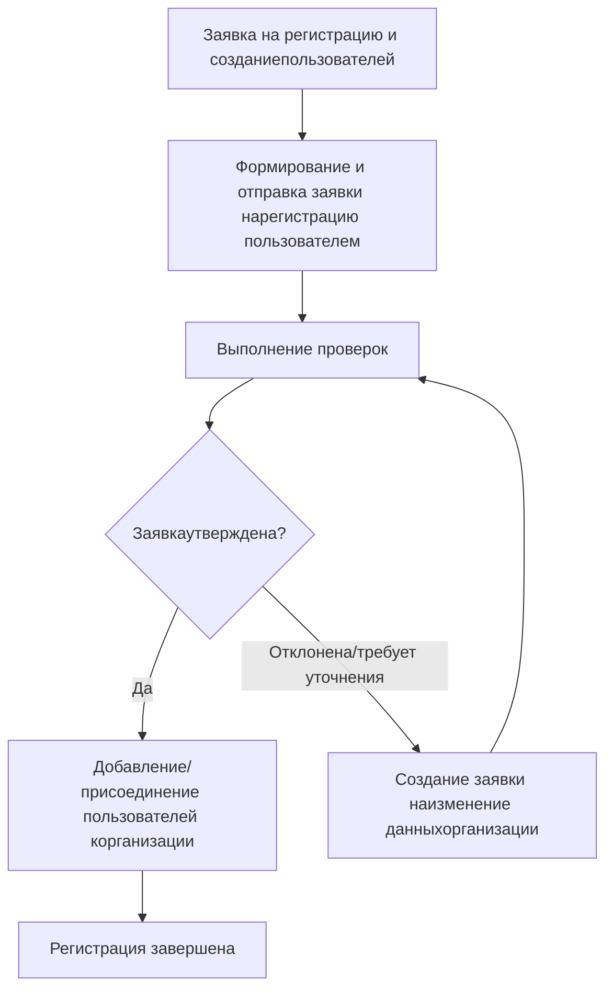
```mermaid
graph TD
    A["Заявка на регистрацию и созданиепользователей"] --> B["Формирование и отправка заявки нарегистрацию пользователем"]
    B --> C["Выполнение проверок"]
    C --> D{"Заявкаутверждена?"}
    D -->|Да| E["Добавление/присоединение пользователей корганизации"]
    D -->|Отклонена/требует уточнения| F["Создание заявки наизменение данныхорганизации"]
    F --> C
    E --> G["Регистрация завершена"]
```

**Рисунок 83 – Схема рассмотрения заявки на регистрацию и создания пользователей**

После отправки пользователем заявки на регистрацию на утверждение ей присваивается статус **«Отправлена»**. После того, как заявка будет рассмотрена модератором, ей присвоится статус **«Изменения приняты»** или **«Отклонена»** в соответствии с решением модератора.

Заявка на регистрацию может быть направлена на доработку пользователю, в таком случае ей присваивается статус **«Требуется уточнение»**. Чтобы посмотреть комментарии модератора, необходимо в списке отправленных заявок нажать на наименование статуса, после чего откроется соответствующее модальное окно (**Рисунок 84**).

Окно с комментариями модератора

**Рисунок 84 – Окно с комментариями модератора по заявке на изменение данныхкомпании**

Для внесения исправлений по замечаниям модератора пользователю необходимо создать заявку на изменения данных (подробнее в разделе 6.1.1).

После обработки заявки и ее утверждения на почту придет сообщение о том, что заявка принята и в течение получаса будут предоставлены необходимые полномочия на портале (**Рисунок 85**). По истечении этого времени необходимо заново авторизоваться.

---

54

Информационное сообщение о принятии заявки на изменение данных

**Рисунок 85 – Информационное сообщение о принятии заявки на изменение данных**

## 3.3.5. Добавление и присоединение пользователей
Добавить пользователей в компанию можно двумя способами:
* через заявку на присоединение пользователя к организации;
* вручную в профиле компании.

### 3.3.5.1. Заявка на присоединение к организации
Для **создания заявки на присоединение к организации** пользователю необходимо выполнить следующие шаги:
1 Зарегистрировать пользователя (**Рисунок 87**) на портале поставщиков используя ЭП (**Рисунок 86**), выпущенную на организацию (подробнее раздел 3.3.1)

Выбор сертификата для присоединения к организации

**Рисунок 86 – Выбор сертификата для присоединения к организации**

---

55

Регистрация пользователя

**Рисунок 87 – Регистрация пользователя для присоединения к организации**

2. Перейти к выбору организации для присоединения (**Рисунок 88**).

Регистрация на Портале поставщиков

**Рисунок 88 – Переход к форме «Выбор организации для присодинения»**

---

56

3 Выбрать организацию для присоединения и нажать на кнопку «Подтвердить» (**Рисунок** **89**).

Регистрация на Портале поставщиков. Сведения о пользователе: ФИО Ушкина Ирина Сергеевна, Email ushkinasergeevna@rambler.ru. Выберите организацию: ООО «Дорожник» (ИНН: 6984958947, КПП: 833143430, Дата регистрации: 31.12.1752), Нет подходящего варианта. Кнопки: Отменить операцию, Сохранить, Подтвердить.

**Рисунок 89 – Форма «Выбор организации для присодинения»**

4 Пользователю отобразиться информационное сообщение о том, что заявка на присоединение к организации отправлена на утверждение администратору компании (**Рисунок 90**).

Информационное сообщение: Заявка отправлена на утверждение администратору компании. Ожидайте уведомления о решении администратора. Кнопки: Подтвердить, Отменить.

**Рисунок 90 – Информационное сообщение об отправке заявки администратору**
**компании**

Администратору компании придет уведомление на электронную почту со ссылкой на заявку на присоединения пользователя к организации (**Рисунок 91**) и в профиле компании в блоке «Сведения о пользователях» отобразится пользователь, отправивший заявку на присоединение (**Рисунок 92**).

---

57

logo: Портал поставщиков

Уважаемый(ая) Медведева Галина Анатольевна!

К вашей компании "ООО «Дорожник»" на Портале поставщиков хочет присоединиться пользователь "Ушкина Ирина Сергеевна".
Для работы с заявкой перейдите по ссылке.

**Рисунок 91 – Уведомление о присоединении пользователя к организации**

| Ф.И.О.            | Email           | Должность | Подразделение | Полномочия                          | Действия                                                                                              |
| ----------------- | --------------- | --------- | ------------- | ----------------------------------- | ----------------------------------------------------------------------------------------------------- |
| Анатолий Иванович | @mail.ru        |           |               |                                     | Перейти к заявке<br/>Заблокировать<br/>История блокировок<br/>Удалить пользователя<br/>Операции с МЧД |
| Вероника Ивановна | p. @internet.ru |           |               | Администратор компании<br/>Изменить |                                                                                                       |


**Рисунок 92 – Отображение заявки на присоединение в профиле компании**

Администратору компании необходимо перейти по ссылке из письма или нажать на кнопку «Перейти к заявке» в профиле компании, на открывшейся форме нажать на кнопку «Доступные действия» и выполнить одно из действий (**Рисунок 93**):
* утвердить пользователя;
* отклонить пользователя.

Регистрация на Портале поставщиков: Сведения о пользователе. На основании сведений из электронной подписи подобраны компании, к которым можно присоединиться. Выберите одну из них для отправки заявки администратору. ФИО: Ушкина Ирина Сергеевна. Email: ushkinasergeevna@rambler.ru. Выберите организацию: ООО «Дорожник» (ИНН: 6984958947, КПП: 833143430. Дата регистрации: 31.12.1752). Нет подходящего варианта. Утвердить пользователя. Отклонить пользователя. Доступные действия.

**Рисунок 93 – Форма присоединения пользователя к организации с доступными действиями**

---

58

Для утверждения заявки на присоединения пользователя необходимо нажать на кнопку «Утвердить пользователя» и подтвердить действие в модальном окне (**Рисунок 94**).

Модальное окно утверждения пользователя: Вы действительно хотите начать операцию "Утвердить пользователя"? Подтвердить Отменить

**Рисунок 94 – Модальное окно утверждения пользователя**

Для отклонения заявки на присоединения пользователя необходимо нажать на кнопку «Отклонить пользователя» и подтвердить действие в модальном окне (**Рисунок 95**).

Модальное окно отклонения пользователя: Вы действительно хотите начать операцию "Отклонить пользователя"? Подтвердить Отменить

**Рисунок 95 – Модальное окно отклонения пользователя**

После утверждения пользователя администратором он будет присоединен к организации.

### 3.3.5.2. Добавление пользователей к организации вручную

Для добавления пользователей к организации вручную необходимо перейти в личный кабинет, нажав кнопку **«Управление профилем»** во всплывающем пользовательском меню (**Рисунок 96**) и в открывшемся личном кабинете нажать кнопку **«Профиль компании»**.

Меню личного кабинета с выделенными пунктами "Профиль компании" и "Управление профилем"

**Рисунок 96 – Переход в профиль компании во всплывающем пользовательском меню**

---

59

В профиле компании необходимо перейти в блок «**Сведения о пользователях**» и нажать кнопку «**Создать**» (**Рисунок 97**). Профиль компании доступен только после регистрации копании на Портале поставщиков

Вкладка "Сведения о пользователях" в профиле компании

**Рисунок 97 – Вкладка "Сведения о пользователях" в профиле компании**

После чего откроется блок с полями для заполнения данными пользователя (**Рисунок 98**), где нужно ввести:
− E-mail нового пользователя;
− ФИО нового пользователя;
− Должность пользователя в компании;
− Подразделение, в котором работает пользователь.
После ввода данных необходимо нажать кнопку «**Сохранить**».

Поля для создания нового пользователя

**Рисунок 98 – Поля для создания нового пользователя**

После того, как пользователь будет добавлен, на указанную электронную почту поступит письмо с временным паролем и ссылкой для завершения регистрации, после чего необходимо:
1. Перейти по ссылке из электронного письма;
2. Заменить временный пароль на новый (см. раздел 4.1.2);
3. Перейти в управление пользователем→ Профиль пользователя (**Рисунок 99**), (п. 4.1);
4. Прикрепить электронную подпись.

---

60

Личный кабинет поставщика

**Рисунок 99 – Личный кабинет поставщика**

Подробнее по работе с профилем пользователя можно ознакомиться в разделе <u>4.1</u> <u>Профиль пользователя.</u>

### 3.3.5.3. Добавление прав пользователям

По умолчанию у только что созданного пользователя отсутствуют права, позволяющие вести полноценную деятельность на портале. В связи с этим администратору компании необходимо назначить необходимые пользователю роли.

Чтобы назначить права пользователю нужно перейти в блок **«Сведения о пользователях»** в профиле компании и напротив пользователя в столбце **«Полномочия»** нажать ссылку **«Изменить»** (**Рисунок 100**).

Таблица Сведения о пользователях

**Рисунок 100 – Ссылка для изменения полномочий пользователя**

После чего откроется окно изменения ролей пользователя (**Рисунок 101**), где необходимо указать роли пользователя (раздел 2.5), нажав на поле выбора.

---

61

Рисунок 101 – Окно изменения ролей пользователей

**Рисунок 101 – Окно изменения ролей пользователей**

После выбора ролей необходимо нажать кнопку «Сохранить».

---

62

### 3.4. **Авторизация пользователя**
Для входа на Портал необходимо нажать на кнопку «Войти», расположенную в верхней части главной страницы Портала (Рисунок 27):
Если до авторизации был открыт один из разделов портала, то после прохождения авторизации открывается ранее открытая страница.
Если пользователь зарегистрирован на Портале, то войти в личный кабинет он может следующими способами (**Рисунок 102**):
− авторизация с помощью логина и пароля;
− авторизация с помощью электронной подписи;
− сквозная авторизация через интегрированные сервисы (АИС УИД, ЭМ МО ЕАСУЗ, Росэлторг, СУДИР (mos.ru), ВТБ Коннект, Тэк-торг).

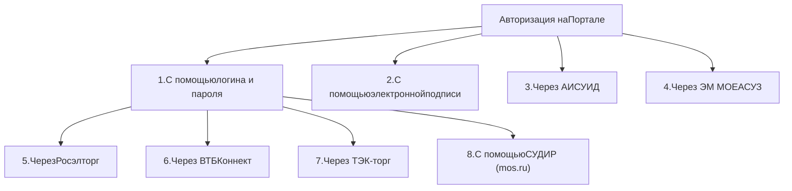
```mermaid
graph TD
    A["Авторизация наПортале"]
    B["1.С помощьюлогина и пароля"]
    C["2.С помощьюэлектроннойподписи"]
    D["3.Через АИСУИД"]
    E["4.Через ЭМ МОЕАСУЗ"]
    F["5.ЧерезРосэлторг"]
    G["6.Через ВТБКоннект"]
    H["7.Через ТЭК-торг"]
    I["8.С помощьюСУДИР (mos.ru)"]

    A --> B
    A --> C
    A --> D
    A --> E
    B --> F
    B --> G
    B --> H
    B --> I
```

**Рисунок 102 – Способы авторизации на Портале**

1 **Авторизация с помощью логина и пароля.** В окне авторизации ввести **Логин** и **Пароль** и нажать кнопку «Войти» (**Рисунок 103**).

Окно авторизации на Портале поставщиков

**Рисунок 103 – Окно авторизации на Портале поставщиков**

---

63

Если к пользователю прикреплены дополнительные организации, то после ввода логина и пароля откроется форма «Выберите профиль» (Рисунок 104), в которой нужно выбрать необходимый профиль и нажать кнопку «Войти».

Рисунок 104 – Форма «Выберите профиль»

| Наименование               | ИНН        | КПП       | Статус  |
| -------------------------- | ---------- | --------- | ------- |
| ООО "Проектбюро"           | 5713016549 | 107344181 | Активен |
| ООО "Ромеи"                | 2537559238 | 363344643 | Активен |
| ООО «Шоколад»              | 1030065208 | 091344383 | Активен |
| ООО «Сакура»               | 8804321104 | 368544104 | Активен |
| ООО «ЯсныйДень»            | 6280480975 | 292745061 | Активен |
| ООО «ТехТранс»             | 2782918687 | 163445227 | Активен |
| \[yes] ООО «РусскийПлаток» | 2139086494 | 053644491 | Активен |
| ООО «ЯгодкиГрибочки»       | 8798848299 | 478801595 | Активен |
| ООО «Сказки»               | 6127309217 | 373145660 | Активен |
| ООО «СветТехСнаб»          | 7859723996 | 146901986 | Активен |


**Рисунок 104 – Форма «Выберите профиль»**

2. **С помощью электронной подписи.** Для этого в окне авторизации необходимо нажать на вкладку «Электронная подпись». В отобразившемся окне выбора сертификата выбрать требуемый сертификат ЭП и нажать кнопку «Войти» (Рисунок 105).

---

64

Окно входа по ЭП

**Рисунок 105 – Окно входа по ЭП**

3. **Через mos.ru или другие внешние системы.** Для этого в окне авторизации необходимо нажать на вкладку «mos.ru и внешние системы». В отобразившемся окне выбора внешней системы нажать на кнопку выбранной системы (**Рисунок 106**), далее необходимо пройти стандартную процедуду аутентификации выбранной внешней системы.

Окно входа через mos.ru и внешние системы

**Рисунок 106 – Окно входа через mos.ru и внешние системы**

### 3.4.1. Забыли пароль
В случае если пользователь забыл пароль, ему необходимо воспользоваться кнопкой «Забыли пароль?», расположенную в окне авторизации (**Рисунок 107**).

---

65

Интерфейс входа в систему с полями для логина и пароля, кнопкой «Войти» и ссылкой «Забыли пароль?»

**Рисунок 107 – Кнопка «Забыли пароль?»**

На открывшейся странице пользователю необходимо ввести E-mail, который был указан в профиле пользователя, и нажать на кнопку «Продолжить» (**Рисунок 108**).

Страница восстановления пароля с полем для ввода E-mail и кнопкой «Подтвердить»

**Рисунок 108 – Страница перехода к восстановлению пароля**

После подтверждения на указанный адрес электронной почты придет письмо с инструкциями для восстановления пароля, в котором необходимо перейти по ссылке или нажать на кнопку «Сбросить пароль» (**Рисунок 109**).

---

66

Переход к сбросу пароля

**Рисунок 109 – Переход к сбросу пароля**

При переходе к сбросу пароля откроется страница, на которой пользователю необходимо задать и подтвердить новый пароль, затем подтвердить свои действия, нажав на кнопку «Подтвердить» (**Рисунок 110**).

Смена пароля

**Рисунок 110 – Смена пароля**

После подтверждения смены пароля пользователь авторизуется на Портале.

---

67

## 3.5. Панель управления пользователя

При авторизации заказчика на Портале отображается страница, состоящая из разделов открытой части Портала (перейти по кнопке Меню) и панели управления пользователя (перейти по кнопке с наименованием пользователя и компании) (Рисунок 111).

Рисунок 111 – Страница личного кабинета пользователя заказчика

**Рисунок 111 – Страница личного кабинета пользователя заказчика**

Панель управления включает в себя следующие разделы:

− События;
    o Календарь событий;
    o Уведомления;
    o Статистика;
    o Оповещения;
− Сервисы;
    o Дополнительные услуги;
− Электронный магазин:
    o Моя корзина;
    o Мои заявки;
    o Мои котировочные сессии;
    o Мои закупки по потребностям.
− Контракты;
− Управление профилем:
    o Профиль компании;
    o Публичный профиль компании;
    o Плановый бюджет особых закупок;
− Управление пользователем:
    o Профиль пользователя;
    o Связь с внешними системами и соглашения;
    o Настройка получения уведомлений;
    o Настройка подписок на закупки.

---

68

- Обращения:
    - Отправленные запросы;
    - Обращения в службу поддержки;
- Чаты;
- Документы;
- Выход.

---

69

## 4. Управление пользователем

Перейти на раздел «Управление пользователем» (Рисунок 112) можно из меню личного кабинета.
В разделе можно выбрать один из следующих подразделов:
− «Профиль пользователя» (раздел 4.1);
− «Связь с внешними системами и соглашения» (раздел 4.2);
− «Операции с ЭП» (раздел 4.1.4);
− «Операции с МЧД» (раздел 4.1.5);
− «Мои организации» (раздел 4.1.6).

Панель управления пользователем – Подразделы управления пользователем

**Рисунок 112 – Панель управления пользователем – Подразделы управления пользователем**

## 4.1.Профиль пользователя

При нажатии на кнопку «Профиль пользователя» осуществляется переход на одноименную страницу, содержащую основные данные о пользователе (Рисунок 113):
− Ф.И.О. пользователя;
− Должность пользователя;
− Подразделение;
− E-mail (логин);
− GUID сертификата;
− МЧД;
− Полномочия;
− Состояние;
− Дата обновления профиля;
− Дата регистрации;
− Срок действия сертификата.

---

70

Рисунок 113 – Профиль пользователя

**Рисунок 113 – Профиль пользователя**

**4.1.1. Изменение изображения**

Для добавления файла с изображением (фото пользователя) необходимо нажать на кнопку «Изменить изображение» (Рисунок 113(1)). В открывшемся модальном окне выбрать или перетащить изображение. После загрузки изображения выбрать область отображения изображения (Рисунок 114).

Рисунок 114 – Модальное окно выбора области отображения изображения

**Рисунок 114 – Модальное окно выбора области отображения изображения**

**4.1.2. Изменение пароля**

Для изменения пароля пользователю необходимо нажать на кнопку «**Изменить** **пароль**» (Рисунок 113(2)). В открывшейся форме необходимо ввести новый пароль, повторить новый пароль и нажать на кнопку «Продолжить» (Рисунок 115).

---

71

Страницы смены пароля пользователя

**Рисунок 115 – Страницы смены пароля пользователя**

> **!** Обратите внимание! В целях обеспечения безопасности система может потребовать повторной авторизации перед перед сменой пароля.

## 4.1.3. Изменение общих сведений

Для изменения общих сведений пользователя необходимо нажать кнопку «Редактировать профиль» (Рисунок 113 (3)). В открывшейся форме пользователь может внести изменения в следующие данные и нажать на кнопку «Продолжить» (Рисунок 116):

- Email;
- Подразделение;
- Должность.

> **!** При смене пользователем электронной почты, будет изменен и логин пользователя, необходимый для входа на портал поставщиков.

---

72

Окно редактирования данных пользователя

**Рисунок 116 – Окно редактирования данных пользователя**

 Если пользователь сменил ключ электронной подписи, то следует выполнить привязку нового ключа для доступа и работы на Портале поставщиков.

### 4.1.4. Изменение ЭП

Для смены электронной подписи пользователю необходимо нажать на кнопку «Операции с ЭП» (Рисунок 113 (4)), после чего откроется страница «Выбор сертификата» (Рисунок 117).

Страница «Выбор сертификата»

**Рисунок 117 – Страница «Выбор сертификата»**

На странице «Выбор сертификата» необходимо выбрать необходимую ЭП и нажать на кнопку «Выбрать электронную подпись» (Рисунок 117 (2)). Далее, необходимо подтвердить

---

73

смену электронной подписи и запуск автоматической синхронизации Ф.И.О пользователя с новой ЭП. На открывшейся странице обновления информации учетной записи пользователя необходимо подтвердить данные (нажать на кнопку «Подтвердить» (Рисунок 118).

Модальное окно подтверждения смены электронной подписи: «Подтверждение смены электронной подписи. Вы собираетесь сменить сертификат электронной подписи. Отпечаток выбранного сертификата: 6F4920693С758369F9ВЕ73E5DD1В4008Во23F101. Будет запущен автоматический процесс синхронизации ФИО с ЭП. Пожалуйста, подтвердите данные пользователя на следующей форме. Продолжить Отмена»

**Рисунок 118 – Модальное окно подтверждения смены ЭП**

Страница обновления информации учетной записи: «Обновление информации учетной записи. Заполните обязательные поля. E-mail: galenasergeevna@bk.ru. Фамилия: Гаврилова. Имя: Алена. Отчество: Сергеевна. Нет отчества. Подразделение: Отдел закупок. Должность: Аналитик. Как зарегистрироваться? Синхронизировать ФИО с ЭП Подтвердить»

**Рисунок 119 – Страница обновления информации учетной записи**

> ❗ Вновь привязываемая ЭП должна принадлежать человеку, которому принадлежит данный профиль пользователя (ФИО пользователя портала поставщиков должны совпадать с ФИО держателя ЭП).

Если ЭП принадлежит другому человеку, то необходимо создать нового пользователя, для этого необходимо обратиться к пользователю организации, имеющему права администратора компании на Портале поставщиков, с просьбой о добавлении нового

---

74

пользователя или зарегистрировать пользователя самостоятельно и отправить заявку на присоединение к компании.

Если пользователь с ЭП ФЛ работает в нескольких организациях, он может оперативно менять ЭП между ними. Для этого при выборе ЭП необходимо подтвердить прикрепление ЭП к текущему личному кабинету (нажать на кнопку «Да») (Рисунок 120).

Модальное окно с подтверждением прикрепления ЭП

**Рисунок 120 – Модальное окно с подтверждением прикрепления ЭП**

Обратите внимание, что ЭП будет отвязана от другого личного кабинета.

Для удаления электронной подписи, пользователю необходимо нажать на кнопку «Операции с ЭП» (Рисунок 113 (4)) и затем нажать на кнопку «Удалить электронную подпись» (Рисунок 117 (3)).

## 4.1.5. Добавление МЧД

Машиночитаемая доверенность (далее МЧД) - цифровой аналог бумажной доверенности на подписание документов в электронном виде. МЧД необходима сотруднику ЮЛ или ИП, подписывающего документ ЭП физического лица. Лицо, имеющее право без доверенности действовать от имени юридического лица, должно иметь ЭП юридического лица.

На Портале поставщиков существует два способа добавления доверенности в профиль пользователя:

* Профиль пользователя: «Операции с МЧД» - пользователь сам добавляет xml-файл доверенности к профилю пользователя, полученный и подписанный ЭП руководителя организации;
* Профиль компании: «Операции с МЧД» - у администратора есть возможность добавлять xml-файл доверенности к профилю пользователя сотрудников своей организации.

## 4.1.5.1. Профиль пользователя «Операции с МЧД»

Для добавления МЧД пользователю необходимо нажать на кнопку «Операции с МЧД» (Рисунок 113 (5)) после чего откроется страница «Машиночитаемые доверенности пользователя» (Рисунок 121).

На открывшейся странице пользователю необходимо загрузить доверенность, добавив xml-файл в поле «Загрузить МЧД из файла» (Рисунок 121).

---

75

# Машиночитаемые доверенности пользователя

Машиночитаемые доверенности пользователя

**Рисунок 121 – Добавление МЧД**

МЧД автоматически добавится в таблицу, если в загруженном xml-файле есть подпись лица, имеющего право подписи без доверенности.

Если в загруженном xml-файле нет подписи, то пользователю отобразится поле для добавления файла подписи к МЧД, в которое необходимо добавить файл в формате *.p7s, *.sign, *.sig, *.sgn и нажать на кнопку «Сохранить» (Рисунок 122).

Добавление файла подписи к МЧД

**Рисунок 122 – Добавление файла подписи к МЧД**

---

76

- Добавленная доверенность отобразится в таблице, и пользователю станут доступны следующие действия:
- кнопка «Удалить» (Рисунок 123 (1)) — при нажатии удаляет выбранную доверенность;
- кнопка «Скачать xml МЧД» (Рисунок 123 (2)) — при нажатии скачивает файл доверенности в формате *. xml;
- кнопка «Обновить» (Рисунок 123 (3)) — при нажатии обновляет статус выбранной доверенности, если доверенность была отозвана, то статус поменяется;
- номер доверенности (Рисунок 123 (4)) — при нажатии открывает модальное окно «Полномочия» (Рисунок 124) со списком полномочий выбранной доверенности.

 **Удалить можно только ту доверенность, которая ни разу не использовалась.**

Рисунок 123 — «Операции с МЧД» кнопки действия, пользователь

**Рисунок 123 — «Операции с МЧД» кнопки действия, пользователь**

Рисунок 124 — Модальное окно «Полномочия»

**Рисунок 124 — Модальное окно «Полномочия»**

 Для работы на Портале пользователю необходимо выпустить МЧД по формату Минцифры России 003, содержащую полномочия с префиксом «DIT_PP». МЧД можно получить на любом ресурсе, поддерживающем этот формат и полномочия.

Обратите внимание, что МЧД из ФНС должна быть загружена в реестр ФНС по адресу [https://m4d.nalog.gov.ru/EMCHD/upload](https://m4d.nalog.gov.ru/EMCHD/upload), иначе такая МЧД не пройдёт форматно-логический контроль АИС ПП.

Ознакомиться с перечнем полномочий можно на сайте ЕСНСИ, перейдя по ссылке — [https://esnsi.gosuslugi.ru/classifiers](https://esnsi.gosuslugi.ru/classifiers/6714/data?pg=1&qg=dit_pp&p=1).

---

77

### 4.1.5.2. Профиль компании «Операции с МЧД»

Для добавления МЧД сотрудникам организации администратору необходимо перейти в раздел «Профиль компании» и в блоке «Сведения о пользователях» нажать кнопку «Операции с МЧД» (Рисунок 125).

Сведения о пользователях

**Рисунок 125 – Кнопка «Операции с МЧД»**

При нажатии на кнопку «Операции с МЧД» откроется страница «Машиночитаемые доверенности пользователя» (Рисунок 126), в котором администратору необходимо загрузить доверенность, добавив xml-файл в поле «Загрузить МЧД из файла» (Рисунок 126).

Машиночитаемые доверенности пользователя

**Рисунок 126 – Страница «Машиночитаемые доверенности пользователя»**

Добавленная доверенность отобразится в таблице, и администратору станут доступны следующие действия, которые описаны в разделе 4.1.5.1.

---

78

Рисунок 127 – «Операции с МЧД» кнопки действия, администратор

**Рисунок 127 – «Операции с МЧД» кнопки действия, администратор**

## 4.1.6. Мои организации

На странице «Мои организации» отображаются все организации, к которым прикреплён пользователь (Рисунок 128). На данной странице в скрытых фильтрах есть возможность фильтрации организаций по таким значениям (Рисунок 128(1)):

- Наименование;
- ИНН;
- КПП.

Рисунок 128 – Страница «Мои организации»

**Рисунок 128 – Страница «Мои организации»**

| Наименование         | ИНН        | КПП       | Должность |
| -------------------- | ---------- | --------- | --------- |
| ООО "Ромеи"          | 2537559238 | 363344643 |           |
| ООО "ТехТранс"       | 2782918687 | 163445227 |           |
| ООО "ЯсныйДень"      | 6280480975 | 292745061 |           |
| ООО "Шоколад"        | 103065208  | 091344383 |           |
| ООО "РусскийПлаток"  | 2139085494 | 053644491 |           |
| ООО "Сакура"         | 8804321104 | 368544104 |           |
| ООО "ПроектБюро"     | 5713016549 | 107344181 | бухгалтер |
| ООО "Сказки"         | 6127309217 | 373145660 |           |
| ООО "СветТехСнаб"    | 7859723996 | 146901986 |           |
| ООО "ЯгодкиГрибочки" | 879848299  | 478801595 | Директор  |


Найдено: 10

Также на странице «Мои организации» есть кнопка для создания организации для присоединения. Чтобы создать организацию, необходимо нажать на кнопку «Создать» (Рисунок 128(2)). После этого откроется форма «Создание организации для присоединения» (Рисунок 129). На этой форме необходимо заполнить данные поля:

- Роль организации;
- Тип компании;
- Наименование;
- ИНН;
- КПП;
- ОРГН.

---

79

После заполнения всех обязательных полей необходимо нажать на кнопку «Создать». Если организация с указанными реквизитами уже есть на Портале, то необходимо будет присоединиться к ней через заявку на присоединение к организации.

Рисунок 129 – Форма «Создание организации для присоединения»

**Рисунок 129 – Форма «Создание организации для присоединения»**

---

80

## 4.2.Связь с внешними системами и соглашения

Для перехода к разделу «Связь с внешними системами и соглашения» необходимо из панели управления пользователя, нажать на раздел «Управление пользователем» и выбрать раздел «Связь с внешними системами и соглашения» (Рисунок 130).
Раздел состоит из блоков:
 1) Публичный доступ к справочникам и классификаторам Москвы;
 2) Связь с внешними системами;
 3) Соглашения, принятые пользователем.

| Вид связи                                                    | Статус         | Действие       |
| ------------------------------------------------------------ | -------------- | -------------- |
| Оператор ЭДО Калуга-Астрал                                   | Не установлено |                |
| ЕСИА                                                         | Не установлено |                |
| mos.ru                                                       | Не установлено |                |
| ВТБ КОННЕКТ                                                  | Не установлено |                |
| ЭМ МО ЕАСУЗ                                                  | Не установлено |                |
| Оператор ЭДО ЕИС. Уникальный токен ключ (идентификатор GUID) | Не установлено | Добавить связь |
| СберЛогистика. API-ключ                                      | Не установлено | Добавить связь |


| Название                                           | Дата принятия       |
| -------------------------------------------------- | ------------------- |
| Регламент ведения Портала поставщиков              | 20.04.2023 17:01:58 |
| Пользовательское соглашение Портала поставщиков    | 20.04.2023 17:01:58 |
| Соглашение об использовании ЭДО                    |                     |
| Соглашение об информационном обмене                |                     |
| Соглашение по работе с КС                          |                     |
| Соглашение об использовании логистического сервиса |                     |
| Соглашение об использовании автоставок в КС        |                     |


**Рисунок 130 – Раздел «Связь с внешними системами и соглашения»**

1) **Блок «Публичный доступ к справочникам и классификаторам Москвы»** (Рисунок 130) (1)). В данном блоке можно запросить токен для получения через API классификатора предметов городского заказа (КПГЗ), справочника предметов городского заказа (СПГЗ), позиций каталога стандартных товарных единиц (СТЕ). Полное описание функционала и интерактивная инструкция по подключению размещены по ссылке «Подробнее» (Рисунок 131) на главной странице Портала поставщиков в блоке «Сервисы» (Рисунок 27).

---

81

**Рисунок 131 – Блок «Сервисы» на главной странице Портала поставщиков**

2) **Блок «Связь с внешними системами»** (Рисунок 130) (2)). При работе на Портале поставщиков пользователи взаимодействуют с внешними системами для организации рабочих процессов. Перед началом взаимодействия между пользователем Портала поставщиков и внешней системой устанавливается связь, чаще всего в виде уникального идентификатора внешней системы. Данная связь позволяет внешней системе распознать, от кого были получены данные.

В блоке представлен список возможных связей с внешними системами (Рисунок 130) (2)).

Для того, чтобы установить связь с внешней системой, необходимо:
− зарегистрироваться на сайте внешней системы;
− регистрация в системе ЭДО происходит на Портале поставщиков;
− авторизоваться на Портале поставщиков с помощью СУДИР (mos.ru), ВТБ КОННЕКТ или МО ЕАСУЗ (раздел 3.4 «Авторизация пользователя»), после чего связь с внешней системой автоматически установится для пользователя Портала.

Напротив внешней системы указан статус наличия с ней связи ("Не установлено" / "Установлено"). Для систем, у которых статус связи "Установлено", доступна кнопка "Удалить связь", по нажатию на которую с Портала поставщиков будет удалена информация о вашем идентификаторе внешней системы.

3) **Соглашения, принятые пользователем** (Рисунок 130) (3)). В блоке отображается информацию о соглашениях, принятых пользователем на Портале поставщиков. В таблице храниться дата принятия соглашения. При необходимости пользователь может нажать на название соглашения и скачать его для повторного ознакомления с текстом.

## 4.3.**Уведомления**

Раздел «**Уведомления**» содержит перечень сообщений и уведомлений, которые направляются пользователю заказчика в случае получения проекта контракта, протокола разногласий, подтвержденной поставщиком заявки, в случае отказа от заключения контракта и т.д. (см. Приложение А). Количество полученных новых сообщений отображается в виде счетчика на панели управления рядом с наименованием раздела.

```description
Предупреждение: Уведомления и задачи направляются всем пользователям заказчика, за исключением случаев регистрации, блокирования, восстановления и изменения данных пользователя.
```

Перейти в раздел «**Уведомления**» можно во всплывающем пользовательском меню (Рисунок 132).

---

82

Переход к разделу «Уведомления»

**Рисунок 132 – Переход к разделу «Уведомления»**

Страница раздела «Уведомления»

**Рисунок 133 – Страница раздела «Уведомления»**

При нажатии на уведомление в правой части экрана отобразится полный текст (Рисунок 133). Открытое уведомление помечается в списке синим цветом.

На странице раздела «Уведомления» есть возможность настроить ширину блока уведомлений и окна просмотра уведомлений, для этого требуется зажать разделитель и сдвинуть его вправо или влево для изменения ширин отображения перечня уведомлений и области отображения текста выбранного уведомления.

Раздел помимо уведомлений содержит перечень сгруппированных уведомлений по котировочным сессиям.

---

83

Рисунок 134 – Группировка уведомлений по котировочным сессиям

**Рисунок 134 – Группировка уведомлений по котировочным сессиям**

Для того, чтобы раскрыть сгруппированный список уведомлений, необходимо нажать кнопку **«Показать»**.

Уведомления можно помечать признаками «В архив» и «Важно». Задачи, которые помечены признаком «В архив» можно просмотреть на соответствующей вкладке.

Список разбит на страницы, пролистывание которых можно осуществлять с помощью кнопок `<` `>`:

Рисунок 135 – Постраничная навигация в разделе «Уведомления»

**Рисунок 135 – Постраничная навигация в разделе «Уведомления»**

Уведомлениям могут быть присвоены статусы «Новое» и «Прочитано». На карточке уведомления указана давность его создания (Рисунок 134).

Во вкладке «Новые» отображаются уведомления со статусом «Новое». После клика по карточке уведомления будет присвоен статус «Прочитано» - отображение уведомления с измененным признаком пропадет из вкладки при следующем открытии вкладки.

Во вкладке «В архиве» отображаются уведомления, отмеченные признаком «в архив». При снятии признака «В архиве» отображение уведомления с измененным признаком пропадет из вкладки при следующем открытии вкладки.

### 4.3.1. Критерии фильтрации уведомлений

Для фильтрации уведомлений необходимо нажать на кнопку **«Фильтры»** в верхней части раздела и в открывшемся окне указать один из следующих критериев:

* Даты получения;
* Даты исполнения;
* Статус;
* Предмет уведомления.

Результаты поиска, будут показаны в реестре, после нажатия кнопки **«Применить»**.

---

84

### 4.3.2. **Управление рассылками**
Для пользователей Портала доступна настройка получения уведомлений, которая позволяет:
* Выбрать параметры получения для различных типов уведомлений (уведомления на Портале поставщиков либо email);
* Выполнить подписку на получение уведомлений определенного типа (установить флажок);
* Отменить подписку на получение уведомлений определенного типа.

Для настройки параметров получения уведомлений необходимо нажать на кнопку в верхней панели управления (Рисунок 133), затем выбрать пункт **«Настройка получения уведомлений»**. Далее в открывшейся странице требуется установить или снять флажки напротив выбранных типов уведомлений и способов их получения (в личном кабинете или по электронной почте) (Рисунок 136). Затем нажать на кнопку «Сохранить» для сохранения выбранных параметров либо «Отменить» для возврата к ранее сохраненным настройкам. При изменении настроек, но без нажатия кнопки «Сохранить» изменения не сохраняться.

Настройка получения уведомлений

**Рисунок 136 – Настройка получения уведомлений**

### 4.3.3. **Подписки на закупки**
В разделе «Настройка подписок на закупки» авторизованный пользователь может подписаться на получение приглашений в будущих котировочных сессиях и закупках по потребностям по категориям товаров/работ/услуг, которые его интересует. Для этого необходимо нажать на кнопку в верхней панели управления (Рисунок 133), затем выбрать пункт «Настройка подписок по КС».

В открывшемся окне отображен реестр настроенных подписок (Рисунок 137)

---

85

Подписки на закупки

| Наименование                            | Дата создания                 | Действия |
| --------------------------------------- | ----------------------------- | -------- |
| КС от 25.001 - Москва - ОКПД F(стройка) | 24 февраля 2021 г.,<br/>17:51 | \[no]    |
| Bce KC 1.000 - 25.000                   | 24 февраля 2021 г.,<br/>17:42 | \[no]    |


**Рисунок 137 – Реестр настроенных подписок**

Доступные действия:
1) Отключить подписку – перевести переключатель из [yes] в [no]
2) Включить подписку перевести переключатель из [no] в [yes]
3) Удалить подписку [no]
4) Создать новую подписку Создать
5) Включить/отключить получение ежедневной подборки
6) Перейти на карточку подписки
7) Отфильтровать подписки в реестре (по наименование и по включенным)

На странице подписки можно заполнить необходимые поля для работы подписки.

---

86

**Подписка на закупки**

**Наименование подписки** *
Все KC 1.000 - 25.000

**Фильтр закупок**

**Начальная цена**
с 1 000 по 25 000

**Регион**
Выберите регион

**Заказчик**
Выберите заказчика

**Настройка типов закупок**
Котировочные сессии

**ОКПД2**
Выберите ОКПД2

**Вид продукции**
Выберите вид продукции

Закупки по потребностям

**Сохранить**

**Рисунок 138 – Настройка подписок**

При создании подписки по завершению настройки нажать кнопку Подписаться.
При редактировании подписки по завершению настройки нажать кнопку Сохранить.
Доступные к заполнению поля:

| №  | Наименование              | Пояснение                                                              | Обязательность                 |
| -- | ------------------------- | ---------------------------------------------------------------------- | ------------------------------ |
| 1. | Наименование подписки     | Заполнение на усмотрение пользователя. Отображается в реестре подписок | Да                             |
| 2. | Начальная цена «с» - «по» | Цифровые значения, допустимы 2 знака после запятой                     | Нет                            |
| 3. | Регион                    | Выбор из списка (поиск по названию и в структурированном списке)       | Нет                            |
| 4. | Заказчик                  | Выбор из списка (поиск по ИНН или наименованию)                        | Нет                            |
| 5. | Котировочная сессия       | Признак да/нет                                                         | Да, если для ЗПП признак «нет» |


---

87

| №  | Наименование            | Пояснение                                            | Обязательность                |
| -- | ----------------------- | ---------------------------------------------------- | ----------------------------- |
| 6. | Закупки по потребностям | Признак да/нет                                       | Да, если для КС признак «нет» |
| 7. | ОКПД2                   | Выбор и поиск по названию в структурированном списке | Нет                           |
| 8. | Вид продукции (для КС)  | Выбор и поиск по названию в структурированном списке | Нет                           |


## 4.4.События

### 4.4.1. Календарь событий
Для перехода к разделу «Календарь событий» необходимо в меню личного кабинета пользователя в разделе «События» выбрать подраздел «Календарь событий» (Рисунок 139).

Рисунок 139 – Переход к подразделу «Календарь событий»

**Рисунок 139 – Переход к подразделу «Календарь событий»**

При клике на подраздел открывается страница «Календарь событий» пользователя (Рисунок 140).
Страница содержит три блока с заданиями:
- Закупки;
- Контракты;
- Исполнения.

---

88

Календарь событий

**Рисунок 140 – Страница «Календарь событий»**

В каждом блоке отображаются задания пользователя в порядке обратном хронологическому.
Для выполнения задания необходимо нажать на наименование задания (Рисунок 141 (1)) - в результате откроется соответствующая страница в отдельном окне.

Блок «Закупки» календаря событий пользователя

**Рисунок 141 – Блок «Закупки» календаря событий пользователя**

После выполнения задания, (например: подписание оферты или контракта) - задание исчезнет из календаря событий пользователя.
Если пользователь не выполнил задание в регламентный срок, задание будет отображаться в блоке «Просроченные события» (Рисунок 141 (2)).

## 4.4.2. Оповещения

На главной странице Портала поставщиков отображаются глобальные уведомления, предназначенные для информирования всех пользователей (Рисунок 142).

Оповещение, глобальное уведомление

**Рисунок 142 – Оповещение, глобальное уведомление**

---

89

Для перехода к полному тексту уведомления необходимо нажать на область уведомления, после чего откроется раздел «Оповещения» (Рисунок 143).

Полный текст оповещения

**Рисунок 143 – Полный текст оповещения**

---

90

## 5. Сервисы

Раздел «Сервисы» предназначен для предоставления пользователю различных сервисов, в данном разделе отображён следующий подраздел (Рисунок 144):

− Дополнительные услуги.

Рисунок 144 – Раздел «Сервисы»

**Рисунок 144 – Раздел «Сервисы»**

## 5.1.Дополнительные услуги

Авторизованные и неавторизованные пользователи могут воспользоваться сервисом «Дополнительные услуги», переход в сервис доступен из баннера на главной странице (для авторизованных и неавторизованный пользователей) (Рисунок 145), а также из меню личного кабинета (только для авторизованных пользователей) (Рисунок 146).

---

91

Переход в сервис из баннера на главной странице Портала

**Рисунок 145 – Переход в сервис из баннера на главной странице Портала**

Переход в сервис из меню личного кабинета

**Рисунок 146 – Переход в сервис из меню личного кабинета**

После перехода в сервис пользователь попадает в раздел «Дополнительные услуги» во вкладку «Предложения» (Рисунок 147) пользователь может ознакомиться с актуальными предложениями по обучению работе с порталом, а также получить экспресс реагирование на запросы в техническую поддержку.

В разделе «Дополнительные услуги» отображаются два блока:

* Консультационная и методологическая поддержка
* Служба заботы

---

92

Рисунок 147 – Страница «Дополнительные услуги» вкладка «Предложения»

**Рисунок 147 – Страница «Дополнительные услуги» вкладка «Предложения»**

При переходе в блок «Консультационная и методологическая поддержка» пользователю отображается информация о доступных тарифах для данного типа услуги (Рисунок 148).

Рисунок 148 – Информация о доступных тарифах

**Рисунок 148 – Информация о доступных тарифах**

При нажатии на кнопку «Подробнее» пользователь может изучить дополнительную информацию, относящуюся к данному тарифу (Рисунок 149).

Рисунок 149 – Подробная информация о тарифах

**Рисунок 149 – Подробная информация о тарифах**

Пользователь может добавить все доступные варианты в корзину, они будут отображены на вкладке «Дополнительные услуги» (Рисунок 150).

---

93

Рисунок 150 – Корзина пользователя

**Рисунок 150 – Корзина пользователя**

При переходе в блок «Служба заботы» пользователю отображается информация о доступных тарифах для данного типа услуги (Рисунок 151).

Рисунок 151 – Информация о доступных тарифах типа услуги «Служба заботы»

**Рисунок 151 – Информация о доступных тарифах типа услуги «Служба заботы»**

При нажатии на кнопку «Подробнее» пользователь может изучить дополнительную информацию, относящуюся к данному тарифу для типа услуги «Служба заботы» (Рисунок 152).

---

94

Иллюстрация тарифа «Начальный» с выбором срока оказания услуги и кнопкой «Добавить в корзину»

**Начальный**

Выбрать срок оказания услуги
* 1 месяц
* 3 месяца
* 6 месяцев

**Добавить в корзину** Подробнее ^

* Помощь с регистрацией 1 организации поставщика
* Не более 10 Запросов в месяц (не более 1 сущности в Запросе)
по инициативе Заказчика обсуждение хода выполнения запроса возможно по телефону, по электронной почте, по мессенджеру

**Рисунок 152 – Подробная информация о тарифах для типа услуги «Служба заботы»**

Пользователь может добавить все доступные тарифы для типа услуги «Служба заботы» в корзину, но не более одного срока оказания услуги (Рисунок 153).

Иллюстрация тарифа «Базовый» с выбором срока оказания услуги и кнопкой «В корзине»

**Базовый**

Выбрать срок оказания услуги
* 1 месяц
* 3 месяца
* 6 месяцев

**В корзине** Подробнее v

**Рисунок 153 – Добавленный тариф в корзину для типа услуги «Служба заботы»**

Пользователь может перейти в раздел «Моя корзина» нажав на кнопку «Перейти в корзину», в разделе отображаются все ранее добавленные тарифы по всем типам услуг с указанием дополнительной информации во вкладке «Описание» (Рисунок 154).

---

95

Раздел «Моя корзина» для сервиса «Дополнительные услуги»

**Рисунок 154 – Раздел «Моя корзина» для сервиса «Дополнительные услуги»**

Пользователь может переключиться на построчное отображение добавленных тарифов (Рисунок 155).

Построчное отображение корзины

**Рисунок 155 – Построчное отображение корзины**

Пользователь может перейти в форму создания заявки нажав на кнопку «Перейти к заявке», в форме заявки отображается информация о добавленных тарифах в разрезе типов услуг, а также персональная информация пользователя:

* ФИО;
* Электронная почта;
* Телефон;
* Комментарий;
* Чекбокс с соглашением о политике конфиденциальности.

---

96

При активации чекбокса «Я согласен с политикой конфиденциальности» становятся доступны функциональные кнопки «Сохранить» и «Сохранить и отправить» (Рисунок 156).

Форма заявки на дополнительные услуги

**Рисунок 156 – Форма заявки на дополнительные услуги**

При закрытии страницы пользователь может вернуться к заполнению черновика заявки, ему необходимо вернуться на страницу с выбором тарифа и нажать на кнопку «Продолжить» в блоке «Черновик заявки» (Рисунок 157).

Выбор тарифа и блок черновика заявки

**Рисунок 157 – Форма заявки на дополнительные услуги**

В случае, если пользователь, у которого есть черновик, добавит тарифы в корзину и перейдет в новую заявку, то у него отобразится всплывающее окно с предупреждением о том, что у него есть незавершенная заявка (Рисунок 158).

---

97

Предупреждение о незавершенной заявке

**Рисунок 158 – Предупреждение о незавершенной заявке**

В форме создания заявки, если пользователь нажмет на кнопку «Сохранить», то статус заявки изменится на статус «Новая», если нажмет на кнопку «Сохранить и отправить», то заявка отправится администратору сервиса и статус изменится на статус «На рассмотрении» (Рисунок 159).

Статус заявки «На рассмотрении»

**Рисунок 159 – Статус заявки «На рассмотрении»**

Пользователь может ознакомиться с информацией о ранее отправленных заявках во вкладке «Мои заявки» в разделе «Дополнительные услуги» (**Рисунок 160**).

Страница «Дополнительные услуги» вкладка «Мои заявки»

**Рисунок 160 – Страница «Дополнительные услуги» вкладка «Мои заявки»**

---

98

При изменении статуса заявки со стороны администратора сервиса пользователю отправляется уведомления в соответствующий раздел с возможностью перехода в заявку (Рисунок 161).

Уведомление о смене статуса в сервисе «Дополнительные услуги»

**Рисунок 161 – Уведомление о смене статуса в сервисе «Дополнительные услуги»**

---

99

## 6. Управление профилем

В разделе управление профилем размещен функционал по редактированию данных организации. Перейти на раздел «**Управление профилем**» можно из меню личного кабинета поставщика (Рисунок 162).
Раздел содержит следующие подразделы:
* **Профиль компании** (раздел 6.1);
* Публичный профиль компании (раздел 6.2).
* Плановый бюджет особых закупок (6.3).

Рисунок 162 – Раздел «Управление профилем»

**Рисунок 162 – Раздел «Управление профилем»**

## 6.1.**Профиль компании**

Для того, чтобы перейти в профиль компании, необходимо в разделе «Управление профилем» всплывающего пользовательского меню осуществить переход в подраздел «**Профиль компании**», содержащий сведения о регистрационных данных компании (Рисунок 163). В профиле компании отображаются сведения о заказчике.

---

100

Рисунок 163 – Профиль компании

**Рисунок 163 – Профиль компании**

На странице «**Профиль компании**» отображаются следующие данные:
− Раздел «**Тип организации**» (с отображением роли компании: «**Поставщик**» или «**Заказчик**»);
− Раздел «**Основные сведения**», который включает (Рисунок 163)
* Тип компании;
* Роли компании;
* Полное наименование;
* Краткое наименование;
* ИНН;
* КПП;
* ОГРН;
* СМП;
* Дата постановки на учет в налоговом органе;
* Код налогового органа;
* Организационно-правовая форма;
* Страна;
* Регион;
* Юридический адрес;
* Дата регистрации первого пользователя;
* Ставка НДС по умолчанию.

**Раздел «Банковские реквизиты»**, где отображается информация по каждому счету пользователя (Рисунок 164).

---

101

Рисунок 164 – Раздел профиля компании «Банковские реквизиты»

**Рисунок 164 – Раздел профиля компании «Банковские реквизиты»**

− **Раздел «Контактная информация»** (Рисунок 165).
* Адрес местонахождения (фактический адрес) (индекс, адрес, часовая зона, сайт, факс);
* Контактные лица (фамилия, имя, адрес электронной почты, контактный телефон, тип телефона).

Рисунок 165 – Раздел профиля компании «Контактная информация»

**Рисунок 165 – Раздел профиля компании «Контактная информация»**

− **Раздел «Дополнительная информация»** (Рисунок 166)
Раздел содержит блок **«Дополнительные реквизиты»**:
* Учреждение/предприятие Уголовно-исполнительной системы;
* Социально ориентированная некоммерческая организация;
* Организация инвалидов.
Блок «Статистические коды»:
* ОКТМО;
* ОКАТО;
* ОКПО;

---

102

* ОКВЭД;
* ОКФС;
* ОКСМ;
* ОКОПФ.

Блок **«Регистрационные данные заказчика»**:
Уникальный учетный номер организации (СПЗ).

Раздел профиля компании «Дополнительные реквизиты»

**Рисунок 166 – Раздел профиля компании «Дополнительные реквизиты»**

− Раздел **«Сведения о пользователях»** содержит информацию о пользователях компании;
− Раздел **«Отправленные запросы»** содержит информацию о запросах пользователей.

Также на странице профиля компании отображаются кнопки перехода в **карточку** **заказчика** и **отображения истории блокировок** (Рисунок 167)

Кнопки перехода к карточке заказчика и истории блокировок

**Рисунок 167 – Кнопки перехода к карточке заказчика и истории блокировок**

При нажатии на **«История блокировок»** заказчику откроется модальное окно с информацией об истории операций (Рисунок 168).

Раздел профиля компании «История блокировок»

**Рисунок 168 – Раздел профиля компании «История блокировок»**

При нажатии на кнопку **«Карточка заказчика»** откроется страница с основной информацией по компании, её контрактах и закупках (Рисунок 169).

---

103

Карточка заказчика (публичный профиль компании)

**Рисунок 169 – Карточка заказчика (публичный профиль компании)**

## 6.1.1. Заявка на изменение сведений о компании

Для изменения сведений о компании необходимо в разделе «Управление профилем» всплывающего пользовательского меню нажать на кнопку «Профиль компании».

> При отправке заявки на изменение данных и до утверждения заявки пользователю будут недоступны действия с котировочными сессиями, контрактами и офертами.

В открывшейся форме «Профиль компании» нажать кнопку «Заявка на изменение данных», после чего все поля формы станут доступны для редактирования.

---

104

Рисунок 170 – Заявка на изменение данных

**Рисунок 170 – Заявка на изменение данных**

Необходимо внести/скорректировать требуемые сведения и оправить заявку, нажав кнопку «Отправить заявку».

После подтверждения заявки модераторами внесенные сведения о компании будут изменены.

Данные по заявке можно посмотреть на вкладке **«Отправленные запросы»**, для этого из раздела **«Профиль компании»** необходимо перейти на вкладке **«Отправленные запросы»** (Рисунок 171).

Отправленные запросы

**Рисунок 171 – Отображение отправленных заявок на изменение профиля компании**

Пока заявка не будет одобрена, у пользователей компании в шапке Портала рядом с изображением профиля будет отображен признак «Права ограничены», при наведении на который покажется причина ограничений.

Рисунок 172 – Отображение причин ограничения прав

**Рисунок 172 – Отображение причин ограничения прав**

## 6.2.Публичный профиль компании

В личном кабинете заказчика в разделе **«Управление профилем»** реализован подраздел **«Публичный профиль компании»** (Рисунок 173)

---

105

Скриншот интерфейса личного кабинета с выделенным пунктом «Публичный профиль компании»

**Рисунок 173 – Подраздел «Публичный профиль компании»**

При нажатии на кнопку осуществится переход на страницу заявок на изменение публичного профиля компании (Рисунок 174)

Скриншот реестра заявок на изменение публичного профиля компании

**Рисунок 174 – Реестр заявок на изменение публичного профиля компании**

По кнопке «Создать» откроется карточка заявки на изменение публичного профиля компании (Рисунок 175).

---

106

Карточка заявки на изменение публичного профиля компании

**Рисунок 175 – Карточка заявки на изменение публичного профиля компании**

На карточке заявки необходимо заполнить следующие данные:

Блок «Общая информация»:
− Логотип организации;
− Общая информация о компании.

Блок «Файлы»:
− Документы. Возможность приложить сертификатов, наград и т.д. Размер одного загружаемого файла не должен превышать 10 Мб;
− Нормативные правовые акты;
− Портфолио. Возможность прикладывать изображения и ссылки на You-tube каналы.

Блок «Контактная информация»:
− Телефон;
− Адрес электронной почты. Используется для обратной связи в блоке «Связаться с нами» на опубликованной странице профиля;
− Ссылка на сайт. Указывается в случае наличия сайта;

После заполнения всех данных у заказчика есть возможность просмотреть каким образом будет выглядеть утвержденный профиль компании. Для этого необходимо нажать на кнопку «Сохранить» и далее на кнопку «Просмотр». При этом в соседней вкладке откроется предзаполненный профиль компании.

После заполнения заявки и предварительного просмотра профиля необходимо отправить ее на согласование. Для этого необходимо нажать на кнопку «Сохранить и направить на утверждение».

При проверке заявки модератор может:
− вернуть заявку на доработку,
− утвердить заявку.

В ЛК придет уведомление с информацией о смене статуса заявки.

После утверждения заявки публичный профиль компании отобразится в реестре заказчика и будет доступен для просмотра другими пользователями.

---

107

## 6.3.Плановый бюджет особых закупок

В личном кабинете заказчика реализован раздел «Плановый бюджет особых закупок». Раздел предназначен для управления лимитами особых закупок на основании план-графиков, импортированных из ЕИС.

**!** Для того, чтобы загрузить план-график из ЕИС и работать с данным функционалом, необходимо установить уникальный учетный номер заказчика (СПЗ) в Профиле компании (раздел 6.1).

Для перехода в раздел «Плановый бюджет особых закупок» необходимо в личном кабинете перейти в раздел «Управление профилем», далее — «Плановый бюджет особых закупок» (Рисунок 176).

Рисунок 176 – Раздел меню «Плановый бюджет особых закупок» в личном кабинете заказчика

**Рисунок 176 – Раздел меню «Плановый бюджет особых закупок» в личном кабинете заказчика**

Раздел «Плановый бюджет особых закупок» представлен в виде таблицы, с отображением информации по бюджету особых закупок, импортированному из ЕИС (Рисунок 177).

Плановый бюджет особых закупок

**Рисунок 177 – Раздел «Плановый раздел особых закупок»**

На странице отображается следующие данные (Таблица 11):

| Год                                                                                      | Размещено  | Обновлено  | Бюджет ЕИС, ₽ | Корректировка, ₽ | Лимит на портале с учетом корректировки, ₽ | Остаток на портале с учетом корректировки, ₽ |
| ---------------------------------------------------------------------------------------- | ---------- | ---------- | ------------- | ---------------- | ------------------------------------------ | -------------------------------------------- |
| Идентификационный код закупки: 2... п. 4 ч. 1 ст. 93 Закупка объемом до 600 тысяч рублей |            |            |               |                  |                                            |                                              |
| 2020                                                                                     | 14.12.2020 | 16.12.2020 | 1 993 419,04  | - 10 000,00      | 1 983 419,04                               | 462 419,04                                   |


---

108

**Таблица 11 – Содержание реестра импортированных план-графиков из ЕИС**

| Наименование поля                         | Описание содержания поля                                                                                                                                                                                                                                                                                       |
| ----------------------------------------- | -------------------------------------------------------------------------------------------------------------------------------------------------------------------------------------------------------------------------------------------------------------------------------------------------------------- |
| Идентификационный код закупки             | ИКЗ, по которому загружен план-график из ЕИС                                                                                                                                                                                                                                                                   |
| Основание заключения закупки              | Основание заключения закупки из план-графика, загруженного из ЕИС                                                                                                                                                                                                                                              |
| Размещено                                 | Дата размещения план-графика в ЕИС                                                                                                                                                                                                                                                                             |
| Обновлено                                 | Дата обновления план-графика на Портале поставщика                                                                                                                                                                                                                                                             |
| Бюджет ЕИС, рублей                        | Бюджет на год, импортированный из ЕИС                                                                                                                                                                                                                                                                          |
| Корректировка                             | Суммарная стоимость контрактов, заключенных вне Портала поставщиков                                                                                                                                                                                                                                            |
| Лимит на портале с учетом корректировки   | Остаток бюджета на год с учетом контрактов, заключенных вне Портала поставщиков.<br/>В графе происходит автоматический пересчет после ввода пользователем корректировки на суммарную стоимость контрактов, заключенных вне портала.                                                                            |
| Остаток на портале с учетом корректировки | Остаток бюджета на год с учетом контрактов, заключенных на Портале поставщиков и вне портала.<br/>В графе происходит автоматический пересчет после ввода пользователем корректировки на суммарную стоимость контрактов, заключенных вне портала, а также в момент заключения контрактов на Портале поставщиков |


При наведении на icon: help в наименовании графы выходит подсказка о том, какая информация представлена в данной графе.

### 6.3.1. Действия, доступные заказчику в разделе «Плановый бюджет особых закупок»

В разделе «Плановый бюджет особых закупок» заказчику доступны следующие функции:

− **Обновить из ЕИС**. При нажатии на кнопку «Обновить из ЕИС» запускается импорт план-графика из ЕИС. Функция «Обновить из ЕИС» доступна не чаще одного раза в час.
− Внесение корректировок лимитов бюджета. При нажатии на иконку icon: edit в столбце «Корректировка» реализована возможность указать суммарную стоимость контрактов, заключенных вне Портала поставщиков (Рисунок 178).

Плановый бюджет особых закупок

**Рисунок 178 – Внесение корректировок лимитов бюджета**

### 6.4.Настройка получения уведомлений и Настройка подписок на закупки

Описание подразделов Настройки получения уведомлений и Настройки подписок на закупки раздела Управление профилем Личного кабинета описаны в главе 13 Уведомления настоящего документа.

---

109

# 7. Каталог товаров, работ, услуг и оферты

Ознакомиться с товарами, работами и услугами на Портале поставщиков можно с помощью Каталога товаров, работ и услуг (СТЕ). В каталоге доступна возможность поиска продукции. В СТЕ указывается описание, характеристики и изображение товара, а также перечень ценовых предложений (оферт) поставщиков по данному СТЕ.
Поиск по предложениям доступен в карточке СТЕ.

## 7.1.Товары, работы и услуги (СТЕ)

### 7.1.1. Каталог товаров, работ и услуг (СТЕ)
Для того, чтобы посмотреть существующие товары на Портале поставщиков, необходимо нажать на «Каталог» основного меню и выбрать каталог, в который необходимо осуществить переход (Рисунок 179)

Рисунок 179 – Меню выбора каталога

**Рисунок 179 – Меню выбора каталога**

При выборе категории осуществится переход на соответствующую витрину.

---

110

Витрина работ

**Рисунок 180 – Витрина работ**

При выборе (Рисунок 180) откроется витрина работ, в которой отображается весь перечень категорий по работам. При нажатии на категорию из списка осуществляется переход в реестр СТЕ, отфильтрованный по данной категории (Рисунок 181)

---

111

Реестр СТЕ, отфильтрованный по категории

**Рисунок 181 – Реестр СТЕ, отфильтрованный по категории**

Страница состоит из перечня товаров, работ и услуг (карточек или блоков) и набора фильтров по данному реестру, в зависимости от того в каком реестре находится заказчик. **Карточка товара, работы или услуги** состоит из изображения и наименования товара, работы или услуги (изображения нет), основных характеристик, средней цены (среднее по предложениям поставщиков) и количества предложений. При нажатии на интересующий товар, работу или услугу осуществляется переход на страницу товара.

**7.1.2. Страница товара, работы, услуги (СТЕ)**

**Страница товара, работы или услуги** (Рисунок 182) содержит основную информацию по товару, работе или услуге и вкладки:

* **(1) «Общие сведения» -** содержит сведения о контрактах, стране происхождения и прочую общую информацию;
* **(2) «Предложения» -** представлены предложения поставщиков (оферты) по региону пользователя и другим регионам;
* **(3) «Характеристики» -** все характеристики по данному товару;
* **(4) «Классификация» -** содержит нормативно-справочную информацию по данной позиции.

---

112

Страница товара (СТЕ)

**Рисунок 182 – Страница товара (СТЕ)**

Страницу товара, работы или услуги можно распечатать или выгрузить в формате PDF с QR-кодом. Для этого необходимо нажать кнопку «Печать» рядом с наименованием товара, работы или услуги (Рисунок 183)

Кнопка для печати карточки товара, работы или услуги

**Рисунок 183 – Кнопка для печати карточки товара, работы или услуги**

На странице товара, работы или услуги можно выбрать предложение и положить в корзину (Рисунок 184)

Добавление выбранного предложения в корзину

**Рисунок 184 – Добавление выбранного предложения в корзину**

Если у СТЕ нет предложений, то заказчик сможет увидеть Историю цены данной СТЕ и пригласить поставщика с помощью управляющего элемента, чтобы уведомить поставщика о заинтересованности к его архивному ценовому предложению.

---

113

| Регион поставки | Средняя цена за весь период | Срок действия последнего предложения |
| --------------- | --------------------------- | ------------------------------------ |
| г Москва        | 8 325 Р                     | 28.08.2025-28.11.2025                |


**Рисунок 185 – История цены**

Доступна возможность сообщить об ошибке на карточке СТЕ по кнопке «Сообщить об ошибке» (1) (Рисунок 186). В открывшемся модальном окне указать тему (2), подтему ошибки (3), описание ошибки (4) и нажать «Направить обращение» (5). По кнопке «Отменить» (6) модальное окно закроется (Рисунок 187).

| Регион поставки | Средняя цена за весь период | Срок действия последнего предложения |
| --------------- | --------------------------- | ------------------------------------ |
| г Москва        | 8 325 Р                     | 28.08.2025-28.11.2025                |
| Респ Алтай      | 3 055.5 Р                   | 28.08.2025-28.11.2025                |
| обл Амурская    | 1 111 Р                     | 27.05.2025-28.05.2025                |
| край Алтайский  | 1 111 Р                     | 27.05.2025-28.05.2025                |
| Респ Адыгея     | 1 111 Р                     | 27.05.2025-28.05.2025                |


Карточка товара СТЕ

**Рисунок 186 – Кнопка «Сообщить об ошибке» на карточке СТЕ**

---

114

screenshot of the "Report an error" modal window

**Рисунок 187 – Модальное окно «Сообщить об ошибке» на карточке СТЕ**

Доступна возможность выразить интерес к СТЕ, у которой пока нет предложений, нажатием на кнопку «Сообщить о поступлении» (Рисунок 188), расположенную на форме «Действия с СТЕ и офертами». После нажатия кнопка исчезнет из интерфейса, так как ваш интерес уже будет зафиксирован, а поставщик получит соответствующее уведомление.

screenshot of the CTE card with the "Notify about arrival" button

**Рисунок 188 – Кнопка «Сообщить о поступлении» на карточке СТЕ**

## 7.2.Оферты

### 7.2.1. Поиск оферт по СТЕ

Поиск оферт по СТЕ можно сделать внутри карточки СТЕ.

Необходимо нажать на значок фильтра, на «Показать расширенные фильтры», заполнить поля расширенного фильтра и нажать «Применить» (Рисунок 189).

Доступные критерии поиска приведены в Таблица 12.

---

115

Поиск предложений по СТЕ

**Рисунок 189 – Поиск предложений по СТЕ**

| \*\*Фильтр\*\*                       | \*\*Значение фильтра\*\*                                                                                                                                                        |
| ------------------------------------ | ------------------------------------------------------------------------------------------------------------------------------------------------------------------------------- |
| \*\*Поставщик\*\*                    | Ввод наименования поставщика или части наименования (без «ООО», «ИП» и подобного как в виде сокращения, так и виде расшифровки)                                                 |
| \*\*Регион поставки\*\*              | Выбор значения или значений из справочника регионов                                                                                                                             |
| \*\*Стоимость единицы, (руб.)\*\*    | Ввод значений «от» и «до» стоимости интересующих оферт                                                                                                                          |
| \*\*Период действия\*\*              | Необходимо ввести значения «с» и «по» для периода действия интересующих оферт                                                                                                   |
| \*\*НДС\*\*                          | Выбор значения или значений из справочника                                                                                                                                      |
| \*\*Артикул\*\*                      | Необходимо ввести артикул или его часть в соответствующее поле;                                                                                                                 |
| \*\*Организационные<br/>признаки\*\* | Возможность установить организационные признаки:<br/>• «Субъект малого предпринимательства (СМП)»;<br/>• «Уголовно-исполнительная система (УИС)»;<br/>• «Организация инвалидов» |
| \*\*Для физических лиц\*\*           | При необходимости проставить отметку для поиска предложений, доступных для физических лиц                                                                                       |


При нажатии на кнопку Сбросить поля формы очищаются от введенных критериев.

При установке фильтров из статусов и нажатии кнопки Применить, на странице отобразятся оферты, статусы которых соответствуют выбранным.

После применения фильтра отобразятся следующие параметры оферт:
- Сведения о поставщике: (наименование и ИНН);
- Артикул;
- Условия поставки (номер предложения, срок поставки, регион поставки);
- Стоимость с НДС с указанием ставки НДС;

---

116

- Срок действия оферты;
- Кнопка «В корзину» для добавления карточки выбранной СТЕ в корзину.

Результат применения фильтра оферт в карточке СТЕ

**Рисунок 190 – Результат применения фильтра оферт в карточке СТЕ**

## 7.3.Моя корзина

Посмотреть добавленные в корзину оферты можно двумя способами:
- С помощью всплывающего модального окна **«Корзина»** в верхней панели управления;
- С помощью раздела **«Электронный магазин» - «Моя корзина»** всплывающего пользовательского меню (Рисунок 191).

Переход в раздел «Моя корзина» из пользовательского меню

**Рисунок 191 – Переход в раздел «Моя корзина» из пользовательского меню**

---

117

При нажатии на кнопку icon: shopping cart на верхней панели управления на экране появится всплыющее модальное окно «Корзина» (Рисунок 192).

Рисунок 192 – Модальное окно «Корзина»

**Рисунок 192 – Модальное окно «Корзина»**

Из модального окна «Корзина» можно посмотреть содержимое корзины и итоговую сумму всех оферт в корзине. Чтобы удалить все товары из корзины необходимо нажать в модальном окне «Корзина» кнопку «Очистить корзину» (Рисунок 192).

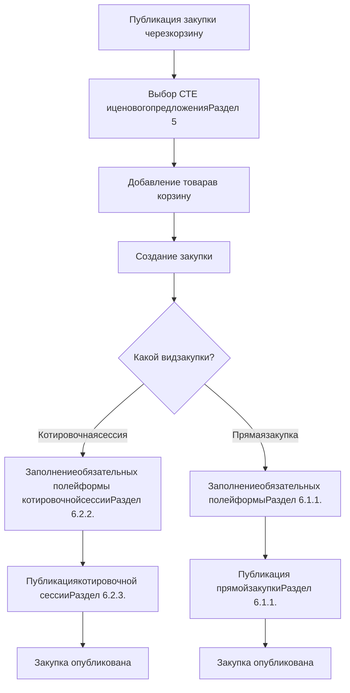
```mermaid
graph TD
    A["Публикация закупки черезкорзину"] --> B["Выбор СТЕ иценовогопредложенияРаздел 5"]
    B --> C["Добавление товарав корзину"]
    C --> D["Создание закупки"]
    D --> E{"Какой видзакупки?"}
    E -->|Котировочнаясессия| F["Заполнениеобязательных полейформы котировочнойсессииРаздел 6.2.2."]
    E -->|Прямаязакупка| G["Заполнениеобязательных полейформыРаздел 6.1.1."]
    F --> H["Публикациякотировочной сессииРаздел 6.2.3."]
    G --> I["Публикация прямойзакупкиРаздел 6.1.1."]
    H --> J["Закупка опубликована"]
    I --> K["Закупка опубликована"]
```

**Рисунок 193 – Виды закупок, доступных через корзину Заказчика**

Из модального окна «Корзина» можно создать (Рисунок 193) котировочную сессию, закупку по потребностям или заявку на прямую закупку по всем офертам, добавленным пользователем в корзину, нажав кнопку «Создать закупку» (Рисунок 192). Чтобы создать Котировочную сессию или заявку только по некоторым офертам из корзины, необходимо

---

118

перейти в раздел «Моя корзина» (Рисунок 194) нажав на кнопку «Перейти в корзину» (Рисунок 192), после чего выбрать интересующие предложения поставщиков, заполнив чек-бокс (Рисунок 194 (1)), и нажать кнопку «Создать закупку» (Рисунок 194 (2)).

Рисунок 194 – Раздел «Моя корзина»

**Рисунок 194 – Раздел «Моя корзина»**

Далее, во всплывающем модальном окне необходимо выбрать тип закупки и нажать кнопку «Создать» (Рисунок 195).

Рисунок 195 – Всплывающее окно выбора типа закупки

**Рисунок 195 – Всплывающее окно выбора типа закупки**

В разделе «Моя корзина» можно посмотреть подробную информацию по каждой оферте, кликнув по ее наименованию.

Пользователь может выгрузить выбранные оферты в списке в формате excel с помощью кнопки «Выгрузить в XLS» (Рисунок 194 (3)). Чтобы выгрузить все оферты в корзине

---

119

необходимо либо выбрать все оферты, нажав кнопку «Выбрать все» (Рисунок 194 (4)), либо снять выделение со всех оферт.

---

120

# 8. Осуществление закупки

Заказчику доступны три способа осуществления закупок на Портале поставщиков (Рисунок 196):
− Формирование котировочной сессии;
− Формирование закупки по потребностям;
− Формирования прямой закупки.

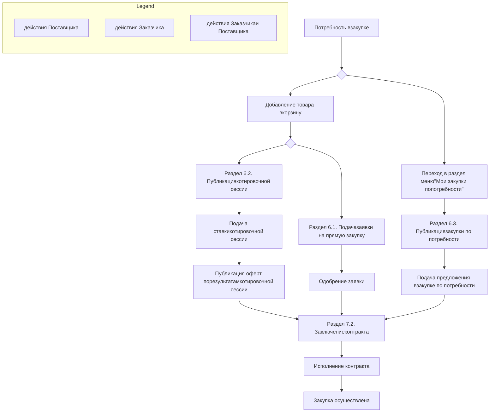
```mermaid
graph TD
    A["Потребность взакупке"] --> B{ }
    B --> C["Добавление товара вкорзину"]
    B --> D["Переход в раздел меню&quot;Мои закупки попотребности&quot;"]
    C --> E{ }
    E --> F["Раздел 6.2. Публикациякотировочной сессии"]
    E --> G["Раздел 6.1. Подачазаявки на прямую закупку"]
    D --> H["Раздел 6.3. Публикациязакупки по потребности"]
    F --> I["Подача ставкикотировочной сессии"]
    G --> J["Одобрение заявки"]
    H --> K["Подача предложения взакупке по потребности"]
    I --> L["Публикация оферт порезультатамкотировочной сессии"]
    L --> M["Раздел 7.2. Заключениеконтракта"]
    J --> M
    K --> M
    M --> N["Исполнение контракта"]
    N --> O["Закупка осуществлена"]

    subgraph Legend
    direction TB
    L1["действия Поставщика"]
    L2["действия Заказчика"]
    L3["действия Заказчикаи Поставщика"]
    end
```

**Рисунок 196 – Способы осуществления закупок на Портале поставщиков**

---

121

## 8.1.Прямая закупка

### 8.1.1. Создание заявки на прямую закупку

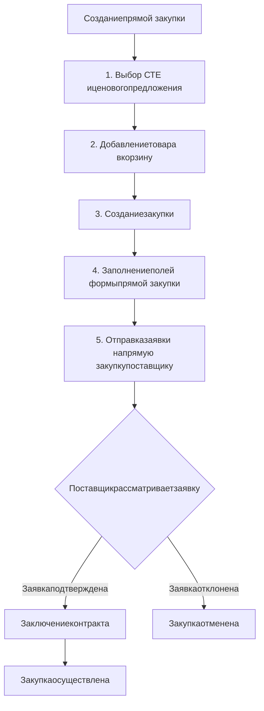
```mermaid
graph TD
    A["Созданиепрямой закупки"] --> B["1. Выбор СТЕ иценовогопредложения"]
    B --> C["2. Добавлениетовара вкорзину"]
    C --> D["3. Созданиезакупки"]
    D --> E["4. Заполнениеполей формыпрямой закупки"]
    E --> F["5. Отправказаявки напрямую закупкупоставщику"]
    F --> G{"Поставщикрассматриваетзаявку"}
    G -->|Заявкаподтверждена| H["Заключениеконтракта"]
    G -->|Заявкаотклонена| I["Закупкаотменена"]
    H --> J["Закупкаосуществлена"]
```

**Рисунок 197 – Процесс создания заявки на прямую закупку**

Для формирования заявки на прямую закупку Заказчику необходимо осуществить следующие действия (Рисунок 197):

1. Выбрать СТЕ и ценовое предложение (оферту). Поиск требуемой продукции для добавления в корзину осуществляется с помощью каталога продукции, с выбором позиций каталога.
2. Добавить выбранное ценовое предложение в корзину электронного магазина (см. Раздел 7.3). После чего необходимо нажать кнопку icon: shopping cart на верхней панели управления либо с помощью всплывающего пользовательского меню перейти в «Электронный магазин» → «Моя корзина».
3. Выбрать в корзине оферты, на которые будет формироваться заявка, указать требуемое количество каждой оферты и нажать на кнопку «Создать закупку» (Рисунок 194). Во всплывающем модальном окне необходимо выбрать тип закупки: «Прямая закупка» и нажать кнопку «Создать» (Рисунок 195).
4. После нажатия на кнопку «Прямая закупка» откроется страница создания заявки (Рисунок 198).

---

122

Заявка на прямую закупку

**Рисунок 198 – Заявка на прямую закупку**

В сформированной заявке, имеющей статус «Черновик», необходимо заполнить этапы поставки.

Для заполнения этапов поставки необходимо сначала в блоке «Состав заявки» выбрать продукцию, заполнив чек-бокс (Рисунок 198 (1)). Далее в блоке «Этапы поставки» нажать на кнопку «Добавить» (Рисунок 198 (2)) и в открывшейся форме «Сведения о поставке» внести сведения (Рисунок 199):

* Период поставки с момента заключения контракта (дней);
* Получатель;
* Место поставки.

---

123

При нажатии на кнопку «Он же покупатель» (Рисунок 199) поле «Получатель» заполнится данными из личного кабинета заказчика.

Форма ввода сведений о поставке

**Рисунок 199 – Форма ввода сведений о поставке**

В сведения о поставке требуется добавить продукцию с помощью кнопки «Добавить» (Рисунок 199) и в окне выбора позиций, выбрать необходимую продукцию для этапа поставки (Рисунок 200):

Добавление продукции в сведения о поставке

**Рисунок 200 – Добавление продукции в сведения о поставке**

После заполнения сведений о поставке и добавления продукции необходимо нажать на кнопку «Сохранить» (Рисунок 199) для сохранения сведений о поставке.

В случае выбора основания заключения контракта, соответствующего основанию из план-графика, импортированного из ЕИС, на странице создания закупки отображается «Остаток лимита на текущий год» (подробнее в разделе 6.3). Если НМЦК закупки превысит остаток лимита, пользователь получит предупреждающее сообщение (Рисунок 201).

---

124

Предупреждающее сообщение, о том, что НМЦК закупки превышает остаток лимита

**Рисунок 201 – Предупреждающее сообщение, о том, что НМЦК закупки превышает остаток лимита**

Для обновления бюджета из ЕИС реализована гиперссылка для перехода в соответствующий раздел «Плановый бюджет особых закупок».

5. После заполнения сведений и принятия условия пользовательского соглашения, заявка направляется поставщику по нажатию на кнопку «Направить поставщику» (Рисунок 198).

После направления заявки Поставщику, ее статус изменяется с «Черновик» на «Новая» и открывается модальное окно подтверждения отправки заявки поставщику (Рисунок 202):

Окно подтверждения отправки заявки поставщику

**Рисунок 202 – Окно подтверждения отправки заявки поставщику**

6. Направленная заявка рассматривается Поставщиком, в случае ее подтверждения статус с «Новая» изменяется на «Подтверждена». Заказчик может запускать процедуру заключения контракта. В случае отклонения заявки поставщиком статус изменится на «Отклонена поставщиком».

## 8.1.2. Сервис коммуникации между поставщиком и заказчиком

После отправки заявки поставщику у заказчика есть возможность инициировать чат по кнопке «Начать обсуждение» (Рисунок 203).

---

125

Заявка

**Рисунок 203 – Кнопка «Начать обсуждение» для инициализации чата**

После нажатия на кнопку для заказчика откроется интерфейс чата в новой вкладке (Рисунок 204).

Интерфейс чата

**Рисунок 204 – Интерфейс чата**

Инициализировать чат может и поставщик и заказчик. В случае, если одного из пользователей нет в сети, ему придет уведомление в ЛК.

### 8.1.3. Мои заявки на прямую закупку

Свои заявки на прямую закупку Заказчик может отслеживать в разделе «Электронный магазин» → «Мои заявки» с помощью всплывающего пользовательского меню (Рисунок 205):

---

126

Расположение раздела «Мои заявки» в Личном кабинете

**Рисунок 205 – Расположение раздела «Мои заявки» в Личном кабинете**

Если пользователь выбирает заявку со статусом **«Черновик»**, то ему становятся доступны кнопки **«Направить поставщику»** и **«Удалить»**, если пользователь выбирает заявки с другими статусами, то становится доступна кнопка **«Создать новую на основании заявки»**, при нажатии на которую открывается страница создания заявки с уже заполненными полями.

## 8.2.Котировочные сессии

На Портале поставщиков создание котировочной сессии доступно двумя способами: через корзину или через реестр «Мои котировочные сессии» (Рисунок 206).

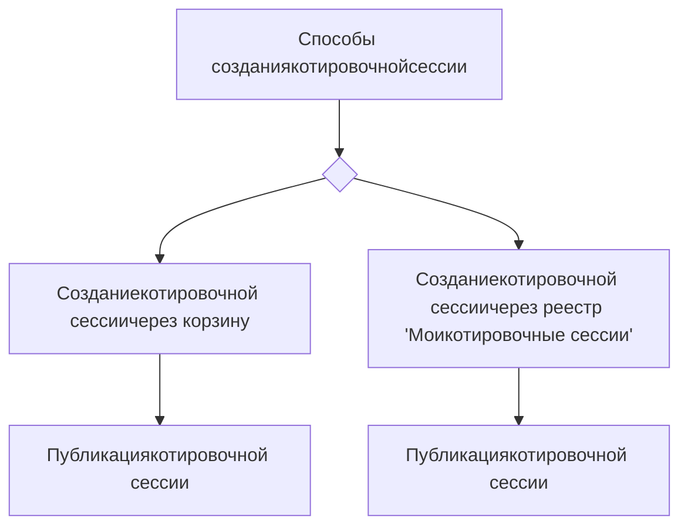
```mermaid
graph TD
    A["Способы созданиякотировочнойсессии"]
    B{" "}
    C["Созданиекотировочной сессиичерез корзину"]
    D["Созданиекотировочной сессиичерез реестр 'Моикотировочные сессии'"]
    E["Публикациякотировочной сессии"]
    F["Публикациякотировочной сессии"]

    A --> B
    B --> C
    B --> D
    C --> E
    D --> F
```

**Рисунок 206 – Способы публикации котировочной сессии**

---

127

**Срок проведения:** котировочная сессии может длиться 3, 6 или 24 часа (без учета переторжки<sup>4</sup>) **с момента публикации** (срок продлевается с учетом выходных/праздничных дней).

Заказчики из Перми могут провести котировочную сессию длительностью 3 или 6 часов строго с 9:00 до 18:00. Если котировочная сессия будет создана раньше 9:00 или позже 18:00, то она будет сохранена, но не опубликована на Портале. С наступлением рабочего времени котировочную сессию можно будет опубликовать.

Первое предложение о цене формируется поставщиком с учетом начальной цены предложения. **Шаг котировочной сессии устанавливается в размере 0,5% - 1%** от начальной цены контракта (договора).

Поставщикам, зарегистрированным на Портале, обеспечена возможность делать ставки в котировочной сессии. Данная возможность доступна только авторизованным пользователям.
В случае если до конца котировочной сессии осталось менее 5 (пяти) минут, и участником подано предложение о цене, котировочная сессия переходит в режим переторжки. Время окончания котировочной сессии отображается в карточке котировочной сессии.

• **Победителем признается** участник котировочной сессии, сделавший последнее **(наименьшее) предложение о цене** до момента окончания срока проведения котировочной сессии.

При наступлении срока окончания котировочной сессии автоматически выполняются следующие действия:
− **Блокируется** возможность сделать ставку;
− **Отключается счетчик** времени;
− Котировочная сессия переходит в статус:
а) **«Проведена»** – если сделана хотя бы одна ставка;
б) **«Не состоялась»** – если не сделано ни одной ставки;
− В карточке котировочной сессии **отображаются сведения о победителе** в котировочной сессии;
− Победитель котировочной сессии в течение 24 часов (срок продлевается с учетом выходных/праздничных дней/технических работ) обязан сформировать и опубликовать оферты по результатам котировочной сессии.

Если поставщик не успел в указанные сроки опубликовать оферты, статус победителя и возможность подписания и размещения оферты переходят к участнику, сделавшему предпоследнее предложение о цене.

Если ни один из поставщиков-победителей котировочной сессии не опубликовал оферты в отведенное для этого время, статус котировочной сессии с **«Проведена»** изменяется на **«Не состоялась»**.

## 8.2.1. Создание котировочных сессий через реестр «Мои котировочные сессии»

Для того, чтобы создать котировочную сессию через реестр «Мои котировочные сессии», необходимо осуществить следующие действия (Рисунок 207):

***

<sup>4</sup> Переторжка – процедура продления времени проведения котировочной сессии в случае, если участником сделан ценовой шаг в последние пять минут проведения котировочной сессии, при которой участникам котировочной сессии предоставляется пять минут на объявление их ставок (в соответствии с «Регламент информационного взаимодействия с использованием автоматизированной информационной системы «Портал поставщиков»» от 10.01.22).

---

128

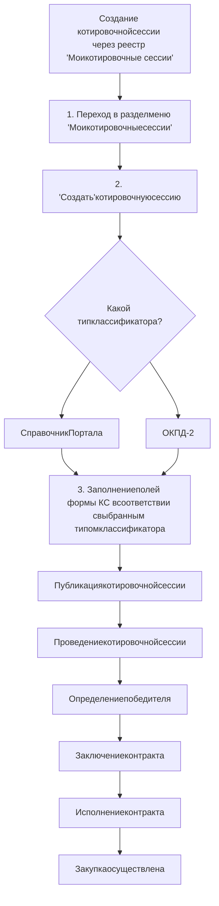
```mermaid
graph TD
    A["Создание котировочнойсессии через реестр 'Моикотировочные сессии'"] --> B["1. Переход в разделменю 'Моикотировочныесессии'"]
    B --> C["2. 'Создать'котировочнуюсессию"]
    C --> D{"Какой типклассификатора?"}
    D --> E["СправочникПортала"]
    D --> F["ОКПД-2"]
    E --> G["3. Заполнениеполей формы КС всоответствии свыбранным типомклассификатора"]
    F --> G
    G --> H["Публикациякотировочнойсессии"]
    H --> I["Проведениекотировочнойсессии"]
    I --> J["Определениепобедителя"]
    J --> K["Заключениеконтракта"]
    K --> L["Исполнениеконтракта"]
    L --> M["Закупкаосуществлена"]
```

**Рисунок 207 – Публикация котировочной сессии через раздел меню «Мои котировочные сессии»**

1. Перейти в раздел **«Мои котировочные сессии»** с помощью всплывающего меню пользователя, нажав кнопку **«Электронный магазин»** → **«Мои котировочные сессии»** (Рисунок 208), где можно создать Котировочную сессию с помощью соответствующей кнопки (Рисунок 209).

---

129

Всплывающее пользовательское меню. Переход к котировочным сессиям пользователя

**Рисунок 208 – Всплывающее пользовательское меню. Переход к котировочным сессиям пользователя**

Кнопка «Создать» в реестре котировочных сессий

**Рисунок 209 – Кнопка «Создать» в реестре котировочных сессий**

2. После нажатия кнопки **«Создать»** в реестре котировочных сессий система автоматически откроет страницу создания котировочной сессии (Рисунок 210).

Создание котировочной сессии

**Рисунок 210 – Создание котировочной сессии**

---

130

3. На странице создания котировочной сессии необходимо заполнить следующие поля (Таблица 13).

| Наименование поля                                 | Обязательность поля                                                                         | Пояснение к заполнению поля                                                                                                                                                                         |
| ------------------------------------------------- | ------------------------------------------------------------------------------------------- | --------------------------------------------------------------------------------------------------------------------------------------------------------------------------------------------------- |
| Тип классификатора                                | Да                                                                                          | Выбор из выпадающего списка: Справочник Портала поставщиков; ОКПД2; Каталог СТЕ.                                                                                                                    |
| Наименование закупки                              | Да                                                                                          | Ввод с клавиатуры                                                                                                                                                                                   |
| Совместная закупка                                | Нет                                                                                         | Возможность выбора признака для организации КС с несколькими заказчиками. (доступен в случае выбора типа классификатора «Справочник Портала поставщиков»)                                           |
| Регион поставки                                   | Да                                                                                          | Выбор региона из справочника                                                                                                                                                                        |
| Адрес поставки                                    | Да                                                                                          | Ввод с клавиатуры                                                                                                                                                                                   |
| Ввод поставки для каждого элемента спецификации   | Нет                                                                                         | Возможность выбора признака для указания данных о поставке для каждой позиции спецификации                                                                                                          |
| Формат ввода сроков поставки                      | Да                                                                                          | Выбор одного из форматов ввода сроков поставки:<br/>• Количество дней на поставку с момента заключения контракта<br/>• Дата поставки товаров, выполнения работ или услуг                            |
| Сроки поставки                                    | Да (доступен при выборе опции «Количество дней на поставку с момента заключения контракта») | Ввод значения в днях                                                                                                                                                                                |
| Даты поставки товаров, выполнения работ или услуг | Да (доступен при выборе опции «Дата поставки товаров, выполнения работ или услуг»)          | Выбор даты с помощью встроенного календаря                                                                                                                                                          |
| Шаг КС                                            | Да                                                                                          | В %                                                                                                                                                                                                 |
| НМЦК                                              | Да                                                                                          | Рассчитывается автоматически после заполнения блока «Спецификация»                                                                                                                                  |
| Время проведения котировочной сессии              | Да                                                                                          | Выбор одного из вариантов:<br/>• 3 часа, если котировочная сессия создаётся с 9:00 до 15:00;<br/>• 6 часов, если котировочная сессия создаётся с 9:00 до 12:00;<br/>• 24 часа можно выбрать всегда. |
| Закон, в соответствии с которым будет             | Да                                                                                          | Устанавливается автоматически из профиля компании                                                                                                                                                   |


---

131

| Наименование поля                                         | Обязательность поля               | Пояснение к заполнению поля      |
| --------------------------------------------------------- | --------------------------------- | -------------------------------- |
| размещена котировочная сессия                             |                                   |                                  |
| Способ размещения закупки (заказа)/определение поставщика | Да (в случае выбора закона 44-ФЗ) | Устанавливается автоматически    |
| Основание заключения контракта                            | Да (в случае выбора закона 44-ФЗ) | Выбор основания из справочника   |
| Закупка с неизвестным объемом                             | Нет                               | Возможность установить признак   |
| Требуется обеспечение контракта                           | Нет                               | Возможность установить признак   |
| Проект контракта                                          | Да                                | Возможность прикрепить документы |
| Техническое задание                                       | Да                                | Возможность прикрепить документы |
| Прочие документы                                          | Нет                               | Возможность прикрепить документы |


Заполнить блок **«Спецификация»** (Рисунок 211) (описание характеристик товара), который содержит следующие поля (Таблица 14).

**Таблица 14 – Поля блока «Спецификация» формы создания котировочный сессии**

| Наименование поля         | Обязательность поля                                                       | Пояснение к заполнению поля                                                                                                                                                                                                                                                    |
| ------------------------- | ------------------------------------------------------------------------- | ------------------------------------------------------------------------------------------------------------------------------------------------------------------------------------------------------------------------------------------------------------------------------ |
| Тип единицы измерения     | Да                                                                        | Выбор из справочника. Единицы измерения выделены в отдельные подгруппы, называемые типами единиц измерения. Для того чтобы выбрать необходимую единицу измерения продукции, сначала нужно выбрать соответствующий тип единицы измерения                                        |
| Единица измерения         | Да                                                                        | Выбор из справочника                                                                                                                                                                                                                                                           |
| Количество                | Да                                                                        | Ввод цифр с клавиатуры                                                                                                                                                                                                                                                         |
| Начальная цена за единицу | Да                                                                        | Ввод цифр с клавиатуры                                                                                                                                                                                                                                                         |
| Вид продукции             | Да (в случае выбора типа классификатора «Справочник Портала поставщиков») | Для заполнения поля необходимо нажать на кнопку «Изменить вид продукции» (Рисунок 211) и выбрать вид продукции из справочника Портала в открывшемся модальном окне (Рисунок 212). После выбора вида продукции откроется окно заполнения характеристик продукции (Рисунок 213). |
| Наименование продукции    | Нет                                                                       | Ввод с клавиатуры (доступно в случае выбора типа классификатора «ОКПД2» или «Каталог СТЕ»)                                                                                                                                                                                     |
| ОКПД2                     | Да (в случае выбора типа                                                  | Выбор из справочника (Рисунок 214).                                                                                                                                                                                                                                            |


---

132

| Наименование поля                        | Обязательность поля классификатора «ОКПД2»                             | Пояснение к заполнению поля                                                                                                    |
| ---------------------------------------- | ---------------------------------------------------------------------- | ------------------------------------------------------------------------------------------------------------------------------ |
| «Страна происхождения не имеет значения» | Да                                                                     | Признак установлен по умолчанию. При снятии признака становится доступно к заполнению обязательное поле «Страна происхождения» |
| Страна происхождения                     | Да (в случае снятия признака «Страна происхождения не имеет значения») | Выбор значения из выпадающего списка с подсказками. Если значение в поле введено вручную, оно не пройдет проверку              |
| Тип позиции                              | Да (если тип классификатора ОКПД2)                                     | Необходимо выбрать подходящий тип позиции товар/работа/услуга к продукции. По умолчанию выбран товар                           |


Блок спецификация в случае выбора типа классификатора «Справочник Портала поставщиков»

**Рисунок 211 – Блок спецификация в случае выбора типа классификатора «Справочник Портала поставщиков»**

Справочник видов продукции

**Рисунок 212 – Справочник видов продукции**

После выбора вида продукции откроется окно заполнения характеристик продукции (Рисунок 213).

---

133

Выбор характеристик

**Рисунок 213 – Выбор характеристик товаров**

Справочник ОКПД2

**Рисунок 214 – Справочник ОКПД2**

После заполнения позиций спецификации, если ранее был выбран признак «Совместная закупка» (подробнее в разделе 8.2.3) или «Ввод поставки для каждого элемента спецификации», необходимо заполнить поля на вкладке «Поставка» (Рисунок 215, Таблица 15).

---

134

**Таблица 15 - Поля вкладки «Поставка» формы создания котировочный сессии**

| Наименование поля                                 | Обязательность поля                                                                         | Пояснение к заполнению поля                                                                                                                                              |
| ------------------------------------------------- | ------------------------------------------------------------------------------------------- | ------------------------------------------------------------------------------------------------------------------------------------------------------------------------ |
| Адрес поставки                                    | Да                                                                                          | Ввод с клавиатуры                                                                                                                                                        |
| Количество                                        | Да                                                                                          | Ввод цифр с клавиатуры                                                                                                                                                   |
| Формат ввода сроков поставки                      | Да                                                                                          | Выбор одного из форматов ввода сроков поставки:<br/>• Количество дней на поставку с момента заключения контракта<br/>• Дата поставки товаров, выполнения работ или услуг |
| Сроки поставки                                    | Да (доступен при выборе опции «Количество дней на поставку с момента заключения контракта») | Ввод значения в днях                                                                                                                                                     |
| Даты поставки товаров, выполнения работ или услуг | Да (доступен при выборе опции «Дата поставки товаров, выполнения работ или услуг»)          | Выбор даты с помощью встроенного календаря                                                                                                                               |


Вкладка «Поставка» при выбранном признаке «Ввод поставки для каждого элемента спецификации»

**Рисунок 215 – Вкладка «Поставка» при выбранном признаке «Ввод поставки для каждого элемента спецификации»**

В случае выбора основания заключения контракта, соответствующего основанию из план-графика, импортированного из ЕИС, на странице создания закупки отображается «Остаток лимита на текущий год» (подробнее в разделе 6.3). Если НМЦК закупки превысит остаток лимита, пользователь получит предупреждающее сообщение (Рисунок 216).

---

135

Предупреждающее сообщение, о том, что НМЦК закупки превышает остаток лимита

**Рисунок 216 – Предупреждающее сообщение, о том, что НМЦК закупки превышает**
**остаток лимита**

Для обновления бюджета из ЕИС реализована гиперссылка для перехода в соответствующий раздел «Плановый бюджет особых закупок».

---

136

### 8.2.2. Создание котировочных сессий через корзину

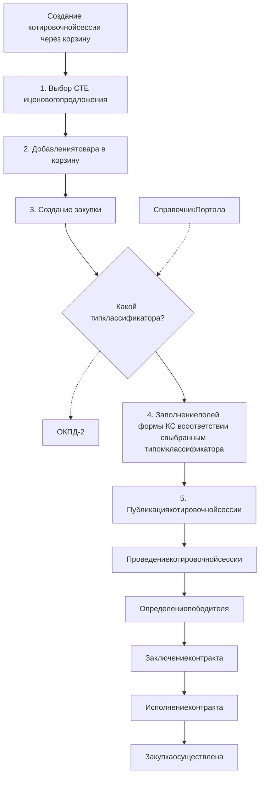
```mermaid
graph TD
    A["Создание котировочнойсессии через корзину"] --> B["1. Выбор СТЕ иценовогопредложения"]
    B --> C["2. Добавлениятовара в корзину"]
    C --> D["3. Создание закупки"]
    D --> E{"Какой типклассификатора?"}
    F["СправочникПортала"] -.-> E
    E -.-> G["ОКПД-2"]
    E --> H["4. Заполнениеполей формы КС всоответствии свыбранным типомклассификатора"]
    H --> I["5. Публикациякотировочнойсессии"]
    I --> J["Проведениекотировочнойсессии"]
    J --> K["Определениепобедителя"]
    K --> L["Заключениеконтракта"]
    L --> M["Исполнениеконтракта"]
    M --> N["Закупкаосуществлена"]
```

**Рисунок 217 – Осуществление закупки путем публикации котировочной сессии через корзину**

Создать котировочную сессию можно на основании товаров, добавленных в корзину пользователя. Для этого необходимо осуществить следующие действия (Рисунок 217):
1. Выбрать СТЕ и ценовые предложения по ним.
2. Добавить выбранные ценовые предложения (оферты) в корзину.
3. Выбрать в корзине те оферты, на которые будет формироваться заявка, указать требуемое количество каждой оферты и нажать на кнопку «Создать закупку» (Рисунок 194). Во всплывающем модальном окне необходимо выбрать тип закупки: Котировочная сессия и нажать кнопку «Создать» (Рисунок 195).
4. Далее, откроется страница создания Котировочной сессии (Рисунок 210), где необходимо заполнить обязательные поля формы (подробнее о заполнение полей формы в

---

137

разделе 8.2.1). При создании котировочной сессии через корзину поля блока «Спецификация» на форме будут заполнены автоматически, на основании выбранной оферты. Поля блока доступны для редактирования.
5. Опубликовать котировочную сессию.

## 8.2.3. **Организация совместной котировочной сессии**
Для организации **совместной** **закупки** необходимо установить признак «**Совместная** **закупка**» на форме создания котировочной сессии (Рисунок 218). Признак будет доступен только при выборе типа классификатора «Справочник Портала поставщиков».

```description
Предупреждение: Начальная максимальная цена по совместной котировочной сессии не может превышать 3 млн. рублей. Стоимость всех спецификаций по одному заказчику, участвующему в совместной закупке, не должна превышать 600 тыс. рублей.
```

Рисунок 218 – Страница создания совместной котировочной сессии

**Рисунок 218 – Страница создания совместной котировочной сессии**

Порядок действий при работе с совместной закупкой следующий:
1. Установить признак «**Совместная** **закупка**»;
2. Заполнить информацию на форме котировочной сессии;
3. Заполнить спецификацию котировочной сессии, указав количество для всех заказчиков;

---

138

Страница создания совместной котировочной сессии

**Рисунок 219 – Страница создания совместной котировочной сессии**

4. На вкладке «Поставка» для каждой позиции спецификации выбрать заказчиков, с которыми планируется провести совместную котировочную сессию;
5. Для каждого заказчика указать количество по позициям спецификации, адрес и условия поставки (Рисунок 220);

Вкладка «Поставка» для совместной котировочной сессии

**Рисунок 220 – Вкладка «Поставка» для совместной котировочной сессии**

6. Нажать кнопку «Отправить на подтверждение».
7. Дождаться подтверждения или отказа от участия в совместной котировочной сессии от остальных заказчиков (см. раздел 8.2.7).

В случае **отказа** одного или нескольких заказчиков-участников от участия в совместной закупке заказчику-организатору необходимо скорректировать общее количество продукции в спецификации или добавить участников в закупку. Количество в спецификации должно быть равно сумме всех поставок.

8. Опубликовать котировочную сессию.
9. По итогу проведенной котировочной сессии каждый заказчик получит уведомление о победителе КС в личном кабинете.

---

139

10. Каждый заказчик формирует проект контракта с победителем в части спецификации, указанной в КС<sup>5</sup>.

## 8.2.4. Публикация котировочной сессии
После того, как все поля котировочной сессии будут заполнены, необходимо нажать кнопку «Опубликовать» в верхней части страницы (Рисунок 210). Необходимо подтвердить опубликование котировочной сессии для приёма заявок (Рисунок 221).

Подтверждение создания котировочной сессии

**Рисунок 221 – Подтверждение создания котировочной сессии**

После закрытия модального окна осуществляется автоматический переход на страницу котировочной сессии со статусом **«Активная»** (Рисунок 222).
На странице котировочной сессии показана информация:
− Номер котировочной сессии;
− Закупаемая продукция;
− Информация о заказчике;
− Закон, в соответствии с которых происходит размещение;
− Даты проведения котировочной сессии;
− Основание для заключения;
− Документы котировочной сессии;
− Начальная цена;
− Текущая цена;
− Блок «Спецификация» (описание характеристик товара);
− Блок «График поставки» (информация об этапах поставки, адресе поставки и количестве дней на поставку).

_________________
<sup>5</sup> Для соблюдения норм 44-ФЗ "О контрактной системе в сфере закупок товаров, работ, услуг для обеспечения государственных и муниципальных нужд" итоговый контракт должен быть заключен с каждым заказчиком отдельно в пределах заявленного объема спецификации в котировочной сессии.

---

140

```description
Скриншот страницы активной котировочной сессии с информацией о закупке, заказчике, начальной и текущей цене, а также таймером обратного отсчета.
```

**Рисунок 222 – Страница активной котировочной сессии**

### 8.2.5. Определение победителя
После завершения котировочной сессии заказчику будет направлено уведомление (Рисунок 223) с информацией о победителе котировочной сессии и ссылкой на котировочную сессию в статусе **«Проведена»** (Рисунок 224).

```description
Скриншот раздела «Уведомления» с перечнем событий и деталями выбранного уведомления о победителе котировочной сессии.
```

**Рисунок 223 – Раздел «Уведомления»**

---

141

Вернуться в реестр котировочных сессий

Котировочная сессия 8914514 ПРОВЕДЕНА

Прием ставок закончен
18 декабря 2020 11:09:24

Заказчик
ПАО «Часть»

Начальная цена
312,00 ₽

Снижение в ходе сессии
↓ 1,56 ₽ 0,50%

Заключение происходит в соответствии с законом
44-ФЗ

Основание для заключения
п. 4 ч. 1 ст. 93 Закупка объемом до 600 тысяч рублей

Даты проведения
с 17.12.2020 21:53:48 по 18.12.2020 11:09:24

Победитель определен
Победителем стал ООО «Сущность»

Документы
EAIST_JB_3107_Электронное_заключение_проектов_контракта_между_ЕАИСТ.docx

Последняя цена сессии
310,44 ₽

Создать копию КС

СПЕЦИФИКАЦИИ 1 ГРАФИК ПОСТАВКИ 1 ХОД СЕССИИ 1

Вишня
Количество: 4 кг
Цена за ед.: 78 ₽
Общая стоимость: 312 ₽

Скрыть подробную информацию

Код ОКПД2: 01.24.24.000
Наименование ОКПД2: Вишня
Страна происхождения: КИТАЙ
Код КПГЗ: 01.01.04.03
Наименование КПГЗ: ВИШНЯ

Характеристики

| Наименование  | Значение         |
| ------------- | ---------------- |
| Вид продукции | Товары           |
| Вид товаров   | Пищевые продукты |


**Рисунок 224 – Проведенная котировочная сессия**

Для формирования контракта победитель должен в течение одного рабочего дня сформировать оферту. Оферта будет доступна на странице проведенной котировочной сессии (Рисунок 225).

---

142

Котировочная сессия 253386

**Рисунок 225 – Котировочная сессия с опубликованной офертой**

На основе сформированной оферты автоматически формируется проект контракта со статусом **«Ввод сведений»** (о работе с контрактами можно подробнее узнать в разделе 7), который необходимо направить поставщику на подписание.

### 8.2.6. Мои котировочные сессии

В раздел **«Мои котировочные сессии»** можно перейти с помощью всплывающего меню пользователя, где необходимо нажать **«Электронный магазин»** → **«Мои котировочные сессии»** (Рисунок 208).

В реестре котировочных сессий отображаются карточки котировочных сессий, которые создавались заказчиком (Рисунок 226). На карточке котировочной сессии указывается:

* Наименование котировочной сессии;
* Статус;
* Номер котировочной сессии;
* Заказчик;
* Дата проведения котировочной сессии;
* Начальная цена;
* Последняя ставка;
* Количество сделанных ставок в котировочной сессии;
* Процент, на который снизилась начальная ставка.

Конкретную котировочную сессию можно найти с помощью фильтров, расположенных справа от реестра (Рисунок 226). Доступные пользователю фильтры:

* Статусы котировочных сессий;
* Вид продукции;
* Регион деятельности заказчика;

---

143

− Номер котировочной сессии;
− Наименование котировочной сессии;
− Текущая цена (фильтр по полю «Последняя ставка»);
− Начальная цена котировочной сессии;
− Дата начала котировочной сессии;
− Дата окончания котировочной сессии;
− Наименование заказчика;
− ИНН заказчика;
− Законы, в соответствии с которыми осуществляется/осуществлялась закупка;
− Основание заключения контракта;
− Способ размещения закупки (заказа)/определение поставщика.

Список котировочных сессий в соответствии с выбранными фильтрами можно выгрузить в формате excel с помощью кнопки Выгрузить в icon: excel file.

screenshot: Раздел «Мои котировочные сессии»

**Рисунок 226 – Раздел «Мои котировочные сессии»**

**8.2.7. Подтверждение (или отказ от) участия в совместной котировочной сессии**

При добавлении организации пользователя участником в совместную котировочную сессию пользователю поступает соответствующее уведомление. Для просмотра уведомления необходимо нажать на пиктограмму колокольчик icon: bell в верхней части страницы или в меню пользователя в разделе «Уведомления» выбрать один из подразделов: «Все» или «Новые».

---

144

Скриншот меню личного кабинета с выделенным пунктом «Уведомления»

**Рисунок 227 – Переход к уведомлению о приглашении участвовать с совместной котировочной сессии**

В нижней части уведомления расположена кнопка «Перейти к котировочной сессии», при нажатии на кнопку происходит переход к карточке котировочной сессии.

Скриншот интерфейса уведомлений с кнопкой «Перейти к котировочной сессии»

**Рисунок 228 – Кнопка «Перейти к котировочной сессии»**

В карточке совместной котировочной сессии в статусе «Ожидание подтверждения» участникам доступны следующие действия:

1. Подтверждение участия – при нажатии кнопки «Подтвердить» (Рисунок 229, 1) участник соглашается участвовать в совместной котировочной сессии.
2. Отказ от участия – при нажатии кнопки «Отказаться» (Рисунок 229, 2) участник исключается из числа заказчиков по котировочной сессии, отказавшемуся участнику становится недоступен чат совместной КС (см. раздел 8.2.8).

> Для внесения корректировок в условия закупки не требуется отказываться от участия, необходимо написать в чат совместной КС организатору закупки – карточка котировочной сессии доступна для редактирования организатору.

3. Переход к обсуждению – при нажатии кнопки «Перейти к обсуждению» (Рисунок 229, 3) происходит переход к чату котировочной сессии (см. раздел 8.2.8).

---

145

Карточка котировочной сессии в статусе «Ожидание подтверждения»

**Рисунок 229 – Карточка котировочной сессии в статусе «Ожидание подтверждения»**

**8.2.8. Обсуждение в совместной котировочной сессии**

Обсуждение деталей совместной котировочной сессии (КС) доступно в чате по совместной КС (Рисунок 231). Переход к чату совместной КС доступен для организатора из формы создания котировочной сессии при нажатии кнопки «Начать обсуждение» (Рисунок 230), для участника – из карточки котировочной сессии при нажатии кнопки «Перейти к обсуждению» (Рисунок 229, 3).

**Чат по совместной КС** доступен организатору, участникам чье подтверждение ещё ожидается и подтвердившим свое участие в совместной закупке. В случае отказа от участия в совместной закупке чат становится недоступен.

Форма создания котировочной сессии, кнопка «Начать обсуждение»

**Рисунок 230 – Форма создания котировочной сессии, кнопка «Начать обсуждение»**

---

146

Chat interface for joint quotation session

**Рисунок 231 – Чат по совместной котировочной сессии**

При поступлении новых сообщений в чате пользователю формируются уведомления (Рисунок 232).

Notification interface for new chat messages

**Рисунок 232 – Уведомление о новом сообщении в чате обсуждения совместной КС**

**8.2.9. Просмотр подтверждений или отказов участников закупки организаторомзакупки**

Для просмотра ответов участников совместной закупке необходимо нажать на ссылку «Посмотреть список заказчиков совместной закупки» (Рисунок 233), после чего откроется модальное окно «Заказчики совместной закупки» (Рисунок 234).

---

147

Котировочная сессия 8917113 в статусе «Ожидание подтверждения»

**Рисунок 233 – Ссылка «Посмотреть список заказчиков совместной закупки» в карточке котировочной сессии в статусе «Ожидание подтверждения»**

Модальное окно «Заказчики совместной закупки»

**Рисунок 234 – Модальное окно «Заказчики совместной закупки»**

В модальном окне «Заказчики совместной закупки» отображаются пиктограммы, иллюстрирующие статус ответа участника закупки:

* Зеленая галочка – Заказчик подтвердил участие;
* Песочные часы – Одна или несколько позиций ожидают подтверждения заказчиком;
* Красный крестик – Заказчик отказался от участия.

---

148

## 8.3.**Закупки по потребностям**

### 8.3.1. **Создание закупки по потребностям**


```mermaid
graph LR
    A["Созданиезакупки попотребности"] --> B["1. Переход в разделменю 'Мои закупкипо потребностям'"]
    B --> C["2. Созданиезакупки"]
    C --> D["3. Заполнениеобязательныхполей формы"]
    D --> E["4. Публикациязакупки попотребности"]
    E --> F["Проведениезакупки попотребности"]
    F --> G["Определениепобедителя"]
    G --> H["Заключениеконтракта"]
    H --> I["Исполнениеконтракта"]
    I --> J["Закупкаосуществлена"]
```

**Рисунок 235 – Осуществление закупки по потребности**

Для формирования закупки по потребностям необходимо осуществить следующие действия (Рисунок 235):

1. Перейти на страницу **«Мои закупки по потребностям»** (**«Электронный магазин»** → **«Мои закупки по потребностям»** во всплывающем пользовательском меню) (Рисунок 236).

Скриншот меню личного кабинета с выделенным пунктом «Электронный магазин» и «Мои закупки по потребностям»

**Рисунок 236 – Раздел «Мои закупки по потребностям»**

2. Нажать кнопку **«Новая потребность»** (Рисунок 237) в реестре **«Мои закупки по потребностям»**.

---

149

Интерфейс реестра «Мои закупки по потребностям» с фильтрами и списком закупок

**Рисунок 237 – Реестр «Мои закупки по потребностям»**

3. На странице **«Создание закупки по потребности»** заполнить общие поля: «Наименование», «Дата окончания приема предложений» и нажать на кнопку «Создать потребность».

Форма создания закупки по потребности с полями «Наименование», «Дата окончания приема предложений» и «Заказчик»

**Рисунок 238 – Страница «Создание закупки по потребности»**

4. В открывшейся странице закупки по потребностям нажать кнопку «Доступные действия» и нажать на «Редактировать».

---

150

Страница закупки по потребностям

**Рисунок 239 – Страница закупки по потребностям**

5. Заполнить **«Основную информацию»** (Таблица 16, Рисунок 240) и поля в блоке **«Поставка»** (Таблица 17, Рисунок 241) и **«Спецификация»** (Таблица 18, Рисунок 243):

| \*\*Наименование поля\*\*                                 | \*\*Обяз-стьполя\*\*              | \*\*Пояснение к заполнению поля\*\*               |
| --------------------------------------------------------- | --------------------------------- | ------------------------------------------------- |
| Заказчик                                                  | Да                                | Поле заполняется автоматически                    |
| Наименование закупки                                      | Да                                | Текстовое поле                                    |
| ФИО контактного лица                                      | Да                                | Ввод с клавиатуры                                 |
| Телефон контактного лица                                  | Да                                | Ввод цифр с клавиатуры                            |
| Адрес электронной почты контактного лица                  | Да                                | Ввод с клавиатуры                                 |
| Размещение в соответствии с законом                       | Да                                | Устанавливается автоматически из профиля компании |
| Способ размещения закупки (заказа)/определение поставщика | Да (в случае выбора закона 44-ФЗ) | Устанавливается автоматически                     |
| Основание заключения                                      | Да (в случае выбора закона 44-ФЗ) | Выбор основания из справочника                    |
| Указать НМЦК                                              | Нет                               | По умолчанию установлен признак «Указать НМЦК»    |


---

151

| \*\*Наименование поля\*\*               | \*\*Обяз-стьполя\*\* | \*\*Пояснение к заполнению поля\*\*                                                                                                  |
| --------------------------------------- | -------------------- | ------------------------------------------------------------------------------------------------------------------------------------ |
| Размер НМЦК                             | Да                   | Отображается в случае установки признака «Указать НМЦК». Значение рассчитывается автоматически после заполнения блока «Спецификация» |
| Признак «Закупка с неизвестным объемом» | Нет                  | Возможность установить признак. Подробнее в разделе 8.4                                                                              |


Рисунок 240 – Страница «Создание потребности»

**Рисунок 240 – Страница «Создание потребности»**

В блоке **Поставка** доступен ввод сведений о поставке (Рисунок 241)

**Таблица 17 – Поля блока «Поставка» формы создания закупки по потребности**

| \*\*Наименование поля\*\*                 | \*\*Обяз-сть\*\* | \*\*Пояснение к заполнению поля\*\*                                                                      |
| ----------------------------------------- | ---------------- | -------------------------------------------------------------------------------------------------------- |
| Регион                                    | Да               | Устанавливается автоматически                                                                            |
| Дата и время окончания приема предложений | Да               | Выбор даты и времени окончания приема предложений с помощью встроенного календаря и часов                |
| Дата и время начала приема предложений    | Да               | Выбор даты и времени публикации потребности с помощью встроенного календаря и часов<br/>См. раздел 8.3.3 |
| Плановая дата заключения контракта        | Да               | Выбор даты планового заключения контракта с помощью встроенного календаря                                |
| Адрес поставки                            | Да               | Ввод с клавиатуры                                                                                        |
| Сроки поставки, дней                      | Да               | Ввод значения в днях                                                                                     |
| Условия оплаты                            | Да               | Ввод с клавиатуры                                                                                        |
| Дополнительная информация                 | Нет              | Ввод с клавиатуры                                                                                        |


---

152

Блок «Поставка»

**Рисунок 241 – Блок «Поставка»**

Для добавления позиции спецификации необходимо нажать на кнопку **«Добавить**
**позицию»** (Рисунок 242) в блоке **«Спецификация»**.

Блок «Спецификация»

**Рисунок 242 – Блок «Спецификация»**

Страница добавления позиции спецификации (Рисунок 243).

**Таблица 18 – Поля страницы «Добавление позиции» закупки по потребности**

| Наименование поля                                | Обязательность                                                         | Пояснение к заполнению поля                                                                                                                            |
| ------------------------------------------------ | ---------------------------------------------------------------------- | ------------------------------------------------------------------------------------------------------------------------------------------------------ |
| Наименование позиции                             | Да                                                                     | Текстовое поле                                                                                                                                         |
| СТЕ                                              | Да (если не выбрано ОКПД2)                                             | Ввод ID или наименования СТЕ                                                                                                                           |
| Классификатор                                    | Да                                                                     | ОКПД2 или КТРУ. ОКПД2 стоит по умолчанию                                                                                                               |
| ОКПД2                                            | Да (если не выбрана СТЕ)                                               | Выбор из справочника ОКПД2                                                                                                                             |
| Страна происхождения                             | Да (в случае снятия признака «Страна происхождения не имеет значения») | Для данного поля обязательно нужно выбрать значение из выпадающего списка с подсказками. Если значение в поле введено вручную, оно не пройдет проверку |
| Цена за единицу с учетом НДС                     | Да                                                                     | Ввод цифр с клавиатуры                                                                                                                                 |
| Количество                                       | Да                                                                     | Ввод цифр с клавиатуры                                                                                                                                 |
| Единица измерения                                | Да                                                                     | Выбор из справочника единиц измерения продукции                                                                                                        |
| Признак «Страна происхождения не имеет значения» | Да                                                                     | Установлен по умолчанию. При снятии признака становится доступно к заполнению обязательное поле «Страна происхождения»                                 |


---

153

| Наименование поля | Обязательность                      | Пояснение к заполнению поля                                                                          |
| ----------------- | ----------------------------------- | ---------------------------------------------------------------------------------------------------- |
| Тип позиции       | Да (если стоит классификатор ОКПД2) | Необходимо выбрать подходящий тип позиции товар/работа/услуга к продукции. По умолчанию выбран товар |


Рисунок 243 – Страница «Добавление позиции в спецификацию:»

**Рисунок 243 – Страница «Добавление позиции в спецификацию:»**

Также есть возможность автоматически рассчитать обоснование НМЦК методом сопоставимых рыночных цен при нажатии на кнопку «Выбрать ценовые предложения». При нажатии на данную кнопку откроется форма с выбором оферт, которые будут подходить к заявленной позиции СТЕ (Рисунок 244). Для расчета НМЦК должно быть выбрано не менее трех оферт. Также есть возможность поиска оферт по названию СТЕ или по ID СТЕ, по ОКПД2 и по периоду действия ценового предложения, при изменении параметров необходимо нажать на кнопку «Применить». Подходящие оферты необходимо отметить галочкой и нажать на «Выбрать». Расчёт НМЦК отобразится в поле «Цена за единицу, Р».

---

154

Ценовые предложения для «Табурет барный»

**Рисунок 244 – Форма с выбором оферт**

Если к позиции нет актуальных оферт, то можно отправить запрос ценовых предложений поставщику, нажав на кнопку «Запрос предложений» (Рисунок 245). Откроется форма «Поставщики для запроса ценовых предложений» (Рисунок 246), где необходимо выбрать поставщика и отметить его галочкой, далее нажать на кнопку «Отправить».

Ценовые предложения для «Табурет барный»

**Рисунок 245 – Кнопка «Запрос предложений»**

---

155

Форма «Поставщики для запроса ценовых предложений»

**Рисунок 246 – Форма «Поставщики для запроса ценовых предложений»**

В одной закупке по потребностям можно указать несколько спецификаций, нажав на кнопку «Добавить позицию» (Рисунок 242) и указав сведения о продукции.

В блоке «Документы» доступна возможность прикрепления файлов (Рисунок 247).

**Таблица 19 – Поля блока «Документы» формы создания закупки по потребности**

| Наименование поля              | Обяз-сть | Пояснение к заполнению поля                                                                                                                                                                                                                                                                                    |
| ------------------------------ | -------- | -------------------------------------------------------------------------------------------------------------------------------------------------------------------------------------------------------------------------------------------------------------------------------------------------------------- |
| Документы проекта контракта    | Да       | Возможность прикрепить файлы документа: \<ul>\<li>с устройства пользователя – при нажатии на ссылку «Выберите файл» или перетаскиванием файла в область прикрепления файла.\</li>\<li>из раздела «Мои документы» – при нажатии на ссылку «Мои документы» выбрать в модальном окне нужный документ.\</li>\</ul> |
| Документы технического задания | Да       |                                                                                                                                                                                                                                                                                                                |
| Прочие документы               | Нет      |                                                                                                                                                                                                                                                                                                                |


Блок «Документы»

**Рисунок 247 – Блок «Документы»**

---

156

После сохранения закупки по потребностям в реестре «Мои закупки по потребностям» добавляется запись со статусом «Ввод сведений» (Рисунок 248).

Рисунок 248 – Потребность в статусе «Ввод сведений»

**Рисунок 248 – Потребность в статусе «Ввод сведений»**

При формировании закупки по потребности у пользователя есть возможность опубликовать закупку с/без НМЦК:
* без указания НМЦК - для этого необходимо снять флаг в поле «Указать НМЦК» Указать НМЦК, заполнить обязательные поля и опубликовать закупку;
* с указанием НМЦК - для этого необходимо указать флаг в поле «Указать НМЦК» Указать НМЦК, заполнить обязательные поля и опубликовать закупку (сумма в поле НМЦК заполняется автоматически после заполнения полей блока «Спецификация»).

В случае выбора основания заключения контракта, соответствующего основанию из план-графика, импортированного из ЕИС, на странице создания закупки отображается «Остаток лимита на текущий год» (подробнее в разделе 6.3). Если НМЦК закупки превысит остаток лимита, пользователь получит предупреждающее сообщение (Рисунок 216).

Предупреждающее сообщение, о том, что НМЦК закупки превышает остаток лимита

**Рисунок 249 – Предупреждающее сообщение, о том, что НМЦК закупки превышает остаток лимита**

Для обновления бюджета из ЕИС реализована гиперссылка для перехода в соответствующий раздел «Плановый бюджет особых закупок».

---

157

## 8.3.2. Создание закупки по потребностям через корзину

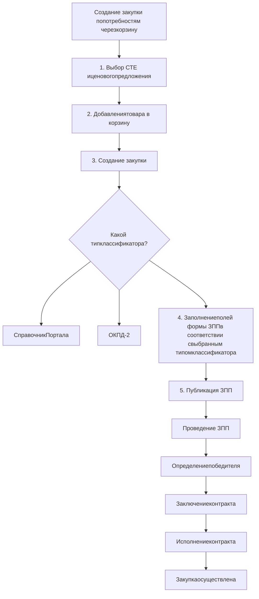
```mermaid
graph TD
    A["Создание закупки попотребностям черезкорзину"] --> B["1. Выбор СТЕ иценовогопредложения"]
    B --> C["2. Добавлениятовара в корзину"]
    C --> D["3. Создание закупки"]
    D --> E{"Какой типклассификатора?"}
    E --> F["СправочникПортала"]
    E --> G["ОКПД-2"]
    E --> H["4. Заполнениеполей формы ЗППв соответствии свыбранным типомклассификатора"]
    H --> I["5. Публикация ЗПП"]
    I --> J["Проведение ЗПП"]
    J --> K["Определениепобедителя"]
    K --> L["Заключениеконтракта"]
    L --> M["Исполнениеконтракта"]
    M --> N["Закупкаосуществлена"]
```

**Рисунок 250 – Осуществление закупки путем публикации ЗПП через корзину**

Создать закупку по потребностям можно на основании товаров, добавленных в корзину пользователя. Для этого необходимо осуществить следующие действия (Рисунок 251):

1. Выбрать СТЕ и ценовые предложения по ним.
2. Добавить выбранные ценовые предложения (оферты) в корзину.
3. Выбрать в корзине те оферты, на которые будет формироваться закупка, указать требуемое количество каждой оферты и нажать на кнопку «Создать закупку» (Рисунок 194). Во всплывающем модальном окне необходимо выбрать тип закупки «Закупка по потребностям» и нажать кнопку «Создать» (Рисунок 195).
4. Далее, откроется страница создания закупки по потребностям (Рисунок 238), где необходимо заполнить обязательные поля формы (подробнее о заполнение полей формы в разделе 8.3.1). При создании ЗПП через корзину поля блока «Спецификация» на форме будут

---

158

заполнены автоматически, на основании выбранной оферты. Поля блока доступны для редактирования.
5. Опубликовать закупку по потребностям.

### 8.3.3. Отложенная публикация потребности
Для того, чтобы опубликовать закупку по потребностям в заданные дату и время (отложить дату начала приема предложений) необходимо при создании закупки по потребностям (см. раздел 8.3.1) выбрать дату и время публикации в поле «Дата начала приема предложений» на странице закупки по потребностям (Рисунок 241).

### 8.3.4. Редактирование закупки по потребностям
Для того, чтобы изменить параметры закупки по потребностям, необходимо перейти на страницу **«Мои закупки по потребностям»** (Электронный магазин → Мои закупки по потребностям (Рисунок 236)) и на карточке потребности в статусе **«Ввод сведений»** нажать на наименование потребности (Рисунок 248), после чего откроется страница закупки по потребностям.

Для перехода к редактированию необходимо нажать на кнопку «Редактировать». Далее, внести изменения и нажать кнопку **«Сохранить»** (Рисунок 251).

Рисунок 251 – Страница редактирования закупки по потребности

**Рисунок 251 – Страница редактирования закупки по потребности**

---

159

### 8.3.5. Публикация закупки по потребностям
Для того, чтобы опубликовать закупку по потребностям необходимо нажать на кнопку «Опубликовать» на странице закупки по потребностям (Рисунок 251).

После нажатия на кнопку «Опубликовать» откроется окно подтверждения публикации закупки по потребностям (Рисунок 252).

Вы действительно хотите опубликовать закупку по потребностям? Подтвердить Отменить

**Рисунок 252 – Окно подтверждения публикации закупки по потребностям**

Статус потребности изменится с **«Ввод сведений»** на **«Прием предложений»**.

### 8.3.6. Публикация потребности с помощью сервиса интеграционного взаимодействия
Если Заказчик работает в своем ЛК во внешней системе, осуществляет формирование и публикацию закупок по потребностям через сервис интеграционного взаимодействия, ему необходимо учитывать планируемые даты приема предложений и производственный календарь.

При публикации потребности и отсутствия в ней даты начала приема предложений, такая потребность будет опубликована на Портале в первый рабочий день после выходных или праздничных дней. Если дата начала приема предложений указана, потребность будет опубликована с датами Заказчика.

### 8.3.7. Отмена закупки по потребности
Для того, чтобы отменить уже опубликованную закупку необходимо перейти в реестр закупок по потребностям (Электронный магазин → Мои закупки по потребностям) и нажать кнопку «Отменить потребность» на странице потребности в статусе **«Прием предложений»** (Рисунок 253).

Интерфейс карточки потребности с кнопкой «Отменить потребность»

**Рисунок 253 – Кнопка «Отменить потребность» для потребности со статусом «Прием предложений»**

---

160

После чего откроется модальное окно подтверждения отмены закупки по потребности (Рисунок 254).

Модальное окно подтверждения отмены закупки по потребности

**Рисунок 254 – Модальное окно подтверждении отмены потребности**

После отмены закупки по потребности, ее статус изменится с **«Прием предложений»** на **«Отменена»**.

## 8.3.8. Определение победителя и заключение контракта с поставщиком, подавшим предложение

Для того, чтобы определить победителя Заказчику необходимо перейти на страницу закупки по потребности, которая находится в статусе **«Прием предложений завершен»** и для выбранного предложения в столбце «Действия» нажать на кнопку «Заключить контракт» (Рисунок 255).

Блок «Предложения» на странице потребности

**Рисунок 255 – Блок «Предложения» на странице потребности**

Нажатием на кнопку «Заключить» подтвердить заключение контракта (Рисунок 256, Рисунок 257).

Подтверждение заключения контракта

**Рисунок 256 – Подтверждение заключения контракта**

---

161

Уведомление об успешном выполнении операции

**Рисунок 257 – Уведомление об успешном выполнении операции подтверждения заключения контракта**

После нажатия кнопки «Заключить» для выбранного предложения в столбце «Действия» отображается ссылка «Перейти к контракту».

По ссылке «Перейти к контракту» перейти в сведения о контракте (Рисунок 258) и далее нажать «Открыть полную версию» (Рисунок 259) заключение контракта производится в соответствии с **п. 9.2** данного документа.

Сведения о контракте в статусе «Ввод сведений»

**Рисунок 258 – Сведения о контракте в статусе «Ввод сведений»**

---

162

Скриншот интерфейса системы: просмотр контракта в статусе «Ввод сведений»

**Рисунок 259 – Просмотр полной версии контракта в статусе «Ввод сведений»**

Если поставщик отказался от заключения контракта или истекло время подписания контракта, происходит автоматический отказ от участия поставщика в закупке по потребности.

В результате отказа поставщика от заключения контракта по закупке по потребности происходят следующее:
- предложение поставщика исчезает с вкладки «Предложение» закупки по потребности;
- заказчику приходит уведомление о смене статуса контракта (Рисунок 260);
- у заказчика появляется возможность выбрать предложение другого поставщика (Рисунок 261).

---

163

Уведомление о смене статуса контракта

**Рисунок 260 – Уведомление о смене статуса контракта**

Сведения о закупке по потребности

**Рисунок 261 – Выбор второго поставщика по потребности**

После выбора заказчиком второго поставщика по закупки по потребности происходит стандартный процесс подписания контракта (подробнее **п. 9.2**).

Для того, чтобы посмотреть подробную информацию по предложениям, необходимо перейти на страницу закупки по потребности в статусе «Прием предложений завершен», затем перейти на вкладку «Предложения» и для выбранного предложения в столбце «Действия» нажать на кнопку «Посмотреть» (Рисунок 255). Откроется модальное окно «Просмотр предложения (Рисунок 262).

---

164

Просмотр предложения

**Рисунок 262 – Просмотр информации по предложению**

**8.3.9. Мои закупки по потребностям**

Посмотреть список закупок по потребностям заказчика можно в реестре **«Мои закупки по потребностям»**. Чтобы перейти в данный реестр, необходимо во всплывающем пользовательском меню (Рисунок 236) нажать **«Электронный магазин»** → **«Мои закупки по потребностям»**.

В реестре закупок можно искать необходимую закупку с помощью следующих фильтров (Рисунок 263):

| Фильтр                                                     | Значение фильтра                                                                                                                 |
| ---------------------------------------------------------- | -------------------------------------------------------------------------------------------------------------------------------- |
| Номер                                                      | Ввод номера закупки или его часть                                                                                                |
| Наименование закупки по потребностям                       | Ввод наименования закупки или его части                                                                                          |
| ОКПД                                                       | Выбор категории из справочника. Возможен множественный выбор                                                                     |
| Регион заказчика                                           | Выбор региона деятельности/поставки из справочника. Возможен множественный выбор                                                 |
| Статус закупки по потребностям                             | Выбор из списка:<br/>• Прием предложений;<br/>• Прием предложений завершен;<br/>• Ввод сведений;<br/>• В архиве;<br/>• Отменена. |
| Начальная (максимальная) цена                              | Ввод интересующего диапазона начальной цены (с …; по …)                                                                          |
| Дата окончания подачи предложений                          | Ввод интересующего периода окончания подачи предложений                                                                          |
| Признак «Наличие предложений»                              | Возможность выбора признака                                                                                                      |
| Признак «Только мои закупки»                               | Возможность выбора признака                                                                                                      |
| Признак «Опубликована организатором»                       | Возможность выбора признака                                                                                                      |
| Законы, в соответствии с которыми *осуществляется закупка* | Возможность выбора признака(ов): 44-ФЗ, 223-ФЗ, Положение о закупках организации                                                 |
| Основание заключения контракта                             | Выбор значения из справочника                                                                                                    |
| Способ размещения закупки                                  | Выбор значения из справочника                                                                                                    |


---

165

| \*\*Фильтр\*\*(заказа)/определениепоставщика | \*\*Значение фильтра\*\*                                                                                  |
| -------------------------------------------- | --------------------------------------------------------------------------------------------------------- |
| Типы заказчиков                              | Возможность выбрать одно из значений:<br/>• Все;<br/>• Государственные заказчики;<br/>• или В2В заказчики |
| Инициатор закупки                            | Возможность выбрать признак:<br/>• Только мои закупки<br/>• Опубликована организатором                    |


|   |
| - |


Найденные закупки можно выгрузить в формате excel с помощью кнопки Выгрузить.

Реестр «Мои закупки по потребностям»

**Рисунок 263 – Реестр «Мои закупки по потребностям»**

## 8.3.10. Выгрузка протокола проведения закупки по потребности

Выгрузка протокола проведения закупки доступна для пользователя Заказчика после окончания приема предложений. Чтобы выгрузить протокол пользователю необходимо в карточке потребности совершить действие «Выгрузить протокол». Протокол будет содержать сведения и результаты по приему предложений.

---

166

**Закупка по потребности 3530155**
● ПРИЕМ ПРЕДЛОЖЕНИЙ ЗАВЕРШЕН

**Закупка абрикос для ярмарки**

**Заказчик**
ПАО « »

**Заключение происходит в соответствии с законом**
44-ФЗ

**Основание для заключения**
п. 4 ч. 1 ст. 93 Закупка объемом до 600 тысяч рублей

**Контактное лицо**

**Телефон**
+7

Создать копию потребности | Выгрузить протокол

СПЕЦИФИКАЦИЯ 1 | ПОСТАВКА

Прием предложений завершен
09 ноября 2020 19:05:37

Период проведения
с 09.11.2020 по 09.11.2020

Победитель определен
Победителем стал ООО «Сандал»

Цена закупки победителя
8 820,00 ₽

**Рисунок 264 – Кнопка «Выгрузить протокол»**

**8.4. Формирование закупки с неизвестным объемом (по цене за единицу**
**продукции)**

Формирование закупки с неизвестным объемом позволит заключить контракт по цене за единицу товара (работы, услуги) и максимального значения цены договора (объёма финансирования) в соответствии пунктом 24 статьи 22 Федерального закона от 05.04.2013 N 44-ФЗ «О контрактной системе в сфере закупок товаров, работ, услуг для обеспечения государственных и муниципальных нужд», и в соответствии с пунктом 5 части 9 и пунктом 5 части 10 статьи 4 Федерального закона от 18.07.2011 N 223 «О закупках товаров, работ, услуг отдельными видами юридических лиц».

В зависимости от способа размещения закупки (котировочная сессия, закупка по потребности, прямая закупка) заказчик может установить признак закупки с неизвестным объемом для публикации закупки по цене за единицу товара, работы, услуги.

Формирование закупки будет доступно, если заказчику было установлено право на публикацию таких закупок. Право на публикацию подобных закупок устанавливает Уполномоченный орган региона.

Для проставления признака закупки с неизвестным объемом на форме создания закупки пользователю необходимо установить признак «Закупка с неизвестным объемом» (Рисунок 265, Рисунок 266, Рисунок 267).

---

167

# СОЗДАНИЕ КОТИРОВОЧНОЙ СЕССИИ

Форма создания котировочной сессии

**Тип классификатора***: Справочник Портала поставщиков
**Наименование закупки***:     
**Совместная закупка**: [ ]
**Регион поставки**:     
**Ввод поставки для каждого элемента спецификации**: [ ]
**Адрес поставки***:     
**Формат ввода сроков поставки**:
* [x] Количество дней на поставку с момента заключения контракта
* [ ] Даты поставки товаров, выполнения работ или услуг
**Сроки поставки (дней)***:     
**Шаг КС (%)***: 0,50
**Максимальное значение цены контракта***:     
**Начальная сумма цен единиц**: 0,00 ₽
**Время проведения котировочной сессии**:
* [ ] 3 часа
* [ ] 6 часов
* [x] 24 часа
**Заключение происходит в соответствии с законом**:
* [x] 44-ФЗ
* [ ] 223-ФЗ
**Способ размещения закупки (заказа)/определение поставщика**: Единственный поставщик
**Основание заключения контракта***: п. 4 ч. 1 ст. 93 Закупка объемом до 600 тысяч рублей
**Закупка с неизвестным объемом**: [x]

Рисунок 265 – Формирование котировочной сессии с неизвестным объемом

---

168

Потребность Тест

< Вернуться к списку моих закупок Свернуть все

ИНФОРМАЦИЯ ПО ЗАКУПКЕ
Основная информация
Поставка
Документы
Спецификация

ОПУБЛИКОВАНА

ПРИЕМ ПРЕДЛОЖЕНИЙ

ВЫБОР ПРЕДЛОЖЕНИЙ

**Основная информация**

Заказчик
ПАО «ЧАСТЬ»

Наименование закупки*
Тест

ФИО контактного лица*

Телефон контактного лица*
+7(___)___-__-__

Адрес электронной почты контактного лица*

Размещение в соответствии с законом
44-ФЗ 223-ФЗ

Способ размещения закупки
Единственный поставщик

Основание заключения
п. 4 ч. 1 ст. 93 Закупка объемом до 600 тысяч рублей

Закупка с неизвестным объемом
[x]

Начальная сумма цен единиц
0 Р

Максимальное значение цены контракта, Р

**Рисунок 266 – Формирование закупки по потребности с неизвестным объемом**

ЗАЯВКА Номер заявки: 0079977-22 01.02.2022 12:14:29 Черновик

Направить поставщику Удалить

[ ] Я принимаю условия Пользовательского соглашения

ПОСТАВЩИК
ООО «Сущность»

Заключение происходит в соответствии с законом
44-ФЗ 223-ФЗ

Основание заключения контракта:
п. 4 ч. 1 ст. 93 Закупка объемом до 600 тысяч рублей

Закупка с неизвестным объемом

СОСТАВ ЗАЯВКИ Показывать 10

Добавить в заявку Отложить Удалить

**Рисунок 267 – Формирование прямой закупки с неизвестным объемом**

Далее необходимо заполнить сведения при формировании закупок и обязательные поля для публикации закупки с условием:
- Максимальное значение цены контракта;
- Начальная цена за единицу (цена за единицу).

---

169

После публикации закупки карточка закупки будет иметь отличительный признак «Закупка с неизвестным объемом» (Рисунок 268).

Котировочная сессия 8916521, успешно завершена, лента клейкая канцелярская, прием ставок закончен, 31 января 2022 12:46:11, заказчик, начальная цена за единицу продукции, 9,99 ₽, снижение в ходе сессии, победитель определен, последняя цена сессии, проект контракта.pdf

Рисунок 268 – Опубликованная закупка с признаком «Закупка с неизвестным объемом»

Если в торгах выставлен признак «Закупка с неизвестным объемом» необходимо учитывать, что для поставщиков начальная цена единиц товара, работы, услуги будет играть ведущую роль, данная цена будет являться предметом торга, а не цена контракта.

Определение победителя и заключение контракта происходит в соответствии с существующим бизнес-процессом по выбранному способу закупки.

---

170

## 9. Раздел «Мои контракты»

Раздел **«Мои контракты»** (Рисунок 269) предназначен для предоставления сведений о контрактах, заключенных заказчиком.

Страница раздела «Мои контракты»

**Рисунок 269 – Страница раздела «Мои контракты»**

**Перейти в данный раздел можно из панели управления пользователя, выбрав пункт**
**«Контракты» (Рисунок 146):**

Переход в раздел «Мои контракты» из пользовательского меню

**Рисунок 270 – Переход в раздел «Мои контракты» из пользовательского меню**

В данном разделе пользователь может просматривать и отслеживать статусы своих контрактов, а также осуществлять процедуру заключения контракта.

---

171

По умолчанию все контракты пользователя в разделе «Мои контракты» отсортированы по дате последнего изменения. Чтобы просмотреть новые контракты, полученные от поставщиков, рекомендуется выбрать в поле настройки фильтров статус «Заключение».

Также, в реестре контрактов можно искать необходимый контракт с помощью следующих фильтров (Таблица 21):

| \*\*Фильтр\*\*                                            | \*\*Значение фильтра\*\*                                                                                                                                                                                                                               |
| --------------------------------------------------------- | ------------------------------------------------------------------------------------------------------------------------------------------------------------------------------------------------------------------------------------------------------ |
| Я-поставщик                                               | Возможна установка признака «Я-поставщик»                                                                                                                                                                                                              |
| Я-покупатель                                              | Возможна установка признака «Я-покупатель»                                                                                                                                                                                                             |
| Все контракты                                             | *Возможна установка признака «Все контракты»*                                                                                                                                                                                                          |
| На бумажном носителе                                      | Возможна установка признака «На бумажном носителе»                                                                                                                                                                                                     |
| Только контракты с государственным заказчиком             | Возможна установка признака «Только контракты с государственным заказчиком»                                                                                                                                                                            |
| Опубликована организатором                                | Возможна установка признака «Опубликована организатором»                                                                                                                                                                                               |
| Заказчик (название или ИНН)                               | Ввод частичного или полного наименования заказчика или ИНН                                                                                                                                                                                             |
| Поставщик (название или ИНН)                              | Ввод частичного или полного наименования поставщика или ИНН                                                                                                                                                                                            |
| Номер контракта                                           | Ввод номера контракта                                                                                                                                                                                                                                  |
| Дата заключения                                           | Выбор периода заключения контракта с помощью встроенного календаря                                                                                                                                                                                     |
| Дата действия контракта                                   | Выбор периода действия контракта с помощью встроенного календаря                                                                                                                                                                                       |
| Сумма контракта                                           | Ввод диапазона суммы по контракту                                                                                                                                                                                                                      |
| Предмет контракта                                         | Ввод наименования предмета контракта                                                                                                                                                                                                                   |
| Реестровый номер контракта                                | Ввод реестрового номера контракта                                                                                                                                                                                                                      |
| Реестровый номер оферты                                   | Ввод реестрового номера оферты                                                                                                                                                                                                                         |
| Статус контракта                                          | Возможен выбор статуса контракта из списка:<br/>• ввод сведений,<br/>• редактирование,<br/>• направлен поставщику,<br/>• направлен протокол разногласий,<br/>• заключение,<br/>• заключен,<br/>• исполнен,<br/>• расторгнут,<br/>• отказ от заключения |
| Электронное исполнение                                    | Возможные значения: «Все», «Да», «Нет».                                                                                                                                                                                                                |
| Размещение сведений осуществляется по законам             | Возможен выбор одного или нескольких законов, в соответствии с которыми осуществляется закупка                                                                                                                                                         |
| Основания заключения контракта                            | Выбор основания из списка                                                                                                                                                                                                                              |
| Способ размещения закупки (заказа)/определение поставщика | Выбор способа размещения из списка                                                                                                                                                                                                                     |
| Требуется обеспечение                                     | Возможен выбор следующего признака:<br/><br/>− Все;<br/>− Да;                                                                                                                                                                                          |


---

172

| \*\*Фильтр\*\* | \*\*Значение фильтра\*\* |
| -------------- | ------------------------ |
|                | − Нет.                   |


В зависимости от вида контракта используется один из двух видов интерфейсов пользователя, отличаются по url адресу и по внешнему виду:

1) https://old.zakupki.mos.ru/#/contracts/my/[id контракта] (Рисунок 271)
    * контракты, данные по которым ПП получает из Региональной информационной системы Заказчика
    * контракты от московских Заказчиков с признаков Электронного исполнения
    * контракты от московских Заказчиков без признака Электронного исполнения
    * контракты, которые зарегистрированы по кнопке "Зарегистрировать контракт" после заключения не электронным способом

2) https://zakupki.mos.ru/profile/contract/[id контракта] (Рисунок 272)
    * контракты, работа по которым ведется только на ПП, и при этом не принимают данные из внешней системы то есть: контракты, по которым весь жизненный цикл и все действия происходят только на ПП от создания до исполнения/расторжения, в том числе контракты, данные по которым передаются в Региональную информационную систему Заказчика из ПП, но не принимаются из неё.

| СВЕДЕНИЯ О КОНТРАКТЕ<br/>Номер контракта: 203<br/>Переотправка последнего исходящего пакета | СВЕДЕНИЯ О КОНТРАКТЕ<br/>Статус: Заключен<br/>РедактироватьЖурнал интеграции                                            |
| ------------------------------------------------------------------------------------------- | ----------------------------------------------------------------------------------------------------------------------- |
| Осуществленная закупка                                                                      | Поставка товаров для обеспечения призового фонда для победителей краевого фестиваля народного творчества «Салют победы» |
| Реестровый номер контракта                                                                  | 2277078200000226                                                                                                        |
| Заказчик/Покупатель                                                                         | Государственное краевое бюджетное учреждение культуры "Пермский дом народного творчества"                               |
| ИНН Заказчика                                                                               | 5905015789                                                                                                              |
| Дата заключения                                                                             | 24.12.2020                                                                                                              |
| Контракт начинает действовать с момента подписания                                          | \[yes]                                                                                                                  |
| Дата окончания действия контракта                                                           |                                                                                                                         |
| Предмет контракта                                                                           | Поставка товаров для обеспечения призового фонда для победителей краевого фестиваля народного творчества «Салют победы» |
| Место заключения контракта                                                                  | г.Пермь                                                                                                                 |


**Рисунок 271 – Внешний вид интерфейса 1**

---

173

Интерфейс страницы контракта

**Рисунок 272 – Внешний вид интерфейса 2**

## 9.1.Страница контракта пользователя

Страница контракта содержит следующие сведения (Рисунок 271 и Рисунок 272):
− Статус;
− Номер контракта;
− Реестровый номер контракта;
− Заказчик/Покупатель;
− ИНН Заказчика;
− Дата окончания действия контракта;
− Предмет контракта;
− Место заключения контракта;
− Идентификационный код закупки (ИКЗ);
− Источник финансирования;
− Признак: облагается НДС или нет;
− Подписант;
− Должность;
− Закон, в соответствии с которым размещена закупка;
− Способ размещения закупки (заказа)/определение поставщика;
− Основание заключения контракта;
− Поставщик;
− Сумма контракта;
− Авансовый платеж;
− Сведения о спецификациях. Таблица содержит перечень оферт поставщика, с которым заключается контракт:
    а) Номер и ссылка на оферту;
    б) Наименование оферты с указанием страны происхождения;
    в) Количество товаров из оферты;
    г) Единица измерения;
    д) Сумма оферты;
    е) Сумма НДС;

---

174

 ж) Сумма с НДС;
 з) ОКПД2.
− Сведения о поставке. Таблица содержит сведения о поставке товара:
 а) Количество дней на поставку;
 б) Период поставки;
 в) Место поставки;
− Спецификация этапов поставки:
 а) Количество;
 б) Единица измерения;
 в) Оферта;
− Прикрепленные файлы по контракту;
− История изменений контракта.

## 9.2.Работа с контрактом в интерфейсе 1

Процедура работы с контрактом в интерфейсе 1 между заказчиком и поставщиком представлена на схеме ниже (Рисунок 273).

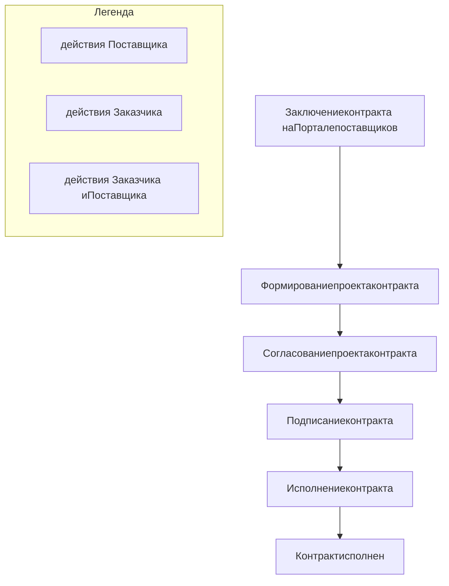
```mermaid
graph TD
    A["Заключениеконтракта наПорталепоставщиков"] --> B["Формированиепроектаконтракта"]
    B --> C["Согласованиепроектаконтракта"]
    C --> D["Подписаниеконтракта"]
    D --> E["Исполнениеконтракта"]
    E --> F["Контрактисполнен"]
    subgraph Legend["Легенда"]
    G["действия Поставщика"]
    H["действия Заказчика"]
    I["действия Заказчика иПоставщика"]
    end
```

**Рисунок 273 – Общий процесс этапов заключения контракта**

---

175

### 9.2.1. Формирование проекта контракта
После определения победителя по закупке заказчик может сформировать проект контракта. Для этого нужно перейти в раздел «Контракты» всплывающего пользовательского меню (Рисунок 270) и найти проект контракта по этой закупке в статусе «Ввод сведений».

В открывшейся форме проекта контракта необходимо нажать «Сформировать проект контракта» и заполнить следующие поля (Таблица 22):

| Наименование поля                                            | Обяз-сть                                             | Пояснение к заполнению поля                                                                                                               |
| ------------------------------------------------------------ | ---------------------------------------------------- | ----------------------------------------------------------------------------------------------------------------------------------------- |
| Номер контракта                                              | Да                                                   | Ввод уникального номера контракта                                                                                                         |
| Осуществленная закупка                                       | Да                                                   | Поле заполняется автоматически, в зависимости от типа осуществленной закупки: прямая закупка, котировочная сессия, закупка по потребности |
| Заказчик/Покупатель;                                         | Да                                                   | Поле заполняется автоматически                                                                                                            |
| ИНН Заказчика;                                               | Да                                                   | Поле заполняется автоматически                                                                                                            |
| Признак «Контракт начинает действовать с момента подписания» | Нет                                                  | Возможность установить признак                                                                                                            |
| Дата заключения                                              | Да                                                   | Данное поле становится заполненным после подписания контракта последней стороной (заказчиком)                                             |
| Период действия контракта                                    | Да                                                   | Выбор периода действия контракта с помощью встроенного календаря                                                                          |
| Предмет контракта                                            | Да                                                   | Поле заполняется автоматически. Доступно для редактирования                                                                               |
| Место заключения контракта                                   | Да                                                   | Ввод места заключения контракта                                                                                                           |
| Идентификационный код закупки (ИКЗ)                          | Да                                                   | Ввод ИКЗ                                                                                                                                  |
| Источник финансирования                                      | Да                                                   | Ввод источника финансирования                                                                                                             |
| НДС                                                          | Да                                                   | Возможность установить признак: «Включая НДС» или «НДС не облагается»                                                                     |
| Основание отсутствия НДС                                     | Да (в случае установки признака «НДС не облагается») | Ввод комментария                                                                                                                          |
| Подписант                                                    | Да                                                   | Поле заполняется автоматически. Есть возможность изменить подписанта с помощью справочника                                                |
| Должность                                                    | Да                                                   | Поле заполняется автоматически                                                                                                            |
| Закон, в соответствии с которым размещена закупка            | Да                                                   | Возможность выбрать закон: 44-ФЗ или 223-ФЗ                                                                                               |
| Способ размещения закупки (заказа)/определение поставщика    | Да (в случае выбора закона 44-ФЗ)                    | Поле заполняется автоматически                                                                                                            |
| Основание заключения контракта                               | Да (в случае                                         | Выбор основания из справочника                                                                                                            |


---

176

| \*\*Наименование поля\*\*   | \*\*Обяз-сть\*\*выборазакона 44-ФЗ) | \*\*Пояснение к заполнению поля\*\*                                                                                                                                                   |
| --------------------------- | ----------------------------------- | ------------------------------------------------------------------------------------------------------------------------------------------------------------------------------------- |
| Поставщик                   | Да                                  | Поле заполняется автоматически                                                                                                                                                        |
| Сумма контракта             | Да                                  | Поле заполняется автоматически                                                                                                                                                        |
| Авансовый платеж            | Нет                                 | Возможность указать информацию об авансовом платеже в рублях или процентах                                                                                                            |
| Сведения о спецификациях    |                                     | Таблица заполняется автоматически. Таблица содержит перечень оферт поставщика, с которым заключается контракт                                                                         |
| Сведения о поставке         | Да                                  | Таблица заполняется автоматически. Содержит сведения о поставке товара: количество дней на поставку, период поставки, место поставки. Сведения о поставке доступны для редактирования |
| Спецификация этапа поставки | Да                                  | Таблица заполняется автоматически                                                                                                                                                     |
| Прикрепить файл контракта   | Да                                  | Для отправки проекта контракта поставщику на согласование необходимо прикрепить файл контракта                                                                                        |


После заполнения всех обязательных полей формы и прикрепления файла контракта пользователь должен сохранить введенные сведения по контракту и нажать «Отправить поставщику».

### 9.2.2. Согласование проекта контракта

После сохранения формы контракта становится доступна кнопка «Отправить контракт поставщику». После отправки контракта поставщику запускается процесс согласования контракта (Рисунок 274). До момента принятия решения поставщиком по проекту контракта, заказчику доступна кнопка **Заменить файл контракта**, при нажатии на которую пользователь сможет заменить файла контракта и отправить на согласование скорректированную версию.

---

177

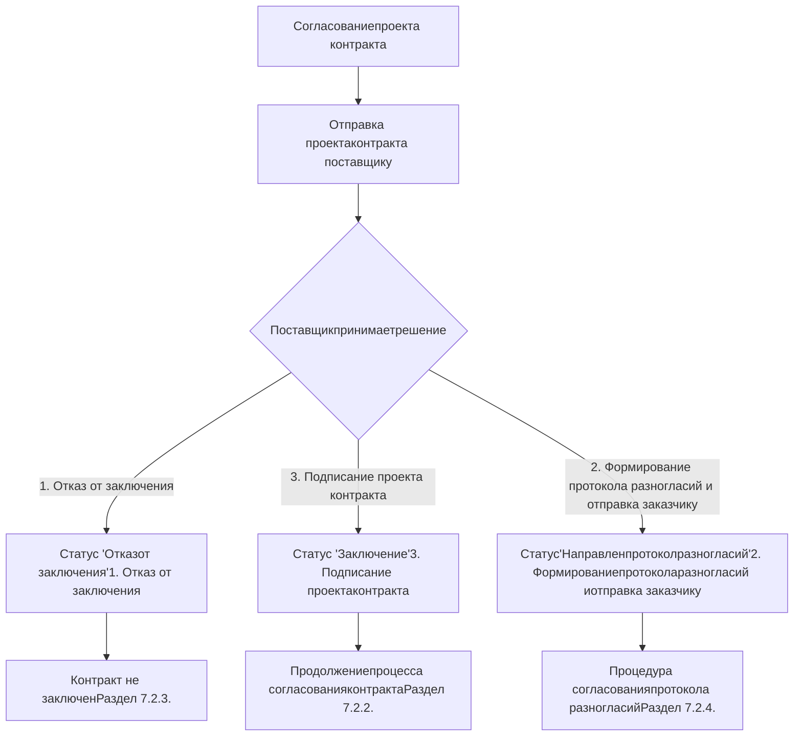
```mermaid
graph TD
    A["Согласованиепроекта контракта"] --> B["Отправка проектаконтракта поставщику"]
    B --> C{"Поставщикпринимаетрешение"}
    C -->|1. Отказ от заключения| D["Статус 'Отказот заключения'1. Отказ от заключения"]
    D --> E["Контракт не заключенРаздел 7.2.3."]
    C -->|3. Подписание проекта контракта| F["Статус 'Заключение'3. Подписание проектаконтракта"]
    F --> G["Продолжениепроцесса согласованияконтрактаРаздел 7.2.2."]
    C -->|2. Формирование протокола разногласий и отправка заказчику| H["Статус'Направленпротоколразногласий'2. Формированиепротоколаразногласий иотправка заказчику"]
    H --> I["Процедура согласованияпротокола разногласийРаздел 7.2.4."]
```

**Рисунок 274 – Процесс согласования проекта контракта**

**Поставщик** имеет возможность:
1. **1. Отказаться от заключения контракта.** В этом случае контракт заключен не будет (Раздел 9.2.3).
2. **2. Сформировать протокол разногласий.** В этом случае будет запущен процесс согласования протокола разногласий (раздел 9.2.4).
3. **3. Подписать проект контракта**. В этом случае процесс согласования контракта будет продолжен по следующей схеме (Рисунок 275).

---

178

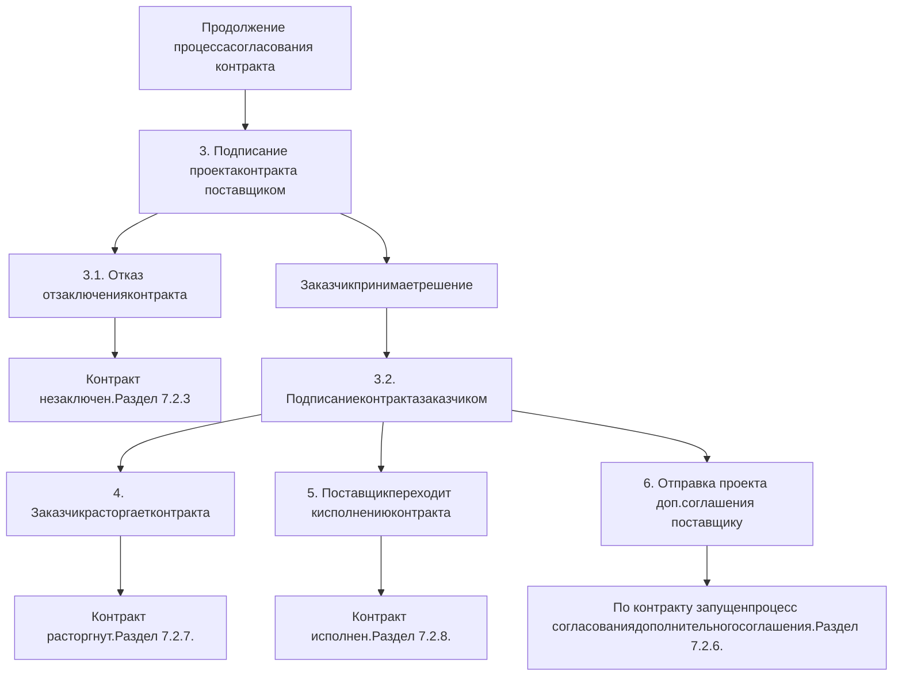
```mermaid
graph TD
    A["Продолжение процессасогласования контракта"] --> B["3. Подписание проектаконтракта поставщиком"]
    B --> C["3.1. Отказ отзаключенияконтракта"]
    C --> D["Контракт незаключен.Раздел 7.2.3"]
    B --> E["Заказчикпринимаетрешение"]
    E --> F["3.2. Подписаниеконтрактазаказчиком"]
    F --> G["4. Заказчикрасторгаетконтракта"]
    G --> H["Контракт расторгнут.Раздел 7.2.7."]
    F --> I["5. Поставщикпереходит кисполнениюконтракта"]
    I --> J["Контракт исполнен.Раздел 7.2.8."]
    F --> K["6. Отправка проекта доп.соглашения поставщику"]
    K --> L["По контракту запущенпроцесс согласованиядополнительногосоглашения.Раздел 7.2.6."]
```

**Рисунок 275 – Продолжение процесса согласования контракта**

После того как поставщик подпишет проект контракта, **заказчик** имеет возможность:
* **3.1. Отказаться от заключения контракта.** В этом случае контракт заключен не будет (Раздел 9.2.3).
* **3.2. Подписать контракт** (раздел 9.2.5).

После подписания контракта заказчиком, будут доступны следующие действия по контракту:
* **4. Расторжение контракта заказчиком (**раздел 9.2.7).
* **5. Исполнение контракта поставщиком** (раздел 9.2.8).
* **6. Формирование и отправка дополнительного соглашения** (раздел 9.2.6).

Для заказчика установлены регламентные сроки работы с контрактом: срок рассмотрения протокола разногласий – 48 часов, срок рассмотрения проекта контракта/договора - 48 часов.

Для поставщика установлены регламентные сроки работы с контрактом из ЕАИСТ после победы в котировочной сессии. Поставщик должен рассмотреть проект контракта/договора и выполнить одно из действий (отправить протокол разногласий; отказаться от контракта;

---

179

подписать проект контракта/договора) в течение 48 часов. При нарушении сроков происходит автоматический отказ поставщика от контракта.

## 9.2.3. Отказ в подписании контракта
Заказчик может отказаться от заключения контракта на этапе рассмотрения проекта контракта, посредством нажатия на кнопку «Отказ от заключения» (Рисунок 276).

| Операция             | Дата отправки/ получения | Требуемый срок ответа | Исполнитель                 | Результат  |
| -------------------- | ------------------------ | --------------------- | --------------------------- | ---------- |
| Протокол разногласий | 23.11.2020 16:43         | 25.11.2020 16:43      | Алёна Зайцева Макаровна     | Получено   |
| Проект контракта     | 23.11.2020 16:36         | 25.11.2020 16:36      | Анна Данилова Александровна | Отправлено |


**Рисунок 276 – Отказ от заключения контракта**

Для подтверждения отказа от заключения контракта необходимо заполнить предлагаемые поля и нажать кнопку «Отправить» (Рисунок 277).

Отправка отказа от заключения контракта Заказчиком

**Рисунок 277 – Отправка отказа от заключения контракта Заказчиком**

## 9.2.4. Согласование протокола разногласий
Для контрактов из ЕАИСТ и РИС реализовано ограничение на количество Протоколов разногласий в рамках заключения одного контракта между заказчиком и поставщиком. Протокол разногласий может быть только один.

Формирование протокола разногласий доступно Поставщику на этапе проекта контракта (статус «Заключение»). После получения протокола разногласий от Поставщика, Заказчик может (Рисунок 278):

* отказаться от протокола разногласий и отправить поставщику новый проект контракта. Процесс согласования проекта контракта будет продолжен (Рисунок 275);
* принять протокол разногласий и отправить поставщику новый проект контракта с учетом протокола разногласий. Процесс согласования проекта контракта будет продолжен (Рисунок 275);
* полностью отказаться от заключения контракта. В этом случае контракт заключен не будет.

---

180

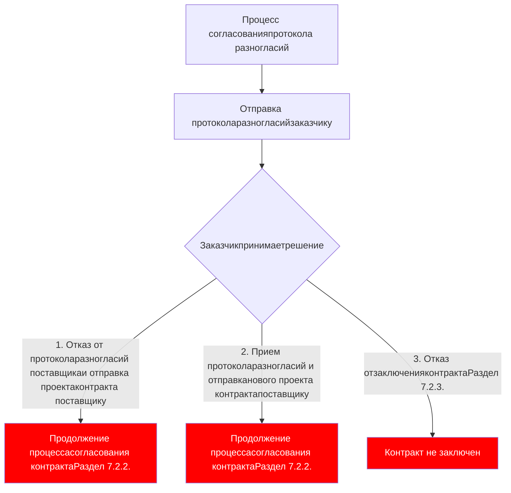
```mermaid
graph TD
    A["Процесс согласованияпротокола разногласий"] --> B["Отправка протоколаразногласийзаказчику"]
    B --> C{"Заказчикпринимаетрешение"}
    C -->|1. Отказ от протоколаразногласий поставщикаи отправка проектаконтракта поставщику| D["Продолжение процессасогласования контрактаРаздел 7.2.2."]
    C -->|2. Прием протоколаразногласий и отправканового проекта контрактапоставщику| E["Продолжение процессасогласования контрактаРаздел 7.2.2."]
    C -->|3. Отказ отзаключенияконтрактаРаздел 7.2.3.| F["Контракт не заключен"]
    
    style D fill:red,color:white
    style E fill:red,color:white
    style F fill:red,color:white
```

**Рисунок 278 – Процесс согласования протокола разногласий**

**9.2.5. Подписание контракта**

Для того, чтобы подписать контракт, пользователю необходимо нажать кнопку "Подписать". После чего пользователю станет доступен блок с полями (Рисунок 279), где можно:
- скачать файл контракта для просмотра;
- оставить комментарий к контракту/договору.

Блок с полями ввода информации при подписании контракта

**Рисунок 279 – Блок с полями ввода информации при подписании контракта**

Далее необходимо повторно нажать кнопку "Подписать" и подтвердить доступ к сертификату электронной подписи (Рисунок 280).

---

181

Подтверждение доступа к сертификату электронной подписи

**Рисунок 280 – Подтверждение доступа к сертификату электронной подписи**

После чего откроется модальное окно для просмотра проекта контракта, где также необходимо нажать кнопку "Подписать" (Рисунок 281).

---

182

Подписание

**Рисунок 281 – Окно для подписания контракта**

После того, как заказчик подпишет контракт, статус контракта изменится на «Заключен».

## 9.2.6. Формирование дополнительного соглашения

Формирование дополнительного соглашения доступно заказчику в контрактах со статусом «Заключен» или «Исполнение».

Для того, чтобы сформировать и отправить дополнительное соглашение поставщику заказчику необходимо нажать Прикрепить файл доп. соглашения на странице контракта. После нажатия заказчику станут доступны следующие кнопки прикрепления файла дополнительного соглашения, поля для указания срока ответа и комментария (Рисунок 282):

---

183

Блок с полями для заполнения информации по дополнительному соглашению

**Рисунок 282 – Блок с полями для заполнения информации по дополнительному соглашению**

После нажатия на кнопку «Отправить доп. соглашение поставщику» файл документа будет отправлен поставщику для рассмотрения и подписания.

В результате действия в разделе операции по контракту будет доступен результат отправки файла (Рисунок 283).

| Операция               | Дата отправки/ получения | Требуемый срок ответа | Исполнитель             | Результат         |
| ---------------------- | ------------------------ | --------------------- | ----------------------- | ----------------- |
| Проект доп. соглашения | 05.08.2020 16:05         | 10.08.2020 16:02      | Чек Грюль Александрович | Ожидание отправки |


**Рисунок 283 – Операции по контракту**

Процесс согласования дополнительного соглашения между заказчиком и поставщиком аналогичен процессу согласования контракта (подробнее в разделе 9.2.2).

### 9.2.6.1. Замена отправленного дополнительного соглашения

После отправки файла поставщику заказчику будет доступно действие по замене отправленного дополнительного соглашения.

Чтобы заменить файл отправленного дополнительного соглашения пользователю необходимо нажать Заменить файл доп. соглашения и прикрепить новый файл с последующей отправкой.

### 9.2.6.2. Отказ от текущей версии дополнительного соглашения

После отправки файла поставщику заказчику будет доступно действие по отказу от текущей версии дополнительного соглашения, которое было отправлено на подпись поставщику.

Чтобы отказаться от текущей версии дополнительного соглашения пользователю необходимо нажать Отказаться от текущей версии доп. соглашения и прикрепить новый файл с последующей отправкой.

### 9.2.7. Расторжение контракта

Расторжение контракта возможно только для контракта, имеющего статус «Заключен» (Рисунок 284).

---

184

**СВЕДЕНИЯ О КОНТРАКТЕ**

* **Номер контракта**: 345
* **Статус**: Заключен
* **Реестровый номер контракта**: 51542114200000005
* **Заказчик/Покупатель**: ООО ЕвроМед
* **ИНН Заказчика**:     
* **Дата заключения**: 07.12.2020
* **Контракт начинает действовать с момента подписания**: [x]
* **Дата окончания действия контракта**: 22.12.2020
* **Предмет контракта**: Вафли
* **Место заключения контракта**: Москва
* **Идентификационный код закупки (ИКЗ)**:     
* **Источник финансирования**: Бюджет
* **НДС**: 
    * [x] включая НДС
    * [ ] НДС не облагается
* **Подписант**: Анна Данилова Александровна
* **Должность**: Директор
* **Размещение в соответствии с законом**: 44-ФЗ
* **Способ размещения закупки (заказа)/определение поставщика**: Единственный поставщик
* **Основание заключения контракта**: п. 5 ч. 1 ст. 93 Закупка объемом до 600 тысяч рублей
* **Поставщик**: Общество с ограниченной ответственностью "САНТЕХСТРОЙ-М"
* **Сумма контракта**: 19 404.00 руб.
* **Авансовый платеж**: 10 %

Рисунок 284 – Сведения о контракте в статусе «Заключен»

**Рисунок 284 – Сведения о контракте в статусе «Заключен»**

Заказчик должен открыть заключенный контракт и нажать кнопку «Расторгнут» (Рисунок 284) и подтвердить расторжение контракта (Рисунок 285).

Рисунок 285 – Подтверждение расторжения контракта Заказчиком

**Рисунок 285 – Подтверждение расторжения контракта Заказчиком**

После подтверждения расторжения контракта статус контракта изменится с «Заключен» на «Расторгнут».

**9.2.8. Исполнение контракта**

Исполнение контракта возможно только для контракта, имеющего статус «Заключен» (Рисунок 284).

Заказчик должен открыть заключенный контракт и нажать кнопку «Исполнен» (Рисунок 284) и подтвердить исполнение контракта (Рисунок 286).

---

185

Исполнение контракта

**Рисунок 286 – Подтверждение исполнения контракта Заказчиком**

После подтверждения исполнения контракта статус контракта изменится с «Заключен» на «Исполнен».

## 9.2.9. Просмотр и выгрузка документов контракта

Просмотр проекта контракта доступен по кнопке Просмотр документов в сведениях о контракте (Рисунок 287).

Просмотр документов в сведениях о контракте

**Рисунок 287 – Просмотр документов в сведениях о контракте**

По нажатию на кнопку «Просмотр документов» открывается модальное окно просмотра документов контракта (Рисунок 288, Рисунок 289).

При просмотре документов контракта в статусе «Заключен» (Рисунок 289) отображаются сведения об электронных подписях, а также доступны функциональные кнопки «Скачать документ» и «Скачать документ с подписью».

---

186

Рисунок 288 – Модальное окно просмотра документов контракта в статусе «Заключение»

Рисунок 288 – Модальное окно просмотра документов контракта в статусе «Заключение»

---

187

Модальное окно просмотра документов контракта в статусе «Заключен»

Рисунок 289 – Модальное окно просмотра документов контракта в статусе «Заключен»

---

188

## 9.3. Работа с контрактом в интерфейсе 2

Процедура работы с контрактом в интерфейсе 2 между заказчиком и поставщиком представлена на схеме ниже (Рисунок 290).

Общий процесс этапов заключения контракта

**Рисунок 290 – Общий процесс этапов заключения контракта**

### 9.3.1. Области работы в интерфейсе 2
Пользователю в интерфейсе 2 доступны
* страница просмотра текущей версии контракта;
* страница редактирования текущей версии контракта.

На страницу редактирования пользователь переходит по кнопке «**Действия**» на странице просмотра.

По действиям, которые требуют/предполагают заполнение полей, создается страница редактирования и заполнение осуществляется на странице редактирования.

По действиям, которые не требуют/предполагают заполнение полей, страница редактирования не создается и действия выполняются сразу.

Страница просмотра текущей версии контракта состоит из:

---

189

* области отображения статусной модели контракта (Рисунок 291 (1)) На текущем активном статусе дополнительно отображается перечень блоков текущей формы. При клике на один из элементов, страница будет перемещена к этому элементу (Рисунок 291 (2));
* области отображения данных о контракте (Рисунок 291(3)) – не редактируется;
* области расположения кнопок действия (Рисунок 291 (4), Рисунок 292 (1,2)) – если доступно одно действие, то на кнопке будет надпись с этим действием, если доступно несколько действий, то надпись на кнопке будет «Доступные действия» (Рисунок 292 (1)), и по клику на неё отобразиться перечень кнопок с доступными действиями (Рисунок 292 (2)).

Рисунок 291 – Области интерфейса на странице просмотра контракта

**Рисунок 291 – Области интерфейса на странице просмотра контракта**

---

190

Отображение доступных действий на странице просмотра контракта

**Рисунок 292 – Отображение доступных действий на странице просмотра контракта**

Страница редактирования текущей версии контракта состоит из:
* области отображения статусной модели контракта (Рисунок 293 (1)). На текущем активном статусе дополнительно отображается перечень блоков текущей формы. При клике на один из элементов, страница будет перемещена к этому элементу (Рисунок 292 (2));
* области отображения данных о контракте (Рисунок 293 (3)) – часть полей редактируется;
* области для расположения кнопок действия (Рисунок 293 (4)) – стандартно отображаются 3 кнопки:
    * «Сохранить» (Рисунок 294 (1)) – сохраняет введенные данные и приложенные файлы на странице редактирования;
    * «Отменить операцию» (Рисунок 294 (2)) – удаляет введенные данные и приложенные файлы на странице редактирования, удаляет страницу редактирования, возвращает возможность использовать кнопки по доступным действиям на странице просмотра в области «Доступные действия» (Рисунок 292 (1));
    * кнопка завершения действия (Рисунок 294 (3)), выбранного на странице просмотра, и перевода контракта на следующий статус.

---

191

Редактирование контракта

**Рисунок 293 – Области интерфейса на странице редактирования контракта**

Расположение кнопок при редактировании контракта

**Рисунок 294 – Расположение кнопок при редактировании контракта**

Во время заполнения полей на странице редактирования можно сохранить введенные данные по кнопке «Сохранить» (Рисунок 294 (1)) и закрыть страницу редактирования. Далее, если открыть страницу просмотра контракта – будут отображены данные без учета изменений на странице редактирования. Для возврата на страницу редактирования необходимо нажать кнопку «Продолжить выполнение операции» в области кнопок действия (Рисунок 295)

---

192

Рисунок 295 – Расположение кнопки возврата на страницу редактирования из страницы просмотра

**Рисунок 295 – Расположение кнопки возврата на страницу редактирования из страницы просмотра**

### 9.3.2. Формирование проекта контракта
После определения победителя по закупке заказчик может сформировать проект контракта. Для этого нужно перейти в раздел «Контракты» всплывающего пользовательского меню (Рисунок 270) и найти проект контракта по этой закупке в статусе «Ввод сведений».

В открывшейся форме проекта контракта необходимо нажать на кнопку «Сформировать проект контракта» и заполнить следующие поля (Таблица 23):

| Наименование поля                                            | Обяз-сть                | Пояснение к заполнению поля                                                                   |
| ------------------------------------------------------------ | ----------------------- | --------------------------------------------------------------------------------------------- |
| \*\*Блок «Основная информация»\*\*                           |                         |                                                                                               |
| Номер контракта                                              | Да                      | Ввод уникального номера контракта                                                             |
| Признак «Контракт начинает действовать с момента подписания» | Нет                     | Возможность установить признак                                                                |
| Дата заключения                                              | Да                      | Данное поле становится заполненным после подписания контракта последней стороной (заказчиком) |
| Период действия контракта                                    | Да                      | Выбор периода действия контракта с помощью встроенного календаря                              |
| Предмет контракта                                            | Да                      | Поле заполняется автоматически. Доступно для редактирования                                   |
| Место заключения контракта                                   | Да                      | Ввод места заключения контракта                                                               |
| Идентификационный код закупки (ИКЗ)                          | Да                      | Ввод ИКЗ                                                                                      |
| Источник финансирования                                      | Да                      | Ввод источника финансирования                                                                 |
| НДС                                                          | Да                      | Возможность установить признак: «Включая НДС» или «НДС не облагается»                         |
| Основание отсутствия НДС                                     | Да (в случае установки) | Ввод комментария                                                                              |


**Таблица 23 – Поля формы для заполнения при подготовке проекта контракта**

---

193

| Наименование поля                          | Обяз-сть                      | Пояснение к заполнению поля                                                                                                                                                           |
| ------------------------------------------ | ----------------------------- | ------------------------------------------------------------------------------------------------------------------------------------------------------------------------------------- |
| \*\*Блок «Основная информация»\*\*         |                               |                                                                                                                                                                                       |
|                                            | признака «НДС не облагается») |                                                                                                                                                                                       |
| \*\*Сведения о заказчике\*\*               |                               |                                                                                                                                                                                       |
| Подписант                                  | Да                            | Поле заполняется автоматически. Есть возможность изменить подписанта с помощью справочника                                                                                            |
| Общие сведения                             | Да                            | Поле заполняется автоматически.                                                                                                                                                       |
| Банковские реквизиты                       | Да                            | Поле заполняется автоматически.                                                                                                                                                       |
| Контактные данные                          | Да                            | Поле заполняется автоматически.                                                                                                                                                       |
| \*\*Сведения о поставщике\*\*              |                               |                                                                                                                                                                                       |
| Наименование поставщика                    | Да                            | Поле заполняется автоматически. Есть возможность перейти к публичному профилю компании при нажатии на наименование поставщика.                                                        |
| Кнопка «Выбрать из участников потребности» |                               | Отображается при создании проекта контракта по результатам определения поставщика по закупке по потребностям (см. 9.3.2.1)                                                            |
| Общие сведения                             | Да                            | Поле заполняется автоматически.                                                                                                                                                       |
| Банковские реквизиты                       | Да                            | Поле заполняется автоматически.                                                                                                                                                       |
| Контактные данные                          | Да                            | Поле заполняется автоматически.                                                                                                                                                       |
| \*\*Остальные поля и блоки\*\*             |                               |                                                                                                                                                                                       |
| Авансовый платеж                           | Нет                           | Возможность указать информацию об авансовом платеже в рублях или процентах                                                                                                            |
| Сведения о спецификациях                   |                               | Таблица заполняется автоматически. Таблица содержит перечень оферт поставщика, с которым заключается контракт                                                                         |
| Сведения о поставке                        | Да                            | Таблица заполняется автоматически. Содержит сведения о поставке товара: количество дней на поставку, период поставки, место поставки. Сведения о поставке доступны для редактирования |
| Файл документа контракта                   | Да                            | Для отправки проекта контракта поставщику на согласование необходимо прикрепить файл контракта                                                                                        |


При нажатии на кнопку «Сохранить» не происходит проверка корректности заполнения полей.

При нажатии на кнопку «Отправить поставщику» происходит проверка корректности заполнения полей.

При нажатии на кнопку «Выбрать из участников потребности» происходит открытие модального окна выбора предложений поставщиков по потребности. Описание см. в разделе 9.3.2.1.

Доступны для ознакомления следующие поля (Таблица 24)

---

194

| \*\*Наименование поля\*\*                                   | \*\*Пояснение к полю\*\*                                                                                                            |
| ----------------------------------------------------------- | ----------------------------------------------------------------------------------------------------------------------------------- |
| Осуществленная закупка                                      | Заполняется автоматически в зависимости от типа осуществленной закупки: прямая закупка, котировочная сессия, закупка по потребности |
| Сведения о Заказчике                                        | Подтягивается автоматически. Инфо о заказчике                                                                                       |
| Сведения о Поставщике                                       | Тоже самое                                                                                                                          |
| Дата заключения                                             | Данное поле становится заполненным после подписания контракта последней стороной (заказчиком)                                       |
| Должность                                                   | Автоматически должность заказчика из профиля                                                                                        |
| Закон, в соответствии с которым размещена закупка           | Автоматически из закупки                                                                                                            |
| Способ размещения закупки *(заказа)/определение поставщика* | Поле заполняется автоматически. Указывается в случае закона 44-ФЗ                                                                   |
| Основание заключения контракта                              | Указывается в случае закона 44-ФЗ                                                                                                   |
| Сумма контракта                                             | Поле заполняется автоматически                                                                                                      |
| Сведения о спецификациях                                    | Таблица содержит перечень оферт поставщика, с которым заключается контракт                                                          |
| Спецификация этапа поставки                                 | Заполняется вручную в соответствии с потребностями заказчика                                                                        |


### 9.3.2.1. Выбор из участников потребности

В проекте контракта в статусе «Ввод сведений», сформированном из закупки по потребностям в блоке «Сведения о поставщике» отображается кнопка для изменения выбранного предложения «Выбрать из участников потребности» (Рисунок 296).

Рисунок 296 – Расположение кнопки «Выбрать из участников потребности»

**Рисунок 296 – Расположение кнопки «Выбрать из участников потребности»**

При нажатии на кнопку «Выбрать из участников потребности» происходит открытие модального окна выбора предложений поставщиков по потребности (Рисунок 297).

---

195

Модальное окно «Предложения поставщиков по потребности»

**Рисунок 297 – Модальное окно «Предложения поставщиков по потребности»**

Для выбора предложения необходимо активировать круг напротив нужного предложения, затем нажать на кнопку «Подтвердить». В проекте контракта в блоке «Сведения о поставщике» отобразится выбранное предложение.

## 9.3.3. Согласование проекта контракта

После заполнения обязательных полей формы контракта необходимо нажать на кнопку «Отправить поставщику». После отправки контракта поставщику запускается процесс согласования контракта (Рисунок 298).

До момента принятия решения поставщиком по проекту контракта, заказчику доступна кнопка «Отозвать проект контракта», при нажатии на которую пользователь возвращает проект контракта в проработку на стороне Заказчика. Пользователь Заказчика может заменить файл контракта и отправить на согласование скорректированную версию — для этого необходимо нажать на кнопку «Сформировать проект контракта», внести изменения и отправить контракт Поставщику повторно по кнопке «Отправить поставщику».

---

196

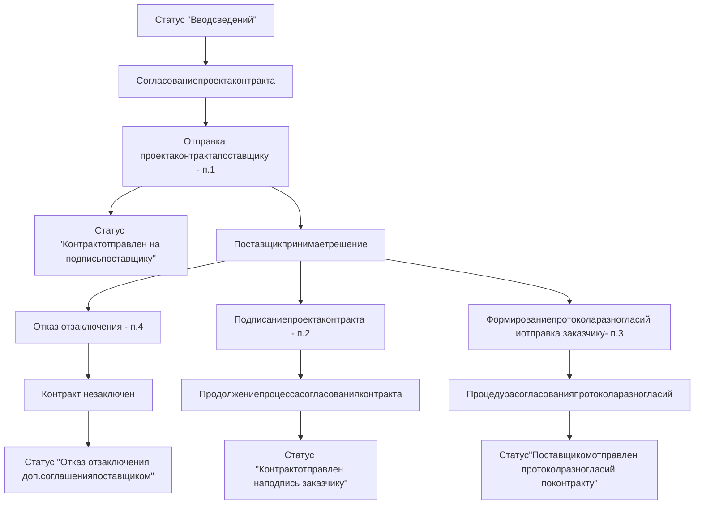
```mermaid
graph TD
    A["Статус &quot;Вводсведений&quot;"] --> B["Согласованиепроектаконтракта"]
    B --> C["Отправка проектаконтрактапоставщику - п.1"]
    C --> D["Статус &quot;Контрактотправлен на подписьпоставщику&quot;"]
    C --> E["Поставщикпринимаетрешение"]
    E --> F["Отказ отзаключения - п.4"]
    E --> G["Подписаниепроектаконтракта - п.2"]
    E --> H["Формированиепротоколаразногласий иотправка заказчику- п.3"]
    F --> I["Контракт незаключен"]
    I --> J["Статус &quot;Отказ отзаключения доп.соглашенияпоставщиком&quot;"]
    G --> K["Продолжениепроцессасогласованияконтракта"]
    K --> L["Статус &quot;Контрактотправлен наподпись заказчику&quot;"]
    H --> M["Процедурасогласованияпротоколаразногласий"]
    M --> N["Статус&quot;Поставщикомотправлен протоколразногласий поконтракту&quot;"]
```

**Рисунок 298 – Процесс согласования проекта контракта**

**Поставщик** имеет возможность:
1. **1. Отказаться от заключения контракта.** В этом случае контракт заключен не будет (Раздел 9.3.4).
2. **2. Сформировать протокол разногласий.** В этом случае будет запущен процесс согласования протокола разногласий (раздел 9.3.5, 9.2.4).
3. **3. Подписать проект контракта** В этом случае процесс согласования контракта будет продолжен по следующей схеме (Рисунок 299).

---

197

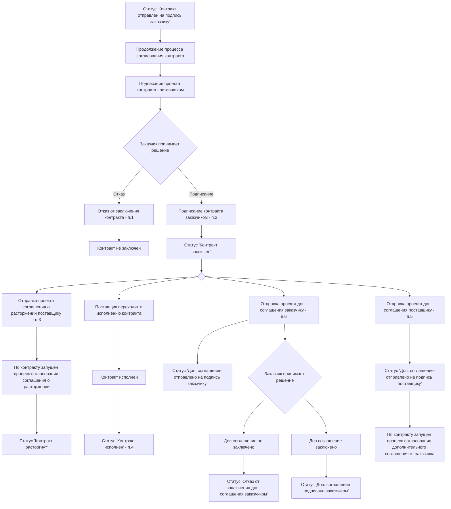
```mermaid
graph TD
    A["Статус 'Контракт отправлен на подпись заказчику'"] --> B["Продолжение процесса согласования контракта"]
    B --> C["Подписание проекта контракта поставщиком"]
    C --> D{"Заказчик принимает решение"}
    D -->|Отказ| E["Отказ от заключения контракта - п.1"]
    E --> F["Контракт не заключен"]
    D -->|Подписание| G["Подписание контракта заказчиком - п.2"]
    G --> H["Статус 'Контракт заключен'"]
    H --> I{" "}
    I --> J["Отправка проекта соглашения о расторжении поставщику - п.3"]
    J --> K["По контракту запущен процесс согласования соглашения о расторжении"]
    K --> L["Статус 'Контракт расторгнут'"]
    I --> M["Поставщик переходит к исполнению контракта"]
    M --> N["Контракт исполнен"]
    N --> O["Статус 'Контракт исполнен' - п.4"]
    I --> P["Отправка проекта доп. соглашения заказчику - п.6"]
    P --> Q["Статус 'Доп. соглашение отправлено на подпись заказчику'"]
    I --> R["Отправка проекта доп. соглашения поставщику - п.5"]
    R --> S["Статус 'Доп. соглашение отправлено на подпись поставщику'"]
    P --> T{"Заказчик принимает решение"}
    T --> U["Доп.соглашение не заключено"]
    U --> V["Статус 'Отказ от заключения доп. соглашения заказчиком'"]
    T --> W["Доп.соглашение заключено"]
    W --> X["Статус 'Доп. соглашение подписано заказчиком'"]
    S --> Y["По контракту запущен процесс согласования дополнительного соглашения от заказчика"]
```

**Рисунок 299 – Продолжение процесса согласования контракта**

**Легенда**
* действия Поставщика
* действия Заказчика

---

198

После того как поставщик подпишет проект контракта, **заказчик** имеет возможность:
3.1. **Отказаться от заключения контракта.** В этом случае контракт заключен не будет (Раздел 9.3.4).
3.2. **Подписать контракт** (раздел 9.3.6).
3.3. **Отозвать проект контракта** (аналогично описанию в начале данного раздела) – возможность доступна для контрактов от региональных заказчиков.

После заключения контракта заказчику будут доступны следующие действия по контракту:
4. **Формирование и отправка соглашения о расторжении (**раздел 9.3.9).
5. **Подтверждение факта исполнение контракта поставщиком** (раздел 9.3.10).
6. **Формирование и отправка дополнительного соглашения** (раздел 9.3.7).

После заключения контракта поставщику будут доступны следующие действия по контракту:
7. **Формирование и отправка дополнительного соглашения** (раздел 9.3.8).

Для заказчика установлены регламентные сроки работы с контрактом: срок рассмотрения протокола разногласий – 48 часов, срок рассмотрения проекта контракта/договора - 48 часов.

Для поставщика установлены регламентные сроки работы с контрактом из ЕАИСТ после победы в котировочной сессии. Поставщик должен рассмотреть проект контракта/договора и выполнить одно из действий (отправить протокол разногласий; отказаться от контракта; подписать проект контракта/договора) в течение 48 часов. При нарушении сроков происходит автоматический отказ поставщика от контракта.

### 9.3.4. **Отказ в подписании контракта**
Заказчик может отказаться от заключения контракта на этапе рассмотрения проекта контракта, посредством нажатия на кнопку «Отказаться от заключения» на странице просмотра (действие совершится сразу без перехода на страницу редактирования).

### 9.3.5. **Согласование протокола разногласий**
Для контрактов из ЕАИСТ и РИС реализовано ограничение на количество Протоколов разногласий в рамках заключения одного контракта между заказчиком и поставщиком. Протокол разногласий может быть только один.

Формирование протокола разногласий доступно Поставщику на этапе проекта контракта (статус «Заключение»). После получения протокола разногласий от Поставщика Заказчик может (Рисунок 300):
* отказаться от протокола разногласий и отправить поставщику новый проект контракта. Процесс согласования проекта контракта будет продолжен (Рисунок 299);
* принять протокол разногласий и отправить поставщику новый проект контракта с учетом протокола разногласий. Процесс согласования проекта контракта будет продолжен Рисунок 299);
* полностью отказаться от заключения контракта. В этом случае контракт заключен не будет.

---

199

Процесс согласования протокола разногласий

Рисунок 300 – Процесс согласования протокола разногласий

## 9.3.6. Подписание контракта

Для того, чтобы подписать контракт, пользователю необходимо нажать кнопку "Подписать проект контракта". Далее необходимо нажать кнопку "Заключить контракт" и подтвердить доступ к сертификату электронной подписи (Рисунок 301).

---

200

Подтверждение доступа к сертификату электронной подписи

**Рисунок 301 – Подтверждение доступа к сертификату электронной подписи**

---

201

После чего откроется модальное окно для просмотра проекта контракта, где также необходимо нажать кнопку "Подписать" (Рисунок 302).

Рисунок 302 – Окно для подписания контракта

**Рисунок 302 – Окно для подписания контракта**

После того, как заказчик подпишет контракт, статус контракта изменится на «Контракт заключен».

**9.3.7. Формирование дополнительного соглашения Заказчиком**

Формирование дополнительного соглашения доступно заказчику в контрактах со статусом «Контракт заключен».

Для того, чтобы сформировать и отправить дополнительное соглашение поставщику заказчику необходимо нажать на кнопку «Сформировать проект доп. соглашения» на странице просмотра. После нажатия создастся страница редактирования, на которой заказчику станет доступна возможность прикрепить файлы дополнительного соглашения и приложения:

---

202

Рисунок 303 – Блок с полями для заполнения информации по дополнительному соглашению

**Рисунок 303 – Блок с полями для заполнения информации по дополнительному соглашению**

После нажатия на кнопку «Отправить поставщику» файл документа будет отправлен поставщику для рассмотрения и подписания.

Процесс согласования дополнительного соглашения между заказчиком и поставщиком аналогичен процессу согласования контракта (подробнее в разделе 9.3.3).

### 9.3.7.1. Замена отправленного дополнительного соглашения

После отправки файла поставщику заказчику будет доступно действие по замене отправленного дополнительного соглашения.

Чтобы заменить файл отправленного дополнительного соглашения пользователю необходимо нажать «Отозвать проект доп. соглашения» (действие совершится сразу без перехода на страницу редактирования) и повторить действия по отправке формированию и отправке дополнительного соглашения.

### 9.3.7.2. Отказ от текущей версии дополнительного соглашения

После отправки файла поставщику заказчику будет доступно действие по отказу от текущей версии дополнительного соглашения, которое было отправлено на подпись поставщику.

Чтобы отказаться от текущей версии дополнительного соглашения пользователю необходимо нажать «Отказаться от заключения доп. соглашения» (действие совершится сразу без перехода на страницу редактирования).

### 9.3.8. Формирование дополнительного соглашения Поставщиком

Формирование дополнительного соглашения доступно поставщику в контрактах со статусом:

* Отказ от заключения доп. соглашения заказчиком
* Отказ от заключения доп. соглашения поставщиком
* Доп. соглашение подписано заказчиком
* Отказ от заключения соглашения о расторжении поставщиком
* Отказ от заключения соглашения о расторжении заказчиком
* Контракт заключен

---

203

После отправки проекта дополнительного соглашения поставщиком для заказчика доступны 2 действия аналогично последнему этапу при заключении контракта:
* Отказаться от заключения доп. соглашения,
* Подписать доп. соглашение.

## 9.3.9. Формирование соглашения о расторжении Заказчиком

Формирование соглашения о расторжении доступно заказчику в контрактах со статусом:
* Поставщиком отправлен протокол разногласий по соглашению о расторжении
* Контракт заключен
* Проект соглашения о расторжении отозван заказчиком
* Отказ от заключения соглашения о расторжении заказчиком
* Отказ от заключения доп. соглашения заказчиком
* Отказ от заключения соглашения о расторжении поставщиком
* Отказ от заключения доп. соглашения поставщиком
* Доп. соглашение подписано заказчиком

Для того, чтобы сформировать и отправить соглашение о расторжении поставщику заказчику необходимо нажать на кнопку «Сформировать проект соглашения о расторжении» на странице просмотра. После нажатия создастся страница редактирования, на которой заказчику станет доступна возможность прикрепить файлы соглашения о расторжении и приложения:

Документы

**Рисунок 304 – Блок с полями для заполнения информации по дополнительному соглашению**

После нажатия на кнопку «Отправить поставщику» файл документа будет отправлен поставщику для рассмотрения и подписания.

Процесс согласования соглашения о расторжении между заказчиком и поставщиком аналогично процессу согласования контракта (подробнее в разделе 9.3.3).

## 9.3.10. Исполнение контракта

Исполнение контракта возможно только для контракта, имеющего статус «Контракт заключен» или «Доп. соглашение подписано заказчиком».

---

204

Заказчик должен открыть заключенный контракт и нажать кнопку «Установить статус Исполнен» (действие совершится сразу без перехода на страницу редактирования). Статус контракта изменится на «Контракт исполнен».

### 9.3.11. Просмотр и выгрузка документов контракта
Просмотр проекта контракта доступен в разделе «Документы» (Рисунок 305 (1)) на странице просмотра и на странице редактирования контракта.

Рисунок 305 – Просмотр документов контракта

**Рисунок 305 – Просмотр документов контракта**

По нажатию на наименование файла (Рисунок 305 (2)) загрузится файл.
По нажатию на кнопку «Скачать подписи» (Рисунок 305 (3)) загрузится архив с файлом и с электронными подписями.

### 9.3.12. Создания проекта контракта и направление прямой ссылки или QR-кода поставщикам, которые ещё не зарегистрированы на Портале поставщиков

Для создания прямого контракта по ссылке для не зарегистрированных поставщиков необходимо в разделе «Мои контракты» нажать кнопку «Создать контракт для приглашения поставщика» (Рисунок 306).

Рисунок 306 – Кнопка «Создать контракт для приглашения поставщика»

**Рисунок 306 – Кнопка «Создать контракт для приглашения поставщика»**

Откроется страница проекта контракта. Заказчику необходимо нажать кнопку «Сформировать проект контракта» для заполнения информации о контракте.

| Наименование поля                                            | Обяз-сть | Пояснение к заполнению поля       |
| ------------------------------------------------------------ | -------- | --------------------------------- |
| \*\*Блок «Основная информация»\*\*                           |          |                                   |
| Номер контракта                                              | Да       | Ввод уникального номера контракта |
| Признак «Контракт начинает действовать с момента подписания» | Нет      | Возможность установить признак    |


---

205

| \*\*Наименование поля\*\*                      | \*\*Обяз-сть\*\*                                     | \*\*Пояснение к заполнению поля\*\*                                                            |
| ---------------------------------------------- | ---------------------------------------------------- | ---------------------------------------------------------------------------------------------- |
| \*\*Блок «Основная информация»\*\*             |                                                      |                                                                                                |
| Период действия контракта                      | Да                                                   | Выбор периода действия контракта с помощью встроенного календаря                               |
| Предмет контракта                              | Да                                                   | Ввод предмета контракта                                                                        |
| Заключение происходит в соответствии с законом | Нет                                                  | Выбор закона основания заключения контракта                                                    |
| Способ размещения закупки                      | Нет                                                  | Выбор способа размещения закупки                                                               |
| Место заключения                               | Да                                                   | Ввод места заключения                                                                          |
| Идентификационный код закупки (ИКЗ)            | Да                                                   | Ввод ИКЗ                                                                                       |
| Источник финансирования                        | Да                                                   | Ввод источника финансирования                                                                  |
| НДС                                            | Да                                                   | Возможность установить признак: «Включая НДС» или «НДС не облагается»                          |
| Основание отсутствия НДС                       | Да (в случае установки признака «НДС не облагается») | Ввод комментария                                                                               |
| НДС не облагается                              | Нет                                                  | Возможность установить признак                                                                 |
| Сумма                                          | Да                                                   | Ввод суммы контракта                                                                           |
| Аванс                                          | Нет                                                  | Возможность установить признак                                                                 |
| Размер аванса                                  | Нет                                                  | Ввод размера аванса                                                                            |
| \*\*Сведения о заказчике\*\*                   |                                                      |                                                                                                |
| Подписант                                      | Да                                                   | Поле заполняется автоматически. Есть возможность изменить подписанта с помощью справочника     |
| Общие сведения                                 | Да                                                   | Поле заполняется автоматически.                                                                |
| Банковские реквизиты                           | Да                                                   | Поле заполняется автоматически.                                                                |
| Контактные данные                              | Да                                                   | Поле заполняется автоматически.                                                                |
| \*\*Сведения о поставщике\*\*                  |                                                      |                                                                                                |
| Поиск существующих                             | Да                                                   | Выбор из поставщиков, кому ранее направлялся контракт                                          |
| \*\*Создание нового\*\*                        |                                                      |                                                                                                |
| Тип компании                                   | Да                                                   | Выбор типа компании                                                                            |
| Наименование                                   | Да                                                   | Ввод наименования                                                                              |
| Инн                                            | Да                                                   | Ввод ИНН                                                                                       |
| КПП                                            | Да                                                   | Ввод КПП                                                                                       |
| ОГРН                                           | Да                                                   | Ввод ОГРН                                                                                      |
| \*\*Остальные поля и блоки\*\*                 |                                                      |                                                                                                |
| Сведения о спецификациях                       | Да                                                   | Заполняется информация о спецификации контракта                                                |
| Сведения о поставке                            | Да                                                   | Заполняется информация о этапах поставки                                                       |
| Файл документа контракта                       | Да                                                   | Для отправки проекта контракта поставщику на согласование необходимо прикрепить файл контракта |


---

206

После заполнения всех обязательных полей формы и прикрепления файла контракта пользователь должен сохранить введенные сведения по контракту и нажать «Отправить поставщику».

При нажатии на кнопку «Сохранить» не происходит проверка корректности заполнения полей.

При нажатии на кнопку «Отправить поставщику» происходит проверка корректности заполнения полей.

После проверки корректности заполнения Заказчику отобразится проект контракта со ссылкой и QR-кодом для отправки Поставщику (Рисунок 307).

**Основная информация**

**Статус**: ПОСТАВЩИКУ НАПРАВЛЕНО ПРИГЛАШЕНИЕ НА ЗАКЛЮЧЕНИЕ КОНТРАКТА
**Приглашение поставщика**: https://zakupki.mos.ru//contractInvitation/1a5935f7-86f7-4dad-ba49-98362c8d86f4

QR-код и ссылки на контракт для доступа без авторизации

Рисунок 307 - QR-код и ссылки на контракт для доступа без авторизации

При нажатии на иконку поделиться иконка поделиться Заказчик может выбрать способ отправки приглашения Поставщику:
* Копировать ссылку;
* Поделиться в почте.

Для подписания контракта по прямой ссылке Поставщику необходимо пройти регистрацию на Портале Поставщиков.

При нажатии на «Доступные действия» Заказчику отображается кнопка «Отозвать проект контракта». При нажатии на которую появляется модальное окно с подтверждением действия и текстовым полем для комментарий (Рисунок 308). Заказчик имеет возможность: отменить действие нажатием на кнопку «Отменить»; подтвердить действие нажатием на кнопку «Подтвердить».

---

207

Модальное окно «Подтверждение отзыва проекта контракта»

**Вы действительно хотите отозвать проект контракта?**

Коментарий

    

Отменить Подтвердить

Рисунок 308 – Модальное окно «Подтверждение отзыва проекта контракта»

---

208

## 10. Планы и планы-графики

На портале поставщиков можно просматривать планы и планы-графиков закупок, размещенные в ЕИС (<u>http://zakupki.gov.ru</u>).

## 10.1. Реестр планов закупок и планов-графиков закупок

Для того, что перейти в реестр планов и планов-графиков необходимо в **меню Портала** **поставщиков** (Рисунок 28) нажать на **«Планы и планы-графики»**.

Страница поиска планов и планов-графиков закупок

**Рисунок 309 – Страница поиска планов и планов-графиков закупок**

### 10.1.1. Поиск планов и планов-графиков закупок

Поиск планов и планов-графиков закупок осуществляется по одному (или нескольким) из следующих критериев (**Таблица 25**, Рисунок 309):

**Таблица 25 – Критерии поиска планов и план-графиков закупок**

| \*\*Фильтр\*\*                 | \*\*Значение фильтра\*\*                                                                                          |
| ------------------------------ | ----------------------------------------------------------------------------------------------------------------- |
| Заказчик (название или ИНН)    | Ввод наименования заказчика или его части                                                                         |
| В подведомственных             | Поле отметки, устанавливается флажок при поиске планов закупок среди подведомственных организаций заказчика       |
| Реестровый номер               | Ввод реестрового номера плана                                                                                     |
| «Предмет объекта закупки»      | Текстовое поле                                                                                                    |
| «Год»                          | Выбор значения из выпадающего списка                                                                              |
| «Произвольный период», с:…по:» | Выбор периода осуществляется с помощью встроенного календаря                                                      |
| «44-ФЗ» и «223-ФЗ»             | Закон, регламентирующий закупки – поле отметки, устанавливается флажок при поиске закупок по определенному закону |


---

209

| «План-график»                                                 | Возможность установить признак       |
| ------------------------------------------------------------- | ------------------------------------ |
| «План закупок»                                                | Возможность установить признак       |
| «Способ размещения закупки (заказа) / определения поставщика» | Выбор значения из выпадающего списка |


После ввода перечисленных критериев необходимо нажать на кнопку «Найти», в результате чего отображаются результаты поиска планов закупок, соответствующие введенным критериям (Рисунок 309).

## 10.1.2. Отображение результатов поиска планов и планов-графиков закупок

В реестре выводятся карточки планов и планов-графиков (Рисунок 310), которые содержат следующую информацию:
- Реестровый номер плана закупок в виде гиперссылки, ведущей на карточку плана закупок;
- Наименование заказчика;
- Тип плана закупок;
- Год и/или период плана.

| Реестровый номер                                                                                            | Год/Период плана        |
| ----------------------------------------------------------------------------------------------------------- | ----------------------- |
| 44201403732000751001                                                                                        | 01.01.2014 - 31.12.2014 |
| \*\*Заказчик\*\*                                                                                            | \*\*Тип плана\*\*       |
| Агентство по обеспечению мероприятий гражданской защиты Центрального административного округа города Москвы | План-график 44-ФЗ       |


**Рисунок 310 – Карточка плана-графика в реестре**

## 10.2. Страница плана-графика закупок и плана закупок

При нажатии на реестровый номер плана откроется карточка плана-графика закупок или плана закупок<sup>6</sup>, содержащая следующую информацию:
- Сведения о плане (Рисунок 311):
  а) Номер плана;
  б) Год/Период действия плана;
  в) Дата утверждения;
  г) Обоснование внесения изменений.

| ПЛАН-ГРАФИК                    |                               |
| ------------------------------ | ----------------------------- |
| 202203732000973001             |                               |
| Год/Период действия плана      | 2022/01.01.2022 no 31.12.2022 |
| Дата утверждения               | 10.12.2020                    |
| Обоснование внесения изменений |                               |


**Рисунок 311 – Сведения о плане-графике**

- Сведения о заказчике (Рисунок 312):
  а) полное наименование, местонахождение, телефон, факс и адрес электронной почты государственного заказчика;
  б) идентификационный номер налогоплательщика (ИНН);
  в) код причины постановки на учет (КПП);

<sup>6</sup> «План закупок» отменен с 1 октября 2019 года Федеральным законом от 01.05.2019 N 71-ФЗ.

---

210

г) код по Общероссийскому классификатору территорий муниципальных образований (ОКТМО);
д) ОГРН;
е) ОКАТО
ж) ФИО сотрудника;
з) Факс.

**ЗАКАЗЧИК**

Агентство по обеспечению мероприятий гражданской защиты
Центрального административного округа города Москвы

ИНН/КПП | 7706175446 / 7706175446
--- | ---
ОГРН | 1027700265230
Адрес организации | 119049 г. Москва, ул. Донская, д.6
Телефон | 
Адрес электронной почты | 
Код ОКТМО | 45384000000
ОКАТО | 45286596000
ФИО сотрудника | 
Факс | 

**Рисунок 312 – Сведения о заказчике**

— Таблица основных сведений об объектах закупки (Рисунок 313):

| №      | Наименование товара/работы/услуги                                                         | Объём средств на закупку, руб. | Дата, период размещения | Общественное обсуждение |
| ------ | ----------------------------------------------------------------------------------------- | ------------------------------ | ----------------------- | ----------------------- |
| П44... | ОКАЗАНИЕ В 2014 ГОДУ УСЛУГ ПО ТЕХНИЧЕСКОМУ ОБСЛУЖИВАНИЮ И РЕМОНТУ АВТОМАТОВ ОЧИСТКИ ВОДЫ. | 46 000,00                      | —                       | Нет                     |
| П44... | ОКАЗАНИЕ В 2014 ГОДУ УСЛУГ ПО ДЕЗИНФЕКЦИИ ПОМЕЩЕНИЙ.                                      | 54 000,00                      | —                       | Нет                     |
| П44... | ЗАКУПКА В 2014 ГОДУ ЭКСПЛУАТАЦИОННЫХ УСЛУГ                                                | 180 000,00                     | —                       | Нет                     |
| П44... | ОКАЗАНИЕ В 2014 ГОДУ УСЛУГ СПЕЦИАЛЬНОЙ СВЯЗИ ДЛЯ ОРГАНОВ ИСПОЛНИТЕЛЬНОЙ ВЛАСТИ.           | 63 400,00                      | —                       | Нет                     |


**Рисунок 313 – Сведения об объектах закупки**

Если таблица объектов закупки содержит много позиций, то для перехода между страницами таблицы рекомендуется использовать полосу навигации по страницам с возможностями перехода на страницу с конкретным номером, следующую, предыдущую, первую или последнюю страницы.

При нажатии на номер объекта закупки в плане открывается карточка объекта закупки (Рисунок 314), которая содержит:
а) Номер объекта закупок;
б) Наименование мероприятия государственной (муниципальной) программ либо непрограммные направления деятельности;

---

211

в) Ожидаемый результат реализации мероприятия государственной (муниципальной) программы;
г) Наименование объекта закупки;
д) Описание объекта закупки;
е) Объем финансового обеспечения;
ж) Количество (объем) планируемых к закупке товаров, работ, услуг;
з) Единица измерения объекта закупки;
и) Сроки (периодичность) осуществления планируемых закупок;
к) Дополнительная информация в соответствии с пунктом 7 части 2 статьи 17 № 44-ФЗ;
л) Информация о проведении общественного обсуждения закупки;
м) Обоснование внесения изменений.

| ОБЪЕКТЫ ЗАКУПКИ ПО 44-ФЗ<br/>Номер в плане<br/>Заказчик<br/>Наименование предмета контракта (договора):<br/>Классификация по КБК (КОСГУ)<br/>Глава<br/>839<br/>Целевая статья<br/>9315010<br/>КОСГУ<br/>225<br/>ОКВЭД1<br/>Начальная (максимальная) цена контракта, рублей:<br/>Размер выплат в текущем году исполнения контракта, рублей:<br/>Валюта контракта:<br/>Условия финансового обеспечения исполнения контракта (включая размер аванса):<br/>Обоснование внесения изменений: | ОБЪЕКТЫ ЗАКУПКИ ПО 44-ФЗ<br/>44201403732000751001000001<br/>Агентство по обеспечению мероприятий гражданской защиты Центрального административного округа города Москвы<br/>Оказание в 2014 году услуг по техническому обслуживанию и ремонту автоматов очистки воды.<br/>Классификация по КБК (КОСГУ)<br/>Раздел (подраздел)<br/>030<br/>Вид расходов<br/>3244<br/>КОСГУ<br/>225<br/>Предоставление услуг по монтажу, ремонту и техническому обслуживанию прочего оборудования общего назначения, не включенного в другие группировки<br/>46 000.00<br/>46 000.00<br/>Российский рубль<br/>Условия финансового обеспечения исполнения контракта (включая размер аванса):<br/>Обоснование внесения изменений: | ОБЪЕКТЫ ЗАКУПКИ ПО 44-ФЗ<br/>44201403732000751001000001<br/>Агентство по обеспечению мероприятий гражданской защиты Центрального административного округа города Москвы<br/>Оказание в 2014 году услуг по техническому обслуживанию и ремонту автоматов очистки воды.<br/>Классификация по КБК (КОСГУ)<br/>Раздел (подраздел)<br/>030<br/>Вид расходов<br/>3244<br/>КОСГУ<br/>225<br/>Предоставление услуг по монтажу, ремонту и техническому обслуживанию прочего оборудования общего назначения, не включенного в другие группировки<br/>46 000.00<br/>46 000.00<br/>Российский рубль<br/>Условия финансового обеспечения исполнения контракта (включая размер аванса):<br/>Обоснование внесения изменений: | ОБЪЕКТЫ ЗАКУПКИ ПО 44-ФЗ<br/>44201403732000751001000001<br/>Агентство по обеспечению мероприятий гражданской защиты Центрального административного округа города Москвы<br/>Оказание в 2014 году услуг по техническому обслуживанию и ремонту автоматов очистки воды.<br/>Классификация по КБК (КОСГУ)<br/>Раздел (подраздел)<br/>030<br/>Вид расходов<br/>3244<br/>КОСГУ<br/>225<br/>Предоставление услуг по монтажу, ремонту и техническому обслуживанию прочего оборудования общего назначения, не включенного в другие группировки<br/>46 000.00<br/>46 000.00<br/>Российский рубль<br/>Условия финансового обеспечения исполнения контракта (включая размер аванса):<br/>Обоснование внесения изменений: | ОБЪЕКТЫ ЗАКУПКИ ПО 44-ФЗ<br/>44201403732000751001000001<br/>Агентство по обеспечению мероприятий гражданской защиты Центрального административного округа города Москвы<br/>Оказание в 2014 году услуг по техническому обслуживанию и ремонту автоматов очистки воды.<br/>Классификация по КБК (КОСГУ)<br/>Раздел (подраздел)<br/>030<br/>Вид расходов<br/>3244 Предоставление услуг по монтажу, ремонту и техническому обслуживанию прочего оборудования общего назначения, не включенного в другие группировки<br/>46 000.00<br/>46 000.00<br/>Российский рубль |
| -------------------------------------------------------------------------------------------------------------------------------------------------------------------------------------------------------------------------------------------------------------------------------------------------------------------------------------------------------------------------------------------------------------------------------------------------------------------------------------- | ------------------------------------------------------------------------------------------------------------------------------------------------------------------------------------------------------------------------------------------------------------------------------------------------------------------------------------------------------------------------------------------------------------------------------------------------------------------------------------------------------------------------------------------------------------------------------------------------------------------------------------------------------------------------------------------------------------- | ------------------------------------------------------------------------------------------------------------------------------------------------------------------------------------------------------------------------------------------------------------------------------------------------------------------------------------------------------------------------------------------------------------------------------------------------------------------------------------------------------------------------------------------------------------------------------------------------------------------------------------------------------------------------------------------------------------- | ------------------------------------------------------------------------------------------------------------------------------------------------------------------------------------------------------------------------------------------------------------------------------------------------------------------------------------------------------------------------------------------------------------------------------------------------------------------------------------------------------------------------------------------------------------------------------------------------------------------------------------------------------------------------------------------------------------- | ----------------------------------------------------------------------------------------------------------------------------------------------------------------------------------------------------------------------------------------------------------------------------------------------------------------------------------------------------------------------------------------------------------------------------------------------------------------------------------------------------------------------------------------------------------------- |
| Наименование товара, работ, услуг                                                                                                                                                                                                                                                                                                                                                                                                                                                      | Международное непатентованное наименование (химическое группировочное наименование) лекарственного средства                                                                                                                                                                                                                                                                                                                                                                                                                                                                                                                                                                                                   | Минимально необходимые требования предъявляемые к товару, работе, услуге                                                                                                                                                                                                                                                                                                                                                                                                                                                                                                                                                                                                                                      | Наименование товара, работ, услуг по ОКПД                                                                                                                                                                                                                                                                                                                                                                                                                                                                                                                                                                                                                                                                     | ОКПД                                                                                                                                                                                                                                                                                                                                                                                                                                                                                                                                                              |
| Услуги по техническому обслуживанию и ремонту прочего оборудования специального назначения, не включенного в другие группировки                                                                                                                                                                                                                                                                                                                                                        | —                                                                                                                                                                                                                                                                                                                                                                                                                                                                                                                                                                                                                                                                                                             | Полугодовая замена фильтрующих элементов в четырех автоматах Заказчика.                                                                                                                                                                                                                                                                                                                                                                                                                                                                                                                                                                                                                                       | —                                                                                                                                                                                                                                                                                                                                                                                                                                                                                                                                                                                                                                                                                                             | —                                                                                                                                                                                                                                                                                                                                                                                                                                                                                                                                                                 |


**Рисунок 314 – Сведения об объектах закупки в карточке плана закупок**

---

212

## 11. Единый реестр закупок

Просмотреть все закупки Портала поставщиков можно с помощью единого реестра закупок - в **меню Портала поставщиков** (Рисунок 28) нажать на «**Единый реестр закупок**».

**Единый реестр закупок** разделен на 5 вкладок (Рисунок 315):

− **Все закупки.** На данной вкладке отображаются все закупки на портале поставщиков;
− **Котировочные сессии.** На вкладке отображаются все закупки типа «Котировочные сессии» на портале поставщиков;
− **Закупки по потребностям.** На вкладке отображаются все закупки по потребностям на портале поставщиков;
− **Конкурентные процедуры.** На вкладке отображаются все закупки по конкурентным процедурам.
− **В2В-закупки.** На вкладке отображаются все закупки по потребностям на портале поставщиков с предустановленным фильтром «В2В заказчики».

Рисунок 315 – Раздел «Единый реестр закупок»

**Рисунок 315 – Раздел «Единый реестр закупок»**

## 11.1. Фильтры единого реестра закупок

На каждой вкладке выводятся карточки закупок в соответствии с настроенными в системе фильтрами.

Для каждой вкладки есть общий набор фильтров, с помощью которого можно осуществлять поиск закупок в разрезе выбранной вкладки. С помощью кнопки «**Показать фильтры**» можно открыть перечень общих фильтров (Рисунок 316), который содержит следующие поля (Таблица 26).

**Таблица 26 – Критерии поиска закупок**

| Фильтр                       | Значение фильтра                                                                |
| ---------------------------- | ------------------------------------------------------------------------------- |
| \*\*Регион\*\*               | Выбор интересующего региона деятельности/поставки. Возможен множественный выбор |
| \*\*Наименование закупки\*\* | Ввод наименования закупки или его части                                         |
| \*\*Начальная цена\*\*       | Ввод диапазона начальной цены (с …; по …)                                       |
| \*\*Статус\*\*               | Выбор одного из следующих значений:<br/>• \*\*Все закупки.\*\*                  |


---

213

* **Активные**. При выборе данного параметра будут доступны закупки со статусами:
    * Для Закупок по 44-ФЗ и 223-ФЗ: «Подача заявок», «Работа комиссии»;
    * Для котировочных сессии: «Активная»;
    * Для закупок по потребностям: «Прием предложений».
* **Завершенные**. При выборе данного параметра будут доступны закупки со статусами:
    * Для Закупок по 44-ФЗ и 223-ФЗ: «Завершено»;
    * Для котировочных сессии: «Проведена»;
    * Для закупок по потребностям: «Прием предложений завершен».

Интерфейс единого реестра закупок с фильтрами

**Рисунок 316 – Общие фильтры единого реестра закупок**

Для того, чтобы уточнить поиск необходимо нажать кнопку «Показать расширенные фильтры». Расширенные фильтры для всех типов закупок отражены ниже (**Рисунок 317**, **Таблица 27**).

| \*\*Фильтр\*\*                                             | \*\*Значение фильтра\*\*                                              |
| ---------------------------------------------------------- | --------------------------------------------------------------------- |
| *\*\*Таблица 27 – Расширенные* критерии поиска закупок\*\* |                                                                       |
| \*\*Заказчик\*\*                                           | Ввод наименования заказчика, ИНН или его части                        |
| \*\*Номер закупки\*\*                                      | Ввод номера закупки или его части                                     |
| \*\*Дата публикации\*\*                                    | Выбор периода публикации с помощью встроенного календаря              |
| \*\*Окончание подачи заявок\*\*                            | Выбор периода окончания подачи заявок с помощью встроенного календаря |


---

214

| \*\*Настройка отображаемых закупок\*\* | Доступен для вкладки «Все закупки». Необходимо выбрать интересующие типы закупок:<br/>• Котировочные сессии;<br/>• Закупки по потребностям;<br/>• Конкурентные процедуры |
| -------------------------------------- | ------------------------------------------------------------------------------------------------------------------------------------------------------------------------ |


Расширенный фильтры для всех типов закупок

**Рисунок 317 – Расширенный фильтры для всех типов закупок**

При выборе типа закупок пользователю станет доступен соответствующий блок фильтров, относящийся к выбранному типу.

Для котировочных сессий доступны следующие расширенные фильтры (Таблица 28, Рисунок 318):

| \*\*Фильтр\*\*                        | \*\*Значение фильтра\*\*                                                                                                                                                                                                                                                                                                                                       |
| ------------------------------------- | -------------------------------------------------------------------------------------------------------------------------------------------------------------------------------------------------------------------------------------------------------------------------------------------------------------------------------------------------------------- |
| \*\*Заказчик\*\*                      | Ввод наименования заказчика или его части                                                                                                                                                                                                                                                                                                                      |
| \*\*Номер закупки\*\*                 | Ввод номера закупки или его части                                                                                                                                                                                                                                                                                                                              |
| \*\*Статус\*\*                        | Выбор статуса:<br/>• Активная – можно участвовать;<br/>• Проведена – поставщики приняли участие, и котировочная сессия состоялась;<br/>• Снята с публикации – заказчик отказался от котировочной сессии до того, как был выявлен победитель;<br/>• Не состоялась – в котировочной сессии не принял участие ни один поставщик<br/>Возможен множественный выбор. |
| \*\*Наличие ставок\*\*                | Выбор одного из значений: «Есть», «Нет» и «Все»                                                                                                                                                                                                                                                                                                                |
| \*\*Закупка с неизвестным объемом\*\* | Выбор одного из значений: «Да», «Нет» и «Все»                                                                                                                                                                                                                                                                                                                  |
| \*\*Электронное исполнение\*\*        | Выбор одного из значений: «Да», «Нет» и «Все»                                                                                                                                                                                                                                                                                                                  |
| \*\*Дата публикации\*\*               | Выбор периода публикации с помощью встроенного календаря                                                                                                                                                                                                                                                                                                       |


---

215

| \*\*Фильтр\*\*                                   | \*\*Значение фильтра\*\*                                                  |
| ------------------------------------------------ | ------------------------------------------------------------------------- |
| \*\*Окончание подачи заявок\*\*                  | Выбор периода окончания подачи заявок с помощью встроенного календаря     |
| \*\*Текущая цена\*\*                             | Выбор диапазона текущей цены котировочной сессии                          |
| \*\*Начало подачи предложений\*\*                | Выбор периода подачи предложений для котировочных сессий                  |
| \*\*Вид продукции\*\*                            | Выбор вида продукции из справочника                                       |
| \*\*Основание для заключения<br/>контракта\*\*   | Выбор одного или нескольких значений из справочника                       |
| \*\*Способ организации закупки\*\*               | Выбор одного из значений: «Один заказчик», «Совместные закупки» и «Все»   |
| \*\*Обеспечение контракта\*\*                    | Выбор одного из значений: «Требуется», «Не требуется» и «Все»             |
| \*\*Время проведения<br/>котировочной сессии\*\* | Возможен множественный выбор:<br/>• 3 часа;<br/>• 6 часов;<br/>• 24 часа. |


Рисунок 318 – Расширенные фильтры для котировочных сессий

**Рисунок 318 – Расширенные фильтры для котировочных сессий**

Для закупок по потребностям и В2В закупок доступны следующие расширенные фильтры (Таблица 29, **Рисунок 319**).

**Таблица 29 – Критерии поиска закупок по потребностям и В2В закупок**

| Фильтр                   | Значение фильтра                          |
| ------------------------ | ----------------------------------------- |
| Заказчик                 | Ввод наименования заказчика или его части |
| Номер закупки            | Ввод номера закупки или его части         |
| Реестровый номер закупки | Ввод номера закупки или его части         |
| Статус                   | Выбор статуса:                            |


---

216

| \*\*Фильтр\*\*                     | \*\*Значение фильтра\*\*                                                                                                     |
| ---------------------------------- | ---------------------------------------------------------------------------------------------------------------------------- |
|                                    | • Активная – в закупке можно участвовать;<br/>• Проведена – поставщики приняли участие, и закупка по потребности состоялась. |
| Избранное                          | Выбор избранного<br/>• Моё<br/>• Назначенное мной                                                                            |
| Наличие ставок                     | Выбор одного из значений: «Есть», «Нет» и «Все»                                                                              |
| Закупка с неизвестным объемом      | Выбор одного из значений: «Да», «Нет» и «Все»                                                                                |
| Дата публикации                    | Выбор периода публикации с помощью встроенного календаря                                                                     |
| Окончание подачи заявок            | Выбор периода окончания подачи заявок с помощью встроенного календаря                                                        |
| ОКПД2                              | Выбор одного или нескольких значений из справочника                                                                          |
| Основание для заключения контракта | Выбор одного или нескольких значения из справочника                                                                          |
| Заказчик физическое лицо           | Выбор одного из значений: «Да», «Нет» и «Все»                                                                                |
| Заказчик коммерческая организация  | Выбор одного из значений: «Да», «Нет» и «Все»                                                                                |
| Несколько лотов                    | Выбор одного из значений: «Да», «Нет» и «Все»                                                                                |
| Требования к обеспечению контракта | Выбор одного из значений: «Да», «Нет» и «Все»                                                                                |
| Требования к обеспечению заявки    | Выбор одного из значений: «Да», «Нет» и «Все»                                                                                |


---

217

Расширенные фильтры для закупок по потребностям и В2В закупок

**Рисунок 319 – Расширенные фильтры для закупок по потребностям и В2В закупок**

Для конкурентных процедур доступны следующие расширенные фильтры (Таблица 30, Рисунок 320).

**Таблица 30 – Критерии поиска конкурентных процедур**

| \*\*Фильтр\*\*           | \*\*Значение фильтра\*\*                                                                                       |
| ------------------------ | -------------------------------------------------------------------------------------------------------------- |
| Заказчик                 | Ввод наименования заказчика или его части                                                                      |
| Номер закупки            | Ввод номера закупки или его части                                                                              |
| Статус                   | Выбор статуса:<br/>• Подача заявок<br/>• Работа комиссии;<br/>• Отменено;<br/>• Завершено;<br/>• Запланировано |
| Организационные признаки | Возможность установить один или несколько признаков:<br/>• СМП;<br/>• УИС;<br/>• Организация инвалидов         |
| Дата публикации          | Выбор периода публикации с помощью встроенного календаря                                                       |


---

218

| Фильтр                    | Значение фильтра                                                                                                                                           |
| ------------------------- | ---------------------------------------------------------------------------------------------------------------------------------------------------------- |
| Окончание подачи заявок   | Выбор периода окончания подачи заявок с помощью встроенного календаря                                                                                      |
| Дата завершения торгов    | Выбор периода завершения торгов с помощью встроенного календаря                                                                                            |
| Тип закупок               | Возможность выбора одного или нескольких типов закупок:<br/>• 223-ФЗ;<br/>• 44-ФЗ;<br/>• Конкурентные процедуры (отбор претендентов на получение субсидий) |
| Способ размещения закупки | Выбор одного значения из справочника                                                                                                                       |


Рисунок 320 – Расширенные фильтры для конкурентных процедурам

**Рисунок 320 – Расширенные фильтры для конкурентных процедурам**

После того, как все необходимые поля фильтров будут заполнены, необходимо нажать кнопку **«Применить»**.

Для отображения реестра без фильтров необходимо нажать на кнопку **«Сбросить»**.

Для того, чтобы скрыть расширенные фильтры необходимо нажать кнопку **«Скрыть расширенные фильтры»**. Чтобы скрыть все фильтры необходимо нажать кнопку **«Скрыть фильтры»**.

## 11.2. Сохранение фильтров в едином реестре закупок

В едином реестре можно сохранить часто используемый набор фильтров, для этого необходимо:

1. Авторизоваться на Портале поставщиков,

---

219

2. На странице единого реестра закупок установить параметры поиска в основных и/или расширенных фильтров,

Интерфейс фильтров поиска в едином реестре закупок с выбранными параметрами: регион (г Москва, обл Московская), начальная цена (от 300 000), наименование закупки (Пожарная сигнализация) и статус (Активные)

3. Нажать кнопку «Сохранить как шаблон»

Кнопка «Сохранить как шаблон» в интерфейсе фильтров

4. В открывшемся модальном окне ввести наименование сохраняемого шаблона,

Модальное окно «Сохранить набор фильтров как шаблон поиска» с полем для ввода названия шаблона «Пожарная сигнализация. Москва и Область»

5. Нажать кнопку «Сохранить»,

Модальное окно «Сохранить набор фильтров как шаблон поиска» с выделенной кнопкой «Сохранить»

Чтобы применить ранее сохраненный шаблон, необходимо:
1. Авторизоваться на Портале поставщиков.
2. Перейти в единый реестр закупок.
3. Нажать кнопку «Мои шаблоны».

---

220

Интерфейс фильтров поиска закупок

4. В открывшемся модальном окне нажать на наименование шаблона.

Модальное окно «Мои шаблоны поиска»

После чего ранее сохраненные фильтры автоматически применятся.

Чтобы удалить шаблон, необходимо:
1. Авторизоваться на Портале поставщиков.
2. Перейти в единый реестр закупок.
3. Нажать кнопку «Мои шаблоны».

Интерфейс фильтров поиска закупок

В открывшемся модальном окне нажать на кнопку «Удалить» напротив шаблона.

Фрагмент модального окна с кнопкой «Удалить»

## 11.3. **Создание подписок с помощью фильтра**

В едином реестре закупок можно создать новую подписку на основании выбранных фильтров. В подписке будут учтены только те фильтры из реестра, которые используются в подписке.

Для этого необходимо:
1. Авторизоваться на Портале поставщиков,
2. На странице единого реестра закупок установить параметры поиска в основных и/или расширенных фильтров,
3. Нажать кнопку «Подписаться»,

---

221

Интерфейс фильтрации закупок

4. Продолжить работу с подпиской в соответствии с разделом 4.3.3.

## 11.4. Карточки закупок

Карточка котировочной сессии (Рисунок 321) содержит:
− Тип закупки;
− Номер закупки;
− Наименование закупки;
− Наименование заказчика;
− Даты проведения;
− Статус закупки;
− Начальная цена;
− Регион;
− Возможная ставка (доступно только авторизованному пользователю);
− Количество ставок (доступно только авторизованному пользователю);
− Наименование закона.

Карточка котировочной сессии

**Рисунок 321 – Карточка котировочной сессии в едином реестре закупок**

Карточка закупки по потребности (Рисунок 322) содержит:
− Тип закупки;
− Номер закупки;
− Наименование закупки;
− Наименование заказчика;
− Даты проведения;
− Статус закупки;
− Начальная цена;
− Регион;

---

222

— Количество предложений;
— Наименование закона.

Закупка по потребностям 3794068 ПРИЕМ ПРЕДЛОЖЕНИЙ ЗАВЕРШЕН Поставка печатных изданий МУНИЦИПАЛЬНОЕ БЮДЖЕТНОЕ ДОШКОЛЬНОЕ ОБРАЗОВАТЕЛЬНОЕ УЧРЕЖДЕНИЕ ДЕТСКИЙ САД № 78 "ИВУШКА" (ИНН: 8602002401) Начальная цена 594 027,24 P Подано предложений 8 г Сургут 44-ФЗ с 08.09.2021 до 09.09.2021 17:00 (МСК) Интеграция с РИС

**Рисунок 322 – Карточка закупки по потребности в едином реестре закупок**

Карточка закупок по Конкурентным процедурам (Рисунок 323) содержит:
— Тип закупки;
— Номер закупки;
— Наименование закупки;
— Наименование заказчика;
— Даты проведения;
— Статус закупки;
— Начальная цена;
— Регион;
— Наименование закона.

Закупка 44-ФЗ и 223-ФЗ 0373200573419000106 ПОДАЧА ЗАЯВОК Аукцион в электронной форме на оказание услуг по прокату и замене напольных грязезащитных покрытий для нужд ГБУЗ «ГП № 64 ДЗМ» в 2019-2020 гг. Государственное бюджетное учреждение здравоохранения города Москвы «Городская поликлиника № 64 Департамента здравоохранения города Москвы» (ИНН: 7718104190) Начальная цена 276 138,72 P г Москва 44-ФЗ с 08.09.2019 до 16.09.2019

**Рисунок 323 – Карточка закупки по Конкурентным процедурам в едином реестре закупок**

Карточка B2B закупок (Рисунок 324) содержит:
— Тип закупки;
— Номер закупки;
— Наименование закупки;
— Наименование заказчика;
— Даты проведения;
— Статус закупки;
— Начальная цена;
— Регион;
— Количество предложений;
— Наименование закона.

---

223

Карточка В2В закупки в едином реестре закупок

**Рисунок 324 – Карточка В2В закупки в едином реестре закупок**

---

224

## 12. Реестр контрактов

Для того, что перейти в реестр контрактов необходимо нажать на кнопку «Контракты» в меню портала поставщиков **(Рисунок 325)**.

Меню Портала. Переход в раздел «Контракты»

**Рисунок 325 – Меню Портала. Переход в раздел «Контракты»**

Данный раздел содержит перечень контрактов (**Рисунок 326**), которые были заключены в результате закупок, как на Портале поставщиков, так и на других торговых площадках (данные, полученные из ЕИС).

Реестр контрактов

**Рисунок 326 – Реестр контрактов**

---

225

Все контракты в реестре сгруппированы по вкладкам в соответствии с типами контрактов:
− **Все контракты.** На вкладке содержатся контракты всех типов, в том числе, из полученные из внешней системы;
− **По итогам котировочных сессий.** На вкладке сгруппированы контракты, которые были заключены в результате проведения котировочных сессий;
− **По итогам закупок по потребностям.** На вкладке сгруппированы контракты, которые были заключены в результате проведения закупок по потребностям;
− **По итогам прямых закупок.** На вкладке сгруппированы контракты, которые были заключены по результатам прямых закупок;
− **По конкурентным процедурам.** На вкладке сгруппированы контракты, которые были заключены в результате закупок, проведенных на внешних торговых площадках.

## 10.1. Поиск контрактов
Для того, чтобы найти определенный контракт в реестре, необходимо воспользоваться **фильтрами**. Поля для заполнения **критериев поиска** скрыты в отдельной области, раскрыть которую можно с помощью кнопки **«Показать фильтры»** (Рисунок 326), расположенную под вкладками.

Фильтры разделены на основные и расширенные. С помощью основных фильтров можно найти контракты по следующим критериям (Таблица 31).

| Фильтр                      | Значение фильтра                                                                                                                                                             |
| --------------------------- | ---------------------------------------------------------------------------------------------------------------------------------------------------------------------------- |
| \*\*Регион\*\*              | Выбор региона из справочника. Возможен множественный выбор                                                                                                                   |
| \*\*Категория продукции\*\* | Выбор категории из справочника. Возможен множественный выбор                                                                                                                 |
| \*\*Сумма контракта\*\*     | Ввод диапазона сумм по контрактам                                                                                                                                            |
| \*\*Статус\*\*              | Возможность выбрать один или несколько статусов: «Заключен», «Исполнен» и «Расторгнут». (Просмотреть собственные контакты можно в личном кабинете в разделе «Мои контракты») |


С помощью расширенных фильтров можно уточнить свой поиск. Область расширенных фильтров открывается с помощью кнопки **«Показать расширенные фильтры»** (Рисунок 327).

Реестр контрактов – кнопка «Показать расширенные фильтры»

**Рисунок 327 – Реестр контрактов – кнопка «Показать расширенные фильтры»**

Критерии расширенного поиска представлены ниже (Таблица 32).

---

226

| \*\*Фильтр\*\*                    | \*\*Значение фильтра\*\*                                                                                                                                                                    |
| --------------------------------- | ------------------------------------------------------------------------------------------------------------------------------------------------------------------------------------------- |
| Предмет контракта                 | Ввод наименования предмета контракта или его части                                                                                                                                          |
| Основания заключения контракта    | Выбор одного или нескольких значений из справочника                                                                                                                                         |
| Способ размещения закупки         | Выбор одного или нескольких значений из справочника                                                                                                                                         |
| ОКПД2                             | Выбор одного или нескольких значений из справочника                                                                                                                                         |
| Размещение сведение               | Законы, в соответствии с которыми осуществляется размещения сведений. Возможна установка следующих признаков:<br/>• 94-ФЗ;<br/>• 44-ФЗ;<br/>• 223-ФЗ;<br/>• Положение о закупке организации |
| Организационные признаки          | Возможна установка следующих признаков:<br/>• СМП;<br/>• УИС;<br/>• Организация инвалидов;<br/>• Социально-ориентированные                                                                  |
| Тип заключения                    | Возможна установка следующих признаков:<br/>• На бумажном носителе;<br/>• В электронном виде<br/>• По QR-коду                                                                               |
| Закупка с неизвестным объемом     | Возможен выбор следующего признака:<br/>• Все;<br/>• Да;<br/>• Нет                                                                                                                          |
| Электронное исполнение            | Возможен выбор следующего признака:<br/>• Все;<br/>• Да;<br/>• Нет                                                                                                                          |
| Дата заключения контракта, с:…по: | Выбор периода даты заключения контракта с помощью встроенного календаря                                                                                                                     |
| Дата действия контракта, с:…по:   | Выбор периода даты действия контракта с помощью встроенного календаря                                                                                                                       |
| Номер оферты                      | Ввод частичного или полного номера оферты                                                                                                                                                   |
| СТЕ                               | Ввод id, частичного или полного наименования СТЕ                                                                                                                                            |
| Номер контракта                   | Ввод частичного или полного номера контракта                                                                                                                                                |
| Реестровый номер контракта        | Ввод частичного или полного реестрового номера контракта                                                                                                                                    |
| Номер закупки                     | Ввод частичного или полного номера закупки                                                                                                                                                  |
| Поставщик                         | Ввод частичного или полного наименования поставщика или ИНН                                                                                                                                 |
| Заказчик (название или ИНН)       | Ввод частичного или полного наименования заказчика или ИНН                                                                                                                                  |


**Таблица 32 – Расширенные критерии поиска контрактов**

---

227

| Фильтр                       | Значение фильтра                                                                    |
| ---------------------------- | ----------------------------------------------------------------------------------- |
| В том числе подведомственные | Возможна установка признака для поиска среди подведомственных организаций заказчика |


|   |
| - |


После ввода данных критериев необходимо нажать на кнопку «Применить» (Рисунок 327), в результате чего отображаются результаты поиска контрактов, соответствующие введенным критериям.

## 10.2. Список контрактов

Контракты можно сортировать по дате заключения контракта, сумме контракта и релевантности, используя соответствующее значение из выпадающего списка (Рисунок 328) в поле «Сортировка»:

Выбор варианта сортировки контрактов

**Рисунок 328 – Выбор варианта сортировки контрактов**

В реестре выводятся карточки контрактов (Рисунок 329), которые содержат следующую информацию:

* **Тип контракта.** В реестре отображаются следующие типы контрактов: все контракты, по итогам котировочных сессий, контракты по итогам закупок по потребностям, контракты по итогам прямых закупок, контракты по итогам конкурентных процедур;
* **Номер контракта/договора.** Номер, который указывается заказчиком при создании контракта;
* **Реестровый номер контракта/договора.** Номер присваивается автоматически;
* **Предмет контракта/договора.** В данном поле отображается наименование закупаемой продукции;
* **Статус контракта/договора.** В публичной реестре контрактов отображаются контракты со следующими статусами: заключен, исполнен, расторгнут;
* **Сумма контракта/договора;**
* **Наименование заказчика;**
* **Наименование поставщика;**
* **Регион;**
* **Закон,** в соответствии с которым была размещена закупка.

Карточка контракта в реестре

**Рисунок 329 – Карточка контракта в реестре**

---

228

## 10.3. Страница контракта

При нажатии на номер контракта откроется карточка «Сведения о контракте» (Рисунок 330), где пользователь может просмотреть следующие сведения:

− Номер контракта;
− Реестровый номер контракта;
− Статус контракта;
− Наименование заказчика (покупателя) в виде гиперссылки;
− ИНН заказчика;
− Дата заключения контракта;
− Основание для заключения контракта;
− Предмет контракта;
− Наименование поставщика в виде гиперссылки;
− Сумма и валюта контракта;
− Ссылка на сведения о контракте на ЕИС;

− Электронная карта, адрес поставки продукции обозначен на карте иконкой иконка геолокации.

---

229

**Номер контракта**: 393-Э
**Реестровый номер контракта**: 0373200122714000030
**Заказчик/Покупатель**: Государственное казенное учреждение Центр занятости населения Западного административного округа города Москвы
**ИНН Заказчика**: 7729401652
**Дата заключения**: 22.09.2014
**Основание для заключения контракта**: 44-ФЗ
**Предмет контракта**: Предоставление эксплуатационных услуг
**Поставщик**: Государственное бюджетное учреждение города Москвы «Жилищник района Филевский парк»
**Сумма контракта**: 62 069,82 р.

**ЕГИС**

**Адрес**:
Москва, ул. Олеко Дундича, д.19/15

Карта с указанием местоположения

Рисунок 330 – Вид карточки «Сведения о контракте» для неавторизованного пользователя

---

230

## 13. Реестры поставщиков и заказчиков

На Портале поставщиков существует возможность просмотра информации о заказчиках и поставщиках.

## 13.1.Реестр поставщиков

Для просмотра информации о поставщиках пользователю необходимо перейти в реестр поставщиков. Для поиска поставщиков необходимо в **Главном меню Портала поставщиков** (Рисунок 28) нажать на **«Организации»** → **«Поставщики»**.

icon: menu navigation

В результате отобразится реестр поставщиков (Рисунок 331):

screenshot: Страница поиска поставщиков

**Рисунок 331 – Страница поиска поставщиков**

### 13.1.1. Критерии поиска поставщиков

Поиск поставщиков осуществляется по одному (или нескольким) из следующих критериев (фильтров), указать которые можно в правой части раздела по кнопке «Показать фильтры» (Рисунок 331) (затем можно нажать кнопку «Показать расширенные фильтры»):

| \*\*Фильтр\*\*                                    | \*\*Значение фильтра\*\*                                   |
| ------------------------------------------------- | ---------------------------------------------------------- |
| \*\*Регион регистрации\*\*                        | Выбор региона из справочника. Возможен множественный выбор |
| \*\*ИНН\*\*                                       | Ввод ИНН или его части                                     |
| \*\*Наименование заказчика или<br/>поставщика\*\* | Ввод наименования поставщика или его части                 |


<u>**Таблица 33 – Критерии поиска</u> поставщиков**

---

231

| Фильтр                           | Значение фильтра                                                                                                                                        |
| -------------------------------- | ------------------------------------------------------------------------------------------------------------------------------------------------------- |
| \*\*ОГРН\*\*                     | Ввод ОГРН или его части                                                                                                                                 |
| \*\*КПП\*\*                      | Ввод КПП или его части                                                                                                                                  |
| \*\*Категория продукции\*\*      | Выбор категории из справочника                                                                                                                          |
| \*\*Регион поставки\*\*          | Выбор региона из справочника. Возможен множественный выбор                                                                                              |
| \*\*Вид продукции\*\*            | Выбор значения из справочника                                                                                                                           |
| \*\*Тип поставщика\*\*           | Выбор из следующих типов поставщиков: юридическое лицо, физическое лицо, индивидуальный предприниматель                                                 |
| \*\*Статус поставщика\*\*        | Выбор признака:<br/>• Все;<br/>• Незаблокированные;<br/>• Заблокированные                                                                               |
| \*\*Организационные признаки\*\* | Возможность установить один или несколько признаков:<br/>− СМП;<br/>− УИС;<br/>• Организации инвалидов;<br/>• Социально-ориентированные                 |
| \*\*Признаки поставщика\*\*      | Возможность установить один или несколько признаков:<br/>• Самозанятый;<br/>• Производитель продукции;<br/>• Зарегистрированный на Портале Поставщиков. |


После выбора данных критериев необходимо нажать кнопку «Применить» Применить, в результате чего отображаются результаты поиска поставщиков, соответствующие введенным критериям (Рисунок 331).

## 13.1.2. Отображение результатов поиска поставщиков

Поставщиков можно сортировать по дате регистрации и по количеству контрактов, по умолчанию, используя соответствующее значение из выпадающего списка (Рисунок 335) в поле **«Сортировка»**.

Реестр состоит из карточек поставщиков (Рисунок 204), которая содержат следующую информацию:

− Наименование поставщика;
− Тип поставщика;
− ИНН поставщика;
− КПП поставщика;
− ОГРН поставщика;
− Статус;
− Количество исполненных поставщиков контрактов;
− Количество расторгнутых поставщиков контрактов;

---

232

Карточка Поставщика

**Рисунок 332 – Карточка Поставщика**

Иконка Зарегистрирован на ПП, отображающаяся в строке записей поставщиков, указывает, что поставщик зарегистрирован на Портале.

## 13.1.3. Страница поставщика

Для просмотра детальной информации о поставщике требуется нажать на наименование организации поставщика, которое является гиперссылкой на публичный профиль поставщика, содержащую сведения о нем (Рисунок 333).

Просмотр сведений о поставщике

**Рисунок 333 – Просмотр сведений о поставщике**

Сведения о поставщике включают в себя следующую информацию:
− Наименование поставщика;
− Во вкладке «О компании». Отображается вся информация о компании;
− Во вкладке «Предложения компании» отображаются предложения поставщика;

---

233

− Во вкладке «Рейтинг» отображаются количество активных и исполненных контрактов, а также достижения поставщика.

## 13.2.Реестр заказчиков
Для поиска заказчиков пользователю необходимо в **меню Портала поставщиков** (Рисунок 28) нажать на «**Организации**» → «**Заказчики**».

Рисунок 334 – Страница поиска заказчиков

**Рисунок 334 – Страница поиска заказчиков**

## 13.2.1. Критерии поиска заказчиков
Поиск заказчиков осуществляется по одному (или нескольким) из следующих критериев (фильтров), указать которые можно в правой части раздела (Рисунок 334):

| \*\*Фильтр\*\*                                    | \*\*Значение фильтра\*\*                                   |
| ------------------------------------------------- | ---------------------------------------------------------- |
| \*\*Регион регистрации заказчика\*\*              | Выбор региона из справочника. Возможен множественный выбор |
| \*\*Наименование заказчика или<br/>поставщика\*\* | Ввод наименования заказчика или его части                  |


---

234

| \*\*Фильтр\*\*                        | \*\*Значение фильтра\*\*                                                                            |
| ------------------------------------- | --------------------------------------------------------------------------------------------------- |
| \*\*ИНН\*\*                           | Ввод ИНН заказчика или его части                                                                    |
| \*\*ОГРН\*\*                          | Ввод ОГРН заказчика или его части                                                                   |
| \*\*КПП\*\*                           | Ввод КПП заказчика или его части                                                                    |
| \*\*Основание для работы\*\*          | Возможность установить признаки:<br/>• «По 223-ФЗ»<br/>• «По 44-ФЗ»<br/>• «По положению о закупках» |
| \*\*Статус\*\*                        | Возможность установить признак<br/>«Показывать архивных заказчиков»                                 |
| \*\*Организационно-правовая форма\*\* | Выбор значения из справочника                                                                       |


После того, как все параметры фильтров будут введены, необходимо нажать кнопку Применить.

## 13.2.2. Отображение результатов поиска заказчиков

Заказчиков можно сортировать по дате регистрации и по количеству контрактов, по умолчанию, используя соответствующее значение из выпадающего списка (Рисунок 335) в поле «**Сортировка**»:

Сортировка: По дате регистрации

**Рисунок 335 – Всплывающее поле для выбора варианта сортировки**

Реестр состоит из карточек заказчиков, на которых отображается основная информация (Рисунок 336):
− Наименование организации заказчика;
− ИНН заказчика;
− КПП заказчика;
− ОГРН заказчика;
− Тип организации;
− Статус;
− Дата регистрации;
− Регион.

Карточка заказчика в реестре

**Рисунок 336 – Карточка заказчика в реестре**

---

235

## 13.2.3. Страница заказчика
Для просмотра страницы заказчика требуется нажать на наименование организации, которое является гиперссылкой, после чего откроется публичный профиль заказчика (Рисунок 337).
- Наименование поставщика;
- Во вкладке «О компании». Отображается вся информация о компании;
- Во вкладке «Реестр закупок» отображаются созданные закупки;
- Во вкладке «Рейтинг» отображаются количество активных и исполненных контрактов, а также достижения заказчика.

Просмотр сведений о заказчике

**Рисунок 337 – Просмотр сведений о заказчике**

---

236

## 14. Мои документы

Раздел «**Мои документы**» или **электронная библиотека** предназначен для систематизированного хранения однотипных файлов документов поставщика с целью минимизации и исключения дублирующих действий по учету документов заказчика.

## 14.1. Просмотр и поиск документов в электронной библиотеке

Перейти в раздел «Мои документы» можно с помощью пользовательского меню, нажав «**Документы**» (Рисунок 338).

**Рисунок 338 – Меню подсистемы. Переход в раздел "Мои документы"**

**Рисунок 338 – Меню подсистемы. Переход в раздел "Мои документы"**

Раздел «Мои документы» содержит все документы, загруженные заказчиком. Таблица результатов поиска содержит следующие сведения о документе:
− Поле отметки выбора документа;
− Наименование документа;
− Дата документа;
− Тип документа;
− Номер версии;
− Кнопка просмотра истории.

Если в столбце «**По умолчанию**» установлен флажок, то данный файл будет автоматически прикрепляться к создаваемым на Портале поставщиков документам.

Найти необходимый документ можно с помощью фильтров в правой части портала (Таблица 35).

<u>**Таблица 35 – Критерии поиска документов**</u>

| \*\*Фильтр\*\* | \*\*Значение фильтра\*\*         |
| -------------- | -------------------------------- |
| Тип документа  | Выбор типа из выпадающего списка |
| Наименование   | Ввод наименования документа      |
| Номер          | Ввод номера документа            |


---

237

| Дата изменения с:… по: | Выбор периода создания документа с помощью встроенного календаря |
| ---------------------- | ---------------------------------------------------------------- |


Для осуществления поиска документов по введенным критериям требуется нажать на кнопку <mark>НАЙТИ</mark>, после чего отобразятся результаты поиска документов.

## 14.2. Добавление нового документа заказчика

Для добавления документа в электронную библиотеку необходимо в разделе «Мои документы» нажать кнопку «Создать» (рисунок 339).

Раздел «Мои документы»

**Рисунок 339 – Раздел «Мои документы»**

На открывшейся странице в карточке «Создать документ» (рисунок 340) необходимо заполнить следующие поля (Таблица 36).

**Таблица 36 – Поля формы «Создать документ»**

| Наименование поля      | Пояснение к заполнению поля                                                                                                                                                                                        |
| ---------------------- | ------------------------------------------------------------------------------------------------------------------------------------------------------------------------------------------------------------------ |
| Наименование документа | Текстовое поле, обязательное для заполнения                                                                                                                                                                        |
| Номер                  | Числовое поле                                                                                                                                                                                                      |
| Тип документа          | Выбор из выпадающего списка:\<ul>\<li>Изображение;\</li>\<li>Лицензия;\</li>\<li>Организационный;\</li>\<li>Прайс-лист поставщика;\</li>\<li>Проект контракта;\</li>\<li>Прочее;\</li>\<li>Сертификат.\</li>\</ul> |
| Примечание             | Текстовое поле                                                                                                                                                                                                     |


«Далее следует обязательно добавить файл(ы) с документом. Для добавления файлов необходимо нажать на ссылку Добавить файл и в открывшемся окне указать путь к файлу документа.

---

238

**СОЗДАТЬ ДОКУМЕНТ**

**Сохранить**

**Наименование документа***:     
**Номер**:     
**Тип документа***: [V ×]
**Примечание**:     

[+] Добавить файл

**Рисунок 340 – Создание документа электронной библиотеки документов**

В зависимости от вида документа возможно добавление файлов следующих форматов: *.doc, *.docx, *.gif, *.jpeg, *.jpg, *.pdf, *.png, *.ppt, *.pptx, *.rtf, *.tiff, *.txt, *.xls, *.xlsx, *.yml.

При добавлении файла осуществляется проверка соответствия формата файла виду документа. Если файл имеет недопустимый формат, то выдается соответствующее предупреждение.

После добавления файла необходимо сохранить созданный документ, нажав на кнопку «Сохранить» (Рисунок 340).

## 14.3. **Редактирование документа заказчика в электронной библиотеке**
**документов**

Для редактирования документа заказчика требуется открыть документ в разделе **«Мои**
**документы»**, нажав на его наименование. Затем в карточке **«Редактировать документ»**
внести необходимые изменения, после чего нажать на кнопку «Сохранить» (Рисунок 341). При
внесении изменений будет создана новая версия документа, номер которой будет
отображаться в столбце **«№ версии»** (Рисунок 342).

**РЕДАКТИРОВАТЬ ДОКУМЕНТ**

**Сохранить**

**Наименование документа***: Тестовый документ для АСкд
**Номер**: 1
**Тип документа***: Прочие [×]
**Примечание**: Обращение

[+] Добавить файл

[Тестовый файл] [×]

**Рисунок 341 – Редактирование документа заказчика**

---

239

## 14.4.Удаление документа заказчика из электронной библиотеки документов

Для удаления документа заказчика необходимо в таблице реестра документов отметить его флажком и нажать на кнопку «Удалить» (Рисунок 342).

Рисунок 342 – Режим удаления документов поставщика в электронной библиотеке

**Рисунок 342 – Режим удаления документов поставщика в электронной библиотеке**

---

240

## 15. Служба технической поддержки

### 15.1. Создание обращения в службу технической поддержки

Для создания заявки в службу технической поддержки пользователю необходимо в шапке портала нажать кнопку **«Оставить обращение»** (**Рисунок 343**) или в подвале портала поставщиков нажать на кнопку **«Контакты»** или кнопку **«Техническая поддержка»** (**Рисунок 344**).

Рисунок 343 – Переход к окну обратной связи в шапке портала

**Рисунок 343 – Переход к окну обратной связи в шапке портала**

Рисунок 344 – Раздел «Контакты»

**Рисунок 344 – Раздел «Контакты»**

По умолчанию открывается модальное окно с формой обращения в службу технической поддержки (**Рисунок 345**):

Рисунок 345 – Форма обращения в техническую поддержку

**Рисунок 345 – Форма обращения в техническую поддержку**

---

241

На форме заявки пользователю необходимо заполнить все обязательные поля (поля отмечены «*»).

<mark>❗</mark> При нажатии кнопки **«Оставить обращение»**, система создает скриншот страницы, на которой было открыто окно обратной связи, поэтому рекомендуется открывать окно именно на той странице, где у пользователя возникла ошибка. Удалить созданный системой скриншот можно с помощью кнопки **«Удалить»**.

После заполнения всех полей необходимо нажать **«Направить обращение»**. Необходимо запомнить/записать номер обращения (Рисунок 346), если перед созданием обращения пользователь не авторизовался. Новое обращение можно будет отправить не ранее, чем через 5 минут.

Ваше обращение успешно направлено. Номер обращения: 4947631. Новое обращение можно будет направить не ранее, чем через 5 минут

**Рисунок 346 – Номер обращения на экране формы заявки**

Просмотреть статус обработки заявок можно нажав на кнопку **Кнопка «Проверить статус обращения»** (Рисунок 326), далее найти обращение по номеру на странице **«Обращения в Службу поддержки»** (Рисунок 327), если не было авторизации перед созданием обращения.

Интерфейс формы обращения в службу технической поддержки

**Рисунок 326 – Кнопка «Проверить статус обращения»**

---

242

Рисунок 347 – Список обращений в службу технической поддержки заказчика

**Рисунок 347 – Список обращений в службу технической поддержки заказчика**

Для того, чтобы просмотреть детальную информацию по обращению, необходимо в строке поиска ввести номер обращения, или выбрать обращение из списка ниже.

## 15.2.Создание обращения в службу контроля качества

Необходимо в шапке портала нажать кнопку «Оставить обращение» (Рисунок 343). По умолчанию открывается модальное окно с формой обращения в службу технической поддержки (Рисунок 345**Ошибка! Источник ссылки не найден.**). Необходимо перейти на вкладку «Служба контроля качества» (Рисунок 348):

Рисунок 348 – Форма обращения в службу контроля качества

**Рисунок 348 – Форма обращения в службу контроля качества**

---

243

На форме заявки пользователю необходимо заполнить все обязательные поля (поля отмечены «*»).

После заполнения всех полей необходимо нажать кнопку «Направить обращение». Необходимо запомнить/записать номер обращения (Рисунок 346), если перед созданием обращения пользователь не авторизовался. Новое обращение можно будет отправить не ранее, чем через 5 минут.

## 15.3.Дополнительные сервисы

Необходимо в шапке портала нажать кнопку «Оставить обращение» (Рисунок 343). По умолчанию открывается модальное окно с формой обращения в службу технической поддержки (Рисунок 345**Ошибка! Источник ссылки не найден.**). Необходимо перейти на вкладку «Дополнительные сервисы» (Рисунок 349):

Форма дополнительных сервисов

**Рисунок 349 – Форма дополнительных сервисов**

При переходе на вкладку «Дополнительные сервисы» отображается информация о дополнительных сервисах с возможностью перехода на страницу сервисов при помощи кнопки «Перейти к сервисам». При нажатии на кнопку «Отменить» модальное окно закрывается.

## 15.4.Аварийные ситуации

В случае невозможности Портала поставщиков по каким-либо причинам продолжить выполнение операций появляются сообщения с описанием ошибки или сообщения отображаются во всплывающих подсказках при наведении курсора мыши на поля заполняемой формы.

### 15.4.1. Необходимые действия при сбое в работе Портала поставщиков

В случае сбоев в работе Портала поставщиков (невозможности открыть стартовую страницу Портала поставщиков, перейти на следующую страницу либо появления сообщения, информирующего о сбое) необходимо обратиться в Службу технической поддержки (далее – Служба) Портала поставщиков (E-mail: pp-tender@mos.ru), телефоны: 8(800)303-12-34 и 8(495)870-12-34). Если ошибка является результатом некорректной работы Портала

---

244

поставщиков, то сотрудники Службы должны принять соответствующие меры по решению возникшей проблемы и проинформировать пользователя о перспективах ее устранения.
Если специалист Службы сообщил, что ошибка является результатом сбоев программно-аппаратного комплекса (отказа технических средств, некорректной работы операционной системы и прикладного программного обеспечения, сбоя в работе сети, неисправности компьютера), пользователю необходимо обратиться к специалистам соответствующих служб своей организации (системным администраторам, администраторам сети, специалистам по обслуживанию вычислительной техники и пр.).

### 15.4.2. Несанкционированное вмешательство в Портала поставщиков

При обнаружении несанкционированного вмешательства в данные Портала поставщиков пользователь в срочном порядке обязан проинформировать сотрудников Службы поддержки.

---

245

## 16. Интерактивная карта регионов

Карта и список регионов, подключенных к порталу поставщиков, расположена на главной странице портала.
Список подключенных регионов можно посмотреть в виде карты (Рисунок 350).

Карта регионов

**Рисунок 350 – Карта регионов**

Чтобы найти регион, можно воспользоваться поиском в верхней части страницы. При выборе региона на карте или с помощью поиска, откроется окно просмотра показателей региона (Рисунок 351).

Карточка региона в разделе «Карта регионов»

**Рисунок 351 – Карточка региона в разделе «Карта регионов»

---

246

## 17. База знаний портала поставщиков

### 17.1. Центр поддержки пользователей

Интересующий вопрос по работе на Портале поставщиков можно найти в разделе **«Центр поддержки пользователей»**, ссылка на который находится в шапке портала (Рисунок 352). По умолчанию открывается вкладка «Для поставщика», для перехода к инструкциям для заказчика, необходимо выбрать соответствующую вкладку (Рисунок 353).

Ссылка на Центр поддержки пользователей в шапке портала

**Рисунок 352 – Ссылка на Центр поддержки пользователей в шапке портала**

Основная страница раздела «Центр поддержки пользователей»

**Рисунок 353 – Основная страница раздела «Центр поддержки пользователей»**

Найти интересующую статью можно в списке статей, сгруппированных по темам или воспользоваться поиском по базе знаний портала.

Чтобы перейти в список статей (Рисунок 354), необходимо перейти на страницу **«Центр поддержки пользователей»** и в блоке **«База знаний»** нажать кнопку **«Общий раздел»**.

---

247

Центр поддержки пользователей

**Рисунок 354 – Список статей в разделе «Центр поддержки пользователей»**

Чтобы воспользоваться умным поиском (Рисунок 355), необходимо в строке поиска ввести фразу и нажать на Enter. После чего начнётся диалог с искусственным интеллектом.

Центр поддержки пользователей

**Рисунок 355 – Отображение умного поиска в разделе «Центр поддержки пользователей»**

Чтобы воспользоваться поиском, необходимо в строке поиска ввести фразу и нажать кнопку **«Найти»**. После чего откроется страница с результатами поиска.

---

248

Центр поддержки пользователей

**Результаты поиска**

по запросу "Закупка" найдено результатов: 46

**Ошибка отображения на Портале поставщиков закупки, созданной в региональной информационной системе**
Рекомендуем проверить текущий статус закупочной процедуры в региональной информационной системе. Если статус процедуры "Опубликована", но на Портале поставщиков данная закупка не отображается, необходимо обратиться в службу технической поддержки региональной информационной системы и/или Портала поставщиков, приложив скриншоты из региональной системы.

**Что такое единый реестр закупок, как принять участие в закупках из раздела «Закупки по 44-фз и 223-фз»?**
Единый реестр закупок представляет собой витрину закупок и отражает все актуальные и завершенные закупки, в том числе проводимые на других площадках. Для более подробной информации по выбранной закупочной процедуре раздела «Закупки по 44-фз и 223-фз», Вы можете перейти на сайт ЕИС (Единая информационная система в сфере закупок) в раздел «Закупки». Необходимо ввести реестровый номер закупки.

**Почему по закупкам по потребности может переадресовывать на региональную торговую площадку Московской области, как принять участие?**
На Портале поставщиков отображаются закупки малого объема, в том числе региональных торговых площадок. При выборе подобной закупки система перенаправит пользователя на региональную торговую площадку, при этом между Порталом поставщиков и региональной площадкой закупок настроена сквозная регистрация — после перехода регистрироваться заново не потребуется. После подтверждения перехода рекомендуем...

**Как заказчику создать прямую закупку?**

**Рисунок 356 – Страница результатов поиска в разделе «Центр поддержки**
**пользователей»**

Чтобы перейти на страницу статьи (Рисунок 357) необходимо либо на странице со списком или на странице с результатами поиска, нажать на наименование статьи.

---

249

Страница статьи в разделе «Центр поддержки пользователей»

**Рисунок 357 – Страница статьи в разделе «Центр поддержки пользователей»**

На странице статьи отображается её наименование, дата последнего обновления и текст статьи.

Для быстрого поиска необходимой информации можно воспользоваться блоком **«Ответы на вопросы»**, который располагается на основной странице базы знаний. Посмотреть ответ можно нажав на интересующий вопрос в списке (Рисунок 358).

Блок «Ответы на вопросы» в разделе «Центр поддержки пользователей»

**Рисунок 358 – Блок «Ответы на вопросы» в разделе «Центр поддержки пользователей»**

---

250

## 18. Геолокация пользователя

При первом открытии Портала поставщиков для пользователя (авторизованному и не авторизованному) определяется регион и предлагается подтвердить регион местонахождения - выбор запоминается.

Регион, отображаемый в шапке страницы применяется к полям указания региона при переходе на страницы:
- в фильтрах единого реестра закупок,
- в фильтрах реестра контрактов,
- в фильтрах каталога товаров, работ и услуг,
- в фильтрах СТЕ в части отображения предложений по региону,
- подаче ценового предложения к первой поставке.

На карточке СТЕ регион, указанный пользователем в шапке сайта, применяется для расчета минимальной, максимальной и средней стоимости.

---

251

## 19. Публикация информации о Портале в выбранной социальнойсети

Пользователь портала поставщиков может изучать и комментировать информацию, публикуемую аккаунтами Портала в информационном канале.

Для этого требуется в подвале на главной странице Портала или на странице любого раздела Портала (Рисунок 359) перейти по ссылке.

Отображение кнопок присоединения к тематической странице/ группе в социальной сети на главной странице Портала

**Рисунок 359 – Отображение кнопок присоединения к тематической странице/ группе всоциальной сети на главной странице Портала**

---

252

## 20. Карта сайта

На карте сайта «Портал поставщиков» отображены основные разделы портала. Перейти в данный раздел можно, нажав на кнопку «Карта сайта» в подвале портала поставщиков.

Переход в раздел «Карта сайта» через подвал системы

**Рисунок 360 – Переход в раздел «Карта сайта» через подвал системы**

При нажатии на интересующий раздел откроется страница соответствующего раздела.

Раздел «Карта портала поставщиков»

**Рисунок 361 – Раздел «Карта портала поставщиков»**

---

253

## 21. **Главная страница Портала Поставщиков**

### 21.1. **Определение региона**

При входе на главную страницу для пользователя автоматически определяется регион (Рисунок 362).

Отображение региона местонахождения пользователя на главной странице Портала Поставщиков

**Рисунок 362 – Отображение региона местонахождения пользователя**

В случае, если пользователь не авторизован, то система определяет его регион местонахождения и запрашивает подтверждение у пользователя.
Если пользователь авторизован система определяет его регион в зависимости от региона регистрации (Рисунок 363).
Для изменения региона пользователю необходимо нажать на название региона. При этом откроется модальное окно для возможности смены региона.

Модальное окно подтверждения региона: «Ваш регион — г Москва?», кнопки «Да, верно» и «Выбрать другой», пояснение «От выбранного региона зависит отображение закупок и цен»

**Рисунок 363 – Подтверждение региона**

При нажатии на «Выбрать другой» откроется справочник регионов (Рисунок 364).

---

254

Рисунок 364 – Выбор другого региона

**Рисунок 364 – Выбор другого региона**

## 21.2. Главная страница на других языках

Главная страница, «О портале», «Как стать поставщиком/заказчиком» на Портале поставщиков переведены на английский, немецкий, испанский и китайский языки.

Выбрать другой язык можно с помощью переключателя языков в верхней части страницы:

Рисунок 365 – Переключение языка

**Рисунок 365 – Переключение языка**

---

255

Английская версия главной страницы Портала поставщиков

**Рисунок 366 – Английская версия главной страницы Портала поставщиков**

---

256

# Приложение А. Шаблоны уведомлений, направляемые пользователям

### А.1 Уведомление о подтверждении заявки поставщиком

Уважаемый(ая) Имя Отчество пользователя!
Поставщиком *наименование поставщика* была подтверждена Ваша заявка номер реестровый номер заявки (ссылка на форму просмотра заявки).
С уважением, Администрация портала.

### А.2 Уведомление об отклонении заявки поставщиком

Уважаемый(ая) Имя Отчество пользователя!
Поставщиком *наименование поставщика* была отклонена Ваша заявка номер реестровый номер заявки (ссылка на форму просмотра заявки). Причина отклонения: *причина отклонения*.
С уважением, Администрация портала.

### А.3 Уведомление о предложении альтернативы при согласовании заявки поставщиком

Уважаемый(ая) Имя Отчество пользователя!
Поставщиком *наименование поставщика* был предложен альтернативный вариант продукции по Вашей заявке номер реестровый номер заявки (ссылка на форму просмотра заявки).
С уважением, Администрация портала.

### А.4 Уведомление о направлении проекта контракта поставщиком

Уважаемый(ая) Имя Отчество пользователя!
Поставщиком *наименование поставщика* Вам была направлена версия проекта контракта номер <u>реестровый номер контракта (ссылка на форму просмотра сведений о</u> <u>контракте)</u>.
С уважением, Администрация портала.

### А.5 Уведомление пользователя о получении ответа на комментарий к закупке в общественных обсуждениях

Уважаемый(ая) Имя Отчество пользователя!
Заказчиком *Наименование заказчика* был оставлен ответ на Ваш комментарий в общественном обсуждении номер номер общественного обсуждения (ссылка на страницу общественного обсуждения) *предмет общественного обсуждения*.
С уважением, Администрация портала.

### А.6 Уведомление о получении комментария к закупке, требующей общественного обсуждения

Уважаемый(ая) Имя Отчество пользователя!
Пользователем *ФИО пользователя* был оставлен комментарий в общественном обсуждении номер номер общественного обсуждения (ссылка на страницу общественного обсуждения) *предмет общественного обсуждения*.
С уважением, Администрация портала.