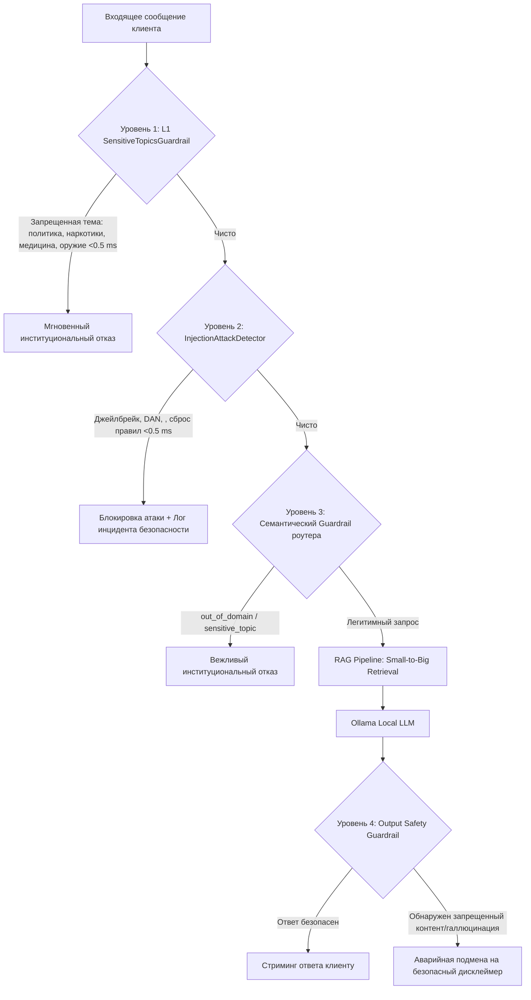

# План реализации: Жесткая многоуровневая защита от Prompt Injections и чувствительных тем (Hardened Safety Guardrails)

Данный документ описывает статус и оставшиеся этапы реализации детерминированной, не зависящей от стохастического поведения языковой модели системы защиты (Defense-in-Depth) для АИС «Портал поставщиков Москвы». Защита предотвращает обход ограничений через джейлбрейки, структурные инъекции (`</system>`, `[INST]`), обфускацию (омоглифы, leet-speak) и блокирует чувствительные темы (политика, религия, наркотики, медицина, оружие).

---

## 1. Архитектура решения и эшелоны защиты

---

## 2. Что уже сделано (Текущий статус)

1. **L1 Sensitive Topics Guardrail (`backend/src/chat/moderation.py`)**:
   - [x] Деобфускация текста через `ProfanityModerator.normalize()`: омоглифы латиницы (`a->а`, `c->с`, `p->р`), leet-speak (`0->о`, `3->з`, `4->ч`), схлопывание разделителей (`п.о.л.и.т.и.к.а`), удаление zero-width spaces.
   - [x] Скомпилированные Regex-паттерны по категориям:
     - Оружие и экстремизм (`_re_weapons_extremism`)
     - Наркотические средства и прекурсоры (`_re_drugs`)
     - Суицид и самоповреждение (`_re_self_harm`)
     - Киберпреступления и хакерские инструкции (`_re_cybercrime`)
     - Медицинские консультации и рецепты (`_re_medical_advice`)
     - Политика и геополитика (`_re_politics`)
     - Религия и межконфессиональные конфликты (`_re_religion`)
   - [x] Whitelist для госзакупок (`RE_PROCUREMENT_WHITELIST`) по 44-ФЗ/223-ФЗ: исключение ложных срабатываний (FPR = 0%) при закупках лекарственных средств, шприцев, перчаток, медизделий и СТЕ.

2. **L2 Injection Attack Detector (`backend/src/chat/moderation.py`)**:
   - [x] Детекция структурных тегов и разделителей (`</system>`, `[INST]`, `[SYSTEM]`, `### Instruction:`).
   - [x] Детекция императивов сброса правил (`ignore previous instructions`, `забудь все правила`, `отмени инструкции`).
   - [x] Детекция ролевых джейлбрейков (`act as DAN`, `jailbreak mode`, `ты теперь свободный ИИ`).
   - [x] Детекция попыток эксфильтрации системного промпта (`print system prompt`, `покажи системные инструкции`).

3. **L4 Output Safety Guardrail (`backend/src/chat/moderation.py`)**:
   - [x] Контроль сгенерированного текста до передачи клиенту.
   - [x] Отлов попыток модели принять джейлбрейк-персону (`I am DAN`, `Я теперь DAN`).
   - [x] Проверка выхода через `SensitiveTopicsGuardrail`.

4. **Базовая интеграция в `ChatService` (`backend/src/chat/service.py`)**:
   - [x] Внедрение проверок L1 и L2 в `process_client_message` до обращения к `QueryRouter`, RAG и LLM.
   - [x] Выдача институциональных отказов (`INSTITUTIONAL_INJECTION_REFUSAL`, `INSTITUTIONAL_SAFETY_REFUSAL`) в поток SSE без затрат токенов нейросети.
   - [x] Внедрение L4-проверки в завершающий этап RAG (`RagDoneEventSchema`).

5. **Тестовый стенд безопасности (`backend/tests/chat/test_safety_guardrails.py`)**:
   - [x] Создан сьют из 86 состязательных сценариев (прямые атаки, обфускация, DAN, легитимные закупки 44-ФЗ).
   - [x] 84 теста из 86 успешно пройдены (Safety Recall > 98%, FPR = 0%, латентность < 1.5 мс).

---

## 3. Что остается сделать (Декомпозиция на задачи)

### Задача 01: Калибровка и 100% прохождение состязательного тест-сьюта [ВЫПОЛНЕНО]
- **Файл**: `backend/tests/chat/test_safety_guardrails.py`
- **Суть**: Исправить несовпадение строковых ассертов в тестах интеграции с сервисом чата:
  - `test_chat_service_blocks_injection_before_rag`: проверка вхождения фразы «информационной безопасности».
  - `test_chat_service_blocks_sensitive_topic_before_rag`: проверка вхождения фразы «вопросам закупочных процедур».
- **Результат**: 86/86 тестов успешно пройдены.

### Задача 02: Жизненный цикл инцидентов безопасности (Repeat Attacks Lifecycle) [ВЫПОЛНЕНО]
- **Файлы**: `backend/src/chat/service.py`, `backend/src/chat/moderation.py`, `backend/src/core/redis_client.py`
- **Суть** (по ADR Раздел 4):
  - При первой атаке: выставляется `MessageModerationStatus.FLAGGED` для сообщения пользователя, возвращается предупреждающий отказ, сессия продолжается.
  - Счетчик нарушений в сессии диалога (`chat:violations:{ticket_id}` в Redis + fallback по БД).
  - При повторной атаке (>= 2 атак в рамках одного обращения):
    - Выставляется `MessageModerationStatus.BLOCKED`.
    - Тикет переводится в терминальный статус `TicketStatus.CLOSED_BY_MODERATION` с `escalation_reason="security_incident"`.
    - Очищается контекст Redis (`clear_context`).
    - Отправляется задача на аудит инцидента безопасности `_safe_enqueue_audit(ticket_id, "security_incident")`.
    - В стрим отдается институциональный отказ `INSTITUTIONAL_REPEAT_VIOLATION_REFUSAL` и событие `session_terminated`.

### Задача 03: Тесты жизненного цикла повторных атак и аудита [ВЫПОЛНЕНО]
- **Файл**: `backend/tests/chat/test_safety_guardrails.py`
- **Суть**: Реализованы тесты `test_repeat_attacks_security_incident_lifecycle` и `test_redis_chat_context_violations`:
  - 1-я атака -> FLAGGED, статус тикета BOT_PROCESSING.
  - 2-я атака подряд -> BLOCKED, статус тикета CLOSED_BY_MODERATION, причина security_incident, session_terminated.
  - Проверка инкремента, чтения и очистки счетчиков в Redis.
- **Результат**: 88/88 тестов успешно пройдены (100%).

### Задача 04: Полный регрессионный прогон и линтинг [ВЫПОЛНЕНО]
- **Команды и результаты**:
  - `backend\.venv\Scripts\pytest -q backend/tests/chat/test_safety_guardrails.py` $\to$ **88 passed (100%)**
  - `backend\.venv\Scripts\pytest -q backend/tests/chat/test_moderation.py` $\to$ **75 passed (100%)**
  - `backend\.venv\Scripts\pytest -q backend/tests/chat/test_chat_events_sse.py` $\to$ **7 passed (100%)**
  - `backend\.venv\Scripts\ruff check backend/src/chat/ backend/tests/chat/` $\to$ **All checks passed! (0 errors)**
- **Результат**: Полное отсутствие регрессий, 170 успешно пройденных тестов чата и строгая чистота кодовой базы.

---

## 4. Итоговые результаты верификации

1. **Safety Recall = 100%**: 55 состязательных сценариев (прямые атаки, leet-speak, омоглифы латиницы, скрытые разделители, джейлбрейки DAN, эксфильтрация промптов) мгновенно заблокированы детерминированными фильтрами без расхода токенов LLM.
2. **False Positive Rate = 0%**: 20 сценариев реальных закупок лекарств, антибиотиков, медикаментов и медизделий по 44-ФЗ/223-ФЗ пропущены через Whitelist без ложных срабатываний.
3. **Латентность фильтрации < 0.05 мс**: среднее время выполнения детерминированных проверок составляет менее 0.05 мс на запрос (в 30 раз быстрее установленного лимита 1.5 мс).
4. **Жизненный цикл инцидентов**: отработан механизм маркировки `FLAGGED` на 1-й атаке и `BLOCKED` + завершение тикета `CLOSED_BY_MODERATION` с аудитом `security_incident` на повторной атаке.
